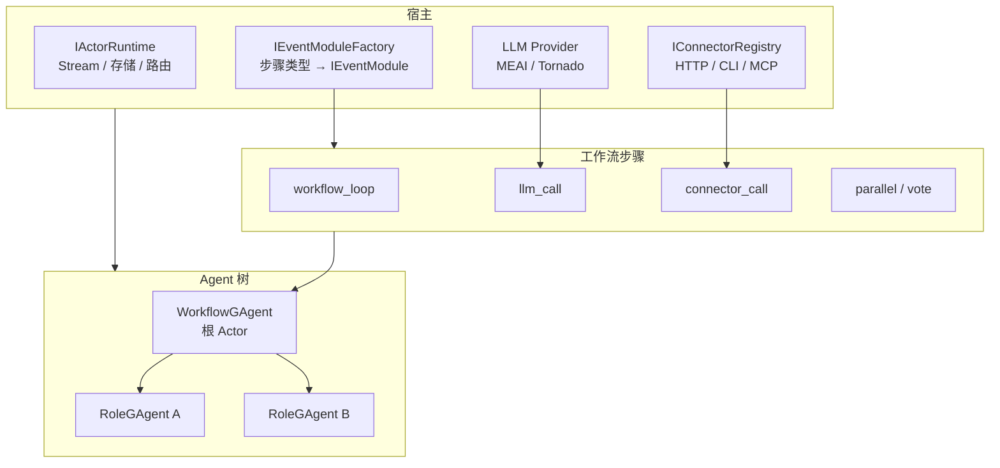
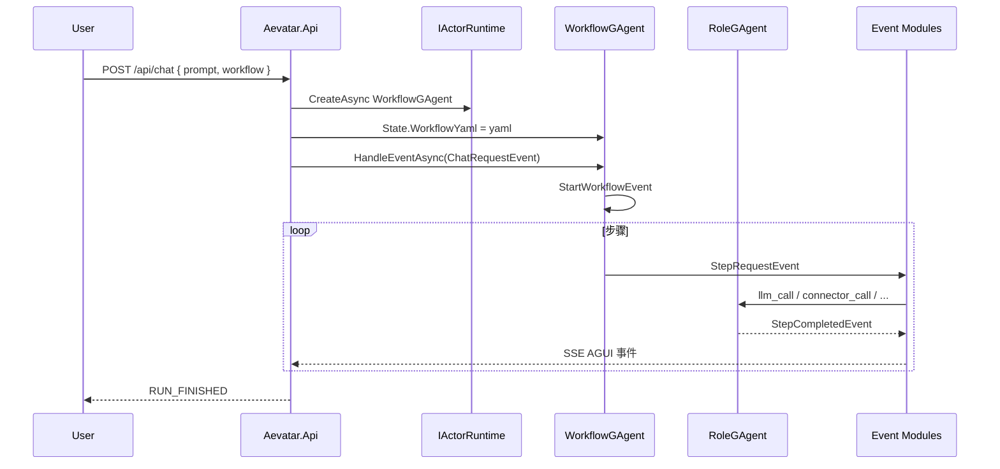

# Aevatar

Aevatar 是一个**事件驱动的 Agent-Actor 宿主框架**：负责 Agent/Actor 生命周期、事件路由与工作流编排，并通过 **EventModuleFactory** 与 **Connector** 扩展能力。内置的认知事件模块已足以用 YAML 编排复杂工作流；**通过 Aevatar.Api 的 Chat 接口即可触发工作流并流式获取结果**。

## 架构概览



- **宿主（Host）**：提供运行时（Actor/Stream/存储）、事件模块工厂、以及可选的 LLM、Connector、MCP 等注册。Aevatar.Api 已内置上述装配，开箱即可跑带 LLM 与 Connector 的工作流。
- **Agent-Actor 模型**：`WorkflowGAgent` 为根，接收用户消息并驱动工作流；按 YAML 中的 `roles` 动态创建 `RoleGAgent` 子节点，由事件 Pipeline（静态 Handler + 动态 Module）处理每一步。
- **扩展点**：
  - **IEventModuleFactory**：按步骤类型名创建 `IEventModule`。框架自带的模块见下一节「框架层 Event Modules」；可替换或包装工厂以增加自定义步骤（如 [samples/maker](samples/maker) 的 `maker_vote` / `maker_recursive`）。
  - **Connector**：在 `~/.aevatar/connectors.json` 中配置命名连接器（HTTP/CLI/MCP），工作流中通过 `connector_call` 步骤按名称调用；可在 role YAML 里为角色配置允许使用的 connector 列表。详见 [Aevatar.Config 文档](src/Aevatar.Config/README.md#connector-作用与配置)。

## 框架层 Event Modules

工作流中的每一步（如「调一次 LLM」「跑一个并行」「调一个 connector」）都由对应的 **Event Module** 处理。框架在 **Aevatar.Cognitive** 里通过 **CognitiveModuleFactory** 提供一整套内置模块，用 YAML 就能写出循环、分支、并行、投票和外部调用，无需自己写代码。

下面按用途简单列一下这些模块在做什么；YAML 里步骤的 `type` 填的就是这里写的类型名（部分类型有别名，如 `parallel` / `fan_out` 都指向同一模块）。

**流程控制**

- **workflow_loop**：工作流引擎本身，负责按步骤顺序派发 `StepRequestEvent`、收 `StepCompletedEvent`、推进到下一步或结束。
- **conditional**：条件分支，根据上一步输出或参数决定下一步走哪条分支。
- **while / loop**：循环，在条件满足时重复执行子步骤。
- **workflow_call / sub_workflow**：调用子工作流，把当前输出当输入传进去，用子工作流的输出继续。
- **checkpoint**：检查点，把当前输入原样输出，便于调试或做阶段快照。
- **assign**：变量赋值，从输入或参数里取值写入工作流变量，供后续步骤使用。

**并行与共识**

- **parallel_fanout / parallel / fan_out**：把一步拆成多路并行，每路可以指定不同 role（如多个 worker），等所有子步完成后再汇总。
- **vote_consensus**：通用投票共识，对多条候选做聚合（例如按多数决）。

**迭代**

- **foreach / for_each**：按分隔符把输入拆成多段，对每一段执行同一子步骤（可再配合 parallel、vote 等），最后按顺序拼回结果。

**执行**

- **llm_call**：把当前输入加上可选前缀/后缀，以 **ChatRequestEvent** 发给指定 role 的 RoleGAgent，用该角色的 LLM 配置生成回复，回复作为本步输出。
- **tool_call**：调用已注册的 Agent 工具（如 MCP、Skills），把结果作为步骤输出。
- **connector_call**：按名称调用在 `~/.aevatar/connectors.json` 里配置的 Connector（HTTP/CLI/MCP）；若步骤带了 `role`，会按该角色在 YAML 里配置的 `connectors` 列表做权限校验。详见 [Connector 配置](src/Aevatar.Config/README.md#connector-作用与配置)。

**数据**

- **transform**：对输入做简单变换（如替换、截断），或按模板生成新内容。
- **retrieve_facts**：从上下文或存储中检索事实，拼进当前输入供后续步骤使用。

以上模块已经覆盖「顺序 / 分支 / 循环 / 并行 / 投票 / LLM / 工具 / 外部 Connector / 数据整理」等常见需求；业务或领域特有的步骤可以通过**自定义 EventModuleFactory**（在工厂里多返回几种模块）或 **Connector** 扩展。

## Maker Sample 的扩展模块

[samples/maker](samples/maker) 在框架原语之上增加了两个**仅在该示例中使用的** Event Module，用来实现论文 [Solving a Million-Step LLM Task with Zero Errors](https://arxiv.org/html/2511.09030v1) 里的 MAKER 模式（极端分解 + 投票纠错 + Red-Flag）。示例通过自己的 **MakerModuleFactory** 注册这两个模块，和框架的 CognitiveModuleFactory 一起交给 WorkflowGAgent，这样 YAML 里就可以写 `type: maker_vote` 和 `type: maker_recursive`。

- **maker_vote**：实现「first-to-ahead-by-k」投票，并带 Red-Flag 过滤。上一步输出里多路候选用 `\n---\n` 分隔；模块会先丢掉超长或格式异常的候选（red-flag），再在剩余候选中统计票数，只有某一条领先第二名至少 k 票时才输出该条，否则本步失败（可配置重试或降级）。这样每个「原子子任务」或「分解/组合」阶段都由多 agent 独立产出、投票决出唯一结果，减少单点错误。

- **maker_recursive**：实现整棵 MAKER 递归树。入口收到一个任务文本后，先做**原子性投票**（多路 coordinator 判断是 ATOMIC 还是 DECOMPOSE）；若是 ATOMIC，就对当前任务做**叶节点求解投票**（多 worker 独立作答再 maker_vote）；若是 DECOMPOSE，先做**分解投票**得到子任务列表，再对每个子任务递归调用 maker_recursive，最后对子结果做**组合投票**。内部每一阶段都复用 parallel + maker_vote，只是 worker 配置和 prompt 不同（由 YAML 的 `atomic_workers` / `decompose_workers` / `solve_workers` / `compose_workers` 等参数指定）。这样就把「大任务 → 原子判断 → 分解 / 直接求解 → 递归组合」整条链路用一个步骤类型表达，便于在单步里看到完整 MAKER 流程。

Maker 工作流里最后一步通常还会用框架自带的 **connector_call** 做可选后处理（例如格式化、打标、写外部系统），并给 coordinator 角色在 YAML 里配置 `connectors: [maker_post_processor]`，体现「中心化 Connector 配置 + 按 role 分配能力」的用法。

## 通过 Chat 接口调用框架能力

**Aevatar.Api** 提供 HTTP 入口，是触发工作流、获取流式结果的主要方式：

- **POST /api/chat**：创建或复用 `WorkflowGAgent`，传入 `{ "prompt": "用户输入", "workflow": "工作流名称" }`，响应为 SSE 流，推送 AGUI 事件（运行开始/步骤完成/消息片段/运行结束等）。
- **GET /api/agents**：列出当前活跃 Agent。
- **GET /api/workflows**：列出已加载的工作流名称。

当前 **Aevatar.Api** 已装配：

- **~/.aevatar/** 配置（`config.json`、`secrets.json`、`connectors.json`）；
- **LLM**：从环境变量 `DEEPSEEK_API_KEY` / `OPENAI_API_KEY` 或 `secrets.json` 读取 API Key，注册 MEAI Provider（DeepSeek 或 OpenAI）；
- **Connector**：启动时从 `~/.aevatar/connectors.json` 加载并注册到 `IConnectorRegistry`（支持 http/cli/mcp）；
- **工作流**：从应用目录 `workflows/` 与 `~/.aevatar/workflows` 加载 YAML。

因此，**使用 Aevatar.Api 的 Chat 接口即可完整调用框架的编排、LLM、Connector 等能力**；若需 MCP 工具或自定义 Module，可参考 [Aevatar.Gateway](src/Aevatar.Gateway) 或 [samples/maker](samples/maker) 的装配方式。

### 请求流示意



## 仓库结构

```text
aevatar/
├── docs/
│   └── FOUNDATION.md           # 底层契约与 Pipeline 设计
├── workflows/                   # 仓库根工作流（simple_qa / summarize / brainstorm）
├── src/
│   ├── Aevatar.Abstractions    # 契约：IAgent / IActor / IEventModule / IConnector 等
│   ├── Aevatar.Core            # GAgent 基类、EventPipeline、StateGuard
│   ├── Aevatar.Runtime         # 本地 Actor 运行时、Stream、存储、DI
│   ├── Aevatar.Cognitive       # WorkflowGAgent、CognitiveModuleFactory、内置 Modules
│   ├── Aevatar.AI              # RoleGAgent、LLM 集成、ChatRuntime
│   ├── Aevatar.AGUI            # AGUI 事件与 SSE 投影
│   ├── Aevatar.Api             # HTTP 宿主：Chat 端点 + LLM/Connector 装配
│   ├── Aevatar.Config         # ~/.aevatar 配置与 Connector 配置模型
│   ├── Aevatar.Gateway        # 可组合网关（可选 LLM/MCP/Skills）
│   └── Aevatar.AI.MEAI / .MCP / .Skills  # LLM 与工具扩展
├── demos/
│   └── Aevatar.Demo.Cli       # CLI 演示（事件传播与报告）
├── samples/
│   └── maker                  # MAKER 模式示例（自定义 Module + Connector）
└── test/
    └── Aevatar.*.Tests
```

## 快速开始

### 1. 运行测试

```bash
dotnet test test/Aevatar.Core.Tests/Aevatar.Core.Tests.csproj
```

### 2. 运行 Aevatar.Api（推荐）

使用 Chat 接口跑带 `llm_call` 的工作流（如 `simple_qa`）前，需要先配置 **LLM API Key**，否则会报「Provider 未注册」类错误。任选一种方式即可：

| 方式 | 说明 |
|------|------|
| **环境变量** | `export DEEPSEEK_API_KEY="sk-..."` 或 `export OPENAI_API_KEY="sk-..."`。若设置了 `DEEPSEEK_API_KEY`，Api 会默认使用 DeepSeek；否则用 OpenAI。也可用 `AEVATAR_LLM_API_KEY` 作为通用 Key。 |
| **~/.aevatar/secrets.json** | 明文 JSON，例如：`{ "LLMProviders:Providers:deepseek:ApiKey": "sk-..." }` 或 `{ "LLMProviders:Providers:openai:ApiKey": "sk-..." }`。默认 Provider 可通过 `LLMProviders:Default` 指定。详见 [Aevatar.Config 配置说明](src/Aevatar.Config/README.md)。 |

配置后，Api 启动时会从环境变量或 secrets 读取 Key 并注册 MEAI Provider；工作流中的 `llm_call` 步骤会使用对应角色在 YAML 里配置的 `provider` / `model`（未写则用默认 DeepSeek）。

**推荐从仓库根目录启动**，这样会加载 repo 根目录下的 `workflows/`（无需拷贝到 `~/.aevatar`）：

```bash
cd /path/to/aevatar
dotnet run --project src/Aevatar.Api
```

工作流 YAML 可从以下位置加载（按优先级合并）：`src/Aevatar.Api/workflows/`、**仓库根目录 `workflows/`**、当前工作目录 `workflows/`、`~/.aevatar/workflows/`。仓库根已自带 `simple_qa`、`summarize`、`brainstorm` 三个示例工作流。

#### 用 Chat API 跑一次

确保已按上文配置好 LLM API Key，否则 `simple_qa` 等含 `llm_call` 的工作流会无法完成步骤。

1. **查看可用工作流**：`GET /api/workflows`，返回例如 `["simple_qa", "summarize", "brainstorm"]`。
2. **发起一次对话**：`POST /api/chat`，请求体 JSON：`{ "prompt": "你的问题或长文本", "workflow": "simple_qa" }`（或 `summarize` / `brainstorm`）。请求头需带 `Accept: text/event-stream`，响应为 SSE 流，包含运行开始、步骤完成、消息片段、运行结束等 AGUI 事件。
3. 示例（curl）：

```bash
curl -X POST http://localhost:5000/api/chat \
  -H "Content-Type: application/json" \
  -H "Accept: text/event-stream" \
  -d '{"prompt": "什么是 MAKER 模式？", "workflow": "simple_qa"}'
```

每次 Chat 运行结束后，Api 会在仓库根目录的 `artifacts/chat-runs/` 下生成带时间戳的 JSON 与 HTML 执行报告，便于排查与复现。

可选：在 `~/.aevatar/connectors.json` 中配置 Connector，工作流中即可使用 `connector_call` 步骤。

### 3. 运行 CLI Demo

```bash
dotnet run --project demos/Aevatar.Demo.Cli -- list
dotnet run --project demos/Aevatar.Demo.Cli -- run hierarchy --web artifacts/demo/hierarchy.html
```

用于查看事件传播与 Pipeline 行为，不依赖工作流或 LLM。

## Agent 分层约定（命名规则）

| 后缀 | 职责 | 典型位置 |
|------|------|----------|
| **GAgent** | 运行时与框架能力：事件分发、状态、路由、模块装配 | Core + Cognitive（如 WorkflowGAgent） |
| **Agent** | 业务与领域逻辑：领域事件、状态推进、策略 | 基于 GAgent 扩展或自定义 Module/Connector |

## 文档与后续

- 底层事件模型与 Pipeline： [docs/FOUNDATION.md](docs/FOUNDATION.md)
- Connector 配置与示例： [src/Aevatar.Config/README.md](src/Aevatar.Config/README.md#connector-作用与配置)
- 后续方向：更多宿主模板（如默认带 MCP 的 Api）、可观测与调试体验、可视化拓扑与时间线
