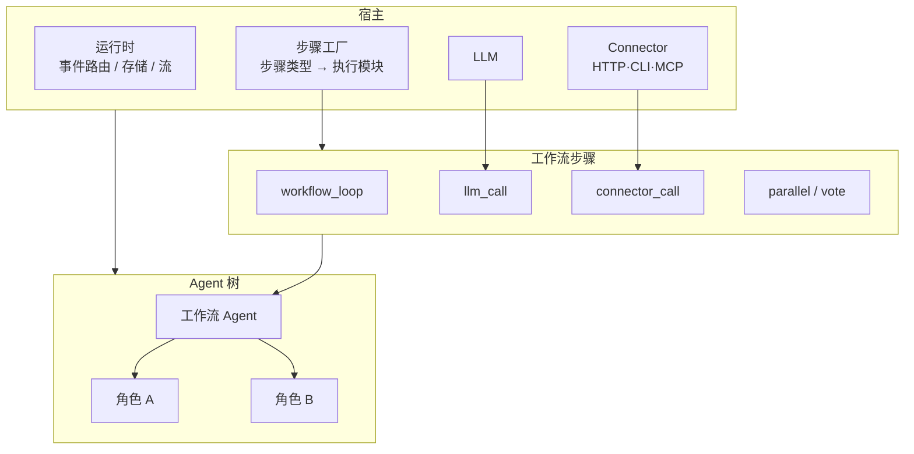
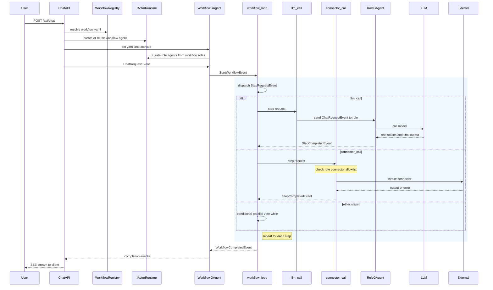
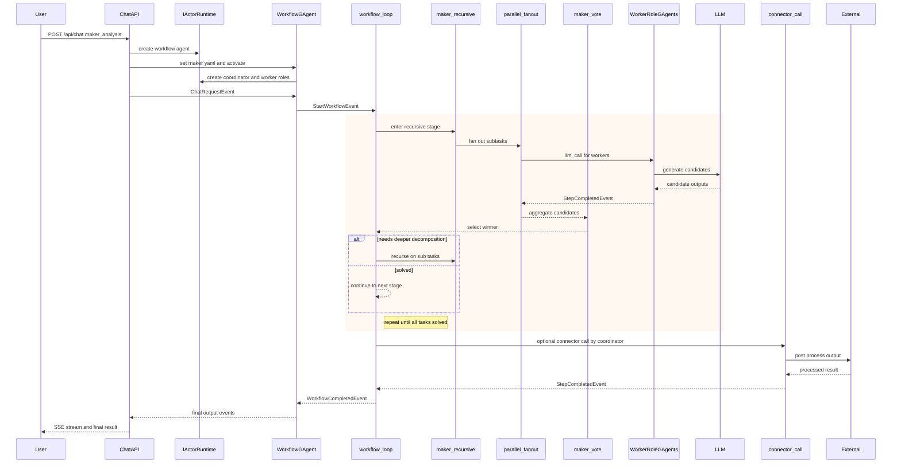

# Aevatar

Aevatar 是一个 **AI Agent 工作流框架**：用 YAML 定义多步工作流（调用 LLM、并行、投票、外部接口等），通过 **HTTP Chat 接口** 触发并流式拿到结果。  
适合「略懂技术、熟悉 AI Agent 概念、想快速接工作流或二次开发」的读者；不要求熟悉 .NET。

---

## 你能做什么

- **跑现成工作流**：启动内置 API 服务，用 `POST /api/chat` 传入提示词和工作流名，以 SSE 流接收运行过程与结果。
- **用 YAML 编工作流**：在 YAML 里写步骤类型（如 `llm_call`、`parallel`、`connector_call`），无需写代码即可组合顺序、分支、循环、并行与投票。
- **接 LLM 与外部能力**：配置 API Key 和 Connector（HTTP/CLI/MCP），工作流里按名称调用。
- **扩展步骤与 Connector**：需要自定义步骤或工具时，可扩展框架的模块与 Connector 配置。

**不熟悉 .NET 也没关系**：日常使用只需配置 + 启动 API + 发 HTTP 请求；涉及「仓库结构」「模块列表」时，按需查阅即可。

---

## 快速开始（三步）

### 1. 配置 LLM API Key

任选一种方式，让框架能调用 LLM（如 DeepSeek / OpenAI）：

| 方式 | 做法 |
|------|------|
| **环境变量** | 终端里执行：`export DEEPSEEK_API_KEY="sk-..."` 或 `export OPENAI_API_KEY="sk-..."`。 |
| **配置文件** | 在 `~/.aevatar/secrets.json` 里写 Provider 与 API Key，详见 [配置说明](src/Aevatar.Configuration/README.md)。 |
| **配置工具（推荐）** | 运行 `dotnet run --project tools/Aevatar.Tools.Config`，在浏览器里填 API Key 并保存。 |

### 2. 启动 API 服务

在仓库根目录执行：

```bash
dotnet run --project src/Aevatar.Hosts.Api
```

服务会加载根目录下的 `workflows/` 以及 `~/.aevatar` 中的配置与工作流。

### 3. 发一次 Chat 请求

- 查看可用工作流：`GET http://localhost:5000/api/workflows`
- 发起对话：`POST http://localhost:5000/api/chat`，请求体示例：

```json
{ "prompt": "你的问题或长文本", "workflow": "simple_qa" }
```

请求头带上 `Accept: text/event-stream`，响应为 SSE 流（运行开始、步骤完成、消息片段、运行结束等）。  
示例（命令行）：

```bash
curl -X POST http://localhost:5000/api/chat \
  -H "Content-Type: application/json" \
  -H "Accept: text/event-stream" \
  -d '{"prompt": "什么是 MAKER 模式？", "workflow": "simple_qa"}'
```

运行结束后，仓库根目录的 `artifacts/workflow-executions/` 下会生成本次运行的 JSON 与 HTML 报告。

---

## 架构一眼看懂

- **你**：通过 HTTP 调用 **Aevatar.Hosts.Api**（Chat 接口）。
- **Api**：根据工作流名创建或复用「工作流 Agent」，把提示词当事件发进去。
- **工作流 Agent**：按 YAML 里的步骤顺序，一步步派发任务（例如「这一步调 LLM」「这一步调外部接口」）。
- **步骤**：由对应的「步骤模块」执行（LLM 调用、并行、投票、Connector 等），结果再交回工作流，进入下一步或结束。
- **结果**：通过事件流推回 Api，再通过 SSE 推给你。

下面这张图概括了「宿主（API + 运行时 + LLM + Connector）」与「Agent 树 + 工作流步骤」的关系。



- **宿主**：提供运行时、步骤执行能力、LLM、Connector。Aevatar.Hosts.Api 已把这些组装好，开箱可用。
- **Agent 树**：工作流 Agent 为根，按 YAML 中的角色创建子 Agent；事件在父子之间按「方向」路由（当前节点 / 父 / 子）。
- **步骤模块**：每一步对应一种类型（如 `llm_call`、`connector_call`），由框架内置或你扩展的模块执行。

### 执行时序图（框架 Pipeline）

下面这张图从 `POST /api/chat` 开始，展示通用工作流执行路径：Cognitive 加载 YAML、创建 roles、步骤执行、role 通过 connector 调外部服务、最后 SSE 返回结果。



### 执行时序图（Maker Sample）

下面这张图是 maker sample 的同类流程：在通用 pipeline 上叠加 `maker_recursive` / `maker_vote`，并可在末尾通过 connector 做外部后处理。



---

## 工作流里能写哪些步骤

在 YAML 里给步骤填 `type: xxx` 即可。下面按用途分类，**不必全记**，用到时查即可。

| 用途 | 步骤类型 | 说明 |
|------|----------|------|
| **流程** | `workflow_loop` | 工作流引擎，按顺序推进步骤。 |
| | `conditional` | 条件分支。 |
| | `while` / `loop` | 循环。 |
| | `workflow_call` / `sub_workflow` | 调用子工作流。 |
| | `assign` | 变量赋值。 |
| **并行与共识** | `parallel` / `fan_out` | 多路并行，可指定不同角色。 |
| | `vote_consensus` | 投票共识。 |
| **执行** | `llm_call` | 把当前内容发给指定角色的 LLM，回复作为本步输出。 |
| | `tool_call` | 调用已注册工具（如 MCP、Skills）。 |
| | `connector_call` | 按名称调用 Connector（在 `~/.aevatar/connectors.json` 配置）。 |
| **数据** | `transform` | 对输入做变换或按模板生成。 |
| | `retrieve_facts` | 从上下文/存储检索事实。 |

更多细节与 Connector 配置见 [Aevatar.Configuration](src/Aevatar.Configuration/README.md#connector-作用与配置)。

---

## 仓库结构（按需查阅）

```
aevatar/
├── docs/
│   ├── FOUNDATION.md       # 底层事件与 Pipeline 设计
│   ├── ROLE.md             # Role、Workflow YAML、Connector 与外部服务
│   └── EVENT_SOURCING.md   # Event Sourcing 使用说明
├── workflows/              # 示例工作流（simple_qa、summarize、brainstorm）
├── src/
│   ├── Aevatar.Hosts.Api   # HTTP 服务入口（Chat 等），日常使用从这里启动
│   ├── Aevatar.Workflows.Core   # 工作流引擎与内置步骤模块
│   ├── Aevatar.AI.Core     # 角色 Agent 与 LLM 集成
│   ├── Aevatar.Foundation.Runtime  # 运行时（事件路由、存储、流）
│   ├── Aevatar.Foundation.Core     # Agent 基类与事件管道
│   ├── Aevatar.Foundation.Abstractions # 接口与契约
│   ├── Aevatar.Configuration  # 配置与 Connector 模型
│   ├── Aevatar.Hosts.Gateway  # 可组合网关（可选 MCP/Skills）
│   └── Aevatar.AI.LLMProviders.MEAI / Aevatar.AI.ToolProviders.MCP / Aevatar.AI.ToolProviders.Skills  # LLM 与工具扩展
├── tools/
│   └── Aevatar.Tools.Config  # aevatar-config（Web 界面配置 API Key）
├── samples/
│   └── maker               # MAKER 模式示例（自定义步骤 + Connector）
├── demos/
│   └── Aevatar.Demos.Cli   # CLI 演示
└── test/                   # 测试
```

你主要会接触：**workflows/**（改或加 YAML）、**src/Aevatar.Hosts.Api**（启动服务）、**~/.aevatar/**（配置与 Connector）。其余目录在二次开发或排查问题时再看不迟。

---

## 文档与进阶

- **底层设计**： [docs/FOUNDATION.md](docs/FOUNDATION.md) — 事件模型与 Pipeline。
- **Role 与 Connector**： [docs/ROLE.md](docs/ROLE.md) — Workflow YAML 中的角色、Connector 配置、把 MCP/CLI/API 当角色能力。
- **Event Sourcing**： [docs/EVENT_SOURCING.md](docs/EVENT_SOURCING.md) — 如何开启事件溯源。
- **Connector 配置详解**： [src/Aevatar.Configuration/README.md](src/Aevatar.Configuration/README.md#connector-作用与配置) — 配置格式与示例。
- **Maker 示例**： [samples/maker](samples/maker) — 自定义步骤类型与 MAKER 工作流。

---

## 给开发者

- **运行测试**：`dotnet test test/Aevatar.Foundation.Core.Tests/Aevatar.Foundation.Core.Tests.csproj`
- **CLI 演示**（不看 LLM，只看事件流）：  
  `dotnet run --project demos/Aevatar.Demos.Cli -- run hierarchy --web artifacts/demo/hierarchy.html`
- **Agent 命名约定**：带 **GAgent** 的类负责框架能力（事件分发、状态、路由）；业务逻辑放在基于 GAgent 的扩展或自定义步骤/Connector 里。
