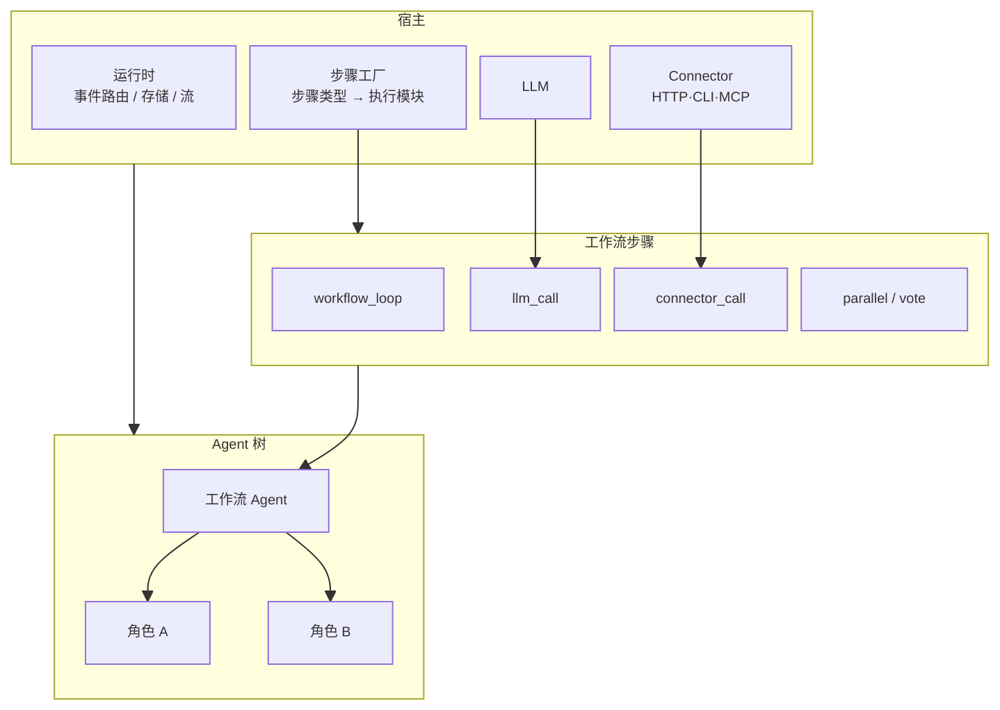
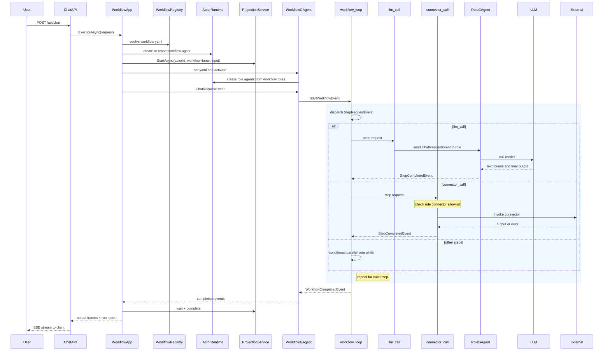
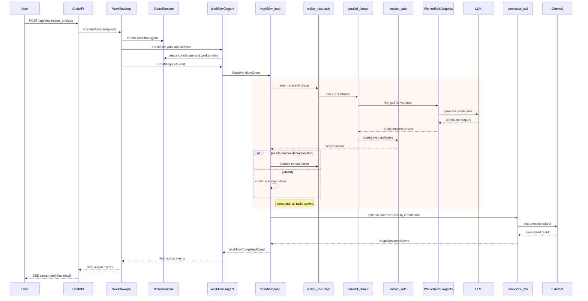

# Aevatar

Aevatar 是一个 **AI Agent 工作流框架**：用 YAML 定义多步工作流（调用 LLM、并行、投票、外部接口等），通过 **HTTP Chat 接口（SSE / WebSocket）** 触发并流式拿到结果。  
适合「略懂技术、熟悉 AI Agent 概念、想快速接工作流或二次开发」的读者；不要求熟悉 .NET。

---

## 你能做什么

- **跑现成工作流**：启动内置 API 服务，用 `POST /api/chat` 传入提示词和工作流名，以 SSE 流接收运行过程与结果。
- **用 YAML 编工作流**：在 YAML 里写步骤类型（如 `llm_call`、`parallel`、`connector_call`），无需写代码即可组合顺序、分支、循环、并行与投票。
- **接 LLM 与外部能力**：配置 API Key 和 Connector（HTTP/CLI/MCP），工作流里按名称调用。
- **扩展步骤与 Connector**：需要自定义步骤或工具时，可扩展框架的模块与 Connector 配置。

**不熟悉 .NET 也没关系**：日常使用只需配置 + 启动 API + 发 HTTP 请求；涉及「仓库结构」「模块列表」时，按需查阅即可。

---

## 快速开始（三步）

### 1. 配置 LLM API Key

任选一种方式，让框架能调用 LLM（如 DeepSeek / OpenAI）：

| 方式 | 做法 |
|------|------|
| **环境变量** | 终端里执行：`export DEEPSEEK_API_KEY="sk-..."` 或 `export OPENAI_API_KEY="sk-..."`。 |
| **配置文件** | 在 `~/.aevatar/secrets.json` 里写 Provider 与 API Key，详见 [配置说明](src/Aevatar.Configuration/README.md)。 |
| **配置工具（推荐）** | 运行 `dotnet run --project tools/Aevatar.Tools.Config`，在浏览器里填 API Key 并保存。 |

### 2. 启动 API 服务

在仓库根目录执行：

```bash
dotnet run --project src/workflow/Aevatar.Workflow.Host.Api
```

服务会加载根目录下的 `workflows/` 以及 `~/.aevatar` 中的配置与工作流。  
生产/统一入口推荐直接启动 Mainnet：

```bash
dotnet run --project src/Aevatar.Mainnet.Host.Api
```

### 3. 发一次 Chat 请求

- 查看可用工作流：`GET http://localhost:5000/api/workflows`
- 发起对话：`POST http://localhost:5000/api/chat`，请求体示例：

```json
{ "prompt": "你的问题或长文本", "workflow": "simple_qa" }
```

请求头带上 `Accept: text/event-stream`，响应为 SSE 流（运行开始、步骤完成、消息片段、运行结束等）。  
示例（命令行）：

```bash
curl -X POST http://localhost:5000/api/chat \
  -H "Content-Type: application/json" \
  -H "Accept: text/event-stream" \
  -d '{"prompt": "什么是 MAKER 模式？", "workflow": "simple_qa"}'
```

运行结束后，仓库根目录的 `artifacts/workflow-executions/` 下会生成本次运行的 JSON 与 HTML 报告。
（可通过 `WorkflowExecutionProjection` 配置开关控制）

---

## 架构一眼看懂

- **Mainnet Host**：`Aevatar.Mainnet.Host.Api` 作为默认统一入口，内置 Workflow Capability。
- **Workflow Api**：`Aevatar.Workflow.Host.Api` 只做协议适配（HTTP/SSE/WebSocket）并调用 Application 层，不直接编排工作流。
- **Maker Extension**：作为 Workflow 插件装配到 Mainnet，不再单独提供 Maker Host/API。
- **Workflow Application**：解析/创建 Actor、启动投影 run、发送请求事件、等待收敛并输出查询结果。
- **工作流 Agent**：按 YAML 里的步骤顺序，一步步派发任务（例如「这一步调 LLM」「这一步调外部接口」）。
- **步骤**：由对应的「步骤模块」执行（LLM 调用、并行、投票、Connector 等），结果再交回工作流，进入下一步或结束。
- **结果**：事件先进入统一 Projection Pipeline，再由 API 通过 SSE / WebSocket 推给你。

### Run 语义（重要）

- 同一 Actor 多次运行时，默认**不按 run 隔离事件流**，客户端可收到该 Actor 的全量事件。
- 单次请求只在“当前 runId 的终止事件”到达时结束（`RUN_FINISHED` / `RUN_ERROR`）。
- `RUN_STARTED` 由 `StartWorkflowEvent` 投影统一生成，`threadId` 为发布该事件的 ActorId。
- `runId` 与内部 `sessionId` 都由服务端生成；客户端请求只需 `prompt/workflow/agentId`。

### 当前实现与目标态（分布式 Runtime）

| 主题 | 当前实现（2026-02-22） | 目标态（生产分布式） |
|---|---|---|
| Actor Runtime | 默认 `ActorRuntime:Provider=InMemory`，适合开发/测试。 | 使用非 InMemory Provider（Redis/数据库等）与分布式 Actor Runtime。 |
| Orleans Transport | `ActorRuntime:Provider=Orleans` 默认仍走内置链路；可选 `ActorRuntime:Transport=Kafka` 启用 MassTransit/Kafka 传输插件。 | 生产按部署拓扑启用可插拔 transport，并统一由 stream/queue 层承载跨节点转发。 |
| Projection 启动并发（Ensure/Release） | 已由 `projection:{rootActorId}` 投影协调 Actor 串行裁决，不再依赖进程内 `SemaphoreSlim`。 | 分布式 Runtime 下继续依赖“同一 actorId 单激活 + 邮箱串行”保证并发互斥。 |
| LiveSink 绑定（Attach/Detach） | 已通过 `workflow-run:{actorId}:{commandId}` 事件流订阅/退订；不再依赖 `ProjectionContext` 内存 sink 列表。 | 在分布式 stream provider 下天然支持跨节点推送；生产需保障 provider 可用性与顺序语义。 |
| ReadModel 存储 | 默认通过 `Aevatar.CQRS.Projection.Providers.InMemory` 注册通用 InMemory Store，可按 Provider 机制替换。 | 生产默认切换到持久化读模型 Provider，实现跨节点一致读。 |
| 架构方案评分口径（文档） | 仅评估架构设计与文档完整性，不因未实施状态扣分。 | 记录实施缺口为风险/建议项，不作为扣分。 |
| 实施评分口径（代码） | 以“当前已落地代码”为准评分。 | 目标态能力上线后，评分按实现结果重新审计。 |

下面这张图概括了「宿主（API + 运行时 + LLM + Connector）」与「Agent 树 + 工作流步骤」的关系。


```mermaid
%%{init: {"maxTextSize": 100000, "flowchart": {"useMaxWidth": false, "nodeSpacing": 10, "rankSpacing": 50}, "themeVariables": {"fontSize": "10px"}}}%%
flowchart TB
    subgraph host["宿主"]
        Runtime["运行时\n事件路由 / 存储 / 流"]
        Factory["步骤工厂\n步骤类型 → 执行模块"]
        LLM["LLM"]
        Connectors["Connector\nHTTP·CLI·MCP"]
    end

    subgraph agents["Agent 树"]
        Workflow["工作流 Agent"]
        RoleA["角色 A"]
        RoleB["角色 B"]
    end

    subgraph steps["工作流步骤"]
        M1["workflow_loop"]
        M2["llm_call"]
        M3["connector_call"]
        M4["parallel / vote"]
    end

    host --> agents
    Factory --> steps
    steps --> Workflow
    Workflow --> RoleA
    Workflow --> RoleB
    LLM --> M2
    Connectors --> M3
```

- **宿主**：提供运行时、步骤执行能力、LLM、Connector。当前以 Mainnet/Workflow 两个 Host 为主；Maker 以插件方式装配到 Mainnet。
- **Agent 树**：工作流 Agent 为根，按 YAML 中的角色创建子 Agent；事件在父子之间按「方向」路由（当前节点 / 父 / 子）。
- **步骤模块**：每一步对应一种类型（如 `llm_call`、`connector_call`），由框架内置或你扩展的模块执行。

### 执行时序图（框架 Pipeline）

下面这张图从 `POST /api/chat` 开始，展示通用工作流执行路径：Cognitive 加载 YAML、创建 roles、步骤执行、role 通过 connector 调外部服务、最后 SSE 返回结果。


```mermaid
%%{init: {"maxTextSize": 100000, "flowchart": {"useMaxWidth": false, "nodeSpacing": 10, "rankSpacing": 50}, "themeVariables": {"fontSize": "10px"}}}%%
sequenceDiagram
    participant User
    participant API as ChatAPI
    participant App as WorkflowApp
    participant Registry as WorkflowRegistry
    participant Runtime as IActorRuntime
    participant Projection as ProjectionService
    participant Workflow as WorkflowGAgent
    participant Engine as workflow_loop
    participant LlmStep as llm_call
    participant ConnStep as connector_call
    participant Role as RoleGAgent
    participant LLM
    participant External

    User->>API: POST /api/chat
    API->>App: ExecuteAsync(request)
    App->>Registry: resolve workflow yaml
    App->>Runtime: create or reuse workflow agent
    App->>Projection: StartAsync(actorId, workflowName, input)
    App->>Workflow: set yaml and activate
    Workflow->>Runtime: create role agents from workflow roles
    App->>Workflow: ChatRequestEvent
    Workflow->>Engine: StartWorkflowEvent

    rect rgb(240, 248, 255)
        Engine->>Engine: dispatch StepRequestEvent
        alt llm_call
            Engine->>LlmStep: step request
            LlmStep->>Role: send ChatRequestEvent to role
            Role->>LLM: call model
            LLM-->>Role: text tokens and final output
            Role-->>Engine: StepCompletedEvent
        else connector_call
            Engine->>ConnStep: step request
            Note over ConnStep: check role connector allowlist
            ConnStep->>External: invoke connector
            External-->>ConnStep: output or error
            ConnStep-->>Engine: StepCompletedEvent
        else other steps
            Engine-->>Engine: conditional parallel vote while
        end
        Note right of Engine: repeat for each step
    end

    Engine-->>Workflow: WorkflowCompletedEvent
    Workflow-->>App: completion events
    App->>Projection: wait + complete
    App-->>API: output frames + run report
    API-->>User: SSE stream to client
```

### 执行时序图（Maker Sample）

下面这张图是 maker sample 的同类流程：在通用 pipeline 上叠加 `maker_recursive` / `maker_vote`，并可在末尾通过 connector 做外部后处理。


```mermaid
%%{init: {"maxTextSize": 100000, "flowchart": {"useMaxWidth": false, "nodeSpacing": 10, "rankSpacing": 50}, "themeVariables": {"fontSize": "10px"}}}%%
sequenceDiagram
    participant User
    participant API as ChatAPI
    participant App as WorkflowApp
    participant Runtime as IActorRuntime
    participant Workflow as WorkflowGAgent
    participant Engine as workflow_loop
    participant Recursive as maker_recursive
    participant Parallel as parallel_fanout
    participant Vote as maker_vote
    participant Workers as WorkerRoleGAgents
    participant LLM
    participant Post as connector_call
    participant External

    User->>API: POST /api/chat maker_analysis
    API->>App: ExecuteAsync(request)
    App->>Runtime: create workflow agent
    App->>Workflow: set maker yaml and activate
    Workflow->>Runtime: create coordinator and worker roles
    App->>Workflow: ChatRequestEvent
    Workflow->>Engine: StartWorkflowEvent

    rect rgb(255, 248, 240)
        Engine->>Recursive: enter recursive stage
        Recursive->>Parallel: fan out subtasks
        Parallel->>Workers: llm_call for workers
        Workers->>LLM: generate candidates
        LLM-->>Workers: candidate outputs
        Workers-->>Parallel: StepCompletedEvent
        Parallel-->>Vote: aggregate candidates
        Vote-->>Engine: select winner
        alt needs deeper decomposition
            Engine->>Recursive: recurse on sub tasks
        else solved
            Engine-->>Engine: continue to next stage
        end
        Note right of Engine: repeat until all tasks solved
    end

    Engine->>Post: optional connector call by coordinator
    Post->>External: post process output
    External-->>Post: processed result
    Post-->>Engine: StepCompletedEvent

    Engine-->>Workflow: WorkflowCompletedEvent
    Workflow-->>App: final output events
    App-->>API: final output events
    API-->>User: SSE stream and final result
```

---

## 工作流里能写哪些步骤

在 YAML 里给步骤填 `type: xxx` 即可。下面按用途分类，**不必全记**，用到时查即可。

| 用途 | 步骤类型 | 说明 |
|------|----------|------|
| **流程** | `workflow_loop` | 工作流引擎，按顺序推进步骤。 |
| | `conditional` | 条件分支。 |
| | `while` / `loop` | 循环。 |
| | `workflow_call` / `sub_workflow` | 调用子工作流。 |
| | `assign` | 变量赋值。 |
| **并行与共识** | `parallel` / `fan_out` | 多路并行，可指定不同角色。 |
| | `vote_consensus` | 投票共识。 |
| **执行** | `llm_call` | 把当前内容发给指定角色的 LLM，回复作为本步输出。 |
| | `tool_call` | 调用已注册工具（如 MCP、Skills）。 |
| | `connector_call` | 按名称调用 Connector（在 `~/.aevatar/connectors.json` 配置）。 |
| **数据** | `transform` | 对输入做变换或按模板生成。 |
| | `retrieve_facts` | 从上下文/存储检索事实。 |

更多细节与 Connector 配置见 [Aevatar.Configuration](src/Aevatar.Configuration/README.md#connector-作用与配置)。

---

## 代码组织与职责边界（重点）

### 分层口径（对应代码组织）

| 层 | 主要项目 | 职责 | 边界约束 |
|---|---|---|---|
| **Domain / Core** | `Aevatar.Foundation.Abstractions` / `Aevatar.Foundation.Core` / `Aevatar.AI.Abstractions` / `Aevatar.AI.Core` / `workflow/Aevatar.Workflow.Core` / `workflow/Aevatar.Workflow.Abstractions` | 领域语义、执行原语、事件与状态模型、工作流步骤模块 | 不放协议适配与宿主编排；`Workflow.Core` 不反向依赖 `AI.Core` |
| **Application** | `workflow/Aevatar.Workflow.Application.Abstractions` / `workflow/Aevatar.Workflow.Application` / `Aevatar.CQRS.Core*` | 命令执行编排、查询服务、应用层端口 | 通过抽象依赖 Domain/Projection，不直接耦合 Host 细节 |
| **Projection / Read Side** | `Aevatar.CQRS.Projection.*` / `Aevatar.Foundation.Projection` / `Aevatar.AI.Projection` / `workflow/Aevatar.Workflow.Projection` | 统一事件投影、ReadModel 更新、查询输入 | CQRS 与 AGUI 共享同一投影输入链路，避免双轨 |
| **Infrastructure** | `workflow/Aevatar.Workflow.Infrastructure` / `workflow/Aevatar.Workflow.Presentation.AGUIAdapter` / `Aevatar.Configuration` / `Aevatar.Foundation.Runtime.*` | 持久化、外部 I/O 适配、运行时实现、AGUI 映射 | 不承载业务编排事实态（run/session/actor 映射） |
| **Host / Composition** | `Aevatar.Mainnet.Host.Api` / `workflow/Aevatar.Workflow.Host.Api` / `Aevatar.Hosting` / `Aevatar.Bootstrap*` | 协议适配（HTTP/SSE/WS）、DI 组合、能力装配 | Host 只做宿主与组合，不承载核心业务流程 |

### 模块地图（按能力）

- **Foundation 内核与运行时**
  - `src/Aevatar.Foundation.Abstractions`：基础契约（Agent/Actor/Event/Store）
  - `src/Aevatar.Foundation.Core`：`GAgentBase`、事件管线、上下文与状态守卫
  - `src/Aevatar.Foundation.Runtime`：本地运行时、路由、流、存储
  - `src/Aevatar.Foundation.Runtime.*`：Orleans/Streaming/Transport/Hosting 实现与装配
- **AI 能力层**
  - `src/Aevatar.AI.Abstractions`：LLM/Tool/Middleware 抽象
  - `src/Aevatar.AI.Core`：ChatRuntime、ToolLoop、可观测性中间件
  - `src/Aevatar.AI.LLMProviders.*`：LLM Provider 实现
  - `src/Aevatar.AI.ToolProviders.*`：MCP/Skills 工具提供者
- **CQRS 与投影内核**
  - `src/Aevatar.CQRS.Core*`：命令执行基础设施
  - `src/Aevatar.CQRS.Projection.*`：通用投影协调、订阅、生命周期
  - `src/Aevatar.Foundation.Projection` / `src/Aevatar.AI.Projection`：通用读侧模型与 AI 投影能力
- **Workflow 主能力**
  - `src/workflow/Aevatar.Workflow.Core`：工作流引擎与步骤模块（`workflow_loop`、`llm_call`、`parallel`、`vote`、`connector_call` 等）
  - `src/workflow/Aevatar.Workflow.Application*`：Run 请求编排、输出流聚合、查询服务
  - `src/workflow/Aevatar.Workflow.Projection`：Workflow read model 与实时输出事件
  - `src/workflow/Aevatar.Workflow.Infrastructure`：Workflow 的基础设施实现
  - `src/workflow/Aevatar.Workflow.Presentation.AGUIAdapter`：EventEnvelope -> AGUI 事件映射
- **Workflow 扩展（插件）**
  - `src/workflow/extensions/Aevatar.Workflow.Extensions.Maker`：Maker 扩展模块
  - `src/workflow/extensions/Aevatar.Workflow.Extensions.AIProjection`：AI 投影扩展
  - `src/workflow/extensions/Aevatar.Workflow.Extensions.Hosting`：Workflow Hosting 扩展装配
- **宿主与统一入口**
  - `src/Aevatar.Mainnet.Host.Api`：默认统一入口（组合 Workflow 能力和扩展）
  - `src/workflow/Aevatar.Workflow.Host.Api`：Workflow 独立宿主（能力隔离入口）
  - `src/Aevatar.Bootstrap` / `src/Aevatar.Bootstrap.Extensions.AI`：能力装配入口
- **配套目录**
  - `workflows/`：YAML 工作流定义
  - `tools/Aevatar.Tools.Config`：本地配置工具
  - `demos/`：演示工程
  - `test/`：单元、集成、宿主测试

### 依赖边界速记

- 主链路统一为 `Command -> Event -> Projection -> ReadModel`。
- 编排能力统一落在 workflow 模块，不在 Foundation 维护第二套独立编排实现。
- Host/API 只做协议适配与能力组合，不直接写业务编排逻辑。
- Projection 相关运行态由 Actor/分布式状态承载，避免中间层进程内事实态字典。
- 扩展（如 Maker）通过插件挂载，不允许 Workflow 主能力反向依赖扩展。

你主要会接触：**`workflows/`**（改或加 YAML）、**`src/Aevatar.Mainnet.Host.Api`** 或 **`src/workflow/Aevatar.Workflow.Host.Api`**（启动服务）、**`~/.aevatar/`**（配置与 Connector）。其余目录在二次开发或排查问题时按上面模块地图定位即可。

---

## 文档与进阶

- **底层设计**： [docs/FOUNDATION.md](docs/FOUNDATION.md) — 事件模型与 Pipeline。
- **系统架构总览**： [docs/PROJECT_ARCHITECTURE.md](docs/PROJECT_ARCHITECTURE.md) — 分层、能力装配、宿主边界。
- **CQRS 架构**： [docs/CQRS_ARCHITECTURE.md](docs/CQRS_ARCHITECTURE.md) — 写侧/读侧、统一投影链路、接入约束。
- **CQRS 投影架构**： [src/Aevatar.CQRS.Projection.Core/README.md](src/Aevatar.CQRS.Projection.Core/README.md) / [src/workflow/Aevatar.Workflow.Projection/README.md](src/workflow/Aevatar.Workflow.Projection/README.md) — 统一 Projection Lifecycle、Coordinator 与 ReadModel。
- **Role 与 Connector**： [docs/ROLE.md](docs/ROLE.md) — Workflow YAML 中的角色、Connector 配置、把 MCP/CLI/API 当角色能力。
- **分布式 Runtime 与持久化规划**： [docs/DISTRIBUTED_RUNTIME_PERSISTENCE_PLAN.md](docs/DISTRIBUTED_RUNTIME_PERSISTENCE_PLAN.md) — 目标态与迁移步骤。
- **Orleans Kafka Transport**： [docs/ORLEANS_KAFKA_TRANSPORT_GUIDE.md](docs/ORLEANS_KAFKA_TRANSPORT_GUIDE.md) — Orleans 可选 Kafka transport 接入与配置。
- **Event Sourcing**： [docs/EVENT_SOURCING.md](docs/EVENT_SOURCING.md) — 如何开启事件溯源。
- **Connector 配置详解**： [src/Aevatar.Configuration/README.md](src/Aevatar.Configuration/README.md#connector-作用与配置) — 配置格式与示例。
- **Maker 示例**： [demos/Aevatar.Demos.Maker](demos/Aevatar.Demos.Maker) — 自定义步骤类型与 MAKER 工作流。
- **架构审计评分**： [docs/audit-scorecard/architecture-scorecard-2026-02-20.md](docs/audit-scorecard/architecture-scorecard-2026-02-20.md) — 当前实现分与目标态评分口径。
- **项目拆分策略**： [docs/PROJECT_SPLIT_STRATEGY.md](docs/PROJECT_SPLIT_STRATEGY.md) — 分片与拆仓路径。
- **拆分细节审计**： [docs/audit-scorecard/project-split-scorecard-2026-02-21.md](docs/audit-scorecard/project-split-scorecard-2026-02-21.md) — 拆分就绪度评分与问题清单。

---

## 给开发者

- **运行测试**：`dotnet test test/Aevatar.Foundation.Core.Tests/Aevatar.Foundation.Core.Tests.csproj`
- **分片守卫**：`bash tools/ci/solution_split_guards.sh`
- **分片测试守卫**：`bash tools/ci/solution_split_test_guards.sh`
- **按域构建**：`dotnet build aevatar.foundation.slnf` / `dotnet build aevatar.ai.slnf` / `dotnet build aevatar.cqrs.slnf` / `dotnet build aevatar.workflow.slnf` / `dotnet build aevatar.hosting.slnf`
- **CLI 演示**（不看 LLM，只看事件流）：  
  `dotnet run --project demos/Aevatar.Demos.Cli -- run hierarchy --web artifacts/demo/hierarchy.html`
- **Agent 命名约定**：带 **GAgent** 的类负责框架能力（事件分发、状态、路由）；业务逻辑放在基于 GAgent 的扩展或自定义步骤/Connector 里。
