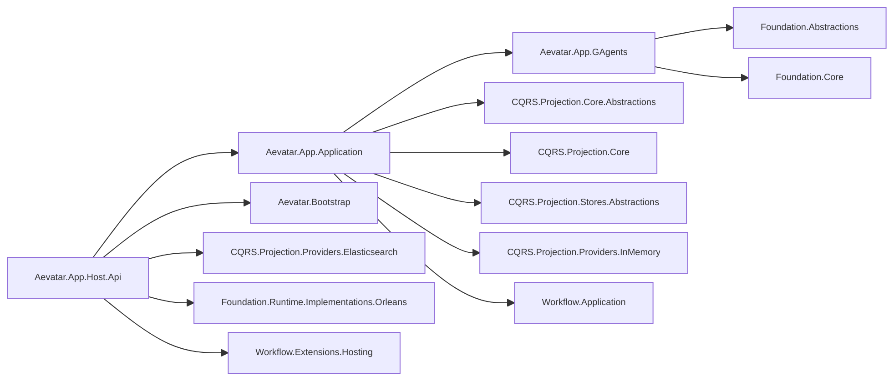
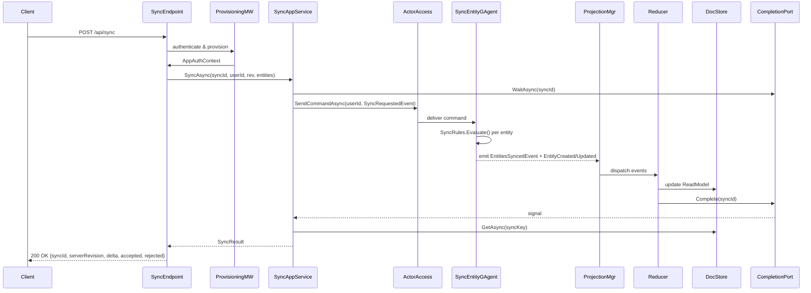
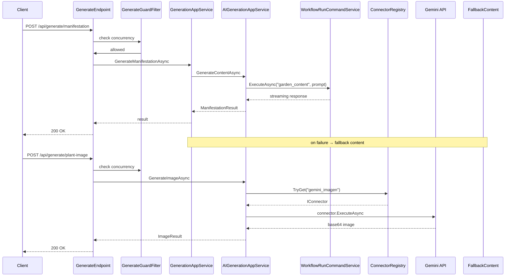

# Aevatar App 架构审计报告

> 审计日期：2026-03-10
> 审计范围：`apps/aevatar-app/` 全部源码（3 个生产项目 + 3 个测试项目）

---

## 1. 总体架构概览

### 1.1 分层架构图

```mermaid
%%{init: {"maxTextSize": 100000, "flowchart": {"useMaxWidth": false, "nodeSpacing": 10, "rankSpacing": 50}, "themeVariables": {"fontSize": "10px"}}}%%
graph TB
    subgraph External["外部系统"]
        Client["Mobile/Web Client"]
        Firebase["Firebase Auth"]
        GeminiAPI["Google Gemini API"]
        S3["AWS S3"]
        Redis["Redis"]
        ES["Elasticsearch"]
        Garnet["Garnet"]
    end

    subgraph HostLayer["Host 层 — Aevatar.App.Host.Api"]
        Program["Program.cs<br/>宿主入口 & DI 组合根"]
        Endpoints["Endpoints<br/>(Auth/User/Sync/State/<br/>Generate/Upload/Config/Health)"]
        Filters["Filters<br/>(GenerateGuard/UploadTracker)"]
        Hosting["Hosting<br/>(Orleans/ES Projection/<br/>StartupValidation)"]
        RedisCP["RedisCompletionPort"]
    end

    subgraph AppLayer["Application 层 — Aevatar.App.Application"]
        subgraph AuthModule["Auth 模块"]
            AuthService["AppAuthService"]
            AuthMiddleware["ProvisioningMiddleware"]
            FirebaseHandler["FirebaseAuthHandler"]
            TrialHandler["TrialAuthHandler"]
        end
        subgraph Services["Application Services"]
            UserSvc["UserAppService"]
            SyncSvc["SyncAppService"]
            AuthAppSvc["AuthAppService"]
            GenSvc["GenerationAppService"]
            AIGenSvc["AIGenerationAppService"]
            ImgSvc["ImageStorageAppService"]
            ActorSvc["ActorAccessAppService"]
        end
        subgraph ProjectionModule["Projection 模块"]
            ProjMgr["AppProjectionManager"]
            Projectors["Projectors × 4"]
            Reducers["Reducers × 13"]
            ReadModels["ReadModels × 5"]
            DocStores["DocumentStores<br/>(InMemory / ES)"]
        end
        subgraph CrossCutting["横切关注点"]
            CompletionPort["ICompletionPort"]
            ConcurrencyCoord["ImageConcurrencyCoordinator"]
            Validation["FluentValidation"]
            ErrorMW["AppErrorMiddleware"]
            FallbackContent["FallbackContent"]
        end
    end

    subgraph DomainLayer["Domain 层 — Aevatar.App.GAgents"]
        subgraph GAgents["GAgent Actors"]
            SyncGA["SyncEntityGAgent"]
            UserAccGA["UserAccountGAgent"]
            UserProfGA["UserProfileGAgent"]
            AuthLookGA["AuthLookupGAgent"]
        end
        subgraph Proto["Protobuf 状态 & 事件"]
            SyncProto["sync_entity.proto"]
            UserAccProto["user_account.proto"]
            UserProfProto["user_profile.proto"]
            AuthLookProto["auth_lookup.proto"]
        end
        SyncRules["SyncRules"]
    end

    subgraph Foundation["Aevatar Foundation"]
        FA["Foundation.Abstractions"]
        FC["Foundation.Core<br/>(GAgentBase)"]
        FR["Foundation.Runtime"]
    end

    subgraph Platform["平台能力"]
        Bootstrap["Aevatar.Bootstrap"]
        CQRS["CQRS.Projection.*"]
        Workflow["Workflow.Application"]
        WFHost["Workflow.Extensions.Hosting"]
        Connectors["Connector Framework"]
    end

    Client --> Endpoints
    Endpoints --> AuthMiddleware
    Endpoints --> Filters
    Endpoints --> Services
    AuthMiddleware --> AuthService
    AuthService --> Firebase
    Filters --> ConcurrencyCoord
    UserSvc --> ActorSvc
    SyncSvc --> ActorSvc
    SyncSvc --> CompletionPort
    SyncSvc --> DocStores
    AuthAppSvc --> ActorSvc
    GenSvc --> AIGenSvc
    AIGenSvc --> Workflow
    AIGenSvc --> Connectors
    Connectors --> GeminiAPI
    ImgSvc --> S3
    ActorSvc --> GAgents
    CompletionPort --> Redis
    GAgents --> Proto
    SyncGA --> SyncRules
    GAgents --> FC
    FC --> FA
    ProjMgr --> CQRS
    Reducers --> ReadModels
    Projectors --> DocStores
    DocStores --> ES
    Hosting --> Bootstrap
    Hosting --> FR
    RedisCP --> Redis
    Program --> Hosting
```



---

## 2. 项目依赖图



---

## 3. 业务领域详解

### 3.1 四大 GAgent（Domain Actor）

```mermaid
%%{init: {"maxTextSize": 100000, "flowchart": {"useMaxWidth": false, "nodeSpacing": 10, "rankSpacing": 50}, "themeVariables": {"fontSize": "10px"}}}%%
graph TB
    subgraph SyncDomain["SyncEntity 领域"]
        SyncGA["SyncEntityGAgent<br/>GAgentBase&lt;SyncEntityState&gt;"]
        SyncCmd1["EntitiesSyncRequestedEvent"]
        SyncCmd2["EntitiesSoftDeleteRequestedEvent"]
        SyncCmd3["EntitiesHardDeleteRequestedEvent"]
        SyncEvt1["EntitiesSyncedEvent"]
        SyncEvt2["EntityCreatedEvent"]
        SyncEvt3["EntityUpdatedEvent"]
        SyncEvt4["CascadeDeleteEvent"]
        SyncRules["SyncRules.Evaluate()"]
        SyncCmd1 --> SyncGA
        SyncCmd2 --> SyncGA
        SyncCmd3 --> SyncGA
        SyncGA --> SyncEvt1
        SyncGA --> SyncEvt2
        SyncGA --> SyncEvt3
        SyncGA --> SyncEvt4
        SyncGA -.-> SyncRules
    end

    subgraph UserAccDomain["UserAccount 领域"]
        UserAccGA["UserAccountGAgent<br/>GAgentBase&lt;UserAccountState&gt;"]
        UACmd1["UserRegisteredEvent"]
        UACmd2["UserProviderLinkedEvent"]
        UACmd3["UserLoginUpdatedEvent"]
        UACmd4["AccountDeletedEvent"]
        UACmd1 --> UserAccGA
        UACmd2 --> UserAccGA
        UACmd3 --> UserAccGA
        UACmd4 --> UserAccGA
    end

    subgraph UserProfDomain["UserProfile 领域"]
        UserProfGA["UserProfileGAgent<br/>GAgentBase&lt;UserProfileState&gt;"]
        UPCmd1["ProfileCreatedEvent"]
        UPCmd2["ProfileUpdatedEvent"]
        UPCmd3["ProfileDeletedEvent"]
        UPCmd1 --> UserProfGA
        UPCmd2 --> UserProfGA
        UPCmd3 --> UserProfGA
    end

    subgraph AuthLookDomain["AuthLookup 领域"]
        AuthGA["AuthLookupGAgent<br/>GAgentBase&lt;AuthLookupState&gt;"]
        ALCmd1["AuthLookupSetEvent"]
        ALCmd2["AuthLookupClearedEvent"]
        ALCmd1 --> AuthGA
        ALCmd2 --> AuthGA
    end
```



### 3.2 CQRS 投影管道

```mermaid
%%{init: {"maxTextSize": 100000, "flowchart": {"useMaxWidth": false, "nodeSpacing": 10, "rankSpacing": 50}, "themeVariables": {"fontSize": "10px"}}}%%
graph LR
    subgraph Write["写端 (Command)"]
        AppSvc["AppService"] -->|"SendCommandAsync"| Actor["GAgent Actor"]
        Actor -->|"emit events"| Stream["Event Stream"]
    end

    subgraph Projection["投影管道"]
        Stream -->|"subscribe"| ProjMgr["AppProjectionManager"]
        ProjMgr --> Dispatch["ProjectionDispatcher"]
        Dispatch --> Coord["ProjectionCoordinator"]
        Coord --> Projector["Projector"]
        Projector -->|"route by TypeUrl"| Reducer["Reducer"]
        Reducer -->|"update"| ReadModel["ReadModel"]
        ReadModel -->|"persist"| Store["DocumentStore<br/>(InMemory/ES)"]
    end

    subgraph Read["读端 (Query)"]
        Store -->|"GetAsync"| QuerySvc["AppService.GetState"]
        QuerySvc --> API["API Response"]
    end

    subgraph Completion["异步完成信号"]
        Projector -->|"TryMarkProcessed"| CP["CompletionPort"]
        CP -->|"signal"| SyncSvc["SyncAppService.WaitAsync"]
    end
```



### 3.3 Sync 请求完整时序图



### 3.4 AI 内容生成流程



---

## 4. 模块详细说明

### 4.1 Host 层 — `Aevatar.App.Host.Api`

| 模块 | 文件 | 职责 |
|------|------|------|
| **入口** | `Program.cs` | DI 组合根，串联所有服务注册、Auth 配置、CORS、中间件管道、Endpoint 映射 |
| **Endpoints** | `AuthEndpoints.cs` | `POST /api/auth/register-trial` — 试用注册 |
| | `UserEndpoints.cs` | `GET/POST/PATCH/DELETE /api/users/me` — 用户与 Profile CRUD |
| | `SyncEndpoints.cs` | `POST /api/sync`, `GET /api/sync/limits` — 实体同步 |
| | `StateEndpoints.cs` | `GET /api/state` — 获取用户完整状态快照 |
| | `GenerateEndpoints.cs` | `POST /api/generate/{manifestation,affirmation,plant-image,speech}` — AI 生成 |
| | `UploadEndpoints.cs` | `POST /api/upload/plant-image` — 用户图片上传 |
| | `ConfigEndpoints.cs` | `GET /api/remote-config` — 远程配置下发 |
| | `HealthEndpoints.cs` | `GET /health{,/live,/ready}`, `GET /api/info` — 健康检查 |
| **Filters** | `GenerateGuardFilter.cs` | `IEndpointFilter`，通过 `IImageConcurrencyCoordinator` 控制 AI 生成并发，超限返回 429/503 |
| | `UploadTrackerFilter.cs` | `IEndpointFilter`，追踪上传并发 |
| **Mappers** | `EntityMapMapper.cs` | Protobuf `SyncEntity` ↔ `EntityDto` / `SyncEntityEntry` 双向映射 |
| **Hosting** | `AppDistributedHostBuilderExtensions.cs` | Orleans 集群配置（Localhost/Development）+ Garnet 持久化后端 |
| | `AppElasticsearchProjectionExtensions.cs` | Elasticsearch 投影存储注册 |
| | `AppStartupValidation.cs` | 启动时配置必要项校验 |
| **Completion** | `RedisCompletionPort.cs` | Redis Pub/Sub 实现的异步完成信号端口（生产环境使用） |

### 4.2 Application 层 — `Aevatar.App.Application`

#### 4.2.1 Auth 模块

| 文件 | 职责 |
|------|------|
| `AppAuthService.cs` | 统一认证服务：Firebase JWT 验证 + Trial JWT 验证（开发环境），通过 OpenID Connect 发现文档验证签名 |
| `AppAuthSchemeProvider.cs` | 根据 `Authorization` header 前缀选择认证方案（`Bearer` → Firebase / `Trial` → Trial） |
| `FirebaseAuthHandler.cs` | ASP.NET Core 认证处理器，验证 Firebase ID Token |
| `TrialAuthHandler.cs` | ASP.NET Core 认证处理器，验证试用 JWT Token（仅 Development 环境） |
| `AppUserProvisioningMiddleware.cs` | 核心中间件：认证后自动为新用户创建 `UserAccountGAgent` + `AuthLookupGAgent` + 启动投影订阅 |
| `OptionalAuthMiddleware.cs` | 可选认证中间件，用于 `/api/remote-config` 等公开端点的增强逻辑 |
| `IAppAuthContextAccessor.cs` | Scoped 的认证上下文访问器，持有当前请求的 `AppAuthContext(AuthUserInfo, UserId)` |

#### 4.2.2 Application Services

| 服务 | 接口 | 职责 |
|------|------|------|
| `SyncAppService` | `ISyncAppService` | 实体同步核心逻辑：发送命令 → 等待投影完成 → 从 ReadModel 构建响应。支持增量同步与全量状态获取 |
| `UserAppService` | `IUserAppService` | 用户生命周期：`GetUserInfo`（从 ReadModel 聚合 Account+Profile）、`CreateProfile`、`UpdateProfile`（PATCH 语义）、`DeleteAccount`（软删/硬删级联） |
| `AuthAppService` | `IAuthAppService` | 试用注册：生成试用 JWT，创建 UserAccount + AuthLookup |
| `GenerationAppService` | `IGenerationAppService` | 生成编排：调用 AI 服务，失败时自动降级到 Fallback 内容 |
| `AIGenerationAppService` | `IAIGenerationAppService` | AI 能力封装：通过 `IWorkflowRunCommandService` 执行 Workflow（manifestation/affirmation），通过 `IConnectorRegistry` 直调 Gemini API（image/speech） |
| `ImageStorageAppService` | `IImageStorageAppService` | S3 图片存储：上传、按前缀删除、配置检测 |
| `ActorAccessAppService` | `IActorAccessAppService` | Actor 访问门面：`SendCommandAsync<TAgent>` 命令分发 + `ResolveActorId<TAgent>` Actor ID 解析（基于 `ActorPrefix + userId`） |

#### 4.2.3 Projection 模块

| 组件 | 数量 | 说明 |
|------|------|------|
| **Projectors** | 4 | `AppSyncEntityProjector`、`AppUserAccountProjector`、`AppUserProfileProjector`、`AppAuthLookupProjector` — 每个 Projector 对应一种 GAgent 的事件流 |
| **Reducers** | 13 | 每种领域事件对应一个 Reducer，负责将事件应用到 ReadModel（如 `EntityCreatedEventReducer`、`UserRegisteredEventReducer`） |
| **ReadModels** | 5 | `AppSyncEntityReadModel`（含 `SyncResults` / `SyncResultOrder` / `Entities`）、`AppUserAccountReadModel`、`AppUserProfileReadModel`、`AppAuthLookupReadModel`、`AppSyncEntityLastResultReadModel` |
| **DocumentStores** | 2 种 | `AppInMemoryDocumentStore`（默认/开发）、Elasticsearch 后端（生产可选） |
| **Orchestration** | 2 | `AppProjectionManager`（管理订阅生命周期）、`DefaultAppProjectionContextFactory`（创建投影上下文） |

#### 4.2.4 横切关注点

| 组件 | 职责 |
|------|------|
| `ICompletionPort` | 异步完成信号协议：`WaitAsync(key)` 等待 / `Complete(key)` 触发。生产用 `RedisCompletionPort`（Redis Pub/Sub），开发用 `InMemoryCompletionPort` |
| `ImageConcurrencyCoordinator` | 全局图片生成 + 上传并发控制：`SemaphoreSlim` + 排队超时，防止 AI API 过载 |
| `EntityValidator` / `SyncRequestValidator` | FluentValidation 校验器，验证 `EntityDto` 和 `SyncRequestDto` 的业务约束 |
| `AppErrorMiddleware` | 统一错误处理中间件：`AppException` → 对应 HTTP 状态码 |
| `FallbackContent` | AI 生成失败时的降级内容源，从配置文件加载预置的 mantra/plant/affirmation |

### 4.3 Domain 层 — `Aevatar.App.GAgents`

| GAgent | State (Protobuf) | 命令事件 | 产出事件 | 职责 |
|--------|------------------|---------|---------|------|
| `SyncEntityGAgent` | `SyncEntityState`（`entities` map + `server_revision`） | `EntitiesSyncRequestedEvent`、`EntitiesSoftDeleteRequestedEvent`、`EntitiesHardDeleteRequestedEvent` | `EntitiesSyncedEvent`、`EntityCreatedEvent`、`EntityUpdatedEvent`、`CascadeDeleteEvent` | 管理用户所有实体的状态：乐观并发同步（revision 对比）、创建/更新/软删/硬删/级联删除 |
| `UserAccountGAgent` | `UserAccountState`（`user` message） | `UserRegisteredEvent`、`UserProviderLinkedEvent`、`UserLoginUpdatedEvent`、`AccountDeletedEvent` | 同输入事件 | 用户账号生命周期：注册、OAuth provider 链接、登录时间更新、账号删除 |
| `UserProfileGAgent` | `UserProfileState`（`profile` message） | `ProfileCreatedEvent`、`ProfileUpdatedEvent`、`ProfileDeletedEvent` | 同输入事件 | 用户画像 CRUD：姓名、性别、生日、时区、兴趣、通知偏好 |
| `AuthLookupGAgent` | `AuthLookupState`（`provider + provider_id → user_id`） | `AuthLookupSetEvent`、`AuthLookupClearedEvent` | 同输入事件 | 认证索引：将 `(authProvider, authProviderId)` 映射到内部 `userId`，用于登录时快速查找 |

**SyncRules**：纯函数式业务规则引擎，`Evaluate(existing?, incoming) → Created / Updated / Stale`，基于 revision 比较决定同步结果。

### 4.4 外部集成

| 集成 | 方式 | 用途 |
|------|------|------|
| **Firebase Auth** | OpenID Connect / JWT 验证 | 用户认证（生产主认证方式） |
| **Google Gemini** | HTTP Connector（`gemini_imagen`, `gemini_tts`） | AI 图片生成、语音合成 |
| **Workflow Engine** | `IWorkflowRunCommandService` + YAML workflow | AI 文本生成（manifestation, affirmation） |
| **AWS S3** | `IAmazonS3` SDK | 用户植物图片存储 |
| **Redis** | `StackExchange.Redis` Pub/Sub | 异步同步完成信号（生产环境） |
| **Elasticsearch** | CQRS Projection Provider | 投影 ReadModel 持久化（生产可选） |
| **Garnet** | Orleans Persistence Backend | Actor 状态持久化 |
| **Orleans** | Silo Hosting | Actor 运行时（集群、生命周期、流） |

### 4.5 测试架构

| 测试项目 | 层级 | 覆盖范围 |
|---------|------|---------|
| `Aevatar.App.GAgents.Tests` | 单元 + 集成 | GAgent 状态转换、事件发射、SyncRules、端到端同步 |
| `Aevatar.App.Application.Tests` | 单元 | AppService、Auth、Projection Reducers、Validation、Middleware、Concurrency |
| `Aevatar.App.Host.Api.Tests` | 集成 | API 端点、Filter、Mapper、启动校验。使用 `AppTestFixture` + Stub 替身 |

---

## 5. 架构评分

| 维度 | 评分 | 说明 |
|------|------|------|
| **分层清晰度** | 8/10 | 三层分离明确（Host/Application/Domain），依赖方向正确 |
| **读写分离** | 9/10 | 严格 CQRS：Command→Event→ReadModel→Query，CompletionPort 信号机制完善 |
| **Actor 化** | 9/10 | 4 个 GAgent 均为纯 Actor 模型，Protobuf 状态定义规范 |
| **依赖反转** | 9/10 | 全面接口抽象 + DI 注入，Application 不依赖具体基础设施 |
| **投影管道统一** | 8/10 | 走统一 Projection Pipeline，Reducer 路由清晰 |
| **测试覆盖** | 9/10 | 三层均有测试，Reducer/Service/GAgent/API 全覆盖 |
| **命名语义** | 8/10 | 项目名 = 命名空间 = 目录语义一致 |
| **外部集成** | 8/10 | Connector + Workflow 抽象清晰，Fallback 降级完善 |

**总分：68/80**

---

## 6. 架构问题与建议

### 6.1 中间层状态违规

`AppProjectionManager` 中存在 `ConcurrentDictionary<string, AppProjectionContext> _contexts`，这违反了 AGENTS.md 中间层状态约束：

> **禁止在中间层维护 entity/actor/workflow-run/session 等 ID 到上下文或事实状态的进程内映射。**

**影响**：多节点部署时，投影订阅状态仅存于单个进程内存，节点重启或迁移将丢失订阅。

**建议**：将订阅状态迁移到 Actor 持久态或分布式状态服务中管理。

### 6.2 Sync 流程的 Command-Wait-Query 模式

`SyncAppService.SyncAsync` 使用 `CompletionPort.WaitAsync` 在会话内等待投影完成，属于"异步完成通过事件通知"的正确模式，但需注意：

- 超时处理：CompletionPort 需有明确超时与重试策略
- 单点故障：如果 Reducer 处理失败，CompletionPort 永远不会被触发

### 6.3 GenerationAppService 职责边界

`AIGenerationAppService` 同时使用 Workflow（文本生成）和 Connector（图片/语音），两条路径的抽象层级不一致。建议考虑统一为 Workflow 路径或明确文档化两种路径的选择标准。

### 6.4 ImageConcurrencyCoordinator 进程内状态

`ImageConcurrencyCoordinator` 使用 `SemaphoreSlim` 做进程内并发控制。在多节点部署下无法做全局限流。如果需要全局限流，应迁移到分布式限流（如 Redis-based rate limiter）。

---

## 7. 文件清单

### 生产代码

```
apps/aevatar-app/src/
├── Aevatar.App.GAgents/          (8 files, ~500 LOC)
├── Aevatar.App.Application/      (35 files, ~2000 LOC)
└── Aevatar.App.Host.Api/         (15 files, ~600 LOC)
```

### 测试代码

```
apps/aevatar-app/test/
├── Aevatar.App.GAgents.Tests/    (11 files)
├── Aevatar.App.Application.Tests/ (21 files)
└── Aevatar.App.Host.Api.Tests/   (13 files)
```

### 工作流定义

```
apps/aevatar-app/workflows/
├── garden_affirmation.yaml
├── garden_image.yaml
└── garden_speech.yaml
```

### 连接器配置

```
apps/aevatar-app/connectors/
└── garden.connectors.json (gemini_imagen, gemini_tts)
```
