# Soul Garden — 基于 Aevatar 框架的彻底重构方案

> 将 Node.js (Hono + MongoDB) 后端重构为 .NET (ASP.NET Core + Orleans + Aevatar WorkflowGAgent) 统一 Host 架构

---

## 1. 概述

### 1.1 背景

Soul Garden 是一个"灵魂花园"愿望实现应用，用户创建代表目标的"植物"，通过浇水培育使其成长，AI 为每棵植物生成内容（宣言、名称、描述、图片、肯定语）。当前实现基于 Node.js 技术栈（Hono + MongoDB），约 3K LOC，包含：

- 7 个路由模块（health / auth / users / state / sync / generate / upload）
- 7 个服务层组件（AI、Gemini、ImageGen、Storage、Limits、SyncEngine、SyncHelpers）
- 实体同步协议 v6.1（扁平实体表 + 3 规则处理 + 原子版本分配）
- 三种认证方式（Firebase / Aevatar OAuth / Trial）
- 免费层限流 / 付费墙
- 并发控制（图片生成/上传共享并发池）

现需基于 Aevatar WorkflowGAgent 框架进行彻底重构，核心原则：

- **统一 Host 架构** — Aevatar App Host 与 Aevatar Runtime 合并为单一进程
- **AI 能力通过 Workflow 执行** — 内容生成、图片生成、肯定语生成
- **App Manager 是 Host 内的 Application Service 集合** — 承载同步引擎 + 限流 + 用户管理，跨 `Aevatar.App.Application`（业务服务）和 `Aevatar.App.Host.Api`（端点 + Filter）两个项目
- **保留实体同步协议 v6.1** — 移植到 .NET + GAgent State，前端无需改动同步逻辑
- **图片存储使用 AWS S3 兼容存储** — 通过 AWSSDK.S3 客户端直调
- **不考虑兼容性** — 旧版 CF Worker 接口、MongoDB 数据结构全部废弃

### 1.2 新旧架构对照

| 旧实现 | 新实现 |
|--------|--------|
| Hono Web 框架 (Node.js) | ASP.NET Core (.NET 10) |
| MongoDB 数据库 | GAgent State (Protobuf) + Garnet/Redis 持久化 |
| 7 个 Service 类（过程式） | DDD 分层：Domain / Application / Host（无 Infrastructure）<br/>Domain → `Aevatar.App.GAgents`<br/>Application → `Aevatar.App.Application`<br/>Host → `Aevatar.App.Host.Api` |
| 手写 AI 调用（OpenAI + Gemini） | WorkflowGAgent + RoleGAgent（YAML 声明式） |
| 实体同步协议 v6.1 (MongoDB) | 实体同步协议 v6.1 移植到 GAgent (Actor 内存操作) |
| 扁平实体 `sync_entities` 集合 | `SyncEntityGAgent.State.entities` (Protobuf map) |
| `sync_log` 幂等缓存 (72h TTL) | `ProcessedSyncIds` 滑动窗口 (最近 32 条) |
| Chrono / R2 双模存储 | AWS S3 兼容对象存储（AWSSDK.S3） |
| JWT 认证中间件 (Firebase / Aevatar OAuth / Trial) | ASP.NET Core Authentication (Firebase RS256 + Trial HS256)；**Aevatar OAuth 废弃** |
| 旧版 CF Worker 兼容接口 | 废弃，不保留 |
| 环境变量直连 LLM | Aevatar LLM Provider + Connector 配置 |

### 1.3 设计哲学

```
判断标准: 这个功能需要"理解力"还是只需要"搬运"？

需要理解力（AI 判断）→ 放在 Agent 层（Workflow）
  • 生成宣言 / 植物名称 / 植物描述
  • 生成肯定语（基于生长阶段和触发场景）
  • 生成植物图片（基于阶段的视觉描述）
  • 生成语音（TTS）

只需要搬运（纯 CRUD / 同步 / 应用逻辑）→ 放在 App Manager（Host 内 Application Service）
  • 实体同步引擎 v6.1（3 规则处理、原子版本分配、级联删除）
  • 初始状态加载（GET /api/state）
  • 用户注册 / 资料管理
  • 限流 / 付费墙
  • 图片上传（非 AI 生成，POST /api/upload/plant-image）
  • 账户删除 / 匿名化
  • 并发控制（图片生成/上传共享并发池）

通用基础设施 → AWS S3 兼容存储
  • 图片对象存储（AWS S3 / MinIO / S3 兼容）

不需要的 → 直接删除
  • CF Worker 旧版兼容接口
  • MongoDB 相关代码
  • R2 存储后端（统一 AWS S3 兼容存储）
  • sync_log 幂等缓存（Actor 单线程 + 3 规则天然幂等，不再需要）
```

### 1.4 多 App 平台化目标

当前代码以 Soul Garden 为首个 App 落地，但架构目标是 **同一套服务二进制，通过配置部署不同业务 App**：

```
目标：
  1. 平台运行时代码只构建一次，产出一个通用 Docker 镜像
  2. 每个 App 是一个"App 配置包"（appsettings / workflows / connectors / quota / fallbacks）
  3. 部署新 App = 新增配置包 + 新的部署实例，不改运行时代码
  4. 各 App 实例独立运行、数据隔离（独立 Orleans 集群 + 存储 keyspace）

平台运行时（稳定内核，不随 App 变化）：
  • 实体同步引擎 v6.1（SyncEntityGAgent）
  • 用户管理（UserAccountGAgent / UserProfileGAgent / AuthLookupGAgent）
  • 认证框架（Firebase / Trial）
  • AI 生成协调（AIGenerationAppService — Workflow 触发 + fallback）
  • 图片存储（ImageStorageAppService — AWS S3 兼容存储）
  • 并发控制（ImageConcurrencyCoordinator / ImageConcurrencyGAgent）
  • REST API 端点（所有 /api/* 路由）

App 配置包（随 App 变化，不改代码）：
  • appsettings.json — App 标识、认证参数、存储桶、Orleans 集群、限额参数（App:Quota）
  • workflows/*.yaml — AI Workflow 定义（角色/步骤/连接器绑定）
  • connectors.json — 外部 API 连接器配置
  • fallbacks.json — AI 失败占位内容池（替代硬编码的 FallbackContent 常量）

关键约束：
  • 命名空间保持 Aevatar.App.*（已有大量代码引用，不做重命名）
  • App 配置包统一放在 apps/<app-name>/ 目录下
  • 运行时通过 AEVATAR_HOME 环境变量定位配置包根目录
```

### 1.5 项目命名说明

```
当前命名 Aevatar.App.* 的语义约定：
  • Aevatar.App.GAgents       — 通用业务 GAgent（同步/用户/认证，不含 App 专属逻辑）
  • Aevatar.App.Application   — 通用应用层服务（AI 协调/存储/校验/认证/并发控制）
  • Aevatar.App.Host.Api      — 通用 Host 宿主（REST 端点/Bootstrap/Filter）

  Aevatar.App.* 是"App 平台运行时"的含义，不代表某个具体业务 App。
  具体业务 App（如 Soul Garden）的差异通过配置包表达，不体现在命名空间中。

目录约定：
  • apps/<app-name>/config/    — App 专属配置（appsettings / quota / fallbacks）
  • apps/<app-name>/workflows/ — App 专属 Workflow YAML
  • apps/<app-name>/connectors/ — App 专属 Connector 配置
  • apps/aevatar-app/src/      — 平台运行时代码（与 App 无关）
```

---

## 2. 系统全局架构

### 2.1 统一 Host 架构

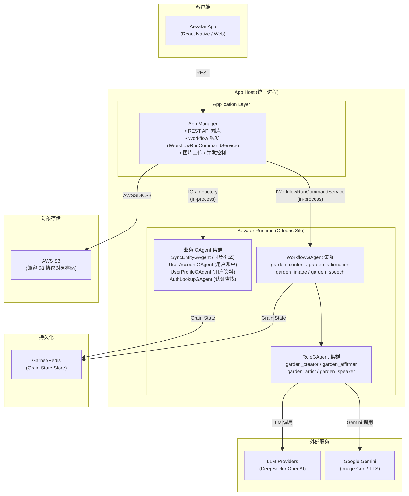

### 2.2 Host 引导流程

```csharp
// Aevatar.App.Host.Api / Program.cs
var builder = WebApplication.CreateBuilder(args);
ConfigureFallbackConfiguration(builder.Configuration);
AppStartupValidation.ValidateRequiredConfiguration(
    builder.Configuration, builder.Environment, startupLogger);

// ── Aevatar Runtime (Orleans Silo) ──
builder.AddAevatarDefaultHost(configureHost: options =>
{
    options.ServiceName = "Aevatar.App.Host.Api";
    options.EnableWebSockets = true;
    options.EnableConnectorBootstrap = true;
    options.EnableActorRestoreOnStartup = true;
});
builder.AddAppDistributedOrleansHost();
builder.AddWorkflowCapabilityWithAIDefaults();

// ── Auth ──
builder.Services.AddScoped<IAppAuthContextAccessor, AppAuthContextAccessor>();
builder.Services.Configure<AppAuthOptions>(options => { /* Firebase/Trial 配置 */ });
builder.Services.AddSingleton<IAppAuthService, AppAuthService>();
var authBuilder = builder.Services
    .AddAuthentication(options =>
    {
        options.DefaultAuthenticateScheme = AppAuthSchemeProvider.AppAuthScheme;
        options.DefaultChallengeScheme = AppAuthSchemeProvider.AppAuthScheme;
    })
    .AddPolicyScheme(AppAuthSchemeProvider.AppAuthScheme, "App auth scheme", options =>
    {
        options.ForwardDefaultSelector = context => AppAuthSchemeProvider.SelectScheme(context);
    })
    .AddScheme<AuthenticationSchemeOptions, FirebaseAuthHandler>(
        AppAuthSchemeProvider.FirebaseScheme, _ => { });
if (builder.Environment.IsDevelopment())
    authBuilder.AddScheme<AuthenticationSchemeOptions, TrialAuthHandler>(
        AppAuthSchemeProvider.TrialScheme, _ => { });

// ── AI / Storage / Concurrency / Projection ──
builder.Services.AddOptions<AppQuotaOptions>().Bind(cfg.GetSection("App:Quota"));
builder.Services.AddOptions<FallbackOptions>()
    .Configure<IConfiguration>((o, c) => { c.GetSection("fallbacks").Bind(o); c.GetSection("App:Fallbacks").Bind(o); });
builder.Services.AddSingleton<IActorAccessAppService, ActorAccessAppService>();
builder.Services.AddSingleton<IImageConcurrencyCoordinator>(...);
// Projection: Elasticsearch (生产) 或 InMemory (开发)
if (projectionProvider == "Elasticsearch")
    builder.Services.AddAppElasticsearchProjection(builder.Configuration);
builder.Services.AddAppProjection();
builder.Services.AddSingleton<IFallbackContent, FallbackContent>();
builder.Services.AddSingleton<IAIGenerationAppService, AIGenerationAppService>();
builder.Services.AddSingleton<IAuthAppService, AuthAppService>();
builder.Services.AddSingleton<IGenerationAppService, GenerationAppService>();
// CompletionPort: Redis (Garnet 持久化时) 或 InMemory (开发)
builder.Services.Configure<CompletionPortOptions>(cfg.GetSection("CompletionPort"));
if (persistenceBackend == "Garnet")
    builder.Services.AddSingleton<ICompletionPort, RedisCompletionPort>();
else
    builder.Services.AddSingleton<ICompletionPort, InMemoryCompletionPort>();
builder.Services.AddSingleton<ISyncAppService, SyncAppService>();
builder.Services.AddSingleton<IUserAppService, UserAppService>();
// S3 存储（AWS S3 / MinIO / 兼容 S3 协议的对象存储）
builder.Services.Configure<ImageStorageOptions>(cfg.GetSection("App:Storage"));
builder.Services.AddSingleton<IAmazonS3>(...);
builder.Services.AddSingleton<IS3StorageClient, AwsS3StorageClient>();
builder.Services.AddSingleton<IImageStorageAppService, ImageStorageAppService>();

// ── CORS ──
builder.Services.AddCors(options =>
{
    options.AddDefaultPolicy(policy =>
    {
        policy.WithOrigins(allowedOrigins)
              .AllowCredentials()
              .WithMethods("GET", "POST", "PUT", "PATCH", "DELETE", "OPTIONS")
              .WithHeaders("Content-Type", "Authorization", "x-app-user-id");
    });
});

var app = builder.Build();
app.UseCors();
app.UseAevatarDefaultHost();
app.UseAuthentication();

// ── Error handling (全局异常处理中间件) ──
app.UseMiddleware<AppErrorMiddleware>();

// ── sendBeacon 兼容 (text/plain → application/json) ──
app.Use(async (context, next) =>
{
    if (context.Request.Path.StartsWithSegments("/api/sync")
        && context.Request.Method == "POST"
        && context.Request.ContentType?.Contains("text/plain") == true)
    {
        context.Request.ContentType = "application/json";
    }
    await next();
});

app.UseWhen(
    context => context.Request.Path.StartsWithSegments("/api/users")
        || context.Request.Path.StartsWithSegments("/api/state")
        || context.Request.Path.StartsWithSegments("/api/sync")
        || context.Request.Path.StartsWithSegments("/api/generate")
        || context.Request.Path.StartsWithSegments("/api/upload"),
    branch => branch.UseMiddleware<AppUserProvisioningMiddleware>());

app.UseWhen(
    context => context.Request.Path.StartsWithSegments("/api/remote-config"),
    branch => branch.UseMiddleware<OptionalAuthMiddleware>());

app.MapHealthEndpoints();
app.MapConfigEndpoints();
app.MapAuthEndpoints();
app.MapUserEndpoints();
app.MapStateEndpoints();
app.MapSyncEndpoints();
app.MapGenerateEndpoints();
app.MapUploadEndpoints();
app.Run();
```

### 2.3 统一配置契约（多 App 支持）

所有 App 专属参数统一归到 `App:*` 配置节，**移除 `Garden:*` 回退**。Program.cs 只读取 `App:*` 键，不再有 `?? config["Garden:..."]` 回退逻辑。

**配置键清单（App 配置包必须提供）：**

```json
{
  "App": {
    "Id": "soul-garden",
    "DisplayName": "Soul Garden",
    "PaywallEnabled": false,
    "TrialAuthEnabled": true,
    "TrialTokenSecret": "dev-secret-32-chars-minimum-here!",
    "Storage": {
      "Region": "us-east-1",
      "BucketName": "soul-garden",
      "AccessKeyId": "",
      "SecretAccessKey": "",
      "CdnUrl": "",
      "MaxFileSizeBytes": 104857600
    },
    "ImageConcurrency": {
      "MaxTotal": 20,
      "MaxQueueSize": 100,
      "QueueTimeoutMs": 30000
    }
  },
  "Firebase": {
    "ProjectId": "soul-21951"
  },
  "Orleans": {
    "ClusteringMode": "Localhost",
    "ClusterId": "soul-garden-cluster",
    "ServiceId": "soul-garden-host-api"
  }
}
```

**启动校验（fail-fast）：**

- `App:Id` 必须非空
- `Firebase:ProjectId` 在生产环境必须配置
- `App:Storage:BucketName` 不允许为空（用于跨 App 数据隔离）；`ImageStorageAppService.IsConfigured()` 依赖 `BucketName` 非空
- `Orleans:ClusterId` 和 `Orleans:ServiceId` 不同 App 实例必须不同（数据隔离保证）

**环境变量覆盖（部署时按需覆盖 appsettings.json）：**

ASP.NET Core 环境变量 provider 自动将 `__` 映射为 `:`，无需手动 override。部署时直接使用 `App__*` / `Firebase__*` / `Orleans__*` 格式。

| 配置键 | 环境变量（`__` 格式） | 说明 |
|--------|---------|------|
| `App:Id` | `App__Id` | App 标识（用于日志/追踪） |
| `App:PaywallEnabled` | `App__PaywallEnabled` | 限额开关 |
| `App:TrialAuthEnabled` | `App__TrialAuthEnabled` | Trial 认证开关 |
| `App:TrialTokenSecret` | `App__TrialTokenSecret` | Trial 签名密钥 |
| `App:AllowedOrigins` | `App__AllowedOrigins` | CORS 来源（逗号分隔） |
| `App:Storage:Region` | `App__Storage__Region` | AWS S3 Region（如 `us-east-1`） |
| `App:Storage:BucketName` | `App__Storage__BucketName` | S3 存储桶名称（跨 App 隔离） |
| `App:Storage:AccessKeyId` | `App__Storage__AccessKeyId` | S3 Access Key ID（可选，空时使用默认凭证链） |
| `App:Storage:SecretAccessKey` | `App__Storage__SecretAccessKey` | S3 Secret Access Key |
| `App:Storage:CdnUrl` | `App__Storage__CdnUrl` | CDN URL（图片公开访问地址前缀，可选） |
| `App:Storage:MaxFileSizeBytes` | `App__Storage__MaxFileSizeBytes` | 最大文件大小（默认 100MB） |
| `Firebase:ProjectId` | `Firebase__ProjectId` | Firebase 项目 ID |
| `Orleans:ClusterId` | `Orleans__ClusterId` | Orleans 集群 ID |
| `Orleans:ServiceId` | `Orleans__ServiceId` | Orleans 服务 ID |
| — | `AEVATAR_HOME` | 配置包根目录（含 connectors.json + workflows/） |

---

## 3. WorkflowGAgent 集群：App AI Workflows

系统使用 **4 个独立 WorkflowGAgent**，每个对应一种 AI 生成能力：

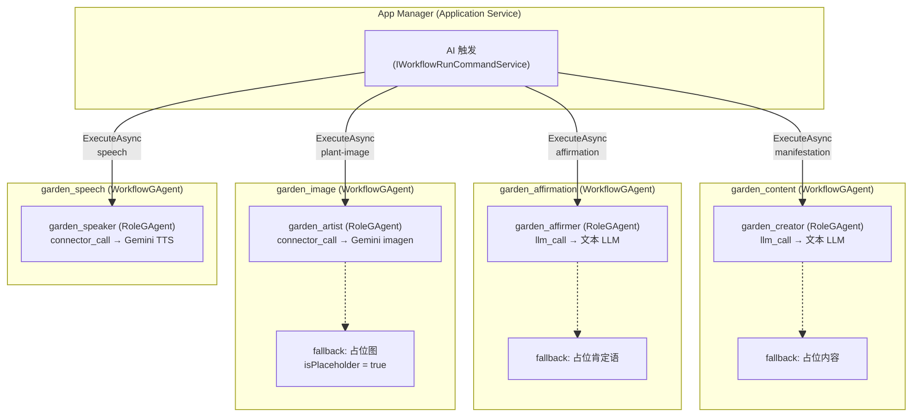

| Workflow | 端点 | 步骤类型 | 角色 | 输入 | 输出 |
|----------|------|---------|------|------|------|
| `garden_content` | `POST /api/generate/manifestation` | `llm_call` | `garden_creator` | `userGoal` | `{mantra, plantName, plantDescription}` |
| `garden_image` | `POST /api/generate/plant-image` | `connector_call` | `garden_artist` | `manifestationId, plantName, plantDescription?, stage` | `{imageData, isPlaceholder?}` (base64, 不写 State) |
| `garden_affirmation` | `POST /api/generate/affirmation` | `llm_call` | `garden_affirmer` | `userGoal, mantra, plantName, clientId?, stage?, trigger?` | `{affirmation, trigger, stage, generatedAt}` (不写 State) |
| `garden_speech` | `POST /api/generate/speech` | `connector_call` | `garden_speaker` | `text` | `{audioData}` (base64) |

**AI 失败处理（各 Workflow fallback）：**

```
garden_content:
  AI 调用成功: → 返回 AI 生成内容 {mantra, plantName, plantDescription}
  AI 调用失败 (Service 内兜底): → 优先从占位内容池随机选取；必要时回退到固定占位内容（均不报错，200）

garden_affirmation:
  AI 调用成功: → 返回 AI 生成肯定语
  AI 调用失败 (Service 内兜底): → 优先从占位肯定语池随机选取；必要时回退到固定占位肯定语（不报错，200）

garden_image:
  AI 调用成功: → 返回 {success: true, imageData}
  AI 不可用:   → 返回占位图 {success: true, imageData, isPlaceholder: true}（200）
  异常/限流:   → 返回 {success: false, reason, message}（429/503/500）

garden_speech:
  AI 调用成功: → 返回 {audioData}
  AI 调用失败: → 返回错误（无 fallback）
    限流:      → {error, reason: "rate_limit"}（429）
    其他:      → {error, reason: "no_audio" | "unknown"}（500）

所有 AI 端点不写 Actor State，只返回原始内容。
客户端收到内容后通过 POST /api/sync 将其存储为 SyncEntity。

needsAiRegeneration 字段处理:
  旧版 ai.ts 的 ManifestationContent 接口和 imageGen.ts 的 ImageGenerationResult
  均包含 needsAiRegeneration: boolean 字段，用于标记占位内容需要后续重新生成。
  旧版 ai.ts 还提供了 regenerateContent() 函数用于重新生成占位内容。
  但该函数在所有路由中从未被调用（已废弃）。
  新版处理方式:
    - garden_content: 占位内容的 needsAiRegeneration 标记不暴露给前端
      （API 返回 {mantra, plantName, plantDescription}，不含此字段）
    - garden_image: 使用 isPlaceholder: true 替代 needsAiRegeneration 语义
    - regenerateContent() 不移植（废弃）
```

### 3.1 为什么拆分为 4 个独立 Workflow

**框架约束（不支持单 Workflow 动态分发）：**

1. **`TargetRole` 不支持模板变量** — `StepDefinition.TargetRole` 在 `WorkflowLoopModule` 中直接使用原值，不经过 `WorkflowVariables.Interpolate()`。`role: "{mode_role}"` 会被当作字面量处理
2. **`WorkflowValidator` 静态校验** — 加载 YAML 时校验 `TargetRole` 必须存在于 `Roles` 列表中，动态角色名会导致校验失败
3. **步骤类型不同** — 文本生成使用 `llm_call`（通过 `IChatClient` 文本聊天），图片和语音生成需要 `connector_call`（调用非文本 API），不能用同一个步骤处理
4. **Workflow 输入只有 `Prompt` 字符串** — `ChatRequestEvent` 不携带结构化参数，无法传递 `mode` 字段

**设计优势：**

1. **与框架最佳实践一致** — 所有现有示例（`simple_qa`、`summarize`、`brainstorm`）均为单角色单步骤模式
2. **独立生命周期** — 各 Workflow 可独立部署、独立扩展、独立监控
3. **角色隔离** — 每个 RoleGAgent 的 system_prompt、LLM Provider、Connector 配置互不干扰
4. **清晰的调用语义** — App Manager 按端点直接触发对应 Workflow，无需解析 mode 参数

### 3.2 Workflow YAML 定义

#### 3.2.1 garden_content.yaml（文本 LLM — 植物内容生成）

```yaml
# workflows/garden_content.yaml
name: garden_content
description: >
  Generate manifestation content (mantra, plant name, plant description)
  from a user's goal or wish.

roles:
  - id: garden_creator
    name: "Garden Creator"
    system_prompt: ""
    temperature: 0.7
    max_tokens: 500

# ─── Prompt 构成（由 App Manager 构建，作为 Workflow input 传入）───
# 不使用 LLM API 的 system role，而是将系统指令与用户输入拼接为单条 prompt 字符串。
# App Manager 通过 Prompts.ManifestationSystem + "\n\n" + Prompts.ManifestationUser(userGoal)
# 组合后传入 Workflow input。
#
# ── 系统指令部分（Prompts.ManifestationSystem）──
#   You are a wise spiritual guide helping users manifest their goals through plant symbolism.
#
#   Given the user's goal, generate:
#   1. A short, powerful mantra (1-2 sentences) that they can repeat while nurturing their virtual plant
#   2. A unique plant name that symbolically represents their goal (be creative and mystical)
#   3. A brief description of the plant and its symbolic meaning (maximum 25 words, keep it concise)
#
#   Respond ONLY in valid JSON format:
#   {
#     "mantra": "...",
#     "plantName": "...",
#     "plantDescription": "..."
#   }
#
# ── 用户输入部分（Prompts.ManifestationUser）──
#   User's goal: {userGoal}
#
# ─── 入参映射 ───
# API 入参              → Prompt 用途
# userGoal (string)     → 插值到 ManifestationUser 模板 "User's goal: {userGoal}"

steps:
  - id: generate
    type: llm_call
    role: garden_creator
```

#### 3.2.2 garden_affirmation.yaml（文本 LLM — 肯定语生成）

```yaml
# workflows/garden_affirmation.yaml
name: garden_affirmation
description: >
  Generate personalized daily affirmations based on user's mantra,
  goal, and plant name.

roles:
  - id: garden_affirmer
    name: "Garden Affirmer"
    system_prompt: ""
    temperature: 0.8
    max_tokens: 100

# ─── Prompt 构成（由 App Manager 构建，作为 Workflow input 传入）───
# 不使用 LLM API 的 system role，整个 prompt 为单条指令模板（无独立系统指令部分）。
# App Manager 用 API 入参插值以下模板（Prompts.Affirmation），将完整字符串作为 Workflow input：
#
#   Generate a short, encouraging 1-sentence daily affirmation for
#   someone manifesting "{mantra}" with the clear goal of "{userGoal}".
#   Metaphorically reference watering their "{plantName}".
#   Keep it concise and elegant.
#   Respond with plain text only. Do not use any markdown syntax,
#   formatting, or special characters like asterisks, hashes,
#   or backticks.
#
# ─── 入参映射 ───
# API 入参                → Prompt 用途
# userGoal (string)       → 插值 "{userGoal}"
# mantra   (string)       → 插值 "{mantra}"
# plantName (string)      → 插值 "{plantName}"
# clientId? (string)      → 仅用于 watering 限额检查，不进入 prompt
# stage?   (GrowthStage)  → 仅用于响应元数据，不进入 prompt
# trigger  (string)       → 仅用于响应元数据，不进入 prompt

steps:
  - id: generate
    type: llm_call
    role: garden_affirmer
```

#### 3.2.3 garden_image.yaml（Connector — Gemini 图片生成）

```yaml
# workflows/garden_image.yaml
name: garden_image
description: >
  Generate plant images using Gemini gemini-2.5-flash-image API.
  App Manager constructs the stage-specific prompt and passes it
  as the Workflow input (直接文本输入，非 chat message)。

roles:
  - id: garden_artist
    name: "Garden Artist"
    system_prompt: ""
    connectors:
      - gemini_imagen

# ─── Image Prompt（由 App Manager 构建，作为 Workflow input 传入）───
# 原始代码使用 Gemini generateContent API（非 chat），
# 将完整 prompt 作为 contents[0].parts[0].text 传入。
# App Manager 根据 stage 选择对应模板，插值入参，拼接 STYLE 常量。
#
# STYLE 常量（所有 stage 共用，拼接在每个 prompt 末尾）：
#   cute 3D render, soft smooth clay texture, floating in mid-air,
#   completely isolated on a FLAT SOLID PURE WHITE background (#FFFFFF),
#   NO SHADOW, NO DROP SHADOW, NO CAST SHADOW, NO GRADIENT, NO VIGNETTE,
#   NO FLOOR, NO SURFACE, NO TABLE, NO GROUND, NO REFLECTION,
#   bright evenly lit, soft studio lighting, pastel colors, whimsical,
#   clean sharp distinct edges with NO anti-aliasing blur,
#   no white halo at edges, 3d icon aesthetic, c4d render,
#   do NOT render any text or letters or words or labels in the image
#
# Per-stage prompt 模板：
#   seed:     "A cute, single magical seed of a {plantName} floating.
#              3D clay render, minimalist, adorable, glowing details,
#              no shadow. {STYLE}"
#   sprout:   "A tiny, adorable sprout of a {plantName} floating.
#              3D clay render, soft, friendly, new life, magical energy,
#              no shadow. {STYLE}"
#   growing:  "A happy, growing magical plant ({plantName}) floating
#              in mid-air. 3D clay render, vibrant, healthy, cute,
#              magical leaves, no shadow. {plantDescription}. {STYLE}"
#   blooming: "A magnificent, fully bloomed {plantName} flower floating
#              in the air, magical aura, bioluminescence. 3D clay render,
#              breathtaking, centerpiece, no shadow.
#              {plantDescription}. {STYLE}"
#
# ─── 入参映射 ───
# API 入参                     → Prompt 用途
# plantName (string)           → 插值 "{plantName}"
# plantDescription? (string)   → 插值 "{plantDescription}"（growing/blooming 使用）
# stage (GrowthStage)          → 选择对应 prompt 模板
# manifestationId (string)     → 仅业务标识，不进入 prompt

steps:
  - id: generate
    type: connector_call
    role: garden_artist
    parameters:
      connector: "gemini_imagen"
      model: "gemini-2.5-flash-image"
      response_modalities: "TEXT,IMAGE"
      timeout_ms: "90000"
      retry: "1"
    on_error:
      strategy: fail
```

#### 3.2.4 garden_speech.yaml（Connector — Gemini TTS）

```yaml
# workflows/garden_speech.yaml
name: garden_speech
description: >
  Text-to-speech synthesis using Gemini gemini-2.5-flash-preview-tts API.

roles:
  - id: garden_speaker
    name: "Garden Speaker"
    system_prompt: ""
    connectors:
      - gemini_tts

# ─── TTS Prompt（由 App Manager 构建，作为 Workflow input 传入）───
# 原始代码使用 Gemini generateContent API（非 chat），
# 将完整 prompt 作为 contents[0].parts[0].text 传入。
# App Manager 用 API 入参 text 插值以下模板：
#
#   Speak this affirmation in a soothing, calm, and warm way: "{text}"
#
# ─── 入参映射 ───
# API 入参           → Prompt 用途
# text (string)      → 插值 "{text}"，即要朗读的肯定语原文

steps:
  - id: synthesize
    type: connector_call
    role: garden_speaker
    parameters:
      connector: "gemini_tts"
      model: "gemini-2.5-flash-preview-tts"
      voice: "Kore"
      response_modalities: "AUDIO"
      timeout_ms: "90000"
      retry: "1"
    on_error:
      strategy: fail
```

### 3.3 Agent 角色详情

| 角色 ID | 所属 Workflow | 核心职责 | 步骤类型 | Prompt 类型 | Connectors | LLM Provider | 关键参数 |
|---------|-------------|---------|---------|-----------|------------|-------------|---------|
| `garden_creator` | `garden_content` | 生成 mantra / plantName / plantDescription (JSON) | `llm_call` | System+User 拼接（App Manager 将 `ManifestationSystem` 系统指令 + `ManifestationUser(userGoal)` 用户输入合并为单条 prompt） | `—` | OpenAI 兼容 | role config: `temperature: 0.7`, `max_tokens: 500` |
| `garden_affirmer` | `garden_affirmation` | 生成 1 句肯定语（纯文本，无 Markdown） | `llm_call` | User App Manager 用 `mantra`/`userGoal`/`plantName` 插值模板） | `—` | OpenAI 兼容 | role config: `temperature: 0.8`, `max_tokens: 100` |
| `garden_artist` | `garden_image` | 生成植物图片（按 stage 选用不同 prompt 模板） | `connector_call` | Text App Manager 按 `stage` 选模板 + `plantName`/`plantDescription` + STYLE） | `gemini_imagen` | Gemini (`gemini-2.5-flash-image`) | parameters: `timeout_ms: "90000"`, `retry: "1"` |
| `garden_speaker` | `garden_speech` | TTS 语音合成（voice: Kore） | `connector_call` | Text App Manager 用 `text` 插值 TTS 模板） | `gemini_tts` | Gemini (`gemini-2.5-flash-preview-tts`) | parameters: `timeout_ms: "90000"`, `retry: "1"` |

> **注意**：所有 Role 的 `system_prompt` 为空，不使用 LLM API 的 system role。App Manager 在调用 Workflow 前构建完整 prompt：对于 `garden_content`，将系统指令模板（`Prompts.ManifestationSystem`，含角色设定与输出格式要求）与用户输入模板（`Prompts.ManifestationUser`）拼接为单条 prompt；其余 Workflow 直接使用单条指令模板。这种"系统指令 + 用户输入合并为 user message"的设计沿用自原始实现。

> **`connector_call` 重试语义**：YAML 中 `parameters.retry` 是 `ConnectorCallModule` 内部的重试（取值 `"0"`–`"5"`，默认 `"0"`，值为字符串），在 connector 执行失败时立即重试，无退避延迟。这与 step 级别的 `retry:` 字段（支持 `max_attempts`/`backoff`/`delay_ms`App 的 connector_call 使用 `parameters.retry: "1"` 即可满足需求（最多执行 2 次）。`on_error:` 可在 step 级别配置失败策略（`fail`/`skip`/`fallback`）。

### 3.4 同步 API 与异步 Workflow 的集成

App 的 AI 生成端点（如 `POST /api/generate/manifestation`）是同步 request-response API，但 WorkflowGAgent 内部是事件驱动的异步执行。框架通过 `IWorkflowRunCommandService.ExecuteAsync(WorkflowChatRunRequest, ...)` 桥接两种模式：

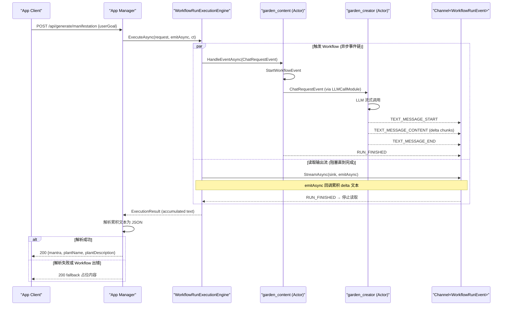

**实现要点：**

```csharp
// AIGenerationAppService.cs — Manifestation 示例
// _workflow 类型: IWorkflowRunCommandService (DI 注入)
public async Task<ManifestationResult> GenerateContentAsync(
    string userGoal, CancellationToken ct)
{
    var prompt = $"{Prompts.ManifestationSystem}\n\n{Prompts.ManifestationUser(userGoal)}";

    var sb = new StringBuilder();

    var result = await _workflow.ExecuteAsync(
        new WorkflowChatRunRequest(prompt, "garden_content", ActorId: null),
        (frame, _) =>
        {
            if (frame.Delta is not null)
                sb.Append(frame.Delta);
            return ValueTask.CompletedTask;
        },
        ct: ct);

    if (!result.Succeeded)
        throw new WorkflowExecutionException(workflowName, result.Error);

    return ParseManifestationJson(sb.ToString(), userGoal);
}

// Affirmation 示例 — 用 Prompts.Affirmation 模板插值 3 个入参
public async Task<AffirmationResult> GenerateAffirmationAsync(
    string userGoal, string mantra, string plantName, CancellationToken ct)
{
    var prompt = Prompts.Affirmation(mantra, plantName, userGoal);

    var text = await ExecuteWorkflowAsync("garden_affirmation", prompt, ct);

    return string.IsNullOrWhiteSpace(text)
        ? new AffirmationResult(_fallbackContent.GetAffirmationFallback())
        : new AffirmationResult(text.Trim());
}
```

**关键机制：**

1. `ExecuteAsync` 内部并行执行 Workflow 和读取输出流，读到 `RUN_FINISHED` 后返回
2. `emitAsync` 回调在每个 `TEXT_MESSAGE_CONTENT` delta 到达时触发，累积文本
3. 返回后将累积的 LLM 输出文本解析为业务 JSON
4. 解析失败时使用 fallback 占位内容，确保 API 始终返回有效响应

> 此模式适用于所有 4 个 AI 生成端点。`garden_image` 和 `garden_speech` 的 `connector_call` 步骤同样通过 Channel 推送输出，App Manager 以相同方式等待完成并提取结果。

---

## 4. 领域模型

### 4.1 GAgent 集群与状态结构

```mermaid
%%{init: {"maxTextSize": 100000, "flowchart": {"useMaxWidth": false, "nodeSpacing": 10, "rankSpacing": 50}, "themeVariables": {"fontSize": "10px"}}}%%
classDiagram
    class SyncEntityGAgent {
        <<GAgent per userId>>
        +HandleSyncEntities(EntitiesSyncRequestedEvent) Task
        +HandleSoftDeleteEntities(EntitiesSoftDeleteRequestedEvent) Task
        +HandleHardDeleteEntities(EntitiesHardDeleteRequestedEvent) Task
    }

    class SyncEntityState {
        <<Protobuf State>>
        +map~string, SyncEntity~ entities
        +SyncMeta meta
        +repeated string processed_sync_ids
    }

    class SyncEntity {
        +string client_id
        +string entity_type
        +string user_id
        +int32 revision
        +map~string, string~ refs
        +int32 position
        +Struct inputs
        +Struct output
        +Struct state
        +EntitySource source
        +bool bank_eligible
        +string bank_hash
        +Timestamp deleted_at
        +Timestamp created_at
        +Timestamp updated_at
    }

    class SyncMeta {
        +string user_id
        +int32 revision
    }

    class UserAccountGAgent {
        <<GAgent per userId>>
        +HandleRegisterUser(UserRegisteredEvent) Task
        +HandleLinkProvider(UserProviderLinkedEvent) Task
        +HandleUpdateLogin(UserLoginUpdatedEvent) Task
        +HandleDeleteAccount(AccountDeletedEvent) Task
    }

    class UserAccountState {
        <<Protobuf State>>
        +User user
    }

    class UserProfileGAgent {
        <<GAgent per userId>>
        +HandleCreateProfile(ProfileCreatedEvent) Task
        +HandleUpdateProfile(ProfileUpdatedEvent) Task
        +HandleDeleteProfile(ProfileDeletedEvent) Task
    }

    class UserProfileState {
        <<Protobuf State>>
        +Profile profile
    }

    class AuthLookupGAgent {
        <<GAgent per lookup key>>
        +HandleSetAuthLookup(AuthLookupSetEvent) Task
        +HandleClearAuthLookup(AuthLookupClearedEvent) Task
    }

    class AuthLookupState {
        <<Protobuf State>>
        +string lookup_key
        +string user_id
    }

    class User {
        <<Protobuf Message>>
        +string id
        +string auth_provider
        +string auth_provider_id
        +string email
        +bool email_verified
        +Timestamp created_at
        +Timestamp updated_at
        +Timestamp last_login_at
        +Timestamp last_synced_at
    }

    class Profile {
        <<Protobuf Message>>
        +string user_id
        +string first_name
        +string last_name
        +string gender
        +Timestamp date_of_birth
        +string timezone
        +repeated string interests
        +string purpose
        +bool notifications_enabled
        +string reminder_time
        +Timestamp created_at
        +Timestamp updated_at
    }

    class EntitySource {
        <<enum>>
        AI
        BANK
        USER
        EDITED
    }

    SyncEntityGAgent --> SyncEntityState
    SyncEntityState --> "*" SyncEntity : entities map
    SyncEntityState --> SyncMeta : meta
    UserAccountGAgent --> UserAccountState
    UserAccountState --> User : user
    UserProfileGAgent --> UserProfileState
    UserProfileState --> Profile : profile
    AuthLookupGAgent --> AuthLookupState
    SyncEntity --> SyncEntity : refs (parent)
    SyncEntity --> EntitySource : source
```

**为什么 entities + meta 放在同一个 GAgent：**

同步引擎的一次 `POST /api/sync` 请求同时读写 entities 和 meta（3 规则处理 + revision 原子递增 + 级联删除），它们构成同一个 DDD 聚合。拆分到不同 Actor 会引入无法解决的跨 Actor 事务问题。Actor 单线程执行天然保证了 revision 递增与实体写入的原子性。

> 所有业务数据统一为 `SyncEntity`，通过 `entityType` 区分语义，通过 `refs` 建立父子关系。SyncEntityGAgent 不感知具体 `entityType` 的业务含义，只执行通用同步规则。具体实体类型的语义约定由应用层定义（见 4.4）。

### 4.2 同步协议规则

```
实体同步协议 v6.1 — 3 条规则:

  1. 新建: 实体不在 State 且 revision === 0 → 插入并分配新 revision
  2. 更新: 实体在 State 且 revision === 已存储.revision → 更新并分配新 revision
  3. 过期: 其他所有情况 → 拒绝，返回原因

SyncAsync 内部流程:
  1. 扁平化 EntityMap → Entity[]
  2. 强制覆盖 userId
  3. 实体数量校验 (≤ 500)
  4. 逐实体执行 3 规则
  5. 级联软删除 (refs, 最大深度 5)
  6. 编辑检测: source → edited, bankEligible → false
  7. 构建增量 EntityMap (revision > clientRevision)

约束:
  - 服务端始终覆盖 userId（安全原则，防止客户端伪造）
  - 实体上限 500 条/次
  - 删除实体时自动级联软删除通过 refs 引用的子实体（最大深度 5）
  - AI 生成内容被编辑时自动标记 source: 'edited'、bankEligible: false

幂等性保证:
  - Actor 单线程执行：同一用户的 Sync 请求串行处理，不存在并发 race condition
  - syncId 幂等窗口：State.ProcessedSyncIds 保留最近 32 个已处理的 syncId，重复 syncId 直接跳过
  - 3 规则天然幂等：重复发送的实体（旧 revision）被规则 3 拒绝，不会重复写入
  - 不再需要 sync_log 幂等缓存（72h TTL MongoDB 集合）
```

### 4.3 领域事件

**命令事件（外部触发 → GAgent 处理）：**

| 事件 | 触发场景 | 携带数据 |
|------|---------|---------|
| `EntitiesSyncRequestedEvent` | Application 层发起同步 | syncId, userId, clientRevision, entities[] |
| `EntitiesSoftDeleteRequestedEvent` | Application 层发起软删除 | userId |
| `EntitiesHardDeleteRequestedEvent` | Application 层发起硬删除 | userId |

**领域事件（GAgent 内部产出）：**

| 事件 | 触发场景 | 携带数据 |
|------|---------|---------|
| `EntitiesSyncedEvent` | 同步处理完成 | syncId, userId, clientRevision, serverRevision, accepted[], rejected[], acceptedCount, rejectedCount, timestamp |
| `EntityCreatedEvent` | 同步中新建实体 | userId, clientId, entityType, revision, source, refs, inputs, output, state, position, bankEligible, bankHash, createdAt |
| `EntityUpdatedEvent` | 同步中更新实体 | userId, clientId, entityType, previousRevision, revision, source, refs, inputs, output, state, position, bankEligible, bankHash, updatedAt |
| `EntityDeletedEvent` | 同步中软删除实体 | userId, clientId, entityType, revision, deletedAt |
| `CascadeDeleteEvent` | 级联软删除子实体 | userId, parentClientId, deletedClientIds[], depth, deletedAt |
| `UserRegisteredEvent` | 用户注册 | userId, authProvider, authProviderId, email, emailVerified, registeredAt |
| `UserProviderLinkedEvent` | 跨 provider 关联 | userId, authProvider, authProviderId, emailVerified |
| `UserLoginUpdatedEvent` | 登录信息更新 | userId, email, emailVerified, lastLoginAt |
| `ProfileCreatedEvent` | 资料创建 | userId, firstName, lastName, interests, purpose, timezone, createdAt |
| `ProfileUpdatedEvent` | 资料更新 | userId, profile (Profile), updatedAt |
| `ProfileDeletedEvent` | 资料删除 | userId |
| `AccountDeletedEvent` | 账户删除 | userId, email, mode (soft/hard), entitiesAnonymizedCount, entitiesDeletedCount, deletedAt |
| `AuthLookupSetEvent` | 认证查找写入 | lookupKey, userId |
| `AuthLookupClearedEvent` | 认证查找清除 | lookupKey |

### 4.4 Soul Garden 应用层约定

> 以下内容是 Soul Garden 应用对通用同步引擎的业务层约定。SyncEntityGAgent 不感知这些语义——它只处理通用的 `entityType` 字符串、`inputs`/`output`/`state` Struct 和 `refs` 关系。具体的实体类型含义、字段语义、业务规则由应用层（App Manager + 前端）定义和管理。

**实体类型（EntityType）约定：**

| entityType | 说明 | 典型 inputs | 典型 output | 典型 state |
|------------|------|------------|-------------|-----------|
| `manifestation` | 愿望/植物 | `{userGoal}` | `{mantra, plantName, plantDescription}` | `{stage, waterCount}` |
| `affirmation` | 肯定语 | `{trigger, stage}` | `{text}` | — |

**生长进化规则（客户端逻辑，服务端不感知）：**

```
生长阶段由客户端管理在 SyncEntity.state.stage 中:
  stage: seed | sprout | growing | blooming

每 3 次浇水进化一个阶段 (客户端逻辑):
  waterCount 0-2  → Seed
  waterCount 3-5  → Sprout
  waterCount 6-8  → Growing
  waterCount 9+   → Blooming

进化后客户端可触发:
  1. POST /api/generate/plant-image → 生成新阶段图片
  2. POST /api/generate/affirmation → 生成进化肯定语 (trigger=evolution)
  3. 通过 POST /api/sync 将状态变更同步到服务端
```

> 服务端不主动执行浇水/进化逻辑，只做通用 3 规则校验（新建/更新/过期）。

**限额策略（配置声明式，后端不强制执行）：**

> 当前阶段**移除 `FreeTierPolicy` 后端判定逻辑**，不在 API 层做限额拦截。`GET /api/sync/limits` 端点仅从 `App:Quota` 配置节读取限额参数并返回给前端，由前端自行判定是否允许操作。后续再实现更通用的服务端限额策略。

**配置 `App:Quota`（appsettings.json 或环境变量）：**

```json
{
  "App": {
    "Quota": {
      "MaxSavedEntities": 10,
      "MaxEntitiesPerWeek": 3,
      "MaxOperationsPerDay": 3
    }
  }
}
```

**Soul Garden 默认值：**

| 参数 | 值 | 说明 |
|------|---|------|
| `MaxSavedEntities` | 10 | 最大活跃实体数（Soul Garden: 植物数） |
| `MaxEntitiesPerWeek` | 3 | 每周创建上限（Soul Garden: 种植数） |
| `MaxOperationsPerDay` | 3 | 每日操作上限（Soul Garden: 浇水数） |

**当前阶段行为：**
- `GET /api/sync/limits` — 从 `App:Quota` 读取限额参数，直接返回给前端（不做后端统计和判定）
- `POST /api/generate/*` — 不做限流检查，直接触发 Workflow
- 前端根据 limits 响应自行控制 UI（如禁用按钮、显示提示）
- 后续实现通用限额策略时，再加入后端拦截逻辑

**移除清单：**
- `FreeTierPolicy.cs` — 删除
- `GenerationOrchestrationAppService` 中的 `CanGenerateManifestationAsync` / `CanGenerateAffirmationAsync` — 删除限流判定逻辑
- `GenerateEndpoints.cs` 中的 paywall/限流检查 — 删除
- `FreeTierPolicyTests.cs` — 删除
- 集成测试中的 429 限流测试 — 删除

**AI 失败占位内容（FallbackContent — 配置驱动）：**

> FallbackContent 当前为硬编码常量（5 条植物占位 + 5 条肯定语占位 + 1 张占位图），与 Soul Garden 业务强绑定。

**配置化改造**：占位内容从代码常量改为 `fallbacks.json`（每个 App 配置包提供）：

```json
{
  "fallbacks": {
    "content": [
      {
        "name": "Seed of Potential",
        "mantra": "I am growing toward my highest self.",
        "description": "A seedling of infinite potential, waiting to bloom into your dreams."
      }
    ],
    "fixedContent": {
      "name": "Celestial Potential",
      "mantraTemplate": "I am successfully manifesting: {userGoal}",
      "description": "A beautiful plant full of potential, glowing with an inner light."
    },
    "affirmations": [
      "I nurture my dreams with belief and action.",
      "Each drop of water feeds my growing intentions."
    ],
    "fixedAffirmation": "I nurture my dreams with belief and action.",
    "placeholderImage": "iVBORw0KGgoAAAANSUhEUgAAAAEAAAABCAYAAAAfFcSJAAAADUlEQVR42mNk+M9QDwADhgGAWjR9awAAAABJRU5ErkJggg=="
  }
}
```

> FallbackContent 启动时从 `fallbacks.json` 或 `App:Fallbacks` 配置节加载；缺失时使用内置默认值（兼容当前 Soul Garden 行为）。

---

## 5. Projection Pipeline（投影读模型）

### 5.1 架构概述

Application 层的查询操作不直接读取 GAgent State，而是通过 **Projection Pipeline** 将 GAgent 发射的领域事件投影到 ReadModel，由 Application Service 查询 ReadModel 获取数据。

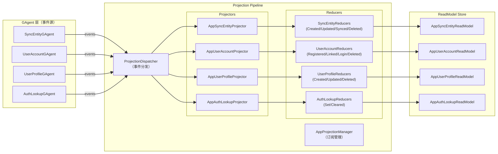

### 5.2 核心组件

| 组件 | 类名 | 职责 |
|------|------|------|
| 投影管理器 | `AppProjectionManager` | 管理 Actor → Projection 订阅生命周期，确保 Actor 事件流被投影消费 |
| 上下文工厂 | `DefaultAppProjectionContextFactory` | 创建 `AppProjectionContext`（含 ActorId、事件去重集合） |
| 投影基类 | `AppProjectorBase<TReadModel>` | 按 ActorId 前缀过滤事件、按 `EventTypeUrl` 路由到 Reducer、调用 Store 持久化 |
| 事件 Reducer 基类 | `AppEventReducerBase<TReadModel, TEvent>` | Protobuf 事件解包 + 类型安全的 Reduce 抽象 |
| 文档存储 | `IProjectionDocumentStore<TReadModel, TKey>` | ReadModel 持久化（InMemory / Elasticsearch） |

### 5.3 ReadModel 定义

| ReadModel | 主键 | 核心字段 | 对应 Projector |
|-----------|------|---------|---------------|
| `AppSyncEntityReadModel` | `syncentity:{userId}` | UserId, ServerRevision, Entities (Dict), SyncResults (最近 16 条), SyncResultOrder | `AppSyncEntityProjector` |
| `AppUserAccountReadModel` | `useraccount:{userId}` | UserId, AuthProvider, AuthProviderId, Email, EmailVerified, CreatedAt, LastLoginAt, Deleted | `AppUserAccountProjector` |
| `AppUserProfileReadModel` | `userprofile:{userId}` | UserId, FirstName, LastName, Gender, Timezone, Purpose, Interests, DateOfBirth, HasProfile, ProfileUpdatedAt | `AppUserProfileProjector` |
| `AppAuthLookupReadModel` | `authlookup:{lookupKey}` | LookupKey, UserId | `AppAuthLookupProjector` |
| `AppSyncEntityLastResultReadModel` | — | UserId, SyncId, ClientRevision, ServerRevision, Accepted, Rejected | — |

### 5.4 Completion Port（同步等待机制）

同步操作（`POST /api/sync`）的流程需要等待 Projection 完成后再读取 ReadModel 构建响应。`ICompletionPort` 提供了这个桥接机制：

```mermaid
%%{init: {"maxTextSize": 100000, "flowchart": {"useMaxWidth": false, "nodeSpacing": 10, "rankSpacing": 50}, "themeVariables": {"fontSize": "10px"}}}%%
sequenceDiagram
    participant App as "SyncAppService"
    participant Actor as "SyncEntityGAgent"
    participant Proj as "AppSyncEntityProjector"
    participant CP as "ICompletionPort"
    participant Store as "ReadModel Store"

    App->>Actor: SendCommandAsync(EntitiesSyncRequestedEvent)
    App->>CP: WaitAsync(syncId)
    Actor->>Actor: 3 规则处理 → 发射 EntityCreated/Updated + EntitiesSyncedEvent
    Actor-->>Proj: 事件流
    Proj->>Proj: Reduce → 更新 ReadModel
    Proj->>CP: Complete(syncId)
    CP-->>App: WaitAsync 返回
    App->>Store: GetAsync(actorId)
    Store-->>App: AppSyncEntityReadModel
    App->>App: 构建 SyncResult
```

**两种实现：**

| 实现 | 类名 | 适用场景 | 机制 |
|------|------|---------|------|
| Redis | `RedisCompletionPort` | 生产（Garnet 持久化后端） | Redis Pub/Sub 通道 + 本地 TCS，支持跨进程通知 |
| 内存 | `InMemoryCompletionPort` | 开发/测试 | `ConcurrentDictionary<string, TaskCompletionSource>` + 超时 |

### 5.5 存储后端

| 存储后端 | 类名 | 适用场景 | 配置 |
|----------|------|---------|------|
| InMemory | `AppInMemoryDocumentStore<TReadModel, TKey>` | 开发/测试 | 默认（`AddAppProjection()` 自动注册） |
| Elasticsearch | `AppElasticsearchProjectionExtensions` | 生产 | `App:Projection:Provider=Elasticsearch`，需在 `AddAppProjection()` 前调用 |

> Elasticsearch 后端对 `SyncEntity` ReadModel 的 `Entities` 和 `SyncResults` 字段设置 `enabled: false` 以避免 ES 字段数限制。

---

## 6. App Manager (Host 内 Application Service)

> **"App Manager" 概念说明**：本文中 "App Manager" 是逻辑概念，指 Host 进程内承载业务逻辑的 Application Service 集合，物理上跨两个项目：`Aevatar.App.Application`（业务服务：AI 生成协调、图片存储、校验、认证、并发控制、Projection 读模型查询）和 `Aevatar.App.Host.Api`（REST 端点、EndpointFilter、Bootstrap）。两者共同构成 App Manager 的完整能力。Application Service 查询数据时通过 Projection ReadModel Store 读取，不直接访问 GAgent State。限额参数通过 `App:Quota` 配置声明，`GET /api/sync/limits` 直接返回给前端，当前阶段后端不做限额判定。

### 6.1 架构

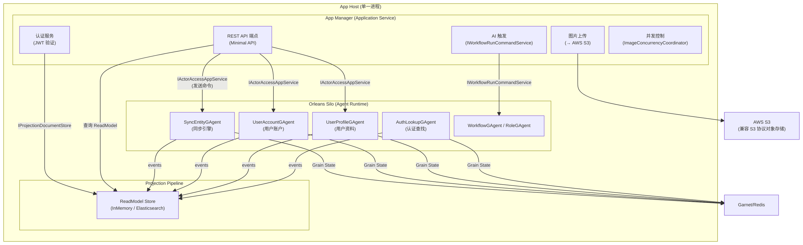

### 6.2 职责清单

```
App Manager (Host 内 Application Service):
├── 根端点
│   └── GET  /                            → 服务信息 + 可用端点列表 (仅调试/运维用，前端不调用)
├── 认证
│   ├── JWT 验证 (生产: Firebase RS256 / 开发: Trial HS256)
│   ├── findOrCreateUser() 隐式注册 + 跨 provider 关联
│   └── optionalAuthMiddleware (公开+可选增强 API)
├── 远程配置
│   └── GET /api/remote-config            → 返回 REMOTE_CONFIG 环境变量 JSON (🔓)
├── 用户管理 (→ UserAccountGAgent + UserProfileGAgent)
│   ├── GET  /api/users/me                → 用户信息 (UserAccountGAgent) + 资料 (UserProfileGAgent) + onboardingComplete
│   ├── POST /api/users/me/profile        → 创建资料 (→ UserProfileGAgent, 409 若已存在)
│   ├── PATCH /api/users/me/profile       → 更新资料 (→ UserProfileGAgent, 404 若不存在)
│   └── DELETE /api/users/me              → 删除账户 (?hard=true)
│       ├── soft: userId → deleted_xxx, 匿名化 inputs 中的用户敏感内容
│       │   清除 UserAccountGAgent + UserProfileGAgent State
│       └── hard: 清除 SyncEntityGAgent + UserAccountGAgent + UserProfileGAgent 所有状态，清除关联的 AuthLookupGAgent
├── 状态加载 (→ SyncEntityGAgent)
│   └── GET /api/state                    → 初始状态 (EntityMap + serverRevision)
│       ├── 调用 SyncEntityGAgent.GetStateAsync()
│       ├── 返回所有 deletedAt=null 的 SyncEntity (按 entityType 分组)
│       └── 返回当前 meta.revision
├── 实体同步 (→ SyncEntityGAgent)
│   ├── POST /api/sync                    → 实体同步 (v6.1 协议)
│   │   ├── 调用 SyncEntityGAgent.SyncAsync(SyncRequest)
│   │   ├── Actor 内部：扁平化 EntityMap → Entity[]
│   │   ├── Actor 内部：强制覆盖 userId (安全)
│   │   ├── Actor 内部：3 规则处理: 新建 / 更新 / 过期
│   │   ├── Actor 内部：级联软删除 (refs, 最大深度 5)
│   │   ├── Actor 内部：编辑检测: source → edited, bankEligible → false
│   │   ├── Actor 内部：构建增量 EntityMap (revision > clientRevision)
│   │   └── 支持 text/plain Content-Type (sendBeacon 兼容)
│   └── GET /api/sync/limits              → 限额参数（从配置读取）
│       └── 返回: {limits} (直接读取 App:Quota 配置，不做后端统计)
├── AI 生成 (只返回原始内容, 不写 Actor State)
│   ├── POST /api/generate/manifestation  → 生成植物内容
│   │   ├── 输入: {userGoal}
│   │   ├── 触发 garden_content Workflow
│   │   ├── AI 失败时返回占位内容
│   │   └── 返回: {mantra, plantName, plantDescription}
│   ├── POST /api/generate/affirmation    → 生成肯定语
│   │   ├── 输入: {userGoal, mantra, plantName, clientId?, stage?, trigger?}
│   │   ├── 触发 garden_affirmation Workflow
│   │   └── 返回: {affirmation, trigger, stage, generatedAt}
│   ├── POST /api/generate/plant-image    → 生成植物图片
│   │   ├── 输入: {manifestationId, plantName, plantDescription?, stage}
│   │   ├── 并发控制 (imagePool, 可排队/超时/拒绝)
│   │   ├── 触发 garden_image Workflow
│   │   └── 返回: {success, imageData (base64), isPlaceholder}
│   └── POST /api/generate/speech         → 生成语音
│       ├── 输入: {text}
│       ├── 触发 garden_speech Workflow
│       └── 返回: {audioData (base64)}
├── 图片上传
│   └── POST /api/upload/plant-image      → 上传植物图片 (不写 Actor State)
│       ├── 输入: {stage, imageData (base64 PNG)}
│       ├── 并发控制 (imagePool, 优先级高于生成)
│       ├── 上传到 AWS S3
│       └── 返回: {success, imageUrl}
└── 健康检查
    ├── GET /health                       → 完整检查 (Grain State + Storage + 并发池状态)
    ├── GET /health/live                  → 存活探针
    └── GET /health/ready                 → 就绪探针
```

### 6.3 API 端点与旧版映射

#### 新 API 端点 (完整清单)

```
GET    /                               # 服务信息 + 可用端点列表 (🔓, 仅调试/运维用，前端不调用)

/health/
├── GET    /                           # 完整健康检查 (Grain State + Storage + 并发池) (🔓)
├── GET    /live                       # 存活探针 (🔓)
└── GET    /ready                      # 就绪探针 (🔓)

/api/remote-config
└── GET    /                           # 远程配置 (REMOTE_CONFIG 环境变量) (🔓)

/api/auth/
└── POST   /register-trial             # 试用注册 (🔓, 仅开发/测试)

/api/users/
├── GET    /me                         # 用户信息 + 资料 + onboardingComplete
├── POST   /me/profile                 # 创建资料
├── PATCH  /me/profile                 # 更新资料
└── DELETE /me                         # 删除账户 (?hard=true)

/api/state
└── GET    /                           # 初始状态加载 (EntityMap + serverRevision)

/api/sync
├── POST   /                           # 实体同步 (v6.1 协议)
└── GET    /limits                     # 限额参数 (从 App:Quota 读取)

/api/generate/
├── POST   /manifestation              # AI 生成植物内容 (不写 State)
├── POST   /affirmation                # AI 生成肯定语 (不写 State)
├── POST   /plant-image                # AI 生成植物图片 (不写 State)
└── POST   /speech                     # AI TTS (不写 State)

/api/upload/
└── POST   /plant-image                # 上传植物图片 (不写 State, 仅存储)

# Aevatar Capability 自动映射 (用于调试)
/api/chat                              # Workflow SSE
/api/agents                            # Agent 列表
/api/workflows                         # Workflow 列表
```

#### 旧 → 新端点映射表

| 旧端点 | 新端点 | 状态 |
|--------|--------|------|
| `GET /` | `GET /` | **保留** |
| `GET /health` | `GET /health` | **保留** |
| `GET /health/live` | `GET /health/live` | **保留** |
| `GET /health/ready` | `GET /health/ready` | **保留** |
| `GET /api/remote-config` | `GET /api/remote-config` | **保留** (返回 REMOTE_CONFIG 环境变量 JSON) |
| `POST /api/auth/register-trial` | `POST /api/auth/register-trial` | **保留** |
| `GET /api/users/me` | `GET /api/users/me` | **保留** |
| `POST /api/users/me/profile` | `POST /api/users/me/profile` | **保留** |
| `PATCH /api/users/me/profile` | `PATCH /api/users/me/profile` | **保留** |
| `DELETE /api/users/me` | `DELETE /api/users/me` | **保留** |
| `GET /api/state` | `GET /api/state` | **保留** (EntityMap + serverRevision) |
| `POST /api/sync` | `POST /api/sync` | **保留** (实体同步 v6.1, 从 MongoDB 移植到 GAgent) |
| `GET /api/sync/limits` | `GET /api/sync/limits` | **保留** |
| `POST /api/generate/manifestation` | `POST /api/generate/manifestation` | **保留** (不写 State, 前端通过 sync 存储) |
| `POST /api/generate/affirmation` | `POST /api/generate/affirmation` | **保留** (不写 State, 前端通过 sync 存储) |
| `POST /api/generate/speech` | `POST /api/generate/speech` | **保留** |
| `POST /api/generate/plant-image` | `POST /api/generate/plant-image` | **保留** (不写 State) |
| `POST /api/upload/plant-image` | `POST /api/upload/plant-image` | **保留** (不写 State, 仅上传到存储) |
| `GET /api/data/sync` | — | **废弃** (Legacy CF Worker) |
| `POST /api/data/sync` | — | **废弃** (Legacy CF Worker) |
| `DELETE /api/data/reset` | `DELETE /api/users/me` | **合并** |
| `GET /api/test-route` | — | **废弃** (调试用) |

### 6.4 API 请求/响应规格

#### 🔓 `GET /`（仅调试/运维，前端不调用）

**返回 (200)：**

```json
{
  "status": "ok",
  "service": "aevatar-app-api",
  "version": "3.0.0",
  "timestamp": "ISO 时间字符串",
  "endpoints": {
    "health": "/health",
    "remoteConfig": "/api/remote-config",
    "state": "GET /api/state",
    "sync": "POST /api/sync",
    "users": "/api/users/*",
    "auth": "/api/auth/*",
    "generate": "/api/generate/*",
    "upload": "/api/upload/*"
  }
}
```

#### 通用错误格式

```json
{
  "error": {
    "code": "VALIDATION_ERROR | NOT_FOUND | FORBIDDEN | LIMIT_REACHED | SERVICE_UNAVAILABLE | CONFLICT",
    "message": "可读错误信息",
    "issues": [{ "path": "字段路径", "message": "详情" }]
  }
}
```

#### 🔓 `GET /health`

**返回 (200 / 503)：**

```json
{
  "status": "ok | degraded",
  "timestamp": "ISO 时间字符串",
  "checks": { "grain_state": "ok | error", "storage": "ok | error" },
  "concurrency": {
    "activeGenerates": 0,
    "activeUploads": 0,
    "availableSlots": 20,
    "queueLength": 0,
    "maxTotal": 20
  }
}
```

> `concurrency` 结构与旧版 `imagePool.stats` 保持一致（5 字段），区分生成和上传的活跃数，便于运维监控。

#### 🔓 `GET /health/live`

**返回 (200)：** `{ "status": "ok", "timestamp": "ISO" }`

#### 🔓 `GET /health/ready`

**返回 (200 / 503)：** `{ "status": "ready | not_ready", "timestamp": "ISO" }`

#### 🔓 `GET /api/remote-config`

**返回 (200)：** `REMOTE_CONFIG` 环境变量解析后的 JSON 对象，未配置时返回 `{}`。

#### 🔓 `POST /api/auth/register-trial`（仅开发/测试）

**请求体：**

```json
{
  "email": "string（必填，邮箱格式）",
  "turnstileToken": "string（可选）"
}
```

**返回 (201 新用户 / 200 已存在)：**

```json
{
  "token": "string（JWT，HS256，永不过期）",
  "trialId": "string",
  "existing": true
}
```

> `existing` 字段仅在用户已存在时返回。

**错误：** `400` — `MISSING_FIELDS` | `INVALID_EMAIL`；`409` — `EMAIL_EXISTS`

#### `GET /api/users/me`

**返回 (200)：**

```json
{
  "user": { "id": "string", "email": "string", "createdAt": "ISO" },
  "profile": {
    "firstName": "string",
    "lastName": "string",
    "interests": ["string"],
    "purpose": "string",
    "timezone": "string",
    "notificationsEnabled": false,
    "reminderTime": "string | null"
  },
  "onboardingComplete": true
}
```

> `profile` 未创建时为 `null`，`onboardingComplete` 对应为 `false`。

#### `POST /api/users/me/profile`

**请求体（所有字段可选，有默认值）：**

```json
{
  "firstName": "string（最长 100，默认: ''）",
  "lastName": "string（最长 100，默认: ''）",
  "gender": "string（最长 50，默认: ''）",
  "dateOfBirth": "string | null",
  "interests": ["string"]（最多 10 个）,
  "purpose": "string | [string]（最长 500，默认: ''）",
  "timezone": "string（最长 50，默认: 'UTC'）",
  "notificationsEnabled": false,
  "reminderTime": "string | null"
}
```

> `purpose` 如果传入数组会自动转为逗号分隔字符串。请求体可以为空。

**返回 (201)：** `ProfileResponse` 对象

**错误：** `409` — 资料已存在（应使用 PATCH 更新）

#### `PATCH /api/users/me/profile`

**请求体：** 与 POST 相同（所有字段可选，只传需要更新的字段）

**返回 (200)：** `ProfileResponse` 对象

**错误：** `404` — 资料不存在（应先使用 POST 创建）

#### `DELETE /api/users/me`

**查询参数：** `?hard=true`（永久删除） | 默认软删除并匿名化

**返回 (200)：**

```json
{
  "success": true,
  "mode": "hard | soft",
  "deletedAt": "ISO 时间字符串",
  "message": "string"
}
```

**软删除行为：**
- `SyncEntityGAgent.State.entities` 中 `userId` → `deleted_xxx`，匿名化 `inputs` 中的用户敏感内容
- 清除 `UserAccountGAgent` + `UserProfileGAgent` State

**硬删除行为：** 清除 `SyncEntityGAgent` + `UserAccountGAgent` + `UserProfileGAgent` 所有状态，清除关联的 `AuthLookupGAgent`（按 User 中记录的 provider/email 定位 key）

#### `GET /api/state`

**返回 (200)：**

```json
{
  "entities": {
    "manifestation": {
      "manifestation_a1b2c3": {
        "clientId": "manifestation_a1b2c3",
        "entityType": "manifestation",
        "userId": "string",
        "revision": 5,
        "refs": {},
        "position": 0,
        "inputs": { "userGoal": "..." },
        "output": { "mantra": "...", "plantName": "...", "plantDescription": "..." },
        "state": { "stage": "seed", "waterCount": 0 },
        "source": "ai",
        "bankEligible": true,
        "bankHash": "abc123",
        "deletedAt": null,
        "createdAt": "ISO",
        "updatedAt": "ISO"
      }
    }
  },
  "serverRevision": 42
}
```

> 返回所有 `deletedAt = null` 的实体（按 `entityType` 分组为 `EntityMap`）+ 当前 `sync_meta.revision`。

#### `POST /api/sync`

**请求体：**

```json
{
  "syncId": "string（必填，请求-响应关联标识，前端用于匹配响应归属）",
  "clientRevision": 0,
  "entities": {
    "manifestation": {
      "manifestation_a1b2c3": {
        "clientId": "manifestation_a1b2c3",
        "entityType": "manifestation",
        "userId": "string",
        "revision": 0,
        "refs": {},
        "position": 0,
        "inputs": { "userGoal": "..." },
        "output": { "mantra": "...", "plantName": "...", "plantDescription": "..." },
        "state": { "stage": "seed", "waterCount": 0 },
        "source": "ai",
        "bankEligible": true,
        "bankHash": "abc123",
        "deletedAt": null,
        "createdAt": "ISO",
        "updatedAt": "ISO"
      }
    }
  }
}
```

> 支持 `text/plain` Content-Type（`sendBeacon` 兼容，通过请求管道中间件实现）。实体上限 500 条/次。
>
> **sendBeacon 兼容实现**：浏览器 `navigator.sendBeacon()` 发送的请求 Content-Type 为 `text/plain`，Minimal API 默认不将其作为 JSON 解析（返回 415）。注意：MVC 的 `InputFormatter` 管道**不适用于 Minimal API**（Minimal API 使用独立的 parameter binding 机制，不经过 `InputFormatter` pipeline）。正确方案是在请求管道中注册中间件，在 model binding 之前将 Content-Type 改写为 `application/json`：
>
> ```csharp
> // Program.cs — sendBeacon 兼容中间件（在 MapAppEndpoints 之前注册）
> app.Use(async (context, next) =>
> {
>     if (context.Request.Path.StartsWithSegments("/api/sync")
>         && context.Request.Method == "POST"
>         && context.Request.ContentType?.StartsWith("text/plain") == true)
>     {
>         context.Request.ContentType = "application/json";
>     }
>     await next();
> });
> ```

**返回 (200)：**

```json
{
  "syncId": "string",
  "serverRevision": 43,
  "entities": { "... EntityMap，revision > clientRevision 的增量实体 ..." },
  "accepted": ["manifestation_a1b2c3"],
  "rejected": [
    { "clientId": "manifestation_xyz", "serverRevision": 5, "reason": "Stale: client=3, server=5" }
  ]
}
```

#### `GET /api/sync/limits`

> 从 `App:Quota` 配置节读取限额参数，直接返回给前端。不做后端统计和判定。

**返回 (200)：**

```json
{
  "limits": { "maxSavedPlants": 10, "maxPlantsPerWeek": 3, "maxWateringsPerDay": 3 }
}
```

#### `POST /api/generate/manifestation`

**请求体：**

```json
{ "userGoal": "string（必填，1-500 字符）" }
```

**返回 (200)：**

```json
{ "mantra": "宣言文本", "plantName": "植物名称", "plantDescription": "植物描述" }
```

> AI 失败时返回占位内容（不报错，200）。当前阶段不做后端限流。

#### `POST /api/generate/affirmation`

**请求体：**

```json
{
  "userGoal": "string（必填，1-500 字符）",
  "mantra": "string（必填，1-500 字符）",
  "plantName": "string（必填，1-200 字符）",
  "clientId": "string（可选，用于前端追踪）",
  "stage": "seed | sprout | growing | blooming（可选）",
  "trigger": "daily_interaction | evolution | watering | manual（默认: manual）"
}
```

**返回 (200)：**

```json
{ "affirmation": "肯定语文本", "trigger": "manual", "stage": "seed", "generatedAt": "ISO" }
```
> AI 失败时返回占位肯定语（不报错，200）。当前阶段不做后端限流。

#### `POST /api/generate/plant-image`

**请求体：**

```json
{
  "manifestationId": "string（必填）",
  "plantName": "string（必填，1-200 字符）",
  "plantDescription": "string（可选，最长 500 字符）",
  "stage": "seed | sprout | growing | blooming"
}
```

> `manifestationId` 在生成接口中仅作为业务标识入参；当前实现不将其写入 Actor State，也不参与 prompt 构建。

**返回 (200)：**

```json
{ "success": true, "imageData": "string（base64 PNG）", "isPlaceholder": false }
```

**错误：**
- `429` — `{ "success": false, "reason": "rate_limit", "message": "..." }`
- `503` — `{ "success": false, "reason": "overloaded", "message": "..." }`（队列满或超时）
- `500` — `{ "success": false, "reason": "unknown", "message": "..." }`

> `isPlaceholder: true` 表示 AI 不可用时的占位图。有并发控制（`imagePool`）。

#### `POST /api/generate/speech`

**请求体：**

```json
{ "text": "string（必填，1-1000 字符）" }
```

**返回 (200)：**

```json
{ "audioData": "string（base64 音频）" }
```

**错误：**
- `429` — `{ "error": "Speech generation failed", "reason": "rate_limit" }`
- `500` — `{ "error": "Speech generation failed", "reason": "no_audio | unknown" }`

> 无 fallback，失败直接返回错误。

#### `POST /api/upload/plant-image`

**请求体：**

```json
{
  "stage": "seed | sprout | growing | blooming",
  "imageData": "string（必填，base64 PNG）"
}
```

**返回 (200)：**

```json
{ "success": true, "imageUrl": "string（公开访问 URL）" }
```

> 上传到 AWS S3，返回 URL。不写 Actor State。有并发控制（`imagePool`，优先级高于生成）。

---

## 7. 项目结构

### 7.1 目录布局

```
apps/aevatar-app/
│
├── src/                                        # ═══ 平台运行时代码（通用，不随 App 变化）═══
│   ├── Aevatar.App.GAgents/                    # GAgent 层 (Actor + Protobuf 领域模型 + 业务规则)
│   │   ├── Aevatar.App.GAgents.csproj
│   │   ├── Proto/
│   │   │   ├── sync_entity.proto                 # SyncEntityGAgent (State + Events)
│   │   │   ├── user_account.proto               # UserAccountGAgent (State + Events)
│   │   │   ├── user_profile.proto               # UserProfileGAgent (State + Events)
│   │   │   └── auth_lookup.proto                # AuthLookupGAgent (State + Events)
│   │   ├── Rules/
│   │   │   └── SyncRules.cs                     # 3 条同步规则 (新建/更新/过期)
│   │   ├── SyncEntityResults.cs                 # GAgent 操作结果类型 (SyncResult/StateResult)
│   │   ├── SyncEntityGAgent.cs                  # 同步引擎 GAgent (3 规则 + revision + 级联删除)
│   │   ├── SyncEntityGAgent.Helpers.cs          # 同步引擎辅助方法 (级联删除 + TransitionState)
│   │   ├── UserAccountGAgent.cs                 # 用户账户 GAgent
│   │   ├── UserProfileGAgent.cs                 # 用户资料 GAgent
│   │   └── AuthLookupGAgent.cs                  # 认证查找 GAgent (per lookup key)
│   │
│   ├── Aevatar.App.Application/                # 应用层 (业务编排 + Projection 查询)
│   │   ├── Aevatar.App.Application.csproj
│   │   ├── Contracts/
│   │   │   ├── SyncRequestDto.cs                # 同步请求 DTO
│   │   │   ├── SyncResponseDto.cs               # 同步响应 DTO
│   │   │   └── EntityDto.cs                     # 单个实体 DTO (强类型字段)
│   │   ├── Services/
│   │   │   ├── AIGenerationAppService.cs        # AI 生成协调 (触发 Workflow + Connector)
│   │   │   ├── IAIGenerationAppService.cs       # AI 生成协调接口
│   │   │   ├── GenerationAppService.cs          # 生成编排 (委托 AI 服务 + fallback 兜底)
│   │   │   ├── IGenerationAppService.cs         # 生成编排接口
│   │   │   ├── SyncAppService.cs                # 同步编排 (→ Projection ReadModel 查询)
│   │   │   ├── ISyncAppService.cs               # 同步编排接口
│   │   │   ├── UserAppService.cs                # 用户编排 (→ Projection ReadModel 查询)
│   │   │   ├── IUserAppService.cs               # 用户编排接口
│   │   │   ├── AuthAppService.cs                # 认证编排 (→ Projection ReadModel 查询)
│   │   │   ├── IAuthAppService.cs               # 认证编排接口
│   │   │   ├── ActorAccessAppService.cs         # Actor 访问 (IActorRuntime 封装)
│   │   │   ├── IActorAccessAppService.cs        # Actor 访问接口
│   │   │   ├── ImageStorageAppService.cs        # 图片上传 (AWS S3 兼容存储)
│   │   │   ├── IImageStorageAppService.cs       # 图片存储接口
│   │   │   ├── AwsS3StorageClient.cs            # S3 存储客户端 (AWSSDK.S3)
│   │   │   ├── Prompts.cs                       # Prompt 模板常量
│   │   │   ├── FallbackContent.cs               # AI 失败占位内容池 (从 fallbacks.json 或配置加载)
│   │   │   ├── IFallbackContent.cs              # 占位内容接口
│   │   │   └── AppQuotaOptions.cs               # 限额参数 Options
│   │   ├── Completion/
│   │   │   ├── ICompletionPort.cs               # 同步等待接口 (WaitAsync/Complete)
│   │   │   └── InMemoryCompletionPort.cs        # 内存实现 (开发/测试)
│   │   ├── Concurrency/
│   │   │   ├── IImageConcurrencyCoordinator.cs  # 并发协调接口
│   │   │   └── ImageConcurrencyCoordinator.cs   # 进程内并发协调 (lock + 队列 + 超时)
│   │   ├── Projection/
│   │   │   ├── AppProjectionContext.cs          # 投影上下文 (事件去重)
│   │   │   ├── DependencyInjection/
│   │   │   │   └── AppProjectionServiceCollectionExtensions.cs  # DI 注册
│   │   │   ├── Orchestration/
│   │   │   │   ├── AppProjectionManager.cs      # 投影订阅管理
│   │   │   │   ├── IAppProjectionManager.cs     # 投影管理接口
│   │   │   │   ├── DefaultAppProjectionContextFactory.cs
│   │   │   │   └── IAppProjectionContextFactory.cs
│   │   │   ├── Projectors/
│   │   │   │   ├── AppProjectorBase.cs          # 投影基类 (前缀过滤 + Reducer 路由)
│   │   │   │   ├── AppSyncEntityProjector.cs    # 同步实体投影 (含 CompletionPort 通知)
│   │   │   │   ├── AppUserAccountProjector.cs   # 用户账户投影
│   │   │   │   ├── AppUserProfileProjector.cs   # 用户资料投影
│   │   │   │   └── AppAuthLookupProjector.cs    # 认证查找投影
│   │   │   ├── ReadModels/
│   │   │   │   ├── AppSyncEntityReadModel.cs    # 同步实体读模型
│   │   │   │   ├── AppSyncEntityLastResultReadModel.cs
│   │   │   │   ├── SyncEntityEntry.cs           # 读模型内实体条目 POCO
│   │   │   │   ├── AppUserAccountReadModel.cs   # 用户账户读模型
│   │   │   │   ├── AppUserProfileReadModel.cs   # 用户资料读模型
│   │   │   │   └── AppAuthLookupReadModel.cs    # 认证查找读模型
│   │   │   ├── Reducers/
│   │   │   │   ├── AppEventReducerBase.cs       # Reducer 基类 (Protobuf 解包)
│   │   │   │   ├── SyncEntityReducers.cs        # 同步实体事件 Reducer
│   │   │   │   ├── UserAccountReducers.cs       # 用户账户事件 Reducer
│   │   │   │   ├── UserProfileReducers.cs       # 用户资料事件 Reducer
│   │   │   │   └── AuthLookupReducers.cs        # 认证查找事件 Reducer
│   │   │   └── Stores/
│   │   │       └── AppInMemoryDocumentStore.cs  # 内存文档存储 (开发/测试)
│   │   ├── Validation/
│   │   │   ├── SyncRequestValidator.cs          # FluentValidation AbstractValidator<SyncRequestDto>
│   │   │   └── EntityValidator.cs               # FluentValidation AbstractValidator<EntityDto>
│   │   ├── Errors/
│   │   │   └── AppErrorMiddleware.cs            # 全局异常处理中间件
│   │   └── Auth/
│   │       ├── FirebaseAuthHandler.cs           # Firebase RS256 签名验证
│   │       ├── TrialAuthHandler.cs              # Trial HS256 签名验证 (仅 dev/test)
│   │       ├── AppAuthSchemeProvider.cs          # 多 scheme 路由选择 (Firebase → Trial)
│   │       ├── AppAuthService.cs                # 认证服务 (token 验证 + JWKS 缓存)
│   │       ├── IAppAuthService.cs               # 认证服务接口
│   │       ├── AppUserProvisioningMiddleware.cs  # findOrCreateUser
│   │       ├── OptionalAuthMiddleware.cs        # 公开 + 可选增强 API
│   │       ├── IAppAuthContextAccessor.cs       # 认证上下文访问器接口
│   │       └── AuthPrincipalExtensions.cs       # Claims 提取扩展
│   │
│   └── Aevatar.App.Host.Api/                  # 宿主层
│       ├── Aevatar.App.Host.Api.csproj
│       ├── Program.cs                           # Bootstrap (启动校验 + DI + Middleware + Endpoints)
│       ├── Hosting/
│       │   ├── AppDistributedHostBuilderExtensions.cs  # Orleans 分布式配置
│       │   ├── AppElasticsearchProjectionExtensions.cs # Elasticsearch 投影存储注册
│       │   └── AppStartupValidation.cs          # 启动配置校验 (fail-fast)
│       ├── Completion/
│       │   └── RedisCompletionPort.cs           # Redis Pub/Sub CompletionPort (生产)
│       ├── Endpoints/
│       │   ├── StateEndpoints.cs                # GET /api/state
│       │   ├── SyncEndpoints.cs                 # POST /api/sync, GET /api/sync/limits
│       │   ├── UserEndpoints.cs                 # /api/users/me/*
│       │   ├── GenerateEndpoints.cs             # /api/generate/*
│       │   ├── UploadEndpoints.cs               # POST /api/upload/plant-image
│       │   ├── AuthEndpoints.cs                 # POST /api/auth/register-trial
│       │   ├── ConfigEndpoints.cs               # GET /api/remote-config
│       │   ├── HealthEndpoints.cs               # /health/*
│       │   └── Mappers/
│       │       └── EntityMapMapper.cs           # EntityMap ↔ DTO 双向映射
│       ├── Filters/
│       │   ├── GenerateGuardFilter.cs            # IEndpointFilter — 图片生成并发守卫
│       │   └── UploadTrackerFilter.cs            # IEndpointFilter — 上传并发追踪
│       ├── appsettings.json                     # Soul Garden 默认配置
│       └── appsettings.Development.json         # 开发环境覆盖
│
├── config/                                     # ═══ Soul Garden App 配置包 ═══
│   └── fallbacks.json                           # AI 失败占位内容池
│
├── workflows/                                  # ═══ Soul Garden Workflow 定义 ═══
│   ├── garden_content.yaml                     # 植物内容生成 (llm_call)
│   ├── garden_affirmation.yaml                 # 肯定语生成 (llm_call)
│   ├── garden_image.yaml                       # 植物图片生成 (connector_call → Gemini imagen)
│   └── garden_speech.yaml                      # TTS 语音合成 (connector_call → Gemini TTS)
│
├── connectors/                                 # ═══ Soul Garden Connector 配置 ═══
│   └── garden.connectors.json                  # Connector 配置 (gemini_imagen / gemini_tts)
│
├── test/
│   ├── Aevatar.App.GAgents.Tests/               # GAgent 单元 + 端到端测试 (11 文件)
│   │   └── (SyncEntity/UserAccount/UserProfile/AuthLookup/SyncRules 测试)
│   ├── Aevatar.App.Application.Tests/            # Application 层单元测试 (26 文件)
│   │   ├── Projection/                           # Reducer + Projector 测试
│   │   └── (Auth/Services/Validation/Contracts/Concurrency 测试)
│   └── Aevatar.App.Host.Api.Tests/               # API 集成测试 (12 文件)
│       └── (Sync/Generate/Upload/Auth/User 集成测试 + AppTestFixture)
│
├── Dockerfile                                  # 容器化构建（产出通用镜像）
│
└── docs/
    └── refactoring-plan.md
```

**新 App 上线流程（不改代码）：**

```
apps/
├── aevatar-app/          # 第一个 App（含平台运行时源码 + Soul Garden 配置包）
│   ├── src/              # 平台运行时代码
│   ├── config/           # Soul Garden 配置包
│   ├── workflows/        # Soul Garden Workflow
│   ├── connectors/       # Soul Garden Connector
│   └── Dockerfile
│
└── <new-app>/            # 新 App（仅配置包，不含源码）
    ├── config/
    │   ├── appsettings.json     # 新 App 的认证/存储/限额参数（含 App:Quota 配置节）
    │   └── fallbacks.json       # 新 App 的 AI 占位内容
    ├── workflows/               # 新 App 的 Workflow YAML
    ├── connectors/              # 新 App 的 Connector 配置
    └── docker-compose.yml       # 复用同一镜像，挂载新 App 配置包
```

> 新 App 部署时复用 Soul Garden 构建产出的同一 Docker 镜像，仅通过 `AEVATAR_HOME` 环境变量指向新 App 的配置包目录，加上 `appsettings.json` 环境变量覆盖。

### 7.2 项目依赖关系

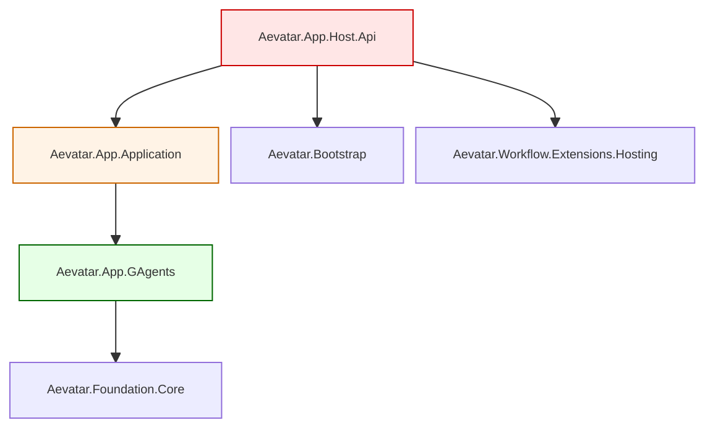

---

## 8. 数据流与持久化

### 8.1 创建植物完整时序（AI 生成 + 同步存储）

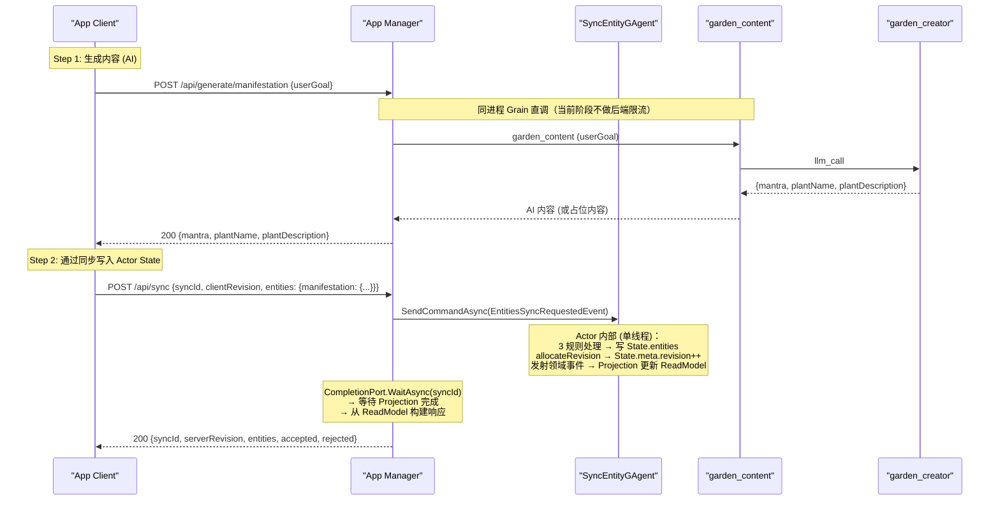

### 8.2 实体同步时序

```mermaid
%%{init: {"maxTextSize": 100000, "flowchart": {"useMaxWidth": false, "nodeSpacing": 10, "rankSpacing": 50}, "themeVariables": {"fontSize": "10px"}}}%%
sequenceDiagram
    participant Client as "App Client"
    participant Sync as "SyncAppService"
    participant Actor as "SyncEntityGAgent"
    participant Proj as "Projection Pipeline"
    participant CP as "CompletionPort"
    participant Store as "ReadModel Store"

    Client->>Sync: POST /api/sync {syncId, clientRevision, entities}

    Sync->>Actor: SendCommandAsync(EntitiesSyncRequestedEvent)
    Sync->>CP: WaitAsync(syncId)

    Note over Actor: Actor 单线程执行（天然串行）

    Actor->>Actor: flattenEntities + 覆盖 userId
    Actor->>Actor: 实体数量校验 (≤ 500)

    loop 每个实体
        alt revision === 0 且不在 State.entities
            Actor->>Actor: revision++ → 写入 State + 发射 EntityCreatedEvent
        else revision === existing.revision
            Actor->>Actor: revision++ → 更新 State + 发射 EntityUpdatedEvent
            alt deletedAt 不为空
                Actor->>Actor: cascadeDelete (max depth 5) + 发射 CascadeDeleteEvent
            end
        else 其他
            Note over Actor: rejected (Stale)
        end
    end

    Actor->>Actor: 发射 EntitiesSyncedEvent
    Actor-->>Proj: 事件流
    Proj->>Proj: Reducers 更新 ReadModel
    Proj->>CP: Complete(syncId)
    CP-->>Sync: WaitAsync 返回
    Sync->>Store: GetAsync(actorId)
    Store-->>Sync: AppSyncEntityReadModel
    Sync->>Sync: 构建 SyncResult (delta entities + accepted + rejected)
    Sync-->>Client: 200 {syncId, serverRevision, entities, accepted, rejected}
```

### 8.3 持久化策略

| 数据 | 旧实现 (MongoDB) | 新实现 (GAgent State) | 说明 |
|------|-----------------|---------------------|------|
| 用户账户 | `users` 集合 | `UserAccountGAgent.State` | Protobuf: `User` |
| 用户资料 | `profiles` 集合 | `UserProfileGAgent.State` | Protobuf: `Profile` |
| 同步实体 (所有业务数据) | `sync_entities` 集合 | `SyncEntityGAgent.State.entities` | Protobuf: `map<string, SyncEntity>` |
| 同步元数据 | `sync_meta` 集合 | `SyncEntityGAgent.State.meta` | Protobuf: `SyncMeta` |
| 同步幂等日志 | `sync_log` 集合 (72h TTL) | `State.ProcessedSyncIds` (最近 32 条) | 精简为 Actor State 内滑动窗口 |
| 认证索引 | `users` 集合索引 | `AuthLookupGAgent.State` (per key) | Protobuf: `AuthLookupState { lookup_key, user_id }`，lookup_key 格式: `firebase:{uid}` / `trial:{trialId}` / `email:{email}` |
| 图片文件 | Chrono / R2 (双模) | AWS S3 (兼容 S3 协议对象存储) | AWSSDK.S3 |
| 应用配置 | `app_config` 集合 (仅启动 seed) | `appsettings.json` + 环境变量 | 不再存储到 Actor State |
| 同步树 | `sync_trees` 集合 | **废弃** | 已在 Node.js 版本废弃 |
| Workflow/Agent 状态 | N/A | Aevatar State Store | Garnet/Redis |

### 8.4 Protobuf 定义（按 GAgent 分文件，State + Events 合并）

> **命名风格约定**：Protobuf 使用 `snake_case`（如 `client_id`、`entity_type`），C# 生成属性为 `PascalCase`（如 `ClientId`、`EntityType`），API JSON 序列化输出为 `camelCase`（如 `clientId`、`entityType`）。三者语义相同，仅随层级自动转换。本文 4.1 类图按 Protobuf 视角展示字段，5.4 API 规格按 JSON 视角展示字段。

```protobuf
// Proto/sync_entity.proto — SyncEntityGAgent (State + Events)
syntax = "proto3";
package aevatar_app;
import "google/protobuf/timestamp.proto";
import "google/protobuf/struct.proto";

// ─── State ───

message SyncEntityState {
  map<string, SyncEntity> entities = 1;  // clientId → entity
  SyncMeta meta = 2;
  repeated string processed_sync_ids = 3;  // 最近 32 个已处理 syncId（幂等窗口）
}

message SyncEntity {
  string client_id = 1;
  string entity_type = 2;
  string user_id = 3;
  int32 revision = 4;
  map<string, string> refs = 5;
  int32 position = 6;
  google.protobuf.Struct inputs = 7;
  google.protobuf.Struct output = 8;
  google.protobuf.Struct state = 9;
  EntitySource source = 10;
  bool bank_eligible = 11;
  string bank_hash = 12;
  google.protobuf.Timestamp deleted_at = 13;
  google.protobuf.Timestamp created_at = 14;
  google.protobuf.Timestamp updated_at = 15;
}

enum EntitySource {
  ENTITY_SOURCE_AI = 0;
  ENTITY_SOURCE_BANK = 1;
  ENTITY_SOURCE_USER = 2;
  ENTITY_SOURCE_EDITED = 3;
}

message SyncMeta {
  string user_id = 1;
  int32 revision = 2;
}

// ─── Events ───

message EntitiesSyncedEvent {
  string sync_id = 1;
  string user_id = 2;
  int32 client_revision = 3;
  int32 server_revision = 4;
  repeated string accepted = 5;
  repeated RejectedEntity rejected = 6;
  int32 accepted_count = 7;
  int32 rejected_count = 8;
  google.protobuf.Timestamp timestamp = 9;
}

message RejectedEntity {
  string client_id = 1;
  int32 server_revision = 2;
  string reason = 3;
}

message EntityCreatedEvent {
  string user_id = 1;
  string client_id = 2;
  string entity_type = 3;
  int32 revision = 4;
  EntitySource source = 5;
  map<string, string> refs = 6;
  google.protobuf.Struct inputs = 7;
  google.protobuf.Struct output = 8;
  google.protobuf.Struct state = 9;
  int32 position = 10;
  bool bank_eligible = 11;
  string bank_hash = 12;
  google.protobuf.Timestamp created_at = 13;
}

message EntityUpdatedEvent {
  string user_id = 1;
  string client_id = 2;
  string entity_type = 3;
  int32 previous_revision = 4;
  int32 revision = 5;
  EntitySource source = 6;
  map<string, string> refs = 7;
  google.protobuf.Struct inputs = 8;
  google.protobuf.Struct output = 9;
  google.protobuf.Struct state = 10;
  int32 position = 11;
  bool bank_eligible = 12;
  string bank_hash = 13;
  google.protobuf.Timestamp updated_at = 14;
}

message EntityDeletedEvent {
  string user_id = 1;
  string client_id = 2;
  string entity_type = 3;
  int32 revision = 4;
  google.protobuf.Timestamp deleted_at = 5;
}

message CascadeDeleteEvent {
  string user_id = 1;
  string parent_client_id = 2;
  repeated string deleted_client_ids = 3;
  int32 depth = 4;
  google.protobuf.Timestamp deleted_at = 5;
}
```

```protobuf
// Proto/user_account.proto — UserAccountGAgent (State + Events)
syntax = "proto3";
package aevatar_app;
import "google/protobuf/timestamp.proto";

// ─── State ───

message UserAccountState {
  User user = 1;
}

message User {
  string id = 1;
  string auth_provider = 2;
  string auth_provider_id = 3;
  string email = 4;
  bool email_verified = 5;
  google.protobuf.Timestamp created_at = 6;
  google.protobuf.Timestamp updated_at = 7;
  google.protobuf.Timestamp last_login_at = 8;
  google.protobuf.Timestamp last_synced_at = 9;
}

// ─── Events ───

message UserRegisteredEvent {
  string user_id = 1;
  string auth_provider = 2;
  string auth_provider_id = 3;
  string email = 4;
  bool email_verified = 5;
  google.protobuf.Timestamp registered_at = 6;
}

message UserProviderLinkedEvent {
  string user_id = 1;
  string auth_provider = 2;
  string auth_provider_id = 3;
  bool email_verified = 4;
}

message UserLoginUpdatedEvent {
  string user_id = 1;
  string email = 2;
  bool email_verified = 3;
  google.protobuf.Timestamp last_login_at = 4;
}

message AccountDeletedEvent {
  string user_id = 1;
  string email = 2;
  string mode = 3;  // "soft" | "hard"
  int32 entities_anonymized_count = 4;
  int32 entities_deleted_count = 5;
  google.protobuf.Timestamp deleted_at = 6;
}
```

```protobuf
// Proto/user_profile.proto — UserProfileGAgent (State + Events)
syntax = "proto3";
package aevatar_app;
import "google/protobuf/timestamp.proto";

// ─── State ───

message UserProfileState {
  Profile profile = 1;
}

message Profile {
  string user_id = 1;
  string first_name = 2;
  string last_name = 3;
  string gender = 4;
  google.protobuf.Timestamp date_of_birth = 5;
  string timezone = 6;
  repeated string interests = 7;
  string purpose = 8;
  bool notifications_enabled = 9;
  string reminder_time = 10;
  google.protobuf.Timestamp created_at = 11;
  google.protobuf.Timestamp updated_at = 12;
}

// ─── Events ───

message ProfileCreatedEvent {
  string user_id = 1;
  string first_name = 2;
  string last_name = 3;
  repeated string interests = 4;
  string purpose = 5;
  string timezone = 6;
  google.protobuf.Timestamp created_at = 7;
}

message ProfileUpdatedEvent {
  string user_id = 1;
  Profile profile = 2;
  google.protobuf.Timestamp updated_at = 3;
}

message ProfileDeletedEvent {
  string user_id = 1;
}
```

```protobuf
// Proto/auth_lookup.proto — AuthLookupGAgent (State + Events for event-sourced persistence)
// Grain key 格式: "firebase:{uid}" / "trial:{trialId}" / "email:{email}"
syntax = "proto3";
package aevatar_app;

message AuthLookupState {
  string lookup_key = 1;  // 认证查找键，格式: "firebase:{uid}" / "trial:{trialId}" / "email:{email}"
  string user_id = 2;
}

// Events (framework-level, for event-sourced persistence)

message AuthLookupSetEvent {
  string lookup_key = 1;
  string user_id = 2;
}

message AuthLookupClearedEvent {
  string lookup_key = 1;
}
```

> **限额参数**通过 `App:Quota` 配置节声明，`GET /api/sync/limits` 直接返回给前端。当前阶段后端不做限额判定（见 4.4）。

---

## 9. 实体同步协议 v6.1 移植方案

### 9.1 为什么保留同步协议

实体同步协议 v6.1 是 Aevatar App 的核心数据流，具有以下优势：

1. **离线优先** — 会话期间前端为真相源，会话之间服务端为真相源
2. **扁平实体存储** — 所有业务数据存储为统一结构，新增 entityType 无需改 schema
3. **协议简洁** — 仅 3 条规则（新建/更新/过期），实现简单、行为可预测
4. **前端依赖** — 客户端已深度集成此协议，保留可避免前端重写

### 9.2 移植策略：MongoDB → GAgent State

```
保留不变:
  - API 端点: GET /api/state, POST /api/sync, GET /api/sync/limits
  - 3 条规则语义 (新建/更新/过期)
  - EntityMap 传输格式
  - 级联软删除 (refs, 最大深度 5)
  - userId 强制覆盖 (安全)
  - sendBeacon 兼容 (text/plain Content-Type)
  - 原子版本分配 (revision++)

迁移变更:
  - MongoDB findOneAndUpdate → Actor State 内存字典操作
  - MongoDB $inc 原子操作 → Actor 单线程 State.meta.revision++（天然原子）
  - MongoDB TTL 索引 (sync_log) → 精简为 State.ProcessedSyncIds 滑动窗口（最近 32 条）
  - MongoDB ObjectId → 直接使用 clientId 作为 map key
  - MongoDB 嵌入文档 → Protobuf google.protobuf.Struct (inputs/output/state) + map<string, string> (refs)
  - syncId 幂等缓存 (sync_log 72h TTL) → 精简为 State.ProcessedSyncIds 滑动窗口（最近 32 个）；重复 syncId 直接跳过
```

### 9.3 .NET 同步引擎架构

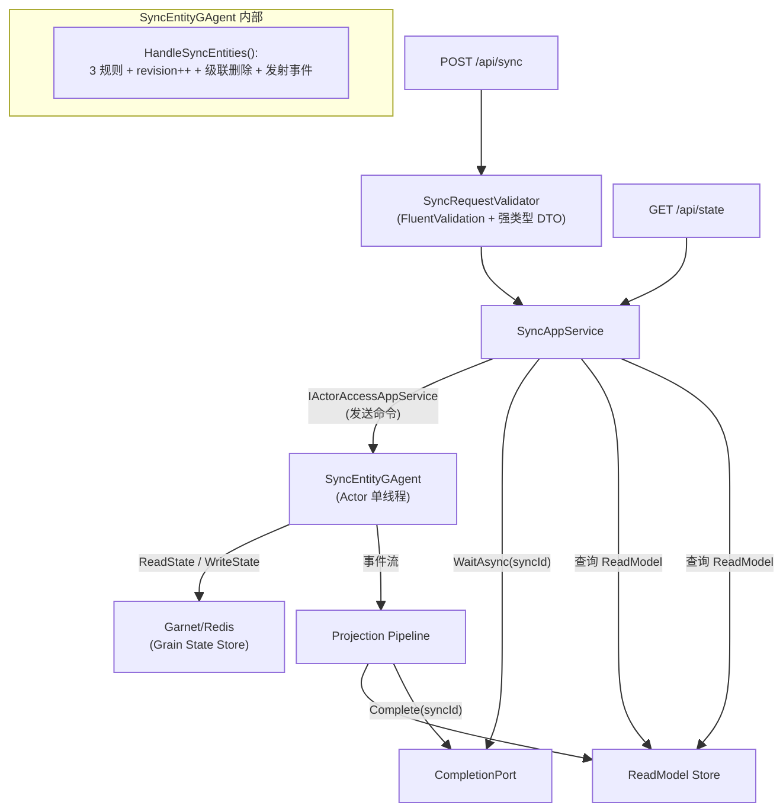

### 9.4 关键实现映射

| Node.js (旧) | .NET (新) | 说明 |
|--------------|----------|------|
| `syncEngine.processSync()` | `SyncEntityGAgent.HandleSyncEntities()` | 核心同步处理 (Actor 事件处理) |
| `syncHelpers.groupEntities()` | `EntityMapMapper.ToDto()` | 扁平 → EntityMap (Application 层) |
| `syncHelpers.flattenEntities()` | `EntityMapMapper.FromDto()` | EntityMap → 扁平 (Application 层) |
| `syncHelpers.allocateRevision()` | `SyncEntityGAgent.State.Meta.Revision++` | Actor 单线程天然原子 |
| `syncHelpers.getCurrentRevision()` | `AppSyncEntityReadModel.ServerRevision` | 从 Projection ReadModel 读取 |
| `syncHelpers.cascadeDelete()` | `SyncEntityGAgent.CollectCascadeDeleteEvents()` | 级联软删除 (max depth 5) |
| `syncHelpers.hashInputs()` | — | SHA-256 通过 BankHash 字段传递 |
| `validation.validateSyncRequest()` | `SyncRequestValidator` | FluentValidation AbstractValidator；字段类型/存在性由强类型 DTO + DataAnnotations 自动完成，仅保留嵌套 EntityMap 遍历等业务规则 |
| `validation.validateEntity()` | `EntityValidator` | FluentValidation AbstractValidator；原 TS 中 ~70% typeof 检查被 C# 类型系统消化 |
| `limits.checkCanPlant()` | **移除**（后端不判定） | 限额参数通过 `GET /api/sync/limits` 返回给前端，前端自行判定 |
| `limits.checkCanWater()` | **移除**（后端不判定） | 同上 |
| `limits.pruneExpiredEvents()` | **移除** | 旧版死代码，从未被路由调用 |
| `limits.recordSeedEvent()` | **移除** | 旧版死代码，从未被路由调用 |
| `limits.recordWaterEvent()` | **移除** | 旧版死代码，从未被路由调用 |
| `syncEngine.checkIdempotency()` | `State.ProcessedSyncIds.Contains(syncId)` | 精简为 32 条滑动窗口，重复跳过 |
| `syncEngine.cacheResponse()` | **移除** | 不再需要 sync_log（通过 Projection ReadModel 的 SyncResults 保留最近 16 条结果） |

---

## 10. 认证架构

### 10.1 认证模型概述

Aevatar App 的认证模型是 **token-first, 隐式注册**：
- 用户从外部获取 token，直接用 `Authorization: Bearer <token>` 访问 API
- 服务端在 auth middleware 中验证 token → 自动查找或创建用户 → 注入请求上下文
- **没有** `POST /api/auth/login` 端点，所有 provider 的"登录"都是首次 API 调用时隐式完成的

**生产环境仅使用 Firebase Authentication**。Trial 仅在本地开发和测试中使用。

### 10.2 认证 Provider（按环境区分）

| Provider | 算法 | 环境 | Token 来源 | 验证方式 | Token 有效期 |
|----------|------|------|-----------|---------|------------|
| **Firebase** | RS256 (JWKS) | **生产** | Firebase Auth SDK (社交登录: Google / Apple) | Google JWKS 端点公钥验证 + iss/aud | Firebase 控制 (~1h) |
| ~~Aevatar OAuth~~ | — | ~~开发/测试~~ | ~~Aevatar OAuth 服务~~ | ~~仅解析 claims，不验证签名~~ | **废弃** |
| Trial | HS256 | 开发/测试 | `POST /api/auth/register-trial` 签发 | `TRIAL_TOKEN_SECRET` 共享密钥 | **永不过期** |

> 旧版 Node.js 代码支持三种认证方式（OR 链式验证：Firebase → Aevatar OAuth → Trial）。新版**废弃 Aevatar OAuth**（仅解析 claims 不验证签名，安全性不足），仅保留 Firebase + Trial（OR 链式验证：Firebase → Trial）。**生产环境仅配置和使用 Firebase**。

### 10.3 Firebase 认证详情（生产）

**前端流程：**
1. 用户通过 Firebase Auth SDK 登录（支持 Google Sign-In、Apple Sign-In 等社交登录）
2. Firebase SDK 返回 ID Token（RS256 签名的 JWT）
3. 前端将 ID Token 作为 `Authorization: Bearer <token>` 发送至后端

**后端验证流程：**

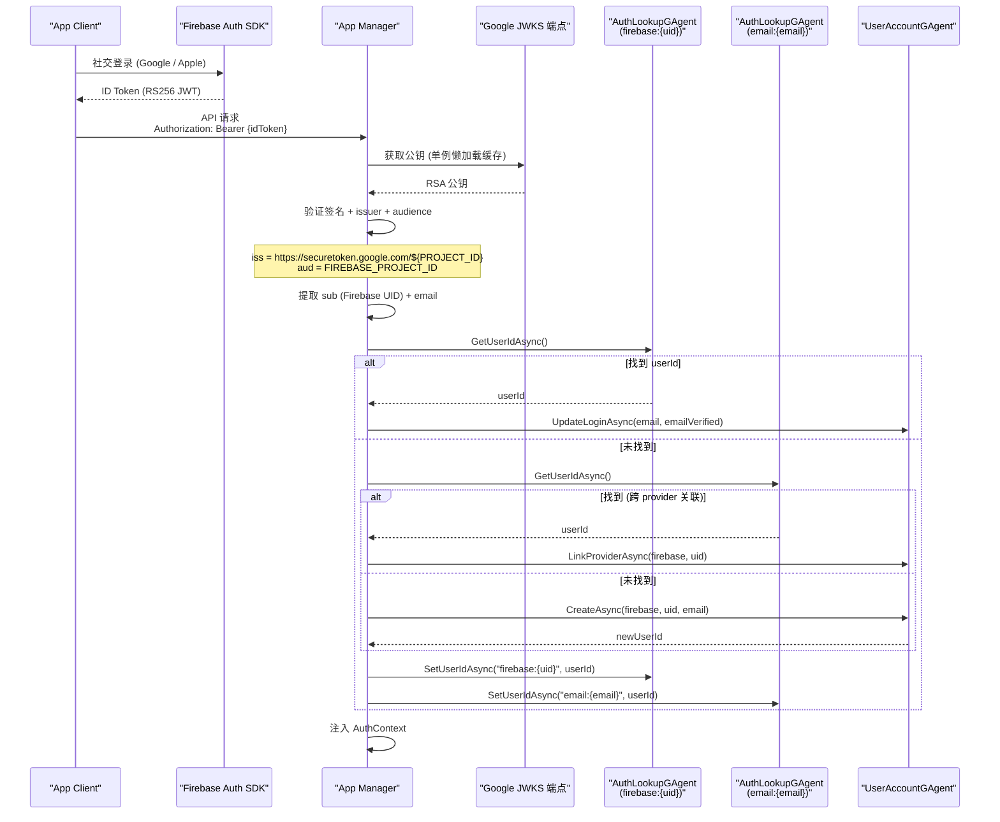

**用户标识链路：**
```
Firebase ID Token → sub (Firebase UID)
  → UserDocument { authProvider: 'firebase', authProviderId: uid }
    → users.id (UUID) 作为系统内部唯一标识
      → userId hex string 关联所有 sync_entities 数据
```

**JWKS 缓存：** Firebase JWKS 采用单例懒加载模式缓存，避免重复网络请求。

### 10.4 Trial 注册流程（开发/测试）

> 此端点仅在开发/测试环境中使用，生产环境可选择不配置 `TRIAL_TOKEN_SECRET`。

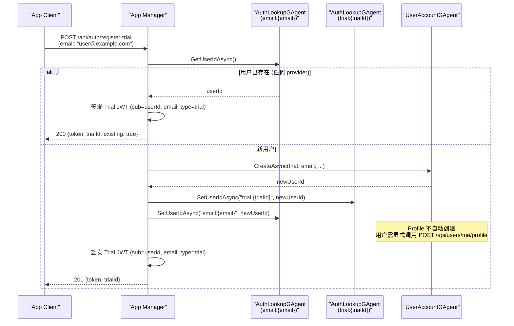

**Trial JWT Claims 结构：**

```json
{
  "sub": "user-uuid",
  "type": "trial",
  "app": "aevatar-app",
  "email": "user@example.com",
  "iat": 1704880200
}
```

- `alg: HS256`，使用 `TRIAL_TOKEN_SECRET` 环境变量签名
- **无 `exp`**，永不过期（后端通过用户状态控制访问权限）

### 10.5 隐式登录 / 自动用户创建 (`findOrCreateUser`)

每次受保护 API 请求，auth middleware 验证 token 后执行以下逻辑：

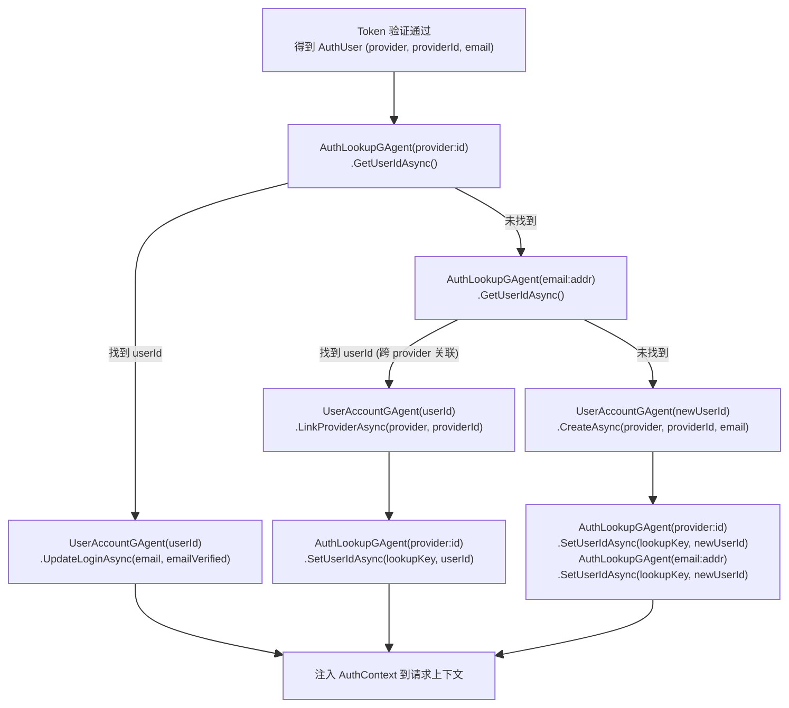

**关键语义：**

1. **Provider 优先匹配**：通过 `AuthLookupGAgent({provider}:{providerId})` 查找 userId
2. **Email 跨 Provider 关联**：通过 `AuthLookupGAgent(email:{email})` 查找，找到后关联新 provider 并写入新的 `AuthLookupGAgent({provider}:{providerId})`
3. **Profile 延迟创建**：`UserAccountGAgent` 创建后，`UserProfileGAgent` 的 State 为空（profile 为 null），前端检测 `onboardingComplete = false` 后引导用户调用 `POST /api/users/me/profile` 创建 `UserProfileGAgent` State
4. **每次请求都触发**：每次 API 请求都经过 `AuthLookupGAgent → UserAccountGAgent` 确保 `lastLoginAt` 实时更新
5. **AuthLookupGAgent 是 per-key 的**：每个查找键（`firebase:{uid}` / `trial:{trialId}` / `email:{email}`）对应一个独立 GAgent 实例，State 包含 `lookup_key`（认证查找键）和 `user_id`（目标用户），无限水平扩展

### 10.6 认证中间件行为

| 中间件 | 行为 | 使用场景 |
|--------|------|---------|
| `authMiddleware` (强制) | 无 token 或验证失败 → 401；通过 → 注入 `AuthContext` | 所有受保护 API |
| `optionalAuthMiddleware` (可选) | 无 token → 继续（`AuthContext` 为 null）；有 token → 尝试验证并注入 | 公开 + 可选增强 API |

**公开端点（不经过 auth middleware）：**
- `GET /`
- `GET /health/*`
- `GET /api/remote-config`
- `POST /api/auth/register-trial`（仅开发/测试环境使用）

### 10.7 认证相关配置

| 配置键 | 环境变量（`__` 格式） | 生产必需 | 说明 |
|--------|---------|---------|------|
| `Firebase:ProjectId` | `Firebase__ProjectId` | **是** | Firebase 项目 ID |
| `App:TrialTokenSecret` | `App__TrialTokenSecret` | 否（开发用） | 试用令牌签名密钥（至少 32 字符），生产可选 |

### 10.8 ASP.NET Core 实现方案

迁移到 .NET 后，使用 ASP.NET Core Authentication 框架实现：

```csharp
builder.Services
    .AddAuthentication(options =>
    {
        options.DefaultAuthenticateScheme = AppAuthSchemeProvider.AppAuthScheme;
        options.DefaultChallengeScheme = AppAuthSchemeProvider.AppAuthScheme;
    })
    .AddPolicyScheme(AppAuthSchemeProvider.AppAuthScheme, "App auth scheme", options =>
    {
        options.ForwardDefaultSelector = context => AppAuthSchemeProvider.SelectScheme(context);
    })
    .AddScheme<AuthenticationSchemeOptions, FirebaseAuthHandler>(AppAuthSchemeProvider.FirebaseScheme, _ => { })
    .AddScheme<AuthenticationSchemeOptions, TrialAuthHandler>(AppAuthSchemeProvider.TrialScheme, _ => { });
```

| 旧实现 (Hono) | 新实现 (ASP.NET Core) |
|--------------|---------------------|
| `validateFirebaseToken()` | `FirebaseAuthHandler` (RS256, Google JWKS, 单例缓存) |
| `validateTrialToken()` | `TrialAuthHandler` (HS256, dev/test only) |
| `findOrCreateUser()` | `AppUserProvisioningMiddleware` (DI 注入 `IGrainFactory` → `AuthLookupGAgent` + `UserAccountGAgent`) |
| `cors()` 中间件 | `app.UseCors()` + `builder.Services.AddCors()` (AllowedOrigins/credentials/x-app-user-id) |
| `authMiddleware` | `[Authorize]` attribute |
| `optionalAuthMiddleware` | `[AllowAnonymous]` + 手动 `HttpContext.User` 检查 |
| `c.set('auth', context)` | `HttpContext.Items["AppAuth"]` 或自定义 `IUserContext` |

**Token 验证顺序**：Firebase → Trial，依次尝试直到一个成功（旧版为 Firebase → Aevatar OAuth → Trial，Aevatar OAuth 已废弃）。生产环境只有 Firebase 成功路径，Trial scheme 未注册则跳过。

**`x-app-user-id` header**（用于未来 RevenueCat 高级层检查）在中间件中提取并注入到请求上下文，供付费墙逻辑使用。

---

## 11. 图片存储集成

### 11.1 存储架构

旧实现支持 Chrono / R2 双模存储。新实现**统一使用 AWS S3 兼容对象存储**（通过 `AWSSDK.S3` 客户端，可对接 AWS S3、MinIO 或其他 S3 兼容存储）。

**AI 生成图片不在服务端保存**，以 base64 返回给前端，由前端决定是否上传：

```
AI 图片生成 (不保存):
  前端 → POST /api/generate/plant-image → Workflow (Gemini) → 返回 base64 给前端

图片上传 (前端主动触发):
  前端 → POST /api/upload/plant-image (携带 base64) → App Manager → AWS S3
  App Manager → 返回 imageUrl 给前端

前端同步:
  前端 → POST /api/sync → 将 imageUrl 写入 entity

读取路径:
  Client → CDN URL 或 S3 URL (公开访问)
```

### 11.2 存储约定（配置驱动）

存储相关配置从 `App:Storage` 配置节读取，绑定到 `ImageStorageOptions`。`ImageStorageAppService.IsConfigured()` 依赖 `BucketName` 非空：

| 配置键 | Soul Garden 值 | 必需 | 说明 |
|--------|---------------|------|------|
| `App:Storage:Region` | `us-east-1` | 否 | AWS S3 Region |
| `App:Storage:BucketName` | `soul-garden` | **是** | S3 存储桶名称（跨 App 数据隔离） |
| `App:Storage:AccessKeyId` | *(部署时提供)* | 否 | S3 Access Key ID（空时使用 AWS 默认凭证链） |
| `App:Storage:SecretAccessKey` | *(部署时提供)* | 否 | S3 Secret Access Key |
| `App:Storage:CdnUrl` | *(部署时提供)* | 否 | CDN URL 前缀（可选，用于构建公开访问 URL） |
| `App:Storage:MaxFileSizeBytes` | `104857600` | 否 | 最大文件大小（默认 100MB） |

- 图片 key 格式: `{userId}/{manifestationId}_{stage}_{timestamp}.png`。其中 `manifestationId` 来自服务端生成的 `upload_{guid}`（上传链路）。
- 按 userId 前缀隔离，支持按前缀批量删除（账户删除时）
- 新 App 通过配置不同的 `App:Storage:BucketName` 实现存储隔离

---

## 12. 多 App 部署架构

### 12.1 部署模型

同一个 Docker 镜像（`aevatar-app-runtime`），通过环境变量 + 配置挂载部署为不同业务 App：

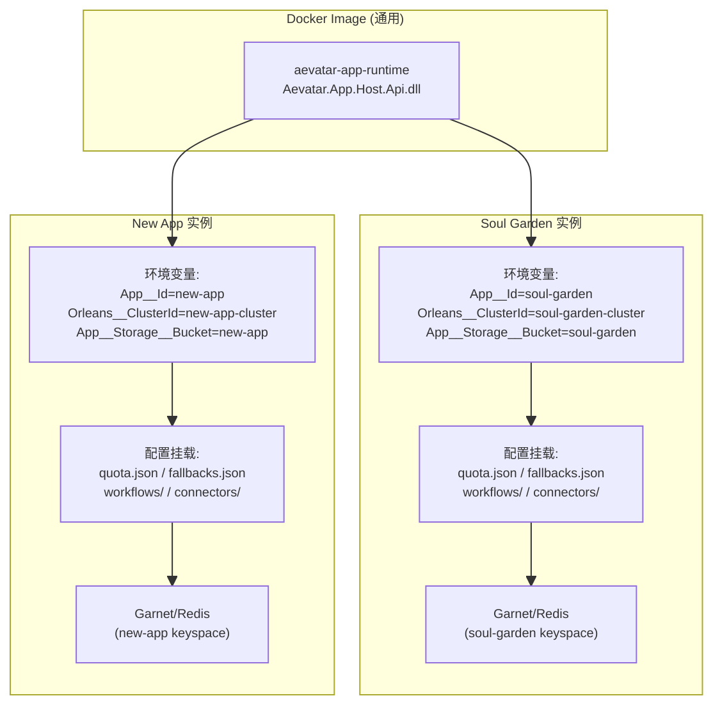

### 12.2 数据隔离策略

每个 App 部署为独立服务实例，通过以下维度实现完全隔离：

| 隔离维度 | 配置键 | 隔离机制 |
|----------|--------|---------|
| Orleans 集群 | `Orleans:ClusterId` / `Orleans:ServiceId` | 不同 App 不在同一集群中，Grain State 完全独立 |
| 持久化存储 | `AevatarActorRuntime:OrleansGarnetConnectionString` | 可使用独立 Garnet/Redis 实例或不同 database index |
| 对象存储 | `App:Storage:BucketName` | 每个 App 独立 S3 bucket |
| 认证 | `Firebase:ProjectId` | 每个 App 可绑定不同 Firebase 项目 |
| 连接器密钥 | `connectors.json` 中 `defaultHeaders` | 每个 App 使用独立 API key |

### 12.3 新 App 上线检查清单

```
部署新 App 前确认：
  1. ✅ 配置包完整性
     □ appsettings.json — App:Id / Firebase:ProjectId / Orleans:ClusterId / App:Storage:BucketName / App:Quota
     □ fallbacks.json — AI 占位内容
     □ workflows/*.yaml — 至少一个 Workflow 定义
     □ connectors.json — 所需的 Connector 配置 + API key

  2. ✅ 隔离验证
     □ Orleans:ClusterId 与现有 App 实例不冲突
     □ App:Storage:BucketName 与现有 App 不同
     □ Garnet/Redis 连接串或 database index 隔离

  3. ✅ 功能验证
     □ 健康检查通过 (GET /health)
     □ Trial 认证流程通过 (POST /api/auth/register-trial)
     □ 同步流程通过 (POST /api/sync)
     □ AI 生成端点通过（或 fallback 正确返回占位内容）
```

### 12.4 docker-compose 模板（新 App 部署参考）

```yaml
services:
  garnet:
    image: ghcr.io/microsoft/garnet:latest
    command: ["--lua", "true"]
    ports:
      - "16379:6379"

  app-api:
    image: aevatar-app-runtime:latest     # 复用同一镜像
    depends_on:
      garnet:
        condition: service_started
    environment:
      ASPNETCORE_ENVIRONMENT: Development
      ASPNETCORE_URLS: http://+:8080
      # ── App 标识 ──
      App__Id: "new-app"
      # ── Actor Runtime ──
      AevatarActorRuntime__Provider: Orleans
      AevatarActorRuntime__OrleansPersistenceBackend: Garnet
      AevatarActorRuntime__OrleansGarnetConnectionString: garnet:6379
      # ── Orleans 集群（必须与其他 App 不同）──
      Orleans__ClusteringMode: Localhost
      Orleans__ClusterId: "new-app-cluster"
      Orleans__ServiceId: "new-app-host-api"
      # ── 认证 ──
      Firebase__ProjectId: "new-app-firebase-project"
      App__TrialAuthEnabled: "true"
      App__TrialTokenSecret: "dev-secret-32-chars-minimum-here!"
      # ── 存储（BucketName 必须与其他 App 不同）──
      App__Storage__Region: "us-east-1"
      App__Storage__BucketName: "new-app"
      App__Storage__AccessKeyId: ""                 # 部署时替换（或使用 AWS 默认凭证链）
      App__Storage__SecretAccessKey: ""
      App__Storage__CdnUrl: ""                      # CDN 前缀（可选）
      # ── 限额 ──
      App__PaywallEnabled: "false"
      # ── 配置包路径 ──
      AEVATAR_HOME: /app/aevatar-config
      App__AllowedOrigins: http://localhost:3000
    volumes:
      - ./apps/new-app/connectors/connectors.json:/app/aevatar-config/connectors.json:ro
      - ./apps/new-app/workflows:/app/aevatar-config/workflows:ro
      - ./apps/new-app/config/fallbacks.json:/app/aevatar-config/fallbacks.json:ro
    ports:
      - "18080:8080"
```

---

## 13. 关键设计决策

### 13.1 为什么用 GAgent 而不是 PostgreSQL？

| 考量 | PostgreSQL | GAgent State (Garnet/Redis) |
|------|------------|---------------------------|
| 与 Aevatar 生态一致性 | 需要额外引入 EF Core | 原生 Orleans Grain State，零额外依赖 |
| 事务保证 | 原生 ACID | Actor 单线程执行，天然原子 |
| 原子操作 | `SELECT FOR UPDATE` + `UPDATE` | `State.meta.revision++`（内存操作） |
| 幂等性 | 需要 sync_log 幂等缓存 | 3 规则天然幂等，无需额外机制 |
| 查询性能 | 磁盘 I/O + 索引 | 内存直接操作 |
| 运维复杂度 | 额外 DB 实例 | 复用 Aevatar Runtime 的 Garnet/Redis |
| 代码复杂度 | Infrastructure 层 + Repository + Migration | 无 Infrastructure 层，State 即数据 |
| 扩展性 | 表结构变更需要 Migration | Protobuf 向前/向后兼容 |

**取舍：**
- GAgent State 不适合复杂跨用户查询（如 bank_hash 全局搜索），但 Aevatar App 的查询模式完全是 per-user 的
- 单用户实体量有限（maxSavedPlants=10，每植物 ~1 affirmation），State 体积可控
- 如果未来需要全局分析或 bank 功能，可通过 Projection Pipeline 异步投影到读模型

### 13.2 为什么不用 per-Entity Actor？

| 考量 | per-Entity Actor | per-User GAgent (当前方案) |
|------|-----------------|---------------------------|
| 复杂度 | 每个实体一个 Grain，可能数万 Grain | 每用户一个 SyncEntityGAgent |
| 事务边界 | 跨 Grain 同步需要分布式事务 | 单 Actor 内原子操作 |
| 查询 | 全量拉取需要 Projection | 直接从 State.entities 返回 |
| 存储 | 每个 Grain 独立 State | 单 State 包含全部实体 |
| 适用场景 | 实体有复杂交互/长期状态 | 实体是扁平数据，核心操作是 revision 比较 |

同步协议的核心是 revision 比较和原子递增，所有实体共享同一个 revision 计数器，天然适合放在同一个 Actor 中。

### 13.3 为什么保留 WorkflowGAgent 而不是直接调 LLM？

| 考量 | 直接调 LLM | WorkflowGAgent |
|------|----------|----------------|
| 一致性 | 每个 service 自己管 LLM client | 统一通过 Aevatar LLM Provider |
| 可配置性 | 硬编码 model/provider | YAML 声明式，runtime 可切换 |
| 可观测性 | 自建 logging | Aevatar Projection Pipeline 自动记录 |
| 扩展性 | 改代码 | 改 YAML |

### 13.4 废弃清单

| 组件 | 原因 |
|------|------|
| **路由层** | |
| `GET /api/data/sync` (Legacy) | CF Worker 兼容, 废弃 |
| `POST /api/data/sync` (Legacy) | CF Worker 兼容, 废弃 |
| `DELETE /api/data/reset` (Legacy) | 合并到 `DELETE /api/users/me` |
| `GET /api/test-route` | 调试端点, 不保留 |
| **认证层** | |
| Aevatar OAuth 认证 (`validateAevatarToken`) | 仅解析 claims 不验证签名，安全性不足，废弃 |
| **服务层** | |
| `services/ai.ts` (直调 OpenAI) | 通过 WorkflowGAgent 执行 |
| `services/ai.ts` — `regenerateContent()` | 旧版代码中已无路由调用，废弃 |
| `services/gemini.ts` (直调 Gemini) | 通过 Aevatar LLM Provider 封装 |
| `services/storage.ts` (双模 R2/Chrono) | AWS S3 兼容存储 |
| **数据层** | |
| `db.ts` (MongoDB 连接) | 迁移到 GAgent State (Protobuf) |
| `sync_trees` 集合 | 已在 Node.js 版本废弃 (迁移脚本残留) |
| `scripts/migrate-to-sync-trees.ts` | 旧版迁移脚本，废弃 |
| `scripts/migrate-sync-trees-to-entities.ts` | 旧版迁移脚本，废弃 |
| `app_config` 集合 | 改用 `appsettings.json` + 环境变量 |
| **基础设施** | |
| R2 存储后端 | 统一使用 AWS S3 兼容存储（旧版 `useR2Storage` 硬编码为 `true`，生产实际使用 R2；新版废弃） |
| `@aws-sdk/client-s3` 依赖 | 不再直连 R2 |
| MongoDB 原生驱动 | 迁移到 GAgent State (Orleans Grain State) |

> **保留并移植**: `POST /api/sync`、`GET /api/state`、`GET /api/sync/limits`、`POST /api/upload/plant-image`、`GET /api/remote-config` 等端点全部保留，从 Node.js 移植到 .NET。

---

## 14. 迁移策略

### Phase 1: 基础设施 (1-2 周)

- [x] 创建 `Aevatar.App.GAgents` 项目 — Protobuf 定义 + 通用同步规则骨架 (SyncRules)
  - [x] `sync_entity.proto` — SyncEntityGAgent (State: SyncEntityState/SyncEntity/SyncMeta + Events: EntitiesSynced/EntityCreated/Updated/Deleted/CascadeDelete)
  - [x] `user_account.proto` — UserAccountGAgent (State: UserAccountState/User + Events: UserRegistered/AccountDeleted)
  - [x] `user_profile.proto` — UserProfileGAgent (State: UserProfileState/Profile + Events: ProfileCreated/ProfileUpdated)
  - [x] `auth_lookup.proto` — AuthLookupGAgent (State: AuthLookupState + Events: AuthLookupSetEvent/AuthLookupClearedEvent)
- [x] 创建 `Aevatar.App.Application` 项目 — 项目骨架 (Contracts/Services/Concurrency/Validation/Auth/Policies 目录)
- [x] 创建 `Aevatar.App.Host.Api` 项目 — 项目骨架 (Hosting/Endpoints/Filters 目录)
- [x] 创建测试项目
  - [x] `Aevatar.App.GAgents.Tests` — GAgent 层单元测试 (xUnit + FluentAssertions)
  - [x] `Aevatar.App.Application.Tests` — Application 层单元测试 (xUnit + FluentAssertions)
  - [x] `Aevatar.App.Host.Api.Tests` — API 集成测试 (xUnit + FluentAssertions + WebApplicationFactory)
- [x] 项目依赖关系配置 (Host → Application → GAgents → Foundation)
- [x] Orleans 集群配置 (复用 Mainnet 模式, Garnet/Redis State Store)
- [x] CORS 配置 (AllowedOrigins 环境变量 + AllowCredentials + x-app-user-id Header)
- [x] `appsettings.json` 配置模板 + 环境变量清单 (→ Phase 6 统一为 `App:*` 键)
- [x] `docker-compose.garden.yml` 环境配置 (→ Phase 6 环境变量改为 `App__*` 格式)

### Phase 2: GAgent 实现 + 认证 + API 端点 (1-2 周)

- [x] `SyncEntityGAgent` 实现
  - [x] `HandleSyncEntities(EntitiesSyncRequestedEvent)` — 完整内部流程：
    - [x] 扁平化 EntityMap → Entity[]
    - [x] userId 强制覆盖（安全原则，防止客户端伪造）
    - [x] 实体数量校验 (≤ 500)
    - [x] 3 规则处理 (新建/更新/过期)
    - [x] revision 原子递增 (`State.meta.revision++`)
    - [x] 级联软删除 (refs, 最大深度 5)
    - [x] 编辑检测: source → edited, bankEligible → false
    - [x] 构建增量 EntityMap (revision > clientRevision)
    - [x] 发射领域事件: `EntitiesSyncedEvent` + 逐实体 `EntityCreated/Updated/Deleted/CascadeDeleteEvent`
  - [x] `HandleSoftDeleteEntities` / `HandleHardDeleteEntities` — 软删除匿名化 / 硬删除全清除
  - [x] `CollectCascadeDeleteEvents()` — 递归级联删除事件收集（最大深度 5）
  - [x] `TransitionState()` — 事件溯源状态转换（Apply Created/Updated/Synced/Deleted）
- [x] `UserAccountGAgent` 实现
  - [x] `HandleRegisterUser()` — 用户注册/重复注册（已有用户发 `UserLoginUpdatedEvent`）
  - [x] `HandleLinkProvider()` — 跨 provider 关联（发 `UserProviderLinkedEvent`）
  - [x] `HandleUpdateLogin()` — 登录信息更新
  - [x] `HandleDeleteAccount()` — 账户删除 → 清空 State
  - [x] `TransitionState()` — 事件溯源状态转换
- [x] `UserProfileGAgent` 实现
  - [x] `HandleCreateProfile()` — 创建资料 (409 若已存在)
  - [x] `HandleUpdateProfile()` — 更新资料 (404 若不存在)
  - [x] `HandleDeleteProfile()` — 删除资料 (账户删除时联动)
  - [x] `TransitionState()` — 事件溯源状态转换
- [x] `AuthLookupGAgent` 实现 (per lookup key)
  - [x] `HandleSetAuthLookup()` — 写入 lookup_key + userId 映射
  - [x] `HandleClearAuthLookup()` — 清除映射 (用户删除时)
  - [x] `TransitionState()` — 事件溯源状态转换
  - [x] key 格式: `firebase:{uid}` / `trial:{trialId}` / `email:{email}`
- [x] 请求校验器实现 (Application 层 `Validation/` 目录)
  - [x] `SyncRequestValidator` — FluentValidation AbstractValidator\<SyncRequestDto\>，嵌套 EntityMap 遍历、实体上限 500 校验
  - [x] `EntityValidator` — FluentValidation AbstractValidator\<EntityDto\>，业务语义规则（entityType 合法性、refs 深度等）
- [x] 认证实现 (Application 层 `Auth/` + Host 层)
  - [x] `FirebaseAuthHandler` — RS256 签名验证 + Google JWKS 端点公钥单例懒加载缓存 + iss/aud 校验
  - [x] `TrialAuthHandler` — HS256 签名验证（仅 dev/test，通过 `IsDevelopment()` 条件注册）
  - [x] `AppAuthSchemeProvider` — 多 scheme 路由选择（Firebase → Trial 依次尝试）
  - [x] `AppUserProvisioningMiddleware` — findOrCreateUser（DI 注入 IGrainFactory → AuthLookupGAgent + UserAccountGAgent）
  - [x] `optionalAuthMiddleware` — 无 token 继续（AuthContext 为 null）；有 token 尝试验证并注入（公开 + 可选增强 API 使用）
  - [x] `x-app-user-id` header 提取 — 在中间件中提取并注入请求上下文（供未来 RevenueCat 付费墙使用）
- [x] sendBeacon 兼容中间件 — `text/plain → application/json` Content-Type 改写（POST /api/sync 路径，在 MapAppEndpoints 之前注册）
- [x] 统一错误响应格式 — 全局异常处理中间件，将业务异常映射为 `{error: {code, message, issues}}` 格式（错误码: VALIDATION_ERROR / NOT_FOUND / FORBIDDEN / LIMIT_REACHED / SERVICE_UNAVAILABLE / CONFLICT）
- [x] API 端点
  - [x] `GET /` — 服务信息 + 可用端点列表（仅调试/运维，公开）
  - [x] `GET /health`, `GET /health/live`, `GET /health/ready` — 健康检查（公开）
  - [x] `GET /api/remote-config` — 远程配置（REMOTE_CONFIG 环境变量 JSON，公开）
  - [x] `POST /api/auth/register-trial` — 试用注册（仅 dev/test，公开，签发 Trial JWT + 创建用户 + 写入 AuthLookupGAgent）
  - [x] `GET /api/users/me` — 用户信息 + 资料 + onboardingComplete
  - [x] `POST /api/users/me/profile` — 创建资料 (409 若已存在)
  - [x] `PATCH /api/users/me/profile` — 更新资料 (404 若不存在)
  - [x] `DELETE /api/users/me` — 删除账户 (?hard=true)
  - [x] `GET /api/state` — 初始状态加载 (EntityMap + serverRevision)
  - [x] `POST /api/sync` — 实体同步 (v6.1 协议)
  - [x] `GET /api/sync/limits` — 限额参数（从 App:Quota 配置读取，直接返回）
- [x] **Phase 2 单元测试**（伴随实现同步编写）
  - [x] `Aevatar.App.GAgents.Tests/`
    - [x] SyncAsync 3 规则测试 — 新建 (revision=0) / 更新 (revision 匹配) / 过期 (revision 不匹配)
    - [x] SyncAsync userId 强制覆盖测试
    - [x] SyncAsync 实体数量上限 (>500) 拒绝测试
    - [x] SyncAsync 编辑检测测试 — source → edited, bankEligible → false
    - [x] SyncAsync 级联软删除测试 — refs 链路, 最大深度 5
    - [x] SyncAsync 领域事件发射测试 — EntitiesSyncedEvent + 逐实体事件
    - [x] HashInputs 测试 — SHA-256 确定性
    - [x] GetStateAsync 测试 — 过滤 deletedAt=null + entityType 分组
    - [x] UserAccountGAgent 测试 — 创建/关联/登录更新/软删除匿名化/硬删除全清除/事件发射
    - [x] UserProfileGAgent 测试 — 创建 (409) / 更新 (404) / 获取 / 删除/事件发射
    - [x] AuthLookupGAgent 测试 — Set/Get/Clear 映射
  - [x] `Aevatar.App.Application.Tests/`
    - ~~FreeTierPolicy 测试~~ — 已移除（后端不做限额判定）
    - [x] SyncRequestValidator 测试 — 合法请求通过 / 嵌套 EntityMap 遍历 / 实体上限 500 / 非法 entityType 拒绝
    - [x] EntityValidator 测试 — 业务语义规则 (entityType 合法性, refs 深度)
    - [x] FirebaseAuthHandler 测试 — RS256 签名验证 / iss+aud 校验 / 过期 token 拒绝
    - [x] TrialAuthHandler 测试 — HS256 签名验证 / 无 exp 接受
    - [x] AppUserProvisioningMiddleware 测试 — provider 优先匹配 / email 跨 provider 关联 / 新用户自动创建

### Phase 3: AI Workflow + 并发控制 (1 周)

- [x] Workflow YAML 定义（含角色 ID + system_prompt + temperature + max_tokens + connector 配置）
  - [x] `garden_content.yaml` — garden_creator (llm_call, temperature: 0.7, max_tokens: 500)
  - [x] `garden_affirmation.yaml` — garden_affirmer (llm_call, temperature: 0.8, max_tokens: 100)
  - [x] `garden_image.yaml` — garden_artist (connector_call → gemini_imagen, timeout_ms: 90000, retry: 1)
  - [x] `garden_speech.yaml` — garden_speaker (connector_call → gemini_tts, timeout_ms: 90000, retry: 1)
- [x] Connector 配置 (gemini_imagen / gemini_tts)
- [x] `AIGenerationAppService` 实现 (Application 层 `Services/` 目录)
  - [x] `IWorkflowRunCommandService.ExecuteAsync` 集成 — emitAsync delta 累积 + JSON 解析
  - [x] `GenerateContentAsync()` — 构建 manifestation prompt + 触发 garden_content + 解析 JSON 结果
  - [x] `GenerateAffirmationAsync()` — 用 mantra/userGoal/plantName 插值模板 + 触发 garden_affirmation
  - [x] `GenerateImageAsync()` — 按 stage 选择 prompt 模板 + 拼接 STYLE 常量 + 触发 garden_image
  - [x] `GenerateSpeechAsync()` — 构建 TTS prompt + 触发 garden_speech
  - [x] AI 失败 fallback 占位内容池：
    - [x] garden_content: 5 条占位内容 + 1 条固定 fallback（双层 fallback）
    - [x] garden_affirmation: 5 条占位肯定语 + 1 条固定 fallback（双层 fallback）
    - [x] garden_image: 占位图 (isPlaceholder: true)
    - [x] garden_speech: 无 fallback（失败直接返回错误）
- [x] `ImageStorageAppService` 实现 (Application 层 `Services/` 目录)
  - [x] AWS S3 存储调用（AWSSDK.S3，通过 `IS3StorageClient` 抽象）
  - [x] 存储约定: BucketName `soul-garden`，key 格式 `{userId}/{manifestationId}_{stage}_{timestamp}.png`（上传链路的 `manifestationId` 为服务端生成 `upload_{guid}`）
- [x] AI 生成 API 端点（只返回原始内容，不写 Actor State）
  - [x] `POST /api/generate/manifestation` — 触发 Workflow + fallback（不做后端限流）
  - [x] `POST /api/generate/affirmation` — 触发 Workflow + fallback（不做后端限流）
  - [x] `POST /api/generate/plant-image` — 并发控制 + 触发 Workflow + isPlaceholder
  - [x] `POST /api/generate/speech` — 触发 Workflow + 无 fallback
- [x] 图片上传端点
  - [x] `POST /api/upload/plant-image` — 并发控制 + AWS S3 上传 + 返回 imageUrl（不写 State）
- [x] 并发控制 (`ImageConcurrencyCoordinator` → `ImageConcurrencyGAgent` — maxTotal:20, maxQueueSize:100, queueTimeoutMs:30s, 上传优先级高于生成)
- [x] 并发 EndpointFilter — **仅挂载到需要并发控制的端点**：
  - [x] `GenerateGuardFilter` → `POST /api/generate/plant-image`（其他 generate 端点无并发控制）
  - [x] `UploadTrackerFilter` → `POST /api/upload/plant-image`
- [x] **Phase 3 单元测试**（伴随实现同步编写）
  - [x] `Aevatar.App.Application.Tests/`
    - [x] AIGenerationAppService 测试 — ExecuteAsync 集成 (mock IWorkflowRunCommandService)
      - [x] GenerateContentAsync: 正常 JSON 解析 / 非法 JSON 走 fallback / WorkflowError 走 fallback
      - [x] GenerateAffirmationAsync: 正常返回 / AI 失败走 fallback
      - [x] GenerateImageAsync: 正常返回 imageData / AI 不可用返回 isPlaceholder:true
      - [x] GenerateSpeechAsync: 正常返回 / 失败返回错误（无 fallback）
    - [x] Fallback 占位内容池测试 — 随机选取覆盖 5 条 + 固定 fallback 兜底
    - [x] Prompt 构建测试 — manifestation/affirmation/image(per-stage)/speech 模板插值正确性
    - [x] ImageStorageAppService 测试 — key 格式正确 / 上传调用 / 按前缀删除调用

### Phase 3.5: Projection Pipeline + Completion Port (1 周)

- [x] Projection 基础设施
  - [x] `AppProjectionContext` — 投影上下文（事件去重 + Actor/Stream 订阅）
  - [x] `DefaultAppProjectionContextFactory` — 上下文工厂
  - [x] `AppProjectionManager` — 投影订阅管理（EnsureSubscribed / Unsubscribe）
  - [x] `AppProjectorBase<TReadModel>` — 投影基类（前缀过滤 + Reducer 路由 + Store 持久化）
  - [x] `AppEventReducerBase<TReadModel, TEvent>` — Reducer 基类（Protobuf Any 解包 + 类型安全 Reduce）
  - [x] `AppInMemoryDocumentStore<TReadModel, TKey>` — 内存文档存储（开发/测试）
  - [x] `AppProjectionServiceCollectionExtensions` — DI 注册（5 个 ReadModel Store + Reducers + Projectors + 基础设施）
- [x] ReadModel 定义
  - [x] `AppSyncEntityReadModel` — Entities (Dict) + SyncResults (最近 16 条) + ServerRevision
  - [x] `AppSyncEntityLastResultReadModel`
  - [x] `SyncEntityEntry` — 读模型内实体条目 POCO（含 Clone 方法）
  - [x] `AppUserAccountReadModel`
  - [x] `AppUserProfileReadModel`
  - [x] `AppAuthLookupReadModel`
- [x] Projectors
  - [x] `AppSyncEntityProjector` — 含 CompletionPort.Complete(syncId) 通知
  - [x] `AppUserAccountProjector`
  - [x] `AppUserProfileProjector`
  - [x] `AppAuthLookupProjector`
- [x] Reducers
  - [x] `SyncEntityReducers` — EntityCreated/Updated/Synced/AccountDeleted → ReadModel
  - [x] `UserAccountReducers` — Registered/ProviderLinked/LoginUpdated/Deleted → ReadModel
  - [x] `UserProfileReducers` — Created/Updated/Deleted → ReadModel
  - [x] `AuthLookupReducers` — Set/Cleared → ReadModel
- [x] Completion Port
  - [x] `ICompletionPort` — WaitAsync / Complete 接口
  - [x] `InMemoryCompletionPort` — ConcurrentDictionary + TCS（开发/测试）
  - [x] `RedisCompletionPort` — Redis Pub/Sub + 本地 TCS（生产，支持跨进程）
  - [x] `CompletionPortOptions` — Channel 名 + Timeout 配置
- [x] Application Service 改造为 Projection 查询
  - [x] `SyncAppService` — 通过 ICompletionPort.WaitAsync 等待投影完成，从 IProjectionDocumentStore<AppSyncEntityReadModel> 查询
  - [x] `UserAppService` — 从 IProjectionDocumentStore<AppUserAccountReadModel/AppUserProfileReadModel> 查询
  - [x] `AuthAppService` — 从 IProjectionDocumentStore<AppAuthLookupReadModel> 查询 + IAppProjectionManager 订阅管理
- [x] Elasticsearch 后端集成
  - [x] `AppElasticsearchProjectionExtensions` — 注册 Elasticsearch Document Store，SyncEntity 的 Entities/SyncResults 设置 `enabled: false`
- [x] 启动校验
  - [x] `AppStartupValidation` — App:Id / App:Storage:BucketName / Orleans:ClusterId/ServiceId 非空校验 + Firebase:ProjectId 生产必需
- [x] **Phase 3.5 单元测试**
  - [x] `Aevatar.App.Application.Tests/Projection/`
    - [x] `AppProjectorBaseTests` — 前缀过滤 / Reducer 路由 / 事件去重
    - [x] `SyncEntityReducerTests` — Created/Updated/Synced/Deleted 各 Reducer
    - [x] `UserAccountReducerTests`
    - [x] `UserProfileReducerTests`
    - [x] `AuthLookupReducerTests`

### Phase 4: 端到端集成测试 + 优化 (1 周)

> Phase 2/3 的单元测试覆盖组件内部行为，Phase 4 验证跨组件协作与完整请求链路。

- [x] `Aevatar.App.Host.Api.Tests/` (WebApplicationFactory 集成测试)
  - [x] 端到端集成测试 (同步 → 生成 → 上传 → 状态加载 完整链路)
  - [x] 并发同步测试 (验证 Actor 单线程串行，多并发请求不丢不重)
  - [x] 3 规则幂等性测试 (重复实体 revision 被拒绝，HTTP 200 + rejected 列表)
  - [x] 级联删除测试 (refs 链路, 最大深度 5，通过 API 验证)
  - [x] 编辑检测测试 (同步含 source 变更的实体 → source:edited, bankEligible:false)
  - ~~限流测试 (429 响应场景)~~ — 已移除（后端不做限额判定）
  - [x] AI fallback 测试 (mock LLM 失败 → API 返回占位内容, garden_content 双层 fallback, garden_image isPlaceholder)
  - [x] 并发控制测试 (ImageConcurrencyCoordinator 队列/超时/拒绝 → 429/503 响应)
  - [x] 图片上传集成测试 (上传 → 返回 URL → 按前缀删除)
  - [x] 用户删除测试 (软删除匿名化 + 硬删除全清除 + AuthLookupGAgent 清除)
  - [x] 认证测试 (Firebase 生产路径 + 跨 provider email 关联 + findOrCreateUser + optionalAuth + register-trial)
  - [x] sendBeacon 兼容测试 (text/plain Content-Type → 正确解析为 JSON)
  - [x] 领域事件发射测试 (完整请求链路中事件正确发射)

### Phase 5: 前端适配 (并行)

- [ ] 确认前端 API 调用与新端点匹配 (端点路径不变，无需修改)
- [ ] 确认 EntityMap 格式一致性
- [ ] 确认前端 sendBeacon 调用路径与新后端兼容

> **不考虑数据迁移**：旧版 MongoDB 数据不迁移到 GAgent State，用户重新开始。

### Phase 6: 多 App 平台化 (1 周)

> Phase 1-5 完成后，Soul Garden 已作为单一 App 正常运行。Phase 6 将硬编码的 App 专属内容外置为配置，使平台可不改代码部署新 App。

**6.1 配置统一（代码改动）：**

- [x] Program.cs 移除 `Garden:*` 配置回退，统一读取 `App:*` 键
  - [x] `App:ImageConcurrency:MaxTotal` — 移除 `?? cfg["Garden:ImageConcurrency:MaxTotal"]`
  - [x] `App:Storage:BucketName` — 移除 `?? cfg["Garden:ChronoStorageBucket"]`（存储配置改为 `ImageStorageOptions`）
  - [x] `App:PaywallEnabled` — 移除 `|| cfg.GetValue<bool>("Garden:PaywallEnabled")`
- [x] Program.cs 移除 `ApplyEnvironmentOverrides` 旧环境变量兼容层（`CHRONO_STORAGE_*`、`PAYWALL_ENABLED`、`APP_ID` 等），ASP.NET Core 环境变量 provider 自动处理 `App__*` → `App:*` 映射
- [x] `ALLOWED_ORIGINS` 顶级扁平键迁移为 `App:AllowedOrigins`，docker-compose 使用 `App__AllowedOrigins`
- [x] 启动校验：`App:Id` / `App:Storage:BucketName` / `Orleans:ClusterId` 非空校验，缺失 fail-fast
- [x] 启动校验扩展：`App:Storage:BucketName` 非空校验；`IsConfigured()` 在运行时判断

**6.2 限额策略（已移除后端判定，仅配置声明）：**

- [x] `FreeTierPolicy.cs` 已删除
- [x] `GenerationOrchestrationAppService` 已移除限流判定逻辑
- [x] `GET /api/sync/limits` 改为从 `App:Quota` 配置节读取并直接返回
- [ ] 后续实现通用限额策略时，再新增后端拦截逻辑

**6.3 占位内容配置化（代码改动）：**

- [x] `FallbackContent` 从硬编码常量改为从 `App:Fallbacks` 配置节或 `fallbacks.json` 读取
- [x] 注册为 `IOptions<FallbackOptions>` 注入
- [x] `AIGenerationAppService` 改为从注入的 fallback provider 获取占位内容
- [x] 缺失配置时使用当前 Soul Garden 值作为内置默认值（兼容）
- [x] 更新 `FallbackContent` 测试（验证配置加载 + 默认值回退）

**6.4 Soul Garden 配置包提取（无代码改动）：**

- [x] 限额参数已移至 `App:Quota` 配置节（appsettings.json），无需独立 quota.json
- [x] 创建 `apps/aevatar-app/config/fallbacks.json`（从 FallbackContent 常量提取）
- [x] 更新 `appsettings.json`：统一 `App:*` 键，移除 `Garden:*` 节
- [x] 更新 `docker-compose.garden.yml`：环境变量改为 `App__*` 格式

**6.5 部署模板标准化（无代码改动）：**

- [ ] `Dockerfile` 产出通用镜像（镜像名改为 `aevatar-app-runtime`）
- [ ] 创建 `docker-compose.template.yml`（新 App 部署模板）
- [ ] 模板文档：如何为新 App 创建配置包并部署

**6.6 验收（新 App 演练）：**

- [ ] 用第二个虚拟 App 配置包（如 `apps/demo-app/`）做"零代码上线"演练
- [ ] 验证：同一镜像 + 不同配置包 = 不同 App 行为
- [ ] 验证：两个 App 实例数据完全隔离（不同 Orleans 集群 + 不同存储桶）

---

## 15. 技术栈

| 层级 | 旧技术 | 新技术 |
|------|--------|--------|
| **运行时** | Node.js (Bun) | .NET 10 |
| **Web 框架** | Hono | ASP.NET Core Minimal API |
| **数据持久化** | MongoDB (原生驱动) | GAgent State (Protobuf) + Garnet/Redis |
| **事件流** | — | Orleans Stream (Kafka / MassTransit) |
| **AI 文本** | OpenAI 兼容 API (直调) | Aevatar LLM Provider (MEAI) |
| **AI 图片** | Gemini API (直调) | Aevatar LLM Provider (Gemini) |
| **对象存储** | Chrono / R2 (双模) | AWS S3 兼容存储 (AWSSDK.S3) |
| **认证** | jose (JWT) | ASP.NET Core Authentication |
| **校验** | Zod | FluentValidation / DataAnnotations |
| **测试** | Vitest | xUnit + FluentAssertions |
| **同步** | 实体同步协议 v6.1 (MongoDB) | 实体同步协议 v6.1 (GAgent State) |
| **部署** | Docker | Docker + Kubernetes |
