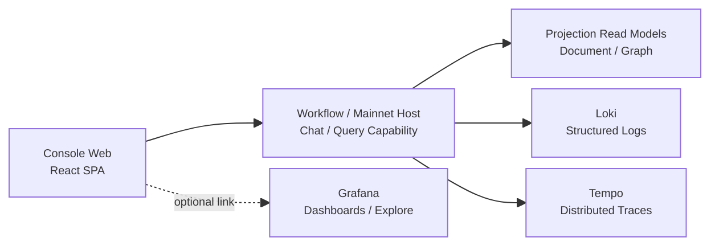

# Aevatar Console 控制台项目计划（从零开始）

更新时间：2026-03-11  
状态：Proposed（仅规划，未实施）  
范围：`前端控制台 / 现有后端能力接入 / 后续 Console BFF 预留 / 观测集成`  
前提：**不复用**已移除的 `apps/aevatar-console`，从零新建控制台项目

## 1. 背景

当前 Aevatar 已具备：

- `Workflow / Mainnet Host` 的运行与查询入口
- `POST /api/chat`、`GET /api/ws/chat` 的 AGUI 流式交互
- `GET /api/workflows`、`GET /api/workflow-catalog`、`GET /api/actors/{actorId}` 等查询能力
- `Projection + ReadModel` 的读侧基础
- `OpenTelemetry + OTLP` 的链路观测能力

但仍缺少一套面向最终使用者与运维者的正式控制台，用于统一查看：

- workflow 定义与结构
- run 执行状态、步骤流与人工交互
- actor 快照、时间线、拓扑图
- 系统日志、trace、故障定位入口

本计划目标是从零设计一套**正式控制台**，而不是再做一个 demo 页面集合。

## 2. 目标

1. 提供以 `run` 为核心对象的可视化控制台，而不是仅以 `actor` 为中心的查询面板。
2. 保持现有分层原则：`Domain / Application / Infrastructure / Host`，Host 只做协议与组合。
3. 继续复用现有 Workflow 能力与 Projection 主链路，不再造第二套编排系统。
4. 对 AGUI 流式交互采用统一协议与统一 SDK，避免前端手写事件归一化。
5. 对日志与链路观测采用独立观测栈，不把系统日志塞进业务 Projection 模型。
6. 控制台各模块默认优先采用现成 SDK、现成框架与成熟组件能力，仅在 Aevatar 特有语义上做最小必要自定义。
7. 以前端 `Ant Design Pro` 作为统一后台基座，后续新项目优先复用同一套导航、布局与主题风格。

## 3. 非目标

1. 不重写 Workflow 引擎。
2. 不在控制台前端或后续 Console BFF 中维护 `run/session/actor` 事实状态字典。
3. 不依赖历史 `/api/agent`、`/api/query/es` 一类旧控制台接口作为新控制台主路径。
4. 不把 Grafana/Backstage 当作主控制台壳层。
5. 不把 `@aevatar-react-sdk/services` 当作整个控制台的数据访问层。

## 3.1 开发原则：现成 SDK / 框架优先

本项目遵循以下实现原则：

1. 能用现成 SDK 解决的，不自研协议层。
2. 能用成熟前端框架解决的，不重复造基础轮子。
3. 仅对 Aevatar 特有的协议映射、领域展示与页面组合做最小必要自定义。
4. 页面层、状态层、图层、表单层、测试层均优先选择成熟生态。
5. 自研代码应集中在：
   - Aevatar API 适配层
   - AGUI 自定义事件展示层
   - Run Console / Actor Explorer / Workflow Detail 的页面组合
   - Aevatar 特有图节点与状态视图
6. 每个新增模块在进入实现前，默认先完成一次“现成能力优先”选择，顺序固定为：先复用已锁定依赖，再评估成熟生态，最后才允许最小范围自研。
7. 若某模块最终需要自研基础能力，必须先证明现有 SDK / 框架无法满足语义、扩展性或维护成本要求；否则视为偏离本计划。

明确禁止的默认倾向：

1. 不自写 SSE parser / WebSocket 协议 parser。
2. 不自写 run session reducer。
3. 不自写表单校验器、图布局引擎、基础 UI 组件库。
4. 不自写通用请求缓存层。
5. 不因为“定制方便”就绕过现成 SDK / 框架，重新实现已有能力的薄壳替代品。

## 3.2 项目原则（一句话）

前端默认遵循“**框架优先、SDK 优先、适配层最小、自研最少**”的原则：  
优先复用现成 SDK 与成熟框架，仅对 Aevatar 专属协议映射、领域展示和页面组合做必要定制，不为通用能力重复造轮子。

## 4. 阶段化架构决策

### 4.1 第一阶段控制台形态（当前方案）

第一阶段采用两段式结构：

1. `Console Web`：独立 SPA，负责交互与可视化。
2. `Workflow/Mainnet Host`：继续承载现有 Workflow Capability 与运行时。

第一阶段约束：

- **不新增** Console BFF
- **不修改**现有 Workflow / Mainnet Host 的后端能力
- 前端直接消费现有 API
- 开发期通过 `Umi proxy` 接入，部署期通过反向代理或网关解决同源与鉴权

### 4.2 第一阶段交互主链路

Workflow 运行交互直接基于现有：

- `POST /api/chat`
- `GET /api/ws/chat`
- `POST /api/workflows/resume`
- `POST /api/workflows/signal`

### 4.3 第一阶段查询主链路

第一阶段只使用当前已存在的查询能力：

- `GET /api/workflows`
- `GET /api/workflow-catalog`
- `GET /api/workflows/{workflowName}`
- `GET /api/actors/{actorId}`
- `GET /api/actors/{actorId}/timeline`
- `GET /api/actors/{actorId}/graph-enriched`

第一阶段结论：

- 先落地 `workflow` 与 `actor` 视图
- `run` 首版以“当前会话执行台”呈现，不强求历史 run 列表
- 日志与 trace 先以外部观测系统跳转为主，不要求首版做聚合查询

### 4.4 第二阶段优化目标（后续方案）

后续在确认首版前端价值后，再演进为三段式结构：

1. `Console Web`
2. `Console BFF`
3. `Workflow/Mainnet Host`

第二阶段再引入：

- `run-centric` 查询模型
- logs / traces 聚合查询
- 认证、授权、审计统一入口
- 同源 API 与观测适配层

### 4.5 AGUI SDK 使用决策

正式采用以下 npm 包，版本锁定为 `0.5.0`：

- `@aevatar-react-sdk/agui`
- `@aevatar-react-sdk/types`

使用边界：

- `agui`：用于 SSE / WS、事件归一化、run session、resume/signal hooks
- `types`：用于 AGUI 协议和 chat/request 契约
- `services`：**不作为主数据层默认依赖**；如需局部复用，仅允许用于 `ChatService` 的薄封装

### 4.6 后台壳层统一决策

正式将 `Ant Design Pro` 作为控制台统一后台基座：

- 使用 `Ant Design Pro` 提供统一的 admin shell、导航结构、页面布局和默认主题风格
- 所有后续项目如无明确例外，默认沿用同一套 `Ant Design Pro` 风格
- Aevatar 特有页面继续在 `Ant Design Pro` 壳层内嵌入 `AGUI`、`React Flow`、`Monaco Editor`
- 不再将 `CoreUI React`、`Refine`、`AdminJS`、`Astro` 作为当前方案候选主基座

## 5. 当前阶段系统拓扑



后续优化目标再引入 `Aevatar.Console.Host.Api` 作为 BFF，不属于首版前提。

## 6. 技术选型

## 6.1 前端

| 主题 | 选型 | 说明 |
|---|---|---|
| Web Shell | `React 19 + TypeScript + Ant Design Pro + Umi Max` | 直接复用现成后台壳和默认主题 |
| 包管理 | `pnpm` | 以 `apps/aevatar-console-web` 作为独立前端项目维护 |
| 后台基座 | `Ant Design Pro` | 统一后台布局、导航、主题与基础组件风格 |
| 路由 | `Umi Max` | 使用模板原生路由与运行时布局能力 |
| 数据请求 | `@tanstack/react-query` | 查询缓存、轮询、错误状态统一 |
| UI 组件 | `antd + @ant-design/pro-components` | 直接复用现成 admin 组件与主题，减少自定义设计工作 |
| 图可视化 | `@xyflow/react` | 先满足查看与轻交互，后续再评估 X6 |
| 编辑器 | `monaco-editor` | YAML / JSON / 只读配置查看 |
| 表单 | `react-hook-form + zod` | 运行参数、过滤器、配置项输入 |
| 单元测试 | `Jest` | 沿用 `Ant Design Pro` 默认测试栈 |
| E2E | `Playwright` | 覆盖 run、resume、graph、filter 等关键流 |

## 6.2 后端策略

| 主题 | 选型 | 说明 |
|---|---|---|
| 当前阶段 | 直接复用现有 `Workflow / Mainnet Host` | 首版不改后端 |
| 开发代理 | `Umi proxy` | 本地前端直连现有 API |
| 部署代理 | `Nginx` / 网关反向代理 | 解决同域与鉴权问题 |
| 后续优化 | `ASP.NET Core Minimal API` | 仅在需要 BFF 时再新增 |
| 认证 | 第一阶段沿用现有入口；统一认证后续再做 | 不把认证改造作为首版前提 |

## 6.3 观测

| 主题 | 选型 | 说明 |
|---|---|---|
| 日志 | `Loki` | 存储结构化日志 |
| Trace | `Tempo` | OTLP trace 后端 |
| 展示 | `Grafana` | Explore / Dashboard / 跳转入口 |

## 6.4 模块与复用策略

| 模块 | 优先使用的现成能力 | 自研范围 |
|---|---|---|
| `Run Console` | `@aevatar-react-sdk/agui@0.5.0`、`@aevatar-react-sdk/types@0.5.0`、`antd`、`@ant-design/pro-components`、`@tanstack/react-query` | 页面布局、事件展示、Aevatar 自定义 custom event 呈现 |
| `Human Interaction` | `useHumanInteraction`、`react-hook-form`、`zod` | 审批/输入的业务文案与表单组合 |
| `Actor Explorer` | 现有 `/api/actors/*`、`@tanstack/react-query`、`@xyflow/react` | Actor snapshot/timeline/graph 的页面组织与节点样式 |
| `Workflow Library` | 现有 `/api/workflow-catalog`、`/api/workflows/{name}`、`@tanstack/react-query` | workflow 卡片分组、过滤器与 Aevatar 专属字段展示 |
| `Workflow Detail` | `monaco-editor`、`@xyflow/react`、`antd`、`@ant-design/pro-components` | YAML/roles/graph 的组合与交互 |
| `Overview` | `antd`、`@ant-design/pro-components`、`@tanstack/react-query` | 指标聚合与入口编排 |
| `Settings` | `react-hook-form`、`zod`、`antd`、`@ant-design/pro-components` | Aevatar 环境配置表单与持久化策略 |
| `导航与壳层` | `@ant-design/pro-components`、`Umi Max` | Aevatar 页面信息架构与导航文案 |
| `测试` | `Jest`、`Playwright` | Aevatar 关键场景用例与测试数据装配 |

补充约束：

1. `@aevatar-react-sdk/agui` 与 `@aevatar-react-sdk/types` 直接使用 npm `0.5.0` 固定版本，不使用范围版本。
2. `@aevatar-react-sdk/services` 不作为默认全量依赖；如需复用，仅允许局部评估 `ChatService`。
3. 前端必须保留独立的 `shared/api` 适配层，避免页面直接耦合 SDK 或具体 Host。

## 6.5 模块实施准入规则

所有控制台模块在设计与实现时统一遵循以下准入规则：

1. 先复用本计划已锁定的 SDK / 框架组合，不为单一页面局部偏好引入第二套同类技术栈。
2. 模块设计先回答“复用了哪些现成能力”，再回答“剩余哪些部分必须自研”。
3. 自研部分只能是 Aevatar 特有的协议适配、领域展示、页面组合和少量胶水代码，不得扩张成通用基础设施。
4. 若某模块需要新增第三方依赖，优先选择与既有技术栈兼容的成熟方案，避免引入功能重叠的平行框架。
5. 若某模块无法复用现成能力，需在对应设计文档中写清楚缺口、替代方案和不采用现成方案的原因。
6. 后续即使引入 `Console BFF`，也延续同一原则：优先复用现有 Host、ASP.NET Core、OIDC、Grafana/Loki/Tempo 生态，不自建平行协议与观测体系。
7. “优先使用现成框架”不等于“尽量多上框架”；默认选择能满足需求的最小技术组合，避免为了抽象一致性引入额外壳层。
8. 后台 UI 的默认统一基座为 `Ant Design Pro`；除非存在明确能力缺口，否则不再为单个项目引入第二套后台主题体系。

## 7. 仓库目录设计

建议新增如下目录：

```text
apps/
  aevatar-console-web/
    package.json
    pnpm-lock.yaml
    tsconfig.json
    index.html
    src/
      pages/
        overview/
        workflows/
        runs/
        actors/
        settings/
      features/
        workflow-library/
        workflow-detail/
        run-console/
        actor-explorer/
        human-interaction/
      widgets/
        workflow-graph/
        run-timeline/
        actor-graph/
      shared/
        agui/
        api/
        contracts/
        hooks/
        lib/
        ui/
        config/
        styles/
      app.tsx
      main.tsx

test/
  frontend/
    aevatar-console-web/

docs/
  architecture/
  console/
```

目录命名原则：

- .NET 项目保持 `Aevatar.Console.*`
- 前端应用目录保持语义化，不和 .NET 命名空间混淆
- 控制台文档单独收敛到 `docs/console/`
- 后续若引入 BFF，再新增 `src/console/Aevatar.Console.*`

## 8. 前端分层设计

说明：前端视觉壳层与基础布局统一基于 `Ant Design Pro`，业务模块在其内部按分层组织。

## 8.1 `shared/agui/`

职责：

- 封装 `@aevatar-react-sdk/agui@0.5.0`
- 输出统一的 `run session`、`resume/signal`、`custom event parse` 适配器
- 屏蔽页面对底层 SSE / WS 细节的直接依赖

约束：

- 不在这里塞 workflow list、run list、actor queries
- 不与 `@aevatar-react-sdk/services` 的历史 service 聚合强耦合

## 8.2 `shared/api/`

职责：

- 统一封装当前现有后端 REST API
- 第一阶段负责 `workflows / actors / chat / resume / signal / settings`
- 后续若引入 BFF，再把 `runs / logs / traces` 平滑切到新 API

## 8.3 `features/`

职责：

- 业务特性模块
- 每个特性只关心一个页面域
- 页面组合 `widgets`，不反向依赖 `pages`

## 8.5 `app/layout/`

职责：

- 基于 `Ant Design Pro` 组装侧边导航、顶部栏、页面容器和全局主题
- 统一所有项目共享的后台导航结构和内容区域框架
- 为 Aevatar 页面提供一致的 slot，而不在业务页面里重复写壳层代码

约束：

- 不承载业务查询逻辑
- 不在 layout 层引入 Aevatar 领域状态

## 8.4 `widgets/`

职责：

- 沉淀跨页面复用的复杂组件
- 例如 `RunTimeline`、`ActorGraph`

## 9. 后续优化预留的后端分层设计

说明：本节**不属于首版实施范围**。仅在第一阶段前端落地后，确实需要 `run-centric` 查询与观测聚合时再启用。

## 9.1 `Aevatar.Console.Application.Abstractions`

定义：

- Console Query DTO
- Query Port
- Observability Port
- Auth / Permission Port

不包含：

- HTTP 细节
- 第三方 SDK 实现

## 9.2 `Aevatar.Console.Application`

职责：

- `run / workflow / actor / observability` 查询编排
- 参数规范化、分页、过滤、错误映射
- 多源数据聚合

约束：

- 不直接依赖 HTTP 客户端细节
- 不维护进程内事实状态缓存

## 9.3 `Aevatar.Console.Infrastructure`

职责：

- 适配现有 Workflow Query 能力
- 适配 Loki / Tempo / Grafana
- 将外部模型映射为 Console Query DTO

## 9.4 `Aevatar.Console.Host.Api`

职责：

- 暴露 `/api/console/*`
- 同源转发 `/api/chat`、`/api/ws/chat`、`/api/workflows/resume`、`/api/workflows/signal`
- 认证、授权、CORS、静态资源输出

约束：

- 不承载业务事实态
- 不承载 Projection 编排

## 10. API 规划

### 10.1 第一阶段直接使用的现有接口

- `POST /api/chat`
- `GET /api/ws/chat`
- `POST /api/workflows/resume`
- `POST /api/workflows/signal`
- `GET /api/workflows`
- `GET /api/workflow-catalog`
- `GET /api/workflows/{workflowName}`
- `GET /api/actors/{actorId}`
- `GET /api/actors/{actorId}/timeline`
- `GET /api/actors/{actorId}/graph-enriched`

第一阶段说明：

- 不新增 `/api/console/*`
- 不要求新增 `/api/runs*`
- 不要求新增 `/api/logs*`、`/api/traces*`

### 10.2 第二阶段预留接口（后续优化）

建议由后续 Console BFF 暴露以下接口：

### 10.2.1 Workflow

- `GET /api/console/workflows`
- `GET /api/console/workflows/{name}`

### 10.2.2 Run

- `GET /api/console/runs`
- `GET /api/console/runs/{commandId}`
- `GET /api/console/runs/{commandId}/timeline`
- `GET /api/console/runs/{commandId}/graph`

### 10.2.3 Actor

- `GET /api/console/actors/{actorId}`
- `GET /api/console/actors/{actorId}/timeline`
- `GET /api/console/actors/{actorId}/graph`

### 10.2.4 Observability

- `GET /api/console/logs`
- `GET /api/console/logs/{commandId}`
- `GET /api/console/traces/{traceId}`
- `GET /api/console/traces/by-command/{commandId}`

### 10.2.5 AGUI Compatibility

为保持 SDK 可直接接入，Console BFF 需继续提供：

- `POST /api/chat`
- `GET /api/ws/chat`
- `POST /api/workflows/resume`
- `POST /api/workflows/signal`

## 11. 后续优化：Run 查询模型补强

当前现有查询更偏 `actor shared`，不足以支撑正式控制台的运行记录页。  
因此在第二阶段再补齐 `run-centric` 查询模型。

第一阶段处理方式：

- 不做正式 `Run List`
- `Run Detail` 仅指当前会话执行详情
- 历史 run 查询与过滤能力暂不作为首版目标

第二阶段建议新增：

- `WorkflowRunSummary`
- `WorkflowRunDetail`
- `WorkflowRunTimeline`
- `WorkflowRunGraph`

建议主键：

- `commandId`
- 或 `rootActorId + commandId`

要求：

1. `run` 与 `actor` 语义分离
2. `run status`、`waiting step`、`startedAt`、`endedAt` 可直接查询
3. 列表页不依赖解析完整 HTML / JSON 工件文件
4. 查询事实来源仍然是 Projection ReadModel 或持久化读侧，不走中间层内存映射

## 12. 页面规划

### 12.1 第一阶段优先级

第一阶段按以下优先级实施：

1. `P0`：`Run Console`
2. `P1`：`Actor Explorer`
3. `P2`：`Workflow Library / Workflow Detail`
4. `P3`：`Overview / Settings / Observability Jump`

优先级原则：

- 先做“能发起 run、能看执行、能恢复人工交互”
- 再做“能从 run 跳到 actor，并查看 actor 快照/时间线/图”
- 再做“查看 workflow 定义、结构与 YAML”
- 最后补“总览、设置、外部观测跳转”

### 12.2 第一阶段首版页面

1. `Run Console`
2. `Actor Explorer`
3. `Workflow Library`
4. `Workflow Detail`
5. `Overview`
6. `Settings`

其中：

- `Run Console` 是首版主页面
- `Actor Explorer` 从当前 run context 或 actorId 跳转进入
- `Logs / Traces / Run List` 暂不做正式内嵌查询页

### 12.3 第二阶段扩展页面

1. `Overview`
2. `Run Detail`
3. `Run List`
4. `Actor Explorer`
5. `Workflow Library`
6. `Workflow Detail`
7. `Logs`
8. `Traces`
9. `Settings`

其中：

- `Run Detail` 成为正式主页面
- `Actor Explorer` 是从 `Run Detail` 向下钻取
- `Logs / Traces` 通过 `commandId / correlationId / traceId` 联动

## 13. 实施分期

## Phase 0：文档与契约冻结

产物：

- 本规划文档
- `docs/console/page-map.md`
- `docs/console/api-contracts.md`

目标：

- 先冻结目录与接口边界，避免前后端并行开发时漂移

## Phase 1：Run Console（P0，不改后端）

产物：

- 新建 `apps/aevatar-console-web`
- 打通现有 `POST /api/chat`、`resume`、`signal`
- 完成最小 `Run Console`
- 基于 `@aevatar-react-sdk/agui@0.5.0` 与既定前端框架完成，不额外自研流式协议层

验收：

- 能发起 run
- 能显示消息流、步骤流、人工审批
- 能正确处理中断与错误
- 不需要新增任何 .NET 控制台后端项目
- 不自写 SSE / WS parser、run session reducer 或平行请求缓存层

## Phase 2：Actor 视图（P1，不改后端）

产物：

- `Actor Snapshot / Timeline / Graph`

验收：

- 能查看 actor 快照、时间线、拓扑图
- 能从 run context 稳定跳转到 actor 页面
- 图展示与查询状态管理继续复用既定框架，不新增平行图引擎或状态管理体系

## Phase 3：Workflow 视图（P2，不改后端）

产物：

- `Workflow Library / Detail`

验收：

- 能查看 workflow YAML、roles、graph
- YAML 查看、表单与图展示继续优先使用既定 SDK / 框架，不引入重复基础组件层

## Phase 4：总览、设置与观测跳转（P3，仍不改后端）

产物：

- `Overview`
- 基础设置页
- Grafana / Jaeger / Loki 外部跳转入口

验收：

- 能从 run context 或 actor context 跳到外部观测系统
- 首版控制台可独立作为操作入口使用

## Phase 5：Run 查询模型与历史记录（后续改后端）

产物：

- `run-centric` 查询 DTO 与端点
- `Run List / Run Detail`

验收：

- 可按 workflow、状态、时间范围过滤 run
- 可从 run 进入 actor / logs / traces

## Phase 6：日志与 Trace 集成（后续改后端）

产物：

- Loki / Tempo 查询适配器
- `Logs / Traces` 页面
- Grafana 深链接

验收：

- 通过 `commandId / correlationId / traceId` 完成日志与 trace 联动
- 故障 run 可一跳进入链路定位

## Phase 7：认证与生产化

产物：

- OIDC
- 权限控制
- 审计日志
- 部署方案与 CI

验收：

- 支持受控访问
- 前后端构建、测试、发布链路完整

## 14. 质量门禁

前端新增后，提交前至少执行：

- `cd apps/aevatar-console-web && pnpm install`
- `cd apps/aevatar-console-web && pnpm build`
- `cd apps/aevatar-console-web && pnpm test`
- 对新增模块补充“复用了哪些现成 SDK / 框架、哪些部分必须自研”的实现说明，避免实现漂移成自研优先

后续若新增 Console 后端，再执行：

- `dotnet build aevatar.slnx --nologo`
- `dotnet test aevatar.slnx --nologo`
- `bash tools/ci/architecture_guards.sh`

若新增或修改测试，继续执行：

- `bash tools/ci/test_stability_guards.sh`

## 15. 风险与应对

### 15.1 风险：控制台仍然以 actor 为中心，导致 run 页面难做

应对：

- 将 `run-centric query model` 延后为后续阶段强制项
- 首版先聚焦 `Run Console`，不强做历史 run 列表

### 15.2 风险：前端直接依赖历史 SDK service，耦合旧接口

应对：

- 仅使用 `agui + types`
- `ConsoleApiClient` 自研

### 15.3 风险：日志、trace 与业务读模型混用

应对：

- 第一阶段不做日志 trace 聚合查询
- 第二阶段才引入 observability adapter

### 15.4 风险：第一阶段现有后端能力不足以支撑完整控制台

应对：

- 首版范围收敛到当前后端已支持的能力
- 缺失的 `run list / logs / traces` 放到后续改后端阶段

### 15.5 风险：后续补 BFF 时出现二次重构成本

应对：

- 前端 `shared/api` 先统一抽象访问层
- 页面不直接绑定某个具体 Host
- 提前冻结第二阶段 API 预留路径

## 16. 完成定义（DoD）

满足以下条件时，本项目可视为首版完成：

1. 新控制台可独立启动并访问 Aevatar 运行能力
2. 可查看 workflow、当前 run、actor 三类核心对象
3. AGUI 流式交互使用统一 SDK，支持 `resume/signal`
4. 首版不要求新增后端服务或后端接口
5. 无中间层进程内事实状态字典
6. 文档、前端构建与测试通过
7. 首版各模块均遵循“现成 SDK / 框架优先”，未引入无必要的平行基础设施或重复实现

## 17. 一句话结论

本项目首阶段采用 **“独立 SPA + 现有 Workflow/Mainnet Host + AGUI SDK”** 的结构，先**不改后端**，直接消费当前能力。  
后续若需要正式 `run list / logs / traces / auth` 能力，再引入 `Console BFF` 与 `run-centric` 查询模型。
