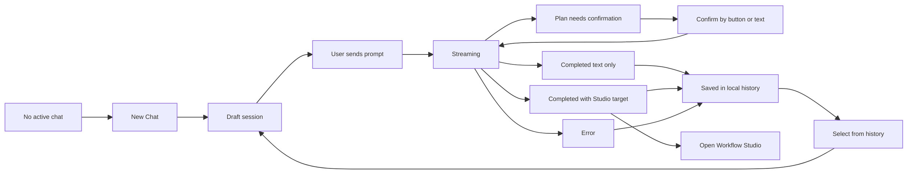

# Chat Top Entry MVP PRD

Date: 2026-07-01
Status: Simplified for product/design review
Target surface: `apps/aevatar-console-web`
Related prototype: `../prototypes/2026-07-01-chat-top-entry-prototype.html`
Related PNG: `../prototypes/2026-07-01-chat-top-entry-prototype.png`

## Product Thesis

`Chat` is the first top-level entry in Aevatar Console. The MVP has only two
core capabilities:

1. Create or continue a chat session that can create Team, Member, and Workflow
   resources through `POST /api/chat`.
2. Show the user's local chat history so they can return to previous creation
   attempts in the same browser.

The first version should feel like a console-native working surface: a history
list on the left, the active conversation on the right, and clear handoff to the
existing Workflow Studio only when the backend returns enough structured
resource identifiers.

## Confirmed Decisions

- Navigation order is `Chat`, `My Teams`, then the existing platform items.
- Chat is the primary user mental model. Do not expose backend workflow jargon
  as the first concept.
- Backend integration uses `POST /api/chat` directly.
- `/api/chat` streams SSE frames. The frontend reads `data:` frames and ignores
  heartbeat comments.
- History is stored in the frontend for v1.
- The default flow is `Plan -> Confirm -> Create`.
- Button confirmation is the primary path; natural-language confirmation is a
  secondary path.
- If the user explicitly asks to create directly, Chat sends that instruction to
  `/api/chat` without showing a separate confirmation card first.
- The MVP supports creating from zero and adding a Member to an existing Team.
- The main post-create jump is Workflow Studio, not an external run-detail page.
  This console's primary follow-up surface is the existing Studio route.

## Scope

### P0 Must Do

- Show `Chat` as the first top-level navigation entry.
- Show a `New Chat` action.
- Create a frontend-generated `sessionId` for each new conversation.
- Send user messages to `POST /api/chat` with at least:
  - `prompt`
  - `sessionId`
  - current `scopeId` when available
- Render streamed assistant text and final assistant text.
- Render token/usage summary when the stream provides usage fields.
- Persist local history per scope in browser storage.
- Let users select, rename, and delete local history entries.
- Support these creation intents through the same chat path:
  - create a new Team with Members and Workflow behavior
  - add a Member to an existing Team
  - create or adjust Workflow behavior for a Member
- Show a plan/confirmation state when the assistant asks for confirmation.
- Send confirmation as another `/api/chat` message with the same `sessionId`.
- Show `Open Workflow Studio` only when the response includes `studioUrl`, or
  enough identifiers to build the existing route:
  `/scopes/{scopeId}/teams/{teamId}/members/{memberId}/workflow?workflowId={workflowId}`.
- If only text and usage are returned, keep the user in Chat and save the
  conversation. Do not fabricate Team, Member, Workflow, or Studio links.

### Not In MVP

- Backend-backed chat history.
- A separate provisioning endpoint.
- A custom structured-result contract invented by the frontend.
- External run-detail pages as the main post-create destination.
- Rebuilding Team detail or Workflow Studio inside Chat.
- Guessing resource IDs from natural-language assistant text.

## User Experience Model

### Screen Layout

- Left rail: local chat history.
  - Top action: `New Chat`.
  - Each row shows title, status, and relative time.
  - Row actions: rename and delete.
- Main panel: active conversation.
  - Assistant/user messages.
  - Compact status line for stream state and usage.
  - Composer fixed at the bottom.
  - Primary action button appears inline only when the backend provides a valid
    next destination.

### Conversation Title

Use the first user message as the default title. Trim to a single line. The user
can rename the title from the history row.

## State Flow



### State Definitions

| State | Meaning | User Can Do | Persistence |
| --- | --- | --- | --- |
| `empty` | No active conversation selected | Start `New Chat` or select history | none |
| `draft` | Conversation exists but no prompt sent | Type and send | save session shell |
| `streaming` | `/api/chat` request is active | Wait; duplicate send disabled | save partial assistant text |
| `needs_confirmation` | Assistant has produced a plan and asks before create | Click confirm or type confirmation | save plan text |
| `creating` | Confirmation/direct-create is being processed | Wait | save progress text/events |
| `completed_text` | Run completed without structured destination | Continue chatting or start new chat | save text + usage |
| `completed_with_studio_target` | Run completed with `studioUrl` or scoped member identifiers | Open Workflow Studio or continue chatting | save target fields |
| `error` | Request failed or stream reported error | Retry, edit prompt, or start new chat | save error and last prompt |

## Jump Rules

The UI should choose the next destination conservatively.

| Returned data | Primary CTA | Route |
| --- | --- | --- |
| `studioUrl` | `Open Workflow Studio` | use `studioUrl` |
| `scopeId + teamId + memberId + workflowId` | `Open Workflow Studio` | `/scopes/{scopeId}/teams/{teamId}/members/{memberId}/workflow?workflowId={workflowId}` |
| `scopeId + teamId + memberId` | `Open Workflow Studio` | `/scopes/{scopeId}/teams/{teamId}/members/{memberId}/workflow` |
| `scopeId + teamId` | `Open Team` | `/scopes/{scopeId}/teams/{teamId}` |
| text + usage only | no primary jump | stay in Chat |
| error | no primary jump | stay in Chat and show retry |

`runId` may be stored with the local history record for debugging or later
support, but it does not create a main CTA in this console.

## Local History Model

Storage key:

```text
aevatar.chat.localHistory.v1:{scopeId}
```

Record shape:

```ts
type LocalChatConversation = {
  id: string;
  scopeId: string;
  title: string;
  status:
    | "draft"
    | "streaming"
    | "needs_confirmation"
    | "creating"
    | "completed_text"
    | "completed_with_studio_target"
    | "error";
  createdAt: string;
  updatedAt: string;
  messages: LocalChatMessage[];
  usage?: {
    promptTokens?: number;
    completionTokens?: number;
    totalTokens?: number;
  };
  target?: {
    scopeId?: string;
    teamId?: string;
    memberId?: string;
    workflowId?: string;
    studioUrl?: string;
    runId?: string;
  };
};
```

History behavior:

- Save the conversation after every visible message update.
- Restore the selected conversation when the user returns to Chat.
- Selecting a history item restores messages and target CTA if available.
- Deleting a history item removes only local browser data.
- Renaming a history item changes local title only.

## Primary Flows

### Create From Zero

1. User clicks `New Chat`.
2. User asks for a Team with Members and Workflow behavior.
3. UI sends prompt to `/api/chat`.
4. Assistant streams either a plan or direct create progress.
5. If plan appears, user confirms by button or text.
6. UI sends confirmation with the same `sessionId`.
7. When complete:
   - if Studio target fields exist, show `Open Workflow Studio`;
   - otherwise show final text and usage only.
8. Conversation remains in local history.

### Add Member To Existing Team

1. User starts or selects a conversation.
2. User asks to add a Member to a named Team.
3. Assistant either resolves the Team or asks for clarification.
4. After confirmation/direct-create, Chat completes the same way:
   - Studio target available -> open Workflow Studio;
   - no target -> stay in Chat with saved text result.

### Resume History

1. User opens Chat.
2. Left rail loads local conversations.
3. User selects a previous conversation.
4. UI restores messages, status, usage, and target CTA.
5. User can continue the same `sessionId` or start a new chat.

## Copy

Empty state:

> Describe the Team, Member, or Workflow you want to create.

Composer placeholder:

> Describe the workflow you want, or ask about the current setup...

Text-only completion:

> Request completed. I saved this conversation here. Continue chatting if you
> want to refine the Team, Member, or Workflow.

Studio-target completion:

> Creation completed. Continue in Workflow Studio to review and edit the
> generated workflow.

History note:

> History is stored in this browser for the MVP.

## Acceptance Criteria

- `Chat` is the first top-level menu item.
- `New Chat` creates a local session and selects it.
- Sending a message calls `POST /api/chat`.
- The request includes `prompt`, `sessionId`, and available `scopeId`.
- SSE frames update the active assistant message.
- Token usage is shown when returned.
- Local history survives refresh in the same browser.
- User can select, rename, and delete local conversations.
- Confirmation button and natural-language confirmation both continue the same
  `sessionId`.
- Text-only completions do not show fake Team/Member/Workflow links.
- `Open Workflow Studio` appears only when `studioUrl` or scoped member
  identifiers are available.
- The route for Workflow Studio matches the existing console route model.
