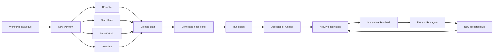

# Workflow + Activity + Settings vNext Design

## Status

Proposed for review on 2026-08-04. This document is the deliverable for the
design-first phase. It does not authorize implementation until the product and
engineering contracts below have been reviewed.

Implementation branch: `feat/2026-08-04_workflow-activity-vnext`.

After approval, this document is the normative product and engineering
contract for the Workflow Activity vNext frontend. It must be read together
with the in-repository design baseline at
`apps/aevatar-console-web/docs/design-baselines/workflow-activity-vnext/` and
the normative user paths in
`2026-08-04-workflow-activity-vnext-user-paths.md`.

This phase changes documentation only. The eventual implementation is strictly
frontend-only: no backend source, endpoint, DTO, projection, or persistence
change is in scope.

## Sources And Precedence

The design is based on these sources, in descending order of authority:

1. The in-repository
   `apps/aevatar-console-web/docs/design-baselines/workflow-activity-vnext/`
   `aevatar-workflow-activity-vnext.excalidraw`, containing 17 named frames.
   Its SHA-256 is
   `30e74d7b410ae72c4c91432355436679033679c54c10b1702908435b001577de`.
2. The backend contracts in `origin/feature/integrate` at commit
   `72093afa4490adf6eb25d83c3db0b9c182cd6ff0`.
3. The frontend architecture and identity rules in the repository root
   `AGENTS.md`, `apps/aevatar-console-web/AGENTS.md`, and
   `docs/canon/frontend-design.md`.
4. The PNGs and interactive HTML beside the Excalidraw file. These are useful
   render references, but they do not override the Excalidraw or backend truth.

When sources conflict, the Excalidraw controls intended product flow and visual
hierarchy, while the backend contract controls what the UI may claim, filter,
persist, or execute. The frontend must degrade honestly rather than inventing
data to make a mockup appear complete.

The user-provided source package was imported byte-for-byte. The repository
copy is the reviewable, portable branch artifact and must be used by later
implementation work; no developer-local source path is a dependency.

## Production Data Truth Rule

Production code must never make mock, fixture, demonstration, generated,
cached, or hard-coded data appear to be an API result.

- Remote Workflows, Runs, Run details, settings, identities, receipts,
  statuses, timestamps, revisions, usage, lineage, and availability come only
  from real API responses or real user actions acknowledged by those APIs.
- Pending requests render loading or accepted/observing states. Failed
  requests render error or unavailable states. Neither may fall back to
  successful-looking demonstration data.
- Empty state means a successful authoritative query returned no records. It
  must never be used to conceal a request or decoder failure.
- Browser storage is not an authoritative Workflow, Activity, account, or
  settings data source. A request-recovery helper may retain only the explicit
  non-authoritative receipt facts allowed by this specification.
- Test fixtures must remain in clearly named test-only modules and must not be
  imported by production routes, components, hooks, queries, or API adapters.
- The prototype's hard-coded records, `localStorage`, and timers exist only to
  make a serverless design demonstration interactive. They are explicitly
  prohibited as production implementation patterns.
- Bundled Workflow templates are allowed only as explicitly modeled frontend
  product content. They must never be labeled or decoded as an API catalogue.

## Goals

- Deliver an isolated Workflows, Activity, and Settings workbench under a new
  scope-aware route namespace.
- Let a user create a Workflow draft directly through Describe, Start blank,
  Import YAML, or Template, without creating a team member first.
- Reuse the connected-node Workflow Studio interaction model for every draft
  creation method.
- Make `Run` the regular execution action and Activity the single history
  surface inside this new workbench.
- Present each observed Run as an immutable record; Retry and Run again create
  a new Run rather than mutating the source record.
- Preserve authoritative identifiers, accepted-command receipts, projection
  latency, and state versions throughout the UI.
- Reframe current AI defaults, Account, and Advanced settings into the new
  design without changing their backend behavior.
- Reuse the existing Aevatar authentication, return-to, session, service-access
  review, and internationalization logic while styling their presentation to
  match the vNext visual direction.
- Provide complete loading, empty, error, disabled, accepted, observing,
  observed, and recovery states on desktop and mobile.

## Non-Goals

- No backend modification, new endpoint, DTO enrichment, projection change,
  migration, or persistence change.
- No replacement, redirect, or behavior change of existing
  `/runtime/workflows`, `/runtime/runs`, `/settings`, `/studio`, Team, member,
  login, callback, or authentication routes. Login, callback, language, and
  account presentation may adopt the vNext visual system without changing
  their behavior.
- No global navigation change in the first implementation. The vNext routes
  remain hidden from the existing menu and are entered by their explicit URL.
- No assumption that `memberId`, `workflowId`, `definitionActorId`, or
  `publishedServiceId` are interchangeable.
- No locally fabricated revision history, Run lineage, Activity records,
  duration, usage, outcome, approval state, or published runtime identity.
- No use of browser storage as an authoritative Workflow or Activity database.
- No mock, fixture, example, timer-generated, or hard-coded server entity in a
  production loading, success, empty, delayed, or error path.
- No attempt to reproduce prototype-only behavior that the reviewed backend
  cannot support truthfully.

## Product And Identity Contract

### Product Semantics

The vNext model is:

```text
Workflow draft
  -> edit
  -> run request
  -> accepted or streaming execution
  -> observed Activity record
  -> immutable Run detail
  -> optional Retry or Run again creates another Run
```

A draft is a first-class Workflow resource. Team and member creation are not
prerequisites for entering its editor. Publication and callable service
identity remain separate concerns and must not be inferred from authoring
identity.

### Identifier Rules

- `scopeId` comes directly from the route. Every scoped request passes it to a
  server endpoint that validates access. Display names, cached selections, and
  other IDs must never be used to reconstruct it.
- `workflowId` identifies a workspace draft or scope Workflow definition. It
  is not a member ID and is not automatically callable.
- `workflowId` from a catalogue row is the URL-owned Workflow filter context.
  Activity resolves that exact scoped identity through `ScopeWorkflowDetail`;
  only the returned `definitionActorId` may become the observatory
  `definition` request filter.
- `memberId` remains Team-member authority. The vNext draft routes do not
  invent one or route through member APIs.
- `publishedServiceId` is a callable runtime identity. It must be supplied by
  an explicit response or read model before a published Run action is enabled.
- `runId` identifies an immutable observed Run record.
- `stateVersion` is the authoritative projection version. The UI may use it to
  detect fresh observation, but must never create or increment a local version.
- `acceptedCommandId`, `correlationId`, and `statusUrl` are command-receipt
  facts. They indicate acceptance and observation targets, not completion.

## Route And Navigation Model

All vNext pages live below one new namespace:

| Route | Purpose | Existing route impact |
| --- | --- | --- |
| `/scopes/:scopeId/workflow-activity-vnext` | Namespace entry; redirects only within the namespace to `workflows` | None |
| `/scopes/:scopeId/workflow-activity-vnext/workflows` | Workflow catalogue | None |
| `/scopes/:scopeId/workflow-activity-vnext/workflows/new` | Direct creation chooser | None |
| `/scopes/:scopeId/workflow-activity-vnext/workflows/:workflowId` | Draft editor and Run console | None |
| `/scopes/:scopeId/workflow-activity-vnext/activity` | Scope Activity ledger | None |
| `/scopes/:scopeId/workflow-activity-vnext/activity/:runId` | Immutable Run detail and recovery actions | None |
| `/scopes/:scopeId/workflow-activity-vnext/settings` | AI defaults, Account, and Advanced | None |

Route requirements:

- Declare the literal `workflows/new` route before the dynamic
  `workflows/:workflowId` route.
- Set every vNext route to `hideInMenu: true`. Do not add or alter a global
  menu item during the isolated implementation.
- Leave all existing redirects exactly as they are. The namespace entry may
  redirect to its own `workflows` child only.
- Keep the existing authenticated app and runtime providers. Do not set
  `layout: false`, because that would bypass established shell behavior.
- The new surface may hide the current ProLayout chrome through a narrowly
  scoped display-route predicate that matches this prefix only. It must retain
  authentication, React Query, runtime configuration, and error boundaries.
- Workflows, Activity, and Settings use a vNext-local navigation rail or mobile
  switcher. All internal links preserve the route `scopeId`.
- Unknown Workflow and Run IDs render a scoped not-found state inside the
  workbench and do not redirect to legacy pages.

The first implementation is intentionally discoverable by direct URL only.
Adding an entry from an existing menu or Team page is a separate, explicit
product decision because it changes an existing navigation surface.

## Authentication And Localization Reuse Contract

### Existing Login Path

The vNext namespace is protected by the existing application runtime. It must
not introduce another login page, callback, guard, token cache, or session
provider.

The preserved flow is:

```text
Protected vNext URL
  -> ProtectedRouteRedirectGate
  -> /login?redirect=<sanitized-vNext-return-path>
  -> NyxIDAuthClient.loginWithRedirect({ returnTo })
  -> /auth/callback
  -> NyxIDAuthClient.handleRedirectCallback()
  -> window.location.replace(result.returnTo)
  -> original protected vNext URL
```

The implementation reuses these current boundaries:

- `src/app.tsx` public-route and auth-session bootstrap behavior;
- `src/shared/auth/ProtectedRouteRedirectGate.tsx`;
- `src/pages/login/index.tsx`;
- `src/pages/auth/callback/index.tsx`;
- `src/shared/auth/client.ts`, `config.ts`, and `session.ts`;
- current Account sign-in, sign-out, and service-access review actions.

`sanitizeReturnTo` remains the authority for the redirect target. Restorable
session handling continues through `hasRestorableAuthSession` and
`ensureActiveAuthSession`. Login configuration errors, callback errors,
service-access review errors, retry, and back actions retain their current
logic and security behavior.

### Login And Auth Presentation

Login, callback progress/error, language, and account controls should look like
the new workbench while remaining the same functional surfaces.

- Replace the current decorative gradient, oversized radius, and high card
  shadow with the Operational Automation Ledger palette, neutral borders,
  4-6 px radii, compact type, and restrained status treatment.
- Keep Aevatar as the first-viewport brand signal and retain the existing
  NyxID action, pending state, configuration error, and callback recovery
  content.
- Do not add a marketing hero, new credential form, new auth choice, or
  vNext-only callback route.
- Preserve keyboard access, visible focus, pending button behavior, live error
  announcements, and reduced-motion expectations.
- A visual-only auth change must remain compatible with every existing route
  that uses `/login` and `/auth/callback`, not only the vNext return path.

### Existing Internationalization Path

The vNext workbench reuses the configured Umi locale system:

- `config/config.ts` remains the locale configuration authority;
- `getLocale`/`setLocale` and `ConsoleLanguageSwitch` retain language selection
  and persistence behavior;
- `normalizeConsoleLocale`, `resolveAntdLocale`, and `resolveProIntl` continue
  to supply the Ant Design and Pro Components locales;
- `t`, `T`, `ConsoleMessage`, and `useIntl` remain the message formatting
  paths;
- `src/locales/en-US.ts`, `zh-CN.ts`, and their project-message catalogues own
  all new vNext copy.

The supported product locales remain `en-US` and `zh-CN`. Every new message ID
must exist in both catalogues and preserve interpolation variables. New pages
must not use hard-coded visible copy, create a vNext locale context, write a
second locale storage key, or infer language from scope/user data.

If the vNext display route hides ProLayout header actions, the vNext-local
shell must render the existing `ConsoleLanguageSwitch` and existing account
action behavior in a style-compatible location. Reuse may be through the
current components or a presentation extraction that leaves their public
behavior and existing consumers intact.

## Primary Flow



The transition from `Accepted or running` to `Activity observation` is
eventually consistent. An accepted HTTP or SSE request does not itself prove
that the Activity read model contains a Run.

## Frame-To-Product Specification

The Excalidraw frame order is the review order and acceptance checklist:

| Frame | Required page or behavior | Backend-honest interpretation |
| --- | --- | --- |
| 01 Workflows - catalogue | Searchable, compact Workflow table with New workflow, Open, and conditional Run actions | Do not show Last Run, revision numbers, or callable state unless returned by an authoritative contract |
| 02 New workflow - direct creation | Describe, Start blank, Import YAML, and Template create Workflow drafts directly | Every successful path persists through the draft API before navigating to the editor |
| 03 Describe - generated Workflow draft | Description generates connected nodes and opens the common editor | Generation is not persistence; create the returned document as a draft, observe it until readable when creation returns `202`, then navigate using the returned `workflowId` |
| 04 Start blank - empty Workflow draft | Empty connected-node canvas with Add node and Edit YAML | Publish and Run remain disabled until the current document passes real validation |
| 05 Import YAML - imported Workflow draft | YAML is parsed and validated before draft creation | Parse errors stay in the creation surface and do not create partial drafts |
| 06 Template - populated Workflow draft | A chosen template creates an independent editable draft | Templates are versioned frontend product content unless an authoritative catalogue already exists; they are never pretend backend records |
| 07 Run - unified execution dialog | Confirm target, input, connections, and external effects | Show only facts supported by the current document and capability preview; do not claim that Activity has already saved the Run |
| 08 Running draft - Studio canvas and Run console | Keep the editor context while streaming accepted/running output | Show `Accepted` or `Running`, then separately show `Observed in Activity` only after the observatory returns the Run |
| 09 Activity - filtered by Workflow | Enter Activity with the row's `workflowId` visible in the URL and page | Resolve `definitionActorId` from Workflow detail before querying Runs; never filter by display name or guessed actor ID, and never fall back to global Runs when resolution fails |
| 10 Activity - all retained Runs | Newest-first scope ledger with server filters | The endpoint is bounded by `take`; call it recent retained Runs, never claim a complete lifetime total |
| 11 Run detail - immutable record | Input, output/error, diagnostics, steps, timeline, graph, statistics, and usage | Detail-level duration and usage are derived only from detail DTO fields; the source record is read-only |
| 12 Failed Run - recovery creates a new record | Explain failure and preview Retry or Run again | Fork returns a new accepted receipt; it never edits the source Run and durable lineage is not claimed |
| 13 Workflows and Activity - states | Loading, empty, errors, responsive reduction, and recovery | Every state keeps its primary next action and distinguishes no-data from unavailable-data |
| 14 Settings - AI defaults | Preferred service and Default model are the normal-state decisions | Reuse current LLM settings contracts and catalogue state rather than storing preferences locally |
| 15 Settings - save and recovery states | Dirty save bar, accepted observation, fallback, catalogue unavailable, and save error | A `202 Accepted` receipt is shown as confirming until the authoritative settings query observes the saved value |
| 16 Settings - Account | Identity, claims, authentication, session actions, and service access | Reuse `/api/auth/me` and existing auth actions; do not infer claims or expose credential material |
| 17 Settings - Advanced and responsive | One read-only effective runtime/request view plus tablet/mobile layouts | Reuse `/api/user-config/runtime`; no duplicate or editable representation of the same effective value |

## Workflows Experience

### Catalogue

The desktop catalogue is a dense operational table, not a card gallery. Its
authoritative row union keeps draft and scope Workflow identities explicit.
The minimum columns are Workflow name, kind/state, last updated, and actions.
Search is client-side over the currently loaded authoritative fields. Filters
may distinguish draft and scope Workflow only when the adapter can do so from
their source DTOs.

The page must not join Activity rows to Workflows by `workflowName`. The
observatory summary lacks a Workflow ID and names are neither unique nor
stable. Consequently, the Excalidraw `Last Run` cell is omitted until an
authoritative join key exists.

`Open` always uses the row's real `workflowId` and preserves the row's source
kind. A draft row opens its authoritative draft. A committed-only row may load
through the existing committed fallback with `draftExists=false`; it is an
immutable source until the user explicitly saves a draft copy. That first
save uses draft creation, not draft update. The create response's
`workflowId` becomes canonical after materialization, and the editor replaces
the route if it differs from the committed source ID.

Each catalogue row keeps exactly three persistent actions: primary `Open`,
neutral `View activity`, and neutral `More actions`. `Rename`, `Copy workflow
reference`, and `Delete draft` belong in the overflow menu. `Delete draft` is
the final item, separated from ordinary actions, presented as dangerous, and
opens the existing confirmation before any mutation occurs.

`Run` follows this policy:

- A validated draft may run through the reviewed scope draft-run endpoint.
- A published Workflow may run only if an explicit callable
  `publishedServiceId` is available from an authoritative frontend contract.
- If no callable identity is available, keep `Open` enabled and render Run as
  disabled with a concise reason. Never send `workflowId`, `serviceKey`,
  `ActorId`, or `definitionActorId` where a service ID is required.

### Direct Creation

All four creation choices end in the same persisted draft and same editor:

1. Describe calls `/api/workflows/generator`, validates or parses the generated
   document as required, then creates the Workflow draft.
2. Start blank creates a minimal valid draft document with a generated display
   name, then opens the empty Studio canvas.
3. Import YAML parses the user's YAML through `/api/editor/parse-yaml`; only a
   successful parse can be submitted to the draft create endpoint.
4. Template copies a versioned bundled template into a new document. A
   template ID is frontend product content, never reused as the new
   `workflowId`.

Creation buttons enter a stable pending state and reject duplicate submission.
A scoped create may return either a materialized draft or a `202 Accepted`
receipt whose `readiness.readable` is `false` and whose stage is
`projection_pending`. For that receipt, retain the real `workflowId`,
`commandId`, and readiness message; show an observing state; and poll the
existing draft GET by exact scope and ID until the read model is readable.
Navigate only after the materialized response or a successful authoritative
GET returns the draft.

A bounded observation timeout is delayed materialization, not create failure.
It keeps the accepted receipt and creation input available and offers another
readiness check for the same ID. It must not automatically repeat the create
POST, fabricate a readable draft, or route into a transient `404`. Non-`404`
query failures remain real errors. There is no optimistic route built from a
locally generated Workflow ID.

### Common Editor

The vNext editor reuses the behavior and visual language of:

- `src/pages/team-member-workflow-studio/components/WorkflowStudioCanvas.tsx`;
- `WorkflowStudioNodeLibrary.tsx`;
- `WorkflowStudioNodeDetailPanel.tsx`;
- `WorkflowStudioYamlPanel.tsx`;
- `src/shared/graphs/GraphCanvas.tsx`.

Reuse should happen at component or shared-state boundaries where the current
code is genuinely independent. The new route must not impersonate a Team,
create a fake member, or call the existing member route with a Workflow ID.
Any extraction must preserve the existing Team Member Workflow Studio API and
behavior.

Canvas, node library, node configuration, YAML editor, Save, validation, and
Run all operate on one document state. Switching panels must not create a
second source of truth. Unsaved edits are explicit; leaving the editor prompts
only when real changes would be lost.

## Run And Observation Experience

### Unified Run Dialog

The dialog identifies the current Workflow, uses `Current draft` when no
revision DTO exists, accepts the real Run input, and shows any verified
external-capability requirements. A single Run command is the primary action.

The dialog does not say “saved in Activity” before observation. Its lifecycle
copy and actions are:

```text
Ready -> Submitting -> Accepted/Running -> Observing -> Observed
                           |                  |
                           +-> Failed         +-> Observation delayed
```

An execution failure and an observation delay are different states. A run may
have been accepted even if the Activity projection is not visible yet.

### Accepted-To-Observed Reconciliation

- Preserve receipt and stream facts in route-owned memory while the editor is
  open. Session storage may support crash recovery only if existing run-session
  helpers already define that non-authoritative behavior.
- Poll or invalidate the scope Activity query after acceptance with bounded
  backoff. Compare server-provided `runId` and `stateVersion` only.
- Display `Observed in Activity` and enable the Run-detail link only when the
  observatory returns the matching authoritative Run.
- If the execution response does not expose a Run ID that can be matched, show
  the live console and a general `Open Activity` action, not a fabricated row.
- When the observation window expires, keep the accepted receipt visible and
  label Activity as delayed. Do not reinterpret delay as execution failure.

## Activity Experience

### Ledger

Activity is an immutable operational ledger. Desktop rows prioritize status,
Workflow name, Run ID, origin, started time, updated time, and the detail
action. Status, origin, definition, schedule, time range, and result limit map
to server query parameters. `scope=:scopeId` is sent when needed to retain the
route's explicit scope contract; the server remains the access authority.

Supported UI status values map only from reviewed observatory values:

- `running`;
- `completed`;
- `timed_out`;
- `failed`;
- `stopped`;
- `not_found`;
- `disabled`;
- `unknown`.

Unknown values remain visible as Unknown and keep their raw value in an
accessible detail, rather than being coerced to success or failure.

The list does not show duration, token usage, outcome text, source revision,
or linked Runs because `ObservatoryRunSummary` does not contain those facts.
It also does not expose a `Needs you` filter: step-level suspension and tool
approval data live in detail and do not form a stable list filter contract.

### Workflow Filter

Opening Activity from a catalogue row immediately encodes that row's exact
`workflowId` in the Activity URL. Activity keeps that filter visible and
removable, resolves the exact scoped Workflow detail, then sends only its
`ScopeWorkflowDetail.source.definitionActorId` as the observatory `definition`
filter. Refresh, copied URLs, back, and forward therefore restore the same
Workflow context. If the URL identity is missing, the detail request fails, or
the source has no definition identity, the UI shows an honest invalid, error,
or unavailable state and does not issue an unfiltered Runs query. Removing the
filter returns to global Activity. The UI must not substitute Workflow name,
`memberId`, `publishedServiceId`, or a parsed actor string.

Applied Workflow, Schedule, and source scope chips form a contextual row above
the editable Activity search, status, source, and date controls. These two
groups must not visually collapse into one control row: when contextual chips
exist, keep a 12px vertical interval before the editable toolbar, including
when chips wrap on narrower viewports. When no contextual chip exists, do not
render an empty context row or reserve its interval.

### Immutable Run Detail

Run detail loads summary/detail and graph independently so a graph failure does
not hide the committed Run record. It may display:

- input, final output, and final error;
- diagnostics and recovery hints;
- step status, timing, request parameters, output preview, error, and usage;
- full timeline content, tool calls, and event data;
- graph nodes and edges using explicit node and step fields;
- total steps, completed steps, reply count, type counts, token totals, and
  cost.

The source record contains no edit, overwrite, or destructive action. Copy and
download actions may export data already visible to the caller, while
preserving existing secret-redaction rules.

### Retry And Run Again

Recovery calls `POST /api/workflow/runs/fork` and always creates a new Run.

- Retry is enabled only when detail provides an unambiguous failed
  `stepId`; that ID becomes `startAtStepId`.
- Run again is enabled only when the first executable step can be identified
  unambiguously from returned detail or graph fields.
- The confirmation dialog shows source Run ID, chosen start step, input, and
  any supported override fields. It never implies the old Run will change.
- A successful `202 Accepted` response shows `newRunActorId`, command ID,
  correlation ID, and observation status. It then reconciles through Activity.
- The UI may keep the current fork receipt while mounted and offer navigation
  to the new Run once observed. It must not use `localStorage` to manufacture a
  durable source/child Run graph.

## Settings Experience

The Settings route has three local sections: AI defaults, Account, and
Advanced. Desktop uses a compact secondary navigation; mobile uses a select or
menu that preserves the same section labels and focus behavior.

### AI Defaults

Normal state contains two decisions: Preferred service and Default model.
Changing service refreshes the valid model choices. Dirty state alone reveals
the shell-fixed Restore and Save changes dock. Settings keeps the shell footer
slot mounted in clean and dirty states so showing the dock does not remount the
form or move focus. Save uses the existing LLM settings contract and follows
accepted-to-observed semantics; success appears only when the authoritative
query observes the selected values.

Fallback, provider unavailable, and catalogue unavailable are exceptional
states with direct recovery actions. The UI must not silently select and save
a different provider or model.

### Account

Account reuses the authenticated session response and existing sign-in,
sign-out, and service-access actions. It may show user ID, roles, groups,
provider, scope, and expiry when present. It never renders bearer tokens,
credentials, or guessed claims.

### Advanced

Advanced renders one read-only set of effective runtime/request values from
the runtime settings contract. It avoids duplicate presentations of the same
base URL or runtime mode and offers copy affordances only for non-secret
values. This section has no save action.

## Information Priority

| Surface | Primary | Secondary | On demand or omitted |
| --- | --- | --- | --- |
| Workflows | Name, state/kind, Open, Run availability | Workflow ID, updated time | Raw YAML and source details in editor; Last Run omitted |
| Creation | Creation method, required input, create action | Validation and generated summary | Raw generated/parsed details after validation |
| Editor | Canvas, selected node, save state, Run | Node library, YAML, live Run console | Diagnostics and raw events in drawers/panels |
| Activity | Status, Workflow, Run ID, start/update time | Origin and active filters | Usage, duration, output, diagnostics in detail only |
| Run detail | Status, immutable identity, failure/output, step trace | Graph, usage, diagnostics | Raw timeline event data on expansion |
| Settings | Current decision or identity | Scope and effective values | Exceptional diagnostics only when relevant |

Primary commands remain visible without scrolling on common desktop sizes.
Secondary information may collapse on mobile, but immutable identity and
recovery actions remain reachable.

## Visual Brief

Direction: **Operational Automation Ledger**.

The interface should let operators scan Workflow definitions and immutable Run
records quickly, then move directly into editing or failure recovery.

- Density: compact on desktop, balanced on mobile.
- Typography: use the existing `AlibabaSans` application family. Render Run
  IDs, timestamps, versions, usage, and other dense data with the existing
  monospace data style.
- Palette: dark navigation rail, white work surface, neutral gray dividers,
  blue primary actions. Green, orange, red, and purple are reserved for status
  meaning rather than decoration.
- Geometry: 4-6 px radii, 1 px borders, low or no shadow, stable table columns,
  stable toolbars, and stable icon-button dimensions.
- Signature element: Activity rows read as a chronological immutable ledger;
  the editor reads as a connected-node workbench.
- Motion: short state transitions only when they communicate panel or request
  state. Respect `prefers-reduced-motion`.
- Avoid gradients, glass effects, decorative blobs, KPI card walls, nested
  cards, oversized headings, marketing composition, and decorative animation.

The PNGs are visual calibration references. Implementation should match their
hierarchy and density while using production tokens and real data states.

## Responsive And Accessibility Contract

### Desktop, At Least 1200 px

- Fixed-width local navigation, flexible main work area, and optional detail
  pane.
- Workflows and Activity use stable tables with persistent headers and no
  hover-driven layout shift.
- The editor canvas stays full-bleed inside the workbench; node library and
  node detail are functional side panels, not decorative cards.

### Tablet, 768-1199 px

- Local navigation compacts; tables drop low-priority columns before enabling
  horizontal scrolling.
- Editor side panels overlay or use a mutually exclusive panel region.
- Settings navigation remains visible without nesting cards.

### Mobile, Below 768 px

- Preserve Workflow search/create/open, Activity status/identity/detail, Run
  recovery, and Settings save/recovery.
- Each Activity row becomes a structured list row with status, Workflow, short
  Run ID, and time. It remains one accessible link or has clearly separated
  actions.
- The editor keeps Run, Add node, Edit YAML, Save, and Publish availability.
  Node detail becomes a bottom sheet with a bounded height and a visible close
  action.
- Sticky action areas account for safe-area insets and never cover focused
  inputs or validation messages.
- Long IDs and unbroken error strings wrap or truncate with an accessible full
  value; they never widen the viewport.

### Accessibility

- All primary paths are keyboard operable with visible focus.
- Icon-only buttons use existing icon components and accessible names; any
  unfamiliar icon has a tooltip.
- Status is conveyed by text and semantics, not color alone.
- Loading announcements use appropriate live regions without repeatedly
  announcing polling.
- Dialog focus is trapped and restored to the invoking control. Destructive or
  external-effect confirmations identify the exact target.
- Tables retain semantic headers; responsive list rows retain equivalent
  labels.
- Canvas nodes and side-panel controls expose an operable non-pointer path.

## State Matrix

| Surface | State | Required presentation | Primary recovery or next action |
| --- | --- | --- | --- |
| Workflows | Loading | Stable table skeleton and disabled row actions | Wait/cancel navigation remains possible |
| Workflows | Empty | No Workflows in this scope | New workflow |
| Workflows | Error | Inline error with no invented empty state | Retry |
| Workflows | Partial source failure | Identify unavailable draft or scope source | Retry failed source; keep valid rows |
| Creation | Ready | Four methods and method-specific inputs | Create draft |
| Creation | Invalid | Field/YAML error near its source | Correct input |
| Creation | Submitting | Stable pending button, duplicate submission blocked | Wait |
| Creation | Failure | Preserve user input and error | Retry |
| Editor | Loading | Stable canvas shell | Wait or return to catalogue |
| Editor | Empty draft | Empty canvas guidance | Add node or Edit YAML |
| Editor | Dirty | Visible unsaved state | Save or discard on leave |
| Editor | Invalid | Exact validation feedback; Run/Publish disabled | Fix document |
| Editor | Save accepted | Receipt or confirming status | Continue editing while observing |
| Run | Ready | Exact Workflow and input | Run |
| Run | Accepted/running | Receipt/live console, no Activity completion claim | Open Activity or stay |
| Run | Observation delayed | Accepted receipt plus projection-delay copy | Retry observation/Open Activity |
| Run | Submission failed | Safe error, editable input | Retry |
| Activity | Loading | Stable ledger skeleton | Wait |
| Activity | Empty | No observed Runs for active server filters | Clear filters or Run a Workflow |
| Activity | Error | Query failure distinct from empty | Retry |
| Activity | Unknown status | Neutral Unknown label plus raw value | Open detail |
| Run detail | Loading | Stable Run detail workspace skeleton with one accessible status; history, graph, logs, and inspector geometry stay visible without invented facts or repeated loading copy | Wait or return to Activity |
| Run detail | Not found | Scoped non-disclosure-safe not-found state | Back to Activity |
| Run detail | Running | Partial committed trace | Refresh through bounded polling |
| Run detail | Completed | Final output and immutable trace | Run again when eligible |
| Run detail | Failed | Error, diagnostic, failed step | Retry when eligible |
| Run detail | Graph unavailable | Keep all other detail visible | Retry graph |
| Fork | Ineligible | Disabled action with backend-fact reason | Inspect trace |
| Fork | Accepted | New Run receipt; source remains unchanged | Observe new Run |
| Fork | Failed | Source remains unchanged; inputs preserved | Retry request |
| Settings | Loading | Stable controls without default invention | Wait |
| Settings | Clean | Quiet current values | Edit |
| Settings | Dirty | Shell-fixed Restore and Save changes dock | Save or restore |
| Settings | Save accepted | Confirming saved values | Continue observing |
| Settings | Save failed | Preserve dirty choices | Retry or discard |
| Settings | Catalogue unavailable | Existing choice remains visible | Retry catalogue |
| Account | Unauthenticated/expired | Clear session state | Sign in |
| Advanced | Unavailable | Read-only query error | Retry |

## Interaction Contract

- All list rows have one clear navigation target. Secondary actions do not
  trigger row navigation through event bubbling.
- Search inputs debounce only network-backed filters. Client-side Workflow
  search responds immediately and never changes source data.
- Server Activity filters are encoded in the URL query so refresh and back
  navigation preserve operator context. Invalid values are ignored with a
  visible reset path, not sent blindly.
- Query keys include authoritative `scopeId` and normalized filters. Changing
  scope cancels or isolates in-flight results so one scope cannot flash in
  another scope's workbench.
- Mutations disable duplicate submission and preserve a request receipt. They
  do not optimistically synthesize authoritative IDs or projection versions.
- Save and Run failures keep user-authored input. A retry repeats only the
  user's explicit action.
- `Open Activity` from a Workflow carries the catalogue row's authoritative
  `workflowId` in the URL and resolves the definition filter at the Activity
  boundary. `Back to Workflow` appears only when the Run response provides a
  trustworthy association; name matching is insufficient.
- Browser back closes modal/detail layers before leaving the owning workbench
  when those layers are URL-addressable.
- Manual Run detail refresh preserves the currently committed history, graph,
  logs, and inspector while revalidating all three sources. The Refresh action
  changes to a disabled `Refreshing…` state immediately. The full Run workspace
  simultaneously enters one accessible busy state that keeps committed content
  visible beneath a light interaction-blocking overlay and a single centered
  refresh indicator. It never returns to the initial skeleton, never shifts the
  page shell, and leaves global navigation available. Completion removes the
  overlay and reports complete success or any partial failure through one toast;
  unchanged data is still a successful refresh and never causes a blank-state
  flash.
- Copy actions report success or failure without changing layout. Export uses
  structured serialization where available rather than string concatenation.

## Backend Contract Mapping

All mappings below were reviewed from `origin/feature/integrate` at
`72093afa4490adf6eb25d83c3db0b9c182cd6ff0`. The implementation may add or
extend frontend adapters, but may not change these backend contracts.

### Workflow Drafts

```text
GET    /api/workspace/workflow-drafts?scopeId=:scopeId
POST   /api/workspace/workflow-drafts?scopeId=:scopeId
GET    /api/workspace/workflow-drafts/:workflowId?scopeId=:scopeId
PUT    /api/workspace/workflow-drafts/:workflowId?scopeId=:scopeId
DELETE /api/workspace/workflow-drafts/:workflowId?scopeId=:scopeId
```

The current `src/shared/studio/api.ts` already exposes
`listWorkflowDrafts`, `getWorkflowDraft`, `createWorkflowDraft`,
`updateWorkflowDraft`, `deleteWorkflowDraft`, `listWorkflows`, `getWorkflow`,
and `saveWorkflow`. Reuse those typed boundaries rather than issuing ad hoc
fetches from components.

For a scoped create, `createWorkflowDraft` can return
`StudioWorkflowSaveResult.kind = "accepted"` with a
`StudioWorkflowDraftCreateAcceptedReceipt`. The receipt is command acceptance,
not a readable draft. Reuse the existing accepted-to-materialized behavior:
query `getWorkflowDraftFile(receipt.workflowId, scopeId)`, treat bounded `404`
responses as projection pending, and enter the editor only after the query
succeeds. Preserve the receipt on timeout so retry observes the same command
result rather than creating a duplicate draft.

`getWorkflow` can fall back to a committed scope Workflow and marks it with
`draftExists=false`. `saveWorkflow` intentionally creates a new workspace
draft on its first save. The implementation must use the returned draft ID,
wait through the same accepted-to-materialized contract, and replace the
committed-only route identity if the created draft ID differs.

### Generation And Editing

```text
POST /api/workflows/generator
POST /api/editor/parse-yaml
POST /api/editor/serialize-yaml
POST /api/editor/validate
POST /api/editor/normalize
```

Use `studioApi.authorWorkflow`, `parseYaml`, and `serializeYaml` where their
current typed contracts match. Validation and normalization remain explicit
server operations; UI success must not be based solely on client parsing.

### Scope Workflows

```text
GET  /api/scopes/:scopeId/workflows
GET  /api/scopes/:scopeId/workflows/:workflowId
PUT  /api/scopes/:scopeId/workflows/:workflowId
POST /api/scopes/:scopeId/workflows:save-and-bind
```

`ScopeWorkflowDetail.source.definitionActorId` is the Activity definition
filter identity. `ScopeWorkflowSummary.workflowId`, `serviceKey`, `actorId`,
and `activeRevisionId` retain their own meanings and are not automatically
callable service IDs.

### Draft Run

```text
POST /api/scopes/:scopeId/workflow/draft-run
Accept: text/event-stream
```

Use `src/shared/api/runtimeRunsApi.ts` and its `streamDraftRun` adapter. A
successful connection or accepted command is not equivalent to an observed
Activity row.

### Activity

```text
GET /api/workflow/observatory/runs
GET /api/workflow/observatory/runs/:runId
GET /api/workflow/observatory/runs/:runId/graph
```

List filters reviewed from the endpoint are `scope`, `status`, `origin`,
`definition`, `schedule`, `from`, `to`, and `take`. Normal callers remain
limited to their own server-resolved scope; cross-scope access is enforced by
the backend.

The list summary contains only `runId`, `workflowName`, `status`, `success`,
`startedAtUtc`, `updatedAtUtc`, `stateVersion`, `scopeId`, and `runOrigin`.
Detail adds input, final output/error, diagnostics, steps, timeline,
statistics, and usage totals. Graph is a separate query.

### Run Fork

```text
POST /api/workflow/runs/fork
```

The request includes `sourceRunId`, `startAtStepId`, and optional supported
YAML, sub-YAML, variable, input, command, and correlation overrides. The
`202 Accepted` response contains source Run ID, new Run actor ID, Workflow
name, accepted command ID, correlation ID, and status URL. It is a receipt, not
a completed Run detail.

### Settings And Identity

```text
GET /api/user-config/llm
PUT /api/user-config/llm
GET /api/user-config/runtime
GET /api/auth/me
```

Reuse existing Settings selection and save-observation behavior in
`src/pages/settings/`, especially `userLlmSelection.ts` and
`userLlmSaveObservation.ts`. Reuse existing auth/session actions rather than
implementing a parallel authentication flow.

## Excalidraw-To-Backend Deviations

These deviations are mandatory. They are not optional polish deferrals:

| Excalidraw idea | Reviewed contract reality | Required frontend behavior |
| --- | --- | --- |
| `Current draft · revision N` | Workspace draft DTO has no historical revision number | Show `Current draft` and real updated time only |
| Revision on every Activity row | Summary has no revision field | Omit it |
| Duration, usage, and outcome in Activity rows | Summary has no such fields | Show them in detail only when returned |
| `Needs you` Activity filter | No stable list filter; suspension detail is per Run | Omit the filter; surface actionable detail inside Run detail |
| Last Run in Workflow catalogue | Activity summary has no Workflow ID join key | Omit Last Run; never join by Workflow name |
| Published Workflow Run inferred from catalogue IDs | Callable `publishedServiceId` is distinct | Disable published Run until explicit callable identity is available |
| Run is immediately “saved in Activity” | execution and projection are eventually consistent | Show Accepted/Running, then Observed only after query confirmation |
| Retry and Run again create persistent linked records | fork receipt exists, but Activity DTO has no durable lineage fields | Keep source immutable; show current receipt and observed new Run without claiming durable linkage |
| Run again always available | first executable step may be ambiguous | Enable only when an explicit first step is determinable |
| Retry always available on failure | failed step ID may be missing or ambiguous | Enable only with an explicit failed `stepId` |
| All retained Runs implies complete history | list is bounded by `take` | Label and present the returned recent window; do not display a fabricated total |
| Prototype uses `localStorage` for Runs and settings | backend endpoints are authoritative | Do not persist authoritative Runs or LLM defaults in browser storage |

No backend work is proposed to close these gaps. If a future product decision
requires exact mockup parity, that must be scoped separately and must not be
smuggled into this frontend-only branch.

## Proposed Frontend Structure

The implementation should keep route ownership local and transport adaptation
shared:

```text
apps/aevatar-console-web/
  config/routes.ts
  src/pages/workflow-activity-vnext/
    index.tsx
    WorkflowActivityVNextShell.tsx
    navigation.ts
    models.ts
    workflows/
      WorkflowsPage.tsx
      NewWorkflowPage.tsx
      WorkflowEditorPage.tsx
      workflowCreation.ts
    activity/
      ActivityPage.tsx
      RunDetailPage.tsx
      runRecovery.ts
    settings/
      SettingsPage.tsx
    components/
    styles.ts
  src/shared/api/
    workflowActivityApi.ts
    workflowActivityApi.test.ts
  src/shared/models/
    workflowActivity.ts
  src/locales/
```

This is a boundary proposal, not a mandate to create one file per label. Keep
view-only state near the page, reuse existing Studio and Settings helpers, and
put request construction/response decoding in typed shared adapters. Do not
duplicate existing APIs merely to give vNext new names.

New user-facing copy must use the existing locale system. New icons come from
the enabled Ant Design icon set. The implementation should not add a UI or
graph dependency unless an existing capability is demonstrably insufficient.

## Implementation Phases

### Phase 0: Review And Contract Lock

- Approve this specification and explicitly accept the backend-honest
  deviations.
- Confirm the direct-URL-only initial entry and the namespace spelling.
- Recheck `origin/feature/integrate` before implementation in case its contract
  commit has moved; record any change in this document before coding.

### Phase 1: Isolated Shell And Typed Boundaries

- Add new hidden routes without altering legacy routes or redirects.
- Add the vNext-local workbench shell and scoped navigation.
- Add typed Activity/fork decoders and query keys at shared boundaries.
- Prove route scope and identity isolation before building product pages.

### Phase 2: Workflows And Direct Creation

- Implement the authoritative Workflow catalogue.
- Implement Describe, blank, YAML import, and versioned template creation.
- Reconcile `202 projection_pending` receipts to a readable draft before
  navigation, without resubmitting create on observation timeout.
- Open committed-only Workflows as explicit source state; first Save creates a
  draft and replaces the route with the returned materialized draft ID.

### Phase 3: Common Editor And Run

- Extract or reuse team-independent canvas and panel capabilities while
  preserving existing Studio behavior.
- Implement document save/validate states and the unified Run dialog.
- Implement live Run console and accepted-to-observed reconciliation.

### Phase 4: Activity And Recovery

- Implement scoped server filters, immutable Run detail, and independent graph
  loading.
- Implement conservative Retry/Run again eligibility and fork receipts.
- Verify source Run immutability across every recovery path.

### Phase 5: Settings And Responsive Completion

- Recompose current AI defaults, Account, and Advanced behavior.
- Complete desktop, tablet, and mobile layouts and keyboard operation.
- Apply realistic long IDs, errors, empty lists, unavailable catalogues, and
  delayed observation data during visual verification.

## Focused Testing Strategy

Tests must protect observable contracts rather than internal implementation.
The expected high-value coverage is:

- route/config integration proves all vNext URLs resolve, `new` is not captured
  as a Workflow ID, and legacy routes/redirects are unchanged;
- auth-route integration proves an unauthenticated vNext URL uses the current
  sanitized Login redirect and callback return path, while existing Login,
  callback, retry, service-access review, and other protected routes retain
  their behavior;
- localization coverage proves new message IDs exist in `en-US` and `zh-CN`,
  language switching uses the existing locale system, and the vNext shell does
  not own a second locale state;
- Activity adapter tests prove query encoding, scope handling, response
  decoding, unknown status preservation, detail/graph separation, and fork
  receipt decoding;
- a Workflows route test proves each creation path handles both materialized
  and `202 projection_pending` create results, enters the editor only after an
  authoritative draft GET succeeds, retains the receipt/input on timeout, and
  never resubmits create as an observation retry;
- a committed-only editor test proves first Save calls draft create rather
  than update, waits for materialization, and replaces the route with the
  returned draft ID without treating the committed source ID as the draft ID;
- an editor/Run route test proves Accepted/Running does not claim Activity
  persistence and Observed appears only after an authoritative Run response;
- Activity route tests cover loading, empty, error, server filter changes,
  immutable detail, and graph-only failure;
- recovery tests prove Retry requires a failed step, Run again requires a
  first executable step, and the source record remains unchanged after fork;
- Settings route tests cover clean, dirty, accepted/confirming, observed,
  catalogue unavailable, and save-failure recovery states.

Use a small explicit set of colocated Jest files or individual test names.
Do not run the complete frontend suite, all jsdom tests, integration tests,
end-to-end tests, or smoke tests unless the user explicitly requests broader
verification in that implementation task.

## Verification Commands

For this documentation-only phase:

```bash
python3 apps/aevatar-console-web/docs/design-baselines/workflow-activity-vnext/verify-baseline.py
bash tools/docs/lint.sh
git diff --check
```

For the later implementation, choose exact incremental Jest paths based on the
files actually changed, for example:

```bash
pnpm --dir apps/aevatar-console-web exec jest \
  --runInBand \
  --runTestsByPath \
  src/shared/api/workflowActivityApi.test.ts \
  src/pages/workflow-activity-vnext/index.test.tsx
pnpm --dir apps/aevatar-console-web tsc
pnpm --dir apps/aevatar-console-web biome:lint
pnpm --dir apps/aevatar-console-web build
bash tools/docs/lint.sh
git diff --check
```

The final test file names must match the implementation. Route changes require
the production build. Biome should be narrowed to affected files when that
meaningfully validates the changed surface; use package lint when cross-cutting
scope makes a narrow command misleading.

Before installing dependencies, starting the frontend, opening it for browser
QA, or running an integration-style command in a linked worktree, follow the
active local `AGENTS.md` worktree environment synchronization instructions.
Do not copy a developer-specific hook path into shared implementation docs.

Before OAuth browser verification, confirm without printing dotenv values that
the actual origin exactly matches both `NYXID_REDIRECT_URI` and
`AEVATAR_CONSOLE_FRONTEND_PORT` in scheme, host, and port. When another server
occupies the configured port, update both coupled values in this worktree to a
free accepted origin and leave the primary checkout unchanged.

## Acceptance Criteria

The later frontend implementation is complete only when all of the following
are true:

- The diff changes no backend file and requires no backend deployment or
  contract change.
- Production routes contain no mock fallback, demonstration rows, timer-made
  API responses, or browser-storage substitute for unavailable remote state.
- API loading, empty, delayed, unavailable, decoding-failure, and request-error
  states remain visibly distinct when tested without fixture fallbacks.
- All vNext pages resolve only under
  `/scopes/:scopeId/workflow-activity-vnext`; old routes, redirects, menu
  behavior, and legacy page behavior remain intact.
- Unauthenticated vNext entry uses the existing protected-route redirect,
  `/login`, `/auth/callback`, sanitized `returnTo`, session restoration, and
  service-access review behavior, returning to the original scoped URL.
- Login, callback, language, and account controls use the vNext visual system
  without changing their shared behavior for any existing route.
- Every vNext message exists in `en-US` and `zh-CN`, and language selection
  continues through the existing Umi locale and `ConsoleLanguageSwitch`
  behavior without a second locale state or storage key.
- The route `scopeId` is retained across navigation and sent only through
  scope-validating backend contracts.
- A user can create a persisted draft with all four creation methods and enter
  one common connected-node editor without creating a member; a `202`
  create receipt remains Accepted/Observing until the exact scoped draft GET
  confirms readability.
- A committed-only Workflow remains a distinct source: first Save creates a
  draft, observes materialization, and adopts the returned draft ID instead of
  updating or assuming identity equality with the committed Workflow.
- Workflow, member, definition actor, published service, and Run identities are
  never inferred from one another.
- Run shows Accepted/Running separately from Activity observation and never
  fabricates an Activity record.
- Activity URLs preserve the catalogue row's authoritative `workflowId`, and
  Activity sends only the resolved definition identity through supported
  server parameters. Missing or invalid Workflow context never falls back to
  an unfiltered Runs query.
- Activity list rows contain only summary facts; duration, usage, diagnostics,
  and outputs appear only from Run detail.
- Run detail is immutable, and Retry/Run again always create a new accepted
  Run with conservative eligibility.
- AI defaults, Account, and Advanced use current backend settings/auth
  contracts and expose complete dirty, accepted, observed, error, and recovery
  states.
- Desktop, tablet, and mobile layouts preserve primary actions, do not overlap
  or horizontally escape, and remain keyboard accessible.
- The implementation task and pull request carry the baseline declaration from
  `docs/design-baselines/workflow-activity-vnext/README.md`, including the
  Excalidraw hash, user-path specification, and the real-API-only data-source
  statement.
- Every user path defined in
  `2026-08-04-workflow-activity-vnext-user-paths.md` reaches its documented
  completion evidence and recovery state without mock fallback data.
- Focused affected tests, TypeScript, affected lint, production build, docs
  lint, and `git diff --check` pass. The final report lists exact commands and
  explicitly states that the full frontend test suite was not run.
