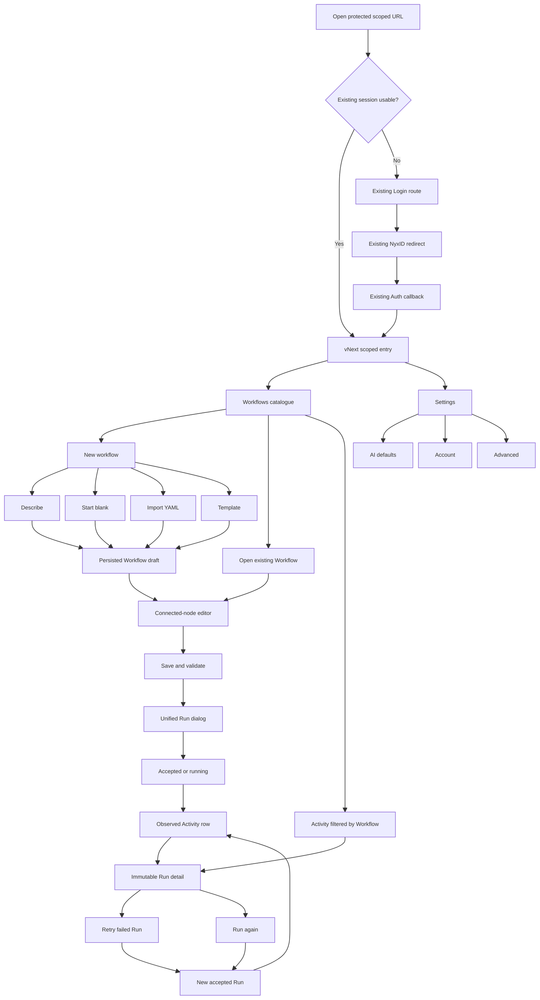
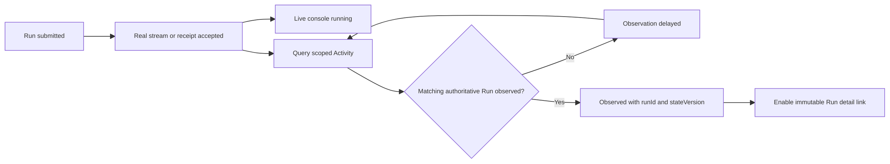

# Workflow + Activity + Settings vNext User Paths

## Status

Proposed as the normative user-path companion to
`2026-08-04-workflow-activity-vnext-design.md` on 2026-08-04.

This document defines how a scoped Aevatar Console user moves through the 17
Excalidraw frames, which route owns each step, which real API fact advances the
journey, and what the UI must do when that fact is unavailable. It does not
authorize frontend implementation until the design package is approved.

Implementation branch: `feat/2026-08-04_workflow-activity-vnext`.

## Required Reading And Precedence

Anyone implementing or reviewing these paths must read, in order:

1. `apps/aevatar-console-web/docs/design-baselines/`
   `workflow-activity-vnext/aevatar-workflow-activity-vnext.excalidraw` for
   visual hierarchy, information architecture, and interaction intent.
2. `2026-08-04-workflow-activity-vnext-design.md` for routes, identity, API,
   state, responsive behavior, deviations, and acceptance criteria.
3. This document for end-to-end user movement, decision points, recovery, and
   path completion evidence.
4. The PNGs and `prototype.html` for visual and interaction calibration only.

The backend contract in `origin/feature/integrate` at
`72093afa4490adf6eb25d83c3db0b9c182cd6ff0` remains authoritative for data.
The prototype's hard-coded objects, `localStorage`, timers, and simulated
receipts are never production data sources.

## User And Job Model

### Primary User

The primary user is an authenticated automation builder or operator working
inside one authorized Aevatar `scopeId`. The same person may move between three
jobs without leaving the vNext workbench:

- author a Workflow draft;
- run and inspect an automation;
- manage personal AI defaults and account/runtime context.

The product does not require the user to understand actor prefixes, projection
internals, member bindings, or service-key conventions. Those facts remain
technical details unless a real backend response makes them useful for
diagnosis.

### User Mental Model

```text
Workflows = what I can create and edit
Run       = execute the current valid Workflow
Activity  = immutable records the system has actually observed
Settings  = my AI defaults, identity, and effective runtime context
```

The user must never be led to believe that:

- a generated Workflow has been saved before draft creation succeeds;
- an accepted Run is already visible in Activity;
- a failed API request means the collection is empty;
- Retry edits or replaces the failed Run;
- a local prototype record is a server record;
- a `workflowId`, `memberId`, `definitionActorId`, and
  `publishedServiceId` are the same identity.

## Entry, Navigation, And Exit

### Entry Contract

The isolated preview entry is a direct authenticated URL:

```text
/scopes/:scopeId/workflow-activity-vnext
```

It redirects only within the new namespace to:

```text
/scopes/:scopeId/workflow-activity-vnext/workflows
```

There is no new global menu entry in the first implementation. Existing menu,
Team, Workflow, Run, Settings, Studio, login, callback, and redirect routes do
not change.

If authentication is missing or expired, existing authentication behavior owns
the interruption and return. If the server rejects the route `scopeId`, the
workbench renders the existing access/not-found behavior. It must not switch to
a cached scope or show sample data.

### Local Navigation

The vNext shell has three stable destinations:

| Destination | Route | User job |
| --- | --- | --- |
| Workflows | `/scopes/:scopeId/workflow-activity-vnext/workflows` | Create, open, edit, and run Workflows |
| Activity | `/scopes/:scopeId/workflow-activity-vnext/activity` | Scan and inspect observed Runs |
| Settings | `/scopes/:scopeId/workflow-activity-vnext/settings` | Manage AI defaults and inspect identity/runtime context |

Every link carries the route `scopeId` unchanged. Switching local sections does
not rewrite it from a display name, remembered selection, or API response.

### Exit Contract

- Back navigation returns to the previous route without rewriting legacy
  history.
- Leaving a dirty editor or dirty Settings form requires a loss-of-changes
  decision.
- Leaving an accepted or running Run does not cancel it unless the real API
  exposes and the user explicitly invokes a supported cancel action.
- Returning later reloads authoritative API state. It does not reconstruct a
  successful screen from prototype or browser-storage records.

## Path Map



## Path Inventory

| ID | Path | Excalidraw frames | Completion evidence |
| --- | --- | --- | --- |
| UP-00 | Authenticate and enter the scoped workbench | 01, 13 | Existing callback returns to the original vNext URL and real scoped queries begin |
| UP-01 | Browse and search Workflows | 01, 13 | Authoritative catalogue rows or a truthful empty/error state |
| UP-02 | Create by Describe | 02, 03 | Draft create returns a real `workflowId`, and the exact scoped draft GET confirms it is readable before editor navigation |
| UP-03 | Start blank and add the first node | 02, 04 | Persisted draft opens; valid document state controls Save/Run/Publish |
| UP-04 | Import YAML | 02, 05 | Server parse/validation succeeds before draft creation |
| UP-05 | Create from Template | 02, 06 | Bundled template is copied into a newly persisted independent draft |
| UP-06 | Open, edit, validate, and save | 03-06, 08 | Authoritative draft update succeeds; unsaved state clears |
| UP-07 | Run a current draft | 07, 08 | Real draft-run stream/receipt reaches Accepted or Running |
| UP-08 | Observe a Run in Activity | 08-10, 13 | Observatory returns an authoritative `runId` and `stateVersion` |
| UP-09 | Filter Activity by Workflow | 09 | The row's exact `workflowId` remains visible in the URL and resolves to an exact `definitionActorId`, or the filtered view is honestly unavailable |
| UP-10 | Inspect immutable Run detail | 11 | Detail response renders committed facts; graph may load independently |
| UP-11 | Retry a failed Run | 12 | Fork API accepts an explicit failed `stepId`; source Run remains unchanged |
| UP-12 | Run a completed Workflow again | 11, 12 | Fork API accepts an explicit first execution step; source remains unchanged |
| UP-13 | Change AI defaults | 14, 15 | Authoritative settings query observes the selected service and model |
| UP-14 | Inspect Account and session | 16 | `/api/auth/me` or existing auth state renders real identity facts |
| UP-15 | Inspect Advanced runtime values | 17 | `/api/user-config/runtime` returns the read-only effective values |
| UP-16 | Complete key jobs on tablet/mobile | 13, 17 | Same API and identity evidence is reachable without desktop-only controls |

## UP-00: Authenticate And Enter The Scoped Workbench

**Intent:** Reach the isolated vNext experience through Aevatar's existing
login, callback, session, return-to, and locale behavior without affecting
other console routes.

**Start:** An authenticated or unauthenticated user opens the direct namespace
URL for an authorized `scopeId`.

**Steps:**

1. The existing app runtime classifies `/login` and `/auth/callback` as public
   and the vNext URL as protected.
2. If a stored or restorable session exists, current
   `AuthSessionBootstrap`/`ensureActiveAuthSession` behavior restores it.
3. Without a usable session, `ProtectedRouteRedirectGate` sends the complete
   scoped path, search, and hash through `sanitizeReturnTo` into the existing
   `/login?redirect=...` route.
4. The existing Login page calls
   `NyxIDAuthClient.loginWithRedirect({ returnTo })`.
5. NyxID returns through the unchanged `/auth/callback` route.
6. The existing callback calls `handleRedirectCallback()` and replaces the
   location with its sanitized `result.returnTo`.
7. The user returns to the original vNext URL. Only the namespace root
   redirects within the new namespace to Workflows; a requested child route
   retains its own path, query, and hash.
8. The local Workflows, Activity, and Settings navigation appears.
9. Workflows begins its real scoped queries.
10. Language and account controls reuse `ConsoleLanguageSwitch` and existing
    account behavior, even if their placement/style changes in the vNext shell.

**Completion:** The callback returns to the original scoped URL, the existing
session is active, the selected `en-US` or `zh-CN` locale is preserved, and the
page shows a loading, populated, empty, partial-source, or error state derived
from real requests.

**Recovery:** Login configuration, callback, service-access review,
unauthorized, forbidden, missing-scope, and network failures retain their
current distinct retry/back behavior. No alternate scope, second login flow,
mock user, or demonstration catalogue is substituted.

**Presentation:** Login, callback, language, and account controls adopt vNext
tokens, density, border, radius, and status styling only. Authentication,
return, session, language switching, language persistence, and error behavior
remain the existing Aevatar logic.

The Excalidraw contains no separate Login frame. Login presentation therefore
inherits only the approved vNext visual direction; it must not introduce new
auth decisions, fields, providers, or navigation that the design does not
define.

## UP-01: Browse And Search Workflows

**Intent:** Find an existing Workflow or start creating one.

**Route:**
`/scopes/:scopeId/workflow-activity-vnext/workflows`.

**Authoritative reads:**

```text
GET /api/workspace/workflow-drafts?scopeId=:scopeId
GET /api/scopes/:scopeId/workflows
```

The existing typed `studioApi.listWorkflows` boundary may coordinate these
sources. The UI keeps draft and scope Workflow source types explicit.

**Steps:**

1. The user scans Workflow name, source/state, updated time, and available
   actions.
2. Search filters only the currently returned authoritative fields.
3. `Open` navigates using that row's real `workflowId`.
4. `New workflow` navigates to the creation chooser.
5. `Run` is enabled for a validated runnable draft. Published Run is enabled
   only when an explicit callable `publishedServiceId` is available.

**Completion:** The selected row opens or the user reaches creation. A
successful empty response produces the New workflow empty state.

**Not allowed:**

- Do not show Last Run by joining Activity on `workflowName`.
- Do not invent revision numbers or published availability.
- Do not use sample rows when one catalogue source fails. Preserve valid rows
  from the successful source and identify the failed source.

### Shared Draft Create Observation Contract

UP-02 through UP-05 share one create-completion rule. A scoped draft create may
return a materialized draft or a `202 Accepted` receipt with a real
`workflowId`, command receipt, and `readiness.stage = projection_pending` while
`readiness.readable = false`.

- A materialized draft can enter the editor immediately using its returned ID.
- An accepted receipt enters an explicit Accepted/Observing state and polls
  `GET /api/workspace/workflow-drafts/:workflowId?scopeId=:scopeId`.
- A bounded `404` during that observation window means the projection is still
  pending; it does not mean the create failed and it does not authorize a
  second create request.
- Navigation occurs only after the exact scoped GET returns the readable draft.
- A timeout preserves the receipt, input, and returned ID. Retry checks the
  same ID again. It never silently resubmits the create POST or fabricates a
  local draft.
- Any non-`404` read failure is shown as its real authorization, decoding, or
  network error and remains distinct from projection delay.

## UP-02: Create A Workflow By Description

**Intent:** Turn a natural-language automation goal into an editable Workflow
draft.

**Frames:** 02 New workflow and 03 Describe generated draft.

**Route transition:**

```text
.../workflows/new
  -> .../workflows/:workflowId
```

**Steps and real evidence:**

1. The user chooses `Describe` and enters a concrete goal.
2. Submit calls `POST /api/workflows/generator` through the existing typed
   authoring boundary.
3. The generated Workflow is parsed, normalized, or validated through the
   reviewed editor endpoints as required by its response form.
4. The user sees a generated summary or correctable validation problem.
5. Confirming creation calls
   `POST /api/workspace/workflow-drafts?scopeId=:scopeId`.
6. Only the draft-create response establishes the real `workflowId`.
7. If creation is accepted but not readable, the UI follows the shared create
   observation contract for that exact scope and ID.
8. The router opens the common connected-node editor only after the draft is
   materialized or the authoritative GET confirms readability.

**Completion:** The editor loads the persisted draft and shows the generated
nodes and edges. Generation success alone is not completion.

**Recovery:** Generator, parser, validator, and draft-create failures preserve
the user's description and any safe generated preview. A create-observation
timeout preserves the accepted receipt and retries only the GET for the same
ID. Retry repeats only the failed explicit action. No local ID or demonstration
draft is routed as saved.

## UP-03: Start Blank And Add The First Node

**Intent:** Build a Workflow manually without a generated starting structure.

**Frames:** 02 New workflow and 04 Start blank.

**Steps:**

1. The user chooses `Start blank`.
2. The frontend creates a minimal, well-formed Workflow document as explicit
   frontend authoring content.
3. The draft-create API returns its authoritative `workflowId` and follows the
   shared create observation contract when the draft is not readable yet.
4. The editor opens an empty connected-node canvas only after readability is
   confirmed.
5. `Add node` opens the searchable Node library.
6. Choosing a node adds it to the shared document state.
7. Selecting the node opens Node configuration; `Edit YAML` opens the same
   document through the YAML panel.
8. Validation controls Save, Run, and Publish availability.

**Completion:** At least one meaningful node is configured and the user can
save a valid authoritative draft.

**Recovery:** An empty draft may remain saved, but Run and Publish stay
disabled when the real validator says it is not executable. The UI does not
insert a sample node and call the draft valid.

## UP-04: Import YAML

**Intent:** Create a Workflow from YAML the user already owns.

**Frames:** 02 New workflow and 05 Import YAML.

**Steps:**

1. The user chooses `Import YAML` and enters or pastes YAML.
2. Submit calls `POST /api/editor/parse-yaml`.
3. Validation or normalization runs through the reviewed editor contracts when
   needed.
4. Parse and validation feedback is shown against the YAML source.
5. Only a successful document can be submitted to the draft-create API.
6. The returned `workflowId` follows the shared create observation contract;
   the common editor opens with parsed nodes and edges only after readability
   is confirmed.

**Completion:** The editor represents the same authoritative document in
canvas and YAML modes.

**Recovery:** Invalid YAML never creates a partial draft. Network or decoder
failure is not relabeled as invalid YAML or empty content. User input remains
available for correction and retry.

## UP-05: Create From A Template

**Intent:** Begin from a known useful structure while creating an independent
Workflow.

**Frames:** 02 New workflow and 06 Template.

**Steps:**

1. The user chooses `Template`.
2. The UI identifies templates as bundled frontend product content unless a
   real template API is introduced and reviewed later.
3. The user selects and previews a versioned template.
4. Its Workflow document is copied, parsed, and validated.
5. Draft creation returns a new authoritative `workflowId` and follows the
   shared create observation contract when projection is pending.
6. The common editor opens the copied nodes and edges only after readability
   is confirmed.

**Completion:** Editing the new draft cannot mutate the bundled template or
another user's Workflow.

**Not allowed:** The UI must not render bundled templates as “loaded from the
server,” attach fake server timestamps, or reuse the template ID as a
`workflowId`.

## UP-06: Open, Edit, Validate, Save, And Publish Boundary

**Intent:** Change one Workflow through a single connected-node authoring
model.

**Route:**
`/scopes/:scopeId/workflow-activity-vnext/workflows/:workflowId`.

**Authoritative operations:**

```text
GET /api/workspace/workflow-drafts/:workflowId?scopeId=:scopeId
PUT /api/workspace/workflow-drafts/:workflowId?scopeId=:scopeId
POST /api/workspace/workflow-drafts?scopeId=:scopeId
GET /api/scopes/:scopeId/workflows/:workflowId
POST /api/editor/parse-yaml
POST /api/editor/serialize-yaml
POST /api/editor/validate
POST /api/editor/normalize
```

**Steps:**

1. The route loads the exact Workflow under the route scope and retains whether
   the source is an existing draft or a committed-only Workflow.
2. Canvas, Node library, Node configuration, and YAML panel edit one document
   state.
3. A node or YAML change marks the draft dirty.
4. Validation exposes exact actionable problems and controls executable
   actions.
5. Save serializes and updates an existing authoritative draft.
6. For a committed-only source (`draftExists=false`), first Save creates a new
   draft instead of calling draft update. It follows the shared create
   observation contract and replaces the route with the returned readable
   draft ID, which may differ from the committed source ID.
7. Save success clears dirty state only after the real update succeeds or the
   newly created draft becomes readable.
8. Leaving while dirty prompts Save, Discard, or Stay.

**Publish boundary:** The Excalidraw retains a Publish control because the
existing Studio supports publication/binding behavior. Publication must use
the reviewed scope Workflow/save-and-bind contracts and explicit capability
confirmations. It is not a prerequisite for draft Run, and it must not invent a
`publishedServiceId` after save acceptance.

**Completion:** The saved document can be reloaded from the API with the
expected draft identity and content. For a committed-only source, that identity
is the create response's materialized draft ID, not an assumed reuse of the
committed Workflow ID.

**Identity guard:** This path never creates a fake Team/member, never sends
`workflowId` to a member endpoint, and never assumes publication makes the
Workflow callable through the same ID.

## UP-07: Run A Current Draft

**Intent:** Execute the current valid Workflow without leaving the editor.

**Frames:** 07 Unified Run dialog and 08 Running draft.

**Authoritative execution:**

```text
POST /api/scopes/:scopeId/workflow/draft-run
Accept: text/event-stream
```

**Steps:**

1. The user selects `Run` from the catalogue or editor.
2. The unified dialog identifies the exact Workflow and says `Current draft`
   when no real revision number exists.
3. The user reviews input, connections, and verified external effects.
4. Required explicit capability confirmations must be derived from the real
   preview/validation contract.
5. Submit serializes the current valid document and starts
   `runtimeRunsApi.streamDraftRun`.
6. The button becomes stable and duplicate submission is blocked.
7. Real stream/receipt facts move the UI into Accepted or Running.
8. The editor remains visible and the Run console opens without replacing the
   current document.

**Completion:** A real stream or command receipt proves execution acceptance.
It does not yet prove an Activity row exists.

**Recovery:** Submission failure keeps the input and returns to an actionable
dialog. A disconnected stream shows the last authoritative receipt/event and a
reconnect or Activity action; it does not fabricate completion.

## UP-08: Observe A Run In Activity

**Intent:** Move from live execution to an immutable observed record.

**Frames:** 08 Running draft, 09 filtered Activity, 10 all retained Runs, and
13 states.



**Authoritative read:**

```text
GET /api/workflow/observatory/runs
```

with supported `scope`, `status`, `origin`, `definition`, `schedule`, `from`,
`to`, and `take` parameters.

**Steps:**

1. Acceptance invalidates or polls the correctly keyed scope Activity query
   with bounded backoff.
2. While no matching authoritative record exists, the UI says `Observing` or
   `Activity delayed`.
3. When observatory returns the Run, its `runId` and `stateVersion` establish
   the immutable Activity identity.
4. Only then does the UI say `Observed in Activity` and enable the detail link.
5. If the execution response exposes no trustworthy match key, the UI offers
   general `Open Activity` rather than guessing a row.

**Completion:** An actual observatory summary is visible in Activity.

**Not allowed:** A timer, local array, `localStorage`, stream completion, or
HTTP success status cannot insert an Activity row or invent a `stateVersion`.

## UP-09: Filter Activity By Workflow

**Intent:** Review observed executions belonging to one Workflow definition.

**Start:** The user invokes `View Activity` from a Workflow context.

**Steps:**

1. The catalogue action encodes that row's exact draft `workflowId` in the
   Activity route query string without substituting a member, service, display
   name, or actor identity.
2. Activity keeps the Workflow filter visible and removable, and resolves the
   scope Workflow detail through
   `GET /api/scopes/:scopeId/workflows/:workflowId`.
3. Only `ScopeWorkflowDetail.source.definitionActorId` supplies the
   observatory `definition` filter.
4. Refresh, copied URLs, back, and forward restore the same `workflowId` and
   repeat the same authoritative resolution.
5. The ledger shows only the server-filtered response window. Removing the
   Workflow filter removes it from the URL and returns to global Activity.

**Completion:** The active `workflowId` filter is URL-backed, visible,
removable, and backed by the exact resolved definition identity.

**Recovery:** A missing or invalid `workflowId`, failed Workflow-detail read,
or draft-only Workflow without a definition actor produces an honest
invalid, error, or unavailable state. The Runs query remains disabled so the
page never silently shows global Activity. The UI does not substitute Workflow
name, `memberId`, `publishedServiceId`, `serviceKey`, or a parsed actor prefix.

## UP-10: Inspect Immutable Run Detail

**Intent:** Understand what happened in one observed Run.

**Route:**
`/scopes/:scopeId/workflow-activity-vnext/activity/:runId`.

**Authoritative reads:**

```text
GET /api/workflow/observatory/runs/:runId
GET /api/workflow/observatory/runs/:runId/graph
```

**Steps:**

1. Selecting an Activity row opens its real `runId`.
2. Initial entry may use the complete Run-detail skeleton until committed
   history is available. After that, selecting another Run in the history rail
   keeps the authoritative rail mounted, preserves its scroll position, and
   immediately marks the target Run as selected.
3. Only the selected Run's detail and graph region enters loading during that
   selection. The committed history rail remains visible and usable because
   its query is unchanged. Detail and graph continue to load independently.
4. Manual Refresh is a separate grouped operation: because it refreshes
   detail, graph, and history together, it may block and mark the complete
   workspace busy while preserving committed content beneath its overlay.
5. The page prioritizes status, identity, final output/error, diagnostics, and
   step trace.
6. The user may expand input, request parameters, full timeline content, tool
   calls, statistics, and usage.
7. Copy/export actions operate only on returned, permitted data.

**Completion:** The user can identify success/failure and the relevant step
without altering the record.

**Recovery:** A graph failure leaves the committed detail visible. A missing
or cross-scope Run renders the server-safe not-found state. Partial/running
detail is labeled partial and refreshed through bounded observation.

**Not allowed:** No edit, overwrite, delete, local usage calculation, or fake
source/child Run timeline appears on the source record.

## UP-11: Retry A Failed Run

**Intent:** Continue from an unambiguous failed step while preserving the
failed Run as evidence.

**Frame:** 12 Failed Run recovery.

**Authoritative command:**

```text
POST /api/workflow/runs/fork
```

**Steps:**

1. Run detail identifies a failed step from the returned step/diagnostic data.
2. `Retry` is enabled only when one explicit `stepId` is a valid recovery
   start.
3. The confirmation dialog shows source Run ID, start step, input, and
   supported overrides.
4. Confirm submits `sourceRunId` and `startAtStepId`.
5. A real `202 Accepted` response shows the accepted command ID, correlation
   ID, new Run actor ID, and status URL as receipt facts.
6. The source Run remains on screen and unchanged.
7. The new execution follows UP-08 until an authoritative Activity `runId` is
   observed.

**Completion:** The user can open the newly observed Run; the failed source
still shows its original status and trace.

**Recovery:** If no exact failed step exists, Retry stays disabled with a
reason. A failed fork request preserves the confirmation input. The frontend
does not use `newRunActorId` as a Run-detail route unless an authoritative
contract establishes the corresponding `runId`.

## UP-12: Run A Completed Workflow Again

**Intent:** Create a new execution from the beginning of an earlier successful
Run.

**Steps:**

1. Detail/graph data must identify the first executable step unambiguously.
2. `Run again` opens the same immutable-source confirmation model as Retry.
3. The user reviews the source Run, first step, input, and supported overrides.
4. Fork submission returns a real accepted receipt.
5. The new execution follows UP-08; the original success record remains
   unchanged.

**Completion:** A new authoritative Activity Run is observed.

**Recovery:** If the first execution step is missing or ambiguous, Run again
stays disabled. The UI does not pick the first array item, parse a graph node
ID, or pretend a new linked record exists before observation.

## UP-13: Change AI Defaults

**Intent:** Choose the user's preferred connected AI service and default model.

**Frames:** 14 AI defaults and 15 save/recovery states.

**Authoritative operations:**

```text
GET /api/user-config/llm
PUT /api/user-config/llm
```

**Steps:**

1. Settings opens AI defaults and loads the current real selection and
   available connected-service/model catalogue through existing adapters.
2. Changing Preferred service updates valid model choices without saving.
3. Changing either value makes the page dirty and reveals the shell-fixed
   Restore and Save changes dock without remounting the edited form control.
4. Discard restores the last authoritative values.
5. Save sends the selected intent and receives an accepted receipt.
6. The UI says `Confirming saved values`, not Saved.
7. Existing save-observation logic requeries settings until the selected
   service/model is authoritative.
8. Only observation clears dirty/confirming state and shows saved success.

**Completion:** A fresh GET returns the chosen values.

**Recovery:** Save failure preserves dirty values. Catalogue unavailable keeps
the last real selection visible and disables invalid changes. Fallback is
explained rather than silently saved. `localStorage` cannot be the settings
authority.

## UP-14: Inspect Account And Session

**Intent:** Understand who is signed in and manage the existing session or
service access.

**Frame:** 16 Account.

**Authoritative identity:**

```text
GET /api/auth/me
```

**Steps:**

1. The user opens Account from local Settings navigation.
2. The page shows returned identity, user ID, roles, groups, provider, scope,
   and expiry only when present.
3. Sign in, Sign out, and Manage service access reuse current application auth
   actions.
4. Any navigation/confirmation follows those existing auth contracts.

**Completion:** The UI reflects the current real session state.

**Recovery:** Expired or unavailable auth is shown explicitly. The page never
uses the prototype's `signed-in` browser flag, invents claims, or renders bearer
or credential material.

## UP-15: Inspect Advanced Runtime Values

**Intent:** Diagnose the effective runtime/request context without editing it.

**Frame:** 17 Advanced and responsive.

**Authoritative read:**

```text
GET /api/user-config/runtime
```

**Steps:**

1. The user opens Advanced.
2. One read-only representation shows the effective runtime mode and request
   values returned by the API.
3. Permitted non-secret values may be copied.

**Completion:** The user can inspect the active real configuration without a
save action.

**Recovery:** An unavailable runtime query shows retry. It does not substitute
build-time defaults and label them as the user's effective server state.

## UP-16: Complete Key Jobs On Tablet And Mobile

**Intent:** Preserve the same product semantics on constrained screens.

**Frames:** 13 responsive Workflows/Activity and 17 responsive Settings, plus
the mobile editor references in the baseline directory.

**Required mobile paths:**

- Workflows: search, New workflow, Open, and eligible Run remain reachable.
- Creation: all four methods remain usable; YAML and validation errors remain
  associated with their inputs.
- Editor: Run, Add node, Edit YAML, Save, and Publish availability remain
  visible. Node configuration uses an accessible bottom sheet.
- Activity: status, Workflow, short Run ID, time, filters, and detail access
  remain available without desktop-only hover.
- Run detail: failure, output, step trace, Retry, and Run again eligibility
  remain accessible.
- Settings: section navigation, shell-fixed dirty save dock, save observation, Account
  actions, and Advanced values remain operable.
- Login and callback: the existing NyxID flow remains usable at mobile width,
  and the existing language switch remains reachable without desktop chrome.

**Completion:** Mobile and desktop reach the same authoritative end states.
Responsive layout changes presentation, never API source, identity, recovery,
or completion evidence.

## Cross-Path Truth Checkpoints

| Checkpoint | The UI may say | Required evidence | The UI must not say |
| --- | --- | --- | --- |
| Workflow generated | Generated preview ready | Real generator response | Saved |
| Workflow create accepted | Accepted/Observing | Real `202` receipt with `workflowId` and `projection_pending` readiness | Draft readable or editor ready |
| Workflow created | Draft created | Materialized create response or exact scoped draft GET succeeds | Created from a local ID or receipt alone |
| Workflow saved | Saved | Real draft update success and clean document | Saved after timer-only feedback |
| Run submitted | Submitting | User action in progress | Running |
| Run accepted | Accepted/Running | Real SSE event or accepted receipt | Observed in Activity |
| Activity observed | Observed | Observatory summary with `runId` and `stateVersion` | Observed from local insertion |
| Retry accepted | New Run accepted | Real fork receipt | Linked history persisted |
| New Run observed | New Run available | Observatory returns authoritative `runId` | Detail route from guessed actor ID |
| Settings accepted | Confirming saved values | Real PUT receipt | Saved |
| Settings saved | Saved | Real GET observes selected values | Saved from `localStorage` |
| Empty collection | No records | Successful API response with zero records | Empty after request failure |

## Failure And Recovery Paths

| Failure | Preserve | Show | Recovery |
| --- | --- | --- | --- |
| Workflow catalogue request fails | Successful source rows and active search | Failed source or page error | Retry failed query |
| Generator fails | User description | Generator error | Retry generation |
| YAML parse fails | YAML input | Exact parse feedback | Edit and parse again |
| Draft create fails | Creation inputs/preview | Create error | Retry create |
| Draft projection is delayed | Accepted receipt, returned ID, and creation inputs | Accepted/Observing or delayed readiness | Retry the exact draft GET; do not repeat create |
| Draft save fails | Dirty document | Save error | Retry or continue editing |
| Run submission fails | Input and document | Submission error | Retry explicit Run |
| Run stream disconnects | Last real receipt/event | Disconnected or unknown status | Reconnect or open Activity |
| Activity observation is delayed | Accepted receipt | Delayed projection state | Bounded retry/open Activity |
| Activity list fails | Current filters | Request error, not empty | Retry |
| Run graph fails | Run detail | Graph-only error | Retry graph |
| Retry/Run again fails | Immutable source and overrides | Fork error | Retry command |
| Settings catalogue fails | Last real selection | Catalogue unavailable | Retry catalogue |
| Settings save fails | Dirty selection | Save error | Retry or discard |
| Auth expires | Non-secret local editing state when safe | Session expired | Existing sign-in flow |
| Login/callback fails | Sanitized return target and safe error reason | Existing callback recovery | Retry existing NyxID flow/back to Login |
| Locale catalogue/key is missing | Current locale selection | Explicit development/test failure | Fix both catalogues; never use vNext-local fallback copy |

## Excalidraw Coverage

Every frame has a corresponding user path:

| Frame | Covered by |
| --- | --- |
| 01 Workflows catalogue | UP-00, UP-01 |
| 02 New workflow direct creation | UP-02, UP-03, UP-04, UP-05 |
| 03 Describe generated draft | UP-02, UP-06 |
| 04 Blank draft | UP-03, UP-06 |
| 05 Import YAML draft | UP-04, UP-06 |
| 06 Template draft | UP-05, UP-06 |
| 07 Unified Run dialog | UP-07 |
| 08 Running draft and Run console | UP-07, UP-08 |
| 09 Activity filtered by Workflow | UP-09 |
| 10 All retained Runs | UP-08 |
| 11 Immutable Run detail | UP-10, UP-12 |
| 12 Failed Run recovery | UP-11, UP-12 |
| 13 Workflows and Activity states | UP-00, UP-01, UP-08, UP-16 |
| 14 Settings AI defaults | UP-13 |
| 15 Settings save/recovery | UP-13 |
| 16 Settings Account | UP-14 |
| 17 Settings Advanced/responsive | UP-15, UP-16 |

## User-Path Acceptance Criteria

- Every `UP-*` path can be traced from its start route to its completion
  evidence without leaving the new namespace, except existing authentication
  and service-access actions.
- UP-00 uses the existing protected-route guard, Login, NyxID callback,
  sanitized `returnTo`, session restoration, and locale behavior; only their
  presentation may change.
- Login/callback styling remains compatible with all existing protected routes,
  not only the vNext namespace.
- Every vNext message ID exists in both `en-US` and `zh-CN`, and language
  switching uses the existing `ConsoleLanguageSwitch`/Umi locale state.
- All four creation methods converge on a real persisted draft and the same
  connected-node editor.
- A real returned `workflowId` and a successful materialized response or exact
  scoped draft GET are required before editor navigation; a `202` receipt alone
  is not readability.
- A create-observation timeout retries the same draft ID and never silently
  resubmits draft creation.
- Opening a committed-only Workflow preserves `draftExists=false`; first Save
  creates and observes a new draft, then adopts its returned ID.
- Draft Run reaches Accepted/Running before it can reach Activity observation.
- Activity observation requires a real observatory `runId` and `stateVersion`.
- Workflow-specific Activity preserves the catalogue row's exact `workflowId`
  in the URL and uses only the exact returned `definitionActorId` for the Runs
  request; invalid resolution never falls back to global Activity.
- Run detail remains immutable in success, failure, partial graph, Retry, and
  Run again paths.
- Retry and Run again require explicit step identity and create a new accepted
  execution.
- Settings Save remains confirming until authoritative readback observes the
  selected values.
- API pending, empty, delayed, unavailable, decoding failure, and request
  failure remain distinct in every path.
- No production path imports mock fixtures, inserts demonstration rows, reads
  prototype Activity/settings from browser storage, or uses timers to simulate
  authoritative API progress.
- Desktop, tablet, and mobile use the same identities, APIs, and completion
  evidence.
- Existing routes, redirects, menu behavior, backend files, and backend
  contracts remain unchanged.
