# New Workflow Creation UX Design

## Status

Approved direction on 2026-08-06 for the Workflow Activity vNext frontend,
amended on 2026-08-10 to merge blank creation into Describe.
This document narrows the existing direct-creation contract without changing
its backend APIs, identity rules, or materialization semantics.

Implementation branch: `fix/2026-08-06_restore-describe-workflow-name`.

## Problem

The current creation route exposes backend requirements as if they were user
decisions. `Save location` is always prominent even when the workspace offers
only one directory, and `Automation goal` does not explain that the text is
used to generate the workflow. The selected method is then rendered in a
full-width bordered panel whose fields stretch across the complete work area.
This loses the compact hierarchy defined by the Workflow Activity vNext
baseline and makes a short creation task look like an empty settings form.

Describe also requires two separate decisions after input: generate a YAML
preview and then create it. The raw generated YAML is implementation detail at
this stage. Users asked for one action that generates, validates, saves, and
opens the common editor.

Describe and Start blank are also presented as peer creation methods even
though blank creation is the same named draft flow with no generation prompt.
Making users choose between them before seeing the form adds a decision that
the entered data already resolves.

## Product Decisions

### Save Target

The workspace directory remains part of the typed draft-create request because
the backend requires `directoryId`. It is not shown when there is exactly one
available directory. The route automatically selects that directory and uses
it for every creation mode.

If the workspace returns more than one directory, the selected method surface
shows one compact `Save to` selector below the method-specific input. This is
the only state in which save location is a real user decision. Loading, zero
directory, authorization, and request-failure states retain user input and
provide the existing recovery actions; they never invent a directory.

The backend also requires a unique YAML path inside the chosen directory even
though duplicate Workflow display names are allowed. The frontend derives a
file name from the resolved Workflow name and the authoritative draft list,
using the first available suffix (`weekly-review.yaml`, then
`weekly-review-2.yaml`, and so on). This filename is not a creation-page field.
A server conflict caused by a concurrent create remains a visible retryable
error and never overwrites the existing draft.

### Describe

Describe is a focused form with one required input, one optional input, and one
final action:

- heading: `Describe your workflow`;
- field label: `Workflow name`;
- optional field label: `What should this workflow do?`;
- supporting copy explains that the generated steps can be reviewed in the
  editor;
- one primary action: `Generate and open`.

The action label remains `Generate and open`; it does not change while the user
types. Submission trims the description and chooses one of two existing paths:

- a non-empty description calls the real generator, parses and validates the
  returned YAML, then persists it;
- an empty or whitespace-only description creates and persists the existing
  minimal blank Workflow YAML without calling the generator.

Both paths use the user-provided Workflow name for the draft display name and
filename, wait for the exact draft to become readable when creation is
accepted, and open the editor. The generated YAML document name remains an
independent document field. The page does not expose generated YAML or require
a second create confirmation. Generator, parse, validation, create, and
materialization failures preserve both inputs and identify the failed stage in
product terms.

### Other Creation Methods

All methods follow the same rule: show only the input the user can meaningfully
provide, then use one final action.

| Method | Visible input | Name source | Primary action |
| --- | --- | --- | --- |
| Describe | Workflow name and optional natural-language workflow outcome | User input | Generate and open |
| Import YAML | Workflow YAML | Parsed YAML document | Import and open |
| Use template | Bundled template selection and concise preview | Template name, made independent for the new draft | Use template and open |

The editor remains the only surface for reviewing generated/imported YAML,
renaming the created workflow, editing nodes, and resolving document-level
details. Creation does not add a second editor.

## Approaches Considered

### Focused Prompt

Show only task-specific inputs and one final action. Describe asks for the
user-controlled display name and accepts an optional generation prompt; the
prompt's presence selects generated or blank creation. Import and Template
derive their names from their respective sources. This is the selected
approach because it removes a redundant method choice while keeping the blank
authoring path available.

### Separate Describe And Blank Methods

Keep the two existing chooser cards and their separate actions. This is
rejected because the second method is already represented by submitting the
Describe form without a description, so the chooser asks users to predict a
distinction the form can determine directly.

### Derived Name For Describe

Derive the draft display name from generated YAML and ask only for the outcome.
This is rejected because the generated document name is not a substitute for
the user's intended Workflow display name. Describe therefore requires an
explicit name before generation.

### Guided Wizard

Add examples and a visible two-step progress indicator. This can help first-
time users, but it adds visual weight and falsely suggests that creation and
editor review are one wizard-owned transaction. It is rejected for the normal
flow.

## Layout And Visual Direction

The selected-method surface is a centered, unframed creation column instead
of a full-width bordered panel. Desktop width is bounded for comfortable form
reading; mobile uses the available width. The title, short supporting line,
input, inline validation, optional multi-directory selector, and action row
form one continuous vertical hierarchy.

The page continues the Operational Automation Ledger direction:

- existing dark navigation rail and white work surface;
- AlibabaSans product typography;
- neutral dividers, restrained blue primary action, and 4-6 px radii;
- no nested cards, gradient, decorative shadow, or oversized form controls;
- stable button dimensions and visible keyboard focus;
- long validation and technical details wrap without widening the viewport.

The method chooser retains three clearly distinct starting methods. Selecting
one changes only the main creation column. `Change method` is a low-emphasis
back action. User input survives method switches where the value remains
meaningful, while stale failure and validation output from another method is
cleared.

## Data Flow

```mermaid
%%{init: {"maxTextSize": 100000, "flowchart": {"useMaxWidth": false, "nodeSpacing": 10, "rankSpacing": 50}, "themeVariables": {"fontSize": "10px"}}}%%
flowchart LR
    A["Choose creation method"] --> B["Enter method-specific input"]
    B --> C["Resolve the real workspace directory"]
    C --> K{"Describe entered?"}
    K -->|"Yes"| D["Generate, parse, and validate"]
    K -->|"No"| L["Build minimal blank YAML"]
    K -->|"Import or template"| D
    D --> E["Resolve a non-conflicting YAML file name"]
    L --> E
    E --> J["Create the scoped workflow draft"]
    J --> F{"Draft readable?"}
    F -->|"Yes"| G["Open the common workflow editor"]
    F -->|"Accepted"| H["Observe the exact returned workflow ID"]
    H --> G
    H -->|"Delayed"| I["Preserve input and retry observation only"]
```



Describe conditionally executes either generation plus parse/validation or
minimal blank-YAML creation behind one user action, followed by the same draft
creation and opening flow. These remain distinct technical stages so recovery
can be truthful. The action never treats generated content as saved, never
routes from a locally invented workflow ID, and never repeats the create POST
when only materialization is delayed.

## State And Recovery Contract

- While workspace settings load, creation inputs remain editable and the final
  action remains unavailable until a real directory is resolved.
- With zero directories, show the existing access/retry path and preserve all
  entered input.
- Generator failure keeps the description and enables retry of generation;
  blank creation never calls the generator.
- Parse or validation failure keeps the input and shows actionable findings;
  no draft is created.
- Draft-create failure keeps the method input and retries only creation after
  another explicit click.
- Accepted creation shows `Creating workflow...`; delayed materialization
  preserves the receipt and retries only the exact scoped GET.
- Duplicate submission is blocked across the complete one-click operation.
- Changing methods clears stale errors and findings but does not erase the
  previously typed Describe name or prompt.

## Accessibility And Responsive Behavior

- Labels are programmatically associated with their controls.
- Pending status is announced without repeatedly announcing observation
  polling.
- The primary action exposes a stable loading state and cannot be triggered
  twice by mouse or keyboard.
- `Change method` and `Back to workflows` remain separate navigation actions.
- At widths below 768 px, inputs and actions stack, the action remains visible
  after its associated validation content, and no sticky element covers a
  focused textarea.
- The three method options collapse to a single column or compact multi-column
  arrangement without truncating labels or descriptions.

## Focused Test Contract

The owning route integration test will protect these observable risks:

1. A single returned directory is not rendered, while Describe uses it in the
   create request.
2. Multiple returned directories render `Save to` and the selected value is
   used in the create request.
3. Describe requires `Workflow name`, keeps `What should this workflow do?`
   optional, and exposes one fixed `Generate and open` action. With a
   description it calls generator, parser, draft create, and opens the
   materialized workflow using the user-provided display name.
4. The same Describe action with an empty or whitespace-only description skips
   generator and parser calls, persists the minimal blank Workflow YAML, and
   opens the materialized workflow.
5. File-name resolution chooses the first available suffix within the selected
   directory without changing the Workflow display name.
6. Import derives the name from parsed YAML and creates without a separate
   workflow-name field.
7. Generator or create failure preserves the Workflow name and prompt;
   switching methods clears stale failure output without discarding shared
   name input.
8. Accepted draft creation preserves the existing observe-and-retry contract
   and never resubmits create during readiness retry.

Tests assert accessible rendered behavior and typed boundary requests. They do
not assert CSS class names or implementation callback order beyond the real
external operation sequence that distinguishes generation from persistence.

## Scope

The change is frontend-only and restricted to Workflow Activity vNext creation
page code, its focused tests, creation-mode type, and this specification.
It does not change backend endpoints, shared workflow identity semantics,
legacy Workflow/Studio routes, the common editor, global navigation, or the
authoritative 17-frame baseline assets.

## Design Baseline

```text
Design baseline:
  apps/aevatar-console-web/docs/design-baselines/workflow-activity-vnext/
Primary design:
  aevatar-workflow-activity-vnext.excalidraw
Design SHA-256:
  30e74d7b410ae72c4c91432355436679033679c54c10b1702908435b001577de
Contract specification:
  apps/aevatar-console-web/docs/superpowers/specs/
  2026-08-04-workflow-activity-vnext-design.md
User paths:
  apps/aevatar-console-web/docs/superpowers/specs/
  2026-08-04-workflow-activity-vnext-user-paths.md
Authentication and localization:
  Existing Aevatar login, callback, session, returnTo, and Umi locale logic;
  presentation may change, behavior may not.
Production data source:
  Real APIs and API-acknowledged user actions only; no mock fallback.
Baseline integrity:
  python3 apps/aevatar-console-web/docs/design-baselines/
  workflow-activity-vnext/verify-baseline.py
```
