# Workflow Schedule vNext Design

## Status

Design direction approved for review on 2026-08-11 and corrected on
2026-08-12 after comparing the design with the existing Aevatar scheduled
workflow implementation. This document extends the Workflow Activity vNext
baseline with a published-workflow schedule entry that reuses the existing
Team member automation and `ScheduledDispatch` contracts.

Implementation branch: `feat/2026-08-11_workflow-schedule-design`.

Baseline branch: `feat/2026-08-04_workflow-activity-vnext` at
`a6602edc006dab1cd944cf029f7f99fea4c504cd`.

## Problem

The current visual baseline uses Schedule both as a workflow graph node and as
an Activity run origin. That makes the product model ambiguous: a user could
reasonably conclude that schedule configuration is stored in a draft document
or inside a single Run.

The runtime model is different. Current scheduled workflow and Team automation
already uses `ScheduledDispatchGAgent` plus workflow or Team service
invocation. The Studio-facing product surface is Team member automation, rooted
at the canonical Team member route. A Workflow Schedule is therefore not a new
frontend scheduler, draft property, graph node, Run mode, or standalone service
collection. It is the Workflow editor's contextual entry into the same member
automation capability.

## Semantic Decision

Schedule is a contextual execution source owned by an existing Team member
automation and backed by `ScheduledDispatch`. The Workflow editor may provide
an inline configuration surface for the current member workflow, while the Team
Automations tab remains the full management surface and Activity remains the
execution evidence surface.

```mermaid
%%{init: {"maxTextSize": 100000, "flowchart": {"useMaxWidth": false, "nodeSpacing": 10, "rankSpacing": 50}, "themeVariables": {"fontSize": "10px"}}}%%
flowchart LR
    D["Team member Workflow draft"] --> P["Publish"]
    P --> S["Published Service"]
    S --> T["Team member automation"]
    T --> Q["ScheduledDispatch scheduleId"]
    Q --> R["Scheduled fire"]
    R --> A["Workflow Run"]
    A --> H["Activity evidence"]
```



`Run` remains the sole manual execution action. `Schedule` is a separate
background schedule entry configuration, not a mode inside the Run dialog.

### Identity Boundaries

The schedule owner is the canonical Team member route:

```text
scopeId + teamId + memberId
```

The schedule target is the exact published service and revision already
returned by the member workflow/publishing contract:

```text
scopeId
teamId
memberId
workflowId
activeRevisionId
publishedServiceId
```

`workflowId`, `memberId`, and `publishedServiceId` are separate identities.
The UI must not infer `teamId` or `memberId` from a workflow, service ID,
display name, string prefix, or route segment position. If the current Workflow
surface does not have an authoritative Team member owner, it must not create a
Schedule. It may only show an unavailable state or navigate to a canonical Team
member surface once the owner is known.

## Information Architecture

### Entry And Placement

- The Workflow Editor header exposes `Schedule` immediately beside `Run`.
- On a draft or a Workflow without an authoritative `teamId`, `memberId`, or
  `publishedServiceId`, the action is disabled with `Publish this workflow
  before scheduling it.` or `Open the Team member workflow before scheduling
  it.` as its explanation.
- When local draft changes are newer than the published revision, the action
  remains disabled with `Save and publish the latest changes before scheduling.`
- When a publish command is accepted but the published target is not yet
  readable, the action remains disabled with `Wait for the published revision
  to become available.`
- On a published Team member Workflow, `Schedule` opens a right panel while
  preserving the canvas. This panel is a compact entry into the same Team
  automation capability exposed at
  `/scopes/:scopeId/teams/:teamId/members/:memberId/automations`; it is not a
  route-level Settings page and not a modal Run option.
- The header may show a compact, non-interactive state badge such as
  `1 schedule` or `Next Tue 09:00` only after a scoped schedule read model has
  returned it. The action keeps the stable label `Schedule`.
- The Workflows catalogue may show a one-line secondary summary for a
  published Workflow, for example `Scheduled · next Tue 09:00`. It must not
  add a dense new table column and it must disappear when the scoped schedule
  query is unavailable.

### Schedule Panel

The panel is a manager for zero or more existing Team member automations for
one published member workflow. It follows the current `TeamAutomationsTab`
field model and authorization flow. It has two non-overlapping modes:

1. List mode: displays member-owned automations with name, cadence, enabled or
   paused state, authorization state, credential expiry, and next fire. It
   provides `New automation`, `View all automations`, and opens Activity with
   the generic Schedule-origin filter.
2. Detail mode: creates or edits one automation. The selected Team member,
   published service, and pinned published revision are read-only target facts.

The form presents the following fields in this order:

| Field | Product behavior |
| --- | --- |
| Name | User-editable label. The default follows Team Automation copy such as `<member name> recurring work`. |
| Cadence | Presets for hourly, daily, weekdays, weekly, and custom five-field cron. |
| Cron expression | Visible when the user chooses custom cadence or needs to inspect the exact schedule. |
| Time zone | Defaults to the browser's valid IANA timezone, otherwise `UTC`; the selected IANA value is sent to the server. |
| Prompt | Optional recurring work prompt, matching the existing Team Automation form. The UI must not make it required unless the invoked service contract explicitly rejects empty input. File attachments are not schedulable. |
| Enabled | Creation can request enabled state, but firing only becomes truthful after authorization and schedule state are observed. |
| Target | Read-only Team member, published service, and pinned `activeRevisionId`; later publishes prompt the user to update deliberately. |
| Preview | Displays the next five fires only from the server preview result. It never estimates time locally. |

An active automation detail presents the real enabled/disabled lifecycle
because pause and resume already exist. It also shows `Next run`, `Last run`,
`Last error`, `Fire count`, `Failure count`, credential status, and credential
expiry only when the automation summary returns those fields. Its actions are
`Run now`, `Pause` or `Resume`, `Save changes`, `Review and reauthorize`, and a
confirmed `Delete automation`.

Create and reauthorize flows must include the existing Dedicated Agent Key
review before mutation. The review must preserve these existing disclosures:
dedicated credential per schedule, Aevatar secret custody, browser never
receives the raw key, delete revokes the credential, pause/resume preserves
the credential, and node IDs are the permission set when required.

`Run now` requires an explicit confirmation whenever the published Workflow
can create external effects. It does not claim that a corresponding Activity
Run already exists.

### State Contract

| State | Required presentation | Primary action |
| --- | --- | --- |
| Draft | Disabled header action and publish explanation | Publish |
| Published, no automations | Empty list after the member automation query returns zero records | New automation |
| Editing a new automation | Preview after cadence validation; no optimistic next-run claim | Review authorization |
| Authorization review ready | Dedicated Agent Key review with exact service/node grants | Authorize and continue |
| Credential active and enabled | Green enabled state plus server `nextFireAt` | Pause or Run now |
| Paused | Neutral paused state; no next-run promise | Resume |
| Mutation accepted | Pending treatment while the latest automation state catches up | Wait or Refresh |
| Last dispatch failed | Actual server error summary and count; raw error only inside `Technical details` | Pause, Edit, or Open error |
| Query unavailable | Unavailable state, distinct from empty; never render a sample automation | Retry |

The panel does not label an accepted create, update, enable, disable, or
run-now command as complete. Those commands are `202 Accepted`; the UI waits
for the member automation query, the schedule query, or Activity before
claiming the new state or a new run.

## Activity And Run Detail

- Activity retains `Schedule` as a generic Run-source filter.
- Opening Activity from the schedule panel can combine the current Workflow
  filter with `origin=schedule`, and must label the result `Scheduled runs`.
  It must not claim that every row belongs to one named schedule until a
  server-scoped schedule-to-run relationship query exists.
- Run detail may render `Started by schedule` plus a cadence or schedule name
  only when those facts are returned by the authoritative Run detail contract.
- A failed scheduled Run stays an immutable Activity record. It is not an
  editable schedule failure, and retrying a Run never mutates the schedule.
- A schedule panel must not include a deep `View run` link for an individual
  fire until the read model returns an authoritative `runId` relationship.

## Existing Backend Contract

The first implementation boundary already exists. The editor must reuse the
same member automation HTTP surface used by `TeamAutomationsTab`:

```text
POST   /api/scopes/{scopeId}/teams/{teamId}/members/{memberId}/automations/preflight
GET    /api/scopes/{scopeId}/teams/{teamId}/members/{memberId}/automations
POST   /api/scopes/{scopeId}/teams/{teamId}/members/{memberId}/automations
GET    /api/scopes/{scopeId}/teams/{teamId}/members/{memberId}/automations/{scheduleId}
PUT    /api/scopes/{scopeId}/teams/{teamId}/members/{memberId}/automations/{scheduleId}
POST   /api/scopes/{scopeId}/teams/{teamId}/members/{memberId}/automations/{scheduleId}/reauthorize
POST   /api/scopes/{scopeId}/teams/{teamId}/members/{memberId}/automations/{scheduleId}/pause
POST   /api/scopes/{scopeId}/teams/{teamId}/members/{memberId}/automations/{scheduleId}/resume
POST   /api/scopes/{scopeId}/teams/{teamId}/members/{memberId}/automations/{scheduleId}/run-now
DELETE /api/scopes/{scopeId}/teams/{teamId}/members/{memberId}/automations/{scheduleId}
POST   /api/scopes/{scopeId}/teams/{teamId}/members/{memberId}/automations/{scheduleId}/retry-revocation
```

That surface composes with the generic scheduled dispatch capability:

```text
GET    /api/schedules?ownerKind=studio_member_automation&ownerScopeId={scopeId}&ownerTeamId={teamId}&ownerMemberId={memberId}
POST   /api/schedules/preview
```

The editor must not call a global ownerless schedule list and filter in the
browser. The owner is the Team member automation owner, and the target is the
member's published service. Browser-side service-ID filtering is not an
authorization boundary.

The response needs the existing Team Automation fields: `scheduleId`,
`memberId`, `publishedServiceId`, display name, prompt, cron expression,
timezone, enabled state, authorization status, credential expiry,
revocation state, owner LLM route, next and last fire, state version, and
updated time. A later exact schedule-run query may extend the resource, but it
is not a first-release prerequisite.

## First Release Boundaries

The first released product supports recurring five-field cron schedules only.
It does not expose one-shot scheduling even though lower layers have internal
one-shot concepts, because the public HTTP contract does not expose that mode.

It also does not include:

- a browser timer or local persistence pretending to be a scheduler;
- a Schedule graph node;
- a top-level Schedules rail item or a Settings subsection;
- a new Schedule product that bypasses Team Automation endpoints;
- member identity lookup based on workflow/service string guesses;
- client-side filtering of generic ownerless schedules;
- attachment or file payload scheduling;
- a required prompt when the existing Team Automation contract treats prompt as
  optional;
- an exact schedule-name Activity filter before a server-owned contract exists.

## Visual Baseline Changes

The baseline change keeps the existing Operational Automation Ledger visual
language: dark rail, white work surface, neutral borders, compact rows,
four-to-six-pixel radii, blue actions, and status color used only for state.

- The schedule-only board follows the supplied wireframe's readable sequence:
  Workflow entry, recurring cadence configuration, authorization review,
  Activity list, schedule detail, cadence editing, cadence control states,
  schedule row states, and a lifecycle reference.
- Every screen keeps the Workflow canvas or Activity list visible where that
  context matters; the schedule is never drawn as a graph node.
- The board uses the same dark rail, white work surface, compact rows, neutral
  borders, blue actions, and state-only status colors as the existing baseline.
- The standalone prototype removes the Schedule node-library item and uses a
  right-side Schedule panel as an interaction demonstration only.

## Verification

- Regenerate the Excalidraw board from the generator and run the baseline
  verifier so SHA, exact frame inventory, and deterministic output agree.
- Inspect the new rendered schedule reference at desktop and mobile widths when
  a browser-accessible target is available; the committed board remains the
  durable visual reference for this design-only PR.
- Run documentation lint and `git diff --check`.
- Do not run a full frontend suite, full typecheck, or production build for
  this design-only PR. GitHub CI owns complete validation when runtime code is
  eventually introduced.
