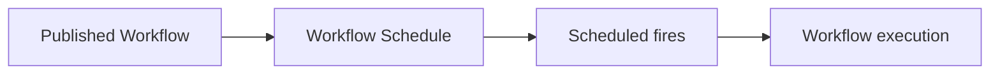

# Workflow Schedule vNext Design Specification

**Status:** Design baseline for frontend implementation

**Backend authority:** [Issue #3446](https://github.com/aevatarAI/aevatar/issues/3446)
and the workflow-scoped Schedule facade merged by PR #3451.

**Existing-Schedule management extension:**
[Workflow Schedule Management and History Design Specification](./2026-08-21-workflow-schedule-history-design.md).
The extension is normative for Overview, History, edit navigation, action
hierarchy, and the handoff to filtered Activity.

## Product Decision

The previous design implied that a Workflow Schedule was a Team member
automation requiring a separate authorization review. The backend and the pure
Workflow product model define something else: a recurring Schedule is a child
resource of one Workflow, addressed by exact `scopeId + workflowId`.

The corrected model is:



- Workflow owns Schedule configuration, list, detail, and mutations.
- Schedule is not a Workflow graph node, Run-dialog mode, global setting, or
  Team member automation.
- Team Automation remains a separate Team/Member product resource.
- Activity remains the separate owner of actual Run history and Run detail.
  Schedule History owns only bounded recent attempts and provides a secondary
  `View related runs in Activity` handoff with exact Workflow and Schedule
  filters. A recent attempt may also open its exact Activity Run when the
  backend fire record contains a non-empty `runActorId`. Any attempt without
  that authoritative identity remains non-interactive; the row must not reuse
  the Schedule-wide Activity handoff or guess a Run destination.

## Identity Boundary

The frontend Schedule resource needs only:

```text
scopeId
workflowId
scheduleId
```

`scopeId + workflowId` select the exact Schedule collection.
`scheduleId` selects one resource inside that collection.

The frontend must not require or infer `teamId`, `memberId`, or
`publishedServiceId` for this flow. The backend resolves the published
service, service endpoint, active revision, and authenticated NyxID owner
binding behind the Workflow facade.

At the API boundary, the frontend normalizes the Workflow facade's
`runActorId` and the scheduled-dispatch transport's `targetActorId` into one
product-semantic `runActorId`. Both fields carry the same authoritative target
Run actor identity in this response boundary. UI components must not branch on
the transport field name or expose `targetActorId` as a second identity.

Draft, unpublished, or not-ready Workflows show an unavailable validation
state. They never fall back to Team Automation.

## Information Architecture

### Workflows Catalogue

Each published Workflow row exposes `Schedules` beside `Run` and `Open`.
The action opens a management modal over the current list. It is the durable
place to see every Schedule owned by that Workflow and provides `New schedule`
for creation without navigating into the editor.

The collection container has one resource-owned title:
`Schedules for {workflowName}`. Its content toolbar contains only Refresh and
`New schedule`; it does not repeat `Schedules` or add a generic subtitle that
paraphrases the same Workflow ownership. A nested title remains appropriate
only for a distinct state such as `No schedules yet` or a different task such
as `Edit schedule`.

Draft and unavailable Workflows keep the action disabled and explain that the
Workflow must be saved and published.

### Workflow Editor

`Schedule` appears beside `Run` in the editor header. It opens the existing
right-side surface while preserving the canvas. The panel contains:

- a list of Schedules returned for this Workflow;
- the same new-Schedule flow used by the catalogue modal;
- Schedule detail and editing;
- enable or disable, run-now, and delete actions.

The modal and panel are two containers for one state machine, not two resource
models.

## Creation Flow

The shared creation flow is:

```text
configure -> previewing -> review -> create -> toast -> refresh list/detail
```

### Configure

The primary form order is:

| UI field | API field | Behavior |
| --- | --- | --- |
| Schedule name | `displayName` | Editable and required |
| Repeat + time | `cronExpression` | Common recurring rules use the human builder |
| Raw cron | `cronExpression` | Opens only through `write it as cron instead` |
| Time zone | `timezone` | Browser IANA zone with `UTC` fallback |
| Prompt | `prompt` | Optional; empty means no fixed prompt |
| Enabled after creation | `enabled` | Explicit create request state |

The configure surface keeps only user-actionable labels. The workflow identity
strip shows the exact workflow name and publication state without a generic
category banner. Run input is labeled directly, and the enabled switch sits
beside it without a separate explanatory section. Backend implementation notes
such as where preview times are calculated are not shown in the product UI.

`headers` is supported by the API but is not a primary first-release field.
The UI can add it later under an advanced surface without changing the core
flow.

The first release supports recurring five-field cron only. It does not expose
one-shot fields even if lower layers contain them.

The human repeat builder covers the recurring presets users commonly need:

- Every hour (at minute `0` of each hour)
- Every day (with a time)
- Weekdays (with a time)
- Every week (with a weekday and time)
- Every month (with a day of month and time)

Weekly and monthly selections are still serialized as ordinary five-field cron
expressions. More advanced expressions remain available through the explicit
`write it as cron instead` disclosure. The two input modes are mutually
exclusive: raw Cron mode replaces the Repeat, weekday/day-of-month, and Time
controls with Cron expression while keeping Time zone editable. Returning to
the repeat builder restores the human-readable controls from the Cron value.

### Preview

`Review schedule` validates the local form and calls:

```text
POST /api/scopes/{scopeId}/workflows/{workflowId}/schedules/preview
```

The request contains `cronExpression`, `timezone`, and `count: 5`. The
browser never calculates future fire times. A preview error returns the user
to the form with the invalid field still editable.

### Review

Review is a normal creation confirmation, not an authorization screen. It
shows:

- Workflow name;
- Schedule name;
- recurrence and timezone;
- optional prompt;
- enabled-after-creation state;
- five fire times returned by preview.

No Team/Member identity, service identity, node grant, LLM selection,
credential, permission digest, or policy version appears.

`Create schedule` calls:

```text
POST /api/scopes/{scopeId}/workflows/{workflowId}/schedules
```

with:

```json
{
  "displayName": "Weekly feedback report recurring work",
  "cronExpression": "0 9 * * 1-5",
  "timezone": "Asia/Shanghai",
  "enabled": true,
  "prompt": ""
}
```

### Create acknowledgement

Create returns `202 Accepted` and a mutation receipt. The UI must not claim
Active, next fire, or final state from the command response. The catalogue
modal closes immediately and shows a non-blocking Toast saying that the
request was accepted and will appear in the list shortly. The editor panel
returns to the Schedule list and shows the same Toast.

The Workflow-scoped list continues refreshing while the panel remains open;
the next list mount also refetches, so the read model remains the authority for
the created Schedule. No second accepted-state modal is needed.

## Existing Schedule Management

The list and detail surfaces use:

```text
GET /api/scopes/{scopeId}/workflows/{workflowId}/schedules
GET /api/scopes/{scopeId}/workflows/{workflowId}/schedules/{scheduleId}
```

The UI may present only typed response facts, including:

- display name, cron expression, timezone, enabled state, and prompt;
- next and last fire;
- last error and error code;
- fire and failure counts;
- recent fires;
- a per-attempt exact Run destination only when `runActorId` is non-empty;
- a separate Workflow + Schedule filtered Activity handoff for the Schedule as
  a whole;
- service revision only when useful as secondary diagnostics.

Low-level service, actor, command, correlation, credential, or Team fields do
not belong in the primary product UI.

Selecting an existing Schedule opens its read-only Overview before editing.
Overview and History are sibling tabs in one stable management surface.
Overview owns configuration and observed status; History renders the returned
`recentFires` as bounded recent attempts in newest-first order. Loading, empty,
request-failure, and failed-attempt states remain distinct. The focused
management and History specification linked above defines the exact layout,
copy, action hierarchy, diagnostics disclosure, and Activity handoff.

### Edit

`Change schedule` enters the editable configuration from the observed detail.
Cancel returns to that Schedule detail rather than closing the management
surface or skipping back to the collection. Edit hydrates the observed
Schedule values and sends a full replacement:

```text
PUT /api/scopes/{scopeId}/workflows/{workflowId}/schedules/{scheduleId}
```

The request must preserve the observed `enabled` value. Editing cadence or
prompt on a paused Schedule must not enable it accidentally.

The update response is `202 Accepted`; the detail remains pending until a
refresh observes the new state.

### Lifecycle Actions

| Action | Existing endpoint | UI rule |
| --- | --- | --- |
| Enable | `POST .../{scheduleId}:enable` | Show pending, then refresh |
| Disable | `POST .../{scheduleId}:disable` | Show pending, then refresh |
| Run now | `POST .../{scheduleId}:run-now` | Confirm external effects, then refresh |
| Delete | `DELETE .../{scheduleId}` | Confirm, then remove only after refresh |

All four return accepted receipts. The UI does not optimistically mutate
authoritative Schedule state.

There is no `Review and reauthorize` action because the Workflow Schedule API
does not expose or require an authorization-preflight lifecycle.

## API Compatibility

The existing backend covers every required first-release interaction:

| Screen or behavior | Backend support |
| --- | --- |
| Workflow Schedule list | Workflow-scoped `GET` collection |
| Five-fire preview | Workflow-scoped `POST .../preview` |
| Create | Workflow-scoped `POST`, `202 Accepted` |
| Accepted observation | Collection/detail `GET` |
| Detail | Workflow-scoped detail `GET` |
| Edit | Workflow-scoped `PUT`, `202 Accepted` |
| Enable/disable | Colon action routes |
| Run now | Colon action route |
| Delete | Workflow-scoped `DELETE`, `202 Accepted` |

No backend contract gap remains for this design, so issue #3446 does not need
an additional comment.

## Standalone Review Artifacts

The deterministic Schedule source contains exactly seven independently useful
`1440x900` scenes:

1. `schedule-workflows-list-modal.png`
2. `schedule-workflow-editor-panel.png`
3. `schedule-review.png`
4. `schedule-creation-pending.png`
5. `schedule-detail.png` (Overview)
6. `schedule-history.png`
7. `schedule-edit.png`

There is no contact sheet, combined overview, Schedule-specific Activity
frame, or authorization review image.

## Verification Contract

- The baseline verifier rejects Team/Member, generic Schedule API,
  authorization-preflight, credential, grant, policy, and reauthorization
  terms in the Schedule area.
- The verifier requires all Workflow-scoped collection, detail, mutation, and
  action routes.
- The prototype must key fixtures by exact `scopeId + workflowId`.
- The prototype must preserve observed `enabled` on update and refresh after
  every accepted mutation.
- The generator, Excalidraw, renderer, and seven PNGs must be deterministic and
  source-linked.
- Focused frontend checks are local; the full suite and build remain delegated
  to GitHub CI.
