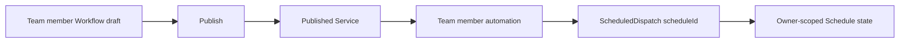

# Workflow Schedule vNext Design

## Status

Design direction approved for review on 2026-08-11 and corrected on
2026-08-18 after comparing the design with the existing Aevatar scheduled
workflow implementation. This document defines a published-workflow Schedule
surface that reuses the existing Team member automation and
`ScheduledDispatch` contracts. Activity is outside this supplement's product
scope.

Implementation branch: `feat/2026-08-11_workflow-schedule-design`.

Baseline branch: `feat/2026-08-04_workflow-activity-vnext` at
`a6602edc006dab1cd944cf029f7f99fea4c504cd`.

## Problem

The previous Schedule board mixed configuration screens, Activity evidence,
component inventories, and a runtime reference into one nine-frame overview.
That made the deliverable hard to review and implied a product relationship
between Schedule configuration and Activity that this surface does not need.

The runtime model is different. Current scheduled workflow and Team automation
already uses `ScheduledDispatchGAgent` plus workflow or Team service
invocation. The Studio-facing product surface is Team member automation, rooted
at the canonical Team member route. A Workflow Schedule is therefore not a new
frontend scheduler, draft property, graph node, Run mode, or standalone service
collection. It is the Workflow editor's contextual entry into the same member
automation capability.

## Semantic Decision

Schedule is a contextual execution source owned by an existing Team member
automation and backed by `ScheduledDispatch`. The Workflow editor may provide
an inline configuration surface for the current member workflow, while the Team
Automations tab remains the full management surface. This design does not add
an Activity entry, Activity filter, Schedule-to-Run navigation, or Activity
state to the Schedule workflow.



`Run` remains the sole manual execution action. `Schedule` is a separate
background schedule entry configuration, not a mode inside the Run dialog.

### Identity Boundaries

The schedule owner is the canonical Team member route:

```text
scopeId + teamId + memberId
```

The schedule target is the exact published service and revision already
returned by the member workflow/publishing contract:

```text
scopeId
teamId
memberId
workflowId
activeRevisionId
publishedServiceId
```

`workflowId`, `memberId`, and `publishedServiceId` are separate identities.
The UI must not infer `teamId` or `memberId` from a workflow, service ID,
display name, string prefix, or route segment position. If the current Workflow
surface does not have an authoritative Team member owner, it must not create a
Schedule. It may only show an unavailable state or navigate to a canonical Team
member surface once the owner is known.

## Information Architecture

### Entry And Placement

- The Workflows catalogue exposes `Schedule` on each published Workflow row.
  Clicking that row action opens a `New schedule` modal in place, keeps the
  catalogue visible behind it, and starts at cadence configuration. It does
  not navigate to the Workflow editor. The modal and editor panel render the
  same creation state machine in different containers.
- The Workflow Editor header exposes `Schedule` immediately beside `Run`.
- On a draft or a Workflow without an authoritative `teamId`, `memberId`, or
  `publishedServiceId`, the action is disabled with `Publish this workflow
  before scheduling it.` or `Open the Team member workflow before scheduling
  it.` as its explanation.
- When local draft changes are newer than the published revision, the action
  remains disabled with `Save and publish the latest changes before scheduling.`
- When a publish command is accepted but the published target is not yet
  readable, the action remains disabled with `Wait for the published revision
  to become available.`
- On a published Team member Workflow, `Schedule` opens a right panel while
  preserving the canvas. This panel is a compact entry into the same Team
  automation capability exposed at
  `/scopes/:scopeId/teams/:teamId/members/:memberId/automations`; it is not a
  route-level Settings page and not a modal Run option.
- The catalogue modal is a quick-create path only. After creation, existing
  Schedule management remains in the Workflow editor panel; the modal does not
  become a second list or detail surface.
- The modal starts with an empty optional prompt and the browser's valid IANA
  timezone, falling back to `UTC`. Its primary `Repeat` builder follows the
  supplied Schedule wireframe: users choose a human repeat rule, time, and
  timezone, then review a plain-language summary. Raw cron is not a default
  labelled form field. `write it as cron instead` explicitly opens the
  five-field cron editor, while a muted generated cron remains available for
  inspection and copying.
- The repeat builder and raw cron editor are one lossless model. Selecting or
  changing a common repeat rule composes the exact cron sent to the server. A
  complex cron that cannot be represented by the builder reopens in raw-cron
  mode and must never be rounded to the nearest preset.
- `Review authorization` first sends the exact cron and timezone to
  `/api/schedules/preview`, then requests the owner-scoped member automation
  preflight. The browser never fabricates next-fire timestamps or derives
  permissions from editable canvas steps. Authorization renders the exact
  server-returned plan: service and node grants, owner LLM selection, credential
  scopes and expiry, disclosures, permission digest, and policy version.
- `Confirm and create` sends a command. The modal presents `202 Accepted` and
  remains pending. The command confirms the reviewed `permissionDigest` and
  `policyVersion`; it does not add an enabled automation, claim a credential,
  say the Schedule is active, or show a next fire until the owner-scoped member
  automation read model returns the new state.
- Schedule list, detail, cadence editing, authorization review, pause, resume,
  run-now, and delete remain Workflow-owned operations. No Activity UI is part
  of this Schedule supplement.
- The header may show a compact, non-interactive state badge such as
  `1 schedule` or `Next Tue 09:00` only after a scoped schedule read model has
  returned it. The action keeps the stable label `Schedule`.
- The Workflows catalogue may show a one-line secondary summary for a
  published Workflow, for example `Scheduled · next Tue 09:00`. It must not
  add a dense new table column and it must disappear when the scoped schedule
  query is unavailable.

### Schedule Panel

The panel is a manager for zero or more existing Team member automations for
one published member workflow. It follows the current `TeamAutomationsTab`
field model and authorization flow. It has three non-overlapping modes:

1. List mode: displays member-owned automations with name, cadence, enabled or
   paused state, authorization state, credential expiry, and next fire. It
   provides `New automation` and `View all automations`.
2. Create mode: renders the same creation state machine used by the catalogue
   modal inside the right panel, preserving the Workflow canvas.
3. Detail mode: edits one observed automation. The selected Team member,
   published service, and pinned published revision are read-only target facts.

The form presents the following fields in this order:

| Field | Product behavior |
| --- | --- |
| Name | User-editable label. The default follows Team Automation copy such as `<member name> recurring work`. |
| Repeat | Primary human builder for hourly, daily, weekday, weekend, and selected-weekday rules, with time and timezone controls. |
| Cron | Secondary escape hatch opened by `write it as cron instead`; complex five-field expressions round-trip without lossy preset conversion. |
| Time zone | Defaults to the browser's valid IANA timezone, otherwise `UTC`; the selected IANA value is sent to the server. |
| Prompt | Optional recurring work prompt, matching the existing Team Automation form. The UI must not make it required unless the invoked service contract explicitly rejects empty input. File attachments are not schedulable. |
| Enabled | Creation can request enabled state, but firing only becomes truthful after authorization and schedule state are observed. |
| Target | Read-only Team member, published service, and pinned `activeRevisionId`; later publishes prompt the user to update deliberately. |
| Preview | Displays the next five fires only from the server preview result. It never estimates time locally. |

An active automation detail presents the real enabled/disabled lifecycle
because pause and resume already exist. It also shows `Next run`, `Last run`,
`Last error`, `Fire count`, `Failure count`, credential status, and credential
expiry only when the automation summary returns those fields. Its actions are
`Run now`, `Pause` or `Resume`, `Save changes`, `Review and reauthorize`, and a
confirmed `Delete automation`.

Create and reauthorize flows must include the existing Dedicated Agent Key
review before mutation. The review must preserve these existing disclosures:
dedicated credential per schedule, Aevatar secret custody, browser never
receives the raw key, delete revokes the credential, pause/resume preserves
the credential, and node IDs are the permission set when required.

`Run now` requires an explicit confirmation whenever the published Workflow
can create external effects. Its accepted receipt does not optimistically
change Schedule state, last-fire data, or next-fire data.

### State Contract

| State | Required presentation | Primary action |
| --- | --- | --- |
| Draft | Disabled header action and publish explanation | Publish |
| Published, no automations | Empty list after the member automation query returns zero records | New automation |
| Editing a new automation | Preview after cadence validation; no optimistic next-run claim | Review authorization |
| Authorization review ready | Dedicated Agent Key review with exact service/node grants | Authorize and continue |
| Credential active and enabled | Green enabled state plus server `nextFireAt` | Pause or Run now |
| Paused | Neutral paused state; no next-run promise | Resume |
| Mutation accepted | Pending treatment while the latest automation state catches up | Wait or Refresh |
| Last dispatch failed | Actual server error summary and count; raw error only inside `Technical details` | Pause, Edit, or Open error |
| Query unavailable | Unavailable state, distinct from empty; never render a sample automation | Retry |

The panel does not label an accepted create, update, enable, disable, or
run-now command as complete. Those commands are `202 Accepted`; the UI waits
for the owner-scoped member automation or schedule query before claiming the
new state.

## Existing Backend Contract

The first implementation boundary already exists. The editor must reuse the
same member automation HTTP surface used by `TeamAutomationsTab`:

```text
POST   /api/scopes/{scopeId}/teams/{teamId}/members/{memberId}/automations/preflight
GET    /api/scopes/{scopeId}/teams/{teamId}/members/{memberId}/automations
POST   /api/scopes/{scopeId}/teams/{teamId}/members/{memberId}/automations
GET    /api/scopes/{scopeId}/teams/{teamId}/members/{memberId}/automations/{scheduleId}
PUT    /api/scopes/{scopeId}/teams/{teamId}/members/{memberId}/automations/{scheduleId}
POST   /api/scopes/{scopeId}/teams/{teamId}/members/{memberId}/automations/{scheduleId}/reauthorize
POST   /api/scopes/{scopeId}/teams/{teamId}/members/{memberId}/automations/{scheduleId}/pause
POST   /api/scopes/{scopeId}/teams/{teamId}/members/{memberId}/automations/{scheduleId}/resume
POST   /api/scopes/{scopeId}/teams/{teamId}/members/{memberId}/automations/{scheduleId}/run-now
DELETE /api/scopes/{scopeId}/teams/{teamId}/members/{memberId}/automations/{scheduleId}
POST   /api/scopes/{scopeId}/teams/{teamId}/members/{memberId}/automations/{scheduleId}/retry-revocation
```

That surface composes with the generic scheduled dispatch capability:

```text
GET    /api/schedules?ownerKind=studio_member_automation&ownerScopeId={scopeId}&ownerTeamId={teamId}&ownerMemberId={memberId}
POST   /api/schedules/preview
```

The editor must not call a global ownerless schedule list and filter in the
browser. The owner is the Team member automation owner, and the target is the
member's published service. Browser-side service-ID filtering is not an
authorization boundary.

The response needs the existing Team Automation fields: `scheduleId`,
`memberId`, `publishedServiceId`, display name, prompt, cron expression,
timezone, enabled state, authorization status, credential expiry,
revocation state, owner LLM route, next and last fire, state version, and
updated time. No Activity contract is required by this Schedule surface.

## First Release Boundaries

The first released product supports recurring five-field cron schedules only.
It does not expose one-shot scheduling even though lower layers have internal
one-shot concepts, because the public HTTP contract does not expose that mode.

It also does not include:

- a browser timer or local persistence pretending to be a scheduler;
- a Schedule graph node;
- a top-level Schedules rail item or a Settings subsection;
- a new Schedule product that bypasses Team Automation endpoints;
- member identity lookup based on workflow/service string guesses;
- client-side filtering of generic ownerless schedules;
- attachment or file payload scheduling;
- a required prompt when the existing Team Automation contract treats prompt as
  optional;
- an Activity entry, Activity filter, or Schedule-to-Run navigation path.

## Visual Baseline Changes

The baseline change keeps the existing Operational Automation Ledger visual
language: dark rail, white work surface, neutral borders, compact rows,
four-to-six-pixel radii, blue actions, and status color used only for state.

- The Schedule source contains six reviewable UI scenes: Workflow catalogue
  quick-create modal, editor-side creation panel, authorization review,
  accepted/pending creation, Workflow-owned Schedule detail, and Workflow-owned
  Schedule editing.
- Workflow-owned screens keep the Workflow canvas visible beside the Schedule
  panel. The Schedule is never drawn as a graph node and no Activity screen is
  included in this supplement.
- The board uses the same dark rail, white work surface, compact rows, neutral
  borders, blue actions, and state-only status colors as the existing baseline.
- The standalone prototype removes the Schedule node-library item and uses a
  right-side Schedule panel as an interaction demonstration only.
- Each of the six Schedule scenes is rendered to its own 1440x900 PNG. There is
  no combined overview PNG.

## Verification

- Regenerate the Excalidraw board from the generator and run the baseline
  verifier so SHA, exact frame inventory, and deterministic output agree.
- Inspect all six standalone 1440x900 PNGs; the verifier binds each image to the
  current Excalidraw source and renderer and rejects obsolete combined PNGs.
- Run documentation lint and `git diff --check`.
- Do not run a full frontend suite, full typecheck, or production build for
  this design-only PR. GitHub CI owns complete validation when runtime code is
  eventually introduced.
