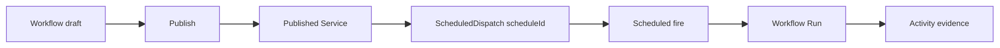

# Workflow Schedule vNext Design

## Status

Design direction approved for review on 2026-08-11. This document extends the
Workflow Activity vNext baseline with a published-workflow schedule surface. It
does not authorize runtime frontend or backend implementation before the scoped
schedule resource contract exists.

Implementation branch: `feat/2026-08-11_workflow-schedule-design`.

Baseline branch: `feat/2026-08-04_workflow-activity-vnext` at
`a6602edc006dab1cd944cf029f7f99fea4c504cd`.

## Problem

The current visual baseline uses Schedule both as a workflow graph node and as
an Activity run origin. That makes the product model ambiguous: a user could
reasonably conclude that schedule configuration is stored in a draft document
or inside a single Run.

The runtime model is different. A schedule is a durable `ScheduledDispatch`
resource with its own `scheduleId`. It invokes an already published Scope
service at recurring times. It is neither a Workflow draft, a graph node, a
Team member automation, nor an Activity Run.

## Semantic Decision

Schedule is a contextual execution trigger owned by a published Workflow's
published service. The editor is its configuration surface, while Activity is
its execution evidence surface.



`Run` remains the sole manual execution action. `Schedule` is a separate
background trigger configuration, not a mode inside the Run dialog.

### Identity Boundaries

The schedule target is the exact `ServiceIdentity` resolved for the published
Workflow:

```text
scopeId + appId=default + namespace=default + publishedServiceId
```

The editor must only use the authoritative published target already recovered
from Workflow detail:

```text
scopeId
workflowId
activeRevisionId
publishedServiceId
```

`workflowId`, `memberId`, and `publishedServiceId` are separate identities.
The UI must not look up, infer, or fabricate `teamId` or `memberId` in order to
create a schedule. Team Automation remains an independently owned feature.

## Information Architecture

### Entry And Placement

- The Workflow Editor header exposes `Schedule` immediately beside `Run`.
- On a draft or a Workflow without an authoritative `publishedServiceId`, the
  action is disabled with `Publish this workflow before scheduling it.` as its
  explanation.
- When local draft changes are newer than the published revision, the action
  remains disabled with `Save and publish the latest changes before scheduling.`
- When a publish command is accepted but the published target is not yet
  readable, the action remains disabled with `Wait for the published revision
  to become available.`
- On a published Workflow, `Schedule` opens a workflow-level right panel while
  preserving the canvas. It is the same presentation layer as Node
  configuration, not a route-level Settings page and not a modal Run option.
- The header may show a compact, non-interactive state badge such as
  `1 schedule` or `Next Tue 09:00` only after a scoped schedule read model has
  returned it. The action keeps the stable label `Schedule`.
- The Workflows catalogue may show a one-line secondary summary for a
  published Workflow, for example `Scheduled · next Tue 09:00`. It must not
  add a dense new table column and it must disappear when the scoped schedule
  query is unavailable.

### Schedule Panel

The panel is a manager for zero or more recurring schedules for one published
service. It has two non-overlapping modes:

1. List mode: displays service-owned schedules with name, cadence, enabled or
   paused state, and next fire. It provides `New schedule` and opens Activity
   with the generic Schedule-origin filter.
2. Detail mode: creates or edits one schedule. The selected published Workflow
   and pinned revision are read-only target facts.

The form presents the following fields in this order:

| Field | Product behavior |
| --- | --- |
| Schedule name | User-editable label. The default is `<workflow name> schedule`. |
| Frequency | Presets for hourly, daily, weekdays, weekly, and expandable custom five-field cron. |
| Time zone | Defaults to the browser's valid IANA timezone, otherwise `UTC`; the selected IANA value is sent to the server. |
| Run input | Required while the callable service rejects an empty chat request. The helper says `This input is sent every time this schedule runs.` File attachments are not schedulable. |
| Revision | Read-only `Pinned to vN`. Creation uses the authoritative `activeRevisionId`; later publishes prompt the user to update the pin deliberately. |
| Next runs | Displays the next five fires only from the server preview result. It never estimates time locally. |

An active schedule detail presents a real enabled/disabled switch because both
transitions exist. It also shows `Next run`, `Last run`, `Last error`,
`Fire count`, and `Failure count` only when the scoped schedule summary returns
those fields. Its actions are `Run now`, `Pause` or `Resume`, `Save changes`,
and a confirmed `Delete schedule`.

`Run now` requires an explicit confirmation whenever the published Workflow
can create external effects. It does not claim that a corresponding Activity
Run already exists.

### State Contract

| State | Required presentation | Primary action |
| --- | --- | --- |
| Draft | Disabled header action and publish explanation | Publish |
| Published, no schedules | Empty list after an authoritative scoped read returns zero records | New schedule |
| Editing a new schedule | Preview after cadence validation; no optimistic next-run claim | Create schedule |
| Enabled | Green enabled state plus server `nextFireAt` | Pause or Run now |
| Paused | Neutral paused state; no next-run promise | Resume |
| Mutation accepted | Pending treatment while the authoritative schedule read model catches up | Wait or Retry read |
| Last dispatch failed | Actual server error summary and count; raw error only inside `Technical details` | Pause, Edit, or Open error |
| Scoped query unavailable | Unavailable state, distinct from empty; never render a sample schedule | Retry |

The panel does not label an accepted create, update, enable, disable, or
run-now command as complete. Those commands are `202 Accepted`; the UI waits
for the relevant read model before claiming the new state or a new run.

## Activity And Run Detail

- Activity retains `Schedule` as a generic Run-source filter.
- Opening Activity from the schedule panel can combine the current Workflow
  filter with `origin=schedule`, and must label the result `Scheduled runs`.
  It must not claim that every row belongs to one named schedule until a
  server-scoped schedule-to-run relationship query exists.
- Run detail may render `Started by schedule` plus a cadence or schedule name
  only when those facts are returned by the authoritative Run detail contract.
- A failed scheduled Run stays an immutable Activity record. It is not an
  editable schedule failure, and retrying a Run never mutates the schedule.
- A schedule panel must not include a deep `View run` link for an individual
  fire until the read model returns an authoritative `runId` relationship.

## Required Backend Contract

The existing generic creation payload can construct a direct Workflow schedule,
but generic list, get, and action routes do not scope ownerless schedules by
both Scope and published service. The frontend must not call a global schedule
list and client-filter it.

The runtime implementation requires a typed, server-authorized resource such
as:

```text
GET    /api/scopes/{scopeId}/services/{publishedServiceId}/schedules
POST   /api/scopes/{scopeId}/services/{publishedServiceId}/schedules
GET    /api/scopes/{scopeId}/services/{publishedServiceId}/schedules/{scheduleId}
PUT    /api/scopes/{scopeId}/services/{publishedServiceId}/schedules/{scheduleId}
POST   /api/scopes/{scopeId}/services/{publishedServiceId}/schedules/{scheduleId}:enable
POST   /api/scopes/{scopeId}/services/{publishedServiceId}/schedules/{scheduleId}:disable
POST   /api/scopes/{scopeId}/services/{publishedServiceId}/schedules/{scheduleId}:run-now
DELETE /api/scopes/{scopeId}/services/{publishedServiceId}/schedules/{scheduleId}
POST   /api/scopes/{scopeId}/services/{publishedServiceId}/schedules:preview
```

The server resolves the published service identity and authorizes the schedule
as a child of that Scope service. It does not trust a client-side service ID
filter as an ownership check.

The scoped response needs a stable `scheduleId`, `publishedServiceId`, pinned
`revisionId`, display name, cron expression, timezone, enabled state, next and
last fire, last error, fire and failure counts, and recent fires. A later exact
schedule-run query may extend the resource, but it is not a first-release
prerequisite.

## First Release Boundaries

The first released product supports recurring five-field cron schedules only.
It does not expose one-shot scheduling even though lower layers have internal
one-shot concepts, because the public HTTP contract does not expose that mode.

It also does not include:

- a browser timer or local persistence pretending to be a scheduler;
- a Schedule graph node;
- a top-level Schedules rail item or a Settings subsection;
- Team Automation endpoints or member identity lookup;
- client-side filtering of generic ownerless schedules;
- attachment or file payload scheduling;
- a no-input schedule until the published service explicitly accepts empty
  chat requests;
- an exact schedule-name Activity filter before a server-owned contract exists.

## Visual Baseline Changes

The baseline change keeps the existing Operational Automation Ledger visual
language: dark rail, white work surface, neutral borders, compact rows,
four-to-six-pixel radii, blue actions, and status color used only for state.

- Frame 01 gains a compact schedule summary in a published Workflow's
  secondary line, not a new column.
- Frames 03 through 06 remove Schedule graph nodes and add the disabled
  editor-level Schedule action.
- Frames 07 and 08 show the same stable editor action row without conflating
  Schedule and the manual Run dialog.
- Frames 09 through 13 retain Schedule origin as execution evidence and make
  any schedule-specific detail conditional on authoritative response fields.
- Frame 18 is added as `18 Schedule - published workflow configuration`. It
  demonstrates list/detail context, cadence, timezone, required input, pinned
  revision, server preview, enabled state, next run, and failure recovery
  without implying a global list or client-owned scheduler.
- The standalone prototype removes the Schedule node-library item and uses a
  right-side Schedule panel as an interaction demonstration only.

## Verification

- Regenerate the Excalidraw board from the generator and run the baseline
  verifier so SHA, exact frame inventory, and deterministic output agree.
- Inspect the new rendered schedule reference at desktop and mobile widths.
- Run documentation lint and `git diff --check`.
- Do not run a full frontend suite, full typecheck, or production build for
  this design-only PR. GitHub CI owns complete validation when runtime code is
  eventually introduced.
