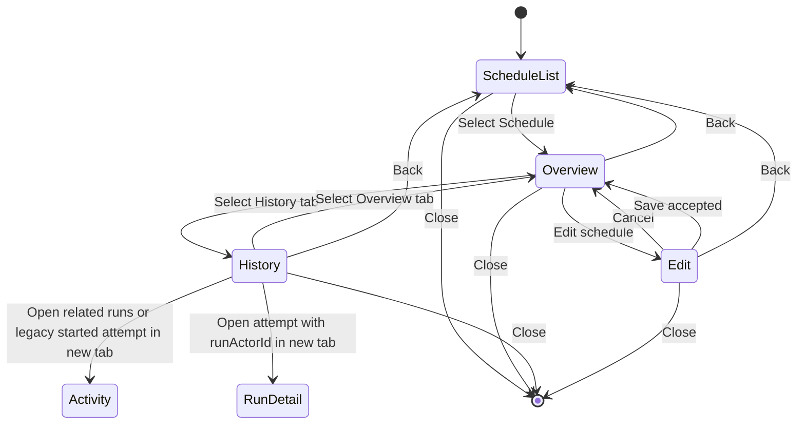

# Workflow Schedule Management and History Design Specification

**Status:** Approved for implementation

**Extends:**
[Workflow Schedule vNext Design Specification](./2026-08-11-workflow-schedule-design.md)

**Backend authority:** [Issue #3446](https://github.com/aevatarAI/aevatar/issues/3446),
the Workflow-scoped Schedule facade, and the Schedule detail `recentFires`
contract on `feature/integrate`.

## Product Decision

An existing Schedule has one management surface with two sibling views:

```text
Schedule management
  Overview   configuration and current observed state
  History    bounded recent Schedule attempts
```

This surface does not replace Activity. The product owns three related but
different records:

| Surface | Fact it owns | Source |
| --- | --- | --- |
| Schedule Overview | Recurrence configuration and current observed state | Workflow Schedule detail |
| Schedule History | Bounded recent trigger attempts | Schedule detail `recentFires` |
| Activity | Actual observed Workflow Runs and Run detail | Activity read model |

A Schedule attempt can fail before a Workflow Run exists. For that reason,
the UI must call `recentFires` **attempts**, must not promise complete Run
history, and must not derive or guess a Run URL from command, correlation, or
idempotency identifiers. The backend fire record's non-empty `runActorId` is
the only authoritative per-attempt Run destination.

## User Jobs

The management surface supports four explicit jobs without mixing them into
one long form:

1. Understand whether the Schedule is active and when it will try next.
2. Inspect or change its recurrence and optional Run input.
3. Inspect recent Schedule attempts, including failures before Run creation.
4. Continue to Activity when the user needs the resulting Workflow Runs.

Raw backend diagnostics, accepted-command implementation notes, and resource
identifiers are not primary user jobs.

## Information Architecture

### Entry points

The same state model is used in both existing containers:

- Workflows catalogue: `Schedules` opens the Workflow's Schedule management
  modal.
- Workflow editor: `Schedules` opens the right-side Schedule management panel
  without hiding the canvas.

Both containers start on the Schedule collection. Selecting a Schedule opens
its Overview. Neither container navigates through Activity to manage a
Schedule.

### Schedule collection

Each row shows only the facts needed to choose a Schedule:

- Schedule name;
- Enabled or Paused status;
- human-readable recurrence and timezone;
- next scheduled time, or `No upcoming attempt` when paused or unavailable.

The row is the single selection target. Lifecycle and edit buttons do not
repeat on every collection row. `New schedule` remains the primary collection
action.

### Selected Schedule header

The back/close structure and resource context are stable across Overview,
History, and Edit. The History task uses an explicit task title:

```text
[Back]  Schedule history · Morning digest · Weekly Feedback Report  [Close]
```

- Back returns to the Schedule collection inside the current container.
- Close exits the entire Schedule management modal or panel.
- History keeps `Schedule history`, the selected Schedule, and the owning
  Workflow on one line. Long resource names truncate rather than increasing
  the header height, while accessible labels and title text retain the full
  context.
- Overview and Edit may retain the selected Schedule name as the primary title
  while keeping the Workflow as secondary context.
- There is no footer-level `Back to schedules` action.

Back and Close are separate controls because they produce different state
transitions. Their accessible names are `Back to schedules` and
`Close schedules`.

### Tabs

Overview and History are a two-item tab list immediately below the header.
Overview is selected every time the user newly selects a Schedule. Tab state
may persist while that Schedule stays selected, but must not leak to a
different Schedule.

The tab list supports normal keyboard tab semantics:

- `Tab` focuses the active tab;
- Left/Right move between tabs;
- `Home` and `End` select the first and last tab;
- each tab owns one labelled tab panel.

Edit is not a third tab. It is a temporary mutation mode entered from
Overview and returns to Overview after Cancel or an observed successful
update.

## Overview

### Primary content

Overview is read-only and follows this order:

1. Status and recurrence summary.
2. Next scheduled time.
3. Timezone.
4. Last attempt.
5. Total attempts and failed attempts.
6. Run input, only when non-empty.
7. Collapsed Advanced details containing the raw cron expression.

The human-readable recurrence is primary, for example:

```text
Every weekday at 09:00
```

The raw value `0 9 * * 1-5` is diagnostic configuration and stays under
`Advanced details`. Overview does not repeat a large blue Workflow context
strip or an empty `No prompt` field.

Dates and times use the current application locale and the Schedule timezone.
They must not use an independent browser-locale formatter that can create a
mixed-language surface.

### Actions

Overview exposes this hierarchy:

```text
[Run now]  [Edit schedule]  [More]
                                Pause / Enable
                                Delete schedule
```

- `Run now` is a direct command. Its accepted response is acknowledged by
  Toast; observed attempt state still comes from Schedule detail.
- `Edit schedule` enters Edit mode with the observed values.
- `Pause` or `Enable` is inside More and reflects the observed current state.
- `Delete schedule` is inside More, visually destructive, and requires a
  confirmation dialog naming the Schedule.

Pause/Enable and Delete must not have equal visual weight with Run now or Edit
schedule. Accepted mutations must not optimistically rewrite authoritative
Schedule state.

### Pending state

When a mutation returns `202 Accepted`, keep the selected Schedule visible,
disable only conflicting mutations, and show a compact inline pending message
or Toast. Refresh the exact Workflow-scoped list/detail until the observed
state changes. Do not show backend implementation narration such as
`Observed Schedule state only` or `Waiting for the Workflow list to confirm`.

## History

### Meaning

The tab title is `History`; its content heading is `Recent attempts`. It shows
the bounded `recentFires` returned by the exact Schedule detail endpoint in
newest-first order.

It is not a lifetime audit log and is not labelled `Runs`, `Run history`, or
`All history`.

### Row model

History uses one compact table or table-like list. Each attempt exposes:

| UI column | Backend source | Presentation |
| --- | --- | --- |
| Scheduled time | `scheduledFireAt` | Application locale in Schedule timezone |
| Source | `manual` | `Manual` when true; otherwise `Scheduled` |
| Result | `error` | `Failed` when non-empty; otherwise `Run started` |
| Completed time | `completedAt` | Application locale in Schedule timezone |
| Action | Authoritative Run destination or valid filtered-Activity fallback | Arrow-only native link; empty when no destination exists |

The table allocates most horizontal space to the two localized timestamp
columns. `Source` remains compact, and `Result` has enough room for a failed
attempt's explanation without becoming the widest column for the common
`Run started` case. `Action` is an independent narrow command column and never
shares a heading or cell with `Completed time`. The reference desktop
proportions are `27 / 14 / 19 / 29 / 11` percent in the column order above.

A failed row adds one concise message below its main row:

```text
The scheduled attempt could not start the Workflow.
```

For a manual attempt, substitute `manual` for `scheduled`. The raw backend
error is available only through an expandable `Technical details` disclosure
inside that row.

Technical details may show the returned error text for support and debugging.
The primary row must not expose:

- service IDs or endpoint IDs;
- actor IDs;
- command or correlation IDs;
- idempotency keys;
- a guessed Run link when `runActorId` is empty;
- a frontend-invented error category based on raw string matching.

`Completed time` always renders only its localized timestamp. When `runActorId`
is non-empty, the separate `Action` cell contains a keyboard-accessible,
arrow-only native Run link. The table row itself is not a scripted link because
it can also contain Technical details. The link opens the existing Activity Run
detail route in a new tab and preserves `workflowId + schedule` in the query so
Back returns to the same filtered Activity context. A successful legacy attempt
with an empty `runActorId` uses the same Action treatment but opens the Workflow
+ Schedule filtered Activity list in a new tab; it must not guess a Run
identity. A pre-Run failure with an empty `runActorId` renders an empty Action
cell and remains non-interactive. Every arrow-only Action link retains a full
accessible name that identifies the attempt and destination.

### Activity handoff

The History tab provides one secondary link:

```text
View related runs in Activity
```

The link is deliberately about related Runs, not all attempts. It is a native
link that opens a new tab and leaves the current Schedule container and History
state intact. It opens:

```text
/scopes/:scopeId/workflow-activity-vnext/activity
  ?workflowId=:workflowId
  &schedule=:scheduleId
```

Activity owns the visible filter context and Run detail. The target view must
make the Workflow and Schedule filters understandable to the user rather than
silently filtering the table. Schedule is an attribution dimension, not a Run
origin, so the handoff must not add `origin=schedule` or show Schedule in the
Activity Source filter. No backend change is required because the Activity
contract already accepts `workflowId` and `scheduleIds` filters.

The filtered Activity request is an idempotent read. It retries one transient
network, timeout, throttling, or server failure before showing the existing
Activity error state. Authentication, authorization, bad-request, and response
contract errors are not retried. The retry does not remove or weaken the
Workflow and Schedule filters.

## Edit

Edit uses the existing human recurrence builder and preserves the selected
Schedule's observed values:

- name;
- repeat preset plus time, or raw cron mode;
- timezone;
- optional Run input;
- observed enabled state in the full update request.

Raw cron mode and the repeat builder are mutually exclusive. When raw cron is
selected, Repeat and Time are hidden and `Cron expression` is shown; timezone
remains visible. Returning to the builder restores the human controls from a
representable cron value.

`Cancel` discards the draft and returns to Overview. `Save changes` sends the
full replacement, shows accepted feedback, and returns to Overview while the
observed detail refreshes. Edit contains no History table or lifecycle action.

## State Model



Using Back from Edit abandons the draft and returns to the collection. If the
form is dirty, the container uses the product's normal unsaved-change
confirmation before discarding it.

## Loading, Empty, and Error States

Schedule-detail loading and History loading are explicit states. They do not
render stale collection summaries as if they were detail data.

| State | Required presentation |
| --- | --- |
| Detail loading | Stable skeleton inside the selected-Schedule shell |
| Detail request error | `Schedule couldn't be loaded` with Retry |
| History loading | Stable row skeleton under `Recent attempts` |
| Successful empty History | `No attempts yet` |
| History request error | `History couldn't be loaded` with Retry |
| Failed attempt | Normal History row with Failed result and Technical details |

A failed attempt is business data, not a History-request error. Refresh and
Retry preserve the selected Schedule and active tab.

## Backend Compatibility

The design uses the existing Workflow-facing contract without additions:

```text
GET /api/scopes/{scopeId}/workflows/{workflowId}/schedules
GET /api/scopes/{scopeId}/workflows/{workflowId}/schedules/{scheduleId}
PUT /api/scopes/{scopeId}/workflows/{workflowId}/schedules/{scheduleId}
POST /api/scopes/{scopeId}/workflows/{workflowId}/schedules/{scheduleId}:enable
POST /api/scopes/{scopeId}/workflows/{workflowId}/schedules/{scheduleId}:disable
POST /api/scopes/{scopeId}/workflows/{workflowId}/schedules/{scheduleId}:run-now
DELETE /api/scopes/{scopeId}/workflows/{workflowId}/schedules/{scheduleId}
```

The Schedule detail provides configuration, counters, current timestamps, and
bounded `recentFires`, including `runActorId` when an attempt created a Run.
Activity already supplies the filtered actual-Run surface and Run detail.
There is no backend issue comment to add for this design.

## Review Artifacts

The deterministic Schedule source contains seven standalone `1440x900`
scenes:

1. `schedule-workflows-list-modal.png`
2. `schedule-workflow-editor-panel.png`
3. `schedule-review.png`
4. `schedule-creation-pending.png`
5. `schedule-detail.png` as the Overview state
6. `schedule-history.png` as the History state
7. `schedule-edit.png`

There is no contact sheet and no Schedule-specific Activity frame. Overview
and History are separate PNGs so each state can be reviewed at readable size.

## Acceptance Criteria

- Selecting a Schedule opens Overview, not an editable form.
- Overview and History are sibling tabs under one stable selected-Schedule
  header.
- Back returns to the collection; Close exits the container.
- Overview uses a human recurrence and hides raw cron under Advanced details.
- Empty optional Run input is omitted.
- Run now and Edit schedule are direct actions; Pause/Enable and Delete live
  under More.
- History renders bounded attempts in a compact list and keeps raw failures
  under Technical details.
- An attempt with a non-empty backend `runActorId` opens that exact Activity
  Run. A successful legacy attempt without one opens filtered Activity without
  guessing identity; a failed attempt without one remains non-interactive.
- `View related runs in Activity` uses exact Workflow and Schedule filters.
- Activity and Run links open in a new tab without closing or navigating the
  current Schedule surface.
- The History title and its Schedule/Workflow context stay on one visual line.
- Schedule is absent from Activity Source filters and no handoff sends
  `origin=schedule`.
- A single transient Activity handoff request failure is retried once; 4xx
  contract errors and response decoding errors are not retried.
- History column widths prioritize localized timestamps and do not let the
  short Result tag dominate successful rows.
- Completed time and Action are separate columns; the time remains plain text
  and only Action contains the trailing navigation link.
- Loading, successful empty, request error, and failed-attempt states remain
  distinct.
- All timestamps follow the application locale and Schedule timezone.
- The implementation requires no backend contract change.
