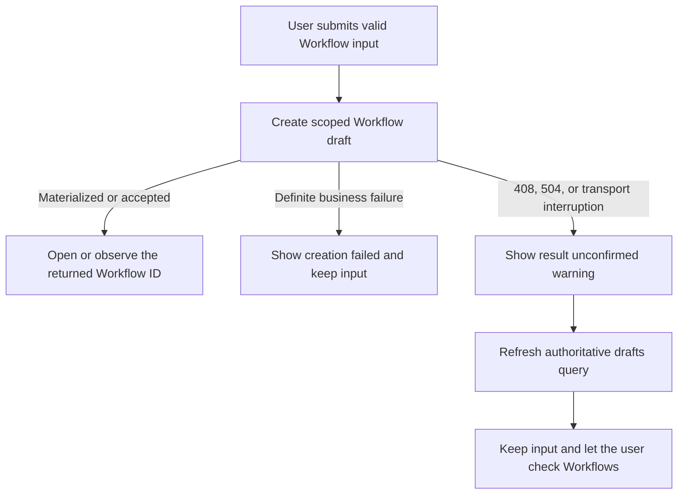

# Workflow Create Result Unknown Design

## Status

Approved for the Workflow Activity vNext frontend on 2026-08-25. This design
clarifies how the creation page reports an interrupted draft-create response;
it does not change backend contracts or creation identity semantics.

## Problem

The draft-create command can be persisted even when its HTTP response times
out. The current page maps every thrown error to `Workflow couldn't be
created`, so it can tell the user to retry after the Workflow already exists.
That feedback is stronger than the evidence available to the frontend and can
lead to duplicate Workflows.

## Product Contract

- HTTP `408`, HTTP `504`, and transport interruption from
  `createWorkflowDraft` mean the creation result is **unconfirmed**.
- An unconfirmed result shows a warning telling the user to check Workflows
  before trying again.
- The page preserves every entered field and does not automatically resubmit
  the create request.
- The page refreshes the authoritative drafts query so the Workflow list can
  reflect a create that completed despite the interrupted response.
- The page never searches the refreshed list to infer a generated
  `workflowId`, and never navigates to a Workflow selected by name, YAML,
  filename, order, or timestamp.
- Generation, YAML parsing, validation, and definite create business failures
  continue to use the existing failure feedback.

## Request-Stage Boundary

Classification is scoped to the `createWorkflowDraft` call. A `504` from
`authorWorkflow` or `parseYaml` is a definite pre-create failure because no
draft-create request has been sent. Keeping the catch at the create boundary
prevents status-code-only handling from changing those earlier stages.

## User Flow

## Copy

English: `Workflow creation couldn't be confirmed. Check Workflows before
trying again.`

Chinese: `无法确认工作流是否已创建，请先返回工作流列表检查，再决定是否重试。`

The warning does not claim that creation succeeded, failed, or remains in
progress.

## Verification Contract

A focused component test must prove that a draft-create timeout:

1. emits the unconfirmed warning instead of the failure toast;
2. preserves the submitted input;
3. sends the create request exactly once;
4. refreshes the drafts query;
5. does not navigate to an inferred Workflow.

The same test suite must retain coverage that failures before draft creation
use the definite failure message.

## Scope

Frontend-only: Workflow Activity vNext creation component, focused tests,
localized copy, and this specification. No backend code, API contract, proxy,
or timeout value changes are included.
