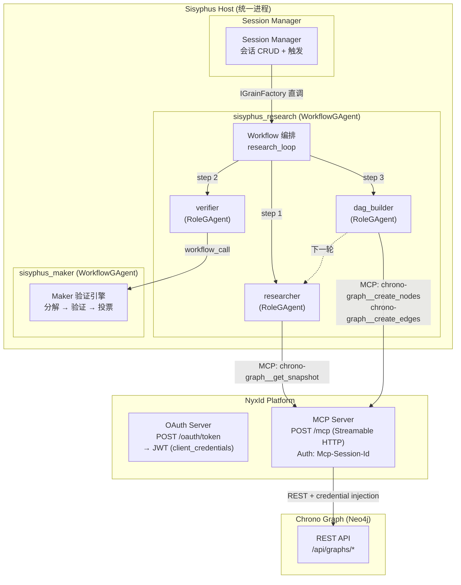
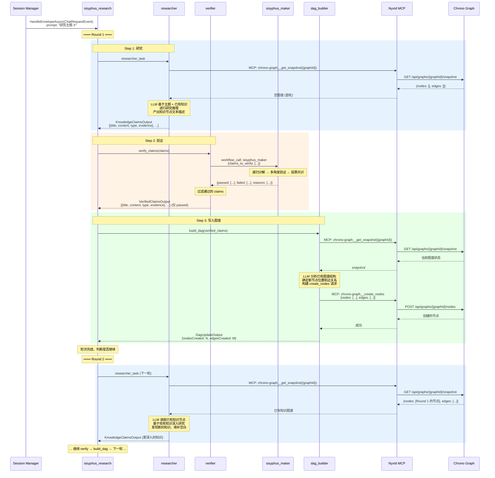
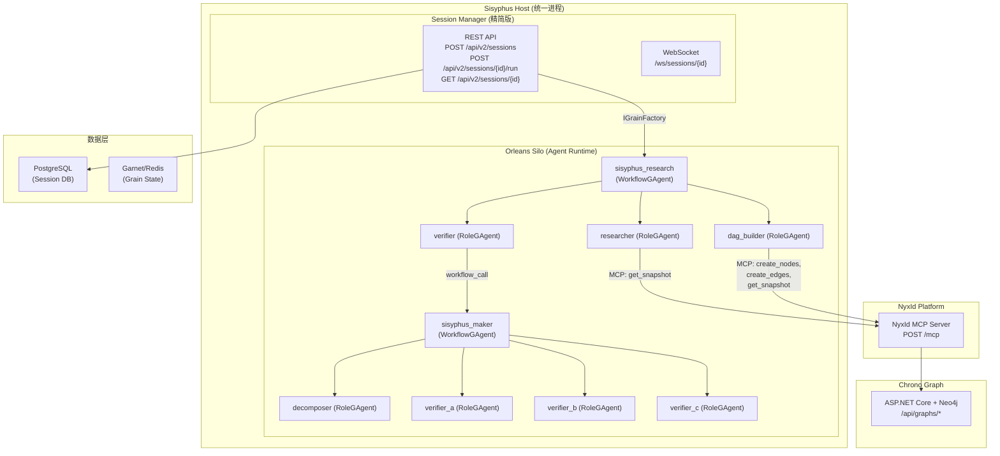

# Sisyphus Alpha 架构设计

> 最小可行研究循环 —— 2 个 WorkflowGAgent + 3 个 RoleGAgent

## 1. 概述

### 1.1 Alpha 目标

Alpha 版本聚焦于跑通**一条最小完整的研究循环**：

```
研究 → 产出知识节点描述 → 验证 → 通过则写入图谱 → 读取图谱 → 深入研究 → ...
```

不做的事情（留给后续版本）：
- 论文编辑 / 交付物管理 / Chrono Storage
- 方向检测 (Pivot) / 目标管理
- 用户中途输入 / 材料上传
- Review 定时器
- 邮件通知
- 前端

### 1.3 框架前置条件：Aevatar MCP HTTP Transport

**当前问题**：Aevatar MCP 客户端 (`Aevatar.AI.ToolProviders.MCP`) 目前只支持 `StdioClientTransport`（本地 stdio 子进程）。NyxId 暴露的是 **Streamable HTTP Transport**（`POST/GET/DELETE /mcp`，JSON-RPC 2.0 over HTTP）。Alpha 之前必须为 Aevatar 框架添加 HTTP MCP Transport 支持。

**需要修改的 Aevatar 框架文件：**

| # | 文件 | 变更 |
|---|------|------|
| 1 | `src/Aevatar.AI.ToolProviders.MCP/MCPServerConfig.cs` | 新增 `Url`、`Headers`、`Auth` 字段，`IsHttp` 判断属性，`AddHttpServer()` 方法 |
| 2 | `src/Aevatar.AI.ToolProviders.MCP/MCPClientManager.cs` | 根据 `config.IsHttp` 分支使用 `SseClientTransport`（HTTP）或 `StdioClientTransport`（stdio） |
| 3 | `src/Aevatar.AI.ToolProviders.MCP/MCPConnector.cs` | `MCPConnectorConfig` 新增 `Url`、`Headers`、`Auth` 字段 |
| 4 | `src/Aevatar.Bootstrap.Extensions.AI/Connectors/MCPConnectorBuilder.cs` | 构建 `MCPServerConfig` 时传递 Url/Auth |

**不需要修改的文件**（transport 无关，已正确抽象）：
- `MCPToolAdapter.cs` — 任何 transport 都适用
- `MCPAgentToolSource.cs` — 委托给 `MCPClientManager`
- Workflow YAML parser — 已支持 connector 引用
- `ConnectorCallModule.cs` — 任何 `IConnector` 都适用

#### MCPServerConfig 扩展

```csharp
public sealed class MCPServerConfig
{
    public required string Name { get; init; }

    // Stdio transport (existing)
    public string? Command { get; init; }
    public string[] Arguments { get; init; } = [];
    public Dictionary<string, string> Environment { get; init; } = [];

    // HTTP transport (new for Alpha)
    public string? Url { get; init; }                          // e.g. "http://localhost:3001/mcp"
    public Dictionary<string, string> Headers { get; init; } = [];  // static headers

    // OAuth client_credentials auth (new for Alpha)
    public MCPAuthConfig? Auth { get; init; }

    public bool IsHttp => !string.IsNullOrEmpty(Url);
}

public sealed class MCPAuthConfig
{
    public string Type { get; init; } = "client_credentials";
    public required string TokenUrl { get; init; }      // e.g. "http://localhost:3001/oauth/token"
    public required string ClientId { get; init; }      // NyxId Service Account ID
    public required string ClientSecret { get; init; }  // NyxId Service Account Secret
    public string? Scope { get; init; }
}
```

#### MCPClientManager HTTP 分支

```csharp
if (config.IsHttp)
{
    var httpClient = new HttpClient();

    // 1. OAuth client_credentials → JWT
    if (config.Auth is { } auth)
    {
        var token = await FetchClientCredentialsTokenAsync(httpClient, auth, ct);
        httpClient.DefaultRequestHeaders.Authorization =
            new AuthenticationHeaderValue("Bearer", token);
    }

    // 2. Static headers
    foreach (var (k, v) in config.Headers)
        httpClient.DefaultRequestHeaders.TryAddWithoutValidation(k, v);

    // 3. SseClientTransport (ModelContextProtocol SDK v0.4.0-preview.3)
    var transport = new SseClientTransport(
        new SseClientTransportOptions { Name = config.Name, Endpoint = new Uri(config.Url!) },
        httpClient);

    client = await McpClient.CreateAsync(transport,
        new McpClientOptions { InitializationTimeout = TimeSpan.FromSeconds(30) }, ct);
}
else
{
    // Existing stdio path (unchanged)
    ...
}
```

#### NyxId MCP 认证流程

```
1. POST /oauth/token
   Body: grant_type=client_credentials & client_id=sa_xxx & client_secret=sas_xxx
   Response: { "access_token": "<jwt>", "expires_in": 2592000, "token_type": "Bearer" }

2. POST /mcp (MCP initialize)
   Headers: Authorization: Bearer <jwt>
   Body: {"jsonrpc":"2.0","method":"initialize","params":{...},"id":1}
   Response Headers: Mcp-Session-Id: <session-id>

3. POST /mcp (后续所有请求)
   Headers: Mcp-Session-Id: <session-id>  (JWT 不再需要，session 有效期 30 天)
   Body: {"jsonrpc":"2.0","method":"tools/call","params":{...},"id":N}
```

### 1.2 核心循环

```
┌──────────────────────────────────────────────────────────────────┐
│  sisyphus_research (WorkflowGAgent)                              │
│                                                                  │
│  ┌─────────────┐    ┌─────────────┐    ┌─────────────┐          │
│  │ researcher   │───→│  verifier   │───→│ dag_builder  │          │
│  │ (RoleGAgent) │    │ (RoleGAgent) │    │ (RoleGAgent) │          │
│  │              │    │              │    │              │          │
│  │ 读取图谱     │    │ 调用 maker   │    │ 写入图谱     │          │
│  │ 深入研究     │    │ 等待验证结果  │    │              │          │
│  │ 产出知识描述  │    │ pass → 转发  │    │              │          │
│  └──────┬───────┘    └──────────────┘    └──────┬───────┘          │
│         │                                       │                 │
│         └───────────── 下一轮 ←──────────────────┘                 │
└──────────────────────────────────────────────────────────────────┘
                              │
                    workflow_call (验证请求)
                              │
                              ▼
              ┌───────────────────────────────┐
              │ sisyphus_maker (WorkflowGAgent) │
              │                               │
              │ 递归分解 → 多角度验证 → 投票共识  │
              │ 返回: pass / fail + 原因       │
              └───────────────────────────────┘
```

---

## 2. Agent 拓扑

### 2.1 两个 WorkflowGAgent

| # | Workflow | 职责 | 触发方式 |
|---|---------|------|---------|
| 1 | `sisyphus_research` | 研究主循环编排 | Session Manager `IGrainFactory` 直调 |
| 2 | `sisyphus_maker` | 通用验证引擎 | research 内部 `workflow_call` |

### 2.2 三个 RoleGAgent（均隶属 sisyphus_research）

| # | Role ID | 名称 | 职责 | MCP Tools (via NyxId) |
|---|---------|------|------|----------------------|
| 1 | `researcher` | 研究员 | 读取图谱现有知识 → 深入研究 → 产出新知识节点的文本描述 | `chrono-graph__get_snapshot` (只读) |
| 2 | `verifier` | 验证员 | 收到知识描述 → 调用 maker 验证 → pass 则转发给 dag_builder | - (通过 workflow_call 调用 maker) |
| 3 | `dag_builder` | 图谱构建员 | 收到已验证的知识描述 → 解析为节点/边 → 写入 Chrono Graph | `chrono-graph__create_nodes`, `chrono-graph__create_edges`, `chrono-graph__get_snapshot` |

### 2.3 拓扑图



---

## 3. 研究循环详细流程

### 3.1 时序图



### 3.2 循环终止条件

Workflow 在每轮结束后判断是否继续：

| 条件 | 动作 |
|------|------|
| 达到 `max_rounds` 上限 | 停止，标记 completed |
| researcher 声明 "no_new_claims" | 停止，研究已饱和 |
| 连续 N 轮 maker 全部 fail | 停止，研究方向可能有问题 |
| 用户中断 (Alpha 暂不实现) | 停止，标记 cancelled |

---

## 4. 三个 RoleGAgent 详细设计

### 4.1 researcher (研究员)

**职责**：读取图谱现有知识 → 基于已有知识深入研究 → 产出新的知识节点文本描述

**MCP Tools**：`chrono-graph__get_snapshot` (只读)

**System Prompt 核心指令**：

```markdown
你是一个科研研究员。你的任务是基于给定的研究主题和已有知识图谱进行深入研究。

## 输入
- research_topic: 研究主题
- existing_knowledge: 当前知识图谱的所有节点（通过 chrono-graph__get_snapshot 读取）

## 工作流程
1. 调用 chrono-graph__get_snapshot 读取当前图谱中所有知识节点
2. 分析已有知识，找出知识空白和可以深入的方向
3. 进行研究推理，产出新的知识主张 (claims)
4. 每个 claim 必须包含：标题、内容描述、类型、支撑证据

## 输出格式 (JSON)
{
  "claims": [
    {
      "title": "知识节点标题",
      "content": "详细描述（含推理过程）",
      "type": "hypothesis | fact | inference | definition",
      "evidence": "支撑证据或推理依据",
      "related_to": ["已有节点 title（如有关联）"]
    }
  ],
  "reasoning_trace": "本轮研究的思考过程",
  "saturation": false  // true 表示已无新知识可产出
}

## 约束
- 每轮产出 1-5 个 claims，质量优先于数量
- 避免重复已有知识节点的内容
- 如果图谱为空（首轮），从主题的基础概念开始
- 如果已无法产出新知识，设置 saturation: true
```

### 4.2 verifier (验证员)

**职责**：收到 researcher 的知识描述 → 调用 sisyphus_maker 验证 → 过滤出通过验证的 claims 转发给 dag_builder

**MCP Tools**：无（通过 workflow_call 调用 maker）

**System Prompt 核心指令**：

```markdown
你是一个知识验证协调员。你负责将研究员产出的知识主张提交给验证引擎。

## 输入
- claims: 研究员产出的知识主张列表

## 工作流程
1. 接收 researcher 的 claims
2. 将 claims 格式化为验证请求
3. 通过 workflow_call 调用 sisyphus_maker 进行验证
4. 收集验证结果
5. 仅转发通过验证的 claims（附带验证通过的理由）
6. 记录未通过的 claims 及失败原因（供下一轮研究参考）

## 输出格式 (JSON)
{
  "verified_claims": [
    {
      "title": "...",
      "content": "...",
      "type": "...",
      "evidence": "...",
      "related_to": ["..."],
      "verification_reason": "验证通过的理由"
    }
  ],
  "rejected_claims": [
    {
      "title": "...",
      "rejection_reason": "未通过的原因"
    }
  ],
  "pass_rate": 0.8
}
```

### 4.3 dag_builder (图谱构建员)

**职责**：收到已验证的知识描述 → 读取当前图谱结构 → 解析为节点和边 → 写入 Chrono Graph

**MCP Tools**：`chrono-graph__get_snapshot`, `chrono-graph__create_nodes`, `chrono-graph__create_edges`

**System Prompt 核心指令**：

```markdown
你是一个知识图谱构建员。你负责将已验证的知识主张转化为图谱节点和边。

## 输入
- verified_claims: 已通过验证的知识主张列表
- graph_id: 目标图谱 ID

## 工作流程
1. 调用 chrono-graph__get_snapshot 读取当前图谱
2. 分析已有节点，确定新节点与已有节点的关系
3. 为每个 verified claim 创建一个节点：
   - type: claim 的 type (hypothesis / fact / inference / definition)
   - properties: {title, content, evidence, verified: true, round: N}
4. 确定边关系：
   - "supports": 新节点支持已有节点
   - "contradicts": 新节点与已有节点矛盾
   - "extends": 新节点扩展已有节点
   - "depends_on": 新节点依赖已有节点
   - "derived_from": 新节点从已有节点推导
5. 调用 chrono-graph__create_nodes 批量创建（可含 inline edges）

## 输出格式 (JSON)
{
  "nodes_created": [
    {"id": "...", "title": "...", "type": "..."}
  ],
  "edges_created": [
    {"source": "...", "target": "...", "type": "..."}
  ],
  "total_nodes": N,
  "total_edges": M
}

## 约束
- 不要创建重复节点（先检查 snapshot 中是否已存在相同 title 的节点）
- 边的方向要准确反映知识之间的逻辑关系
- 如果 claim 的 related_to 中引用了已有节点，必须建立对应的边
```

---

## 5. Workflow YAML 定义

### 5.1 sisyphus_research.yaml

```yaml
name: sisyphus_research
description: Sisyphus Alpha 研究主循环

roles:
  - id: researcher
    name: Researcher
    system_prompt_file: prompts/researcher.md
    connectors:
      - nyxid_mcp                           # 引用 connectors.json 中已注册的 connector
    allowed_tools:                           # 限制此 role 可用的 MCP tool
      - chrono-graph__get_snapshot

  - id: verifier
    name: Verifier
    system_prompt_file: prompts/verifier.md
    # 无 MCP connector —— 通过 workflow_call 调用 maker

  - id: dag_builder
    name: DAG Builder
    system_prompt_file: prompts/dag_builder.md
    connectors:
      - nyxid_mcp
    allowed_tools:
      - chrono-graph__get_snapshot
      - chrono-graph__create_nodes
      - chrono-graph__create_edges

# Connector 在 connectors.json 中统一注册 (见 §8.2)，Workflow YAML 通过名称引用

steps:
  # ── 初始化：用研究主题启动 ──
  - id: init
    type: assign
    parameters:
      round: 1
      max_rounds: ${max_rounds:20}
      research_topic: ${prompt}
      graph_id: ${graph_id}
      consecutive_failures: 0

  # ── 研究循环 ──
  - id: research_loop
    type: while
    condition: round <= max_rounds AND consecutive_failures < 3
    steps:

      # Step 1: researcher 读取图谱 + 研究 + 产出知识描述
      - id: research
        type: llm_call
        role: researcher
        parameters:
          prompt: |
            研究主题: {{research_topic}}
            当前轮次: {{round}} / {{max_rounds}}
            图谱 ID: {{graph_id}}

            请先调用 chrono-graph__get_snapshot 读取当前知识图谱，
            然后基于已有知识进行深入研究，产出新的知识主张。

      # 检查是否饱和
      - id: check_saturation
        type: conditional
        condition: research.output.saturation == true
        if_true:
          - id: mark_saturated
            type: assign
            parameters:
              round: max_rounds + 1    # 跳出循环
        if_false:

          # Step 2: verifier 调用 maker 验证
          - id: verify
            type: llm_call
            role: verifier
            parameters:
              prompt: |
                请验证以下知识主张：
                {{research.output.claims | json}}

                调用 sisyphus_maker 进行验证，然后返回验证结果。

          # 调用 maker workflow
          - id: maker_verify
            type: workflow_call
            workflow: sisyphus_maker
            parameters:
              claims: "{{research.output.claims}}"

          # verifier 整合 maker 结果
          - id: verify_integrate
            type: llm_call
            role: verifier
            parameters:
              prompt: |
                Maker 验证结果：
                {{maker_verify.output | json}}

                原始 claims：
                {{research.output.claims | json}}

                请整合验证结果，输出 verified_claims 和 rejected_claims。

          # 检查是否有通过的 claims
          - id: check_pass
            type: conditional
            condition: verify_integrate.output.verified_claims.length > 0
            if_true:

              # Step 3: dag_builder 写入图谱
              - id: build_dag
                type: llm_call
                role: dag_builder
                parameters:
                  prompt: |
                    图谱 ID: {{graph_id}}
                    已验证的知识主张：
                    {{verify_integrate.output.verified_claims | json}}

                    请先读取当前图谱，然后将这些已验证的知识写入图谱。

              - id: reset_failures
                type: assign
                parameters:
                  consecutive_failures: 0

            if_false:
              - id: increment_failures
                type: assign
                parameters:
                  consecutive_failures: consecutive_failures + 1

          # 递增轮次
          - id: next_round
            type: assign
            parameters:
              round: round + 1

  # ── 循环结束 ──
  - id: finalize
    type: llm_call
    role: researcher
    parameters:
      prompt: |
        研究完成。总共进行了 {{round - 1}} 轮研究。
        请调用 chrono-graph__get_snapshot 读取最终图谱，
        输出研究总结。
```

### 5.2 sisyphus_maker.yaml

```yaml
name: sisyphus_maker
description: 通用知识验证引擎 - 递归分解 + 多角度验证 + 投票共识

roles:
  - id: decomposer
    name: Claim Decomposer
    system_prompt: |
      你是一个验证任务分解器。将每个知识主张分解为可独立验证的子命题。
      输出 JSON: {"sub_claims": [{"id": "...", "content": "...", "parent_claim": "..."}]}

  - id: verifier_a
    name: Verifier A (逻辑一致性)
    system_prompt: |
      你是逻辑一致性验证器。检查命题的内在逻辑是否自洽、有无矛盾。
      输出 JSON: {"claim_id": "...", "pass": true/false, "reason": "..."}

  - id: verifier_b
    name: Verifier B (证据充分性)
    system_prompt: |
      你是证据充分性验证器。检查命题是否有充分的证据支撑。
      输出 JSON: {"claim_id": "...", "pass": true/false, "reason": "..."}

  - id: verifier_c
    name: Verifier C (学术准确性)
    system_prompt: |
      你是学术准确性验证器。检查命题是否符合已知的学术共识和事实。
      输出 JSON: {"claim_id": "...", "pass": true/false, "reason": "..."}

steps:
  # 分解
  - id: decompose
    type: llm_call
    role: decomposer
    parameters:
      prompt: |
        请将以下知识主张分解为可独立验证的子命题：
        {{claims | json}}

  # 并行三角度验证
  - id: parallel_verify
    type: parallel
    steps:
      - id: verify_logic
        type: llm_call
        role: verifier_a
        parameters:
          prompt: "验证逻辑一致性：{{decompose.output.sub_claims | json}}"
      - id: verify_evidence
        type: llm_call
        role: verifier_b
        parameters:
          prompt: "验证证据充分性：{{decompose.output.sub_claims | json}}"
      - id: verify_accuracy
        type: llm_call
        role: verifier_c
        parameters:
          prompt: "验证学术准确性：{{decompose.output.sub_claims | json}}"

  # 投票共识 (2/3 通过)
  - id: consensus
    type: vote_consensus
    parameters:
      votes:
        - "{{verify_logic.output}}"
        - "{{verify_evidence.output}}"
        - "{{verify_accuracy.output}}"
      quorum: 0.67    # 2/3 通过即可
```

---

## 6. 系统架构

### 6.1 整体架构



### 6.2 Alpha 精简 Session Manager

Alpha 版只需要最基本的 Session Manager 能力：

| 功能 | Alpha 状态 |
|------|-----------|
| 会话 CRUD | ✅ 保留 |
| Workflow 触发 (IGrainFactory 直调) | ✅ 保留 |
| Orleans Stream → WebSocket 推送 | ✅ 保留 |
| 中断处理 | ✅ 保留 |
| Chrono Graph 资源初始化/清理 | ✅ 保留（创建/删除 Graph） |
| Agent Provider 配置 | ✅ 保留（简化版） |
| Projection 查询 | ✅ 保留 |
| 材料上传 | ❌ 不实现 |
| Review 定时器 | ❌ 不实现 |
| 邮件通知 | ❌ 不实现 |
| 用户中途输入 | ❌ 不实现 |
| Chrono Storage 集成 | ❌ 不实现 |
| Chrono Notification 集成 | ❌ 不实现 |

### 6.3 Alpha API

```
POST   /api/v2/sessions                    创建研究会话 (含 Graph 初始化)
GET    /api/v2/sessions                    列表
GET    /api/v2/sessions/{sessionId}        详情
DELETE /api/v2/sessions/{sessionId}        删除 (含 Graph 清理)
POST   /api/v2/sessions/{sessionId}/run     触发研究
POST   /api/v2/sessions/{sessionId}/interrupt  中断
GET    /api/v2/sessions/{sessionId}/snapshot    Workflow 状态
GET    /ws/sessions/{sessionId}            WebSocket 实时事件
```

---

## 7. 数据流

### 7.1 知识节点数据流

```
researcher                 verifier                  dag_builder
    │                          │                          │
    │  KnowledgeClaimsOutput   │                          │
    │  [{                      │                          │
    │    title: "X 机制",       │                          │
    │    content: "...",       │                          │
    │    type: "hypothesis",   │                          │
    │    evidence: "...",      │                          │
    │    related_to: [...]     │                          │
    │  }, ...]                 │                          │
    │─────────────────────────→│                          │
    │                          │                          │
    │                          │  workflow_call → maker    │
    │                          │  {pass/fail + reasons}   │
    │                          │                          │
    │                          │  VerifiedClaimsOutput    │
    │                          │  (仅 passed claims)      │
    │                          │─────────────────────────→│
    │                          │                          │
    │                          │                          │  MCP: create_nodes
    │                          │                          │  [{
    │                          │                          │    type: "hypothesis",
    │                          │                          │    properties: {
    │                          │                          │      title: "X 机制",
    │                          │                          │      content: "...",
    │                          │                          │      evidence: "...",
    │                          │                          │      verified: true,
    │                          │                          │      round: 1
    │                          │                          │    }
    │                          │                          │  }]
    │                          │                          │  + edges (inline)
    │                          │                          │──→ Chrono Graph
```

### 7.2 图谱节点 Schema

```
Node Types:
├── hypothesis   — 假说 (待进一步验证)
├── fact         — 已确认事实
├── inference    — 推理结论
└── definition   — 定义/概念

Node Properties:
├── title        — 标题
├── content      — 详细描述
├── evidence     — 支撑证据
├── verified     — 是否通过 maker 验证 (always true in Alpha)
├── round        — 产出轮次
└── created_at   — 创建时间

Edge Types:
├── supports     — A 支持 B
├── contradicts  — A 与 B 矛盾
├── extends      — A 扩展 B
├── depends_on   — A 依赖 B
└── derived_from — A 从 B 推导
```

---

## 8. NyxId MCP 连接

### 8.1 Alpha 使用的 MCP Tools

Alpha 只需要 Chrono Graph 的 MCP Tool，不需要 Storage 和 Notification：

| MCP Tool Name | 对应 REST Endpoint | 使用者 | 说明 |
|---------------|-------------------|--------|------|
| `chrono-graph__get_snapshot` | `GET /api/graphs/{graphId}/snapshot` | researcher, dag_builder | 读取完整图谱 |
| `chrono-graph__create_nodes` | `POST /api/graphs/{graphId}/nodes` | dag_builder | 批量创建节点 (含 inline edges) |
| `chrono-graph__create_edges` | `POST /api/graphs/{graphId}/edges` | dag_builder | 批量创建边 (备用) |

### 8.2 Connector 配置（connectors.json）

Aevatar connector 框架配置文件。使用 OAuth `client_credentials` 认证连接 NyxId MCP Server：

```jsonc
// ~/.aevatar/connectors.json 或 Host appsettings
{
    "connectors": {
        "nyxid_mcp": {
            "type": "mcp",
            "enabled": true,
            "mcp": {
                "url": "http://localhost:3001/mcp",
                "auth": {
                    "type": "client_credentials",
                    "tokenUrl": "http://localhost:3001/oauth/token",
                    "clientId": "${NYXID_SA_CLIENT_ID}",
                    "clientSecret": "${NYXID_SA_CLIENT_SECRET}"
                }
            }
        }
    }
}
```

**认证流程说明**：
1. Aevatar MCP Client 首先 `POST /oauth/token` 使用 `client_credentials` grant 获取 JWT
2. 用 JWT 作为 `Authorization: Bearer` 发送 MCP `initialize` 请求
3. NyxId 返回 `Mcp-Session-Id` header
4. 后续所有 MCP 请求携带 `Mcp-Session-Id`（JWT 不再需要，session 有效期 30 天）

### 8.3 Workflow YAML 中引用 Connector

```yaml
# 在 workflow YAML 中，roles 通过 connectors 引用已注册的 connector
roles:
  - id: researcher
    connectors:
      - nyxid_mcp    # 引用 connectors.json 中注册的 connector 名称

  - id: dag_builder
    connectors:
      - nyxid_mcp
```

### 8.4 NyxId 侧准备工作

Alpha 开发前需要在 NyxId 侧完成以下配置：

| # | 步骤 | 说明 |
|---|------|------|
| 1 | 创建 Service Account | NyxId admin UI → 创建 SA → 获取 `client_id` / `client_secret` |
| 2 | 注册 Chrono Graph 端点 | 将 Chrono Graph REST API 的 endpoint 注册到 NyxId（手动或通过 OpenAPI spec 自动发现） |
| 3 | 配置 SA 权限 | SA 需要有访问 Chrono Graph Service 的权限（或该服务设置 `requires_user_credential = false`） |
| 4 | 验证 MCP Tool 可用 | `POST /mcp` → `tools/list` 确认 `chrono-graph__*` tools 存在 |

### 8.5 MCP 协议细节

```
NyxId MCP Server Protocol:
├── POST /mcp    ─ JSON-RPC 2.0 请求 (initialize, tools/list, tools/call, ping)
├── GET  /mcp    ─ SSE 通知流 (可选)
└── DELETE /mcp  ─ 会话终止

JSON-RPC 请求格式:
{
    "jsonrpc": "2.0",
    "method": "tools/call",
    "params": {
        "name": "chrono-graph__get_snapshot",
        "arguments": { "graphId": "..." }
    },
    "id": 1
}

JSON-RPC 响应格式:
{
    "jsonrpc": "2.0",
    "result": {
        "content": [
            { "type": "text", "text": "{...snapshot JSON...}" }
        ]
    },
    "id": 1
}
```

---

## 9. 持久化

### 9.1 Alpha 持久化策略

| 数据 | 存储位置 | 说明 |
|------|---------|------|
| 会话元数据 | PostgreSQL | Session Manager DB |
| Agent Provider 配置 | PostgreSQL | per-session per-role |
| Workflow/Agent 状态 | Garnet/Redis | Orleans Grain State |
| 知识图谱 (DAG) | Neo4j (via Chrono Graph) | Agent 通过 MCP 读写 |
| 轮次 Trace | Aevatar Projection Store | 自动收集 |

### 9.2 Session Manager 直调 Chrono Graph（非 MCP）

Session Manager 作为应用代码，只需两个 Graph 操作：

```
创建会话时: POST /api/graphs {name: "session-{id}"}  → 获取 graphId
删除会话时: DELETE /api/graphs/{graphId}               → 清理图谱
```

其他所有图谱操作（读、写节点/边）都由 Agent 通过 MCP 完成。

---

## 10. 部署

### 10.1 Alpha 最小部署

```
┌─────────────────────────────────────────┐
│ Sisyphus Host                           │
│ (Session Manager + Orleans Silo)         │
│                                         │
│  MCP Client ──POST /oauth/token──→ JWT  │
│             ──POST /mcp (Bearer JWT)──→ Mcp-Session-Id
│             ──POST /mcp (Session-Id)──→ tools/call
└──────────────┬──────────────────────────┘
               │
    ┌──────────┼──────────────┐
    │          │              │
    ▼          ▼              ▼
PostgreSQL  Garnet     NyxId (MCP Gateway + OAuth)
                              │
                              ▼
                       Chrono Graph ──→ Neo4j
```

### 10.2 docker-compose (Alpha)

```yaml
services:
  sisyphus-host:
    build: ./apps/sisyphus/src/Sisyphus.Host
    ports:
      - "5100:8080"
    environment:
      - ConnectionStrings__SisyphusDb=Host=postgres;Database=sisyphus;Username=sisyphus;Password=sisyphus
      - AevatarActorRuntime__Provider=Orleans
      - AevatarActorRuntime__OrleansPersistenceBackend=Garnet
      - AevatarActorRuntime__OrleansGarnetConnectionString=garnet:6379
      # NyxId MCP (OAuth client_credentials)
      - NYXID_MCP_URL=http://nyxid:3001/mcp
      - NYXID_OAUTH_TOKEN_URL=http://nyxid:3001/oauth/token
      - NYXID_SA_CLIENT_ID=${NYXID_SA_CLIENT_ID}
      - NYXID_SA_CLIENT_SECRET=${NYXID_SA_CLIENT_SECRET}
      # Chrono Graph (Session Manager REST 直调)
      - Chrono__Graph__BaseUrl=http://chrono-graph:3800
    depends_on:
      - postgres
      - garnet
      - nyxid

  postgres:
    image: postgres:16
    environment:
      POSTGRES_DB: sisyphus
      POSTGRES_USER: sisyphus
      POSTGRES_PASSWORD: sisyphus
    ports:
      - "5432:5432"

  garnet:
    image: ghcr.io/microsoft/garnet:latest
    ports:
      - "6379:6379"

  # NyxId + Chrono Graph + Neo4j 由外部提供 (已部署)
```

---

## 11. Alpha 实施前置步骤

Alpha 开发分两个阶段：先完成框架改造，再实现 Sisyphus 业务。

### 11.1 Phase 0: Aevatar 框架改造（MCP HTTP Transport）

| # | 任务 | 文件 | 说明 |
|---|------|------|------|
| 1 | `MCPServerConfig` 扩展 | `src/Aevatar.AI.ToolProviders.MCP/MCPServerConfig.cs` | 新增 `Url`, `Headers`, `Auth` 字段 + `MCPAuthConfig` 类 + `IsHttp` 属性 + `AddHttpServer()` |
| 2 | `MCPClientManager` HTTP 分支 | `src/Aevatar.AI.ToolProviders.MCP/MCPClientManager.cs` | `config.IsHttp` 时使用 `SseClientTransport` + OAuth token 获取 |
| 3 | `MCPConnectorConfig` 扩展 | `src/Aevatar.AI.ToolProviders.MCP/MCPConnector.cs` | 新增 `Url`, `Headers`, `Auth` 字段 |
| 4 | `MCPConnectorBuilder` 透传 | `src/Aevatar.Bootstrap.Extensions.AI/Connectors/MCPConnectorBuilder.cs` | 构建 config 时传递 Url/Auth |
| 5 | 集成测试 | 新增 | 连接本地 NyxId MCP Server，验证 tools/list + tools/call |

**依赖**：ModelContextProtocol NuGet v0.4.0-preview.3（需确认 `SseClientTransport` 或 `StreamableHttpClientTransport` 的实际类名）

### 11.2 Phase 1: NyxId 侧配置

| # | 任务 | 说明 |
|---|------|------|
| 1 | 创建 Service Account | NyxId admin → 获取 `client_id` / `client_secret` |
| 2 | 注册 Chrono Graph 端点 | 将 Chrono Graph REST endpoint 注册为 NyxId downstream service（手动或 OpenAPI 自动发现） |
| 3 | 配置权限 | SA 关联到 Chrono Graph service，设置 `requires_user_credential = false`（内部服务） |
| 4 | 验证 Tool 列表 | MCP `tools/list` 确认 `chrono-graph__get_snapshot`, `chrono-graph__create_nodes`, `chrono-graph__create_edges` 存在 |

### 11.3 Phase 2: Sisyphus Alpha 开发

完成上述两个 Phase 后，才进入 Alpha 业务开发（Workflow YAML、Session Manager、Host 引导）。

---

## 12. 从 Alpha 到 Full Version 的路径

| Alpha | 扩展方向 | Full Version |
|-------|---------|-------------|
| 1 个 researcher | + planner, reasoner, librarian | 多角色并行研究 |
| 无 paper_editor | + paper_editor + Chrono Storage | 论文/交付物管理 |
| 无 Pivot | + detect_research_direction Skill | 方向检测与自动转向 |
| 无目标管理 | + researcher SUMMARY 阶段 | 自主目标评估与调整 |
| 无 Review 定时器 | + ReviewTimerService | 定时重新验证过期知识 |
| 无材料上传 | + MaterialUploadService | 用户上传研究材料 |
| 无通知 | + Chrono Notification | 邮件报告 |
| 无中途输入 | + UserInputRouter | 用户研究中途对话 |
| 简单终止条件 | + 更智能的收敛判断 | Agent 自主判断研究完成度 |
