# Sisyphus 重构架构设计

> 基于 Aevatar 主网 WorkflowGAgent 框架的自动化研究平台重构方案

## 1. 概述

### 1.1 背景

Sisyphus 是一个 AI 驱动的自动化科研平台，原实现（VibeResearching）基于旧版 Aevatar Agent Framework，包含 9 个专业 Agent 角色、知识图谱（DAG）共识机制、文件交付系统、Pivot 方向调整等核心功能，单体 API 约 27K LOC。

现需基于新版 Aevatar 主网 WorkflowGAgent 框架进行彻底重构，核心原则：

- **所有 AI/Agent 能力通过 Aevatar 主网 Workflow 执行** —— 包括研究、验证、目标管理、方向检测
- **Sisyphus 后端是薄网关** —— 只做会话管理和事件中继，不包含任何 AI 逻辑
- **通用基础设施使用 Chrono Platform** —— Graph、Notification、Storage、Auth
- **Agent 认知能力通过 Skill/MCP 实现** —— 不做硬编码服务

### 1.2 新旧架构对照

| 旧实现 | 新实现 |
|--------|--------|
| 9 个硬编码 Agent 类 | YAML Workflow 定义 + Aevatar RoleGAgent |
| VibeOrchestrator（13 个 partial 文件） | WorkflowGAgent 编排 + Agent Skills |
| File-SSoT（本地文件系统状态） | Aevatar State Store + Chrono Platform 服务 |
| 内嵌 DAG 管理（文件系统 JSON） | Chrono Graph Service（Agent MCP 直连） |
| 硬编码 Pivot Service | WorkflowGAgent `detect_research_direction` Skill |
| 硬编码 Goals Service | research_assistant 在 SUMMARY 阶段自主管理 |
| 硬编码 Review Service | 定时器 + `sisyphus_maker` Workflow |
| 硬编码 Delivery Manager | Agent 通过 MCP 直接持久化交付物到 Chrono Storage |
| 独立 Event Processor | Session Manager SSE 中继的一部分 |
| 单体 API（~27K LOC） | **薄网关 Session Manager + 2 个 Workflow** |

### 1.3 设计哲学

```
判断标准: 这个功能需要"理解力"还是只需要"搬运"？

需要理解力（AI 判断）→ 放在 Agent 层（Aevatar 主网 Workflow）
  • 方向检测、目标评估、DAG 共识、知识验证、论文编辑...

只需要搬运（纯 CRUD/中继）→ 放在 Sisyphus 后端
  • 会话 CRUD、SSE 中继、材料上传、Provider 配置...

通用基础设施 → 放在 Chrono Platform
  • 图存储、对象存储、通知、认证...
```

---

## 2. 系统全局架构

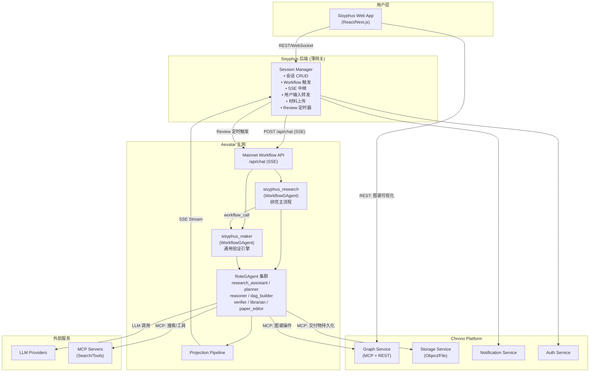

---

## 3. 两个 WorkflowGAgent

整个系统只有 **2 个 WorkflowGAgent**：

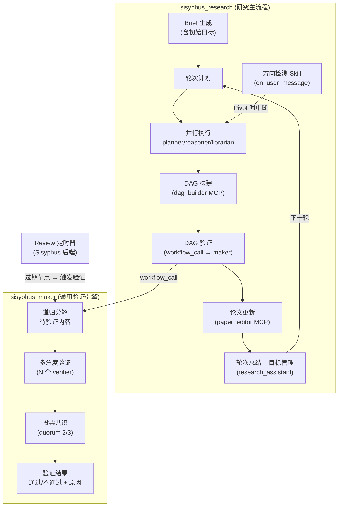

| # | Workflow | 触发方式 | 包含的 Agent 能力 |
|---|---------|---------|------------------|
| 1 | `sisyphus_research` | 用户发起研究 | Brief/Plan/执行/DAG构建/论文编辑/目标管理/方向检测 |
| 2 | `sisyphus_maker` | research 内部 `workflow_call` + Review 定时器外部触发 | 递归分解 + 多角度验证 + 投票共识 |

### 3.1 为什么 Goals 不需要独立 Workflow

目标管理是研究循环的自然环节：

```
research_loop:
  ├── [首轮] RA BRIEF → 生成初始目标 (3-7个) + 里程碑
  ├── [每轮] RA PLAN → 基于当前目标规划本轮任务
  ├── [每轮] Workers 并行执行
  ├── [每轮] DAG 构建 + Maker 验证
  ├── [每轮] Paper 更新
  └── [每轮] RA SUMMARY → 评估目标完成度、合并新建议、判断是否继续
                           ↑ 目标管理就在这里
```

research_assistant 在 SUMMARY 阶段天然持有完整上下文（本轮所有产出 + DAG 状态 + 历史 trace），由它评估目标是 Agent 认知能力，不需要外部服务。

### 3.2 为什么 Review 不需要独立 Workflow

Review 的"智能"部分就是验证 —— 而 `sisyphus_maker` 已经是通用验证引擎。Review 只需要一个**哑定时器**：

```
Review 定时器 (Sisyphus 后端 Background Job):
  每 30 分钟:
    1. 调用 Chrono Graph REST API 查询过期节点
    2. 对每个过期节点:
       POST /api/chat {workflow: "sisyphus_maker", prompt: "验证此节点: {node}"}
    3. 解析 maker 结果 → 调用 Chrono Graph REST API 更新节点状态
    4. 发送 Chrono Notification 报告
```

定时器本身不做任何 AI 判断，所有验证逻辑都在 `sisyphus_maker` Workflow 中。

---

## 4. Agent 角色设计

### 4.1 角色映射

```mermaid
graph TB
    subgraph "旧 Agent 系统 (硬编码)"
        OLD_RA["VibeResearchAssistantAgent"]
        OLD_PL["VibePlannerAgent"]
        OLD_RE["VibeReasonerAgent"]
        OLD_DB["VibeDagBuilderAgent"]
        OLD_VE["VibeVerifierAgent"]
        OLD_LI["VibeLibrarianAgent"]
        OLD_PE["VibePaperEditorAgent"]
        OLD_RO["VibeRoleAgent"]
        OLD_RV["ReviewAgentService"]
        OLD_PV["PivotOrchestrator"]
        OLD_GS["GoalsService"]
        OLD_DM["DeliveryManager"]
    end

    subgraph "新 Aevatar Workflow (声明式)"
        subgraph "WorkflowGAgent Skills"
            SKILL_DIR["detect_research_direction"]
        end

        subgraph "RoleGAgent (YAML 定义)"
            NEW_RA["research_assistant<br/>(含目标管理)"]
            NEW_PL["planner"]
            NEW_RE["reasoner"]
            NEW_DB["dag_builder<br/>MCP: Chrono Graph"]
            NEW_VE["verifier"]
            NEW_LI["librarian<br/>MCP: Search"]
            NEW_PE["paper_editor<br/>MCP: Chrono Storage"]
            NEW_RO["dynamic_role"]
        end

        subgraph "sisyphus_maker"
            MAKER["通用验证引擎"]
        end
    end

    OLD_RA --> NEW_RA
    OLD_PL --> NEW_PL
    OLD_RE --> NEW_RE
    OLD_DB --> NEW_DB
    OLD_VE --> NEW_VE
    OLD_LI --> NEW_LI
    OLD_PE --> NEW_PE
    OLD_RO --> NEW_RO
    OLD_RV -->|"验证逻辑"| MAKER
    OLD_RV -->|"定时触发"| CRON["哑定时器<br/>(Sisyphus 后端)"]
    OLD_PV --> SKILL_DIR
    OLD_GS -->|"融入 RA"| NEW_RA
    OLD_DM -->|"Agent 直接持久化"| NEW_PE

    style CRON fill:#eee,stroke:#999
```

### 4.2 角色定义详情

| 角色 ID | 名称 | 核心职责 | MCP/Tools |
|---------|------|---------|-----------|
| `research_assistant` | 研究助理 | Brief/Plan/Summary/**目标管理** | - |
| `planner` | 规划师 | 研究问题 → 可执行计划 | - |
| `reasoner` | 推理师 | 基于 DAG 事实推理论证 | python_exec (optional) |
| `dag_builder` | 图谱构建师 | 直接操作 Chrono Graph | **MCP: chrono_graph** (读写) |
| `verifier` | 验证师 | 验证结论正确性 | **MCP: chrono_graph** (只读), python_exec |
| `librarian` | 资料管理师 | 证据收集、公理提出 | **MCP: web_search, arxiv_search** |
| `paper_editor` | 论文编辑 | 论文/结论/证据/任务管理 | **MCP: chrono_storage** (读写) |
| `dynamic_role` | 动态角色 | 用户自定义 | 可配置 |

### 4.3 研究方向检测：Agent Skill

**方向检测是 Agent 的认知能力，不是外部服务。**

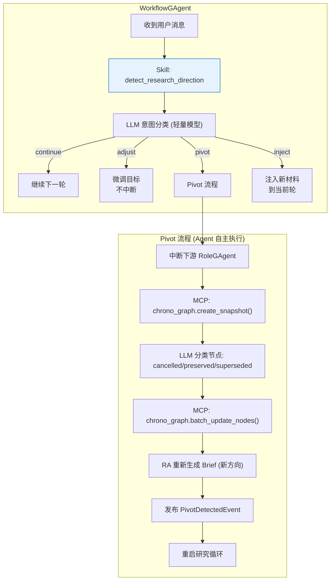

**Skill 定义 (Markdown)：**

```markdown
<!-- skills/detect_research_direction.md -->
---
name: detect_research_direction
description: >
  Detect changes in research direction from user messages and execute
  appropriate actions (continue, adjust, pivot, inject).
trigger: on_user_message
allowed-tools: LLMCall ChronoGraphMCP
metadata:
  confidence_threshold: 0.70
  classification_model: deepseek-chat
---

# Detect Research Direction

When the WorkflowGAgent receives a user message during an active research session,
this skill classifies the user's intent and takes the appropriate action.

## Classification

Use a lightweight LLM call to classify the user message.

**Input context:**
- 当前研究主题: {current_topic}
- 当前目标: {current_goals}
- 用户消息: {user_message}

**Classification categories:**

| Category | Description |
|----------|-------------|
| `continue` | 用户确认继续当前方向 |
| `adjust` | 微调目标，不中断当前轮次 |
| `pivot` | 彻底转向新研究方向 |
| `inject` | 注入新材料到当前轮次 |

Confidence threshold: 0.70. Below threshold → default to `continue`.

## Actions

### continue

No action needed. Proceed with the next research round.

### adjust

1. Update research goals based on user input
2. Emit `GoalsAdjustedEvent`
3. Continue current round

### pivot

1. Interrupt all downstream RoleGAgents
2. Create DAG snapshot: `MCP: chrono_graph.create_snapshot("pre_pivot")`
3. Use LLM to classify existing DAG nodes as: `cancelled` / `preserved` / `superseded`
4. Batch update node states: `MCP: chrono_graph.batch_update_nodes()`
5. Instruct research_assistant to regenerate Brief with new direction
6. Emit `PivotDetectedEvent`
7. Restart research loop

### inject

1. Extract materials from user message
2. Append to current round context
3. Continue current round
```

### 4.4 知识图谱：Chrono Graph Service MCP

**dag_builder 通过 MCP 直接操作图，前端直接读取图做可视化。**

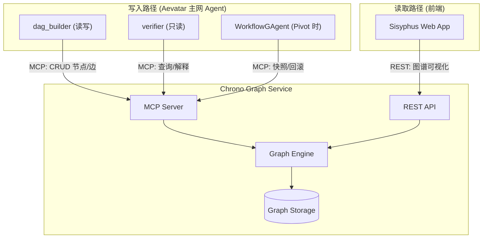

**MCP Tools：**

| Tool | 权限 | 使用者 |
|------|------|--------|
| `graph.create_node` / `create_edge` | 写 | dag_builder |
| `graph.update_node` / `batch_update_nodes` | 写 | dag_builder, WorkflowGAgent (pivot) |
| `graph.delete_node` | 写 | dag_builder |
| `graph.get_snapshot` / `query` / `explain_node` | 读 | dag_builder, verifier, WorkflowGAgent |
| `graph.create_snapshot` / `rollback_snapshot` | 写 | WorkflowGAgent (pivot) |

**REST API（供前端可视化）：**

```
GET /api/graphs/{graphId}/snapshot     # 全图
GET /api/graphs/{graphId}/nodes        # 节点列表（分页）
GET /api/graphs/{graphId}/nodes/{id}   # 节点详情
GET /api/graphs/{graphId}/edges        # 边列表
GET /api/graphs/{graphId}/subgraph     # N 跳邻居
GET /api/graphs/{graphId}/query        # 灵活查询
GET /api/graphs/{graphId}/snapshots    # 快照历史
GET /api/graphs/{graphId}/stats        # 统计信息
```

### 4.5 交付物持久化：Agent 直接操作 Chrono Storage

旧架构中 Delivery Manager 做的事（存 Brief、合并 Paper Patch、去重 Conclusions），现在由 Agent 自己完成：

| 交付物 | 生产者 Agent | 持久化方式 |
|--------|-------------|-----------|
| Brief | research_assistant | MCP: chrono_storage.put() |
| Paper Outline / Draft | paper_editor | MCP: chrono_storage.put() |
| Conclusions (max 32) | paper_editor | MCP: chrono_storage.put() (含去重) |
| Evidence Table (max 80) | paper_editor | MCP: chrono_storage.put() |
| Tasks Board (max 64) | paper_editor | MCP: chrono_storage.put() |
| 轮次 Trace | research_assistant | Aevatar Projection Store (自动) |

**paper_editor 的 system_prompt 中定义了去重、上限等规则，Agent 自己执行这些逻辑后直接写 Storage。**

### 4.6 研究执行时序

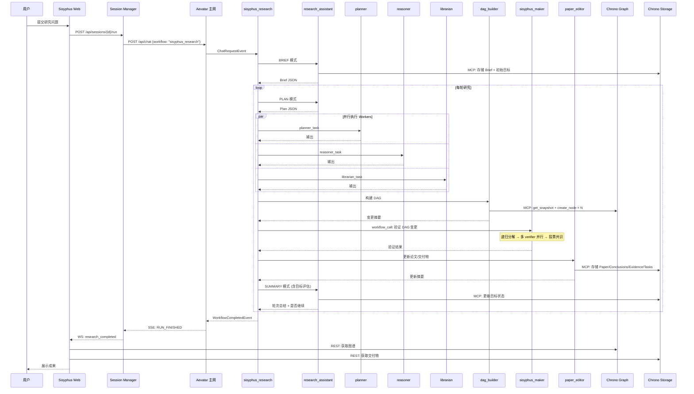

### 4.7 Pivot 时序

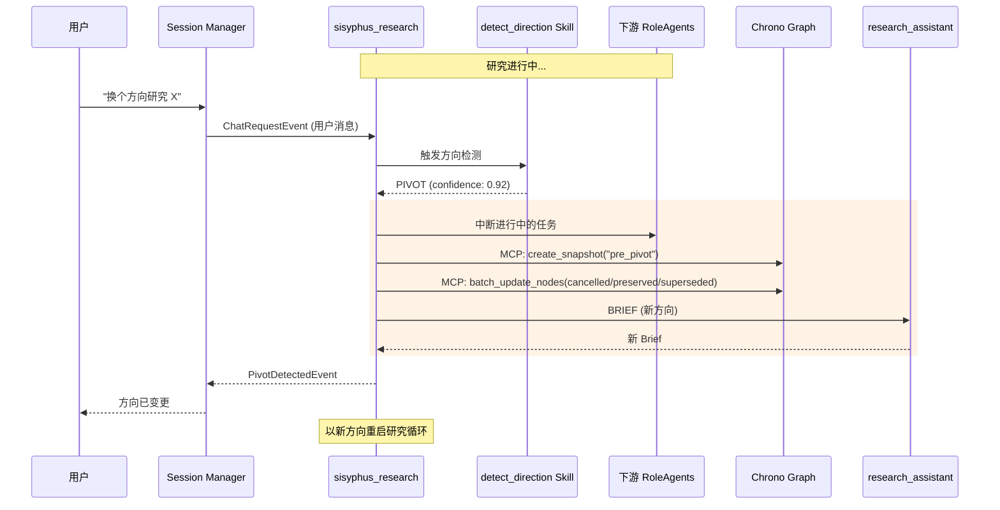

---

## 5. Sisyphus 后端 (薄网关)

### 5.1 架构

Sisyphus 后端只有一个核心服务 —— **Session Manager**。它不包含任何 AI 逻辑、不管理知识图谱、不做交付物处理。

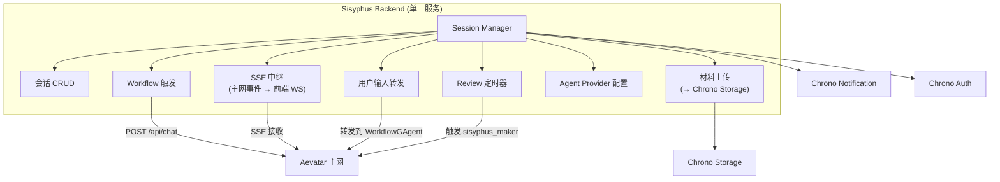

### 5.2 Session Manager 职责

```
Session Manager (唯一核心服务):
├── 会话生命周期 (Create / Get / List / Delete)
├── 研究执行触发
│   ├── 构建请求 (注入 session context 到 prompt)
│   ├── 调用主网 POST /api/chat {workflow: "sisyphus_research"}
│   └── 建立 SSE 连接
├── SSE 事件中继
│   ├── 接收主网 WorkflowOutputFrame
│   ├── 转发给前端 WebSocket
│   └── 提取关键事件发送通知 (研究完成/Pivot/错误)
├── 用户输入转发
│   ├── 接收用户中途消息
│   └── 转发到主网 → WorkflowGAgent 的 direction Skill 自行处理
├── 中断处理
│   └── 用户中断 → 取消主网 Workflow Run
├── 材料上传
│   └── 前端文件 → Chrono Storage → 返回 URL 注入到 prompt
├── Agent Provider 配置
│   ├── per-session per-role LLM provider 映射
│   └── 注入到 Workflow YAML 的 role.provider 字段
└── Review 定时器 (Background Job)
    ├── 每 30 分钟查询 Chrono Graph REST API → 过期节点
    ├── 对每个节点: POST /api/chat {workflow: "sisyphus_maker"}
    └── 解析结果 → 更新节点状态 → 发送通知
```

### 5.3 API 设计

```
/api/v2/sessions/
├── POST   /                              # 创建研究会话
├── GET    /                              # 列表查询
├── GET    /{sessionId}                   # 会话详情
├── DELETE /{sessionId}                   # 删除会话
│
├── POST   /{sessionId}/run               # 触发研究执行
├── GET    /{sessionId}/runs/{runId}       # 查询执行状态
├── POST   /{sessionId}/interrupt          # 中断执行
├── GET    /{sessionId}/events             # SSE 实时事件流
│
├── POST   /{sessionId}/input              # 提交用户输入 (转发到主网)
├── POST   /{sessionId}/uploads            # 上传研究材料
│
├── GET    /{sessionId}/agent-providers    # LLM Provider 配置
└── PUT    /{sessionId}/agent-providers    # 更新 Provider 配置

/api/v2/review/
├── GET    /state                          # 定时器状态
├── PUT    /settings                       # 更新定时器配置
└── POST   /trigger                        # 手动触发一轮 Review

注意:
- 知识图谱 → 前端直连 Chrono Graph REST API
- 交付物 (Brief/Paper/Conclusions/Evidence/Tasks) → 前端直连 Chrono Storage REST API
- 目标/里程碑 → 前端直连 Chrono Storage REST API (RA 产出的目标数据)
```

---

## 6. Chrono Platform 服务集成

### 6.1 集成架构

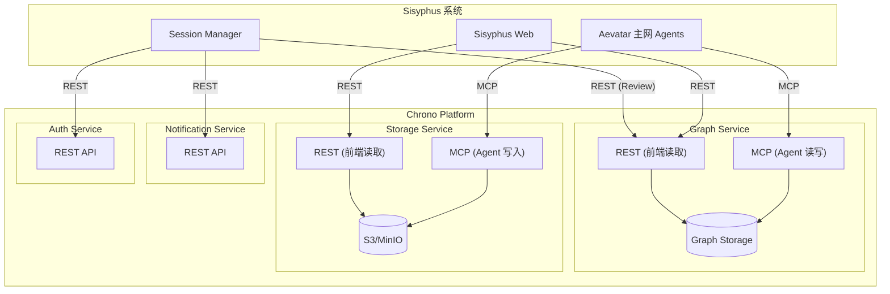

### 6.2 各服务用途

| Chrono 服务 | MCP 使用者 (写入) | REST 使用者 (读取) | 存储内容 |
|------------|------------------|-------------------|---------|
| **Graph Service** | dag_builder, verifier, WorkflowGAgent | Sisyphus Web, Session Manager (Review) | 知识图谱节点/边/快照 |
| **Storage Service** | paper_editor, research_assistant | Sisyphus Web | Brief, Paper, Conclusions, Evidence, Tasks, 上传材料 |
| **Notification Service** | - | Session Manager | 研究完成/Pivot/Review 告警 |
| **Auth Service** | - | Session Manager | JWT 认证, RBAC |

---

## 7. 前端架构

### 7.1 页面结构

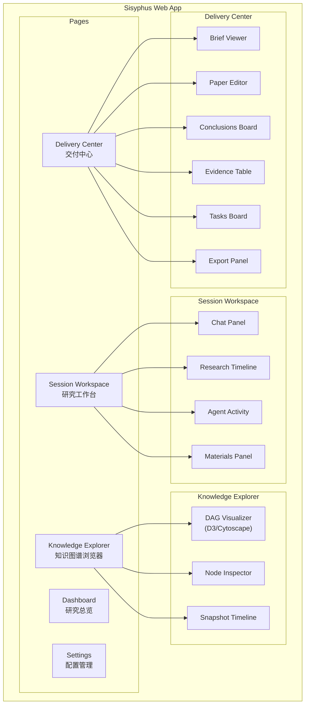

### 7.2 数据源分离

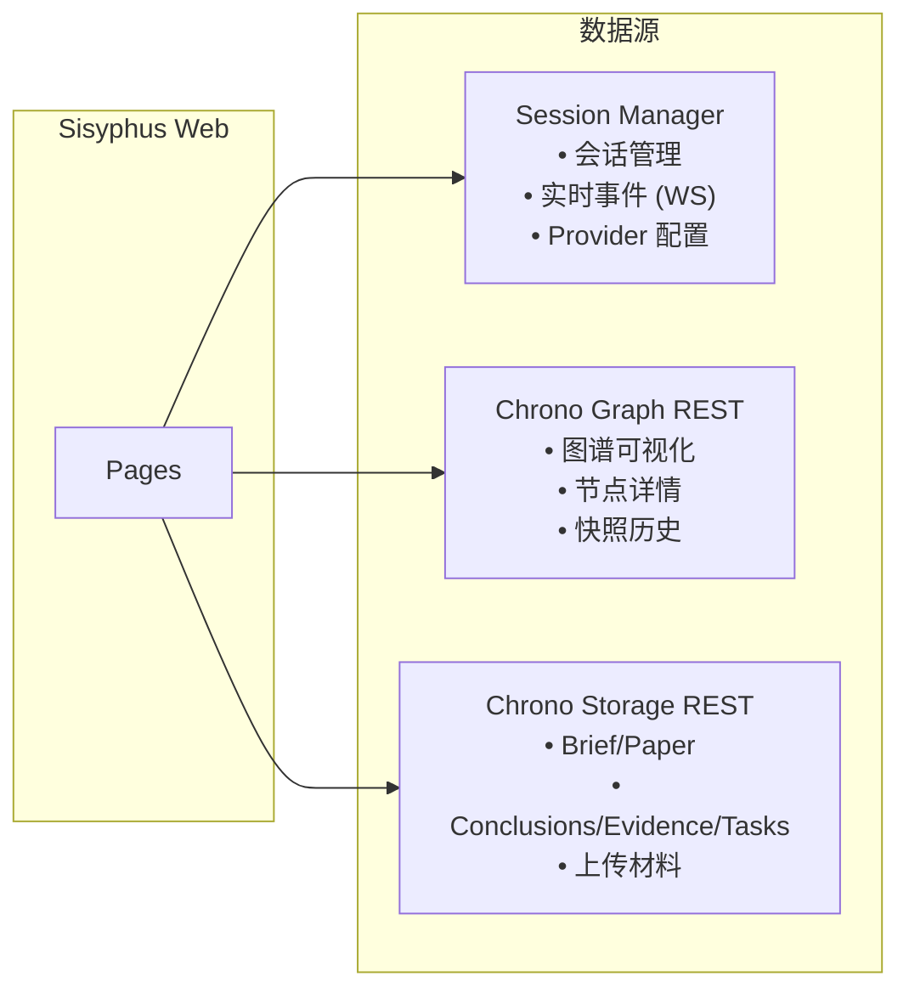

### 7.3 实时通信

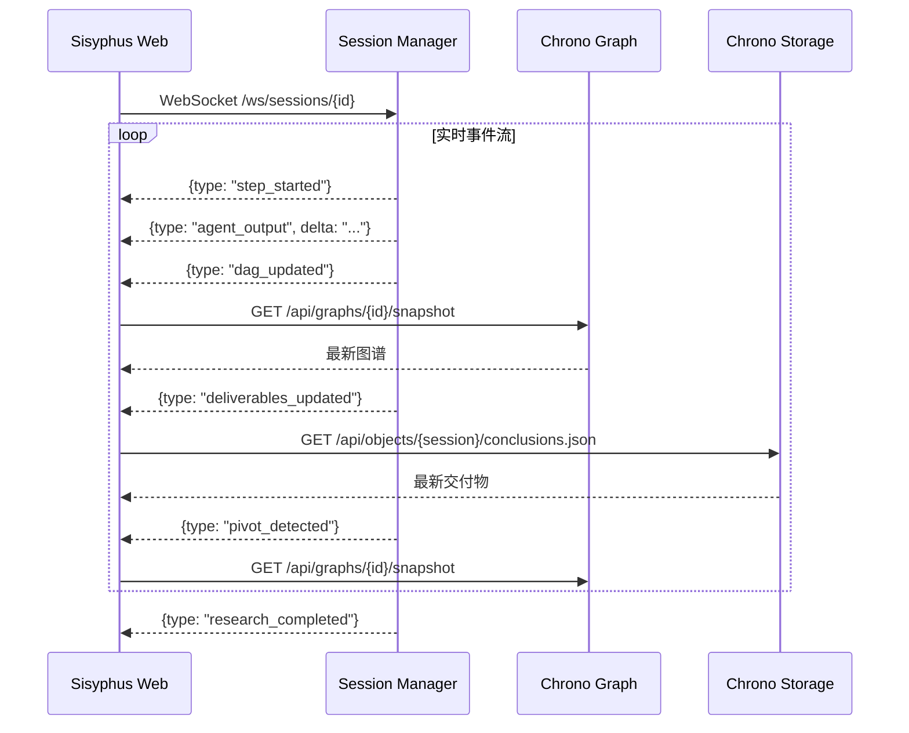

---

## 8. 数据流与持久化

### 8.1 数据流

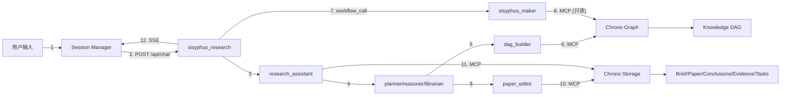

### 8.2 持久化策略

| 数据 | 旧实现 | 新实现 | 持久化位置 |
|------|-------|--------|-----------|
| 会话元数据 | 文件系统 | Session Manager DB | Sisyphus DB |
| Agent Provider 配置 | 文件系统 JSON | Session Manager DB | Sisyphus DB |
| Workflow/Agent 状态 | N/A | Aevatar State Store | Redis/Orleans |
| Agent 对话历史 | 文件系统 | RoleGAgent State | Aevatar State Store |
| **DAG 图谱** | 文件系统 JSON | **Agent MCP → Chrono Graph** | **Graph DB** |
| **DAG 快照** | 文件系统 JSON | **Chrono Graph 内建** | **Graph DB** |
| **Brief/Paper** | 文件系统 Markdown | **Agent MCP → Chrono Storage** | **S3/MinIO** |
| **Conclusions/Evidence/Tasks** | 文件系统 JSON | **Agent MCP → Chrono Storage** | **S3/MinIO** |
| **目标/里程碑** | 文件系统 JSON | **RA MCP → Chrono Storage** | **S3/MinIO** |
| 上传材料 | 文件系统 | Session Manager → Chrono Storage | S3/MinIO |
| 轮次 Trace | 文件系统 JSON | Aevatar Projection | Projection Store |

---

## 9. 部署架构

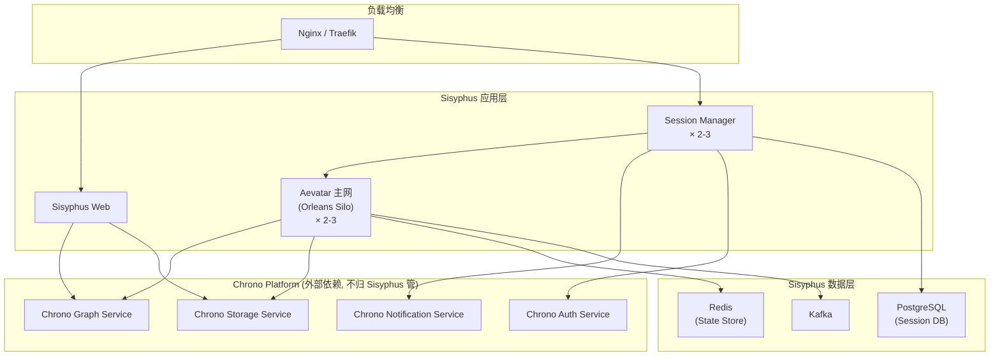

---

## 10. 服务完整清单

### 10.1 Aevatar 主网 (AI 层)

| # | 组件 | 类型 | 说明 |
|---|------|------|------|
| 1 | `sisyphus_research` | WorkflowGAgent | 研究主流程 + direction Skill + 目标管理 |
| 2 | `sisyphus_maker` | WorkflowGAgent | 通用验证引擎 (递归分解 + 投票共识) |
| 3 | research_assistant | RoleGAgent | Brief/Plan/Summary/目标评估 |
| 4 | planner | RoleGAgent | 研究计划 |
| 5 | reasoner | RoleGAgent | 推理论证 |
| 6 | dag_builder | RoleGAgent | MCP 操作 Chrono Graph |
| 7 | verifier | RoleGAgent | 验证 + MCP 查询 Chrono Graph |
| 8 | librarian | RoleGAgent | 资料管理 + MCP 搜索 |
| 9 | paper_editor | RoleGAgent | 论文/交付物 + MCP 写 Chrono Storage |
| 10 | dynamic_role | RoleGAgent | 用户自定义 |

### 10.2 Sisyphus 后端 (薄网关)

| # | 组件 | 说明 |
|---|------|------|
| 1 | Session Manager | **唯一服务** —— 会话 CRUD / Workflow 触发 / SSE 中继 / 输入转发 / 材料上传 / Review 定时器 |

### 10.3 Chrono Platform (外部依赖，不归 Sisyphus 管，assume ready to use)

| # | 服务 | 接口 | 说明 |
|---|------|------|------|
| 1 | Chrono Graph Service | MCP + REST | 知识图谱 |
| 2 | Chrono Storage Service | MCP + REST | 对象存储 (交付物 + 材料) |
| 3 | Chrono Notification Service | REST | 通知 |
| 4 | Chrono Auth Service | REST | 认证授权 |

### 10.4 Sisyphus 自有基础设施

| # | 组件 | 用途 |
|---|------|------|
| 1 | PostgreSQL | Session Manager DB |
| 2 | Redis | Aevatar State Store |
| 3 | Kafka | Aevatar Event Transport |

---

## 11. 关键设计决策

### 11.1 为什么 Sisyphus 后端只剩一个服务？

| 旧服务 | 为什么不需要了 |
|--------|---------------|
| Pivot Service | 方向检测是 Agent 认知能力 → WorkflowGAgent Skill |
| Goals Service | 目标评估是 RA 的工作 → research_assistant SUMMARY 阶段 |
| Review Service | 验证是 AI 工作 → `sisyphus_maker` Workflow，后端只保留哑定时器 |
| Delivery Manager | 交付物管理是 Agent 的工作 → paper_editor / RA 通过 MCP 直接持久化 |
| Event Processor | SSE 事件分发是 Session Manager 中继的一部分 |
| KG Service | 图操作是 dag_builder 的工作 → MCP 直连 Chrono Graph |

**判断标准：需要"理解力"的放 Agent 层，只需要"搬运"的放薄网关。**

### 11.2 为什么 Maker 是独立 Workflow 而不是 research 的内部步骤？

| 考量 | 结论 |
|------|------|
| **复用性** | research 内部 DAG 验证调用它，Review 定时器也调用它 |
| **独立触发** | 需要支持外部直接触发（定时器、未来可能的手动触发） |
| **关注点分离** | 研究编排 vs 验证引擎是不同的职责 |
| **可替换性** | 未来可以换更复杂的 Maker 策略而不动 research 流程 |

---

## 12. 迁移策略

### 前置条件 (Chrono Platform 团队交付，Sisyphus assume ready)
- Chrono Graph Service（MCP + REST）已部署
- Chrono Storage Service（MCP + REST）已部署
- Chrono Notification Service 已部署
- Chrono Auth Service 已部署

### Phase 1: 基础设施
- [ ] Aevatar 主网部署（Orleans + Redis + Kafka）
- [ ] Sisyphus Session Manager 项目结构
- [ ] PostgreSQL schema 设计
- [ ] docker-compose.sisyphus.yml 及环境变量配置

### Phase 2: Workflow
- [ ] `sisyphus_research.yaml` 主研究 Workflow
- [ ] `sisyphus_maker.yaml` 通用验证 Workflow
- [ ] `detect_research_direction.md` Skill (Markdown 格式)
- [ ] MCP Connector 配置（chrono_graph, chrono_storage, web_search, arxiv_search）

### Phase 3: 后端
- [ ] Session Manager（CRUD / Workflow 触发 / SSE 中继 / 输入转发）
- [ ] 材料上传流程
- [ ] Review 定时器
- [ ] Notification 集成

### Phase 4: 前端
- [ ] Dashboard
- [ ] Session Workspace（Chat / Timeline / Agent Activity）
- [ ] Knowledge Explorer（直连 Chrono Graph, D3/Cytoscape）
- [ ] Delivery Center（直连 Chrono Storage）
- [ ] Settings

### Phase 5: 集成与优化
- [ ] 端到端测试
- [ ] 性能优化
- [ ] 监控（OpenTelemetry）

---

## 13. 技术栈

| 层级 | 技术 |
|------|------|
| **前端** | React/Next.js, TypeScript, TailwindCSS, D3.js/Cytoscape.js |
| **Session Manager** | ASP.NET Core (.NET 10), PostgreSQL |
| **Aevatar 主网** | ASP.NET Core, Orleans, Redis, Kafka, Protobuf |
| **Chrono Graph** | ASP.NET Core, Neo4j/PostgreSQL, MCP Server SDK |
| **Chrono Storage** | ASP.NET Core, MinIO/S3, MCP Server SDK |
| **Chrono Platform** | ASP.NET Core 微服务 |
| **部署** | Docker, Docker Compose, Kubernetes (production) |
| **监控** | OpenTelemetry, Grafana, Prometheus |
