# Sisyphus 重构架构设计

> 基于 Aevatar WorkflowGAgent 框架的自动化研究平台重构方案

## 1. 概述

### 1.1 背景

Sisyphus 是一个 AI 驱动的自动化科研平台，原实现（VibeResearching）基于旧版 Aevatar Agent Framework，包含 9 个专业 Agent 角色、知识图谱（DAG）共识机制、文件交付系统、Pivot 方向调整等核心功能，单体 API 约 27K LOC。

现需基于新版 Aevatar WorkflowGAgent 框架进行彻底重构，核心原则：

- **统一 Host 架构** —— Sisyphus 与 Aevatar Runtime 合并为单一进程，原生拥有 Orleans Grain、CQRS、Projection 全部能力
- **所有 AI/Agent 能力通过 Workflow 执行** —— 包括研究、验证、目标管理、方向检测
- **Session Manager 是 Host 内的 Application Service** —— 直接操作 Grain，无需 HTTP 中继
- **通用基础设施使用 Chrono Platform** —— Graph、Storage、Notification 部署在 NyxId 平台上
- **Agent 通过 NyxId MCP 访问 Chrono 服务** —— Chrono 服务本身是纯 REST API，NyxId 平台自动将所有 REST endpoint 包装为 MCP Tool，Agent 通过 Aevatar MCP Connector 调用

### 1.2 新旧架构对照

| 旧实现 | 新实现 |
|--------|--------|
| 9 个硬编码 Agent 类 | YAML Workflow 定义 + Aevatar RoleGAgent |
| VibeOrchestrator（13 个 partial 文件） | WorkflowGAgent 编排 + Agent Skills |
| File-SSoT（本地文件系统状态） | Aevatar State Store + Chrono Platform 服务 |
| 内嵌 DAG 管理（文件系统 JSON） | Chrono Graph Service（Agent 通过 NyxId MCP 调用） |
| 硬编码 Pivot Service | WorkflowGAgent `detect_research_direction` Skill |
| 硬编码 Goals Service | research_assistant 在 SUMMARY 阶段自主管理 |
| 硬编码 Review Service | 定时器 + `sisyphus_maker` Workflow |
| 硬编码 Delivery Manager | Agent 通过 NyxId MCP 调用 Chrono Storage 持久化交付物 |
| 独立 Event Processor | Session Manager 直接订阅 Orleans Stream |
| Sisyphus 后端 + 独立 Aevatar 主网 | **统一 Sisyphus Host（内嵌 Orleans Silo + Workflow Runtime）** |
| 单体 API（~27K LOC） | **统一 Host + 2 个 Workflow** |

### 1.3 设计哲学

```
判断标准: 这个功能需要"理解力"还是只需要"搬运"？

需要理解力（AI 判断）→ 放在 Agent 层（Workflow）
  • 方向检测、目标评估、DAG 共识、知识验证、论文编辑...

只需要搬运（纯 CRUD/应用逻辑）→ 放在 Session Manager（Host 内的 Application Service）
  • 会话 CRUD、材料上传、Provider 配置...

通用基础设施 → 放在 Chrono Platform（部署在 NyxId 上）
  • 图存储、对象存储、邮件通知...

Agent 访问路径:
  Agent → MCP Connector → NyxId MCP Server → Chrono REST API
  (NyxId 自动将 REST endpoint 包装为 MCP Tool，Agent 无需知道底层 REST 细节)

Session Manager 访问路径:
  Session Manager → 直接调用 Chrono REST API
  (应用层代码直接 HTTP 调用，不走 MCP)
```

---

## 2. 系统全局架构

### 2.1 统一 Host 架构

Sisyphus Host 是一个统一的 ASP.NET Core 进程，同时承载 Orleans Silo（Agent Runtime）和 Session Manager（应用逻辑）。两者通过 DI 容器共享服务，Session Manager 直接操作 Grain，无需 HTTP 中继。

Chrono Platform 三个服务均部署在 **NyxId 平台**上。NyxId 是一个通用 MCP 网关，自动将所有注册服务的 REST endpoint 包装为 MCP Tool。Agent 通过 Aevatar MCP Connector 连接 NyxId MCP Server 调用 Chrono 服务；Session Manager 作为应用代码则直接调用 Chrono REST API。

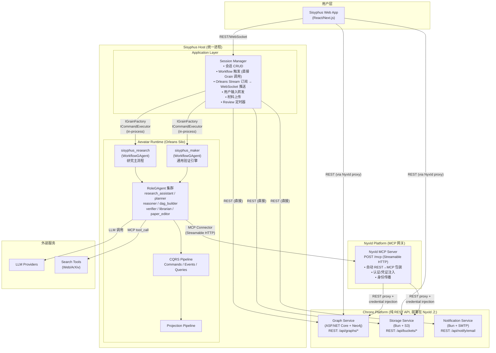

### 2.2 为什么合并为统一 Host

| 旧方案（分离 Host） | 新方案（统一 Host） | 收益 |
|---------------------|-------------------|------|
| Session Manager → HTTP POST /api/chat → Mainnet | Session Manager → `IGrainFactory.GetGrain()` | 去掉网络开销，in-process 直调 |
| Mainnet SSE → Session Manager 中继 → WebSocket | Session Manager 直接订阅 Orleans Stream → WebSocket | 去掉 SSE 中继层，减少一次序列化/反序列化 |
| Review 定时器 → HTTP POST /api/chat → Maker | Review 定时器 → `ICommandExecutor.Execute()` | 直接 dispatch CQRS command |
| Session Manager 无法访问 Projection | Session Manager 注入 `IProjectionQuery<T>` | 原生读取 Agent 产出的 Projection 数据 |
| 两个独立进程，分别部署扩缩 | 单一进程，Orleans 自动负载均衡 | 运维简化，Grain 自动分布到集群节点 |

### 2.3 Host 引导流程

```csharp
// Sisyphus.Host / Program.cs
var builder = WebApplication.CreateBuilder(args);

// ── Aevatar Runtime (Orleans Silo + CQRS + Projections) ──
builder.AddAevatarDefaultHost(options => {
    options.ServiceName = "Sisyphus.Host";
    options.EnableWebSockets = true;
    options.EnableConnectorBootstrap = true;    // 启动 MCP Connector（连接 NyxId）
    options.EnableActorRestoreOnStartup = true;
    options.AutoMapCapabilities = true;
});
builder.AddMainnetDistributedOrleansHost();       // Orleans Clustering + Streaming + Persistence
builder.AddWorkflowCapabilityWithAIDefaults();    // Workflow Runtime + CQRS + Projection Pipeline
builder.Services.AddWorkflowMakerExtensions();    // Maker Module

// ── Sisyphus Application Layer ──
builder.Services.AddSisyphusSessionManager();     // Session CRUD + Workflow 触发
builder.Services.AddSisyphusReviewTimer();        // Review 定时器 (BackgroundService)
builder.Services.AddSisyphusProviderConfig();     // Agent Provider 配置
builder.Services.AddSisyphusWebSocketHub();       // WebSocket → 前端推送

var app = builder.Build();
app.MapAevatarCapabilities();                     // /api/chat, /api/agents, /api/workflows
app.MapSisyphusEndpoints();                       // /api/v2/sessions/*, /api/v2/review/*
app.Run();
```

### 2.4 NyxId MCP 网关：Agent 如何访问 Chrono 服务

Chrono 服务本身是纯 REST API，但部署在 NyxId 平台上。NyxId 自动将注册服务的每个 REST endpoint 包装为 MCP Tool，Agent 通过标准 MCP 协议调用。

```
Agent (RoleGAgent)
  └── Workflow YAML 中的 connector_call 步骤
      └── Aevatar MCP Connector (MCP Client)
          └── NyxId MCP Server (POST /mcp, Streamable HTTP Transport + SSE)
              ├── 解析 MCP tool name → 目标服务 + endpoint
              ├── 构建 HTTP 请求 (path 参数替换、query 拼接、body 组装)
              ├── 注入凭证 (X-Internal-Auth / X-User / delegation token)
              ├── 注入身份 (X-NyxID-User-Id / X-NyxID-Identity-Token)
              └── 转发请求到 Chrono REST API → 返回结果
```

**NyxId MCP Tool 命名规则：** `{service_slug}__{endpoint_name}`

Chrono 服务在 NyxId 上注册后，REST endpoint 自动（或通过 OpenAPI spec 发现）映射为 MCP Tool：

| Chrono REST Endpoint | NyxId MCP Tool Name | 使用者 |
|---------------------|---------------------|--------|
| `POST /api/graphs/{graphId}/nodes` | `chrono-graph__create_nodes` | dag_builder |
| `GET /api/graphs/{graphId}/snapshot` | `chrono-graph__get_snapshot` | dag_builder, verifier, WorkflowGAgent |
| `PUT /api/graphs/{graphId}/nodes/{nodeId}` | `chrono-graph__update_node` | dag_builder, WorkflowGAgent (Pivot) |
| `GET /api/graphs/{graphId}/nodes/{nodeId}/explain` | `chrono-graph__explain_node` | verifier |
| `POST /api/buckets/{bucket}/objects` | `chrono-storage__upload_object` | paper_editor, research_assistant |
| `GET /api/buckets/{bucket}/objects` | `chrono-storage__list_objects` | paper_editor |
| `GET /api/buckets/{bucket}/presigned-url` | `chrono-storage__get_presigned_url` | paper_editor |

**Connector 配置（连接 NyxId MCP Server）：**

```yaml
connectors:
  nyxid:
    type: mcp
    transport: streamable-http       # MCP Streamable HTTP Transport
    url: ${NYXID_MCP_URL}/mcp        # e.g. https://nyxid.example.com/mcp
    auth:
      type: bearer
      token: ${NYXID_ACCESS_TOKEN}   # JWT access token
```

Agent 调用时只需指定 MCP tool name + arguments，NyxId 自动完成认证、参数映射、请求转发。

---

## 3. 两个 WorkflowGAgent

整个系统只有 **2 个 WorkflowGAgent**：

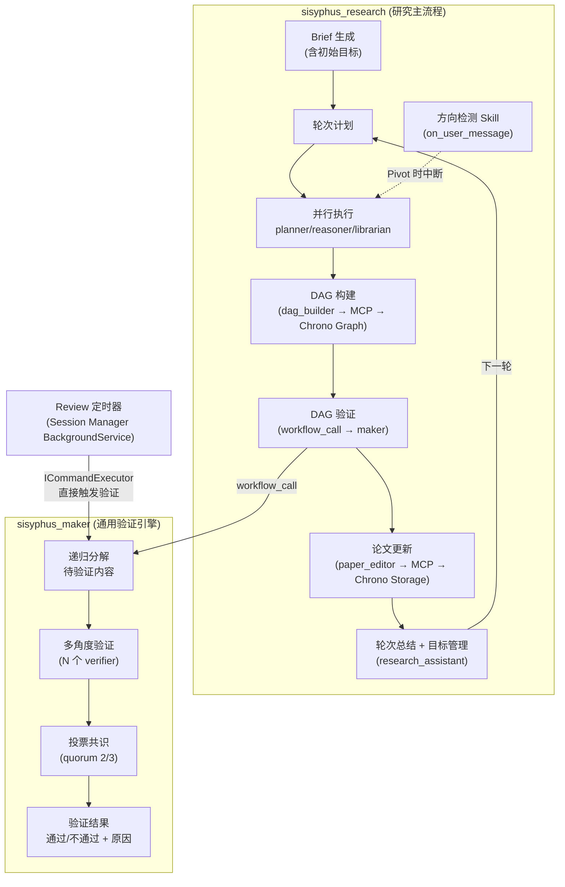

| # | Workflow | 触发方式 | 包含的 Agent 能力 |
|---|---------|---------|------------------|
| 1 | `sisyphus_research` | Session Manager 通过 `IGrainFactory` 直接激活 | Brief/Plan/执行/DAG构建/论文编辑/目标管理/方向检测 |
| 2 | `sisyphus_maker` | research 内部 `workflow_call` + Review 定时器通过 `ICommandExecutor` 触发 | 递归分解 + 多角度验证 + 投票共识 |

### 3.1 为什么 Goals 不需要独立 Workflow

目标管理是研究循环的自然环节：

```
research_loop:
  ├── [首轮] RA BRIEF → 生成初始目标 (3-7个) + 里程碑
  ├── [每轮] RA PLAN → 基于当前目标规划本轮任务
  ├── [每轮] Workers 并行执行
  ├── [每轮] DAG 构建 + Maker 验证
  ├── [每轮] Paper 更新
  └── [每轮] RA SUMMARY → 评估目标完成度、合并新建议、判断是否继续
                           ↑ 目标管理就在这里
```

research_assistant 在 SUMMARY 阶段天然持有完整上下文（本轮所有产出 + DAG 状态 + 历史 trace），由它评估目标是 Agent 认知能力，不需要外部服务。

### 3.2 为什么 Review 不需要独立 Workflow

Review 的"智能"部分就是验证 —— 而 `sisyphus_maker` 已经是通用验证引擎。Review 只需要一个**哑定时器**：

```
Review 定时器 (Session Manager 内的 BackgroundService):
  每 30 分钟:
    1. 直接调用 Chrono Graph REST API 查询需验证的节点
       GET /api/graphs/{graphId}/nodes?type=claim
       → 过滤 properties 中标记为待验证/过期的节点
    2. 对每个过期节点:
       通过 ICommandExecutor 直接 dispatch command 到 sisyphus_maker grain
    3. 订阅 maker grain 输出 → 解析验证结果
    4. 直接调用 Chrono Graph REST API 更新节点状态
       PUT /api/graphs/{graphId}/nodes/{nodeId} {properties: {verified: true/false, ...}}
    5. 直接调用 Chrono Notification REST API 发送邮件报告
       POST /api/notify/email {to: ..., subject: "Review Report", body: ...}
```

定时器是应用代码（不是 Agent），直接调用 REST API，不走 MCP。

---

## 4. Agent 角色设计

### 4.1 角色映射

```mermaid
graph TB
    subgraph "旧 Agent 系统 (硬编码)"
        OLD_RA["VibeResearchAssistantAgent"]
        OLD_PL["VibePlannerAgent"]
        OLD_RE["VibeReasonerAgent"]
        OLD_DB["VibeDagBuilderAgent"]
        OLD_VE["VibeVerifierAgent"]
        OLD_LI["VibeLibrarianAgent"]
        OLD_PE["VibePaperEditorAgent"]
        OLD_RO["VibeRoleAgent"]
        OLD_RV["ReviewAgentService"]
        OLD_PV["PivotOrchestrator"]
        OLD_GS["GoalsService"]
        OLD_DM["DeliveryManager"]
    end

    subgraph "新 Aevatar Workflow (声明式)"
        subgraph "WorkflowGAgent Skills"
            SKILL_DIR["detect_research_direction"]
        end

        subgraph "RoleGAgent (YAML 定义)"
            NEW_RA["research_assistant<br/>(含目标管理)"]
            NEW_PL["planner"]
            NEW_RE["reasoner"]
            NEW_DB["dag_builder<br/>MCP: Chrono Graph"]
            NEW_VE["verifier"]
            NEW_LI["librarian<br/>MCP: Search"]
            NEW_PE["paper_editor<br/>MCP: Chrono Storage"]
            NEW_RO["dynamic_role"]
        end

        subgraph "sisyphus_maker"
            MAKER["通用验证引擎"]
        end
    end

    OLD_RA --> NEW_RA
    OLD_PL --> NEW_PL
    OLD_RE --> NEW_RE
    OLD_DB --> NEW_DB
    OLD_VE --> NEW_VE
    OLD_LI --> NEW_LI
    OLD_PE --> NEW_PE
    OLD_RO --> NEW_RO
    OLD_RV -->|"验证逻辑"| MAKER
    OLD_RV -->|"定时触发"| CRON["哑定时器<br/>(BackgroundService)"]
    OLD_PV --> SKILL_DIR
    OLD_GS -->|"融入 RA"| NEW_RA
    OLD_DM -->|"Agent 直接持久化"| NEW_PE

    style CRON fill:#eee,stroke:#999
```

### 4.2 角色定义详情

| 角色 ID | 名称 | 核心职责 | MCP Tools (via NyxId) |
|---------|------|---------|----------------------|
| `research_assistant` | 研究助理 | Brief/Plan/Summary/**目标管理** | `chrono-storage__upload_object`, `chrono-storage__list_objects` |
| `planner` | 规划师 | 研究问题 → 可执行计划 | - |
| `reasoner` | 推理师 | 基于 DAG 事实推理论证 | python_exec (optional) |
| `dag_builder` | 图谱构建师 | 直接操作 Chrono Graph | `chrono-graph__create_nodes`, `chrono-graph__get_snapshot`, `chrono-graph__update_node`, `chrono-graph__delete_node` 等 |
| `verifier` | 验证师 | 验证结论正确性 | `chrono-graph__get_snapshot` (只读), `chrono-graph__explain_node`, python_exec |
| `librarian` | 资料管理师 | 证据收集、公理提出 | `web_search`, `arxiv_search` |
| `paper_editor` | 论文编辑 | 论文/结论/证据/任务管理 | `chrono-storage__upload_object`, `chrono-storage__list_objects`, `chrono-storage__get_presigned_url` |
| `dynamic_role` | 动态角色 | 用户自定义 | 可配置 |

### 4.3 研究方向检测：Agent Skill

**方向检测是 Agent 的认知能力，不是外部服务。**

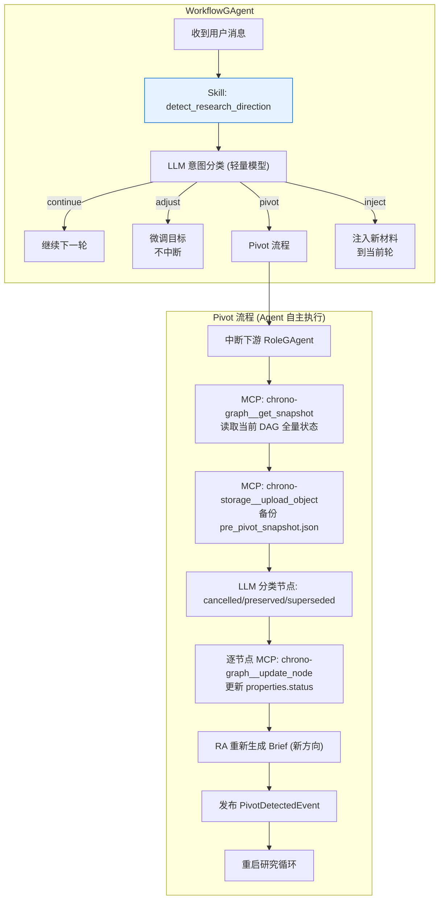

**Skill 定义 (Markdown)：**

```markdown
<!-- skills/detect_research_direction.md -->
---
name: detect_research_direction
description: >
  Detect changes in research direction from user messages and execute
  appropriate actions (continue, adjust, pivot, inject).
trigger: on_user_message
allowed-tools: LLMCall chrono-graph__get_snapshot chrono-graph__update_node chrono-storage__upload_object
metadata:
  confidence_threshold: 0.70
  classification_model: deepseek-chat
---

# Detect Research Direction

When the WorkflowGAgent receives a user message during an active research session,
this skill classifies the user's intent and takes the appropriate action.

## Classification

Use a lightweight LLM call to classify the user message.

**Input context:**
- 当前研究主题: {current_topic}
- 当前目标: {current_goals}
- 用户消息: {user_message}

**Classification categories:**

| Category | Description |
|----------|-------------|
| `continue` | 用户确认继续当前方向 |
| `adjust` | 微调目标，不中断当前轮次 |
| `pivot` | 彻底转向新研究方向 |
| `inject` | 注入新材料到当前轮次 |

Confidence threshold: 0.70. Below threshold → default to `continue`.

## Actions

### continue

No action needed. Proceed with the next research round.

### adjust

1. Update research goals based on user input
2. Emit `GoalsAdjustedEvent`
3. Continue current round

### pivot

1. Interrupt all downstream RoleGAgents
2. Read current DAG state: `chrono-graph__get_snapshot({graphId})`
3. Backup to storage: `chrono-storage__upload_object({bucket, key: "pre_pivot_snapshot.json", ...})`
4. Use LLM to classify existing DAG nodes as: `cancelled` / `preserved` / `superseded`
5. Update each node: `chrono-graph__update_node({graphId, nodeId, properties: {status: "cancelled"}})`
6. Instruct research_assistant to regenerate Brief with new direction
7. Emit `PivotDetectedEvent`
8. Restart research loop

### inject

1. Extract materials from user message
2. Append to current round context
3. Continue current round
```

### 4.4 知识图谱：Chrono Graph Service (via NyxId MCP)

**Chrono Graph 是纯 REST API 服务（ASP.NET Core + Neo4j），部署在 NyxId 上。NyxId 将其所有 REST endpoint 包装为 MCP Tool。Agent 通过 MCP 调用，前端和 Session Manager 直连 REST API。**

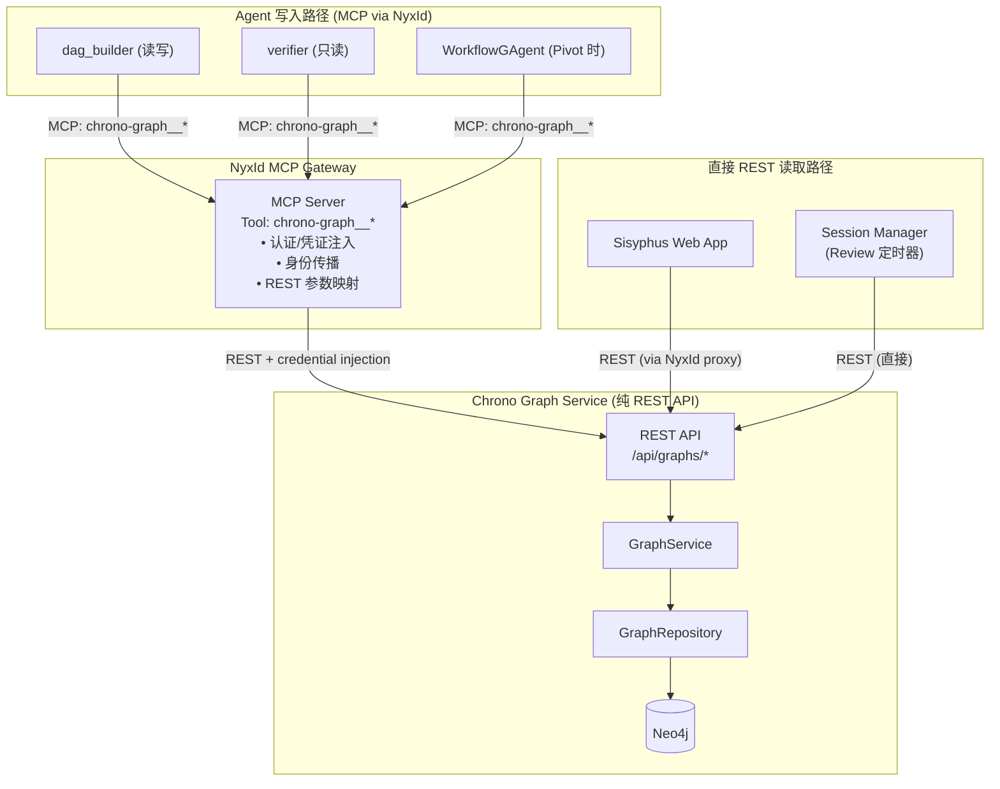

**Agent 可用的 MCP Tool（由 NyxId 从 Chrono Graph REST API 自动生成）：**

| MCP Tool Name | 对应 REST Endpoint | 说明 | Agent 使用者 |
|---------------|-------------------|------|-------------|
| `chrono-graph__create_graph` | `POST /api/graphs` | 创建图 | (Session Manager 直接 REST) |
| `chrono-graph__list_graphs` | `GET /api/graphs` | 列表所有图 | (Session Manager 直接 REST) |
| `chrono-graph__get_graph` | `GET /api/graphs/{graphId}` | 图详情 | (Session Manager 直接 REST) |
| `chrono-graph__delete_graph` | `DELETE /api/graphs/{graphId}` | 删除图 | (Session Manager 直接 REST) |
| `chrono-graph__create_nodes` | `POST /api/graphs/{graphId}/nodes` | 批量创建节点（可含 inline 边） | dag_builder |
| `chrono-graph__list_nodes` | `GET /api/graphs/{graphId}/nodes` | 节点列表（`?type=` 过滤） | dag_builder, verifier |
| `chrono-graph__get_node` | `GET /api/graphs/{graphId}/nodes/{nodeId}` | 节点详情 | verifier |
| `chrono-graph__update_node` | `PUT /api/graphs/{graphId}/nodes/{nodeId}` | 更新节点 properties | dag_builder, WorkflowGAgent (Pivot) |
| `chrono-graph__delete_node` | `DELETE /api/graphs/{graphId}/nodes/{nodeId}` | 删除节点 | dag_builder |
| `chrono-graph__delete_nodes` | `DELETE /api/graphs/{graphId}/nodes` | 批量删除 | dag_builder |
| `chrono-graph__create_edges` | `POST /api/graphs/{graphId}/edges` | 批量创建边 | dag_builder |
| `chrono-graph__list_edges` | `GET /api/graphs/{graphId}/edges` | 边列表（`?type=` 过滤） | verifier |
| `chrono-graph__delete_edge` | `DELETE /api/graphs/{graphId}/edges/{edgeId}` | 删除边 | dag_builder |
| `chrono-graph__delete_edges` | `DELETE /api/graphs/{graphId}/edges` | 批量删除边 | dag_builder |
| `chrono-graph__get_snapshot` | `GET /api/graphs/{graphId}/snapshot` | 全图快照（NodeMap/ParentsMap/ChildrenMap） | dag_builder, verifier, WorkflowGAgent |
| `chrono-graph__explain_node` | `GET /api/graphs/{graphId}/nodes/{nodeId}/explain` | 节点溯源（`edgeType`, `depth`） | verifier |

**重要限制：**
- **无 snapshot 版本管理** —— `get_snapshot` 返回当前状态的计算视图，不是持久化快照
- **无 rollback** —— 无法回滚到历史状态
- **无 batch_update_nodes** —— 需逐节点 `update_node`
- **Pivot 备份** —— Agent 将 `get_snapshot` 结果通过 `chrono-storage__upload_object` 存入 Storage

### 4.5 交付物持久化：Agent 通过 NyxId MCP 操作 Chrono Storage

**Chrono Storage 是纯 REST API 服务（Bun + Hono + S3），部署在 NyxId 上。** NyxId 将其 REST endpoint 包装为 MCP Tool。

| 交付物 | 生产者 Agent | MCP Tool 调用 |
|--------|-------------|--------------|
| Brief | research_assistant | `chrono-storage__upload_object({bucket: "session-{id}", key: "brief.json", ...})` |
| Paper Outline / Draft | paper_editor | `chrono-storage__upload_object({..., key: "paper.md"})` |
| Conclusions (max 32) | paper_editor | `chrono-storage__upload_object({..., key: "conclusions.json"})` (含去重) |
| Evidence Table (max 80) | paper_editor | `chrono-storage__upload_object({..., key: "evidence.json"})` |
| Tasks Board (max 64) | paper_editor | `chrono-storage__upload_object({..., key: "tasks.json"})` |
| 目标/里程碑 | research_assistant | `chrono-storage__upload_object({..., key: "goals.json"})` |
| 轮次 Trace | research_assistant | Aevatar Projection Store (自动) |

**Agent 可用的 Storage MCP Tool：**

| MCP Tool Name | 对应 REST Endpoint | 说明 |
|---------------|-------------------|------|
| `chrono-storage__create_bucket` | `POST /api/buckets` | 创建 Bucket |
| `chrono-storage__list_buckets` | `GET /api/buckets` | 列表 Bucket |
| `chrono-storage__upload_object` | `POST /api/buckets/:bucket/objects?key=&contentType=` | 上传对象 |
| `chrono-storage__list_objects` | `GET /api/buckets/:bucket/objects?prefix=&maxKeys=` | 列表对象 (分页) |
| `chrono-storage__head_object` | `HEAD /api/buckets/:bucket/objects?key=` | 对象元数据 |
| `chrono-storage__delete_object` | `DELETE /api/buckets/:bucket/objects?key=` | 删除对象 |
| `chrono-storage__get_presigned_url` | `GET /api/buckets/:bucket/presigned-url?key=` | 预签名下载 URL |
| `chrono-storage__copy_object` | `POST /api/buckets/:bucket/objects/copy` | 复制对象 |

**交付物存储约定：**
- 每个研究会话创建一个 Bucket：`session-{sessionId}`
- 交付物以 JSON/Markdown 文件存储在 Bucket 中
- 前端通过 presigned URL 下载交付物

**paper_editor 的 system_prompt 中定义了去重、上限等规则，Agent 自己执行这些逻辑后通过 MCP Tool 写入 Storage。**

### 4.6 研究执行时序

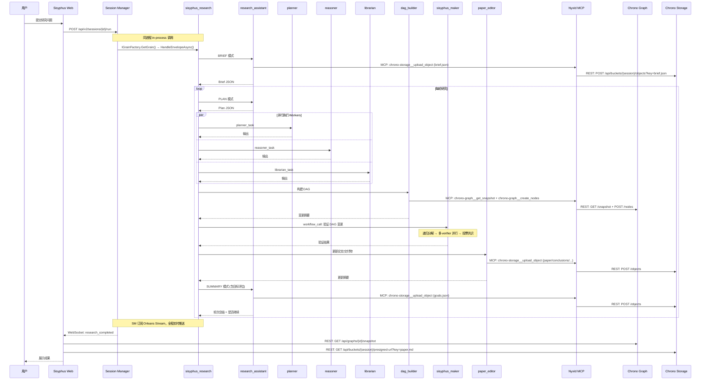

### 4.7 Pivot 时序

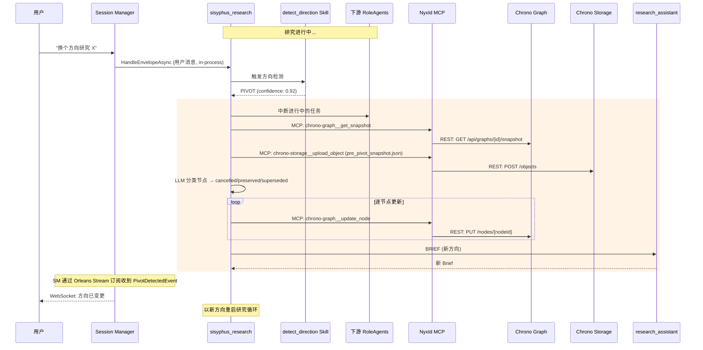

---

## 5. Session Manager (Host 内 Application Service)

### 5.1 架构

Session Manager 是 Sisyphus Host 内的 Application Service，与 Orleans Silo 共享 DI 容器。它不是独立进程，不需要 HTTP 中继，直接通过 `IGrainFactory`、`ICommandExecutor`、`IClusterClient` 操作 Agent Runtime。

Session Manager 作为应用代码（不是 Agent），**直接调用 Chrono REST API**，不走 NyxId MCP。

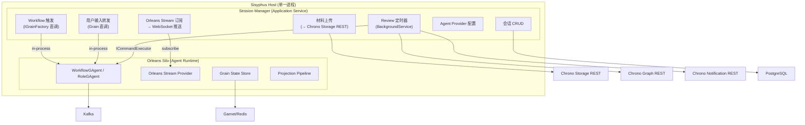

### 5.2 Session Manager 职责

```
Session Manager (Host 内 Application Service, 直接调 Chrono REST API):
├── 会话生命周期 (Create / Get / List / Delete)
│   ├── 创建时: POST /api/buckets 为会话创建 Storage Bucket
│   ├── 创建时: POST /api/graphs 为会话创建 Graph
│   └── 删除时: 清理对应 Bucket 和 Graph
├── 研究执行触发
│   ├── 构建请求 (注入 session context 到 prompt)
│   ├── IGrainFactory.GetGrain<IRuntimeActorGrain>(workflowId)
│   └── grain.HandleEnvelopeAsync(commandEnvelope)
├── 实时事件推送
│   ├── 订阅 Orleans Stream (WorkflowOutputFrame)
│   ├── 直接推送到前端 WebSocket
│   └── 提取关键事件发送邮件通知
│       POST /api/notify/email {to: ..., subject: ..., body: ...}
├── 用户输入转发
│   ├── 接收用户中途消息
│   └── grain.HandleEnvelopeAsync() → WorkflowGAgent direction Skill 自行处理
├── 中断处理
│   └── 用户中断 → grain.DeactivateAsync() 或 cancel command
├── 材料上传
│   └── 前端文件 → POST /api/buckets/{session}/objects?key=uploads/{filename}
│       → 返回 presigned URL 注入到 prompt
├── Agent Provider 配置
│   ├── per-session per-role LLM provider 映射
│   └── 注入到 Workflow YAML 的 role.provider 字段
├── Projection 查询
│   ├── 注入 IProjectionQuery<T> 直接读取 Agent 产出数据
│   └── 轮次 Trace、Agent 状态、Workflow Run 历史
└── Review 定时器 (BackgroundService)
    ├── 每 30 分钟 GET /api/graphs/{graphId}/nodes?type=claim → 需验证节点
    ├── 对每个节点: ICommandExecutor.Execute(makerCommand)
    ├── 订阅 maker grain 结果 → PUT /api/graphs/{graphId}/nodes/{nodeId} 更新状态
    └── POST /api/notify/email 发送 Review 报告
```

### 5.3 API 设计

```
/api/v2/sessions/
├── POST   /                              # 创建研究会话 (同时创建 Graph + Storage Bucket)
├── GET    /                              # 列表查询
├── GET    /{sessionId}                   # 会话详情
├── DELETE /{sessionId}                   # 删除会话 (同时清理 Graph + Bucket)
│
├── POST   /{sessionId}/run               # 触发研究执行
├── GET    /{sessionId}/runs/{runId}       # 查询执行状态 (可从 Projection 直读)
├── POST   /{sessionId}/interrupt          # 中断执行
├── GET    /{sessionId}/events             # WebSocket 实时事件流
│
├── POST   /{sessionId}/input              # 提交用户输入
├── POST   /{sessionId}/uploads            # 上传研究材料
│
├── GET    /{sessionId}/agent-providers    # LLM Provider 配置
└── PUT    /{sessionId}/agent-providers    # 更新 Provider 配置

/api/v2/review/
├── GET    /state                          # 定时器状态
├── PUT    /settings                       # 更新定时器配置
└── POST   /trigger                        # 手动触发一轮 Review

# Aevatar Capability 自动映射的端点 (可选保留，用于调试/外部集成)
/api/chat                                  # Workflow SSE (原 Mainnet API)
/api/agents                                # Agent 列表
/api/workflows                             # Workflow 列表

注意:
- 知识图谱 → 前端通过 NyxId proxy 访问 Chrono Graph REST API
- 交付物 → 前端通过 Chrono Storage presigned URL 读取
- 目标/里程碑 → 前端通过 Chrono Storage 读取 goals.json
```

---

## 6. Chrono Platform 服务集成

### 6.1 集成架构

**三个 Chrono 服务均为纯 REST API 微服务，部署在 NyxId 平台上。NyxId 提供统一 MCP 网关层。**

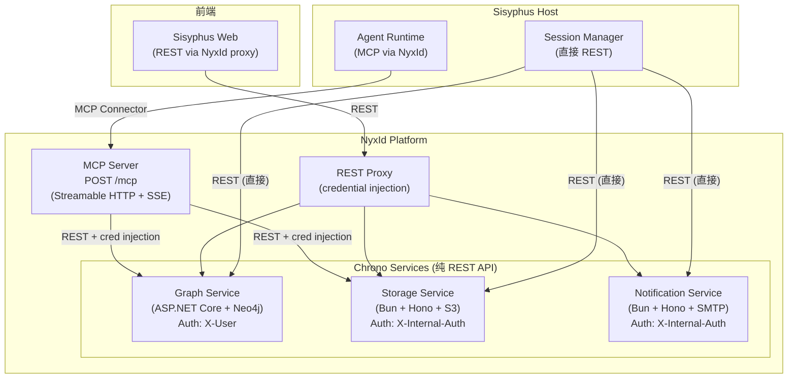

### 6.2 各服务用途

| Chrono 服务 | Agent (MCP via NyxId) | Session Manager (REST 直调) | 前端 (REST via NyxId proxy) |
|------------|----------------------|---------------------------|---------------------------|
| **Graph Service** | dag_builder (读写), verifier (只读), WorkflowGAgent (Pivot) | Review 定时器 (查询+更新), 会话创建/删除 | 图谱可视化, 节点详情, 溯源 |
| **Storage Service** | paper_editor (读写), research_assistant (读写) | 材料上传, 会话 Bucket 管理 | 交付物读取 (presigned URL) |
| **Notification Service** | - | 研究完成/Pivot/Review 邮件通知 | - |

### 6.3 NyxId MCP 网关详情

NyxId 是通用 MCP 网关平台（Rust 实现），为所有注册的下游服务提供统一 MCP 接口：

**MCP Transport：** Streamable HTTP (POST `/mcp` for JSON-RPC, GET `/mcp` for SSE notifications)

**核心能力：**
- **自动 REST→MCP 包装**：注册服务的 REST endpoint 自动映射为 MCP Tool（也可通过 OpenAPI spec 自动发现）
- **Lazy Tool Loading**：初始化时只暴露元工具（`nyx__search_tools`、`nyx__discover_services`），按需激活服务的工具，避免 LLM 上下文过载
- **凭证注入**：自动注入 `X-Internal-Auth`、`X-User` 等认证 header
- **身份传播**：注入 `X-NyxID-User-Id`、`X-NyxID-Identity-Token` (RS256 JWT)
- **Delegation Token**：下游服务可通过 delegation token 代表用户调用 NyxId 其他 API（如 LLM Gateway）

**Tool 命名规则：** `{service_slug}__{endpoint_name}`

### 6.4 Notification Service 详情

Chrono Notification 是**纯邮件通知服务**，仅有一个业务端点。Session Manager 直接调用 REST API（不走 MCP）：

```
POST /api/notify/email
Headers: X-Internal-Auth: {secret}

# 自由格式邮件（Sisyphus 使用此模式）
{
  "to": "user@example.com",
  "cc": ["team@example.com"],       // 可选
  "subject": "Sisyphus: 研究完成",
  "body": "<h1>研究报告</h1><p>...</p>"   // HTML 或纯文本
}

# 响应 (fire-and-forget)
{ "data": { "accepted": true }, "error": null }
```

内置模板（`otp`、`welcome`、`ban`）用于用户账户管理场景，Sisyphus 使用**自由格式邮件**发送研究通知。

---

## 7. 前端架构

### 7.1 页面结构

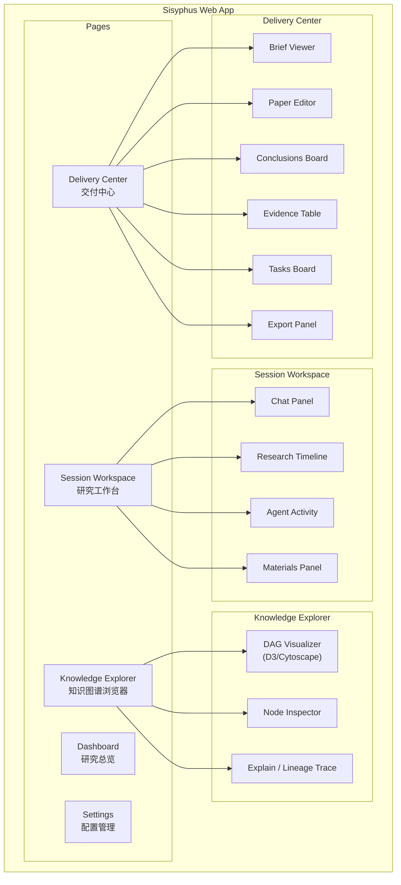

### 7.2 数据源分离

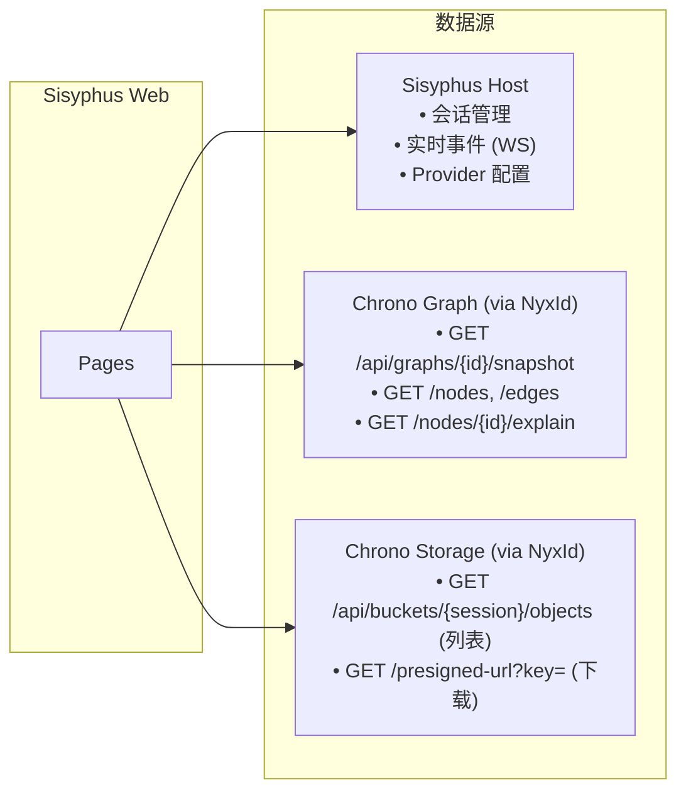

### 7.3 实时通信

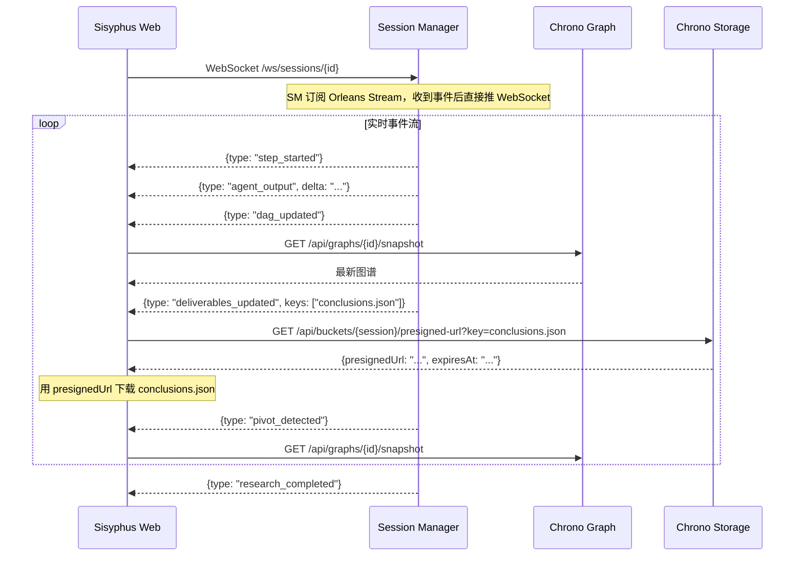

---

## 8. 数据流与持久化

### 8.1 数据流

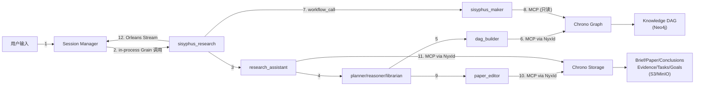

### 8.2 持久化策略

| 数据 | 旧实现 | 新实现 | 持久化位置 |
|------|-------|--------|-----------|
| 会话元数据 | 文件系统 | Session Manager DB | PostgreSQL |
| Agent Provider 配置 | 文件系统 JSON | Session Manager DB | PostgreSQL |
| Workflow/Agent 状态 | N/A | Aevatar State Store (同进程 Orleans Grain State) | Garnet/Redis |
| Agent 对话历史 | 文件系统 | RoleGAgent State | Aevatar State Store |
| **DAG 图谱** | 文件系统 JSON | **Agent MCP → NyxId → Chrono Graph REST** | **Neo4j** |
| **Brief/Paper** | 文件系统 Markdown | **Agent MCP → NyxId → Chrono Storage REST** | **S3/MinIO** |
| **Conclusions/Evidence/Tasks** | 文件系统 JSON | **Agent MCP → NyxId → Chrono Storage REST** | **S3/MinIO** |
| **目标/里程碑** | 文件系统 JSON | **RA MCP → NyxId → Chrono Storage REST** | **S3/MinIO** |
| 上传材料 | 文件系统 | Session Manager → Chrono Storage REST (直接) | S3/MinIO |
| 轮次 Trace | 文件系统 JSON | Aevatar Projection (同进程直读) | Projection Store |
| Pivot DAG 备份 | N/A | Agent MCP → NyxId → Chrono Storage (pre_pivot_snapshot.json) | S3/MinIO |

---

## 9. 部署架构

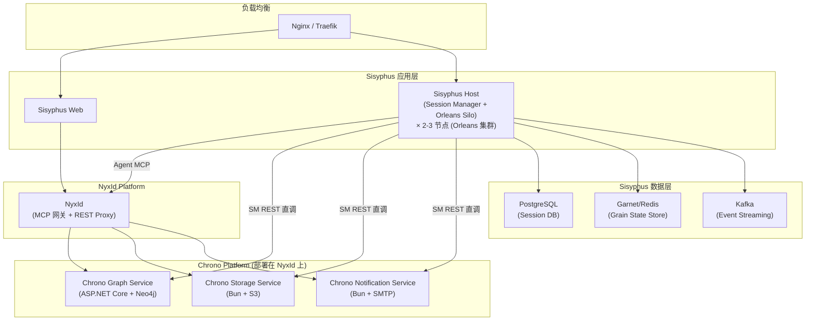

### 9.1 集群拓扑

多个 Sisyphus Host 实例组成 Orleans 集群。Orleans 自动在节点间分布 Grain，Session Manager 通过 `IGrainFactory` 调用 Grain 时，Orleans 透明路由到正确的节点。

```
Sisyphus Host Node 1        Sisyphus Host Node 2        Sisyphus Host Node 3
┌──────────────────────┐    ┌──────────────────────┐    ┌──────────────────────┐
│ Session Manager API  │    │ Session Manager API  │    │ Session Manager API  │
│ ──────────────────── │    │ ──────────────────── │    │ ──────────────────── │
│ Orleans Silo         │    │ Orleans Silo         │    │ Orleans Silo         │
│  • Grain A, B, C     │    │  • Grain D, E, F     │    │  • Grain G, H, I     │
│  • Stream Provider   │    │  • Stream Provider   │    │  • Stream Provider   │
│  • Projection Worker │    │  • Projection Worker │    │  • Projection Worker │
│  • MCP Connector     │    │  • MCP Connector     │    │  • MCP Connector     │
│    → NyxId           │    │    → NyxId           │    │    → NyxId           │
└──────────────────────┘    └──────────────────────┘    └──────────────────────┘
         │                           │                           │
         └───────── Garnet/Redis + Kafka + PostgreSQL ──────────┘
```

- **HTTP 请求**：Nginx 负载均衡到任意节点的 Session Manager API
- **Grain 调用**：Orleans 自动路由，无论请求落到哪个节点都能找到目标 Grain
- **MCP 连接**：每个节点的 MCP Connector 连接到 NyxId MCP Server
- **Stream 订阅**：每个节点的 Session Manager 可订阅任意 Grain 的 Stream
- **扩缩容**：加减节点时 Orleans 自动 rebalance Grain 分布

---

## 10. 服务完整清单

### 10.1 Sisyphus Host (统一进程)

**Application Layer (Session Manager)**

| # | 组件 | 说明 |
|---|------|------|
| 1 | Session Manager | 会话 CRUD / Workflow 触发 (Grain 直调) / Stream 订阅 → WebSocket / 输入转发 / 材料上传 |
| 2 | Review Timer | BackgroundService，定时查询过期节点，通过 ICommandExecutor 触发 sisyphus_maker |
| 3 | Provider Config | per-session per-role LLM provider 映射 |

**Agent Runtime (Orleans Silo)**

| # | 组件 | 类型 | 说明 |
|---|------|------|------|
| 1 | `sisyphus_research` | WorkflowGAgent | 研究主流程 + direction Skill + 目标管理 |
| 2 | `sisyphus_maker` | WorkflowGAgent | 通用验证引擎 (递归分解 + 投票共识) |
| 3 | research_assistant | RoleGAgent | Brief/Plan/Summary/目标评估, MCP → Chrono Storage |
| 4 | planner | RoleGAgent | 研究计划 |
| 5 | reasoner | RoleGAgent | 推理论证 |
| 6 | dag_builder | RoleGAgent | MCP → Chrono Graph (读写) |
| 7 | verifier | RoleGAgent | MCP → Chrono Graph (只读) |
| 8 | librarian | RoleGAgent | 资料管理 + MCP: web_search/arxiv_search |
| 9 | paper_editor | RoleGAgent | 论文/交付物 + MCP → Chrono Storage (读写) |
| 10 | dynamic_role | RoleGAgent | 用户自定义 |

### 10.2 NyxId Platform (MCP 网关)

| # | 组件 | 说明 |
|---|------|------|
| 1 | MCP Server | Streamable HTTP Transport (POST/GET/DELETE `/mcp`), 自动 REST→MCP 包装 |
| 2 | REST Proxy | 凭证注入、身份传播、请求转发 |
| 3 | Session Store | MCP 会话管理（内存 + MongoDB 持久化） |

### 10.3 Chrono Platform (部署在 NyxId 上，纯 REST API)

| # | 服务 | 技术栈 | REST 端点 | 认证方式 | 说明 |
|---|------|--------|----------|---------|------|
| 1 | Chrono Graph Service | ASP.NET Core + Neo4j | `/api/graphs/*` | `X-User` header | 知识图谱 CRUD + snapshot + explain |
| 2 | Chrono Storage Service | Bun + Hono + S3 | `/api/buckets/*` | `X-Internal-Auth` header | S3 兼容对象存储 (Bucket/Object) |
| 3 | Chrono Notification Service | Bun + Hono + Nodemailer | `POST /api/notify/email` | `X-Internal-Auth` header | 邮件通知 (freeform + 模板) |

### 10.4 Sisyphus 自有基础设施

| # | 组件 | 用途 |
|---|------|------|
| 1 | PostgreSQL | Session Manager DB |
| 2 | Garnet/Redis | Orleans Grain State Store |
| 3 | Kafka | Orleans Event Streaming (via MassTransit) |

---

## 11. 关键设计决策

### 11.1 为什么合并为统一 Host 而不是分离部署？

| 考量 | 分离 Host（旧方案） | 统一 Host（新方案） |
|------|-------------------|-------------------|
| **Grain 访问** | HTTP POST /api/chat → SSE 响应 | `IGrainFactory.GetGrain()` in-process 直调 |
| **事件流** | SSE 接收 → 反序列化 → WebSocket 推送 (双重序列化) | Orleans Stream 订阅 → WebSocket 推送 (零额外序列化) |
| **CQRS** | 无法直接使用，必须通过 HTTP | `ICommandExecutor`、`IProjectionQuery<T>` 直接注入 |
| **Projection** | 需要额外 REST API 暴露 | 同进程直读 |
| **Review 定时器** | HTTP POST /api/chat 触发 maker | `ICommandExecutor.Execute()` 直接 dispatch |
| **部署复杂度** | 两个独立服务，各自扩缩 | 单一服务类型，Orleans 集群自动负载均衡 |
| **延迟** | Session Manager ↔ Mainnet 多一跳网络 | 零网络开销 (同进程) |
| **运维** | 两套健康检查、两套日志、两套监控 | 统一运维 |

### 11.2 为什么 Sisyphus 后端只剩 Session Manager + 定时器？

| 旧服务 | 为什么不需要了 |
|--------|---------------|
| Pivot Service | 方向检测是 Agent 认知能力 → WorkflowGAgent Skill |
| Goals Service | 目标评估是 RA 的工作 → research_assistant SUMMARY 阶段 |
| Review Service | 验证是 AI 工作 → `sisyphus_maker` Workflow，后端只保留哑定时器 |
| Delivery Manager | 交付物管理是 Agent 的工作 → paper_editor / RA 通过 MCP 直接持久化 |
| Event Processor | Orleans Stream 直接订阅，无需独立处理器 |
| KG Service | 图操作是 dag_builder 的工作 → MCP 调用 Chrono Graph |
| SSE 中继层 | 不再需要 —— 同进程直接订阅 Orleans Stream |

**判断标准：需要"理解力"的放 Agent 层，只需要"搬运"的放 Session Manager，不需要搬运的直接去掉。**

### 11.3 为什么 Maker 是独立 Workflow 而不是 research 的内部步骤？

| 考量 | 结论 |
|------|------|
| **复用性** | research 内部 DAG 验证调用它，Review 定时器也调用它 |
| **独立触发** | 需要支持外部直接触发（定时器、未来可能的手动触发） |
| **关注点分离** | 研究编排 vs 验证引擎是不同的职责 |
| **可替换性** | 未来可以换更复杂的 Maker 策略而不动 research 流程 |

### 11.4 NyxId MCP 网关的作用

Chrono 服务本身是纯 REST API，不提供 MCP。NyxId 平台作为中间层提供统一 MCP 接口：

| 能力 | 说明 |
|------|------|
| **REST→MCP 自动包装** | 注册服务的 REST endpoint 自动或通过 OpenAPI 映射为 MCP Tool |
| **Lazy Tool Loading** | 避免一次暴露所有 tool 给 LLM，按需激活，减少上下文占用 |
| **认证/凭证注入** | 自动注入 X-Internal-Auth、X-User 等 header，Agent 无需管理凭证 |
| **身份传播** | 注入用户身份 (X-NyxID-User-Id, X-NyxID-Identity-Token) 到下游 |
| **Delegation Token** | 下游服务可代表用户调用 NyxId API（如 LLM Gateway） |
| **统一接口** | Agent 只需连接一个 MCP Server，即可访问所有 Chrono 服务 |

### 11.5 Agent vs Session Manager 访问 Chrono 服务的区别

| | Agent | Session Manager |
|--|-------|----------------|
| **访问方式** | MCP (via NyxId) | REST (直接调用) |
| **原因** | Agent 是 AI 角色，通过 MCP Tool 接口调用外部能力 | Session Manager 是应用代码，直接 HTTP Client |
| **认证** | NyxId 自动注入凭证 | 代码中配置 HTTP Client header |
| **典型场景** | dag_builder 创建节点、paper_editor 存储交付物 | Review 定时器查询过期节点、会话创建时初始化 Graph/Bucket |

---

## 12. 迁移策略

### 前置条件
- Chrono Graph Service（REST API）已部署在 NyxId 上
- Chrono Storage Service（REST API）已部署在 NyxId 上
- Chrono Notification Service（REST API）已部署在 NyxId 上
- NyxId MCP Server 可用，Chrono 服务的 endpoint 已注册为 MCP Tool

### Phase 1: 统一 Host 基础设施
- [ ] Sisyphus.Host 项目结构（ASP.NET Core + Orleans Silo）
- [ ] 引入 Aevatar Bootstrap + Workflow + Maker 模块
- [ ] Orleans 集群配置（Garnet + Kafka + MassTransit）
- [ ] PostgreSQL schema 设计（Session DB）
- [ ] MCP Connector 配置（连接 NyxId MCP Server）
- [ ] docker-compose.sisyphus.yml 及环境变量配置

### Phase 2: Workflow & Agent
- [ ] `sisyphus_research.yaml` 主研究 Workflow
- [ ] `sisyphus_maker.yaml` 通用验证 Workflow
- [ ] `detect_research_direction.md` Skill (Markdown 格式)
- [ ] 验证 NyxId MCP Tool 可用性（chrono-graph__*, chrono-storage__*）
- [ ] Search tool 配置（web_search, arxiv_search）

### Phase 3: Session Manager
- [ ] Session Manager Application Service（CRUD / Grain 直调触发 / Stream 订阅 → WebSocket）
- [ ] 会话生命周期管理（创建时 REST 初始化 Graph + Bucket，删除时清理）
- [ ] 用户输入转发（Grain 直调）
- [ ] 材料上传流程（→ Chrono Storage REST API 直调）
- [ ] Review 定时器（BackgroundService + ICommandExecutor + Chrono Graph REST 直调）
- [ ] Notification 集成（→ Chrono Notification REST API 直调: POST /api/notify/email）

### Phase 4: 前端
- [ ] Dashboard
- [ ] Session Workspace（Chat / Timeline / Agent Activity）
- [ ] Knowledge Explorer（Chrono Graph via NyxId proxy, D3/Cytoscape）
- [ ] Delivery Center（Chrono Storage presigned URL）
- [ ] Settings

### Phase 5: 集成与优化
- [ ] 端到端测试
- [ ] 性能优化
- [ ] 监控（OpenTelemetry）

---

## 13. 技术栈

| 层级 | 技术 |
|------|------|
| **前端** | React/Next.js, TypeScript, TailwindCSS, D3.js/Cytoscape.js |
| **Sisyphus Host** | ASP.NET Core (.NET 10), Orleans, Garnet/Redis, Kafka, Protobuf, PostgreSQL |
| **NyxId Platform** | Rust, Streamable HTTP MCP Transport, MongoDB (session store) |
| **Chrono Graph** | ASP.NET Core (.NET 10), Neo4j |
| **Chrono Storage** | Bun, Hono, AWS SDK v3 (S3/MinIO) |
| **Chrono Notification** | Bun, Hono, Nodemailer (SMTP) |
| **部署** | Docker, Docker Compose, Kubernetes (production) |
| **监控** | OpenTelemetry, Grafana, Prometheus |
