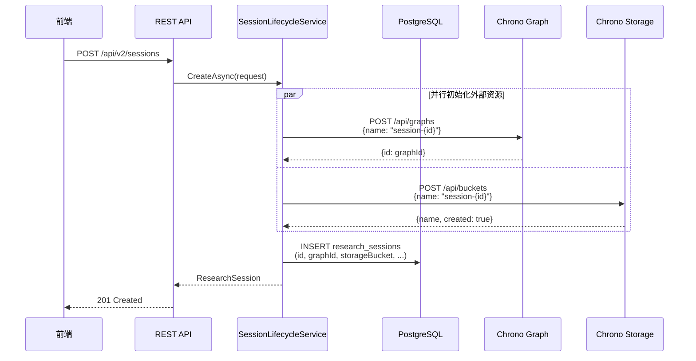
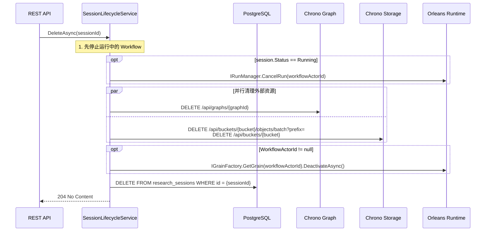
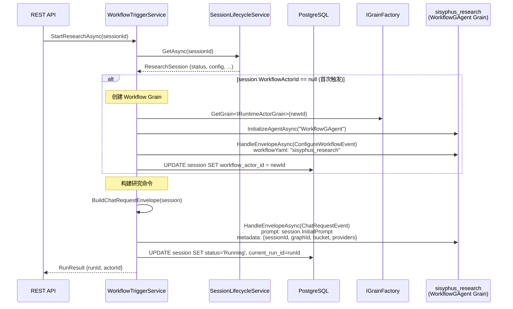
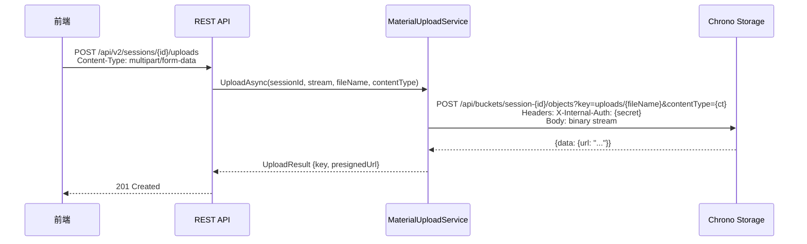
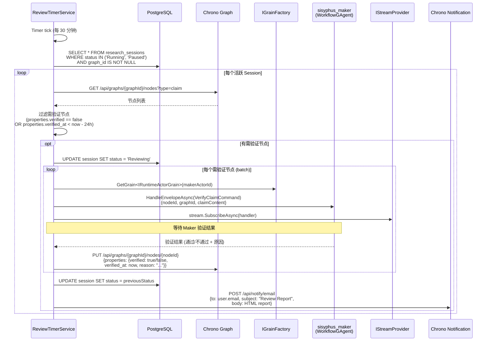

# Session Manager 架构设计

> Sisyphus Host 内的应用服务层 —— 会话管理、Workflow 触发、实时事件推送、定时 Review

## 1. 概述

### 1.1 定位

Session Manager 是 Sisyphus Host 内的 **Application Service 层**。它与 Orleans Silo（Agent Runtime）同进程运行，通过 DI 容器共享服务，直接操作 Grain —— 不需要 HTTP 中继。

```
判断标准: Session Manager 只做"搬运"，不做"理解"

✓ 会话 CRUD、Workflow 触发、事件中继、材料上传、定时触发、Provider 配置
✗ 研究规划、方向检测、DAG 构建、论文编辑、验证推理 → 这些都是 Agent 的工作
```

### 1.2 核心职责

| # | 职责 | 交互对象 | 访问方式 |
|---|------|---------|---------|
| 1 | 会话生命周期 (CRUD) | PostgreSQL, Chrono Graph, Chrono Storage | DB + REST 直调 |
| 2 | Workflow 触发 | WorkflowGAgent Grain | `IGrainFactory` in-process |
| 3 | 实时事件推送 | Orleans Stream → WebSocket | `IStreamProvider` subscribe |
| 4 | 用户输入转发 | WorkflowGAgent Grain | `IGrainFactory` in-process |
| 5 | 中断处理 | WorkflowGAgent Grain | `IRunManager.CancelRun()` |
| 6 | 材料上传 | Chrono Storage | REST 直调 |
| 7 | Agent Provider 配置 | PostgreSQL | DB |
| 8 | Projection 查询 | Projection Read Model Store | in-process |
| 9 | Review 定时器 | Chrono Graph, Maker Grain, Chrono Notification | REST 直调 + Grain 直调 |

### 1.3 访问模式

Session Manager 作为应用代码（不是 Agent），**直接调用 Chrono REST API**，不走 NyxId MCP：

```
前端 ──REST/WS──→ Session Manager ──in-process──→ Orleans Grain
                                   ──REST 直调──→ Chrono Graph API
                                   ──REST 直调──→ Chrono Storage API
                                   ──REST 直调──→ Chrono Notification API
                                   ──DB──→ PostgreSQL
```

---

## 2. 系统架构

### 2.1 组件总览

```mermaid
graph TB
    subgraph "前端"
        WEB["Sisyphus Web App"]
    end

    subgraph "Sisyphus Host (统一进程)"
        subgraph "Session Manager (Application Service Layer)"
            API["REST API<br/>/api/v2/sessions/*<br/>/api/v2/review/*"]
            WS_HUB["WebSocket Hub<br/>/ws/sessions/{id}"]

            subgraph "Core Services"
                SLS["SessionLifecycleService<br/>会话 CRUD + 资源初始化/清理"]
                WTS["WorkflowTriggerService<br/>Grain 直调触发 Workflow"]
                EHS["EventHubService<br/>Orleans Stream → WebSocket"]
                UIR["UserInputRouter<br/>消息转发 → Grain"]
                MUS["MaterialUploadService<br/>→ Chrono Storage REST"]
                APC["AgentProviderConfigService<br/>per-session per-role LLM 配置"]
                PQS["ProjectionQueryService<br/>轮次 Trace / Agent 状态"]
            end

            subgraph "Background Services"
                RVT["ReviewTimerService<br/>(IHostedService)<br/>定时触发 Maker 验证"]
                SCS["SessionCleanupService<br/>(IHostedService)<br/>过期会话清理"]
            end
        end

        subgraph "Orleans Silo (Agent Runtime)"
            WF_R["sisyphus_research<br/>(WorkflowGAgent)"]
            WF_M["sisyphus_maker<br/>(WorkflowGAgent)"]
            ROLES["RoleGAgent 集群"]
            STREAMS["Orleans Stream Provider"]
            STATE["Grain State Store"]
            PROJ["Projection Pipeline"]
        end

        WTS -->|"IGrainFactory<br/>HandleEnvelopeAsync"| WF_R & WF_M
        EHS -->|"IStreamProvider<br/>SubscribeAsync"| STREAMS
        UIR -->|"IGrainFactory<br/>HandleEnvelopeAsync"| WF_R
        PQS -->|"IProjectionReadModelStore"| PROJ
        RVT -->|"IGrainFactory<br/>HandleEnvelopeAsync"| WF_M
    end

    subgraph "Chrono Platform (REST API)"
        CG["Chrono Graph<br/>/api/graphs/*"]
        CS["Chrono Storage<br/>/api/buckets/*"]
        CN["Chrono Notification<br/>/api/notify/email"]
    end

    subgraph "数据层"
        PG["PostgreSQL"]
        REDIS["Garnet/Redis"]
    end

    WEB -->|"REST"| API
    WEB -->|"WebSocket"| WS_HUB
    SLS --> CG & CS & PG
    MUS --> CS
    RVT --> CG & CN
    STATE --> REDIS
```



### 2.2 分层架构

```
┌─────────────────────────────────────────────────────────┐
│  Presentation Layer                                     │
│  ├── REST API Endpoints (Minimal API)                   │
│  ├── WebSocket Hub                                      │
│  └── Request/Response DTOs                              │
├─────────────────────────────────────────────────────────┤
│  Application Service Layer                              │
│  ├── SessionLifecycleService                            │
│  ├── WorkflowTriggerService                             │
│  ├── EventHubService                                    │
│  ├── UserInputRouter                                    │
│  ├── MaterialUploadService                              │
│  ├── AgentProviderConfigService                         │
│  ├── ProjectionQueryService                             │
│  ├── ReviewTimerService          (IHostedService)       │
│  └── SessionCleanupService       (IHostedService)       │
├─────────────────────────────────────────────────────────┤
│  Infrastructure Layer                                   │
│  ├── ChronoGraphClient           (HttpClient → REST)    │
│  ├── ChronoStorageClient         (HttpClient → REST)    │
│  ├── ChronoNotificationClient    (HttpClient → REST)    │
│  ├── SessionRepository           (EF Core → PostgreSQL) │
│  └── ProviderConfigRepository    (EF Core → PostgreSQL) │
├─────────────────────────────────────────────────────────┤
│  Aevatar Runtime (Orleans Silo, 同进程共享 DI)            │
│  ├── IGrainFactory                                      │
│  ├── IStreamProvider                                    │
│  ├── IRunManager                                        │
│  └── IProjectionReadModelStore                          │
└─────────────────────────────────────────────────────────┘
```

---

## 3. 数据模型

### 3.1 Session 实体

```csharp
// Domain Entity (EF Core → PostgreSQL)
public sealed class ResearchSession
{
    public string Id { get; init; } = Ulid.NewUlid().ToString();
    public string UserId { get; init; } = default!;
    public string Title { get; set; } = "";
    public string? Description { get; set; }
    public SessionStatus Status { get; set; } = SessionStatus.Created;

    // ── Aevatar Runtime 关联 ──
    public string? WorkflowActorId { get; set; }       // sisyphus_research grain ID
    public string? MakerActorId { get; set; }           // sisyphus_maker grain ID
    public string? CurrentRunId { get; set; }           // 当前执行的 RunId

    // ── Chrono 资源关联 ──
    public string? GraphId { get; set; }                // Chrono Graph ID
    public string StorageBucket { get; set; } = "";     // Chrono Storage Bucket = "session-{Id}"

    // ── 配置 ──
    public string? InitialPrompt { get; set; }          // 用户提交的研究问题
    public int MaxRounds { get; set; } = 20;            // 最大研究轮次
    public int ReviewIntervalMinutes { get; set; } = 30;

    // ── 元数据 ──
    public DateTimeOffset CreatedAt { get; init; } = DateTimeOffset.UtcNow;
    public DateTimeOffset UpdatedAt { get; set; } = DateTimeOffset.UtcNow;
    public DateTimeOffset? CompletedAt { get; set; }
    public int TotalRounds { get; set; }
    public string? LastError { get; set; }
}

public enum SessionStatus
{
    Created,        // 已创建，未开始
    Running,        // 研究执行中
    Paused,         // 用户暂停
    PivotPending,   // Pivot 检测中
    Reviewing,      // Review 定时器触发验证中
    Completed,      // 研究完成
    Failed,         // 执行失败
    Cancelled       // 用户取消
}
```

### 3.2 Agent Provider 配置

```csharp
// per-session per-role LLM provider 映射
public sealed class AgentProviderConfig
{
    public string SessionId { get; init; } = default!;
    public string RoleId { get; init; } = default!;       // e.g. "research_assistant", "planner"
    public string ProviderName { get; set; } = "deepseek"; // e.g. "deepseek", "openai", "tornado"
    public string? Model { get; set; }                     // e.g. "deepseek-chat", "gpt-4o"
    public double? Temperature { get; set; }
    public int? MaxTokens { get; set; }
    public int MaxToolRounds { get; set; } = 10;
    public int MaxHistoryMessages { get; set; } = 100;
}
```

### 3.3 PostgreSQL Schema

```sql
CREATE TABLE research_sessions (
    id              TEXT PRIMARY KEY,
    user_id         TEXT NOT NULL,
    title           TEXT NOT NULL DEFAULT '',
    description     TEXT,
    status          TEXT NOT NULL DEFAULT 'Created',
    workflow_actor_id   TEXT,
    maker_actor_id      TEXT,
    current_run_id      TEXT,
    graph_id            TEXT,
    storage_bucket      TEXT NOT NULL,
    initial_prompt      TEXT,
    max_rounds          INTEGER NOT NULL DEFAULT 20,
    review_interval_minutes INTEGER NOT NULL DEFAULT 30,
    created_at      TIMESTAMPTZ NOT NULL DEFAULT NOW(),
    updated_at      TIMESTAMPTZ NOT NULL DEFAULT NOW(),
    completed_at    TIMESTAMPTZ,
    total_rounds    INTEGER NOT NULL DEFAULT 0,
    last_error      TEXT
);

CREATE INDEX idx_sessions_user_id ON research_sessions(user_id);
CREATE INDEX idx_sessions_status ON research_sessions(status);

CREATE TABLE agent_provider_configs (
    session_id      TEXT NOT NULL REFERENCES research_sessions(id) ON DELETE CASCADE,
    role_id         TEXT NOT NULL,
    provider_name   TEXT NOT NULL DEFAULT 'deepseek',
    model           TEXT,
    temperature     DOUBLE PRECISION,
    max_tokens      INTEGER,
    max_tool_rounds INTEGER NOT NULL DEFAULT 10,
    max_history_messages INTEGER NOT NULL DEFAULT 100,
    PRIMARY KEY (session_id, role_id)
);
```

---

## 4. Core Services 详细设计

### 4.1 SessionLifecycleService

管理会话的完整生命周期，负责跨系统资源协调（PostgreSQL + Chrono Graph + Chrono Storage + Orleans Grain）。

```csharp
public interface ISessionLifecycleService
{
    Task<ResearchSession> CreateAsync(CreateSessionRequest request, CancellationToken ct = default);
    Task<ResearchSession?> GetAsync(string sessionId, CancellationToken ct = default);
    Task<PagedResult<ResearchSession>> ListAsync(ListSessionsRequest request, CancellationToken ct = default);
    Task DeleteAsync(string sessionId, CancellationToken ct = default);
    Task<ResearchSession> UpdateStatusAsync(string sessionId, SessionStatus status, CancellationToken ct = default);
}
```

**创建流程（资源初始化）：**



**删除流程（资源清理）：**



**资源初始化失败补偿：**

```csharp
public async Task<ResearchSession> CreateAsync(CreateSessionRequest request, CancellationToken ct)
{
    var session = new ResearchSession
    {
        UserId = request.UserId,
        Title = request.Title,
        Description = request.Description,
        InitialPrompt = request.Prompt,
        StorageBucket = $"session-{session.Id}",
    };

    // ── 并行初始化外部资源 ──
    string? graphId = null;
    bool bucketCreated = false;
    try
    {
        var (graphResult, bucketResult) = await (
            _graphClient.CreateGraphAsync(session.StorageBucket, ct),
            _storageClient.CreateBucketAsync(session.StorageBucket, ct)
        );
        graphId = graphResult.Id;
        bucketCreated = true;
        session.GraphId = graphId;
    }
    catch
    {
        // ── 补偿：清理已创建的资源 ──
        if (graphId != null)
            await _graphClient.DeleteGraphAsync(graphId, ct).IgnoreErrors();
        if (bucketCreated)
            await _storageClient.DeleteBucketAsync(session.StorageBucket, ct).IgnoreErrors();
        throw;
    }

    await _sessionRepository.AddAsync(session, ct);
    return session;
}
```

### 4.2 WorkflowTriggerService

负责将用户的"开始研究"请求转换为 Grain 调用。核心是构建 `EventEnvelope` 并通过 `IGrainFactory` 直接投递到 WorkflowGAgent Grain。

```csharp
public interface IWorkflowTriggerService
{
    Task<RunResult> StartResearchAsync(string sessionId, CancellationToken ct = default);
    Task<RunResult> ResumeResearchAsync(string sessionId, CancellationToken ct = default);
    Task InterruptAsync(string sessionId, CancellationToken ct = default);
}
```

**触发流程：**



**构建 Envelope 的关键 —— 注入会话上下文：**

```csharp
private EventEnvelope BuildChatRequestEnvelope(ResearchSession session)
{
    var chatRequest = new ChatRequestEvent
    {
        Prompt = session.InitialPrompt ?? "",
    };

    var envelope = new EventEnvelope
    {
        Id = Guid.NewGuid().ToString("N"),
        Timestamp = Timestamp.FromDateTimeOffset(DateTimeOffset.UtcNow),
        Payload = Any.Pack(chatRequest),
        Direction = EventDirection.Self,
        CorrelationId = session.CurrentRunId ?? Guid.NewGuid().ToString("N"),
        Metadata =
        {
            ["session_id"] = session.Id,
            ["graph_id"] = session.GraphId ?? "",
            ["storage_bucket"] = session.StorageBucket,
            ["user_id"] = session.UserId,
            ["max_rounds"] = session.MaxRounds.ToString(),
        },
    };

    // 注入 per-role provider 配置
    var providers = _providerConfigService.GetProviderMap(session.Id);
    foreach (var (roleId, config) in providers)
    {
        envelope.Metadata[$"provider.{roleId}.name"] = config.ProviderName;
        if (config.Model != null)
            envelope.Metadata[$"provider.{roleId}.model"] = config.Model;
        if (config.Temperature.HasValue)
            envelope.Metadata[$"provider.{roleId}.temperature"] = config.Temperature.Value.ToString("F2");
    }

    return envelope;
}
```

**中断处理：**

```csharp
public async Task InterruptAsync(string sessionId, CancellationToken ct)
{
    var session = await _sessionService.GetAsync(sessionId, ct)
        ?? throw new SessionNotFoundException(sessionId);

    if (session.Status != SessionStatus.Running)
        throw new InvalidSessionStateException(sessionId, session.Status, "interrupt");

    // 1. 取消当前 Run
    if (session.CurrentRunId != null)
        _runManager.CancelRun(session.WorkflowActorId!);

    // 2. 更新状态
    await _sessionService.UpdateStatusAsync(sessionId, SessionStatus.Paused, ct);
}
```

### 4.3 EventHubService

Orleans Stream → WebSocket 实时推送。每个 WebSocket 连接对应一个 Session 的事件流订阅。

```csharp
public interface IEventHubService
{
    Task SubscribeAndPushAsync(string sessionId, WebSocket socket, CancellationToken ct);
}
```

**架构：**

```
Orleans Stream (WorkflowGAgent 发布)
    │
    ▼
EventHubService.SubscribeAndPushAsync()
    ├── IStreamProvider.GetStream(workflowActorId)
    ├── stream.SubscribeAsync<EventEnvelope>(handler)
    │       │
    │       ▼
    │   EventEnvelope → WebSocketFrame 映射
    │       ├── WorkflowOutputFrame → {type, data, timestamp}
    │       ├── StepStartedEvent → {type: "step_started", ...}
    │       ├── TextMessageContentEvent → {type: "agent_output", delta: ...}
    │       ├── StateSnapshotEvent → {type: "state_snapshot", ...}
    │       └── CustomEvent → {type: "custom", ...}
    │
    └── WebSocket.SendAsync(frame)
```

**WebSocket 帧协议：**

```typescript
// 服务端 → 前端
interface WebSocketFrame {
    type: string;         // 事件类型
    sessionId: string;
    runId: string;
    timestamp: string;    // ISO 8601
    data: unknown;        // 事件特定数据
}

// 事件类型定义
type FrameType =
    | "run_started"           // 研究开始
    | "run_finished"          // 研究完成
    | "run_error"             // 执行错误
    | "step_started"          // Workflow 步骤开始 (含 stepName)
    | "step_finished"         // Workflow 步骤结束
    | "agent_output"          // Agent 流式输出 (delta: string)
    | "agent_message_end"     // Agent 消息结束
    | "dag_updated"           // DAG 已变更 → 前端拉取 snapshot
    | "deliverables_updated"  // 交付物已更新 (keys: string[])
    | "pivot_detected"        // 方向变更
    | "goals_updated"         // 目标更新
    | "round_completed"       // 一轮研究完成 (roundNumber: int)
    | "review_triggered"      // Review 定时器触发
    | "review_completed"      // Review 完成
    | "state_snapshot"        // Agent 状态快照
    | "heartbeat"             // 保活 (30s 间隔)
```

**实现关键点：**

```csharp
public sealed class EventHubService : IEventHubService
{
    private readonly IStreamProvider _streamProvider;
    private readonly ISessionLifecycleService _sessionService;

    public async Task SubscribeAndPushAsync(string sessionId, WebSocket socket, CancellationToken ct)
    {
        var session = await _sessionService.GetAsync(sessionId, ct)
            ?? throw new SessionNotFoundException(sessionId);

        if (session.WorkflowActorId == null)
        {
            // 会话未开始，只发送心跳直到 Workflow 启动
            await WaitForWorkflowAndSubscribe(session, socket, ct);
            return;
        }

        var stream = _streamProvider.GetStream(session.WorkflowActorId);
        await using var subscription = await stream.SubscribeAsync<EventEnvelope>(
            async envelope =>
            {
                var frame = MapEnvelopeToFrame(sessionId, envelope);
                if (frame != null && socket.State == WebSocketState.Open)
                {
                    var json = JsonSerializer.SerializeToUtf8Bytes(frame);
                    await socket.SendAsync(json, WebSocketMessageType.Text, true, ct);
                }
            },
            ct);

        // 心跳 + 等待连接关闭
        using var heartbeatTimer = new PeriodicTimer(TimeSpan.FromSeconds(30));
        while (!ct.IsCancellationRequested && socket.State == WebSocketState.Open)
        {
            await heartbeatTimer.WaitForNextTickAsync(ct);
            if (socket.State == WebSocketState.Open)
            {
                var heartbeat = JsonSerializer.SerializeToUtf8Bytes(new { type = "heartbeat" });
                await socket.SendAsync(heartbeat, WebSocketMessageType.Text, true, ct);
            }
        }
    }

    private static WebSocketFrame? MapEnvelopeToFrame(string sessionId, EventEnvelope envelope)
    {
        // EventEnvelope.Payload → 具体事件类型 → WebSocketFrame
        var payload = envelope.Payload;
        if (payload.Is(WorkflowOutputFrame.Descriptor))
        {
            var frame = payload.Unpack<WorkflowOutputFrame>();
            return new WebSocketFrame
            {
                Type = MapOutputFrameType(frame),
                SessionId = sessionId,
                RunId = envelope.CorrelationId,
                Timestamp = envelope.Timestamp.ToDateTimeOffset(),
                Data = frame,
            };
        }
        // ... 其他事件类型映射
        return null;
    }
}
```

### 4.4 UserInputRouter

用户在研究进行中发送消息时，转发到 WorkflowGAgent。WorkflowGAgent 的 `detect_research_direction` Skill 自行判断意图（continue/adjust/pivot/inject）。

```csharp
public interface IUserInputRouter
{
    Task<InputResult> ForwardAsync(string sessionId, UserInputRequest input, CancellationToken ct = default);
}
```

```csharp
public sealed class UserInputRouter : IUserInputRouter
{
    private readonly IGrainFactory _grainFactory;
    private readonly ISessionLifecycleService _sessionService;

    public async Task<InputResult> ForwardAsync(string sessionId, UserInputRequest input, CancellationToken ct)
    {
        var session = await _sessionService.GetAsync(sessionId, ct)
            ?? throw new SessionNotFoundException(sessionId);

        if (session.Status != SessionStatus.Running)
            throw new InvalidSessionStateException(sessionId, session.Status, "input");

        var grain = _grainFactory.GetGrain<IRuntimeActorGrain>(session.WorkflowActorId!);

        var chatRequest = new ChatRequestEvent { Prompt = input.Message };
        var envelope = new EventEnvelope
        {
            Id = Guid.NewGuid().ToString("N"),
            Timestamp = Timestamp.FromDateTimeOffset(DateTimeOffset.UtcNow),
            Payload = Any.Pack(chatRequest),
            Direction = EventDirection.Self,
            CorrelationId = session.CurrentRunId ?? "",
            Metadata =
            {
                ["session_id"] = sessionId,
                ["input_type"] = "user_message",   // 标记为用户中途输入
                ["graph_id"] = session.GraphId ?? "",
                ["storage_bucket"] = session.StorageBucket,
            },
        };

        // 附加用户上传的材料引用
        if (input.AttachmentKeys?.Count > 0)
        {
            envelope.Metadata["attachments"] = string.Join(",", input.AttachmentKeys);
        }

        await grain.HandleEnvelopeAsync(envelope.ToByteArray());
        return new InputResult { Accepted = true };
    }
}
```

### 4.5 MaterialUploadService

前端上传研究材料（PDF、图片、文件）→ Session Manager 转存到 Chrono Storage。

```csharp
public interface IMaterialUploadService
{
    Task<UploadResult> UploadAsync(string sessionId, Stream content, string fileName, string? contentType, CancellationToken ct = default);
    Task<IReadOnlyList<MaterialInfo>> ListAsync(string sessionId, CancellationToken ct = default);
    Task<string> GetPresignedUrlAsync(string sessionId, string key, CancellationToken ct = default);
    Task DeleteAsync(string sessionId, string key, CancellationToken ct = default);
}
```



**存储路径约定：**

```
session-{sessionId}/
├── uploads/              # 用户上传的材料
│   ├── paper.pdf
│   └── data.csv
├── brief.json            # Agent 产出 (由 research_assistant 写入)
├── paper.md              # Agent 产出 (由 paper_editor 写入)
├── conclusions.json      # Agent 产出
├── evidence.json         # Agent 产出
├── tasks.json            # Agent 产出
├── goals.json            # Agent 产出
└── pre_pivot_snapshot.json  # Pivot 时的 DAG 备份
```

### 4.6 AgentProviderConfigService

管理 per-session per-role 的 LLM Provider 配置。配置在会话创建时可指定默认值，运行中可动态修改（下一轮生效）。

```csharp
public interface IAgentProviderConfigService
{
    Task<IReadOnlyList<AgentProviderConfig>> GetConfigsAsync(string sessionId, CancellationToken ct = default);
    Task<AgentProviderConfig> UpdateConfigAsync(string sessionId, string roleId, UpdateProviderRequest request, CancellationToken ct = default);
    Task ResetToDefaultsAsync(string sessionId, CancellationToken ct = default);
    IReadOnlyDictionary<string, AgentProviderConfig> GetProviderMap(string sessionId);
}
```

**默认 Provider 配置：**

| Role | 默认 Provider | 默认 Model | 说明 |
|------|-------------|-----------|------|
| `research_assistant` | deepseek | deepseek-chat | 需要强推理能力 |
| `planner` | deepseek | deepseek-chat | 计划生成 |
| `reasoner` | deepseek | deepseek-reasoner | 逻辑推理 |
| `dag_builder` | deepseek | deepseek-chat | 结构化输出 |
| `verifier` | deepseek | deepseek-reasoner | 严格验证 |
| `librarian` | deepseek | deepseek-chat | 搜索+摘要 |
| `paper_editor` | deepseek | deepseek-chat | 文本编辑 |
| `direction_skill` | deepseek | deepseek-chat | 意图分类 (轻量) |

### 4.7 ProjectionQueryService

利用 Aevatar Projection Pipeline 提供的 Read Model 读取 Agent 执行状态、轮次 Trace、Timeline。

```csharp
public interface IProjectionQueryService
{
    Task<WorkflowActorSnapshot?> GetWorkflowSnapshotAsync(string sessionId, CancellationToken ct = default);
    Task<IReadOnlyList<WorkflowActorTimelineItem>> GetTimelineAsync(string sessionId, CancellationToken ct = default);
    Task<SessionRunHistory> GetRunHistoryAsync(string sessionId, CancellationToken ct = default);
}
```

```csharp
public sealed class ProjectionQueryService : IProjectionQueryService
{
    private readonly IWorkflowProjectionQueryReader _projectionReader;
    private readonly ISessionLifecycleService _sessionService;

    public async Task<WorkflowActorSnapshot?> GetWorkflowSnapshotAsync(string sessionId, CancellationToken ct)
    {
        var session = await _sessionService.GetAsync(sessionId, ct);
        if (session?.WorkflowActorId == null) return null;

        return await _projectionReader.GetActorSnapshotAsync(session.WorkflowActorId, ct);
    }

    public async Task<IReadOnlyList<WorkflowActorTimelineItem>> GetTimelineAsync(string sessionId, CancellationToken ct)
    {
        var session = await _sessionService.GetAsync(sessionId, ct);
        if (session?.WorkflowActorId == null) return [];

        return await _projectionReader.GetTimelineAsync(session.WorkflowActorId, ct);
    }
}
```

---

## 5. Background Services

### 5.1 ReviewTimerService

定时检查知识图谱中需要重新验证的节点，触发 `sisyphus_maker` Workflow 进行验证，更新验证状态并发送邮件报告。

```csharp
public sealed class ReviewTimerService : IHostedService, IDisposable
{
    private readonly IServiceScopeFactory _scopeFactory;
    private readonly ILogger<ReviewTimerService> _logger;
    private Timer? _timer;
    private readonly SemaphoreSlim _lock = new(1, 1);

    public Task StartAsync(CancellationToken ct)
    {
        _timer = new Timer(ExecuteReview, null, TimeSpan.FromMinutes(5), TimeSpan.FromMinutes(30));
        return Task.CompletedTask;
    }

    public Task StopAsync(CancellationToken ct)
    {
        _timer?.Change(Timeout.Infinite, 0);
        return Task.CompletedTask;
    }

    public void Dispose() => _timer?.Dispose();
}
```

**Review 执行流程：**



**Review 报告邮件内容：**

```html
Subject: Sisyphus: Review Report - {sessionTitle}

<h1>Knowledge Review Report</h1>
<p>Session: {title}</p>
<p>Time: {timestamp}</p>
<p>Nodes reviewed: {count}</p>

<h2>Verification Results</h2>
<table>
  <tr><th>Node</th><th>Claim</th><th>Result</th><th>Reason</th></tr>
  <!-- 逐节点列出 -->
</table>

<h2>Summary</h2>
<p>{passCount}/{totalCount} claims verified successfully</p>
```

### 5.2 SessionCleanupService

定时清理过期/孤儿会话资源。

```csharp
public sealed class SessionCleanupService : IHostedService, IDisposable
{
    private Timer? _timer;

    public Task StartAsync(CancellationToken ct)
    {
        // 每小时检查一次
        _timer = new Timer(ExecuteCleanup, null, TimeSpan.FromMinutes(10), TimeSpan.FromHours(1));
        return Task.CompletedTask;
    }
}
```

**清理规则：**

| 条件 | 动作 |
|------|------|
| `status == Failed` 且 `updated_at < now - 7d` | 清理 Graph + Bucket，删除会话记录 |
| `status == Cancelled` 且 `updated_at < now - 3d` | 同上 |
| `status == Created` 且 `created_at < now - 24h` | 未开始的废弃会话，清理并删除 |
| `status == Completed` 且 `completed_at < now - 90d` | 归档通知后清理 (可配置) |

---

## 6. REST API 设计

### 6.1 会话管理

```
POST   /api/v2/sessions                         创建研究会话
GET    /api/v2/sessions                         列表查询 (?status=&userId=&page=&pageSize=)
GET    /api/v2/sessions/{sessionId}             会话详情
DELETE /api/v2/sessions/{sessionId}             删除会话 (含资源清理)
```

### 6.2 研究执行

```
POST   /api/v2/sessions/{sessionId}/run          触发研究执行
POST   /api/v2/sessions/{sessionId}/resume       恢复暂停的研究
POST   /api/v2/sessions/{sessionId}/interrupt     中断执行
GET    /api/v2/sessions/{sessionId}/snapshot      Workflow 状态快照 (from Projection)
GET    /api/v2/sessions/{sessionId}/timeline      执行时间线 (from Projection)
```

### 6.3 实时事件

```
GET    /ws/sessions/{sessionId}                  WebSocket 实时事件流
```

### 6.4 用户输入

```
POST   /api/v2/sessions/{sessionId}/input         提交用户消息 (研究中途)
```

### 6.5 材料管理

```
POST   /api/v2/sessions/{sessionId}/uploads       上传研究材料 (multipart/form-data)
GET    /api/v2/sessions/{sessionId}/uploads       列表已上传材料
GET    /api/v2/sessions/{sessionId}/uploads/{key}  获取材料下载 URL (presigned)
DELETE /api/v2/sessions/{sessionId}/uploads/{key}  删除已上传材料
```

### 6.6 Agent Provider 配置

```
GET    /api/v2/sessions/{sessionId}/providers     获取 per-role Provider 配置
PUT    /api/v2/sessions/{sessionId}/providers     批量更新 Provider 配置
PUT    /api/v2/sessions/{sessionId}/providers/{roleId}  更新单个角色 Provider
```

### 6.7 Review 管理

```
GET    /api/v2/review/state                       Review 定时器状态
PUT    /api/v2/review/settings                    更新 Review 配置
POST   /api/v2/review/trigger                     手动触发一轮 Review
GET    /api/v2/review/history                     Review 历史记录
```

### 6.8 API 请求/响应 DTOs

```csharp
// ── 创建会话 ──
public sealed record CreateSessionRequest(
    string Title,
    string? Description,
    string Prompt,                                     // 研究问题
    int MaxRounds = 20,
    Dictionary<string, UpdateProviderRequest>? Providers = null   // 可选初始 Provider 配置
);

public sealed record CreateSessionResponse(
    string Id,
    string Title,
    string Status,
    string GraphId,
    string StorageBucket,
    DateTimeOffset CreatedAt
);

// ── 列表查询 ──
public sealed record ListSessionsRequest(
    string? UserId = null,
    SessionStatus? Status = null,
    int Page = 1,
    int PageSize = 20
);

public sealed record PagedResult<T>(
    IReadOnlyList<T> Items,
    int TotalCount,
    int Page,
    int PageSize
);

// ── 触发执行 ──
public sealed record RunResult(
    string RunId,
    string ActorId,
    string Status
);

// ── 用户输入 ──
public sealed record UserInputRequest(
    string Message,
    IReadOnlyList<string>? AttachmentKeys = null       // 引用已上传材料的 key
);

public sealed record InputResult(bool Accepted);

// ── Provider 配置 ──
public sealed record UpdateProviderRequest(
    string ProviderName,
    string? Model = null,
    double? Temperature = null,
    int? MaxTokens = null,
    int MaxToolRounds = 10,
    int MaxHistoryMessages = 100
);

// ── 材料上传 ──
public sealed record UploadResult(
    string Key,
    string PresignedUrl,
    DateTimeOffset ExpiresAt
);

public sealed record MaterialInfo(
    string Key,
    long? Size,
    DateTimeOffset? LastModified
);
```

### 6.9 端点注册

```csharp
public static class SisyphusEndpointExtensions
{
    public static WebApplication MapSisyphusEndpoints(this WebApplication app)
    {
        var sessions = app.MapGroup("/api/v2/sessions").RequireAuthorization();
        var review = app.MapGroup("/api/v2/review").RequireAuthorization();

        // ── 会话 CRUD ──
        sessions.MapPost("/", CreateSessionHandler);
        sessions.MapGet("/", ListSessionsHandler);
        sessions.MapGet("/{sessionId}", GetSessionHandler);
        sessions.MapDelete("/{sessionId}", DeleteSessionHandler);

        // ── 研究执行 ──
        sessions.MapPost("/{sessionId}/run", StartResearchHandler);
        sessions.MapPost("/{sessionId}/resume", ResumeResearchHandler);
        sessions.MapPost("/{sessionId}/interrupt", InterruptHandler);
        sessions.MapGet("/{sessionId}/snapshot", GetSnapshotHandler);
        sessions.MapGet("/{sessionId}/timeline", GetTimelineHandler);

        // ── 用户输入 ──
        sessions.MapPost("/{sessionId}/input", ForwardInputHandler);

        // ── 材料 ──
        sessions.MapPost("/{sessionId}/uploads", UploadMaterialHandler).DisableAntiforgery();
        sessions.MapGet("/{sessionId}/uploads", ListMaterialsHandler);
        sessions.MapGet("/{sessionId}/uploads/{*key}", GetMaterialUrlHandler);
        sessions.MapDelete("/{sessionId}/uploads/{*key}", DeleteMaterialHandler);

        // ── Provider 配置 ──
        sessions.MapGet("/{sessionId}/providers", GetProvidersHandler);
        sessions.MapPut("/{sessionId}/providers", UpdateProvidersHandler);
        sessions.MapPut("/{sessionId}/providers/{roleId}", UpdateProviderHandler);

        // ── Review ──
        review.MapGet("/state", GetReviewStateHandler);
        review.MapPut("/settings", UpdateReviewSettingsHandler);
        review.MapPost("/trigger", TriggerReviewHandler);
        review.MapGet("/history", GetReviewHistoryHandler);

        // ── WebSocket ──
        app.Map("/ws/sessions/{sessionId}", WebSocketHandler);

        return app;
    }
}
```

---

## 7. Chrono Service HTTP Clients

Session Manager 通过 Typed HttpClient 直接调用 Chrono REST API。

### 7.1 ChronoGraphClient

```csharp
public interface IChronoGraphClient
{
    // ── Graph CRUD ──
    Task<GraphMetadata> CreateGraphAsync(string name, CancellationToken ct = default);
    Task<GraphMetadata?> GetGraphAsync(string graphId, CancellationToken ct = default);
    Task DeleteGraphAsync(string graphId, CancellationToken ct = default);

    // ── Node 操作 (Review 定时器使用) ──
    Task<IReadOnlyList<GraphNode>> ListNodesAsync(string graphId, string? type = null, CancellationToken ct = default);
    Task<GraphNode> UpdateNodeAsync(string graphId, string nodeId, Dictionary<string, object?> properties, CancellationToken ct = default);

    // ── Snapshot (Review 定时器 + 前端代理) ──
    Task<GraphSnapshot> GetSnapshotAsync(string graphId, CancellationToken ct = default);
}
```

```csharp
public sealed class ChronoGraphClient : IChronoGraphClient
{
    private readonly HttpClient _http;

    public ChronoGraphClient(HttpClient http)
    {
        _http = http;
    }

    public async Task<GraphMetadata> CreateGraphAsync(string name, CancellationToken ct)
    {
        var response = await _http.PostAsJsonAsync("/api/graphs", new { name }, ct);
        response.EnsureSuccessStatusCode();
        return (await response.Content.ReadFromJsonAsync<GraphMetadata>(ct))!;
    }

    public async Task<IReadOnlyList<GraphNode>> ListNodesAsync(string graphId, string? type, CancellationToken ct)
    {
        var url = $"/api/graphs/{graphId}/nodes";
        if (type != null) url += $"?type={Uri.EscapeDataString(type)}";

        var response = await _http.GetAsync(url, ct);
        response.EnsureSuccessStatusCode();
        return (await response.Content.ReadFromJsonAsync<IReadOnlyList<GraphNode>>(ct))!;
    }

    public async Task<GraphNode> UpdateNodeAsync(string graphId, string nodeId, Dictionary<string, object?> properties, CancellationToken ct)
    {
        var response = await _http.PutAsJsonAsync(
            $"/api/graphs/{graphId}/nodes/{nodeId}",
            new { properties },
            ct);
        response.EnsureSuccessStatusCode();
        return (await response.Content.ReadFromJsonAsync<GraphNode>(ct))!;
    }
}
```

**DI 注册：**

```csharp
services.AddHttpClient<IChronoGraphClient, ChronoGraphClient>(client =>
{
    client.BaseAddress = new Uri(config["Chrono:Graph:BaseUrl"]!);
    client.DefaultRequestHeaders.Add("X-User", "sisyphus-session-manager");
});
```

### 7.2 ChronoStorageClient

```csharp
public interface IChronoStorageClient
{
    // ── Bucket 操作 ──
    Task CreateBucketAsync(string name, CancellationToken ct = default);
    Task DeleteBucketAsync(string name, CancellationToken ct = default);

    // ── Object 操作 ──
    Task<StorageUploadResult> UploadObjectAsync(string bucket, string key, Stream content, string? contentType = null, CancellationToken ct = default);
    Task<StorageListResult> ListObjectsAsync(string bucket, string? prefix = null, int? maxKeys = null, string? continuationToken = null, CancellationToken ct = default);
    Task DeleteObjectAsync(string bucket, string key, CancellationToken ct = default);
    Task BatchDeleteAsync(string bucket, string prefix, CancellationToken ct = default);

    // ── Presigned URL ──
    Task<PresignedUrlResult> GetPresignedUrlAsync(string bucket, string key, int? expiresIn = null, CancellationToken ct = default);
}
```

```csharp
public sealed class ChronoStorageClient : IChronoStorageClient
{
    private readonly HttpClient _http;

    public async Task<StorageUploadResult> UploadObjectAsync(
        string bucket, string key, Stream content, string? contentType, CancellationToken ct)
    {
        var url = $"/api/buckets/{bucket}/objects?key={Uri.EscapeDataString(key)}";
        if (contentType != null) url += $"&contentType={Uri.EscapeDataString(contentType)}";

        using var streamContent = new StreamContent(content);
        var response = await _http.PostAsync(url, streamContent, ct);
        response.EnsureSuccessStatusCode();
        var envelope = await response.Content.ReadFromJsonAsync<StorageEnvelope<StorageUploadResult>>(ct);
        return envelope!.Data!;
    }

    public async Task<PresignedUrlResult> GetPresignedUrlAsync(
        string bucket, string key, int? expiresIn, CancellationToken ct)
    {
        var url = $"/api/buckets/{bucket}/presigned-url?key={Uri.EscapeDataString(key)}";
        if (expiresIn.HasValue) url += $"&expiresIn={expiresIn.Value}";

        var response = await _http.GetAsync(url, ct);
        response.EnsureSuccessStatusCode();
        var envelope = await response.Content.ReadFromJsonAsync<StorageEnvelope<PresignedUrlResult>>(ct);
        return envelope!.Data!;
    }
}

// Chrono Storage 统一响应信封
internal sealed record StorageEnvelope<T>(T? Data, StorageError? Error);
internal sealed record StorageError(string Code, string Message);
```

**DI 注册：**

```csharp
services.AddHttpClient<IChronoStorageClient, ChronoStorageClient>(client =>
{
    client.BaseAddress = new Uri(config["Chrono:Storage:BaseUrl"]!);
    client.DefaultRequestHeaders.Add("X-Internal-Auth", config["Chrono:Storage:AuthSecret"]!);
});
```

### 7.3 ChronoNotificationClient

```csharp
public interface IChronoNotificationClient
{
    Task SendEmailAsync(SendEmailRequest request, CancellationToken ct = default);
}

public sealed record SendEmailRequest(
    string To,
    string Subject,
    string Body,                  // HTML or plain text (freeform mode)
    IReadOnlyList<string>? Cc = null
);
```

```csharp
public sealed class ChronoNotificationClient : IChronoNotificationClient
{
    private readonly HttpClient _http;

    public async Task SendEmailAsync(SendEmailRequest request, CancellationToken ct)
    {
        var response = await _http.PostAsJsonAsync("/api/notify/email", new
        {
            to = request.To,
            cc = request.Cc,
            subject = request.Subject,
            body = request.Body,
        }, ct);
        response.EnsureSuccessStatusCode();
        // fire-and-forget: 不需要解析响应
    }
}
```

**DI 注册：**

```csharp
services.AddHttpClient<IChronoNotificationClient, ChronoNotificationClient>(client =>
{
    client.BaseAddress = new Uri(config["Chrono:Notification:BaseUrl"]!);
    client.DefaultRequestHeaders.Add("X-Internal-Auth", config["Chrono:Notification:AuthSecret"]!);
});
```

---

## 8. DI 注册与 Host 引导

### 8.1 ServiceCollection Extensions

```csharp
public static class SisyphusServiceCollectionExtensions
{
    /// <summary>
    /// 注册 Session Manager 核心服务
    /// </summary>
    public static IServiceCollection AddSisyphusSessionManager(this IServiceCollection services)
    {
        // ── Core Services ──
        services.AddScoped<ISessionLifecycleService, SessionLifecycleService>();
        services.AddScoped<IWorkflowTriggerService, WorkflowTriggerService>();
        services.AddSingleton<IEventHubService, EventHubService>();
        services.AddScoped<IUserInputRouter, UserInputRouter>();
        services.AddScoped<IMaterialUploadService, MaterialUploadService>();
        services.AddScoped<IAgentProviderConfigService, AgentProviderConfigService>();
        services.AddScoped<IProjectionQueryService, ProjectionQueryService>();

        return services;
    }

    /// <summary>
    /// 注册 Review 定时器
    /// </summary>
    public static IServiceCollection AddSisyphusReviewTimer(this IServiceCollection services)
    {
        services.AddHostedService<ReviewTimerService>();
        services.AddHostedService<SessionCleanupService>();
        return services;
    }

    /// <summary>
    /// 注册 Agent Provider 配置
    /// </summary>
    public static IServiceCollection AddSisyphusProviderConfig(this IServiceCollection services)
    {
        services.AddScoped<IAgentProviderConfigService, AgentProviderConfigService>();
        return services;
    }

    /// <summary>
    /// 注册 WebSocket Hub
    /// </summary>
    public static IServiceCollection AddSisyphusWebSocketHub(this IServiceCollection services)
    {
        // WebSocket 连接管理 (跟踪活跃连接)
        services.AddSingleton<IWebSocketConnectionManager, WebSocketConnectionManager>();
        return services;
    }

    /// <summary>
    /// 注册 Chrono HTTP Clients
    /// </summary>
    public static IServiceCollection AddSisyphusChronoClients(
        this IServiceCollection services,
        IConfiguration configuration)
    {
        services.AddHttpClient<IChronoGraphClient, ChronoGraphClient>(client =>
        {
            client.BaseAddress = new Uri(configuration["Chrono:Graph:BaseUrl"]!);
            client.DefaultRequestHeaders.Add("X-User", "sisyphus-session-manager");
            client.Timeout = TimeSpan.FromSeconds(30);
        })
        .AddStandardResilienceHandler();    // Polly: retry + circuit breaker + timeout

        services.AddHttpClient<IChronoStorageClient, ChronoStorageClient>(client =>
        {
            client.BaseAddress = new Uri(configuration["Chrono:Storage:BaseUrl"]!);
            client.DefaultRequestHeaders.Add("X-Internal-Auth", configuration["Chrono:Storage:AuthSecret"]!);
            client.Timeout = TimeSpan.FromSeconds(60);   // 上传可能较慢
        })
        .AddStandardResilienceHandler();

        services.AddHttpClient<IChronoNotificationClient, ChronoNotificationClient>(client =>
        {
            client.BaseAddress = new Uri(configuration["Chrono:Notification:BaseUrl"]!);
            client.DefaultRequestHeaders.Add("X-Internal-Auth", configuration["Chrono:Notification:AuthSecret"]!);
            client.Timeout = TimeSpan.FromSeconds(10);
        });
        // Notification 不加 retry —— fire-and-forget

        return services;
    }

    /// <summary>
    /// 注册 EF Core DbContext
    /// </summary>
    public static IServiceCollection AddSisyphusDatabase(
        this IServiceCollection services,
        IConfiguration configuration)
    {
        services.AddDbContext<SisyphusDbContext>(options =>
            options.UseNpgsql(configuration.GetConnectionString("SisyphusDb")));
        services.AddScoped<ISessionRepository, EfSessionRepository>();
        return services;
    }
}
```

### 8.2 完整 Host 引导

```csharp
// Sisyphus.Host / Program.cs
var builder = WebApplication.CreateBuilder(args);

// ── Aevatar Runtime (Orleans Silo + CQRS + Projections) ──
builder.AddAevatarDefaultHost(options =>
{
    options.ServiceName = "Sisyphus.Host";
    options.EnableWebSockets = true;
    options.EnableConnectorBootstrap = true;
    options.EnableActorRestoreOnStartup = true;
    options.AutoMapCapabilities = true;
});
builder.AddMainnetDistributedOrleansHost();
builder.AddWorkflowCapabilityWithAIDefaults();
builder.Services.AddWorkflowMakerExtensions();

// ── Sisyphus Application Layer ──
builder.Services.AddSisyphusDatabase(builder.Configuration);
builder.Services.AddSisyphusChronoClients(builder.Configuration);
builder.Services.AddSisyphusSessionManager();
builder.Services.AddSisyphusReviewTimer();
builder.Services.AddSisyphusProviderConfig();
builder.Services.AddSisyphusWebSocketHub();

var app = builder.Build();

// ── Middleware ──
app.UseAuthentication();
app.UseAuthorization();
app.UseWebSockets();

// ── Endpoints ──
app.MapAevatarCapabilities();    // /api/chat, /api/agents, /api/workflows
app.MapSisyphusEndpoints();      // /api/v2/sessions/*, /api/v2/review/*, /ws/sessions/*

app.Run();
```

---

## 9. 配置

### 9.1 appsettings.json

```jsonc
{
    "ConnectionStrings": {
        "SisyphusDb": "Host=localhost;Database=sisyphus;Username=sisyphus;Password=xxx"
    },

    "Chrono": {
        "Graph": {
            "BaseUrl": "http://chrono-graph:3800"
        },
        "Storage": {
            "BaseUrl": "http://chrono-storage:3805",
            "AuthSecret": "${CHRONO_STORAGE_AUTH_SECRET}"
        },
        "Notification": {
            "BaseUrl": "http://chrono-notification:3804",
            "AuthSecret": "${CHRONO_NOTIFICATION_AUTH_SECRET}"
        }
    },

    "AevatarActorRuntime": {
        "Provider": "Orleans",
        "OrleansPersistenceBackend": "Garnet",
        "OrleansGarnetConnectionString": "localhost:6379",
        "OrleansStreamBackend": "Kafka"
    },

    "Sisyphus": {
        "Review": {
            "Enabled": true,
            "IntervalMinutes": 30,
            "StaleThresholdHours": 24,
            "BatchSize": 10
        },
        "Cleanup": {
            "Enabled": true,
            "IntervalHours": 1,
            "FailedRetentionDays": 7,
            "CancelledRetentionDays": 3,
            "CreatedStaleHours": 24,
            "CompletedRetentionDays": 90
        },
        "WebSocket": {
            "HeartbeatIntervalSeconds": 30
        },
        "DefaultProviders": {
            "research_assistant": { "provider": "deepseek", "model": "deepseek-chat" },
            "planner": { "provider": "deepseek", "model": "deepseek-chat" },
            "reasoner": { "provider": "deepseek", "model": "deepseek-reasoner" },
            "dag_builder": { "provider": "deepseek", "model": "deepseek-chat" },
            "verifier": { "provider": "deepseek", "model": "deepseek-reasoner" },
            "librarian": { "provider": "deepseek", "model": "deepseek-chat" },
            "paper_editor": { "provider": "deepseek", "model": "deepseek-chat" },
            "direction_skill": { "provider": "deepseek", "model": "deepseek-chat" }
        }
    }
}
```

---

## 10. 错误处理与韧性

### 10.1 错误分类

| 类别 | 处理策略 | 示例 |
|------|---------|------|
| **用户错误 (4xx)** | 直接返回错误响应 | 会话不存在、无效状态转换 |
| **Chrono 服务临时故障** | Polly 自动重试 (3 次) + 断路器 | 网络超时、503 |
| **Chrono 服务持久故障** | 断路器打开，返回 503 | 服务宕机 |
| **Orleans Grain 异常** | 捕获并标记 session.LastError | Grain 内部错误 |
| **资源初始化部分失败** | 补偿清理已创建资源 | 创建 Graph 成功但 Bucket 失败 |

### 10.2 Chrono Client Resilience (Polly)

```csharp
// AddStandardResilienceHandler() 默认配置:
// - Retry: 3 次, 指数退避 (1s, 2s, 4s)
// - Circuit Breaker: 5 次失败后断开 30s
// - Timeout: 使用 HttpClient.Timeout 配置

// 自定义 Notification Client: 无 retry (fire-and-forget)
```

### 10.3 WebSocket 连接管理

```csharp
public interface IWebSocketConnectionManager
{
    void Add(string sessionId, WebSocket socket);
    void Remove(string sessionId, WebSocket socket);
    IReadOnlyList<WebSocket> GetConnections(string sessionId);
}
```

- 同一 Session 可以有多个 WebSocket 连接（多标签页/多设备）
- 连接断开时自动清理订阅
- Orleans Stream 订阅 lifetime 绑定到 WebSocket 连接

### 10.4 状态机约束

```
Created ──run──→ Running ──interrupt──→ Paused ──resume──→ Running
                    │                                        │
                    ├──pivot_detected──→ PivotPending ──────→ Running
                    │
                    ├──review_trigger──→ Reviewing ─────────→ Running
                    │
                    ├──completed──→ Completed
                    │
                    └──error──→ Failed

任意状态 ──delete──→ (清理资源后删除)
Running/Paused ──cancel──→ Cancelled
```

```csharp
// 状态转换验证
private static readonly Dictionary<SessionStatus, HashSet<SessionStatus>> _validTransitions = new()
{
    [SessionStatus.Created]      = [SessionStatus.Running, SessionStatus.Cancelled],
    [SessionStatus.Running]      = [SessionStatus.Paused, SessionStatus.PivotPending, SessionStatus.Reviewing, SessionStatus.Completed, SessionStatus.Failed, SessionStatus.Cancelled],
    [SessionStatus.Paused]       = [SessionStatus.Running, SessionStatus.Cancelled],
    [SessionStatus.PivotPending] = [SessionStatus.Running, SessionStatus.Failed],
    [SessionStatus.Reviewing]    = [SessionStatus.Running, SessionStatus.Paused, SessionStatus.Failed],
    [SessionStatus.Completed]    = [],
    [SessionStatus.Failed]       = [SessionStatus.Running],    // 允许重试
    [SessionStatus.Cancelled]    = [],
};
```

---

## 11. Orleans 集群中的 Session Manager

### 11.1 多节点一致性

多个 Sisyphus Host 节点共享 PostgreSQL，每个节点都有完整的 Session Manager 服务。

```
Node 1: SM API ──→ DB (read/write)  ──→ IGrainFactory (Orleans 自动路由)
Node 2: SM API ──→ DB (read/write)  ──→ IGrainFactory (Orleans 自动路由)
Node 3: SM API ──→ DB (read/write)  ──→ IGrainFactory (Orleans 自动路由)
```

- **HTTP 请求**：Nginx 负载均衡到任意节点，Session Manager 从 PostgreSQL 加载会话状态
- **Grain 调用**：无论请求落到哪个节点，`IGrainFactory.GetGrain()` 自动路由到 Grain 所在的节点
- **WebSocket**：连接固定到某节点，该节点的 `IStreamProvider` 订阅 Grain 的 Orleans Stream
- **Review 定时器**：每个节点独立运行，通过数据库行锁避免重复触发

### 11.2 Review 定时器分布式协调

```csharp
// 使用 PostgreSQL advisory lock 避免多节点同时执行 Review
public async Task ExecuteReviewAsync(CancellationToken ct)
{
    await using var scope = _scopeFactory.CreateAsyncScope();
    var db = scope.ServiceProvider.GetRequiredService<SisyphusDbContext>();

    // 尝试获取分布式锁
    var acquired = await db.Database.ExecuteSqlRawAsync(
        "SELECT pg_try_advisory_lock(42)", ct);  // 42 = Review 锁 ID

    if (acquired == 0) return; // 其他节点正在执行

    try
    {
        await DoReviewAsync(scope.ServiceProvider, ct);
    }
    finally
    {
        await db.Database.ExecuteSqlRawAsync("SELECT pg_advisory_unlock(42)", ct);
    }
}
```

### 11.3 WebSocket 连接与 Stream 订阅

```
用户浏览器 ──WebSocket──→ Node 2 (Session Manager)
                              │
                              ├── IStreamProvider.GetStream(actorId)
                              │       │
                              │       ▼
                              │   Orleans Stream Provider (集群级)
                              │       │
                              │       ▼
                              │   Grain 可能在 Node 1 上
                              │   (Orleans 自动跨节点传递 Stream 事件)
                              │
                              └── WebSocket.SendAsync(frame)
```

Orleans Stream 的核心优势：**无论 Grain 在哪个节点，Stream 订阅者都能收到事件**。Session Manager 不需要知道 Grain 的物理位置。

---

## 12. 项目结构

```
apps/sisyphus/
├── docs/
│   ├── Architecture.md                    # 系统总体架构
│   └── SessionManagerArchitecture.md      # 本文档
│
├── src/
│   ├── Sisyphus.Host/                     # ASP.NET Core Host
│   │   ├── Program.cs                     # Host 引导
│   │   ├── appsettings.json
│   │   └── appsettings.Development.json
│   │
│   ├── Sisyphus.Application/             # Application Service Layer
│   │   ├── Sessions/
│   │   │   ├── ISessionLifecycleService.cs
│   │   │   ├── SessionLifecycleService.cs
│   │   │   ├── IWorkflowTriggerService.cs
│   │   │   ├── WorkflowTriggerService.cs
│   │   │   ├── IUserInputRouter.cs
│   │   │   ├── UserInputRouter.cs
│   │   │   ├── IMaterialUploadService.cs
│   │   │   └── MaterialUploadService.cs
│   │   ├── Events/
│   │   │   ├── IEventHubService.cs
│   │   │   └── EventHubService.cs
│   │   ├── Providers/
│   │   │   ├── IAgentProviderConfigService.cs
│   │   │   └── AgentProviderConfigService.cs
│   │   ├── Projections/
│   │   │   ├── IProjectionQueryService.cs
│   │   │   └── ProjectionQueryService.cs
│   │   ├── Review/
│   │   │   ├── ReviewTimerService.cs
│   │   │   └── ReviewReportBuilder.cs
│   │   └── Cleanup/
│   │       └── SessionCleanupService.cs
│   │
│   ├── Sisyphus.Infrastructure/          # Infrastructure Layer
│   │   ├── Chrono/
│   │   │   ├── IChronoGraphClient.cs
│   │   │   ├── ChronoGraphClient.cs
│   │   │   ├── IChronoStorageClient.cs
│   │   │   ├── ChronoStorageClient.cs
│   │   │   ├── IChronoNotificationClient.cs
│   │   │   ├── ChronoNotificationClient.cs
│   │   │   └── Models/                   # Chrono REST DTO models
│   │   ├── Persistence/
│   │   │   ├── SisyphusDbContext.cs
│   │   │   ├── ISessionRepository.cs
│   │   │   ├── EfSessionRepository.cs
│   │   │   └── Migrations/
│   │   └── WebSocket/
│   │       ├── IWebSocketConnectionManager.cs
│   │       └── WebSocketConnectionManager.cs
│   │
│   ├── Sisyphus.Domain/                  # Domain Entities & Value Objects
│   │   ├── ResearchSession.cs
│   │   ├── SessionStatus.cs
│   │   ├── AgentProviderConfig.cs
│   │   └── Exceptions/
│   │       ├── SessionNotFoundException.cs
│   │       └── InvalidSessionStateException.cs
│   │
│   ├── Sisyphus.Presentation/           # API Endpoints & DTOs
│   │   ├── Endpoints/
│   │   │   └── SisyphusEndpointExtensions.cs
│   │   ├── Handlers/
│   │   │   ├── SessionHandlers.cs
│   │   │   ├── ExecutionHandlers.cs
│   │   │   ├── MaterialHandlers.cs
│   │   │   ├── ProviderHandlers.cs
│   │   │   ├── ReviewHandlers.cs
│   │   │   └── WebSocketHandler.cs
│   │   └── DTOs/
│   │       ├── Requests.cs
│   │       └── Responses.cs
│   │
│   └── Sisyphus.ServiceDefaults/         # DI Registration Extensions
│       └── SisyphusServiceCollectionExtensions.cs
│
├── tests/
│   ├── Sisyphus.Application.Tests/
│   ├── Sisyphus.Infrastructure.Tests/
│   └── Sisyphus.Integration.Tests/
│
└── workflows/
    ├── sisyphus_research.yaml
    ├── sisyphus_maker.yaml
    └── skills/
        └── detect_research_direction.md
```

---

## 13. 关键设计决策

### 13.1 为什么 Session Manager 不是 Grain？

| 考量 | 作为 Grain | 作为 Application Service |
|------|-----------|------------------------|
| **状态管理** | Grain State (Garnet) | PostgreSQL (事务性、可查询) |
| **并发** | 单线程激活模型 | 多线程 + DB 乐观并发 |
| **可查询性** | 需要额外 Projection 才能列表查询 | SQL 原生支持分页/过滤/排序 |
| **外部调用** | Grain 内发 HTTP 不推荐 (阻塞激活) | HttpClient 天然适合 |
| **生命周期** | 需要 Grain 激活才能工作 | 随 Host 启动，始终可用 |
| **事务** | 有限支持 | EF Core 完整事务支持 |

**结论**：Session Manager 管理的是应用状态（会话元数据、Provider 配置），不是 Agent 状态。PostgreSQL 提供更好的查询能力和事务保证。Grain 适合 Agent 运行时状态。

### 13.2 为什么 WebSocket 而不是 SSE？

| 考量 | SSE | WebSocket |
|------|-----|-----------|
| **方向** | 单向 (服务器→客户端) | 双向 |
| **用户输入** | 需要额外 REST 请求 | 同一连接内发送 |
| **连接管理** | 浏览器限制 6 个并发 SSE | 无此限制 |
| **协议开销** | text/event-stream 格式 | 二进制帧，更紧凑 |
| **Aevatar 兼容** | Aevatar 原生 SSE 支持 | Aevatar 原生 WebSocket 支持 |

**结论**：Sisyphus 前端需要双向通信（实时事件 + 用户中途输入），WebSocket 更适合。Aevatar 框架同时支持 SSE 和 WebSocket。

### 13.3 为什么直接调 Chrono REST 而不走 NyxId MCP？

| 考量 | NyxId MCP | REST 直调 |
|------|-----------|-----------|
| **延迟** | Client→NyxId→Chrono (两跳) | Client→Chrono (一跳) |
| **认证** | NyxId 自动注入 | 代码配置 HttpClient header |
| **适用场景** | AI Agent (需要 MCP tool 接口) | 应用代码 (直接 HTTP) |
| **复杂度** | 需要 MCP 协议握手、会话管理 | 简单 HTTP 调用 |

**结论**：NyxId MCP 是为 AI Agent 设计的（Agent 通过 MCP Tool 调用外部能力），Session Manager 是应用代码，直接 HTTP 调用更简单高效。

### 13.4 为什么使用 PostgreSQL 而不是 Garnet/Redis？

Session Manager 的数据特征：
- 需要复杂查询（分页、过滤、排序）
- 需要事务性写入（创建会话 + Provider 配置）
- 数据量适中（会话数 < 10K）
- 需要持久化（不是缓存）

Garnet/Redis 用于 Orleans Grain State（高频读写、简单 key-value），不适合 Session Manager 的查询需求。
