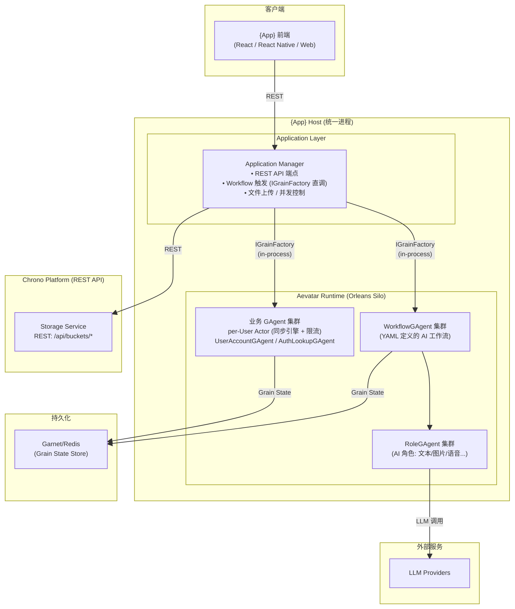
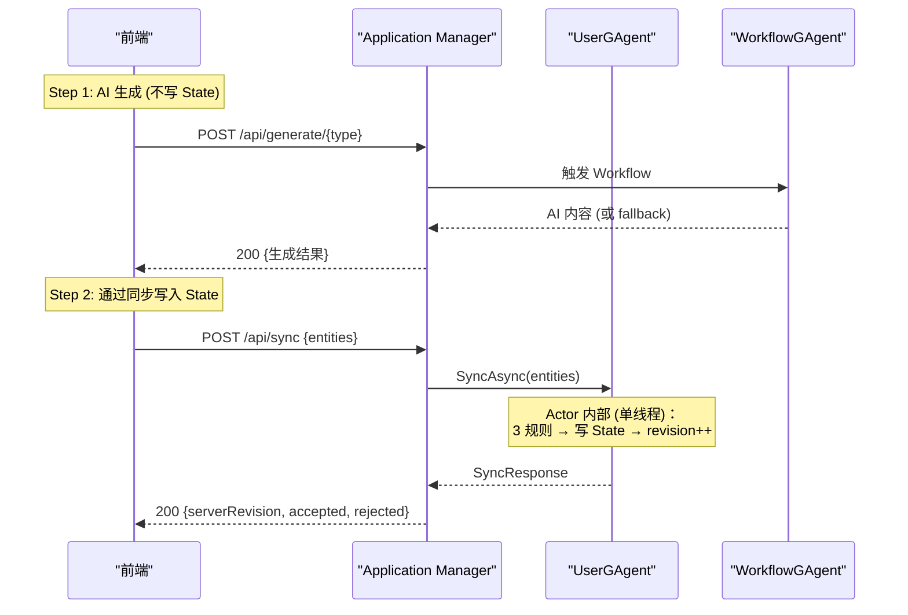

# 基于 Aevatar 框架的通用 Web 应用架构方案

> 将任意 Web 后端重构为 .NET (ASP.NET Core + Orleans + Aevatar WorkflowGAgent) 统一 Host 架构

---

## 1. 概述

### 1.1 核心理念

Aevatar 平台以 Actor 模型（Orleans Grain）为运行时基础，提供以下开箱即用能力：

- **DB 零迁移** — Protobuf State + `google.protobuf.Struct` 存储任意业务数据，新增字段/实体类型无需改 schema
- **并发自动处理** — per-User Actor 单线程执行，天然原子，不需要锁/事务/幂等缓存
- **提交即部署** — Docker + Kubernetes + Orleans 滚动更新，Grain 自动迁移
- **AI 声明式接入** — YAML Workflow 定义 AI 能力，运行时可切换 LLM Provider

### 1.2 设计哲学

```
判断标准: 这个功能需要"理解力"还是只需要"搬运"？

需要理解力（AI 判断）→ Agent 层（WorkflowGAgent + RoleGAgent）
  • 文本生成、图片生成、语音合成、智能分析...

只需要搬运（纯 CRUD / 同步 / 应用逻辑）→ Application Service（Host 内）
  • 实体同步引擎、状态加载、用户管理、限流、文件上传...

通用基础设施 → Chrono Platform
  • 对象存储、通知服务...

不需要的 → 直接删除
  • 旧版兼容接口、旧数据库代码...
```

### 1.3 新旧架构对照

| 旧实现 | 新实现 |
|--------|--------|
| Node.js / Python / Go Web 框架 | ASP.NET Core Minimal API (.NET 10) |
| 关系型/文档型数据库 | GAgent State (Protobuf) + Garnet/Redis |
| 过程式 Service 类 | DDD 分层：GAgents / Application / Host.Api |
| 手写 AI 调用 | WorkflowGAgent + RoleGAgent（YAML 声明式） |
| 手写同步/幂等逻辑 | 实体同步协议 v6.1（Actor 单线程天然幂等） |
| 环境变量直连 LLM | Aevatar LLM Provider + Connector 配置 |

---

## 2. 统一 Host 架构

### 2.1 架构概览



### 2.2 Host 引导流程

```csharp
// {App}.Host.Api / Program.cs
var builder = WebApplication.CreateBuilder(args);

// ── Aevatar Runtime (Orleans Silo) ──
builder.AddAevatarDefaultHost(options =>
{
    options.ServiceName = "{App}.Host.Api";
    options.EnableWebSockets = true;
    options.EnableConnectorBootstrap = true;
    options.EnableActorRestoreOnStartup = true;
});
builder.AddDistributedOrleansHost();
builder.AddWorkflowCapabilityWithAIDefaults();

// ── Application Layer ──
builder.Services.AddAppAuth();        // 认证
builder.Services.AddAppServices();    // 业务服务

var app = builder.Build();
app.UseCors();
app.UseAevatarDefaultHost();
app.UseAppAuth();
app.MapAppEndpoints();
app.Run();
```

**统一 Host 优势：** in-process 直调零网络开销，Orleans 自动负载均衡，运维简化为单一进程。

---

## 3. WorkflowGAgent AI 能力

### 3.1 模式

每种 AI 能力对应一个独立 WorkflowGAgent，通过 YAML 声明式定义：

```yaml
# workflows/{capability}.yaml
name: {capability_name}
description: "{能力描述}"

roles:
  - id: {role_id}
    name: "{角色名}"
    system_prompt: ""
    temperature: 0.7
    max_tokens: 500

steps:
  - id: generate
    type: llm_call          # 或 connector_call
    role: {role_id}
```

### 3.2 同步集成

Application Service 通过 `IWorkflowRunCommandService.ExecuteAsync` 桥接同步 API 与异步 Workflow：

```csharp
public async Task<TResult> GenerateAsync(string prompt, CancellationToken ct)
{
    var accumulated = new StringBuilder();

    var result = await _workflowRunCommandService.ExecuteAsync(
        new WorkflowChatRunRequest(prompt, "{workflow_name}", null),
        (frame, token) =>
        {
            if (frame.Delta != null)
                accumulated.Append(frame.Delta);
            return ValueTask.CompletedTask;
        },
        ct: ct);

    if (result.Error != WorkflowChatRunStartError.None)
        return Fallback();

    return Parse(accumulated.ToString()) ?? Fallback();
}
```

---

## 4. 领域模型：实体同步协议 v6.1

### 4.1 核心概念

所有业务数据统一为扁平实体 `SyncEntity`，通过 `entityType` 区分语义，通过 `refs` 建立父子关系。

```protobuf
message AppState {
  map<string, SyncEntity> entities = 1;  // clientId → entity
  SyncMeta meta = 2;
}

message SyncEntity {
  string client_id = 1;
  string entity_type = 2;
  string user_id = 3;
  int32 revision = 4;
  map<string, string> refs = 5;         // 父子关系
  int32 position = 6;
  google.protobuf.Struct inputs = 7;    // 任意输入 JSON
  google.protobuf.Struct output = 8;    // 任意输出 JSON
  google.protobuf.Struct state = 9;     // 任意状态 JSON
  google.protobuf.Timestamp deleted_at = 10;
  google.protobuf.Timestamp created_at = 11;
  google.protobuf.Timestamp updated_at = 12;
}

message SyncMeta {
  string user_id = 1;
  int32 revision = 2;
}
```

**关键特性：`inputs`、`output`、`state` 都用 `google.protobuf.Struct`（动态 JSON），新增 entityType 无需改 schema。**

### 4.2 同步协议 — 3 条规则

```
实体同步协议 v6.1:

  1. 新建: 实体不在 State 且 revision === 0 → 插入并分配新 revision
  2. 更新: 实体在 State 且 revision === 已存储.revision → 更新并分配新 revision
  3. 过期: 其他所有情况 → 拒绝，返回原因

幂等性保证:
  - Actor 单线程执行：同一用户的请求串行处理，不存在并发 race condition
  - 3 规则天然幂等：重复发送的实体（旧 revision）被规则 3 拒绝
  - 不需要幂等缓存
```

### 4.3 同步 API

```
GET  /api/state    → 初始状态 (EntityMap + serverRevision)
POST /api/sync     → 实体同步 (v6.1 协议)
```

**为什么 per-User GAgent：** 同步协议的核心是 revision 比较和原子递增，所有实体共享同一 revision 计数器，天然适合放在同一 Actor。per-Entity Actor 会引入跨 Grain 分布式事务问题。

---

## 5. 项目结构模板

```
apps/{app-name}/
├── src/
│   ├── {App}.GAgents/                    # GAgent 层 (Actor + Protobuf + 业务规则)
│   │   ├── {App}.GAgents.csproj
│   │   ├── Proto/                        # Protobuf 定义 (State + Events)
│   │   ├── Rules/                        # 同步规则
│   │   ├── Policies/                     # 限额策略
│   │   └── *GAgent.cs                    # Actor 实现
│   │
│   ├── {App}.Application/                # 应用层 (API 到 GAgent 的桥接)
│   │   ├── {App}.Application.csproj
│   │   ├── Contracts/                    # DTO
│   │   ├── Services/                     # Application Service
│   │   ├── Validation/                   # FluentValidation
│   │   └── Auth/                         # 认证服务
│   │
│   └── {App}.Host.Api/                   # 宿主层
│       ├── {App}.Host.Api.csproj
│       ├── Program.cs                    # Bootstrap
│       ├── Hosting/                      # Orleans 配置
│       ├── Endpoints/                    # Minimal API 端点
│       └── appsettings.json
│
├── workflows/                            # YAML Workflow 定义
├── test/                                 # 测试项目 (与 src/ 对应)
└── docs/
```

**依赖关系：Host.Api → Application → GAgents → Aevatar.Foundation.Core**

---

## 6. 数据流与持久化

### 6.1 典型数据流（AI 生成 + 同步存储）



### 6.2 持久化策略

| 数据 | 存储位置 | 说明 |
|------|---------|------|
| 所有业务数据 | `UserGAgent.State.entities` | Protobuf `map<string, SyncEntity>` |
| 同步元数据 | `UserGAgent.State.meta` | revision 计数器 |
| 用户账户 | `UserAccountGAgent.State` | Protobuf |
| 认证索引 | `AuthLookupGAgent.State` | per-key Grain |
| 文件 | Chrono Storage | S3/MinIO |

**零迁移：** Protobuf 向前/向后兼容 + Struct 存储任意 JSON + 新增 entityType 无需改数据结构。

---

## 7. 认证架构

### 7.1 模式

**Token-first, 隐式注册：**
1. 用户从外部获取 token（Firebase / 自签发 Trial）
2. Auth middleware 验证 token → 自动查找或创建用户 → 注入请求上下文
3. 没有显式登录端点，首次 API 调用即隐式注册

### 7.2 认证查找 GAgent

```
AuthLookupGAgent (per lookup key):
  key 格式: "firebase:{uid}" / "trial:{trialId}" / "email:{email}"
  State:  { lookup_key, user_id }

findOrCreateUser 流程:
  1. AuthLookupGAgent({provider}:{id}).GetUserIdAsync()
  2. 找到 → UpdateLoginAsync()
  3. 未找到 → AuthLookupGAgent(email:{email}).GetUserIdAsync()
     3a. 找到 → LinkProviderAsync() (跨 provider 关联)
     3b. 未找到 → CreateAsync() (新建用户)
```

ASP.NET Core 实现：`AddAuthentication()` 注册多 scheme（Firebase RS256 + Trial HS256），通过 `IAuthenticationSchemeProvider` 路由选择。

---

## 8. 关键设计决策

### 8.1 为什么用 GAgent 而不是 PostgreSQL？

| 考量 | PostgreSQL | GAgent State (Garnet/Redis) |
|------|------------|---------------------------|
| 与 Aevatar 生态一致性 | 需额外引入 EF Core | 原生 Orleans Grain State |
| 事务保证 | `SELECT FOR UPDATE` | Actor 单线程，天然原子 |
| 幂等性 | 需要幂等缓存 | 3 规则天然幂等 |
| 查询性能 | 磁盘 I/O | 内存直接操作 |
| 运维复杂度 | 额外 DB 实例 | 复用 Aevatar Runtime |
| Schema 演进 | Migration | Protobuf 向前/向后兼容 |

**取舍：** GAgent State 不适合复杂跨用户查询，但 per-user 查询模式完美适配。需要全局分析时通过 Projection Pipeline 异步投影到读模型。

**为什么 WorkflowGAgent 而不是直接调 LLM：** 统一 LLM Provider、YAML 声明式可配置、Projection Pipeline 自动记录、扩展只改 YAML 不改代码。

---

## 9. 通用化路径

### 9.1 当前能力 vs 终极愿景

| 能力 | 当前状态 | 说明 |
|------|---------|------|
| DB 零迁移 | **已就绪** | Protobuf + Struct，新增 entityType 无需改 schema |
| 并发自动处理 | **已就绪** | Actor 单线程，开发者不感知并发 |
| AI 声明式接入 | **已就绪** | YAML Workflow，运行时切换 |
| 提交即部署 | **CI/CD 可达** | Docker + K8s + Orleans 滚动更新 |
| 任意 Web 应用接入 | **模板化** | 每个应用仍需手写 Endpoint/AppService |

### 9.2 实体同步协议作为通用数据层

实体同步协议 v6.1 是通用化的核心——它让任何 Web 前端只需：

1. 定义 `entityType`（前端决定，服务端无感知）
2. `POST /api/sync` 提交数据（3 规则处理）
3. `GET /api/state` 拉取状态（按 entityType 分组）

**不需要写任何后端数据层代码。**

### 9.3 从模板到平台的演进方向

当前（模板模式）：每个 App 手写 Endpoint → AppService → GAgent。未来（平台模式）：任意前端 → 通用 Sync API → 通用 SyncGAgent + YAML Workflow + 通用 Auth。

---

## 10. 技术栈

| 层级 | 技术 |
|------|------|
| 运行时 | .NET 10 |
| Web 框架 | ASP.NET Core Minimal API |
| 数据持久化 | GAgent State (Protobuf) + Garnet/Redis |
| AI | Aevatar LLM Provider (MEAI) + Connector |
| 对象存储 | Chrono Storage |
| 认证 | ASP.NET Core Authentication |
| 同步 | 实体同步协议 v6.1 |
| 部署 | Docker + Kubernetes |
