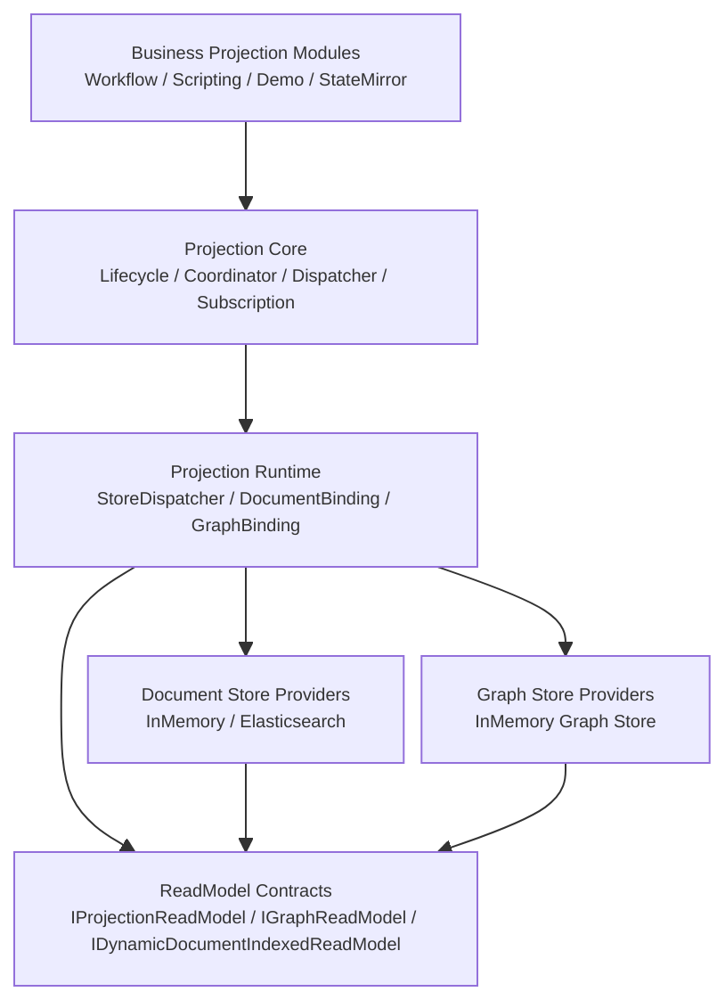
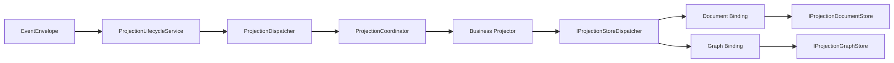
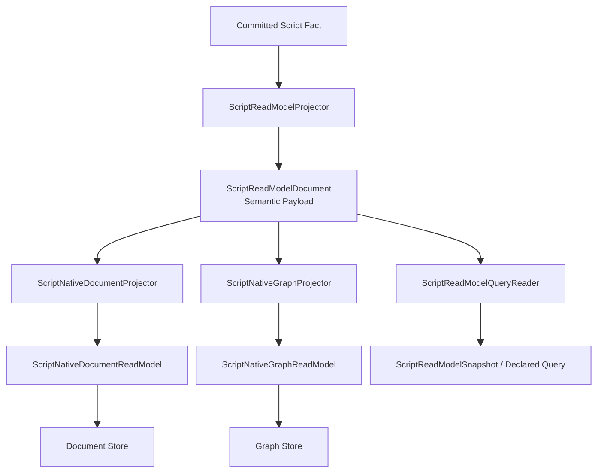
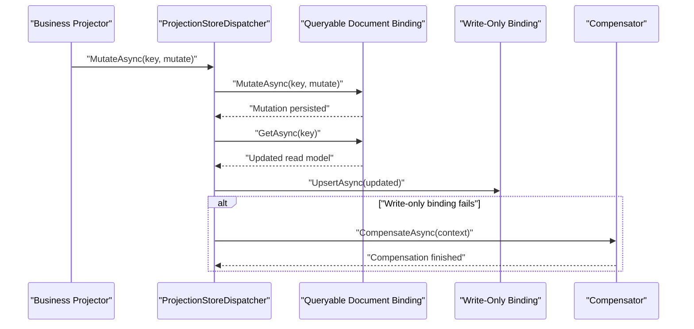

# CQRS Projection ReadModels Architecture

## Purpose

This document explains how the `src/Aevatar.CQRS.Projection.Stores.Abstractions/Abstractions/ReadModels` contracts work, how they are assembled by the projection runtime, how concrete providers persist them, and how business modules such as Workflow, Scripting, StateMirror, and the Case demo consume the same contracts.

The focus is the working architecture around these types:

- `IProjectionReadModel`
- `IProjectionReadModelCloneable<TReadModel>`
- `IProjectionDocumentStore<TReadModel, TKey>`
- `IProjectionDocumentMetadataProvider<TReadModel>`
- `DocumentIndexMetadata`
- `IDynamicDocumentIndexedReadModel`
- `IGraphReadModel`

Related graph contracts from the same abstraction package are included because `IGraphReadModel` depends on them and the runtime treats document and graph persistence as parallel write targets.

## Scope

Primary code scope:

- `src/Aevatar.CQRS.Projection.Stores.Abstractions/Abstractions/ReadModels`
- `src/Aevatar.CQRS.Projection.Stores.Abstractions/Abstractions/Graphs`
- `src/Aevatar.CQRS.Projection.Runtime.Abstractions`
- `src/Aevatar.CQRS.Projection.Runtime`
- `src/Aevatar.CQRS.Projection.Providers.InMemory`
- `src/Aevatar.CQRS.Projection.Providers.Elasticsearch`

Business-side examples:

- `src/workflow/Aevatar.Workflow.Projection`
- `src/Aevatar.Scripting.Projection`
- `src/Aevatar.CQRS.Projection.StateMirror`
- `demos/Aevatar.Demos.CaseProjection`

## Design Summary

The architecture splits responsibilities into four layers:

1. `Stores.Abstractions`
   Defines the minimum contracts for read-model identity, document persistence, graph persistence, and index metadata.
2. `Projection.Core`
   Delivers event envelopes to projector implementations and manages projection session lifecycle.
3. `Projection.Runtime`
   Bridges projectors to stores by fan-out dispatching one read model into one or more store bindings.
4. Business projection modules
   Define concrete read models, reducers, projectors, metadata providers, query readers, and API adapters.

The key design choice is:

- projectors know business semantics
- runtime knows dispatch semantics
- stores know persistence semantics

No layer is supposed to own all three.

## Layered Architecture

## ReadModels Abstraction Layer

### 1. `IProjectionReadModel`

File: `src/Aevatar.CQRS.Projection.Stores.Abstractions/Abstractions/ReadModels/IProjectionReadModel.cs`

Responsibilities:

- defines the minimum identity contract for any persisted read model
- requires only `string Id`
- does not impose timestamps, versions, or payload shape

Implication:

- business modules are free to define minimal models
- metadata fields such as `StateVersion` or `UpdatedAt` are conventions, not framework-enforced requirements

### 2. `IProjectionReadModelCloneable<TReadModel>`

File: `src/Aevatar.CQRS.Projection.Stores.Abstractions/Abstractions/ReadModels/IProjectionReadModelCloneable.cs`

Responsibilities:

- lets providers clone read models without relying on generic JSON round-tripping
- is mainly used by the in-memory document store for defensive copying

Practical effect:

- if a read model implements this interface, `InMemoryProjectionDocumentStore` will use `DeepClone()`
- otherwise the provider falls back to `System.Text.Json` serialize/deserialize cloning

### 3. `IProjectionDocumentStore<TReadModel, TKey>`

File: `src/Aevatar.CQRS.Projection.Stores.Abstractions/Abstractions/ReadModels/IProjectionDocumentStore.cs`

Responsibilities:

- persists document-shaped read models
- supports four operations:
  - `UpsertAsync`
  - `MutateAsync`
  - `GetAsync`
  - `ListAsync`

Semantics:

- `UpsertAsync` writes a full read-model snapshot
- `MutateAsync` applies an in-place mutation identified by key
- `GetAsync` and `ListAsync` are query-side capabilities

Important boundary:

- the abstraction does not define concurrency policy
- concrete providers decide how mutation safety is implemented

### 4. `IProjectionDocumentMetadataProvider<TReadModel>`

File: `src/Aevatar.CQRS.Projection.Stores.Abstractions/Abstractions/ReadModels/IProjectionDocumentMetadataProvider.cs`

Responsibilities:

- supplies index metadata for a read-model type
- returns `DocumentIndexMetadata`

This is store-side metadata, not business payload.

### 5. `DocumentIndexMetadata`

File: `src/Aevatar.CQRS.Projection.Stores.Abstractions/Abstractions/ReadModels/DocumentIndexMetadata.cs`

Fields:

- `IndexName`
- `Mappings`
- `Settings`
- `Aliases`

Meaning:

- tells a document provider how to initialize or address storage
- is consumed by the runtime/provider path, not by business reducers

### 6. `IDynamicDocumentIndexedReadModel`

File: `src/Aevatar.CQRS.Projection.Stores.Abstractions/Abstractions/ReadModels/IDynamicDocumentIndexedReadModel.cs`

Responsibilities:

- lets one read-model type choose index scope dynamically per instance
- exposes:
  - `DocumentIndexScope`
  - `DocumentMetadata`

This is used by Elasticsearch dynamic indexing to derive the actual target index from the read-model instance.

### 7. `IGraphReadModel`

File: `src/Aevatar.CQRS.Projection.Stores.Abstractions/Abstractions/ReadModels/IGraphReadModel.cs`

Responsibilities:

- marks a read model as graph-materializable
- exposes:
  - `GraphScope`
  - `GraphNodes`
  - `GraphEdges`

Effect:

- the runtime can write the same logical read model into a graph store in parallel with document persistence

## Graph Contracts That Work With `IGraphReadModel`

Files under `src/Aevatar.CQRS.Projection.Stores.Abstractions/Abstractions/Graphs`

Core types:

- `ProjectionGraphNode`
- `ProjectionGraphEdge`
- `ProjectionGraphQuery`
- `ProjectionGraphSubgraph`
- `ProjectionGraphDirection`
- `IProjectionGraphStore`

These types define:

- graph write operations
- owner-based cleanup support
- neighbor query support
- subgraph query support

`IGraphReadModel` is therefore not a separate persistence model family. It is an adapter contract that lets one read model produce graph nodes and edges.

## Upstream Projection Core

The read-model contracts do not receive events directly. Upstream orchestration comes from `Aevatar.CQRS.Projection.Core`.

Main contracts:

- `IProjectionProjector<TContext, TTopology>`
- `IProjectionEventReducer<TReadModel, TContext>`
- `IProjectionLifecycleService<TContext, TCompletion>`

Main implementations:

- `ProjectionLifecycleService<TContext, TCompletion>`
- `ProjectionCoordinator<TContext, TTopology>`
- `ProjectionDispatcher<TContext, TTopology>`
- `ProjectionSessionEventHub<TEvent>`

Role split:

- `ProjectionLifecycleService` starts, stops, and completes a projection session
- `ProjectionDispatcher` forwards one envelope to the coordinator
- `ProjectionCoordinator` runs all registered projectors in registration order
- business projector decides how to mutate or create read models

## End-to-End Write Path

Detailed behavior:

1. a stream or actor subscription produces an `EventEnvelope`
2. `ProjectionLifecycleService` routes the envelope to the dispatcher
3. `ProjectionDispatcher` delegates to `ProjectionCoordinator`
4. `ProjectionCoordinator` executes each registered projector
5. the business projector transforms context + event into a concrete read model
6. `IProjectionStoreDispatcher` fans the write out to all active bindings
7. bindings forward the write to concrete providers

## Runtime Layer

### `IProjectionStoreDispatcher<TReadModel, TKey>`

File: `src/Aevatar.CQRS.Projection.Runtime.Abstractions/Abstractions/Stores/IProjectionStoreDispatcher.cs`

Responsibilities:

- presents one unified store API to business projectors
- hides how many concrete store bindings exist behind it

Supported operations:

- `UpsertAsync`
- `MutateAsync`
- `GetAsync`
- `ListAsync`

### `IProjectionStoreBinding<TReadModel, TKey>`

File: `src/Aevatar.CQRS.Projection.Runtime.Abstractions/Abstractions/Stores/IProjectionStoreBinding.cs`

Responsibilities:

- represents one write target
- defines:
  - `StoreName`
  - `UpsertAsync`

### `IProjectionQueryableStoreBinding<TReadModel, TKey>`

File: `src/Aevatar.CQRS.Projection.Runtime.Abstractions/Abstractions/Stores/IProjectionQueryableStoreBinding.cs`

Responsibilities:

- extends a write binding with query capability
- adds:
  - `MutateAsync`
  - `GetAsync`
  - `ListAsync`

Important invariant:

- runtime allows at most one queryable binding per read-model type

### `IProjectionStoreBindingAvailability`

File: `src/Aevatar.CQRS.Projection.Runtime.Abstractions/Abstractions/Stores/IProjectionStoreBindingAvailability.cs`

Responsibilities:

- exposes whether a binding is active
- lets runtime log why a binding was skipped

### `IProjectionStoreDispatchCompensator<TReadModel, TKey>`

Files:

- `src/Aevatar.CQRS.Projection.Runtime.Abstractions/Abstractions/Stores/IProjectionStoreDispatchCompensator.cs`
- `src/Aevatar.CQRS.Projection.Runtime.Abstractions/Abstractions/Stores/ProjectionStoreDispatchCompensationContext.cs`
- `src/Aevatar.CQRS.Projection.Runtime/Runtime/LoggingProjectionStoreDispatchCompensator.cs`

Responsibilities:

- runs when multi-store dispatch partially succeeds and then fails
- receives failed store, succeeded stores, operation, read model, and exception

Default behavior:

- logs the compensation event
- business modules can replace it with durable replay or outbox-based compensation

### `ProjectionStoreDispatcher<TReadModel, TKey>`

File: `src/Aevatar.CQRS.Projection.Runtime/Runtime/ProjectionStoreDispatcher.cs`

Behavior:

1. filters bindings by `IProjectionStoreBindingAvailability`
2. fails fast if zero bindings remain
3. enforces max one queryable binding
4. writes `UpsertAsync` to all active bindings
5. executes `MutateAsync` against the query binding first
6. reads the updated snapshot back from the query binding
7. upserts that updated snapshot into write-only bindings
8. retries writes per binding according to `ProjectionStoreDispatchOptions.MaxWriteAttempts`
9. triggers compensator on partial failure

This means `MutateAsync` is intentionally asymmetric:

- one store is authoritative for in-place mutation and readback
- all other stores are projection copies of that authoritative result

## Runtime Bindings

### Document Binding

File: `src/Aevatar.CQRS.Projection.Runtime/Runtime/ProjectionDocumentStoreBinding.cs`

Behavior:

- wraps `IProjectionDocumentStore<TReadModel, TKey>`
- is both write-capable and query-capable
- reports inactive when no document store service is registered

Meaning:

- this is usually the single queryable binding in the system

### Graph Binding

File: `src/Aevatar.CQRS.Projection.Runtime/Runtime/ProjectionGraphStoreBinding.cs`

Behavior:

- activates only when:
  - an `IProjectionGraphStore` exists
  - `TReadModel` implements `IGraphReadModel`
- normalizes graph scope, node IDs, edge IDs, and properties
- adds managed properties:
  - `projectionManaged = true`
  - `projectionOwnerId = <read-model-type>:<read-model-id>`
- upserts nodes and edges
- lists existing managed graph artifacts by owner
- deletes stale edges
- deletes stale nodes only when they have no neighbors

This binding turns graph persistence into a lifecycle-managed projection sink rather than a pure append sink.

## Metadata Resolution Path

`ProjectionDocumentMetadataResolver`

File: `src/Aevatar.CQRS.Projection.Runtime/Runtime/ProjectionDocumentMetadataResolver.cs`

Behavior:

- resolves `IProjectionDocumentMetadataProvider<TReadModel>` from DI
- returns the `DocumentIndexMetadata` associated with the read-model type

This resolver is what connects business-specific metadata providers to store implementations.

## DI Assembly of Runtime

File: `src/Aevatar.CQRS.Projection.Runtime/DependencyInjection/ServiceCollectionExtensions.cs`

`AddProjectionReadModelRuntime()` registers:

- `ProjectionStoreDispatchOptions`
- `IProjectionStoreDispatchCompensator<,>`
- `IProjectionStoreDispatcher<,>`
- `IProjectionQueryableStoreBinding<,>` as document binding
- `IProjectionStoreBinding<,>` for document binding
- `IProjectionStoreBinding<,>` for graph binding
- `IProjectionDocumentMetadataResolver`

This is the standard assembly point that business modules reuse.

## InMemory Provider

### Document Store

File: `src/Aevatar.CQRS.Projection.Providers.InMemory/Stores/InMemoryProjectionDocumentStore.cs`

Behavior:

- stores read models in a process-local dictionary
- key is resolved via injected `keySelector`
- `UpsertAsync` stores a cloned snapshot
- `MutateAsync` mutates the in-memory object under lock
- `GetAsync` and `ListAsync` return clones
- cloning prefers `IProjectionReadModelCloneable<TReadModel>`
- otherwise uses JSON round-trip cloning

Why clone:

- prevents callers from mutating the provider's internal state accidentally

### Graph Store

File: `src/Aevatar.CQRS.Projection.Providers.InMemory/Stores/InMemoryProjectionGraphStore.cs`

Behavior:

- stores nodes and edges in memory keyed by `scope:id`
- supports owner-based listing for graph binding cleanup
- supports neighbor queries and bounded BFS-like subgraph expansion
- returns clones of graph records

Use case:

- default development and tests
- simple graph read path for workflow graph queries

## Elasticsearch Provider

File: `src/Aevatar.CQRS.Projection.Providers.Elasticsearch/Stores/ElasticsearchProjectionDocumentStore.cs`

### Responsibilities

- persists document read models into Elasticsearch
- auto-creates index from `DocumentIndexMetadata`
- supports optimistic concurrency for `MutateAsync`
- optionally supports dynamic index selection per read model

### How index metadata is used

Files:

- `ElasticsearchProjectionDocumentStore.cs`
- `ElasticsearchProjectionDocumentStore.Indexing.cs`
- `ElasticsearchProjectionDocumentStoreMetadataSupport.cs`
- `ElasticsearchProjectionDocumentStorePayloadSupport.cs`

Flow:

1. constructor receives a `DocumentIndexMetadata`
2. metadata is normalized
3. index name is built from `IndexPrefix + IndexName`
4. if auto-create is enabled, provider PUTs the index using:
   - `Mappings`
   - `Settings`
   - `Aliases`

### Mutation model

`MutateAsync`:

1. reads current document with `_seq_no` and `_primary_term`
2. applies caller mutation
3. writes back with OCC query parameters
4. retries on conflict until configured retry limit

### Dynamic indexing

If `TReadModel` implements `IDynamicDocumentIndexedReadModel`:

- write target index is resolved from `DocumentIndexScope` or `DocumentMetadata.IndexName`
- provider can persist to different indices per instance
- `GetAsync`, `ListAsync`, and `MutateAsync` are blocked because one static query index no longer exists

This makes dynamic indexing a write-oriented partitioning feature, not a normal queryable document-store mode.

## ReadModels Business Patterns

The repository currently uses the read-model abstractions in four main ways.

### Pattern A: Workflow Execution Read Model

Main files:

- `src/workflow/Aevatar.Workflow.Projection/ReadModels/WorkflowExecutionReadModel.Partial.cs`
- `src/workflow/Aevatar.Workflow.Projection/workflow_projection_transport.proto`
- `src/workflow/Aevatar.Workflow.Projection/Projectors/WorkflowExecutionReadModelProjector.cs`
- `src/workflow/Aevatar.Workflow.Projection/Reducers/*.cs`
- `src/workflow/Aevatar.Workflow.Projection/Orchestration/WorkflowProjectionQueryReader.cs`

How it works:

1. `WorkflowExecutionReadModelProjector.InitializeAsync()` creates a `WorkflowExecutionReport`
2. reducers such as `StartWorkflowEventReducer`, `StepRequestEventReducer`, and `StepCompletedEventReducer` mutate the report
3. the projector uses `IProjectionStoreDispatcher<WorkflowExecutionReport, string>`
4. document binding persists the full report
5. graph binding derives graph nodes and edges from the same report because it implements `IGraphReadModel`
6. `WorkflowProjectionQueryReader` reads the document store and graph store and maps them into query DTOs

`WorkflowExecutionReport` is therefore:

- a document read model
- a graph read model
- the source for query snapshots

Workflow DI assembly:

- `AddWorkflowExecutionProjectionCQRS()` registers `AddProjectionReadModelRuntime()`
- registers metadata providers for `WorkflowExecutionReport` and `WorkflowActorBindingDocument`
- registers the business projector, reducers, query reader, and projection port services

### Pattern B: Workflow Actor Binding Read Model

Main files:

- `src/workflow/Aevatar.Workflow.Projection/workflow_actor_binding_document.proto`
- `src/workflow/Aevatar.Workflow.Projection/Projectors/WorkflowActorBindingProjector.cs`

How it works:

- the projector listens for bind events
- it mutates one `WorkflowActorBindingDocument`
- the document is persisted through the same dispatcher/runtime path
- no graph binding is involved because it does not implement `IGraphReadModel`

This is the simplest "document-only business read model" inside workflow projection.

### Pattern C: Scripting Semantic, Authority, and Native Read Models

Main files:

- `src/Aevatar.Scripting.Projection/script_projection_read_models.proto`
- `src/Aevatar.Scripting.Projection/ReadModels/ScriptProjectionReadModels.Partial.cs`
- `src/Aevatar.Scripting.Projection/Projectors/ScriptReadModelProjector.cs`
- `src/Aevatar.Scripting.Projection/Projectors/ScriptDefinitionSnapshotProjector.cs`
- `src/Aevatar.Scripting.Projection/Projectors/ScriptCatalogEntryProjector.cs`
- `src/Aevatar.Scripting.Projection/Projectors/ScriptNativeDocumentProjector.cs`
- `src/Aevatar.Scripting.Projection/Projectors/ScriptNativeGraphProjector.cs`
- `src/Aevatar.Scripting.Projection/Queries/ScriptReadModelQueryReader.cs`

Scripting uses multiple read-model flavors:

- `ScriptReadModelDocument`
  - semantic read-model payload as `Any`
- `ScriptDefinitionSnapshotDocument`
  - definition authority snapshot
- `ScriptCatalogEntryDocument`
  - catalog state
- `ScriptEvolutionReadModel`
  - proposal/evolution status
- `ScriptNativeDocumentReadModel`
  - dynamically indexed flattened document form
- `ScriptNativeGraphReadModel`
  - graph form for relations

How the semantic path works:

1. `ScriptReadModelProjector` receives a committed fact
2. it resolves the script artifact
3. it unpacks the existing semantic read model
4. behavior reduces the semantic read model
5. projector persists `ScriptReadModelDocument`

How the native document path works:

1. `ScriptNativeDocumentProjector` consumes the semantic document plus materialization plan
2. `ScriptNativeDocumentMaterializer` extracts selected fields
3. result is persisted as `ScriptNativeDocumentReadModel`
4. if dynamic indexing is enabled, Elasticsearch picks index per instance

How the native graph path works:

1. `ScriptNativeGraphProjector` consumes the semantic document plus graph materialization plan
2. `ScriptNativeGraphMaterializer` builds owner node, target nodes, and relation edges
3. graph binding writes the resulting `ScriptNativeGraphReadModel` into graph storage

How query works:

1. `ScriptReadModelQueryReader` reads `ScriptReadModelDocument` from the document store
2. it wraps payload and projection stamps into `ScriptReadModelSnapshot`
3. it can execute declared script queries against the semantic payload

Scripting DI assembly:

- registers multiple metadata providers
- registers document-style and graph-style projectors side by side
- reuses the same runtime contracts as workflow

### Pattern D: StateMirror Generic Projection

Main files:

- `src/Aevatar.CQRS.Projection.StateMirror/Services/JsonStateMirrorProjection.cs`
- `src/Aevatar.CQRS.Projection.StateMirror/Services/StateMirrorReadModelProjector.cs`

How it works:

1. one state object is mirrored into a read model by JSON field projection
2. `StateMirrorReadModelProjector` calls the mirror projection
3. resulting read model is persisted with `IProjectionStoreDispatcher`

This pattern is useful when:

- no domain-specific reducer set is needed
- the read model is mostly a shaped mirror of state

### Pattern E: Case Projection Demo

Main files:

- `demos/Aevatar.Demos.CaseProjection.Abstractions/ReadModels/CaseProjectionReadModel.cs`
- `demos/Aevatar.Demos.CaseProjection/Projectors/CaseReadModelProjector.cs`
- `demos/Aevatar.Demos.CaseProjection/Stores/InMemoryCaseReadModelStore.cs`

How it works:

1. `CaseReadModelProjector` creates and mutates `CaseProjectionReadModel`
2. reducers update comments, owner, status, and timeline
3. read model is stored in an in-memory document store
4. no projection runtime fan-out is used here; the demo wires directly to one document store

This demo shows the minimal read-model pattern:

- one business projector
- one document store
- no graph sink
- no dynamic indexing

## Workflow End-to-End Example

```mermaid
%%{init: {"maxTextSize": 100000, "flowchart": {"useMaxWidth": false, "nodeSpacing": 10, "rankSpacing": 50}, "themeVariables": {"fontSize": "10px"}}}%%
flowchart LR
  A["WorkflowRun Envelope Stream"] --> B["ProjectionLifecycleService"]
  B --> C["ProjectionCoordinator"]
  C --> D["WorkflowExecutionReadModelProjector"]
  D --> E["WorkflowExecutionReport"]
  E --> F["ProjectionStoreDispatcher"]
  F --> G["ProjectionDocumentStoreBinding"]
  F --> H["ProjectionGraphStoreBinding"]
  G --> I["Document Store"]
  H --> J["Graph Store"]
  I --> K["WorkflowProjectionQueryReader"]
  J --> K
  K --> L["Workflow Query API / Query Port"]
```

What this demonstrates:

- one business read model can drive two persistence targets
- query can combine document snapshot and graph subgraph
- runtime does not know workflow semantics, only store semantics

## Scripting End-to-End Example

What this demonstrates:

- one semantic document can be the source of multiple downstream read-model forms
- native document and native graph are materialized derivatives, not separate primary facts

## Mutation Sequence

`MutateAsync` is the most important runtime behavior to understand.

Key consequence:

- mutation authority always belongs to the single queryable binding
- all other bindings are replicas of the query-binding result

## How Metadata Providers Enter Real Business Flows

Typical pattern:

1. business module defines read-model type
2. business module defines `IProjectionDocumentMetadataProvider<TReadModel>`
3. module registers provider in DI
4. document store provider receives resolved `DocumentIndexMetadata`
5. provider creates or selects storage artifacts accordingly

Workflow example:

- `WorkflowExecutionReportDocumentMetadataProvider`
- `WorkflowActorBindingDocumentMetadataProvider`

Scripting example:

- `ScriptDefinitionSnapshotDocumentMetadataProvider`
- `ScriptCatalogEntryDocumentMetadataProvider`
- `ScriptReadModelDocumentMetadataProvider`
- `ScriptEvolutionReadModelMetadataProvider`
- `ScriptNativeDocumentReadModelMetadataProvider`

## Business Invariants Implied By This Architecture

### Invariant 1: Identity is framework-level, everything else is business-defined

Because `IProjectionReadModel` only requires `Id`, the framework cannot force:

- timestamps
- versions
- immutable payload structure
- query DTO separation

This is flexible, but it also means each module must be deliberate about what belongs in the persisted read model.

### Invariant 2: Query requires exactly one authoritative document binding

`ProjectionStoreDispatcher` allows many write targets, but only one queryable binding.

This means:

- document storage is treated as the authoritative query source
- graph storage is queryable only through dedicated graph readers, not through dispatcher generic `Get/List`

### Invariant 3: Graph persistence is derived, not independent

If a read model implements `IGraphReadModel`:

- graph nodes and edges are derived from that read model instance
- graph cleanup is managed by owner markers
- stale graph artifacts are removed during upsert

### Invariant 4: Dynamic index routing trades away generic queryability

If a read model implements `IDynamicDocumentIndexedReadModel` and uses Elasticsearch:

- writes can be partitioned per read-model instance
- generic `Get/List/Mutate` against one static index are no longer valid

## Practical Reading Guide

If you need to understand a concrete business projection quickly, read in this order:

1. read-model type and proto
2. metadata provider
3. projector
4. reducers or materializer
5. query reader
6. DI registration

For workflow:

- `WorkflowExecutionReadModel.Partial.cs`
- `workflow_projection_transport.proto`
- `WorkflowExecutionReportDocumentMetadataProvider.cs`
- `WorkflowExecutionReadModelProjector.cs`
- `Reducers/*.cs`
- `WorkflowProjectionQueryReader.cs`
- `DependencyInjection/ServiceCollectionExtensions.cs`

For scripting:

- `script_projection_read_models.proto`
- `ScriptProjectionReadModels.Partial.cs`
- `Metadata/*.cs`
- `ScriptReadModelProjector.cs`
- `ScriptNativeDocumentMaterializer.cs`
- `ScriptNativeGraphMaterializer.cs`
- `ScriptReadModelQueryReader.cs`
- `DependencyInjection/ServiceCollectionExtensions.cs`

## Current Strengths

- abstraction boundary between business projectors and storage providers is clear
- runtime fan-out allows one read model to feed document and graph sinks simultaneously
- graph binding includes lifecycle cleanup rather than append-only drift
- metadata provider mechanism keeps index initialization out of business projectors
- in-memory and Elasticsearch providers share the same document-store contract

## Current Tradeoffs

- the framework does not distinguish business facts from projection bookkeeping inside read-model payloads
- generic `MutateAsync` depends on one authoritative queryable store, which is simple but asymmetric
- dynamic document indexing is powerful for writes but intentionally weak for generic reads
- graph read/write shape is broad and property-bag oriented, so business modules must self-discipline their schema

## File Map

Core abstraction files:

- `src/Aevatar.CQRS.Projection.Stores.Abstractions/Abstractions/ReadModels`
- `src/Aevatar.CQRS.Projection.Stores.Abstractions/Abstractions/Graphs`

Runtime files:

- `src/Aevatar.CQRS.Projection.Runtime.Abstractions/Abstractions/Stores`
- `src/Aevatar.CQRS.Projection.Runtime/Runtime`

Providers:

- `src/Aevatar.CQRS.Projection.Providers.InMemory/Stores`
- `src/Aevatar.CQRS.Projection.Providers.Elasticsearch/Stores`

Business examples:

- `src/workflow/Aevatar.Workflow.Projection`
- `src/Aevatar.Scripting.Projection`
- `src/Aevatar.CQRS.Projection.StateMirror`
- `demos/Aevatar.Demos.CaseProjection`

## Short Conclusion

`ReadModels` in this repository are not only DTOs and not only storage documents. They are the central handoff object between business projection logic and persistence runtime.

The full path is:

- event stream
- projection core
- business projector
- runtime dispatcher
- document and graph bindings
- concrete store providers
- query readers and API adapters

Understanding these seven steps is enough to reason about almost every projection module in the repository.
