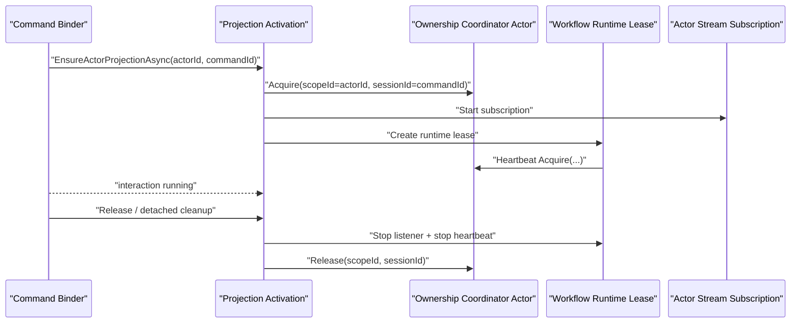

# 2026-03-15 CQRS Projection / ReadModel 一致性与并发分析

## 1. 结论先行

当前仓库里的 CQRS 读侧，不是“命令提交后立刻强一致可读”的模型，而是：

- `per actor ordered`
- `projection async materialized`
- `single read model eventually consistent`
- `multi-store non-atomic`

更具体地说：

1. 写侧的权威事实是 committed domain event，不是 read model。
2. 读侧的一致性建立在“committed fact 已进入 projection pipeline 并被对应 projector 成功写入目标 store”这个前提上。
3. `accepted receipt` 只代表命令已被接受投递，不代表 read model 已可见。
4. Workflow 已经把 `dispatch accepted`、`projection observed`、`terminal completion` 三个阶段拆开了；真正的 durable completion 依赖 query port 读取 read model，而不是依赖同步 ACK。
5. 文档存储与图存储并行写入，但不是单事务；`snapshot/timeline` 和 `graph` 之间天然可能出现读偏斜。
6. 当前实现对“投影失败后如何补偿”只覆盖了 store fan-out 失败的一部分场景，没有覆盖 projector/reducer 级失败后的自动重放。

如果直接回答“读的一致性如何确定”：

- 读一致性的判断标准不是“命令返回了”，而是 read model 自身是否已经携带足够的投影证据，例如 `LastCommandId / StateVersion / LastEventId / UpdatedAt / CompletionStatus`。
- 不同查询的保证强度取决于它读取的是哪个 read model、背后是哪种 provider，以及是否跨 document/graph 两类 store。

## 2. 分析范围

本文基于当前仓库代码，不讨论历史方案。核心范围如下：

- Projection Core
  - `src/Aevatar.CQRS.Projection.Core`
  - `src/Aevatar.CQRS.Projection.Core.Abstractions`
- Projection Runtime / Store
  - `src/Aevatar.CQRS.Projection.Runtime`
  - `src/Aevatar.CQRS.Projection.Runtime.Abstractions`
  - `src/Aevatar.CQRS.Projection.Stores.Abstractions`
  - `src/Aevatar.CQRS.Projection.Providers.InMemory`
  - `src/Aevatar.CQRS.Projection.Providers.Elasticsearch`
  - `src/Aevatar.CQRS.Projection.Providers.Neo4j`
- 业务投影
  - `src/workflow/Aevatar.Workflow.Projection`
  - `src/workflow/Aevatar.Workflow.Presentation.AGUIAdapter`
  - `src/Aevatar.Scripting.Projection`
  - `src/Aevatar.CQRS.Projection.StateMirror`
  - `src/Aevatar.AI.Projection`

## 3. 统一投影主链路

```mermaid
%%{init: {"maxTextSize": 100000, "flowchart": {"useMaxWidth": false, "nodeSpacing": 10, "rankSpacing": 50}, "themeVariables": {"fontSize": "10px"}}}%%
flowchart LR
    A["Command / Actor Turn"] --> B["PersistDomainEventAsync"]
    B --> C["EventStore Commit"]
    C --> D["CommittedStateEventPublished"]
    D --> E["Actor Self Stream"]
    E --> F["ProjectionSubscriptionRegistry"]
    F --> G["ProjectionEnvelopeNormalizer"]
    G --> H["ProjectionDispatcher"]
    H --> I["ProjectionCoordinator"]
    I --> J["Projector Branch 1<br/>ReadModel Projector"]
    I --> K["Projector Branch 2<br/>AGUI / Session Event Projector"]
    J --> L["ProjectionStoreDispatcher"]
    L --> M["Document Binding"]
    L --> N["Graph Binding"]
    M --> O["Document Reader / QueryPort"]
    N --> P["Graph Reader / QueryPort"]
    K --> Q["ProjectionSessionEventHub"]
    Q --> R["Live Sink / SSE / WS"]
```

这条链路的关键点有两个：

1. CQRS read model 和 AGUI/live event 没有各自维护第二条订阅链路，它们是同一个 `ProjectionCoordinator` 下的不同 projector 分支。
2. Projection 输入并不是“任意 envelope”，而是经过 `ProjectionEnvelopeNormalizer` 规范化之后的 envelope。

## 4. committed event 如何进入 projection pipeline

### 4.1 committed fact 的发布

写侧 actor 在 committed 之后，会把 committed state event 再包装成 `CommittedStateEventPublished` 发布到 observer publication：

- `src/Aevatar.Foundation.Core/GAgentBase.TState.cs:168-182`
- `src/Aevatar.Foundation.Runtime.Implementations.Local/Actors/LocalActorPublisher.cs:115-137`
- `src/Aevatar.Foundation.Runtime.Implementations.Orleans/Actors/OrleansGrainEventPublisher.cs:111-133`

这里的语义是：

1. 先 `EventStore` commit。
2. 再发布 `CommittedStateEventPublished`。
3. Projection 消费的是“已提交事实的可观察流”，不是未提交命令，也不是 query-time replay。

### 4.2 Projection 输入的规范化

`ProjectionEnvelopeNormalizer` 决定了哪些 envelope 会真正进入 projection 业务逻辑：

- `src/Aevatar.CQRS.Projection.Core/Orchestration/ProjectionEnvelopeNormalizer.cs:5-35`

规则如下：

1. `direct route` 直接丢弃，不参与 projection。
2. `topology publication` 原样通过。
3. `observer publication` 如果 payload 是 `CommittedStateEventPublished`，就解包为其中的 `StateEvent.EventData`，并把 timestamp 替换为 committed event 的 timestamp。
4. 其他 observer publication 直接透传。

因此，“committed event 如何进入 projection pipeline”的准确答案是：

- 不是 query 端去读 `IEventStore`。
- 不是 projector 自己回放历史事件。
- 而是 actor commit 后由 framework 主动发布 `CommittedStateEventPublished`，再由 normalizer 解包进入统一 projection 主链。

## 5. Projection Core 的职责边界

### 5.1 Lifecycle / Subscription / Dispatch / Coordinator

核心链路：

- `src/Aevatar.CQRS.Projection.Core/Orchestration/ProjectionLifecycleService.cs:24-40`
- `src/Aevatar.CQRS.Projection.Core/Orchestration/ProjectionSubscriptionRegistry.cs:30-125`
- `src/Aevatar.CQRS.Projection.Core/Orchestration/ProjectionDispatcher.cs:6-16`
- `src/Aevatar.CQRS.Projection.Core/Orchestration/ProjectionCoordinator.cs:13-48`

职责分解：

1. `ProjectionLifecycleService`
   - 负责 `Start -> Register -> Dispatch -> Stop / Complete`
2. `ProjectionSubscriptionRegistry`
   - 负责按 `RootActorId` 订阅 actor stream
   - 持有 context 内部的 `StreamSubscriptionLease`
3. `ProjectionDispatcher`
   - 单纯把 envelope 转给 coordinator
4. `ProjectionCoordinator`
   - 按注册顺序依次调用所有 projector
   - 单个 projector 失败不会阻断其他 projector，当轮调用结束后聚合为 `ProjectionDispatchAggregateException`

### 5.2 reducer 与 projector 的分工

抽象定义：

- `src/Aevatar.CQRS.Projection.Core.Abstractions/Abstractions/Pipeline/IProjectionEventReducer.cs:1-15`
- `src/Aevatar.CQRS.Projection.Core.Abstractions/Abstractions/Pipeline/IProjectionProjector.cs:1-13`

分工如下：

1. `Reducer`
   - 只负责“某一类事件是否会修改某个 read model”
   - 不负责订阅、不负责 store fan-out、不负责 session/live sink
2. `Projector`
   - 负责 envelope 级 orchestration
   - 可以读取旧 read model、执行 reducer、写回 read model、或者把事件映射到 session stream

Workflow 的 reducer 路由是精确 `TypeUrl` 匹配：

- `src/workflow/Aevatar.Workflow.Projection/Reducers/WorkflowExecutionEventReducerBase.cs:10-39`
- `src/workflow/Aevatar.Workflow.Projection/Projectors/WorkflowExecutionReadModelProjector.cs:31-37`
- `tools/ci/projection_route_mapping_guard.sh`

这保证了投影路由不是字符串包含判断，而是 protobuf `TypeUrl` 的精确键路由。

## 6. Runtime / Store 的职责边界

### 6.1 Store fan-out runtime

Runtime 只做“一次 read model upsert，分发到多个 store binding”：

- `src/Aevatar.CQRS.Projection.Runtime/Runtime/ProjectionStoreDispatcher.cs:6-167`
- `src/Aevatar.CQRS.Projection.Runtime/Runtime/ProjectionDocumentStoreBinding.cs:3-28`
- `src/Aevatar.CQRS.Projection.Runtime/Runtime/ProjectionGraphStoreBinding.cs:3-301`

边界非常清楚：

1. `Projector`
   - 决定“写什么 read model”
2. `ProjectionStoreDispatcher`
   - 决定“把同一个 read model 发给哪些 sink”
3. `DocumentStoreBinding`
   - 只是把 read model 传给 `IProjectionDocumentWriter<T>`
4. `GraphStoreBinding`
   - 先把 read model materialize 成 `nodes/edges`
   - 再调用 `IProjectionGraphStore`

### 6.2 文档存储与图存储不是单事务

`ProjectionStoreDispatcher.UpsertAsync` 是顺序执行多个 binding：

- `src/Aevatar.CQRS.Projection.Runtime/Runtime/ProjectionStoreDispatcher.cs:64-90`

这意味着：

1. `Document` 成功，`Graph` 失败，系统会进入部分成功状态。
2. 当前只对“binding 写失败”提供 compensator/outbox。
3. 不存在跨 document + graph 的原子事务边界。

Workflow 对这类部分成功有 durable compensation：

- `src/workflow/Aevatar.Workflow.Projection/Orchestration/WorkflowProjectionDurableOutboxCompensator.cs:23-56`

但它只补“store dispatch fan-out 失败”，不补 reducer/projector 级逻辑失败。

## 7. Query side 如何读 read model

### 7.1 Workflow QueryPort

Workflow 查询链路：

- `src/workflow/Aevatar.Workflow.Projection/Orchestration/WorkflowExecutionProjectionQueryService.cs:8-148`
- `src/workflow/Aevatar.Workflow.Projection/Orchestration/WorkflowProjectionQueryReader.cs:6-165`

读取规则：

1. `snapshot / projection state / timeline` 来自 document store
2. `graph edges / subgraph` 来自 graph store
3. `graph enriched snapshot` 是“先读 snapshot，再读 subgraph”的组合，不是原子读

因此 Workflow 的一致性不是单一等级，而是：

- 文档查询：单 document 快照一致
- 图查询：单 graph store 一致
- 文档 + 图组合查询：可能跨 store 读偏斜

### 7.2 Scripting QueryPort

Scripting 查询链路：

- `src/Aevatar.Scripting.Projection/Queries/ScriptReadModelQueryService.cs:6-29`
- `src/Aevatar.Scripting.Projection/Queries/ScriptReadModelQueryReader.cs:15-192`

特点：

1. `GetSnapshotAsync / ListSnapshotsAsync` 直接读 projection document
2. `ExecuteDeclaredQueryAsync` 也是先读 projection snapshot，再在内存中执行 behavior query
3. 它不读取 `IEventStore`，也不在 query 路径里补跑 materialization

这符合仓库规则里的“禁止 query-time replay / query-time materialization”。

### 7.3 Workflow binding 也是 projection read model

Workflow actor binding 不是 runtime query/reply，而是 projection document：

- `src/workflow/Aevatar.Workflow.Projection/Projectors/WorkflowActorBindingProjector.cs:32-77`
- `src/workflow/Aevatar.Workflow.Projection/Orchestration/ProjectionWorkflowActorBindingReader.cs:40-103`

这里唯一仍然访问 runtime 的地方，是 `ExistsAsync` 和 `IAgentTypeVerifier` 用来判断 actor 是否存在、是什么 kind；真正的 binding facts 仍来自 read model document，而不是 actor 内部状态侧读。

### 7.4 边界守卫

CI 明确禁止 query 路径读 `IEventStore` 或 inline 写回 read model：

- `tools/ci/cqrs_eventsourcing_boundary_guard.sh`

这意味着“Query -> ReadModel”的规则不仅是文档约定，而是有自动化门禁。

## 8. 一致性语义如何定义

### 8.1 一致性等级

| 阶段 | 真实含义 | 当前代码中的依据 |
|---|---|---|
| `accepted` | 命令已经进入 dispatch 主链 | CQRS command dispatch / interaction service |
| `live observed` | 当前交互会话已经看到了 terminal live event | `WorkflowRunCompletionPolicy` |
| `durable completion` | 读侧 snapshot 已能推断 terminal completion | `WorkflowRunDurableCompletionResolver` |
| `projection evidence visible` | read model 已至少投影过某些 runtime facts | `StateVersion / LastEventId / LastCommandId` |
| `cross-store converged` | document 与 graph 都完成写入且无补偿积压 | 当前没有统一原子契约，只能分别判断 |

对应代码：

- `src/workflow/Aevatar.Workflow.Application/Runs/WorkflowRunCompletionPolicy.cs:6-29`
- `src/workflow/Aevatar.Workflow.Application/Runs/WorkflowRunDurableCompletionResolver.cs:19-53`
- `src/workflow/Aevatar.Workflow.Application/Runs/WorkflowRunFinalizeEmitter.cs:29-52`
- `src/workflow/Aevatar.Workflow.Projection/ReadModels/WorkflowExecutionReadModelMapper.cs:7-38`

### 8.2 Workflow 用什么字段判断“读已经追上写”

Workflow 的 read model 里，最关键的证据字段是：

- `CommandId`
- `StateVersion`
- `LastEventId`
- `UpdatedAt`
- `CompletionStatus`

来源：

- `src/workflow/Aevatar.Workflow.Projection/Reducers/WorkflowExecutionProjectionMutations.cs:7-17`
- `src/workflow/Aevatar.Workflow.Projection/Reducers/WorkflowExecutionProjectionMutations.cs:53-71`
- `src/workflow/Aevatar.Workflow.Projection/ReadModels/WorkflowExecutionReadModel.Partial.cs:33-156`

其中：

1. `RecordProjectedEvent` 只在本次 reducer 确实 mutated 时才增加 `StateVersion`、刷新 `LastEventId`
2. `RefreshDerivedFields` 更新时间和聚合统计
3. QueryReader 再把这些字段映射为对外的 `WorkflowActorSnapshot / WorkflowActorProjectionState`

### 8.3 dispatch accepted 与 projection accepted 的分离

Workflow detached cleanup 不是拿同步 ACK 判断“已经投影成功”，而是显式读取 projection state：

- `src/workflow/Aevatar.Workflow.Projection/Orchestration/WorkflowRunDetachedCleanupOutboxGAgent.cs:479-518`

它的判断逻辑是：

1. `projectionState != null`
2. `StateVersion > 0` 或 `LastEventId` 非空
3. `LastCommandId` 为空或等于当前 `CommandId`

这说明仓库当前对“读已经看到写”的定义，是靠 read model 证据字段，而不是靠命令返回时间。

## 9. 并发控制模型

### 9.1 actor stream 顺序

`ActorStreamSubscriptionHub` 按 actorId 建立 stream 订阅：

- `src/Aevatar.CQRS.Projection.Core/Streaming/ActorStreamSubscriptionHub.cs:25-53`

Projection 在单个 subscription 回调里顺序处理 envelope。只要底层 actor stream 对同一 actor 保持顺序，那么单 projection session 内看到的 envelope 顺序就是 actor 输出顺序。

### 9.2 Workflow 的 ownership / lease / heartbeat

Workflow 是当前仓库里对投影并发控制最完整的实现：

- `src/Aevatar.CQRS.Projection.Core/Orchestration/ActorProjectionOwnershipCoordinator.cs:35-111`
- `src/Aevatar.CQRS.Projection.Core/Orchestration/ProjectionOwnershipCoordinatorGAgent.cs:25-99`
- `src/workflow/Aevatar.Workflow.Projection/Orchestration/WorkflowProjectionActivationService.cs:40-117`
- `src/workflow/Aevatar.Workflow.Projection/Orchestration/WorkflowExecutionRuntimeLease.cs:31-293`
- `src/workflow/Aevatar.Workflow.Projection/Orchestration/WorkflowProjectionReleaseService.cs:26-72`

语义如下：

1. `scopeId = actorId`
2. `sessionId = commandId`
3. 激活前先 `AcquireAsync(scopeId, sessionId)`
4. runtime lease 后台定期 heartbeat，按 TTL 续租
5. release 时停止 heartbeat、停止订阅、标记 read model stopped、释放 ownership

这套机制能避免“不同 command session 同时写同一个 workflow actor read model”的大部分情况，但它不是全局万能锁，下面的风险章节会讲它的边界。

### 9.3 session live sink 并发

live sink 的 attach/detach 由 `ProjectionRuntimeLeaseBase` 内部维护：

- `src/Aevatar.CQRS.Projection.Core/Orchestration/ProjectionRuntimeLeaseBase.cs:18-60`
- `src/Aevatar.CQRS.Projection.Core/Orchestration/EventSinkProjectionSessionSubscriptionManager.cs:20-54`
- `src/Aevatar.CQRS.Projection.Core/Streaming/ProjectionSessionEventHub.cs:26-113`

作用：

1. 解决一个 projection session 对多个 live sink 的 attach/detach 生命周期
2. 不让上层通过 `actorId -> context` 全局字典反查会话
3. 会话标识始终走显式 `ScopeId / SessionId`

### 9.4 store 层并发

#### InMemory provider

- `src/Aevatar.CQRS.Projection.Providers.InMemory/Stores/InMemoryProjectionDocumentStore.cs:16-133`
- `src/Aevatar.CQRS.Projection.Providers.InMemory/Stores/InMemoryProjectionGraphStore.cs:8-260`

特点：

1. 进程内 `lock`
2. 单次写入后本进程立即可见
3. 没有跨进程一致性语义
4. 没有 optimistic concurrency version check

#### Elasticsearch document provider

- `src/Aevatar.CQRS.Projection.Providers.Elasticsearch/Stores/ElasticsearchProjectionDocumentStore.cs:183-221`

特点：

1. 直接 `PUT index/_doc/{id}`
2. 没有版本前置条件
3. 没有 `refresh=wait_for`

这意味着：

1. store 语义是 last-writer-wins
2. 即便 `UpsertAsync` 返回成功，马上 query 也不一定立刻可见
3. 如果出现重复 projector 或并发 projector，会由最后一次写覆盖前一次写

#### Neo4j graph provider

- `src/Aevatar.CQRS.Projection.Providers.Neo4j/Stores/Neo4jProjectionGraphStore.Infrastructure.cs:60-95`

特点：

1. 单次写通过 Neo4j write session 提交
2. 对 graph 自身来说，提交后查询通常可见
3. 但它和 document provider 没有共同事务

## 10. 系统内几条实际的 projection / read model 分支

### 10.1 Workflow：read model 分支 + AGUI/live 分支共享同一输入

DI 装配：

- `src/workflow/Aevatar.Workflow.Projection/DependencyInjection/ServiceCollectionExtensions.cs:32-99`
- `src/workflow/Aevatar.Workflow.Infrastructure/DependencyInjection/WorkflowCapabilityServiceCollectionExtensions.cs:20-25`

共享主链的两个代表 projector：

- ReadModel projector
  - `src/workflow/Aevatar.Workflow.Projection/Projectors/WorkflowExecutionReadModelProjector.cs:11-128`
- Live event projector
  - `src/workflow/Aevatar.Workflow.Presentation.AGUIAdapter/WorkflowExecutionRunEventProjector.cs:14-54`

这正是仓库要求的“统一投影链路，一对多分发”。

### 10.2 Scripting：语义 read model + native document + native graph

DI 装配：

- `src/Aevatar.Scripting.Projection/DependencyInjection/ServiceCollectionExtensions.cs:28-128`

三个关键 projector：

- 语义 read model
  - `src/Aevatar.Scripting.Projection/Projectors/ScriptReadModelProjector.cs:16-158`
- native document
  - `src/Aevatar.Scripting.Projection/Projectors/ScriptNativeDocumentProjector.cs:16-121`
- native graph
  - `src/Aevatar.Scripting.Projection/Projectors/ScriptNativeGraphProjector.cs:16-121`

这里还有一个很重要的并发保护：

- `ScriptNativeDocumentProjector` 和 `ScriptNativeGraphProjector` 都要求 `context.CurrentSemanticReadModelDocument.StateVersion == fact.StateVersion`
- 对应代码：
  - `src/Aevatar.Scripting.Projection/Projectors/ScriptNativeDocumentProjector.cs:90-109`
  - `src/Aevatar.Scripting.Projection/Projectors/ScriptNativeGraphProjector.cs:90-109`

也就是说，native materialization 不是独立从事件重算，而是严格依附于同一轮语义 read model 归约结果。

### 10.3 StateMirror：结构镜像型 read model

- `src/Aevatar.CQRS.Projection.StateMirror/Services/StateMirrorReadModelProjector.cs:7-48`

它的边界很窄：

1. 输入是 state，不是 envelope stream
2. 输出仍然走 `IProjectionWriteDispatcher<TReadModel>`
3. 它适合结构镜像，不适合复杂业务语义

### 10.4 AI Projection：通用 reducer 层

- `src/Aevatar.AI.Projection/Reducers/ProjectionEventApplierReducerBase.cs:9-43`

它本身不持有 query 语义，只提供可复用 reducer/applier，供业务 read model projector 组合。

## 11. 当前一致性与并发风险

这一节是最重要的。

### 11.1 风险一：projector 失败会被记录，但不会自动阻断后续投影

证据：

- `ProjectionCoordinator` 聚合 projector failure
  - `src/Aevatar.CQRS.Projection.Core/Orchestration/ProjectionCoordinator.cs:19-41`
- `ProjectionSubscriptionRegistry` 捕获异常后仅 report/log，不重抛
  - `src/Aevatar.CQRS.Projection.Core/Orchestration/ProjectionSubscriptionRegistry.cs:101-125`

结果：

1. 某个 envelope 投影失败后，subscription 继续跑后续 envelope
2. 读模型可能永久漏掉一个中间事件
3. 当前没有统一的 durable replay / rebuild 机制来自动修正这种 gap

这是当前 projection 一致性最硬的缺口。

### 11.2 风险二：Workflow 默认 deduplicator 是 passthrough

证据：

- Workflow projector 依赖 `IEventDeduplicator`
  - `src/workflow/Aevatar.Workflow.Projection/Projectors/WorkflowExecutionReadModelProjector.cs:55-60`
- 默认 DI 注册的是 `PassthroughEventDeduplicator`
  - `src/workflow/Aevatar.Workflow.Projection/DependencyInjection/ServiceCollectionExtensions.cs:41`
  - `src/workflow/Aevatar.Workflow.Projection/DependencyInjection/ServiceCollectionExtensions.cs:148-155`
- 测试也明确验证了这个默认行为
  - `test/Aevatar.Workflow.Host.Api.Tests/WorkflowExecutionProjectionRegistrationTests.cs:88-99`

结果：

1. 如果底层 stream 出现重复投递，workflow reducer 会再次执行
2. `RecordProjectedEvent` 只能防止同一个 `LastEventId` 再次增加 `StateVersion`
3. 但 reducer 内部对 timeline、step、summary 的追加/覆盖不一定天然幂等

因此，Workflow 当前默认配置对 duplicate delivery 的防御是不充分的。

### 11.3 风险三：store 层没有 optimistic concurrency check

证据：

- InMemory 直接覆盖 key
  - `src/Aevatar.CQRS.Projection.Providers.InMemory/Stores/InMemoryProjectionDocumentStore.cs:48-50`
- Elasticsearch 直接 `PUT _doc/{id}`
  - `src/Aevatar.CQRS.Projection.Providers.Elasticsearch/Stores/ElasticsearchProjectionDocumentStore.cs:199-206`

结果：

1. 如果同一 read model 出现并发 writer，最终语义是 last-writer-wins
2. 保护并发正确性的主要责任被上移到 ownership/session/orchestration
3. 一旦上层出现重复 projection session，store 自身不会帮你挡住

### 11.4 风险四：相同 session 的重复 `Ensure` 目前没有统一去重

这个结论是基于代码推断：

- `ProjectionActivationServiceBase.EnsureAsync` 每次都会新建 context、启动 lifecycle
  - `src/Aevatar.CQRS.Projection.Core/Orchestration/ProjectionActivationServiceBase.cs:19-67`
- `ProjectionSubscriptionRegistry` 只检查“当前 context 是否已注册”，不检查全局同 actor/session 是否已注册
  - `src/Aevatar.CQRS.Projection.Core/Orchestration/ProjectionSubscriptionRegistry.cs:34-47`
- Workflow ownership 只禁止“不同 session 抢同一 scope”，对“相同 session 重复 acquire”视为续租
  - `src/Aevatar.CQRS.Projection.Core/Orchestration/ProjectionOwnershipCoordinatorGAgent.cs:52-57`

推论：

1. `scopeId` 相同但 `sessionId` 不同，Workflow ownership 能挡住大部分多活
2. `scopeId` 与 `sessionId` 都相同的重复 ensure，当前没有统一 active-lease registry 去挡
3. Scripting authority priming 还存在“拿到 lease 后不释放”的调用路径
   - `src/Aevatar.Scripting.Projection/ReadPorts/ProjectionScriptAuthorityProjectionPrimingPort.cs:16-20`

这不一定已经在现网触发，但从代码结构看，它是一个真实的并发风险面。

### 11.5 风险五：document 与 graph 可能长时间不一致

证据：

- store fan-out 顺序写，不是单事务
  - `src/Aevatar.CQRS.Projection.Runtime/Runtime/ProjectionStoreDispatcher.cs:69-87`
- Workflow graph 查询和 document 查询是两个独立读取
  - `src/workflow/Aevatar.Workflow.Projection/Orchestration/WorkflowProjectionQueryReader.cs:22-143`

结果：

1. `snapshot/timeline` 可能已经更新，而 `graph` 仍旧滞后
2. `GetActorGraphEnrichedSnapshotAsync` 读到的是“某个时刻的文档 + 另一个时刻的图”
3. 如果 graph 补偿积压，偏斜会持续，不只是瞬时

## 12. 回到用户问题

### 12.1 “读的一致性如何确定？”

可以按下面的层次判断：

1. 如果你只关心“命令是否被系统接受”
   - 看 accepted receipt
   - 这不代表 read model 可见
2. 如果你关心“某个 run 是否已经有 durable completion”
   - 看 workflow snapshot 的 `CompletionStatus`
   - Workflow 已经把这条路径封装到 `WorkflowRunDurableCompletionResolver`
3. 如果你关心“projection 是否至少追上了某条 command 的事实”
   - 看 `LastCommandId / StateVersion / LastEventId / UpdatedAt`
4. 如果你关心“文档和图是否都追平”
   - 当前没有统一单点判断，只能分别校验 document 与 graph

### 12.2 “read model 的并发问题有哪些？”

当前最需要警惕的是：

1. 重复投影会导致幂等性问题，尤其是 Workflow 默认 deduplicator 只是 passthrough。
2. 同一 actor/session 的重复 `Ensure` 缺少统一 active session 去重。
3. store 层没有 CAS，所有并发冲突最后都会退化成 last-writer-wins。
4. projector 失败后系统继续前进，可能把 read model 永久留在缺事件状态。
5. document / graph 分离写入导致跨 store 读偏斜。

## 13. 建议的后续治理方向

如果后续要继续强化这套架构，优先级建议如下：

1. 给 Workflow projection 切换到真实的 `IEventDeduplicator`，至少按 `(actorId, envelopeId)` 做 durable 或 distributed dedup。
2. 把 projector/reducer 失败纳入 durable retry / dead-letter / rebuild 机制，而不是只打日志继续跑。
3. 为 projection activation 增加 runtime-neutral 的 active lease registry，至少保证相同 `(scopeId, sessionId)` 不会重复启动订阅。
4. 如果某些 API 需要 stronger read-after-write，就不要继续依赖 Elasticsearch 默认 refresh 周期；需要显式定义 refresh 策略或 completion gate。
5. 如果某些查询要求“snapshot + graph 原子一致”，需要在 read side 建模一个统一物化版本，而不是运行时拼接两次查询。

## 14. 关键代码索引

### 主链路

- `src/Aevatar.Foundation.Core/GAgentBase.TState.cs:168-182`
- `src/Aevatar.CQRS.Projection.Core/Orchestration/ProjectionEnvelopeNormalizer.cs:5-35`
- `src/Aevatar.CQRS.Projection.Core/Orchestration/ProjectionSubscriptionRegistry.cs:30-125`
- `src/Aevatar.CQRS.Projection.Core/Orchestration/ProjectionCoordinator.cs:13-48`
- `src/Aevatar.CQRS.Projection.Runtime/Runtime/ProjectionStoreDispatcher.cs:64-150`

### Workflow

- `src/workflow/Aevatar.Workflow.Projection/Projectors/WorkflowExecutionReadModelProjector.cs:11-128`
- `src/workflow/Aevatar.Workflow.Presentation.AGUIAdapter/WorkflowExecutionRunEventProjector.cs:14-54`
- `src/workflow/Aevatar.Workflow.Projection/Orchestration/WorkflowProjectionActivationService.cs:40-117`
- `src/workflow/Aevatar.Workflow.Projection/Orchestration/WorkflowExecutionRuntimeLease.cs:31-293`
- `src/workflow/Aevatar.Workflow.Projection/Orchestration/WorkflowProjectionQueryReader.cs:22-143`
- `src/workflow/Aevatar.Workflow.Application/Runs/WorkflowRunDurableCompletionResolver.cs:19-53`

### Scripting

- `src/Aevatar.Scripting.Projection/Projectors/ScriptReadModelProjector.cs:56-139`
- `src/Aevatar.Scripting.Projection/Projectors/ScriptNativeDocumentProjector.cs:51-109`
- `src/Aevatar.Scripting.Projection/Projectors/ScriptNativeGraphProjector.cs:51-109`
- `src/Aevatar.Scripting.Projection/Queries/ScriptReadModelQueryReader.cs:34-192`
- `src/Aevatar.Scripting.Projection/ReadPorts/ProjectionScriptEvolutionDecisionReadPort.cs:19-104`

### Provider / Guard

- `src/Aevatar.CQRS.Projection.Providers.InMemory/Stores/InMemoryProjectionDocumentStore.cs:39-133`
- `src/Aevatar.CQRS.Projection.Providers.Elasticsearch/Stores/ElasticsearchProjectionDocumentStore.cs:183-221`
- `src/Aevatar.CQRS.Projection.Providers.Neo4j/Stores/Neo4jProjectionGraphStore.Infrastructure.cs:60-95`
- `tools/ci/cqrs_eventsourcing_boundary_guard.sh`
- `tools/ci/projection_route_mapping_guard.sh`
