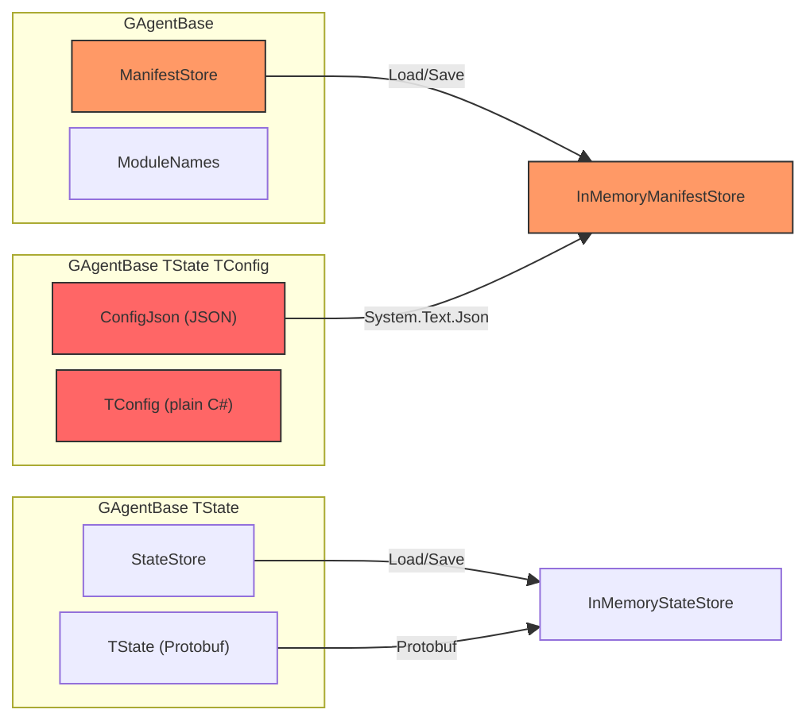
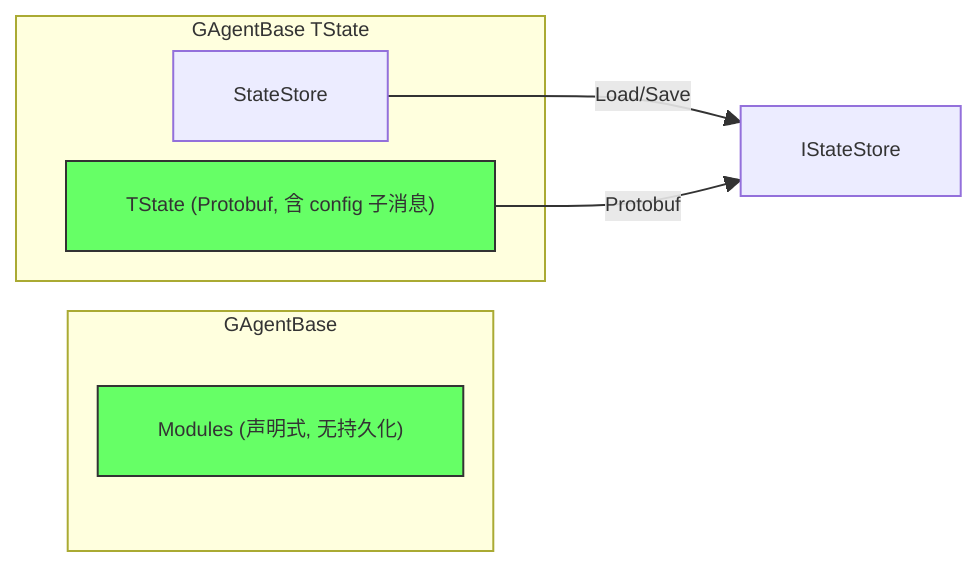

# 重构：删除 AgentManifest，Config 收入 State

> 日期：2026-03-17
> 状态：Proposal
> 分支：`chore/2026-03-17_json-to-protobuf-native`

## 1. 问题陈述

`AgentManifest` + `IAgentManifestStore` 在框架层造了一套独立于 `IStateStore<TState>` 的持久化体系，
用于存储 actor 类型名、模块绑定列表和配置 JSON。
该体系存在多项软件工程违反，且在当前架构下没有产生实际价值。

## 2. 现状分析

### 2.1 继承体系

```
GAgentBase                            ← stateless，持有 ManifestStore
  └─ GAgentBase<TState>               ← state 走 IStateStore<TState>（Protobuf）
       └─ GAgentBase<TState, TConfig> ← config 走 ManifestStore.ConfigJson（System.Text.Json）
            └─ AIGAgentBase<TState>   ← TConfig = AIAgentConfig（plain C# class）
                 └─ RoleGAgent        ← 唯一生产消费方
```

### 2.2 AgentManifest 字段用途

| 字段 | 写入方 | 读取方 | 实际价值 |
|------|--------|--------|----------|
| `AgentId` | `LocalActorRuntime.CreateAsync` | `RestoreAllAsync` | key，与 actor ID 重复 |
| `AgentTypeName` | `LocalActorRuntime.CreateAsync` | `RestoreAllAsync` | InMemory 下重启即丢失，无效 |
| `ModuleNames` | `GAgentBase.PersistModulesAsync` | `RestoreModulesAsync` | 调用方每次都 `SetModules` 覆盖 |
| `ConfigJson` | `GAgentBase<,,>.PersistConfigAsync` | `ActivateAsync` | 调用方每次都 `ConfigureAsync` 覆盖 |
| `Metadata` | **无人写入** | **无人读取** | 纯粹死代码 |

### 2.3 涉及文件清单

| 文件 | 角色 |
|------|------|
| `src/Aevatar.Foundation.Abstractions/Persistence/IAgentManifestStore.cs` | 契约定义（`AgentManifest` + `IAgentManifestStore`） |
| `src/Aevatar.Foundation.Runtime/Persistence/InMemoryManifestStore.cs` | 唯一实现 |
| `src/Aevatar.Foundation.Runtime/DependencyInjection/ServiceCollectionExtensions.cs:45` | DI 注册 |
| `src/Aevatar.Foundation.Core/GAgentBase.cs:50,236-258` | `ManifestStore` 属性 + 模块持久化 |
| `src/Aevatar.Foundation.Core/GAgentBase.TState.TConfig.cs` | Config JSON 序列化（整个文件） |
| `src/Aevatar.Foundation.Runtime/Actor/LocalActorRuntime.cs:52-59,74-75,109-121,140` | manifest 读写 + `RestoreAllAsync` |
| `src/Aevatar.Foundation.Abstractions/IActorRuntime.cs:42` | `RestoreAllAsync` 接口方法 |
| `src/Aevatar.AI.Core/AIGAgentBase.cs:20-42,46` | `AIAgentConfig`（plain C# class）+ 继承 `GAgentBase<TState, TConfig>` |
| `test/Aevatar.Foundation.Core.Tests/RuntimeAndContextTests.cs:91-149` | `RestoreAll_CreatesActorFromManifest` 测试 |
| `test/Aevatar.Workflow.Application.Tests/WorkflowApplicationLayerTests.cs:233` | mock `RestoreAllAsync` |

## 3. 软件工程违反

### 3.1 Config 与 State 的伪分离

`TState` 约束为 `IMessage<TState>` → Protobuf → 走 `IStateStore`。
`TConfig` 约束为 `class, new()` → 无法进 Protobuf → 被迫造了第二套持久化。

但 Config **就是** State：可变（`ConfigureAsync` 随时改）、影响行为、需要持久化。
分离的唯一原因是泛型约束没有要求 `IMessage`，不是设计决策，是实现偷懒导致的路径依赖。

**违反原则**：Single Source of Truth、DRY。

### 3.2 同一 actor 的持久化走两条序列化路径

- `TState` → `IStateStore` → Protobuf ✓
- `TConfig` → `ManifestStore.ConfigJson` → `System.Text.Json.JsonSerializer` ✗

**违反架构规则**：*"所有序列化统一 Protobuf，禁止 JSON 作为内部序列化方案"*。

### 3.3 单一职责原则违反

`AgentManifest` 混合三个不相关职责：actor 类型注册表、模块绑定持久化、配置持久化。
三者生命周期不同、变更频率不同、消费方不同，仅因共享 `agentId` 做 key 就揉在一起。

### 3.4 幻影抽象（Phantom Abstraction）

`IAgentManifestStore` 定义了 CRUD + List 四个方法，但：
- 唯一实现是 `InMemoryManifestStore`（进程重启数据全丢）
- `RestoreAllAsync` 在 InMemory 下恢复 0 个 actor
- Config 和 ModuleNames 每次创建时都被调用方主动覆盖

接口存在但从未产生持久化价值，是典型的 Phantom Abstraction。

### 3.5 运行时偶然细节泄漏

`AgentTypeName` 存储 .NET `AssemblyQualifiedName`，是反射细节。
一旦重命名类型、移动命名空间或版本变更，持久化数据全部失效。

**违反架构规则**：*"命名不得泄露 runtime 偶然细节"*、*"actorId 对调用方是不透明地址"*。

### 3.6 fire-and-forget 持久化暴露设计意图

```csharp
private void SchedulePersistModules()
{
    _ = PersistModulesSafeAsync();  // fire-and-forget，失败只打 warning
}
```

模块绑定的持久化是 fire-and-forget，失败被吞掉。
代码自身已经在说明：这个持久化从一开始就不被视为必须成功的操作。

### 3.7 Metadata 幽灵字段

`Dictionary<string, string> Metadata` — 无人写入、无人读取。
同时违反 CLAUDE.md *"禁止无语义泛化 Metadata 命名"* 约束。

### 3.8 时序耦合

`GAgentBase<TState, TConfig>.ActivateAsync`：先从 `ManifestStore` 读 ConfigJson → 再调 `base.ActivateAsync()` 从 `StateStore` 读 State。两个 store 的加载顺序隐式耦合，无契约保证。

### 3.9 重复基础设施

系统已有完整的持久化路径：

| 关注点 | 已有机制 | Manifest 重复 |
|--------|---------|--------------|
| 状态持久化 | `IStateStore<TState>` (Protobuf) | `ConfigJson` (JSON) |
| 模块装配 | DI + `IEventModuleFactory` + 调用方 `SetModules` | `ModuleNames` 持久化 |
| Actor 生命周期 | `IActorRuntime` | `AgentTypeName` 持久化 |

### 3.10 与主流 Actor 框架实践对比

| 框架 | Config 处理 | 类型恢复 | 模块绑定 |
|------|-------------|---------|---------|
| **Orleans** | Config 是 Grain State 的一部分 | Grain Identity System 内置 | 声明式（Streams / DI） |
| **Akka.NET** | Props 传参 + 持久化进 State | ActorSystem + Props | 声明式（DI / Props） |
| **Dapr Actors** | State 统一存储 | Actor Type Registry（runtime 内部） | 配置文件 / DI |
| **本项目** | 独立 ManifestStore + JSON | 存 AssemblyQualifiedName | 持久化 module name 列表 |

**共同最佳实践**：Config 是 State 的子集，类型解析是 Runtime 内部职责，模块绑定声明式。

## 4. 目标架构

### 4.1 架构对比

**Before:**



**After:**



### 4.2 设计原则

1. **Config 是 State 的子集** — 配置信息作为 Protobuf 子消息嵌入 `TState`，走 `IStateStore` 统一持久化
2. **模块绑定是声明式的** — 调用方（`RoleGAgentFactory` / `WorkflowGAgent`）每次创建时通过 `SetModules` 设置，无需持久化
3. **类型解析是 Runtime 内部职责** — 不持久化到 actor 可见层
4. **单一序列化路径** — 所有 actor 持久化数据走 Protobuf

## 5. 实施计划

### Phase 1：定义 AIAgentConfig Protobuf 消息

在 `src/Aevatar.AI.Abstractions/ai_messages.proto` 中新增：

```protobuf
message AIAgentConfigProto {
  string provider_name   = 1;
  string model           = 2;
  string system_prompt   = 3;
  double temperature     = 4;
  int32  max_tokens      = 5;
  int32  max_tool_rounds = 6;
  int32  max_history_messages = 7;
}
```

将 `AIAgentConfigProto` 嵌入 `RoleGAgentState`：

```protobuf
message RoleGAgentState {
  string role_name = 1;
  int32 message_count = 2;
  AIAgentConfigProto config = 3;  // 新增
}
```

### Phase 2：删除 GAgentBase<TState, TConfig> 层

**2a. 将 Config 逻辑内聚到 AIGAgentBase**

`AIGAgentBase<TState>` 不再继承 `GAgentBase<TState, TConfig>`，改为直接继承 `GAgentBase<TState>`。
Config 从 `TState` 的 Protobuf 子消息中读取：

```csharp
public abstract class AIGAgentBase<TState> : GAgentBase<TState>
    where TState : class, IMessage<TState>, new()
{
    // Config 由子类通过抽象方法从 State 中提取
    protected abstract AIAgentConfigProto GetConfigFromState();
    protected abstract void SetConfigToState(AIAgentConfigProto config);

    public async Task ConfigureAsync(AIAgentConfigProto config, CancellationToken ct = default)
    {
        using var guard = StateGuard.BeginWriteScope();
        SetConfigToState(config);
        await OnConfigChangedAsync(config, ct);
    }
}
```

**2b. RoleGAgent 实现**

```csharp
public class RoleGAgent : AIGAgentBase<RoleGAgentState>, IRoleAgent
{
    protected override AIAgentConfigProto GetConfigFromState()
        => State.Config ?? new AIAgentConfigProto();

    protected override void SetConfigToState(AIAgentConfigProto config)
        => State.Config = config;
}
```

**2c. 删除文件**

- `src/Aevatar.Foundation.Core/GAgentBase.TState.TConfig.cs`（整个文件）
- `src/Aevatar.AI.Core/AIGAgentBase.cs` 中的 `AIAgentConfig` class（替换为 Protobuf 生成类型）

### Phase 3：删除 ManifestStore 体系

**3a. 删除 GAgentBase 中的 Manifest 相关代码**

从 `GAgentBase.cs` 中删除：
- `ManifestStore` 属性 (L50)
- `RestoreModulesAsync` 方法 (L236-249)
- `PersistModulesAsync` / `SchedulePersistModules` / `PersistModulesSafeAsync` 方法 (L251-275)
- `ActivateAsync` 中对 `RestoreModulesAsync` 的调用 (L71)

模块恢复改为：`ActivateAsync` 不再自动恢复模块。模块由调用方在创建后通过 `SetModules` 声明式设置。

**3b. 删除 Manifest 基础设施**

- 删除 `src/Aevatar.Foundation.Abstractions/Persistence/IAgentManifestStore.cs`（`AgentManifest` + `IAgentManifestStore`）
- 删除 `src/Aevatar.Foundation.Runtime/Persistence/InMemoryManifestStore.cs`
- 从 `ServiceCollectionExtensions.cs` 删除 `IAgentManifestStore` DI 注册

**3c. 清理 LocalActorRuntime**

从 `LocalActorRuntime.cs` 中删除：
- `CreateAsync` 中的 manifest 保存 (L52-59)
- `DestroyAsync` 中的 manifest 删除 (L74-75)
- `RestoreAllAsync` 方法 (L109-121)
- `InjectDependencies` 中的 `ManifestStore` 注入 (L140)

**3d. 清理 IActorRuntime 接口**

从 `IActorRuntime.cs` 删除 `RestoreAllAsync` 方法。

### Phase 4：更新测试

| 测试文件 | 改动 |
|---------|------|
| `test/Aevatar.Foundation.Core.Tests/RuntimeAndContextTests.cs` | 删除 `RestoreAll_CreatesActorFromManifest` 测试，删除 `_manifestStore` 字段 |
| `test/Aevatar.Workflow.Application.Tests/WorkflowApplicationLayerTests.cs` | 删除 mock `RestoreAllAsync` |
| `test/Aevatar.Integration.Tests/WorkflowIntegrationTests.cs` | `AIAgentConfig` → `AIAgentConfigProto` |

### Phase 5：验证

```bash
dotnet build aevatar.slnx --nologo
dotnet test aevatar.slnx --nologo
bash tools/ci/architecture_guards.sh
```

## 6. 影响范围总结

### 删除清单

| 类型 | 名称 |
|------|------|
| 类 | `AgentManifest` |
| 接口 | `IAgentManifestStore` |
| 实现 | `InMemoryManifestStore` |
| 基类 | `GAgentBase<TState, TConfig>` |
| 配置类 | `AIAgentConfig`（plain C# → Protobuf） |
| 接口方法 | `IActorRuntime.RestoreAllAsync` |
| 属性 | `GAgentBase.ManifestStore` |
| 方法 | `GAgentBase.RestoreModulesAsync` / `PersistModulesAsync` / `SchedulePersistModules` / `PersistModulesSafeAsync` |

### 新增清单

| 类型 | 名称 | 位置 |
|------|------|------|
| Protobuf 消息 | `AIAgentConfigProto` | `ai_messages.proto` |
| Protobuf 字段 | `RoleGAgentState.config` | `ai_messages.proto` |

### 不受影响

| 组件 | 原因 |
|------|------|
| `IStateStore<TState>` | 不变，承接原 config 持久化职责 |
| `WorkflowGAgent` | 继承 `GAgentBase<WorkflowState>`，无 TConfig，不受影响 |
| `IEventModuleFactory` | 不变，模块创建机制不受影响 |
| `SetModules` / `RegisterModule` | 保留，调用方声明式设置模块 |
| 外部配置 JSON | 不在此次范围（`~/.aevatar/*.json` 等边界文件） |

## 7. 消除的 JSON 残留

本次重构消除的 `System.Text.Json` 内部使用：

| 文件 | 调用 |
|------|------|
| `GAgentBase.TState.TConfig.cs:45` | `JsonSerializer.Deserialize<TConfig>(manifest.ConfigJson)` |
| `GAgentBase.TState.TConfig.cs:56` | `JsonSerializer.Serialize(Config)` |

重构后，actor 内部持久化路径 **100% Protobuf**，不再有 JSON 序列化。
