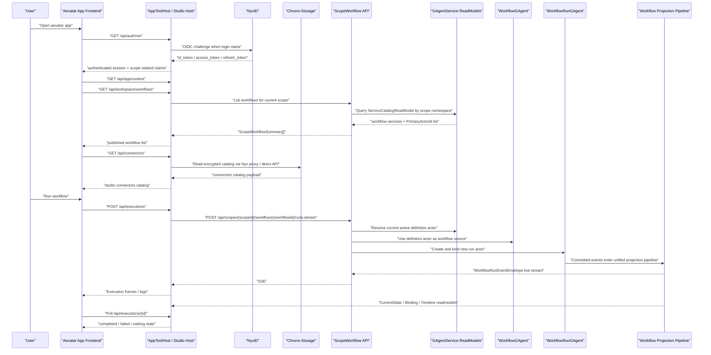
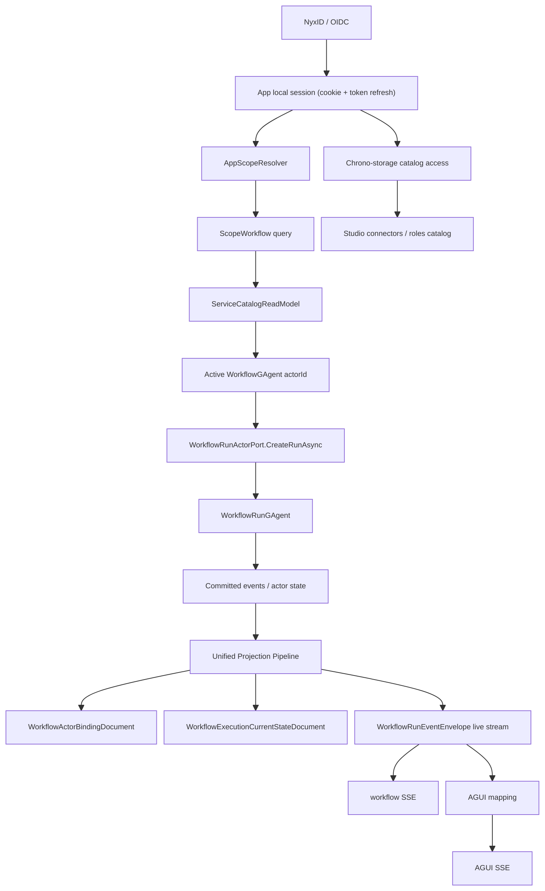

# Aevatar App 从登录到 Workflow 执行完成的背后机制

> 说明（2026-03-26 更新）：
> 本文主体仍然保留 `2026-03-18` 当时仓库里的实际实现路径，所以文中会看到
> `POST /api/scopes/{scopeId}/workflows/{workflowId}/runs:stream`
> 这类 workflow 级 endpoint。
>
> 但按当前 app-level 架构收敛，对外产品面 / AI-facing surface 已经不应该直接暴露
> `workflowId`，而应统一抽象成：
>
> - `POST /api/apps/{appId}/functions/{functionId}:invoke`
> - 或 `POST /api/apps/{appId}/releases/{releaseId}/functions/{functionId}:invoke`
> - 需要工作流 SSE 时，则走
>   - `POST /api/apps/{appId}/functions/{functionId}:stream`
>   - 或 `POST /api/apps/{appId}/releases/{releaseId}/functions/{functionId}:stream`
>
> 所以：
>
> - 本文里的 `scope workflow run` 路径，应理解为“历史实现 / 当前内部兼容路径”
> - 不应再理解为 app 对外正式调用契约

本文基于仓库在 2026-03-18 的实际代码路径整理，目标是把这条链路讲清楚：

1. 用户打开 `aevatar app`
2. 通过 NyxID 登录
3. App 解析当前 scope
4. 通过 readmodel 读取当前 scope 下的 published workflow 列表
5. 加载 `WorkflowGAgent` 绑定信息与 workflow source
6. 从 chrono-storage 读取 studio 侧 connectors / roles catalog
7. 用户发起一次 workflow run
8. Aevatar 创建并绑定 `WorkflowRunGAgent`
9. workflow 运行、产生日志和状态
10. 事件经统一 projection pipeline 物化并推回前端

本文默认主线场景是：

- 使用 `aevatar app`
- NyxID 登录开启
- App 运行在 `embedded` 模式
- workflow 存储模式是 `scope`
- 用户运行的是一个已经发布的 workflow

如果按当前对外语义改写，这里更准确的说法应当是：

- 用户调用的是某个 app `function`
- 这个 function 当前绑定到 `workflow` 实现
- 调用方不需要感知底下是否真的是某条 workflow

最后会补充 `workspace/draft run` 和 `proxy` 模式的差异。

## 1. 一句话结论

这条主链不是“前端直接找 actor 然后调 actor”，而是四段式：

1. `NyxID/OIDC + Cookie` 解决“谁在使用 app”
2. `ScopeWorkflow + GAgentService readmodel` 解决“这个 scope 当前有哪些已发布 workflow，以及当前生效的 definition actor 是谁”
3. `Workflow Application + WorkflowRunActorPort` 解决“如何基于 definition actor 创建一个新的 run actor 并开始执行”
4. `统一 Projection Pipeline` 同时负责：
   - `WorkflowActorBindingDocument / WorkflowExecutionCurrentStateDocument` 这类 readmodel 物化
   - `WorkflowRunEventEnvelope` 实时流
   - 可选的 `AGUIEvent` SSE 输出

也就是说：

- scope 维度的 workflow 列表来自 readmodel，不来自 runtime actor registry
- run 的执行 actor 是临时新建的 `WorkflowRunGAgent`，不是直接在 `WorkflowGAgent` 上执行
- AGUI 不是第二套旁路，而是基于同一条 projection / run-event 主链做格式映射

## 2. 先区分三套“看起来像一回事”的东西

### 2.1 Published workflow 列表

这是 scope 级“发布态”查询，权威来源是 `GAgentService` 的 service readmodel：

- `ServiceCatalogReadModel`
- `ServiceCatalogQueryReader`
- `ScopeWorkflowQueryApplicationService`

这里读到的是“某个 scope 当前有哪些 workflow service，以及当前 active deployment 的 `PrimaryActorId` 是哪个 definition actor”。

### 2.2 Workflow actor binding

这是 actor 级“绑定态”查询，权威来源是 workflow projection 物化出的：

- `WorkflowActorBindingDocument`
- `ProjectionWorkflowActorBindingReader`

这里解决的是：

- 这个 actor 是不是 workflow-capable
- 它是 `WorkflowGAgent` 还是 `WorkflowRunGAgent`
- 它绑定的 `workflowName / workflowYaml / inlineWorkflowYamls / definitionActorId / runId` 是什么

### 2.3 Studio connectors / roles catalog

这是 app/studio 侧配置存储，不等于 runtime connector registry。

当前代码里：

- Studio catalog 可以走 `chrono-storage`
- 但 embedded runtime 执行 `connector_call` 时使用的 `IConnectorRegistry` 仍然是本地加载链路

这三者不能混为一谈。

## 3. 总体时序图

按当前 app-level 抽象，上图中真正应该对外稳定的是：

- `FE ->> APP: POST /api/executions`
- `APP ->> AppPlatform: POST /api/apps/{appId}/functions/{functionId}:invoke`

而不是直接把：

- `POST /api/scopes/{scopeId}/workflows/{workflowId}/runs:stream`

暴露成调用方必须知道的正式接口。

当前仓库里 `ExecutionService` 仍然直接拼 workflow run URL，
所以这条 workflow route 在代码上还存在；但它应该被收敛为内部实现细节，而不是外部 app 契约。

## 4. App 启动与模式判定

入口是 `tools/Aevatar.Tools.Cli/Hosting/AppToolHost.cs`。

`AppToolHost.RunAsync()` 会先决定两个维度：

### 4.1 Host mode

- `embedded`
- `proxy`

判定方式是 `ShouldUseEmbeddedWorkflow(localUrl, sdkBaseUrl)`：

- 如果 `sdkBaseUrl` 和本地 app 地址是同一个 origin，则走 `embedded`
- 否则走 `proxy`

这决定 workflow capability 是：

- 本地进程内直接提供
- 还是由 `AppBridgeEndpoints` 代理到远端 runtime

### 4.2 Workflow storage mode

这个不是启动时硬编码，而是后续由 `IAppScopeResolver` 是否能解析出 scope 决定：

- 解析出 scope，则前端进入 `scope` 模式
- 解析不出 scope，则前端走 `workspace` 模式

## 5. 用户登录与 scope 解析

### 5.1 认证中间件

认证实现在 `tools/Aevatar.Tools.Cli/Hosting/NyxIdAppAuthentication.cs`：

- 协议：OIDC Authorization Code + PKCE
- 本地 session：Cookie `aevatar.cli.auth`
- 默认 provider：NyxID

`UseNyxIdAppProtection()` 会保护绝大多数 `/api/**` 路径，匿名例外只有：

- `/api/app/health`
- `/api/auth/me`

### 5.2 登录流程

前端启动时先请求：

- `GET /api/auth/me`

如果未登录：

- 后端返回 `authenticated=false` 和 `loginUrl`
- 前端进入登录门面
- 用户点击后进入 `/auth/login`
- `/auth/login` 调 `ChallengeAsync(OpenIdConnectDefaults.AuthenticationScheme, ...)`
- NyxID 完成认证后回到本地 app

### 5.3 Token 刷新

`NyxIdAppTokenService.GetAccessTokenAsync()` 会：

- 从 Cookie session 中取 `access_token`
- 临近过期时用 `refresh_token` 去 NyxID 刷新
- 刷新成功后重新写回 Cookie
- 刷新失败且 token 已过期时，清理本地 session

### 5.4 Scope 解析

`DefaultAppScopeResolver.Resolve()` 的优先级是：

1. 已登录用户 claims
   - `scope_id`
   - `uid`
   - `sub`
   - `ClaimTypes.NameIdentifier`
2. 请求头
   - `X-Aevatar-Scope-Id`
   - `X-Scope-Id`
3. 配置项
   - `Cli:App:ScopeId`
4. 环境变量
   - `AEVATAR_SCOPE_ID`

这一步非常关键，因为后面的：

- scope workflow 查询
- chrono-storage catalog ownerKey 计算
- 前端 `workflowStorageMode=scope`

都依赖这个 `scopeId`。

## 6. 前端 bootstrap 后实际会拉哪些数据

登录成功后，`tools/Aevatar.Tools.Cli/Frontend/src/App.tsx` 的 `bootstrap()` 会并行拉一组数据：

- `/api/app/context`
- `/api/workspace`
- `/api/workspace/workflows`
- `/api/connectors`
- `/api/connectors/draft`
- `/api/roles`
- `/api/roles/draft`
- `/api/executions`
- `/api/settings`

其中最关键的是：

- `/api/app/context`
  - 告诉前端当前是 `embedded` 还是 `proxy`
  - 告诉前端 `scopeResolved / scopeId / workflowStorageMode`
- `/api/workspace/workflows`
  - 在 `scope` 模式下，不再列本地目录，而是列当前 scope 下的 published workflows

## 7. Published workflow 列表是如何通过 readmodel 读出来的

这条链路是：

`Frontend -> WorkspaceController -> AppScopedWorkflowService -> IScopeWorkflowQueryPort -> IServiceLifecycleQueryPort -> ServiceCatalogQueryReader -> ServiceCatalogReadModel`

### 7.1 Host 入口

`tools/Aevatar.Tools.Cli/Studio/Host/Controllers/WorkspaceController.cs`

`ListWorkflows()` 里会先看当前 request 是否能解析出 `scopeContext`：

- 如果没有 scope，走本地 `WorkspaceService.ListWorkflowsAsync()`
- 如果有 scope，走 `_scopeWorkflowService.ListAsync(scopeId)`

### 7.2 Scope workflow query

`AppScopedWorkflowService.ListAsync(scopeId)` 在 embedded mode 下会直接用本地注入的：

- `IScopeWorkflowQueryPort`

代理模式下则会转发到：

- `GET /api/scopes/{scopeId}/workflows`

### 7.3 实际查询来源

`ScopeWorkflowQueryApplicationService.ListAsync()` 会调用：

- `IServiceLifecycleQueryPort.ListServicesAsync(tenantId, appId, namespace, take)`

这里的 `namespace` 不是裸 `scopeId`，而是：

- `ScopeWorkflowCapabilityOptions.BuildNamespace(scopeId)`
- 默认格式：`user:{opaque-scope-token}`

`opaque token` 是 slug + hash，不直接把原始 `scopeId` 裸放进 service namespace / actorId。

### 7.4 真正的 readmodel

`ServiceLifecycleQueryApplicationService.ListServicesAsync()` 最终会走：

- `ServiceCatalogQueryReader.QueryByScopeAsync()`

它查询的就是：

- `ServiceCatalogReadModel`

过滤条件是：

- `TenantId`
- `AppId`
- `Namespace`

### 7.5 actorId 从哪里来

`ScopeWorkflowQueryApplicationService.BuildWorkflowSummaryAsync()` 里的 `ActorId`，来自：

- `ServiceCatalogSnapshot.PrimaryActorId`

而这个字段是由：

- `ServiceCatalogProjector`

在处理：

- `ServiceDeploymentActivatedEvent`

时写进 readmodel 的。

所以：

- published workflow 列表里的 definition actor id，本质上是 `ServiceCatalogReadModel.PrimaryActorId`
- 它不是运行时临时扫描出来的
- 也不是前端自己拼出来的

### 7.6 再补一层 binding 信息

同一个 query service 还会通过：

- `IWorkflowActorBindingReader.GetAsync(actorId)`

读取：

- `WorkflowActorBindingDocument`

从而拿到更完整的：

- `workflowName`
- `workflowYaml`
- `inlineWorkflowYamls`

这一步解决的是 actor 绑定信息，而不是 scope 级列表本身。

## 8. 打开一个 workflow 详情时会发生什么

`AppScopedWorkflowService.GetAsync(scopeId, workflowId)` 会走两路数据合并：

1. scope workflow summary
2. workflow source

对应后端是：

- `ScopeWorkflowEndpoints.HandleGetWorkflowDetailAsync()`

它内部会：

1. 先通过 `IScopeWorkflowQueryPort.GetByWorkflowIdAsync(scopeId, workflowId)` 解析发布态 summary
2. 再通过 `IWorkflowActorBindingReader.GetAsync(actorId)` 看 active definition actor 是否已经有 binding source
3. 如果 binding source 不完整，再尝试从 `IServiceRevisionArtifactStore` 取 active revision artifact

因此前端打开详情时，拿到的 source 可能来自：

- `WorkflowActorBindingDocument`
- 或 `PreparedServiceRevisionArtifact.WorkflowPlan`

## 9. Studio connectors / roles catalog 如何从 chrono-storage 读取

这条链路和 workflow definition list 不是同一套读模型。

### 9.1 Host 层入口

- `ConnectorsController`
- `RolesController`

都会分别调用：

- `ConnectorService`
- `RoleCatalogService`

### 9.2 真正的存储适配器

Studio 基础设施注册的是：

- `ChronoStorageConnectorCatalogStore`
- `ChronoStorageRoleCatalogStore`

它们背后统一使用：

- `ChronoStorageCatalogBlobClient`

### 9.3 如何定位当前用户的对象

`ChronoStorageCatalogBlobClient.TryResolveContext(prefix, fileName)` 会：

1. 用 `IAppScopeResolver` 拿到当前 `scopeId`
2. 读取 chrono-storage 配置
3. 解析访问方式：
   - Nyx proxy
   - direct chrono-storage API
4. 生成 `ownerKey`
5. 生成 `objectKey`

其中：

- `ownerKey = HMACSHA256(derived-master-key, scopeId)`
- `objectKey = {prefix}/{ownerKey}/catalog.json.enc`

默认前缀分别是：

- connectors：`aevatar/connectors/v1`
- roles：`aevatar/roles/v1`

### 9.4 Nyx proxy 模式

若 `UseNyxProxy=true`，请求会走：

- `/api/v1/proxy/s/{NyxProxyServiceSlug}/...`

默认 slug 是：

- `chrono-storage-service`

发起请求时会自动附带：

- NyxID `Bearer` token

### 9.5 加密方式

catalog 内容不是明文直存，流程是：

1. 本地把 catalog JSON 序列化
2. 用 `AES-GCM` 加密
3. associated data 绑定到：
   - `bucket`
   - `objectKey`
   - `v1`
4. 上传 `catalog.json.enc`

所以 chrono-storage 里存的是“按 scope 隔离、按对象路径绑定、客户端侧加密”的 catalog。

### 9.6 draft 与正式 catalog 的区别

- 正式 catalog 在 chrono-storage
- draft 仍然放本地
  - `connectors-drafts/{ownerKey}.json`
  - `roles-drafts/{ownerKey}.json`

### 9.7 必须明确的现状差异

当前代码里：

- Studio 页面展示和编辑的 connectors catalog 可以来自 chrono-storage
- 但 embedded runtime 真正执行 `connector_call` 时使用的 `IConnectorRegistry`，仍然由本地 connector bootstrap / `connectors.json` 加载

对应代码：

- `AppToolHost.LoadNamedConnectors()`
- `ConnectorBootstrapHostedService`
- `ConnectorRegistration.RegisterConnectors()`

因此当前真实语义是：

- chrono-storage 解决的是 studio/catalog 存储
- runtime connector registry 还没有直接切到 chrono-storage 做热加载事实源

## 10. 用户点击 Run 以后，前端发的不是 actor 调用，而是 app 级 execution 请求

`Frontend/src/App.tsx` 中 `handleConfirmRunWorkflow()` 会先决定用户当前跑的是哪种 run：

### 10.1 Published workflow run

满足下面条件时，会走 published run：

- `workflowStorageMode === "scope"`
- 有 `scopeId`
- 当前 workflow 已有 `workflowId`
- 当前文档不是 dirty

这时会调用：

- `POST /api/executions`

请求体里会带：

- `scopeId`
- `workflowId`
- `eventFormat = "workflow"`

### 10.2 Draft / inline run

否则就走 inline yaml：

- `workflowYamls = [currentYaml]`
- 不带 `scopeId/workflowId`

这种情况下最终会走 `/api/chat` 主链，而不是 scope workflow endpoint。

## 11. `/api/executions` 在 app 里做了什么

`tools/Aevatar.Tools.Cli/Studio/Application/Services/ExecutionService.cs`

`StartAsync()` 会：

1. 先在本地 `IStudioWorkspaceStore` 里创建一条 execution record
2. 记录：
   - `executionId`
   - `workflowName`
   - `runtimeBaseUrl`
   - `status = running`
3. 后台起一个异步任务 `RunStartExecutionAsync(record, request, authSnapshot)`

这里非常重要的一点是：

- app 自己维护了一份 studio 侧的 execution record
- 它不是 workflow runtime 的权威状态
- 它只是前端 execution 面板的本地聚合视图

## 12. 历史实现：Published workflow run 的 HTTP 当时打到了哪里

这一节描述的是 `2026-03-18` 起的历史实现链路，以及 `scope + workflowId` 这条兼容 fallback，
不是当前推荐的 app 对外调用模型。

按当前架构，对外应统一看作：

- `POST /api/apps/{appId}/functions/{functionId}:invoke`
- `POST /api/apps/{appId}/functions/{functionId}:stream`

只有在内部 runtime / authoring 兼容层里，才继续出现 `scope + workflowId` 路径。

`ExecutionService.BuildStartExecutionRequest()` 里：

- 如果带 `appId + functionId`，优先请求 app-level function stream；
  - 未显式指定 `releaseId` 时：
    - `POST /api/apps/{appId}/functions/{functionId}:stream`
  - 显式指定 `releaseId` 时：
    - `POST /api/apps/{appId}/releases/{releaseId}/functions/{functionId}:stream`
- 否则如果带 `scopeId + workflowId`，就走历史兼容的 published workflow run；
  - 未显式指定 `appId` 时：
  - `POST /api/scopes/{scopeId}/workflows/{workflowId}/runs:stream`
  - 显式指定 `appId` 时：
    - `POST /api/scopes/{scopeId}/apps/{appId}/workflows/{workflowId}/runs:stream`
- 否则请求：
  - `POST /api/chat`

当前 app 对 published workflow run 默认要求：

- `eventFormat = workflow`

所以默认收到的是：

- `WorkflowRunEventEnvelope` SSE

不是 AGUI SSE。

换句话说：

- 从“当前代码实现”角度，`ExecutionService` 已经优先面向 `functionId`，只把 workflow run endpoint 当 fallback
- 从“当前产品/API 抽象”角度，正式外部契约应理解成 `function invoke / function stream`

当前实现已经朝这个方向收敛：

1. `ExecutionService` 面向 `functionId`
2. 由 app/control plane resolve 到具体 `service + endpoint`
3. 若该 function 背后是 workflow，再由 app-level `:stream` endpoint 命中 workflow capability 主链

## 13. Scope workflow run 入口如何把 workflowId 解析成 active definition actor

入口是：

- `ScopeWorkflowEndpoints.HandleRunWorkflowByIdStreamAsync()`

它先做的事情不是直接找 actor，而是：

1. `IScopeWorkflowQueryPort.GetByWorkflowIdAsync(scopeId, workflowId)`
2. 再拿到当前 active `ScopeWorkflowSummary`
3. 其中包含当前 active definition actor id
4. 再进入 workflow capability 主链

也就是说，run 时的 actor 解析依然是“先读 readmodel，再决定 actor”，而不是跳过 read side。

## 14. Workflow Application 层如何创建并绑定新的 WorkflowRunGAgent

进入 workflow capability 主链后，会走：

- `WorkflowCapabilityEndpoints.HandleChat()`

它把 HTTP 请求规范化成：

- `WorkflowChatRunRequest`

然后调用：

- `ICommandInteractionService<WorkflowChatRunRequest, ...>.ExecuteAsync(...)`

### 14.1 Resolver

`WorkflowRunCommandTargetResolver.ResolveAsync()` 会：

1. 确认 projection pipeline 已启用
2. 调用 `IWorkflowRunActorResolver.ResolveOrCreateAsync(command)`

### 14.2 Published workflow 的 run actor 解析方式

对于“传入了 definition actorId 的 published run”：

- `WorkflowRunActorResolver.ResolveFromSourceActorAsync()`

会先用：

- `IWorkflowActorBindingReader.GetAsync(actorId)`

确认这个 source actor：

- 存在
- 是 workflow-capable
- 是 definition binding，而不是乱七八糟的别的 actor

然后它不会直接在 `WorkflowGAgent` 上运行，而是调用：

- `IWorkflowRunActorPort.CreateRunAsync(...)`

### 14.3 CreateRunAsync 做了什么

`WorkflowRunActorPort.CreateRunAsync()` 的顺序是：

1. `EnsureDefinitionActorAsync(definition)`
   - 确保 definition actor 存在
   - 必要时补一次 `BindWorkflowDefinitionAsync`
2. `IActorRuntime.CreateAsync<WorkflowRunGAgent>()`
   - 新建 run actor
3. `IActorRuntime.LinkAsync(definitionActorId, runActorId)`
   - 把 definition actor 和 run actor 建立链接
4. 向 run actor 发送 `BindWorkflowRunDefinitionEvent`
   - 里面带：
     - `DefinitionActorId`
     - `WorkflowName`
     - `WorkflowYaml`
     - `InlineWorkflowYamls`
     - `RunId`

返回值是：

- 新 run actor
- 对应 definition actorId
- 这次创建过程中产生的 actorId 列表

## 15. 在真正 dispatch 命令之前，projection session 就会先挂好

这是当前设计里非常关键的一层。

`WorkflowRunCommandTargetBinder.BindAsync()` 会在 dispatch 前做两件事：

### 15.1 激活 materialization projection

调用：

- `WorkflowExecutionMaterializationPort.ActivateAsync(actorId)`

它会确保该 run actor 的“读模型物化链”已激活。

### 15.2 挂 live sink

再调用：

- `WorkflowExecutionProjectionPort.EnsureActorProjectionAsync(rootActorId, commandId)`

并把一个：

- `EventChannel<WorkflowRunEventEnvelope>`

挂到 projection session 上。

因此：

- 实时事件不是 actor 自己直接推给 HTTP
- 而是 committed event 进入统一 projection pipeline 后，再从 projection session hub 流出来

这正符合仓库里的“读写分离 + 同一投影主链”约束。

## 16. Receipt 为什么先返回 `aevatar.run.context`

dispatch 成功后，`WorkflowRunAcceptedReceiptFactory` 会构造 receipt：

- `ActorId = runActor.Id`
- `WorkflowName`
- `CommandId`
- `CorrelationId`

然后：

- `WorkflowCapabilityEndpoints.HandleChat()` 会先把 receipt 转成一帧 `aevatar.run.context`
- 这就是 execution 面板最早看到的 run 上下文

这一帧不是业务步骤事件，而是“本次 run 的接收确认 + 新 run actor 身份”。

## 17. WorkflowRunGAgent 内部是怎样真正跑起来的

进入 run actor 后，`WorkflowRunGAgent.HandleChatRequest()` 会做几件事：

1. 校验 `_compiledWorkflow` 已经存在
2. 从 metadata 里提取 `workflow.command_id`
3. `EnsureAgentTreeAsync()`
4. Persist `WorkflowRunExecutionStartedEvent`
5. 向自己发布 `StartWorkflowEvent`

### 17.1 role actor tree

`EnsureAgentTreeAsync()` 会为 workflow 里的每个 role：

1. 生成子 actor id：`{runActorId}:{roleId}`
2. 通过 `IActorRuntime.GetAsync/CreateAsync()` 获取或创建 role actor
3. `LinkAsync(runActorId, childActorId)`
4. 发送 role 初始化 envelope
5. Persist `WorkflowRoleActorLinkedEvent`

这意味着：

- `WorkflowRunGAgent` 自己不是所有步骤的执行器
- 它是 run 级事实拥有者和编排者
- role actor tree 是它的执行子树

### 17.2 workflow loop

真正推进步骤的是：

- `WorkflowExecutionKernel`

它处理：

- `StartWorkflowEvent`
- `StepCompletedEvent`
- `WorkflowStoppedEvent`
- timeout / retry callback events

主循环逻辑是：

1. 取 entry step
2. 发 `StepRequestEvent`
3. 某个模块或 role 完成后回 `StepCompletedEvent`
4. kernel 根据：
   - `next`
   - `branches`
   - retry policy
   - on_error
   决定下一个动作
5. 没有 next step 时发 `WorkflowCompletedEvent`

### 17.3 connector_call

如果某一步是 `connector_call`：

- `ConnectorCallModule` 会从 `IConnectorRegistry` 查 connector
- 按 `allowed_connectors` 和 role 配置做约束
- 调外部 HTTP / CLI / MCP / custom connector
- 再把结果转换成 `StepCompletedEvent`

再次强调：

- 这里使用的是 runtime 里的 `IConnectorRegistry`
- 当前并不是直接从 chrono-storage catalog 动态热读 connector 定义

## 18. 统一 Projection Pipeline 是怎样把 committed 事实变成“可查询 + 可实时流式观察”的

workflow capability 注册时会同时做三件事：

1. `AddWorkflowExecutionProjectionCQRS(...)`
2. `AddWorkflowExecutionAGUIAdapter()`
3. 注册 `WorkflowExecutionRunEventProjector`

对应代码在：

- `WorkflowCapabilityServiceCollectionExtensions`

### 18.1 Binding readmodel

`WorkflowActorBindingProjector` 负责把：

- `BindWorkflowDefinitionEvent`
- `BindWorkflowRunDefinitionEvent`

物化为：

- `WorkflowActorBindingDocument`

它是 `IWorkflowActorBindingReader` 的数据来源。

### 18.2 Current-state readmodel

`WorkflowExecutionCurrentStateProjector` 负责把：

- `CommittedStateEventEnvelope<WorkflowRunState>`

物化为：

- `WorkflowExecutionCurrentStateDocument`

里面有：

- `RunId`
- `WorkflowName`
- `Status`
- `FinalOutput`
- `FinalError`
- `StateVersion`
- `LastEventId`

### 18.3 Live run-event stream

`WorkflowExecutionRunEventProjector` 也是挂在同一条 projection 主链上。

它会：

1. 接收 committed `EventEnvelope`
2. 通过 `EventEnvelopeToWorkflowRunEventMapper`
3. 映射成 `WorkflowRunEventEnvelope`
4. 以 `{rootActorId, sessionId}` 为 key 推入 projection session hub

这里的 `sessionId` 默认就是：

- `commandId`

所以同一次 run 的 live 观察不会依赖临时进程内字典去做 `actorId -> connection` 反查，而是依赖 projection session。

## 19. `WorkflowRunEventEnvelope` 里会出现哪些事件

`EventEnvelopeToWorkflowRunEventMapper` 已经覆盖了常用映射：

- `RunStarted`
- `RunFinished`
- `RunError`
- `RunStopped`
- `StepStarted`
- `StepFinished`
- `TextMessageStart / Content / End`
- `ToolCallStart / End`
- `StateSnapshot`
- `Custom`

其中 studio execution 面板当前最依赖的 custom 事件包括：

- `aevatar.run.context`
- `aevatar.step.request`
- `aevatar.step.completed`
- `aevatar.human_input.request`
- `aevatar.run.stopped`
- `studio.human.resume`
- `studio.run.stop.requested`

## 20. AGUI 输出是怎样接在同一条链路上的

如果调用方明确要求：

- `eventFormat = agui`

scope workflow endpoint 会走：

- `ScopeWorkflowEndpoints.HandleAguiStreamAsync()`

它内部做的是：

1. 仍然调用同一个 `chatRunService.ExecuteAsync(...)`
2. 仍然消费同一个 `WorkflowRunEventEnvelope` live stream
3. 只是在 HTTP 输出前，用：
   - `ScopeWorkflowAguiEventMapper.TryMap(frame, out aguiEvent)`
4. 把 `WorkflowRunEventEnvelope` 转成：
   - `AGUIEvent`
5. 再通过：
   - `AGUISseWriter`
   输出为 SSE

因此 AGUI 的真实角色是：

- 同一条 workflow run live stream 的另一种呈现格式

不是第二套执行或观察总线。

## 21. 但是当前 app execution 面板默认并不消费 AGUI

这点必须单独写清楚。

当前 `aevatar app` 在运行 published workflow 时，默认发送的是：

- `eventFormat = "workflow"`

所以它收到的是：

- `WorkflowRunEventEnvelope`

而不是 `AGUIEvent`。

随后：

- `ExecutionService` 把每一帧 SSE payload 存进本地 execution record
- 前端 `buildExecutionTrace(detail)` 再把这些 frame 解析成：
  - canvas 节点状态
  - 执行日志
  - human input / approval 交互态

也就是说：

- App execution 面板默认走的是 `workflow` 格式
- AGUI 是 scope workflow endpoint 的显式可选输出
- 如果未来要把 app execution 面板改成直接消费 AGUI，HTTP 参数和前端 trace parser 都要一起调整

## 22. Human input / approval 中断时会怎样恢复

如果 workflow 中有：

- `human_input`
- `human_approval`

运行过程里会出现：

- `aevatar.human_input.request`

前端 execution 面板把它识别为 pending interaction。

用户提交后：

- `App.tsx.handleExecutionInteraction()`
  -> `POST /api/executions/{executionId}/resume`

然后：

- `ExecutionsController.Resume`
  -> `ExecutionService.ResumeAsync(...)`
  -> 若 execution 记录里有 `appId + functionId`，优先调
    - `POST /api/apps/{appId}/functions/{functionId}/runs:resume`
    - 或 `POST /api/apps/{appId}/releases/{releaseId}/functions/{functionId}/runs:resume`
  -> 否则回退调 runtime `/api/workflows/resume`

resume API 成功后，studio 还会额外记一条本地 frame：

- `studio.human.resume`

用于 execution 面板重建用户动作轨迹。

## 23. Run 完成后有哪些“结束态”

结束态不只一种。

### 23.1 Live completion

`WorkflowRunCompletionPolicy` 会把以下事件视为 terminal：

- `RunFinished -> Completed`
- `RunError -> Failed`
- `RunStopped -> Stopped`

### 23.2 Durable completion

`WorkflowRunDurableCompletionResolver` 会通过：

- `IWorkflowExecutionCurrentStateQueryPort.GetActorSnapshotAsync(actorId)`

读取 current-state readmodel，判断 durable completion。

### 23.3 Finalize emitter

`WorkflowRunFinalizeEmitter` 会在 interaction 结束时再补一帧：

- `StateSnapshot`

其中包含：

- 当前 actor snapshot
- projection completion status
- projection state

所以最终 SSE 里既有 live 事件，也有基于 readmodel 的收尾快照。

## 24. 前端最后如何得出“这个 workflow 已经跑完”

前端不是直接盯某一帧，而是依赖 app 维护的 execution record。

`ExecutionService.ConsumeExecutionStreamAsync()` 会：

1. 持续读取 SSE
2. 逐帧追加到本地 `StoredExecutionRecord.Frames`
3. 根据 frame 内容推断：
   - `running`
   - `waiting`
   - `completed`
   - `failed`
   - `stopped`
4. 保存到 `IStudioWorkspaceStore`

前端再通过：

- `/api/executions`
- `/api/executions/{id}`

读取这份聚合态。

因此 app execution 面板看到的“完成”，是：

- runtime 事件流
- app 本地 execution 聚合
- 前端 trace rebuild

三者协同的结果。

## 25. 这个过程中真正的权威状态分别是什么

按语义分层，权威源如下：

### 25.1 “当前 scope 有哪些 published workflow”

权威源：

- `ServiceCatalogReadModel`

### 25.2 “某个 actor 当前绑定了哪个 workflow”

权威源：

- `WorkflowActorBindingDocument`

### 25.3 “某个 run actor 当前状态如何，是否完成”

权威源：

- `WorkflowExecutionCurrentStateDocument`
- 以及由它映射出来的 `WorkflowActorSnapshot`

### 25.4 “workflow runtime 的真实业务事实”

权威源：

- `WorkflowGAgent` / `WorkflowRunGAgent` 的 committed events + actor state

### 25.5 “studio 界面上的 execution 面板状态”

权威源不是 runtime，而是：

- app 本地 `StoredExecutionRecord`

它是 UI 聚合视图，不是分布式权威事实。

## 26. `workspace/draft run` 与 `proxy` 模式的差异

### 26.1 `workspace/draft run`

如果当前不是 scope mode，或者当前 workflow 还没发布：

- workflow 列表来自本地目录
- workflow source 来自本地 YAML 文件
- 运行时请求 `/api/chat`
- `WorkflowRunActorResolver` 会基于 inline YAML bundle 直接创建 `WorkflowRunGAgent`

这时不会经过：

- `ScopeWorkflowQueryApplicationService`
- `ServiceCatalogReadModel`

### 26.2 `proxy` 模式

如果 app 不是 embedded，而是 proxy：

- 本地 app 仍负责：
  - NyxID 登录
  - studio 前端
  - connectors/roles catalog
  - execution record 聚合
- 但 workflow capability 请求会经：
  - `AppBridgeEndpoints`
  转发到远端 backend

此时本地会通过：

- `NyxIdStudioBackendRequestAuthSnapshotProvider`

把当前用户的：

- `Bearer` token
- 必要时的内部请求头

附到后续 backend 请求上。

所以 proxy 模式下：

- app 自己不持有 workflow runtime
- 但仍然持有登录态、scope 语义和 studio 侧聚合状态

## 27. 建议把这条链路记成下面这张“职责图”

## 28. 最后的几个关键澄清

### 28.1 “通过 readmodel 读 WorkflowGAgent actor id list” 具体指什么

如果说的是 published workflow 列表，那么实际读的是：

- `ServiceCatalogReadModel.PrimaryActorId`

它对应的是当前 active deployment 的 definition actor，也就是当前生效的 `WorkflowGAgent` actor id。

### 28.2 “加载 WorkflowGAgent 和 WorkflowRunGAgent” 具体发生在哪里

- `WorkflowGAgent`
  - 在 service activation 阶段由 `DefaultServiceRuntimeActivator.ActivateWorkflowAsync()` 创建/绑定
- `WorkflowRunGAgent`
  - 在每次用户 run 请求时由 `WorkflowRunActorPort.CreateRunAsync()` 创建/绑定

### 28.3 “从 chrono-storage 读 connectors” 当前到底到哪一步

当前已经成立的是：

- studio connectors catalog 从 chrono-storage 读取和保存

当前还没有完全成立的是：

- runtime connector registry 在 workflow run 中直接以 chrono-storage 为事实源

### 28.4 “把 AGUI 事件抛到前端” 当前默认路径是什么

当前默认 app execution 面板路径不是 AGUI，而是：

- `WorkflowRunEventEnvelope` SSE
  -> app 本地 execution record
  -> `buildExecutionTrace()`

如果调用方显式设置：

- `eventFormat = agui`

那么 scope workflow endpoint 可以直接输出：

- `AGUIEvent` SSE

## 29. 结论

从用户登录 `aevatar app` 到一个 workflow 执行完成，代码里的主链可以概括为：

1. NyxID 登录给 app 提供本地 session 和 scope 语义
2. app 通过 `ServiceCatalogReadModel` 读取当前 scope 的 published workflow 列表和 active definition actor id
3. app 通过 `WorkflowActorBindingDocument` 补齐 definition binding/source
4. studio connectors / roles catalog 通过 chrono-storage 按 scope 隔离读取
5. 用户 run 时，scope workflow endpoint 再次通过 readmodel 解析 active definition actor
6. workflow application 层创建新的 `WorkflowRunGAgent`，而不是直接在 definition actor 上执行
7. `WorkflowRunGAgent` 通过 role actor tree + `WorkflowExecutionKernel` 推进 workflow
8. committed 事件进入统一 projection pipeline
9. 同一条 pipeline 一边物化 readmodel，一边产生 live `WorkflowRunEventEnvelope`
10. 需要时再把同一条 run-event 流映射成 AGUI SSE

这就是当前仓库里“登录、scope、published workflow、chrono-storage、WorkflowGAgent、WorkflowRunGAgent、projection、AGUI、前端 execution 面板”之间的真实关系。
