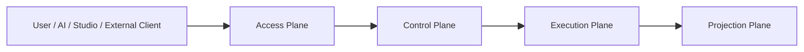

# Aevatar Framework Architecture 会议汇报版（5 分钟）

## 0. 开场口径

Aevatar 的重点不是“再做一个给人手工点点点的平台”，而是做一个 **给 AI 使用的 app framework 和 control plane**。

我们的目标是：

- AI 能通过提示词和 Aevatar 提供的机器可读 surface，持续获取更多 Aevatar 知识
- AI 能清楚知道 Aevatar 的能力边界、feature coding 方式、部署方式和运维方式
- 用户不需要自己理解底层 runtime、service、workflow、script、governance 细节
- 用户只通过 AI，就可以让自己的服务运行在 Aevatar 上

一句话概括：

> Aevatar 要成为 AI 可发现、可编排、可部署、可运维的统一宿主平台。

## 1. 重点一：四层架构

### 1.1 Access Plane

职责：

- 接住用户、AI、Studio、外部客户端流量
- 提供认证、接入、BFF、OpenAPI、app gateway

不负责：

- 不持有业务事实
- 不做正式业务编排

当前对应：

- `Aevatar.Mainnet.Host.Api`
- `Aevatar.Authentication.*`
- `Aevatar.Studio.*`

### 1.2 Control Plane

职责：

- 定义 app 是什么
- 管理 release、route、function、resource、operation
- 管理 app version lifecycle
- 决定入口打到哪个 service
- 统一 capability kernel、governance、发布编排

当前对应：

- `Aevatar.AppPlatform.*`
- `Aevatar.GAgentService.*`
- `Aevatar.GAgentService.Governance.*`

一句话：

- Access Plane 负责“接进来”
- Control Plane 负责“发到哪里、以什么版本、带什么资源去执行”

补一句版本口径：

- 在 Aevatar 里，`release_id` 就是 app version
- 对外与 AI 的正式 function 调用必须显式带 `releaseId`
- rollback 通过切换到旧 release 或基于旧 release 生成新的 rollback release 完成
- 被标记为不可用的版本必须禁止用户调用

### 1.3 Execution Plane

职责：

- 真正执行 workflow、script、trusted static gagent
- 承接 app 的真实运行时行为

当前对应：

- `Aevatar.Workflow.*`
- `Aevatar.Scripting.*`
- `src/apps/<app>.TrustedAgents`

一句话：

- Control Plane 决定“怎么发”
- Execution Plane 决定“怎么跑”

### 1.4 Projection Plane

职责：

- 统一消费 committed facts
- 统一输出 readmodel、timeline、AGUI、SSE、查询恢复

当前对应：

- `Aevatar.CQRS.Projection.*`
- `Aevatar.GAgentService.Projection`
- `Aevatar.GAgentService.Governance.Projection`
- workflow / scripting 自己的 projection 组件

一句话：

- Execution Plane 产生日志和事实
- Projection Plane 把这些事实变成 AI 和用户真正可观察、可查询的结果

### 1.5 这四层为什么重要

这四层保证了三件事：

1. `Studio`、`AI`、`runtime`、`query` 不混层
2. app 不等于 runtime 实现，app 是 control plane 上的一组 service composition
3. Aevatar 可以把“开发、部署、运维、观察”统一收敛为 AI 可理解的协议，而不是一堆散乱接口

## 2. 重点二：分阶段落地

### 2.1 Phase 1：AI 可发现、可查询、可受控调用

目标：

- AI 能读取 `GET /api/ai/openapi`
- AI 能看到 app / function
- AI 能调用 function
- AI 能通过 operation 观察 invoke 是否被 accepted

当前状态：

- 这部分主体已经落地
- `AppPlatform` 已经有 app-level query / mutation / invoke / operation surface
- 当前 authority 还是开发期 `InMemory` control plane

这一阶段解决的是：

- 让 AI 先“接得上、看得见、调得动”

### 2.2 Phase 2：AI 可自动发布和维护

目标：

- AI 能 create/update app
- AI 能管理 draft release
- AI 能 bind function / service / resources
- AI 能 publish / rollback
- AI 能管理版本状态：`active / deprecated / disabled`
- runtime 只消费 release-scoped published resources

这一阶段解决的是：

- 让 AI 不只是“调一个 function”
- 而是能真正把 app 发布到 Aevatar 上并完成版本切换、版本回退、版本下线

### 2.3 Phase 3：AI 可稳态运维和修复

目标：

- AI 能导出 bundle
- AI 能 diff/apply
- AI 能 validate / simulate / smoke-test
- AI 能通过 MCP / CLI 稳定集成

这一阶段解决的是：

- 让 AI 不只是“部署一次”
- 而是能长期运维、排障、修复和回滚

### 2.4 三阶段的一句话总结

| 阶段 | 核心能力 | 业务结果 |
|------|----------|----------|
| Phase 1 | discover + query + invoke + observe | AI 能接入 Aevatar |
| Phase 2 | draft + publish + resources + deployment | AI 能把 app 正式发布到 Aevatar |
| Phase 3 | bundle + diff/apply + validate + smoke-test + MCP/CLI | AI 能长期维护运行在 Aevatar 上的 app |

## 3. 汇报收束

这次汇报只需要记住两句话：

1. Aevatar 架构分四层：`Access Plane / Control Plane / Execution Plane / Projection Plane`
2. Aevatar 的落地分三阶段：先让 AI 能发现和调用，再让 AI 能发布，再让 AI 能运维

最后统一口径：

> 我们做 Aevatar，不是让用户自己去学一整套平台内部细节；我们要让 AI 成为用户操作 Aevatar 的主入口，让用户只通过 AI，就能把自己的服务开发、部署并运行在 Aevatar 上。
