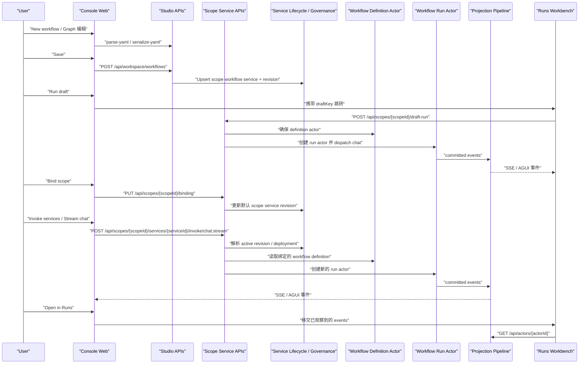

# Aevatar App 前端 Workflow 端到端后端链路说明

本文说明 `apps/aevatar-console-web` 这条实际用户路径背后，后端分别做了什么：

1. 点击 `New workflow`
2. 在 `Graph` 里画 workflow
3. 点击 `Save`
4. 点击 `Run draft`
5. 点击 `Bind scope`
6. 在 `Scopes -> Invoke services` 输入 prompt
7. 点击 `Stream chat`
8. 点击 `Open in Runs`
9. 在 `Runs` 里看到执行日志

本文默认前提：

- 前端运行在 `apps/aevatar-console-web`
- 宿主是 `Aevatar.Mainnet.Host.Api`
- `Studio capability` 和 `GAgentService capability` 都已经挂到同一个宿主里
- 当前用户已经解析出 `scopeId`

也就是说，这里描述的是 `aevatar app` 的 `scope-first` 主链，而不是脱离 scope 的本地 workspace-only 模式。
如果当前请求没有解析出 scope，那么同一个 `Save` 按钮会退回到本地 workspace 文件保存语义；本文不展开那条分支。

## 先看结论

- `New workflow` 和大部分 `Graph` 编辑，本质上还是作者态草稿编辑，主要发生在前端内存和 `Studio` 的 editor API 上，还没有创建 run actor。
- `Save` 在当前 app 的 scope-resolved 模式下，不是简单写本地文件，而是把当前 YAML upsert 成一个命名的 scope workflow service；但它保存的是“当前 workflow 资产”，不是“默认 scope binding”。
- `Run draft` 不依赖当前 scope 的默认 binding，它走的是 `/api/scopes/{scopeId}/draft-run`，用 inline workflow bundle 直接起一个新的 workflow run actor。
- `Bind scope` 才是在 scope 默认 service 上创建并激活一个 revision，让 `/api/scopes/{scopeId}/invoke/chat:stream` 这类默认入口指向当前 workflow bundle。
- `Stream chat` 不会直接在 definition actor 上执行；它会先解析当前 scope service 的 active deployment，再基于 definition actor 新建一个 run actor。
- `Open in Runs` 这一步主要是前端会话移交，不是“再跑一次”。Runs 页看到的日志，主要来自刚才已经收到的流式事件；同时它会补拉 actor snapshot。

## 一张总图

## 1. New workflow 和 Graph 编辑

### 前端发生了什么

- `New workflow` 只是把 Studio 当前编辑态切到一个空白 draft。
- Graph 里的增删节点、连线、改 step 参数，本质上是修改前端内存里的 `StudioWorkflowDocument`。
- 每次把图形编辑结果落回 YAML 时，前端会调用：
  - `POST /api/editor/serialize-yaml`
  - `POST /api/editor/parse-yaml`

### 后端发生了什么

- `EditorController` 进入 `WorkflowEditorService`。
- `WorkflowEditorService` 做三件事：
  - 把文档正规化
  - 做 Studio 侧语义校验
  - 再走 runtime parser / validator 做一次 runtime 兼容校验

### 这一阶段没有发生什么

- 没有创建 scope service
- 没有创建 workflow definition actor
- 没有创建 workflow run actor
- 没有进入 projection runtime

所以这一步是“作者态编辑”，不是“运行态部署”。

## 2. Save

### 前端调用

- Studio 点击 `Save` 后，请求是 `POST /api/workspace/workflows`。

### 宿主分流

- `WorkspaceController.SaveWorkflow(...)` 会先看当前请求是否已经解析出 scope。
- 在 `aevatar app` 的 embedded / scope-resolved 模式下，它不会走本地 workspace 文件保存，而是转到 `AppScopedWorkflowService.SaveAsync(...)`。

### 应用服务做了什么

`AppScopedWorkflowService.SaveAsync(...)` 会：

- 解析当前 YAML，拿到 `workflowName`
- 生成或复用 `workflowId`
- 调用 `IScopeWorkflowCommandPort.UpsertAsync(...)`
- 另外把 graph layout 单独缓存到本地 `app/scope-workflow-layouts/...json`

这里要注意两个事实：

- 保存的是“当前 workflow YAML 资产”
- graph 的节点坐标布局不是 runtime contract，而是单独的本地缓存

### Scope workflow command 真正做了什么

`ScopeWorkflowCommandApplicationService.UpsertAsync(...)` 会把当前 workflow 变成一个命名的 scope service：

- service identity:
  - `tenantId = scopeId`
  - `appId = default`
  - `namespace = default`
  - `serviceId = workflowId`
- 如果 service 不存在，先 `CreateServiceAsync`
- 确保 endpoint catalog 中至少有一个 `chat` endpoint
- 创建一个 workflow revision，里面带：
  - `workflowName`
  - `workflowYaml`
  - `definitionActorIdPrefix`
- 然后按 service lifecycle 走完整链路：
  - `CreateRevisionAsync`
  - `PrepareRevisionAsync`
  - `PublishRevisionAsync`
  - `SetDefaultServingRevisionAsync`
  - `ActivateServiceRevisionAsync`

### Save 的语义边界

- `Save` 之后，这个 workflow 会出现在 `Scopes -> Workflows` 这类“命名 workflow 资产”查询面里。
- `Save` 保存的是当前 active workflow YAML，不会在这一跳自动把 `workflow_call` 子流程打成 inline bundle。
- 但 `Save` 还没有修改当前 scope 的默认 service binding。
- 所以后面还需要单独 `Bind scope`，这两个动作不是一回事。

## 3. Run draft

### 前端调用方式

Studio 里点 `Run draft` 时，Studio 自己并不直接发后端运行请求。

它先做两件事：

- 用 `buildWorkflowYamlBundle()` 递归收集 bundle
  - 根 workflow 直接用当前 draft YAML
  - 如果有 `workflow_call`，会通过 `studioApi.getWorkflow(...)` 继续把子 workflow YAML 加进 bundle
- 把 bundle 写进浏览器 `sessionStorage`，生成一个 `draftKey`

所以如果当前 workflow 依赖 `workflow_call` 子流程，这些子流程必须已经能从 Studio 当前可见的 workflow 列表里被解析到。

然后前端跳转到：

- `/runtime/runs?...&draftKey=...`

### 真正开始运行的时刻

真正的后端调用发生在 `Runs` 页自动启动时：

- `POST /api/scopes/{scopeId}/draft-run`

请求里最关键的是：

- `prompt`
- `workflowYamls`

这里走的是 inline bundle，不依赖当前 scope 默认 binding。

### 后端如何起 run

`ScopeServiceEndpoints.HandleDraftRunAsync(...)` 会把请求规范化成 `WorkflowChatRunRequest`，然后交给：

- `ICommandInteractionService<WorkflowChatRunRequest, ...>`

接下来进入 workflow 应用层标准命令骨架：

1. `WorkflowRunCommandTargetResolver`
2. `WorkflowRunActorResolver.ResolveOrCreateAsync(...)`
3. `WorkflowRunCommandTargetBinder`
4. `WorkflowChatRequestEnvelopeFactory`
5. dispatch 到 run actor

### actor 侧实际发生了什么

`WorkflowRunActorResolver` 看到这次请求带了 `workflowYamls`，会走 inline bundle 模式：

- 逐个 YAML 调 `IWorkflowRunActorPort.ParseWorkflowYamlAsync(...)`
- 校验 bundle 里的 workflow name 是否重复
- 取第一个 YAML 作为 entry workflow

之后 `WorkflowRunActorPort.CreateRunAsync(...)` 会：

- 先确保有 definition actor
- 再创建一个新的 `WorkflowRunGAgent`
- 建立 definition actor 和 run actor 的 link
- 激活 binding projection
- 激活 execution materialization
- 给 run actor dispatch `BindWorkflowRunDefinitionEvent`

然后真正的 prompt 会通过 `ChatRequestEvent` 发给这个 run actor。

### projection 在这一步做了什么

`WorkflowRunCommandTargetBinder` 在 dispatch 前就会先把 live observation 挂上去：

- `EnsureActorProjectionAsync(...)`
- `EnsureAndAttachAsync(...)`

这样 run actor 一旦开始产生 committed event，就能同时进入同一条 projection 主链：

- `WorkflowExecutionRunEventProjector`
  - 把 envelope 映射成 `WorkflowRunEventEnvelope`
  - 推到 `ProjectionSessionEventHub<WorkflowRunEventEnvelope>`
  - 供 SSE 实时回推
- `WorkflowExecutionCurrentStateProjector`
  - 物化 current-state read model
- `WorkflowRunInsightReportArtifactProjector`
  - 物化 report / timeline / graph artifact

所以 `Run draft` 的实时流和后续读模型，本质上是同一条 committed-event projection pipeline，不是两套系统。

## 4. Bind scope

### 前端调用

- Studio 点击 `Bind scope` 后，请求是 `PUT /api/scopes/{scopeId}/binding`
- 请求体里关键字段是：
  - `implementationKind = workflow`
  - `workflowYamls = [...]`

### 它和 Save 的区别

- `Save` 针对的是命名 workflow 资产，service id 是 `workflowId`
- `Bind scope` 针对的是 scope 默认入口，service id 是固定的 `default`

也就是说：

- `Save` 决定“scope 里有哪些 workflow 资产”
- `Bind scope` 决定“默认 scope service 当前到底对外服务哪个实现”

### 后端做了什么

`ScopeBindingCommandApplicationService.UpsertAsync(...)` 会：

- 先把 `workflowYamls` 解析成一个 bundle
  - 第一个 YAML 是 entry workflow
  - 后续 YAML 变成 `InlineWorkflowYamls`
- 构造默认 service identity：
  - `tenantId = scopeId`
  - `appId = default`
  - `namespace = default`
  - `serviceId = default`
- 确保默认 service definition 存在
- 确保 endpoint catalog 存在 `chat` endpoint
- 创建 workflow revision
- 执行：
  - `CreateRevisionAsync`
  - `PrepareRevisionAsync`
  - `PublishRevisionAsync`
  - `SetDefaultServingRevisionAsync`
  - `ActivateServiceRevisionAsync`

绑定完成后，下面这些默认入口都会指向这个 active revision：

- `POST /api/scopes/{scopeId}/invoke/chat:stream`
- `POST /api/scopes/{scopeId}/invoke/{endpointId}`
- `GET /api/scopes/{scopeId}/runs`

## 5. Scopes -> Invoke services -> Stream chat

### 进入页面时的读路径

`Scopes -> Invoke services` 页面先会读两类东西：

- `GET /api/scopes/{scopeId}/binding`
  - 看默认 binding 当前是谁
- `GET /api/services?tenantId={scopeId}&appId=default&namespace=default`
  - 列出这个 scope 下当前所有 service

所以这个页面不是直接读 workflow YAML，而是读 scope service catalog。

### 点击 Stream chat 的请求

如果选中的 endpoint 是 `chat`，前端会调用：

- `POST /api/scopes/{scopeId}/services/{serviceId}/invoke/chat:stream`

如果用户选的是默认 binding service，本质上这里的 `serviceId` 常常就是 `default`。

### 后端如何把 service 调用解析到 workflow run

`ScopeServiceEndpoints.HandleInvokeStreamAsync(...)` 会先做 service resolution：

- 构造 `ServiceInvocationRequest`
- 调 `ServiceInvocationResolutionService.ResolveAsync(...)`

这个解析过程会：

- 读取 service catalog
- 读取 traffic view / serving set
- 选择 active serving target
- 读取对应 revision 的 prepared artifact
- 找到目标 endpoint

然后它会校验：

- 这个 service 的 implementation kind 必须是 `Workflow`
- endpoint kind 必须是 `Chat`
- request payload type 要匹配 endpoint contract

### 为什么不会直接在 definition actor 上跑

即使这里已经解析到一个 active deployment，`HandleInvokeStreamAsync(...)` 也不是直接把 prompt 发给 definition actor。

它会把 `target.Service.PrimaryActorId` 作为 `AgentId` 传给 `WorkflowCapabilityEndpoints.HandleChat(...)`，然后 workflow 应用层会：

- 先通过 `IWorkflowActorBindingReader` 读取这个 actor 的 workflow binding
- 确认它确实是 workflow-capable actor
- 基于这个 definition actor 再创建一个新的 run actor

所以这里的执行模型始终是：

- definition actor 持有定义事实
- run actor 持有一次执行事实

而不是“definition actor 兼任执行容器”。

### 实时日志从哪来

这条链路和 `Run draft` 一样，最后还是进入：

- run actor committed events
- unified projection pipeline
- `WorkflowRunEventEnvelope`
- SSE 推给前端

前端在 `Scopes -> Invoke services` 里看到的文本流、step 事件、错误、run context，本质上就是这条投影流的消费结果。

## 6. Open in Runs

### 这一跳首先是前端 handoff

`Scopes -> Invoke services` 页点击 `Open in Runs` 时，前端会先把当前已经观察到的数据写进 `sessionStorage`：

- `scopeId`
- `serviceId`
- `endpointId`
- `prompt`
- `actorId`
- `commandId`
- `runId`
- 已经收到的 `AGUIEvent[]`

然后只做页面跳转：

- `/runtime/runs?...&draftKey=...`

### Runs 页真正做了什么

`Runs` 页拿到这个 `draftKey` 后，会：

- 直接把刚才保存下来的 `AGUIEvent[]` hydrate 到当前会话
- 所以用户一打开就能看到刚才已经流过来的日志
- 如果拿到了 `actorId`，还会继续轮询：
  - `GET /api/actors/{actorId}`

这个 `GET /api/actors/{actorId}` 返回的是 actor snapshot，底层来自：

- `WorkflowExecutionCurrentStateProjector` 产出的 current-state read model
- 再叠加 `WorkflowRunInsightReportDocument` 的摘要信息

### 这一步没有做什么

在当前这条 handoff 路径里，`Open in Runs` 默认不会：

- 重新触发一次 execution
- 自动去调 `/api/scopes/{scopeId}/runs/{runId}`
- 自动去调 `/api/scopes/{scopeId}/runs/{runId}/audit`

所以现在 Runs 页看到的“执行日志”主要有两个来源：

- 刚才 `Stream chat` 时已经收到并缓存下来的实时事件
- 后续对 `/api/actors/{actorId}` 的 snapshot 补拉

### 但后端其实已经准备好了正式 run 查询面

虽然当前 handoff 主要靠 observed events，但后端已经有正式 run 查询能力：

- `GET /api/scopes/{scopeId}/runs`
- `GET /api/scopes/{scopeId}/runs/{runId}`
- `GET /api/scopes/{scopeId}/runs/{runId}/audit`
- `GET /api/scopes/{scopeId}/services/{serviceId}/runs`
- `GET /api/scopes/{scopeId}/services/{serviceId}/runs/{runId}/audit`

这组接口背后依赖的是：

- `WorkflowActorBindingProjector`
  - 负责把 `runId -> actorId -> definitionActorId -> scopeId` 这类绑定关系物化出来
- `WorkflowExecutionCurrentStateProjector`
  - 负责 current-state
- `WorkflowRunInsightReportArtifactProjector`
  - 负责 report / timeline / graph

也就是说，正式 run 查询面已经是 durable read model 路径，不依赖浏览器里的本地日志缓存。

## 7. 把几个最容易混淆的点说死

### `Save` 不是 `Bind scope`

- `Save` 更新的是命名 workflow 资产
- `Bind scope` 更新的是默认 scope service

### `Run draft` 不是 `Invoke services`

- `Run draft` 走 inline workflow bundle
- `Invoke services` 走已经发布并激活的 scope service revision

### `definition actor` 不是 `run actor`

- definition actor 持有 workflow 定义和绑定事实
- 每一次执行都会新建 run actor

### `Open in Runs` 不是“后端重放日志”

- 当前主要是前端把刚观察到的事件移交给 Runs
- Runs 再补拉 actor snapshot
- 正式 audit/report 查询面另有单独 API

## 8. 对应代码入口

- 前端 Studio 页面：
  - `apps/aevatar-console-web/src/pages/studio/index.tsx`
- 前端 Runs 页面：
  - `apps/aevatar-console-web/src/pages/runs/index.tsx`
- 前端 Scopes Invoke 页面：
  - `apps/aevatar-console-web/src/pages/scopes/invoke.tsx`
- Studio editor API：
  - `src/Aevatar.Studio.Hosting/Controllers/EditorController.cs`
  - `src/Aevatar.Studio.Application/Studio/Services/WorkflowEditorService.cs`
- Save / workspace 入口：
  - `src/Aevatar.Studio.Hosting/Controllers/WorkspaceController.cs`
  - `src/Aevatar.Studio.Application/AppScopedWorkflowService.cs`
- Scope workflow asset upsert：
  - `src/platform/Aevatar.GAgentService.Application/Workflows/ScopeWorkflowCommandApplicationService.cs`
- Scope default binding：
  - `src/platform/Aevatar.GAgentService.Application/Bindings/ScopeBindingCommandApplicationService.cs`
  - `src/platform/Aevatar.GAgentService.Hosting/Endpoints/ScopeServiceEndpoints.cs`
- Workflow run 创建与 dispatch：
  - `src/workflow/Aevatar.Workflow.Application/Runs/WorkflowRunActorResolver.cs`
  - `src/workflow/Aevatar.Workflow.Infrastructure/Runs/WorkflowRunActorPort.cs`
  - `src/workflow/Aevatar.Workflow.Application/Runs/WorkflowRunCommandTargetBinder.cs`
  - `src/workflow/Aevatar.Workflow.Application/Runs/WorkflowChatRequestEnvelopeFactory.cs`
- 统一投影与读模型：
  - `src/workflow/Aevatar.Workflow.Presentation.AGUIAdapter/WorkflowExecutionRunEventProjector.cs`
  - `src/workflow/Aevatar.Workflow.Projection/Projectors/WorkflowExecutionCurrentStateProjector.cs`
  - `src/workflow/Aevatar.Workflow.Projection/Projectors/WorkflowRunInsightReportArtifactProjector.cs`
  - `src/workflow/Aevatar.Workflow.Projection/Projectors/WorkflowActorBindingProjector.cs`

## 9. 一句话总结

这条用户链路的本质不是“前端直接跑 workflow”，而是：

- Studio 负责 authoring 和 bundle 组装
- scope service / revision 负责治理和默认入口绑定
- 每次实际执行都新建 run actor
- CQRS projection 同时负责实时事件流和 durable read model
- Runs 页当前更多是消费这条统一投影链已经产出的结果，而不是另起一套查询执行逻辑
