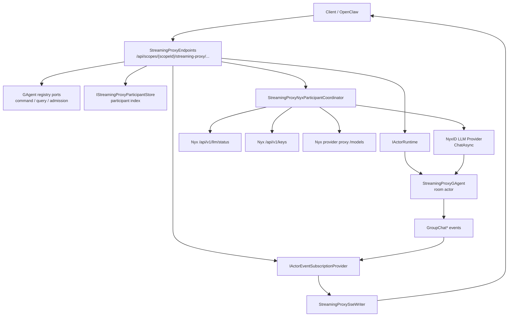
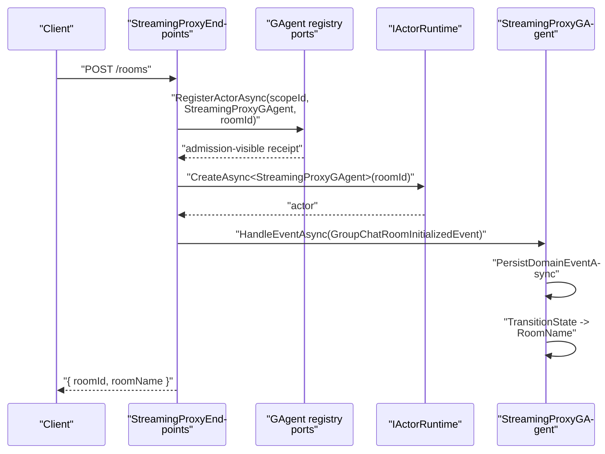
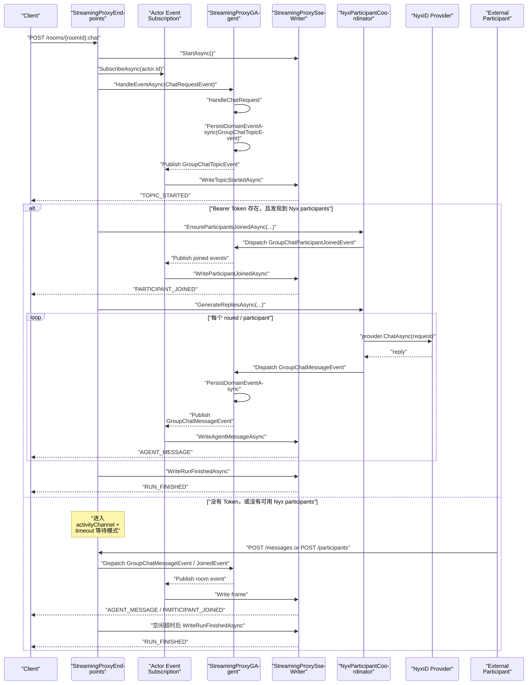
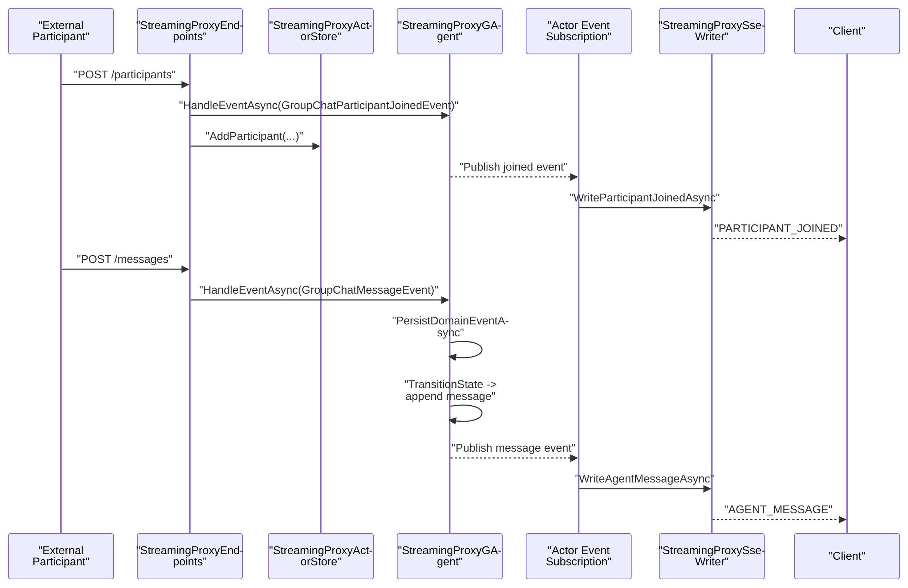

# Streaming Proxy 流程梳理

本文只整理当前仓库里 `Streaming Proxy` 这条真实实现链路，对应宿主是 `Aevatar.Mainnet.Host.Api`，入口是 `/api/scopes/{scopeId}/streaming-proxy/...`。

2026-04-27 更新：room ownership 已切换到 [GAgent Registry Ownership](canon/gagent-registry-ownership.md) 定义的 registry command/query/admission ports。下文若出现 `StreamingProxyActorStore` 或 `IGAgentActorStore`，应视为旧实现残留描述，不再对应当前代码里的真实类型或文件路径。

目标是回答三个问题：

1. 用户发起一次 `streaming proxy` 聊天后，后端到底怎么流转。
2. SSE 是从哪里出的，哪些事件会被推给前端。
3. 当前实现里，`Nyx 自动 participant` 和 `外部 participant 手动接入` 两条路径分别怎么走。

## 1. 关键组件

| 组件 | 位置 | 职责 |
|---|---|---|
| `Aevatar.Mainnet.Host.Api` | `src/Aevatar.Mainnet.Host.Api/Program.cs` | 注册 `AddStreamingProxy()`，挂载 `MapStreamingProxyEndpoints()` |
| `StreamingProxyEndpoints` | `agents/Aevatar.GAgents.StreamingProxy/StreamingProxyEndpoints.cs` | 提供 room CRUD、`:chat`、`messages`、`messages:stream`、participant 管理 HTTP/SSE 入口 |
| `StreamingProxyGAgent` | `agents/Aevatar.GAgents.StreamingProxy/StreamingProxyGAgent.cs` | 房间 actor，本质上是 group chat broker；持久化事件、更新房间内消息/参与者状态、向订阅者发布事件 |
| `IGAgentActorRegistryCommandPort` / `IGAgentActorRegistryQueryPort` / `IScopeResourceAdmissionPort` | `src/Aevatar.Studio.Application/Studio/Abstractions/GAgentRegistryPorts.cs` | room ownership 的写入、列表查询与 command admission 边界 |
| `IStreamingProxyParticipantStore` | `src/Aevatar.Studio.Application/Studio/Abstractions/IStreamingProxyParticipantStore.cs` | room participant 的持久化索引，供 participant 查询、自动加入与失败移除时使用 |
| `StreamingProxyNyxParticipantCoordinator` | `agents/Aevatar.GAgents.StreamingProxy/StreamingProxyNyxParticipantCoordinator.cs` | 在带 Bearer Token 时发现 Nyx 可用 provider，把它们自动加入房间并生成多轮回复 |
| `StreamingProxySseWriter` | `agents/Aevatar.GAgents.StreamingProxy/StreamingProxySseWriter.cs` | 把 actor 事件映射成 SSE frame 输出给客户端 |

## 2. 总体拓扑

## 3. 对外接口

| 接口 | 作用 |
|---|---|
| `POST /api/scopes/{scopeId}/streaming-proxy/rooms` | 创建房间，并创建对应 `StreamingProxyGAgent` |
| `GET /api/scopes/{scopeId}/streaming-proxy/rooms` | 列出当前 scope 下的 room |
| `DELETE /api/scopes/{scopeId}/streaming-proxy/rooms/{roomId}` | 删除 room 索引 |
| `POST /api/scopes/{scopeId}/streaming-proxy/rooms/{roomId}:chat` | 用户发起一轮 topic，并以 SSE 持续接收本轮事件 |
| `POST /api/scopes/{scopeId}/streaming-proxy/rooms/{roomId}/messages` | 外部 participant 主动向房间发一条消息 |
| `GET /api/scopes/{scopeId}/streaming-proxy/rooms/{roomId}/messages:stream` | 长连接订阅房间消息流 |
| `GET /api/scopes/{scopeId}/streaming-proxy/rooms/{roomId}/participants` | 查询当前 participant 列表 |
| `POST /api/scopes/{scopeId}/streaming-proxy/rooms/{roomId}/participants` | 手动把一个 participant 加入房间 |

## 4. 房间创建链路

创建 room 时，入口先生成 `roomId`，通过 registry command port 注册 room ownership，并要求返回 admission-visible receipt；随后创建 `StreamingProxyGAgent`，向 actor 投递一个 `GroupChatRoomInitializedEvent`。

这里有两个状态落点：

1. registry actor state 是 room ownership 的权威来源；query port 读取其 readmodel 用于 `ListRoomsAsync(...)`。
2. `StreamingProxyGAgent` 持久化 `GroupChatRoomInitializedEvent`，并在自己的 `_proxyState.RoomName` 中保留房间名。

## 5. `:chat` 主链路

### 5.1 核心结论

一次 `POST /rooms/{roomId}:chat` 的执行顺序是：

1. 宿主先建立 SSE 响应。
2. 宿主先订阅 actor 事件流。
3. 宿主向房间 actor 投递 `ChatRequestEvent`。
4. `StreamingProxyGAgent` 不直接调用 LLM，而是把它转换成 `GroupChatTopicEvent`。
5. topic event 被持久化并广播，SSE 立刻收到 `TOPIC_STARTED`。
6. 后续进入两条分支：
   - 带 Bearer Token 且能发现 Nyx provider：服务端自动加入 participant 并生成回复。
   - 否则：等待外部 participant 通过 `/messages` 或 `/participants` 驱动房间继续流转。

### 5.2 时序图

## 6. Nyx 自动 participant 分支

当 `:chat` 请求带 Bearer Token 时，服务端会尝试自动发现可用 participant。

发现流程分三步：

1. 读取 Nyx authority。
2. 并行拉取可用 provider 和用户 service。
3. 再对每个 provider 拉 `/models`，为每个 participant 选择 model。

这里的 participant 身份不再只看 `provider_slug`，而是优先使用 Nyx 返回的节点/服务级稳定标识，再单独保存 route preference 供 LLM 路由使用。这样同一个 slug 下的多个 node 不会被合并成一个 participant。
当会话显式选择了 `llmRoute` / `llmModel` 时，Streaming Proxy 会优先用该会话偏好来排序 participant 和选 model；某个 participant 503 时只会被跳过，不再当成一条正常的 participant 发言。
失败的 participant 会同时发出 `GroupChatParticipantLeftEvent`，让 actor 状态、查询索引和前端已加入列表同步移除该节点，避免 UI 继续把 503 节点显示成仍在发言的 participant。

```mermaid
%%{init: {"maxTextSize": 100000, "flowchart": {"useMaxWidth": false, "nodeSpacing": 10, "rankSpacing": 50}, "themeVariables": {"fontSize": "10px"}}}%%
flowchart LR
    CHAT["HandleChatAsync"] --> TOKEN{"Bearer Token?"}
    TOKEN -- "No" --> WAIT["进入手动 participant 等待分支"]
    TOKEN -- "Yes" --> RESOLVE["ResolveParticipantsAsync"]
    RESOLVE --> AUTH["Resolve Nyx authority"]
    AUTH --> FETCH1["GET /api/v1/llm/status"]
    AUTH --> FETCH2["GET /api/v1/keys"]
    FETCH1 --> MERGE["合并 ready providers"]
    FETCH2 --> MERGE
    MERGE --> FILTER["过滤非 LLM service"]
    FILTER --> MODELS["GET {proxy}/models"]
    MODELS --> SELECT["选择 preferred route / default model"]
    SELECT --> JOIN["EnsureParticipantsJoinedAsync"]
    JOIN --> REPLY["GenerateRepliesAsync"]
```

### 6.1 participant 加入

`EnsureParticipantsJoinedAsync(...)` 的行为是：

1. 先从 `StreamingProxyActorStore` 读取已有 participant。
2. 对新增 participant 投递 `GroupChatParticipantJoinedEvent` 给 room actor。
3. 同时更新 `StreamingProxyActorStore` 的 participant 查询索引。

所以当前实现里，participant 有两份表现层状态：

1. actor 内 `_proxyState.Participants`
2. `StreamingProxyActorStore` 里的 query list

### 6.2 自动回复生成

`GenerateRepliesAsync(...)` 的行为是：

1. 按当前 active participants 决定总轮次。
   - 多 participant 时最多 `4` 轮。
   - 单 participant 时只跑 `1` 轮。
2. 为每个 participant 构造一次 LLM request：
   - system prompt 明确它是 room 内 participant
   - user prompt 带原始 topic 和最近 transcript
   - metadata 带 `NyxIdAccessToken` 和 `NyxIdRoutePreference`
3. 调 `NyxID provider.ChatAsync(...)` 拿回复。
4. 对回复做规范化，去掉 speaker label，避免串写别人的回复。
5. 把回复重新封装为 `GroupChatMessageEvent` 打回 room actor。

注意这里的房间推进不是“直接把 LLM 文本写 SSE”，而是：

1. `LLM reply`
2. 转成 `GroupChatMessageEvent`
3. 回到 `StreamingProxyGAgent`
4. actor 再发布事件
5. SSE 订阅端再收到 `AGENT_MESSAGE`

也就是说，SSE 输出仍然以 actor 事件流为单一来源。

## 7. 外部 participant 手动接入分支

如果没有 Nyx 自动 participant，或者你想让外部系统自己说话，那么流程是：

1. 外部系统先 `POST /participants` 把自己加入房间。
2. 外部系统可选地 `GET /messages:stream` 订阅房间 SSE。
3. 外部系统通过 `POST /messages` 把回复发回房间。
4. 宿主把这条消息投递给 room actor。
5. actor 持久化并广播 `GroupChatMessageEvent`。
6. 所有 SSE 订阅者都收到 `AGENT_MESSAGE`。

## 8. SSE 输出帧

`StreamingProxySseWriter` 当前会输出这些 frame：

| Type | 何时发送 |
|---|---|
| `TOPIC_STARTED` | actor 发布 `GroupChatTopicEvent` 后 |
| `AGENT_MESSAGE` | actor 发布 `GroupChatMessageEvent` 后 |
| `PARTICIPANT_JOINED` | actor 发布 `GroupChatParticipantJoinedEvent` 后 |
| `PARTICIPANT_LEFT` | actor 发布 `GroupChatParticipantLeftEvent` 后 |
| `RUN_FINISHED` | `:chat` 请求结束时 |
| `RUN_ERROR` | `:chat` 或 `messages:stream` 流程异常时 |

补充两个当前实现细节：

1. `WriteRoomCreatedAsync(...)` 虽然存在，但当前 endpoint 没有使用它。
2. `AGENT_MESSAGE` 的 `sequence` 当前固定写 `0`；虽然 actor state 里维护了 `next_sequence`，但 SSE 映射层没有把它透出。

## 9. 结束判定

`:chat` 路径有两种结束方式：

1. `Nyx 自动 participant` 分支
   - `GenerateRepliesAsync(...)` 跑完，立刻写 `RUN_FINISHED`。
2. `手动 participant` 分支
   - 通过 `activityChannel` 等待房间事件。
   - 超时时间是分阶段的：
     - 初始无活动：`15000ms`
     - topic 后但还没 agent message：`5000ms`
     - 已有 agent message 后空闲：`1500ms`
   - 任一阶段空闲超时后，写 `RUN_FINISHED`。

## 10. 当前实现里的状态落点

当前 `Streaming Proxy` 不是单纯的“HTTP 直接转发”，而是一个“HTTP + room actor + SSE fan-out”的模型。

状态分别落在三处：

1. `StreamingProxyActorStore`
   - room 列表
   - participant 查询索引
2. `StreamingProxyGAgent` 事件与 `_proxyState`
   - 房间名
   - participant 集合
   - message transcript
   - `next_sequence`
3. SSE 订阅流
   - 只承载实时输出，不承载查询事实

如果只看当前代码，真正驱动前端实时展示的是 actor 发布的 `GroupChat*` 事件，不是 `StreamingProxyActorStore`。

## 11. 关键代码锚点

1. `src/Aevatar.Mainnet.Host.Api/Program.cs`
2. `agents/Aevatar.GAgents.StreamingProxy/StreamingProxyEndpoints.cs`
3. `agents/Aevatar.GAgents.StreamingProxy/StreamingProxyGAgent.cs`
4. `agents/Aevatar.GAgents.StreamingProxy/StreamingProxyNyxParticipantCoordinator.cs`
5. `agents/Aevatar.GAgents.StreamingProxy/StreamingProxyActorStore.cs`
6. `agents/Aevatar.GAgents.StreamingProxy/StreamingProxySseWriter.cs`
7. `agents/Aevatar.GAgents.StreamingProxy/streaming_proxy_messages.proto`
