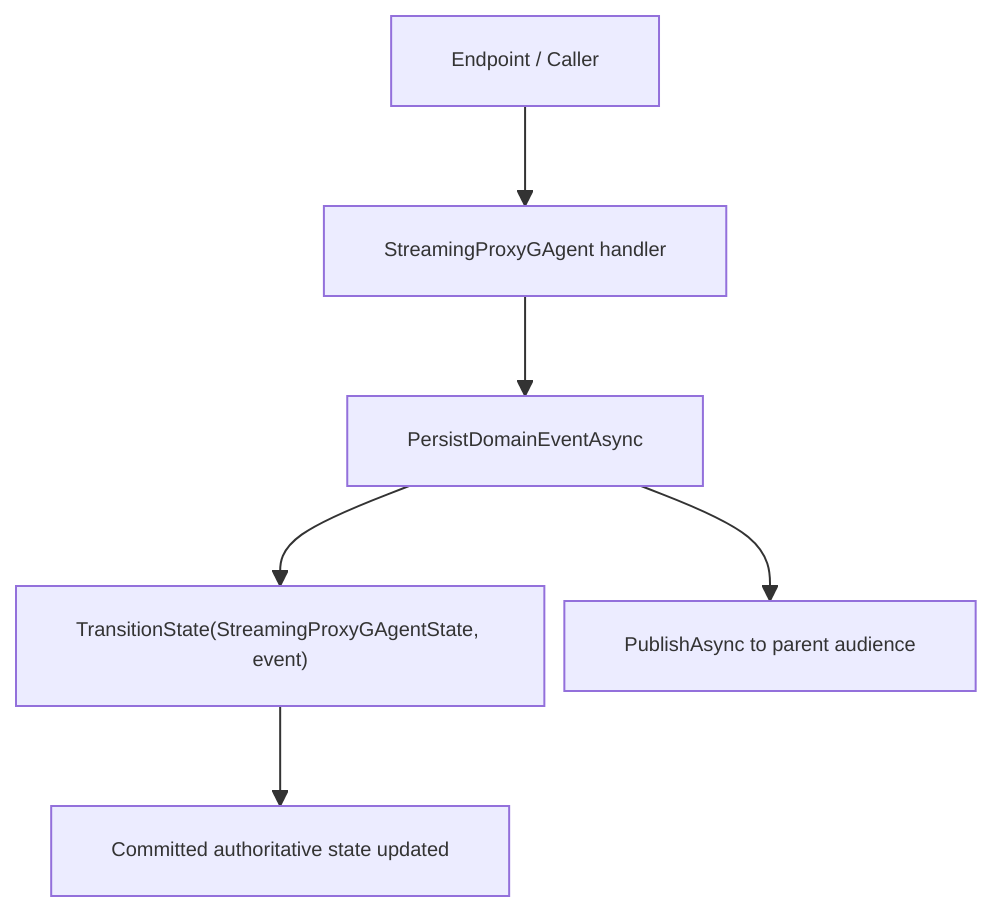

# StreamingProxy Actor-State Convergence Blueprint

## 1. 文档元信息

- 状态: Draft
- 日期: 2026-04-15
- 关联 Issue: #209
- 适用范围: `StreamingProxyGAgent` actor 内部权威状态收敛
- 当前建议: 将 `StreamingProxyGAgent` 从 `RoleGAgent` 收敛为以 `StreamingProxyGAgentState` 为唯一 actor 状态的 state-owning actor
- 兼容性前提: 当前能力尚未上线，本次设计与实施明确不考虑历史快照兼容、在线迁移、双状态兼容或灰度过渡

本文只定义 `StreamingProxyGAgent` 自身的 actor 内部状态收敛，
不定义 streaming proxy 子系统在 store/query/readmodel 层面的最终事实源收敛方案。

## 2. 背景与关键决策

当前 `StreamingProxyGAgent` 一边继承 `RoleGAgent`，一边在私有字段里维护房间事实状态：

- [StreamingProxyGAgent.cs](/Users/liyingpei/Desktop/Code/aevatar2/agents/Aevatar.GAgents.StreamingProxy/StreamingProxyGAgent.cs)
- [streaming_proxy_messages.proto](/Users/liyingpei/Desktop/Code/aevatar2/agents/Aevatar.GAgents.StreamingProxy/streaming_proxy_messages.proto)
- [RoleGAgent.cs](/Users/liyingpei/Desktop/Code/aevatar2/src/Aevatar.AI.Core/RoleGAgent.cs)

现状是：

- `RoleGAgentState` 仍是事件溯源主状态
- `_proxyState` 才真正保存 room / participant / message / sequence 事实
- `TransitionState(...)` 同时推进两条状态路径

这违反了“单一权威拥有者”和“单一主干”的仓库要求，也让测试和后续查询语义很难收敛。

本设计文档做出两个关键决策：

1. `StreamingProxyGAgentState` 必须成为 `StreamingProxyGAgent` 的唯一 actor 内部业务状态
2. `StreamingProxyGAgent` 不再继续建模为 `RoleGAgent`，应改为普通 `GAgentBase<StreamingProxyGAgentState>`

不采用“继续继承 `RoleGAgent`，只是把 `_proxyState` 换个放法”的折中方案。原因很简单，`RoleGAgentState` 的职责是 AI role session / config / pending approval，不是聊天室 broker 状态；继续挂在上面，只会把语义继续拧巴下去。

## 3. 重构目标

- 移除私有影子状态 `_proxyState`
- 让 `StreamingProxyGAgentState` 成为唯一事件溯源状态
- 保持现有 room init / topic / message / join / leave 外部行为不变
- 让测试改为验证权威 state，而不是反射扒私有字段
- 为后续 store / projection / readmodel 收敛留下清晰边界

## 4. 范围与非范围

### 范围

- [StreamingProxyGAgent.cs](/Users/liyingpei/Desktop/Code/aevatar2/agents/Aevatar.GAgents.StreamingProxy/StreamingProxyGAgent.cs)
- [streaming_proxy_messages.proto](/Users/liyingpei/Desktop/Code/aevatar2/agents/Aevatar.GAgents.StreamingProxy/streaming_proxy_messages.proto) 的兼容性确认
- [StreamingProxyCoverageTests.cs](/Users/liyingpei/Desktop/Code/aevatar2/test/Aevatar.AI.Tests/StreamingProxyCoverageTests.cs)
- 最小必要的 DI / event sourcing factory 调整

### 非范围

- `#148` 的 actor store 收敛
- `StreamingProxyActorStore` / `IGAgentActorStore` / `IStreamingProxyParticipantStore` 的最终事实源治理
- `#204` 的 AGUI / SSE projection-session 主链统一
- endpoint transport 语义重写
- 将 streaming proxy 直接接入新的 read model / projection 方案
- 为未上线前的旧 `StreamingProxyGAgent` 快照、旧 state type 或历史实例提供兼容加载/迁移方案

## 5. 架构硬约束

- 业务事实只能有一个权威状态类型
- 不允许再保留服务内私有影子业务状态字段
- 事件应用路径只能有一条
- 不允许把 room / participant / message 事实强塞进 `RoleGAgentState`
- 外部 endpoint 契约与已有消息协议尽量不变
- 所有状态与事件继续保持 Protobuf
- 本次不宣称 query/store 面已经完成单一事实源收敛

## 6. 当前基线

### 6.1 代码事实

1. `StreamingProxyGAgent` 当前继承 `RoleGAgent`  
   证据: [StreamingProxyGAgent.cs:21](/Users/liyingpei/Desktop/Code/aevatar2/agents/Aevatar.GAgents.StreamingProxy/StreamingProxyGAgent.cs#L21)

2. 房间事实落在 `_proxyState` 私有字段  
   证据: [StreamingProxyGAgent.cs:34](/Users/liyingpei/Desktop/Code/aevatar2/agents/Aevatar.GAgents.StreamingProxy/StreamingProxyGAgent.cs#L34)

3. `TransitionState(...)` 先走 `base.TransitionState(...)`，再单独 `ApplyProxyEvent(...)`  
   证据: [StreamingProxyGAgent.cs:107](/Users/liyingpei/Desktop/Code/aevatar2/agents/Aevatar.GAgents.StreamingProxy/StreamingProxyGAgent.cs#L107)

4. `RoleGAgentState` 不具备承载 proxy room 当前态的合适强类型槽位  
   证据: [ai_messages.proto:119](/Users/liyingpei/Desktop/Code/aevatar2/src/Aevatar.AI.Abstractions/ai_messages.proto#L119)

5. 测试通过反射读取 `_proxyState` 验证事实  
   证据: [StreamingProxyCoverageTests.cs:352](/Users/liyingpei/Desktop/Code/aevatar2/test/Aevatar.AI.Tests/StreamingProxyCoverageTests.cs#L352)

### 6.2 问题归纳

- 状态分裂: event-sourced state 和真实业务 state 不是一回事
- 语义错位: `RoleGAgent` 是 AI role actor，streaming proxy 是 room coordinator actor
- 测试错位: 现在测的是私有实现细节，不是 actor 权威状态契约
- 后续难演进: 一旦要做 store / readmodel / projection，会先卡在“actor 内部 committed truth 是哪份 state”

## 7. 需求分解与状态矩阵

| ID | 需求 | 验收标准 | 当前状态 | 证据 |
|---|---|---|---|---|
| R1 | 去掉影子状态 | `_proxyState` 删除 | 未完成 | [StreamingProxyGAgent.cs:34](/Users/liyingpei/Desktop/Code/aevatar2/agents/Aevatar.GAgents.StreamingProxy/StreamingProxyGAgent.cs#L34) |
| R2 | 单一 actor 状态 | actor 仅使用 `StreamingProxyGAgentState` | 未完成 | [streaming_proxy_messages.proto:24](/Users/liyingpei/Desktop/Code/aevatar2/agents/Aevatar.GAgents.StreamingProxy/streaming_proxy_messages.proto#L24) |
| R3 | 单一路径转态 | `TransitionState(...)` 仅应用 proxy state | 未完成 | [StreamingProxyGAgent.cs:107](/Users/liyingpei/Desktop/Code/aevatar2/agents/Aevatar.GAgents.StreamingProxy/StreamingProxyGAgent.cs#L107) |
| R4 | 外部行为不回退 | 既有 topic / message / join / leave 测试仍通过 | 部分完成 | [StreamingProxyCoverageTests.cs](/Users/liyingpei/Desktop/Code/aevatar2/test/Aevatar.AI.Tests/StreamingProxyCoverageTests.cs) |
| R5 | 测试对齐权威状态 | 不再反射私有字段 | 未完成 | [StreamingProxyCoverageTests.cs:352](/Users/liyingpei/Desktop/Code/aevatar2/test/Aevatar.AI.Tests/StreamingProxyCoverageTests.cs#L352) |

## 8. 差距详解

### 8.1 为什么不能继续留在 `RoleGAgent`

`RoleGAgent` 这条基类链默认承担的是：

- chat session lifecycle
- model / prompt / tool config
- approval continuation
- streaming LLM execution

而 `StreamingProxyGAgent` 现在做的是：

- 房间初始化
- 参与者加入/离开
- 群聊 topic / message 广播
- 房间消息序号维护

它没有把 `RoleGAgent` 当成真正的 AI role actor 在用，只是借了一个现成 `ChatRequestEvent` handler 入口和 event sourcing 基类。这会导致继承语义和业务语义错位。

### 8.2 为什么不能把 proxy state 塞回 `RoleGAgentState`

- `RoleGAgentState` 没有为 proxy room 当前态预留合适语义字段
- 硬加 bag 或乱塞字段会污染 AI role 主模型
- 会让另一个本来清楚的 actor 类型继续依附在错误模型上

### 8.3 推荐收敛方向

推荐将 `StreamingProxyGAgent` 改为：

```text
GAgentBase<StreamingProxyGAgentState>
```

然后：

- 保留现有事件 handler 方法名和外部事件类型
- `HandleChatRequest(...)` 继续把 prompt 转成 `GroupChatTopicEvent`
- `PersistDomainEventAsync(...)` 继续产出 committed events
- `TransitionState(StreamingProxyGAgentState current, IMessage evt)` 直接返回 `ApplyProxyEvent(...)`

### 8.4 本次不解决什么

本文只解决 `StreamingProxyGAgent` 自身的 actor 内部状态收敛，不把以下问题伪装成“已完成”：

- room 列表查询是否继续走独立 store / registry
- participant 查询是否继续走独立 store
- query/readmodel 面是否已经与 actor state 达成单一事实源

换句话说，本次完成后能保证的是：

- `StreamingProxyGAgent` 不再同时维护 `RoleGAgentState + _proxyState` 双状态
- actor 内部 committed state 语义变清楚

本次完成后还不能自动宣称的是：

- 整个 streaming proxy 子系统已经完成 store/query/readmodel 收敛

## 9. 目标架构

### 9.1 目标职责划分

- `StreamingProxyGAgent`
  - 拥有唯一权威 state: `StreamingProxyGAgentState`
  - 接收 room domain events
  - 维护 participant / message / next_sequence
  - 向上游发布房间广播事件

- Host / Endpoint
  - 继续负责 HTTP / SSE 接入
  - 不直接拥有房间事实状态

### 9.2 目标状态模型

`StreamingProxyGAgentState` 继续承载：

- `room_name`
- `participants`
- `messages`
- `next_sequence`

这是当前最贴近业务语义的现成 state 契约，不需要再引入第二个 read-side state。

### 9.3 目标事件应用链



核心点只有一个，`StreamingProxyGAgent` 的 actor 内部状态更新链必须只有 `StreamingProxyGAgentState` 这一条。

## 10. 重构工作包

### WP1. 基类收敛

- 目标: `StreamingProxyGAgent` 不再继承 `RoleGAgent`
- 产物: actor 改为 `GAgentBase<StreamingProxyGAgentState>`
- 完成标准: 不再依赖 `RoleGAgentState` 与其 factory

### WP2. 状态转态收敛

- 目标: 删除 `_proxyState`
- 产物: `TransitionState(StreamingProxyGAgentState current, IMessage evt)`
- 完成标准: 只保留一条状态应用路径

### WP3. 行为保持

- 目标: room init / topic / message / join / leave 行为不回退
- 产物: 事件处理逻辑保持一致
- 完成标准: 既有核心用例测试通过

### WP4. 测试对齐

- 目标: 测试改为验证权威状态
- 产物: 去掉 `_proxyState` 反射断言，改成验证 `agent.State`
- 完成标准: 测试不再依赖私有字段实现细节

## 11. 里程碑与依赖

### M1. 设计确认

- 输出本文档
- 明确不与 `#148` 混做

### M2. actor 内核收敛

- 改基类
- 改 event sourcing factory 绑定
- 改 `TransitionState(...)`

### M3. 测试收敛

- 修复 coverage tests
- 跑 targeted tests 和稳定性门禁

依赖关系：

- 不依赖 `#148` 先合并
- 但若 `#148` 同时改 `StreamingProxyCoverageTests.cs`，落地时需要手工 rebase

## 12. 验证矩阵

| 目标 | 验证命令 | 通过标准 |
|---|---|---|
| actor 编译通过 | `dotnet build aevatar.slnx --nologo` | 无编译错误 |
| streaming proxy 测试通过 | `dotnet test test/Aevatar.AI.Tests/Aevatar.AI.Tests.csproj --filter StreamingProxyCoverageTests --nologo` | 用例全部通过 |
| 测试无轮询违规 | `bash tools/ci/test_stability_guards.sh` | 无新增违规 |
| 架构门禁不过度回退 | `bash tools/ci/architecture_guards.sh` | 不引入新的架构门禁失败 |

说明：

- 最后一条可能仍受当前 `dev` 现有失败项影响，执行时要区分“已有失败”与“本改动新增失败”。
- 当前能力尚未上线，本次实施不要求历史 `StreamingProxyGAgent` 快照兼容验证，不要求 `RoleGAgentState -> StreamingProxyGAgentState` 迁移方案，也不要求双状态兼容期。

## 13. 完成定义

- `StreamingProxyGAgent` 不再出现 `_proxyState`
- `StreamingProxyGAgent` 不再依赖 `RoleGAgentState`
- 状态事实只保留在 `StreamingProxyGAgentState`
- 相关测试不再通过反射验证私有字段
- targeted build / test 通过
- 文档与实现都明确: 本次完成的是 actor 内部状态收敛，不是 store/query 面的最终收敛

## 14. 风险与应对

### 风险 1: 误删了 `ChatRequestEvent` 兼容入口

- 影响: `/rooms/{roomId}:chat` 行为变化
- 应对: 保留 `HandleChatRequest(ChatRequestEvent request)`，但仅做 topic event 转换

### 风险 2: 事件溯源 factory 泛型不匹配

- 影响: 测试或 runtime 激活失败
- 应对: 同步调整测试和构造逻辑中的 `IEventSourcingBehaviorFactory<TState>`

### 风险 3: 已有快照无法被新状态类型加载

- 影响: 旧 room actor 重启后无法按原快照透明恢复
- 应对: 当前未上线，直接按无兼容负担处理；实现与验证均不以旧快照透明恢复为目标

### 风险 4: 与 `#148` 在测试文件上冲突

- 影响: 合并成本上升
- 应对: 尽量把实现变更集中在 actor 文件，测试修改保持最小

### 风险 5: 误把这次改动扩成 endpoint/store/query 架构重构

- 影响: 范围失控
- 应对: endpoint 只做最小兼容修正，不处理 `#204` 与 `#148` 问题

## 15. 执行清单

- [ ] 把 `StreamingProxyGAgent` 基类切到 `GAgentBase<StreamingProxyGAgentState>`
- [ ] 删除 `_proxyState`
- [ ] 收敛 `TransitionState(...)`
- [ ] 修正测试构造与断言，统一改为 `IEventSourcingBehaviorFactory<StreamingProxyGAgentState>` + `agent.State` 断言
- [ ] 跑 targeted build / tests / stability guard

## 16. 当前执行快照（2026-04-15）

- 已完成:
  - 问题定位
  - 优先级评估
  - issue 创建: `#209`
  - 本地设计蓝图落盘

- 未完成:
  - 代码实现
  - 测试修正
  - 验证命令执行

- 当前建议:
  - 若要做这项，按本文档直接实施
  - 不要把 `#204` 与 `#148` 一起打包进去
  - 不要为未上线系统额外设计 snapshot migration / compatibility shim

## 17. 变更纪律

- 实施时只收敛一个目标，禁止顺手把 endpoint projection 问题一起重写
- 实施时禁止把 `StreamingProxyActorStore` / participant store 的最终治理伪装成“顺手一并完成”
- 若实现后发现 `StreamingProxyGAgentState` 还缺字段，优先扩 proto，不回退到 bag
- 实施时明确按“未上线、无兼容包袱”执行，禁止额外引入 migration layer、双 state 兼容层或过渡适配器
- 如需调整设计结论，先更新本文档，再改代码
- 合并前必须附上验证命令和结果
