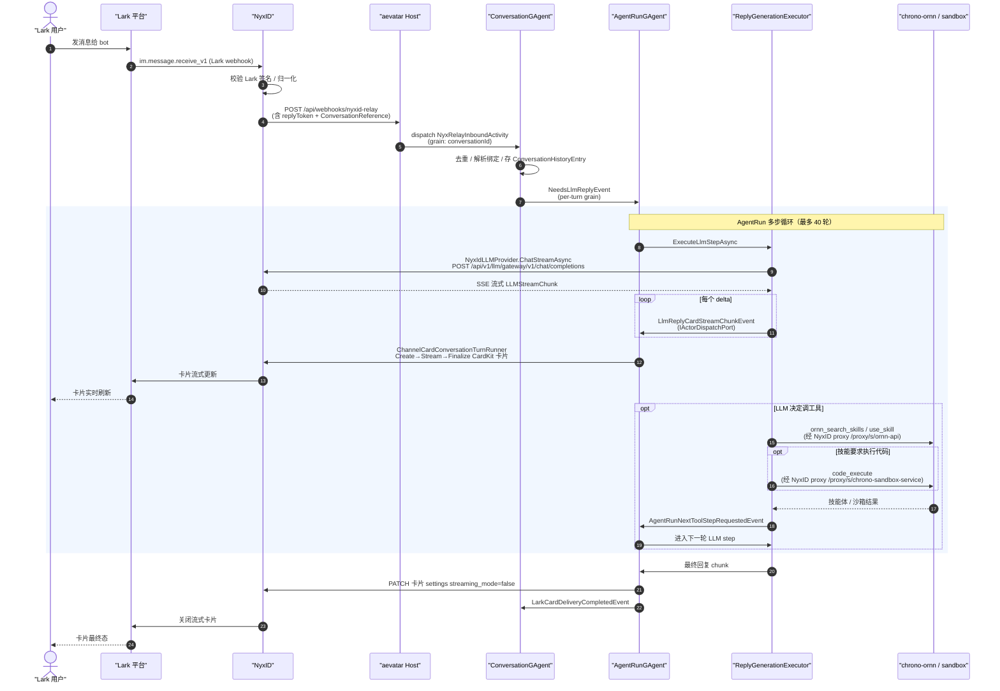
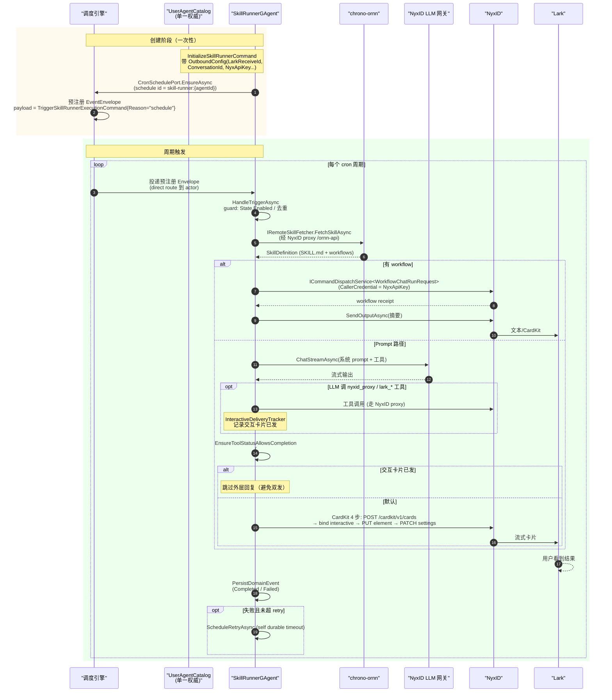
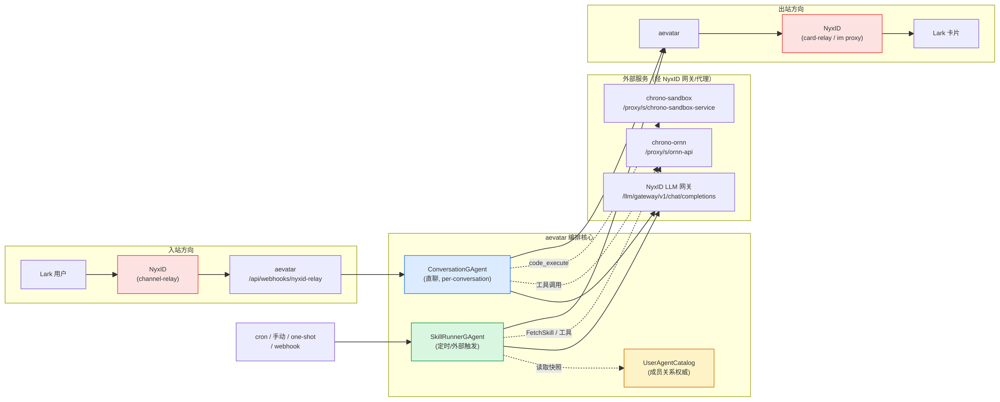

# Aevatar × NyxID × Ornn × Lark Bot 完整交互流程

> 时间：2026-06-15
> 范围：aevatar 仓库内部，加上三个外部依赖仓库（`../NyxID`、`../chrono-ornn`、`../chrono-storage`）的对外契约面。
> 目的：把「直聊」与「定时任务」两条端到端链路一次性画清楚。

---

## 0. 角色边界（先对齐心智模型）

| 系统 | 角色（一句话） | aevatar 用它做什么 |
|---|---|---|
| **Lark** | 终端用户 IM 平台 | 用户在这里发消息、看流式卡片回复 |
| **NyxID** (`../NyxID`) | 身份 + LLM 网关 + IM 通道中继（channel-relay）三合一 | (a) 持有 Lark 机器人凭证、收 Lark webhook；(b) 暴露 OpenAI 兼容的 LLM 网关；(c) 用 `/api/v1/proxy/s/<slug>/...` 反向代理到 Ornn / sandbox；(d) 转发用户消息到 aevatar |
| **aevatar**（本仓库） | 编排核心（Actor 化） | 收 NyxID 中继回调 → ConversationGAgent / SkillRunnerGAgent 编排 → 调 LLM / Ornn / sandbox → 把回复走 NyxID 通道送回 Lark |
| **chrono-ornn** (`../chrono-ornn`) | 「技能 npm registry + CLI」 | 技能检索 / 拉取技能体（SKILL.md + workflow yaml）/ 发布技能；**不负责跑代码** |
| **chrono-sandbox**（被 Ornn / aevatar 共用） | 代码沙箱执行 | 跑技能里的 `code_execute`，回 stdout/stderr |
| **chrono-storage** (`../chrono-storage`) | S3 兼容对象存储 | 文件工作区（Explorer facade）、用户记忆 blob |

**关键事实（很容易踩坑）**：

1. **aevatar 不直接对接 Lark OpenAPI。** Lark webhook 落在 NyxID；NyxID 归一化后回调 aevatar 的 `POST /api/webhooks/nyxid-relay`。aevatar 出站也是通过 NyxID 的 channel-relay，不持有 Lark App 凭证。
2. **NyxID 在单次会话里同时扮演三个角色**：LLM 网关（`/api/v1/llm/gateway/v1/chat/completions`）、Ornn/sandbox 反向代理（`/api/v1/proxy/s/...`）、IM 通道中继（`/api/v1/channel-relay/reply`）。
3. **Ornn ≠ 沙箱。** Ornn 是技能仓库；真正跑代码的是 chrono-sandbox，aevatar 直接通过 NyxID 代理调用，不经 Ornn。
4. **「Lark 机器人」是 NyxID 资源，不是 aevatar 资源。** 注册时 aevatar 调 NyxID `POST /api/v1/channel-bots`，NyxID 返回 `nyx_channel_bot_id` + `nyx_agent_api_key_id`，并自己持有 Lark 凭证。

---

## 1. 直聊流程（用户在 Lark 给 bot 发一条消息）

### 1.1 入站：Lark → NyxID → aevatar

| 步骤 | 实体 | 文件 |
|---|---|---|
| Lark webhook 接收 | **NyxID**（外部） | `../NyxID/backend/src/handlers/channel_webhooks.rs` |
| 归一化 + 签名验签 + 回调 aevatar | NyxID `channel-relay` | `../NyxID/backend/src/handlers/channel_relay.rs` |
| aevatar 回调入口 | `NyxIdChatEndpoints.HandleRelayWebhookAsync` | `agents/Aevatar.GAgents.NyxidChat/NyxIdChatEndpoints.Relay.cs` |
| 路由注册 | `app.MapPost("/api/webhooks/nyxid-relay", ...)` | `agents/Aevatar.GAgents.NyxidChat/NyxIdChatEndpoints.cs:35` |
| 解析 + 鉴权 | `NyxIdRelayTransport.Parse` + `NyxIdRelayAuthValidator.ValidateAsync` | 同上 |
| 归一化成 `NyxRelayInboundActivity` | `INyxIdRelayIngressPort` | `agents/channels/Aevatar.GAgents.Channel.NyxIdRelay/` |

入站 payload 关键字段：`ConversationReference`、`SenderNyxIdAccessToken`（JWT，`sub` = NyxID 用户 id）、`OutboundDelivery { ReplyMessageId, ReplyToken }`。**没有 `ReplyToken`，aevatar 无法回消息** —— 这是 NyxID 在每次回调时颁发的短时凭证。

### 1.2 编排：ConversationGAgent → AgentRunGAgent

- `ConversationGAgent`（按 conversationId 分桶的 Orleans grain）负责：去重、解析 conversation→bot persona / LLM 配置 / 技能包绑定、持久化 `ConversationHistoryEntry`，然后发 `NeedsLlmReplyEvent` 启一个新的 **per-turn `AgentRunGAgent`** grain。
  - 文件：`agents/Aevatar.GAgents.Channel.Runtime/Conversation/ConversationGAgent.cs`
  - 卡片模式下只消费终态 `LarkCardDeliveryCompletedEvent`，把完成事实写回 conversation。
- `AgentRunGAgent` 是「一轮对话」的状态机，持有「LLM step → tool step → LLM step …」的多步循环（上限 40 轮）。
  - 文件：`agents/Aevatar.GAgents.NyxidChat/AgentRunGAgent.cs`
  - 流式卡片生命周期：`AgentRunGAgent.LarkCardDelivery.cs` 驱动 CardKit Create → Stream → Finalize；renderer 抽象继续复用 `ReplyStreaming/LarkCardReplyStreamRenderer.cs`。
  - 它**不做 IO**，把每步的 IO 委托给 `AgentRunReplyGenerationExecutor`（`agents/Aevatar.GAgents.NyxidChat/AgentRunReplyGenerationExecutor.cs`）。
  - 步骤间驱动用 typed event：`AgentRunNextLlmStepRequestedEvent` / `AgentRunNextToolStepRequestedEvent` / `AgentRunReplyGenerationFailed`，通过 `DispatchToRunActorAsync` 回投。

### 1.3 LLM 调用：经 NyxID 网关（流式）

- `AgentRunReplyGenerationExecutor.BuildLlmStepContinuationAsync` → `plan.StepExecutor.ExecuteLlmStepAsync(provider, llmRequest, onDelta, ct)`。
- Provider = `NyxIdLLMProvider`，**只支持** `ChatStreamAsync`（仓库规则：主链必须流式，已移除 `ChatAsync`）。
  - 文件：`src/Aevatar.AI.LLMProviders.NyxId/NyxIdLLMProvider.cs`
  - 协议：用「用户自己的 NyxID access token」当 OpenAI API Key，POST `{nyx}/api/v1/llm/gateway/v1/chat/completions`，SSE 回 `LLMStreamChunk`。
  - NyxID 后端 `gateway_request`（`../NyxID/backend/src/handlers/llm_gateway.rs:325`）按 `model` 字段路由到上游 provider。
- **流式回调钩子**：每个 delta 走 `onDelta` → `TurnStreamingReplySink.DispatchAsync`（`agents/Aevatar.GAgents.Channel.Runtime/TurnStreamingReplySink.cs`）→ `IActorDispatchPort` 投递流式 chunk。文本编辑模式的 `LlmReplyStreamChunkEvent` 回到 `ConversationGAgent`；卡片模式的 `LlmReplyCardStreamChunkEvent` 投到 **run actor**。`AgentRunReplyGenerationExecutor` 在 card-mode 下使用 `streamingTargetActorId = runActorId`，非卡片模式仍使用 `targetActorId`。带节流（`StreamingCardKitFlushIntervalMs`）和 interim-chunk 上限。

### 1.4 工具调用：Ornn 技能 / sandbox（在 LLM 循环内）

LLM 流式返回里若带 `tool_calls`，executor 解析出 `effectiveToolCalls`（要么来自 `llmResult.ToolCalls`，要么从 content 里用 `TextToolCallParser.Parse` 兜底），转成 `AgentRunNextToolStepRequestedEvent` → `ExecuteToolStepAsync`。

| 工具 | aevatar 实现 | 走 NyxID 哪个代理 | 后端 |
|---|---|---|---|
| `ornn_search_skills` | `OrnnSearchSkillsTool` (`src/Aevatar.AI.ToolProviders.Ornn/`) | `/api/v1/proxy/s/ornn-api/skill-search` | `../chrono-ornn/ornn-api/src/domains/skills/search` |
| `use_skill` | `OrnnSkillClient.GetSkillJsonAsync` | `/api/v1/proxy/s/ornn-api/skills/{id}/json` | `../chrono-ornn/ornn-api/src/domains/skills/crud` |
| `code_execute` | `NyxIdCodeExecuteTool` (`src/Aevatar.AI.ToolProviders.NyxId/Tools/`) | `/api/v1/proxy/s/chrono-sandbox-service/execute` | chrono-sandbox（Ornn 也用同一沙箱） |

工具结果以 tool message 回灌给下一轮 LLM，直到模型给出无 `tool_calls` 的最终文本。

> 规划侧有个「`SkillRecoveryPlanner`」（`src/Aevatar.AI.Core/Chat/SkillRecoveryPlanner.cs`）：当本回合的 metadata 提示需要技能时，它会强制往 plan 里注入一个 `ornn_search_skills` 工具要求，把模型「推」到先去发现/加载技能。这是规划门，不是独立 actor。

### 1.5 出站：aevatar → NyxID → Lark 卡片

`AgentRunGAgent.HandleLlmReplyCardStreamChunkAsync` 把每个 card chunk 喂给 `LarkCardReplyStreamRenderer`，由 `AgentRunGAgent.LarkCardDelivery.cs` 驱动三阶段卡片生命周期（`LarkCardOperationPhase`：**Create → Stream → Finalize**）。完成后 run actor 发 `LarkCardDeliveryCompletedEvent` 给 `ConversationGAgent`，后者只负责落 conversation 终态与 history：

| 阶段 | 动作 | 实现 |
|---|---|---|
| Create | POST 创建流式卡片壳（`streaming_mode=true`，单个空 `markdown` element） | `ChannelCardConversationTurnRunner.RunCardCreateAsync` |
| Stream | PATCH 该 element 的 `content`（流式累积文本） | `RunCardStreamAsync` |
| Finalize | PATCH settings `streaming_mode=false` | finalize step |

- 卡片 schema 单一所有者：`LarkStreamingCardShell.BuildInitialCardJson(streamingElementId)` / `BuildCloseStreamingSettingsJson()`（`agents/platforms/Aevatar.GAgents.Platform.Lark/LarkStreamingCardShell.cs`）。
- 卡片跑手：`ChannelCardConversationTurnRunner`（`agents/Aevatar.GAgents.NyxidChat/`）实现 `IConversationCardTurnRunner`，这里产生对 NyxID 卡片中继 API 的真实 HTTP。
- 文本模式（非卡片）：`NyxIdRelayOutboundPort`（`agents/channels/Aevatar.GAgents.Channel.NyxIdRelay/NyxIdRelayOutboundPort.cs`）：`SendAsync`（首次发送，POST `/api/v1/channel-relay/reply`）→ `UpdateAsync`（编辑同一条 `om_xxx`，POST `/reply/update`）。Lark 不支持编辑时降级为纯文本。

**模式开关**：`RelayOptions.StreamingCardKitEnabled`（true → CardKit 卡片，false → 文本 edit-in-place）。

---

## 2. 定时任务流程（SkillRunnerGAgent，cron 触发）

### 2.1 创建 + cron 注册（一次性）

- 入口：`ISkillRunnerCommandPort.InitializeAsync(agentId, command, runImmediately, ct)`（`SkillRunnerCommandPort.cs`）。
  1. `EnsureSkillRunnerActorAsync`：get-or-create `SkillRunnerGAgent`。
  2. `DispatchAsync(InitializeSkillRunnerCommand)`（publisher `"scheduled.skill-runner"`，direct route）。
  3. `SkillRunnerCronSchedulePort.EnsureAsync`：**仅当 `ScheduleMode == Cron`** 才注册（`SkillRunnerCronSchedulePort.cs:18`）。
  4. 若 `runImmediately`，立刻发 `TriggerSkillRunnerExecutionCommand{Reason="create_agent"}`。
- `HandleInitializeAsync` 持久化 `SkillRunnerInitializedEvent`，把 `SkillRef`、`OutboundConfig`、`ScheduleMode/Cron/Timezone`、`RequiresNyxidProxySuccess` 等存进 `State`。
- cron 注册细节：schedule id = `"skill-runner:{agentId}"`，target = `Envelope`，envelope payload = `TriggerSkillRunnerExecutionCommand{Reason="schedule"}`，direct route 到 actor。**cron 不是 actor 内部 timer，而是外部 durable dispatch（Orleans reminder 支撑的 `ScheduledDispatchApplicationService`）**。每次到点，调度引擎把「创建时已序列化好的」Envelope 重投进 actor inbox。

### 2.2 触发：cron / 手动 / one-shot / 外部

四种触发方式都收敛到同一个 `HandleTriggerAsync(TriggerSkillRunnerExecutionCommand)`（`SkillRunnerGAgent.cs:388`），只差 `Reason`：

| 触发源 | Reason | 投递方式 |
|---|---|---|
| cron 周期 | `"schedule"` | 调度引擎重投预注册 Envelope |
| 手动 / UI 按钮 | 自定义 | `ISkillRunnerCommandPort.TriggerAsync` 发新 Envelope |
| 创建时立即跑 | `"create_agent"` | Initialize 时 `runImmediately=true` |
| one-shot（一次性，非 cron） | `"one_shot"` | `ScheduleOneShotRunAsync` → `ScheduleSelfDurableTimeoutAsync`（actor 自提醒），**不注册 cron** |
| 外部（webhook / NyxID 中继） | `"external_trigger"` | `AdmitExternalTriggerAsync` → actor 内 `SendToAsync(Id, ...)` |

### 2.3 投递目标解析：UserAgentCatalog + OutboundConfig

**运行中的 `SkillRunnerGAgent` 不在执行期调 `UserAgentDeliveryTargetReader`** —— 它自己的 event-sourced `State.OutboundConfig`（`HandleInitializeAsync` 时从 command 拷贝）已带 `NyxApiKey`、`NyxProviderSlug`、`ConversationId`、`LarkReceiveId`、`LarkReceiveIdType` + fallback。

- `UserAgentCatalogGAgent`（单一知名 actor `scheduled.user-agent-catalog`）是「成员关系权威」：存每个 agent 的路由 + Nyx 凭证。投影成 `UserAgentCatalogDocument` / `UserAgentCatalogNyxCredentialDocument`，支撑 `/agents`、`/agent-status` 查询和 `UserAgentDeliveryTargetReader`。
- `UserAgentDeliveryTargetReader`（`UserAgentDeliveryTargetReader.cs:38`）只给「runner 外部的出站组件」用 —— 具体是 `FeishuCardHumanInteractionPort`（`agents/Aevatar.GAgents.Authoring.Lark/`）。CI 门禁 `agent_tool_delivery_target_reader_guard.sh` 禁止 `IAgentTool` 依赖它。
- 总结：**catalog 是创建/查询时的真相源；runner 在执行期用自己的 state 快照**。

### 2.4 执行技能：Prompt vs Workflow

`ExecuteSkillAsync`（`SkillRunnerGAgent.cs:638`）→ `BuildExecutionPlanAsync`：

- 强制 `Source == Ornn`（`:1186`：「Scheduled skill runner only supports Ornn skill references.」）。
- `IRemoteSkillFetcher.FetchSkillAsync(State.OutboundConfig.NyxApiKey, name)` → 生产实现 `OrnnRemoteSkillFetcher`（`src/Aevatar.AI.ToolProviders.Ornn/`）→ `OrnnSkillClient.GetSkillJsonAsync`（经 NyxID proxy）→ 解析 `SKILL.md` frontmatter + `workflows/*.yaml` → 返回 `SkillDefinition`。
- 有 workflow → `Workflow` 计划；否则 `Prompt` 计划。

### 2.5 Prompt 路径：流式文本 / CardKit

`ExecutePromptSkillAsync`（`:671`）：

1. `TryCreateStreamingSink()`：**仅当 `OutputFormat == Text` 且 `!RequiresNyxidProxySuccess`** 才建 `SkillRunnerStreamingReplySink`。
   - 首次快照：POST `open-apis/im/v1/messages`（`msg_type=text`）拿到 `message_id`。
   - 后续快照：PUT `open-apis/im/v1/messages/{id}`（文本编辑）。Lark 编辑次数到顶（230072）时 seal + 重发新消息。
2. `await foreach (var chunk in ChatStreamAsync(...))`：累积 delta，节流后转给 sink。
3. `EnsureToolStatusAllowsCompletion`（issue #439 安全网）：`RequiresNyxidProxySuccess` 时若 `nyxid_proxy` 零成功或全失败，**拒绝假成功**。
4. 若 `_interactiveDeliveryTracker.HasSuccessfulInteractiveDelivery`（模型自己用工具发了交互卡片），**跳过外层回复**避免双发。
5. `BuildOutputChunksAsync` → `DispatchOutputChunksAsync`（`:840`）：`Auto` 输出优先走 CardKit；溢出部分走纯文本 POST。

### 2.6 CardKit 投递：4 步（`SkillRunnerCardKitReplySink.SendFinalAsync`）

当 `OutputFormat == Auto`（默认），runner 不流式编辑文本，而是在跑完 + 过安全网后执行：

1. POST `open-apis/cardkit/v1/cards`（`LarkStreamingCardShell.BuildInitialCardJson`）→ 拿 `card_id`。
2. 绑定到聊天：`LarkOutboundDispatcher.SendNewMessageAsync`，`msg_type="interactive"`，`content={type:"card", data:{card_id}}`。
3. PUT `open-apis/cardkit/v1/cards/{cardId}/elements/streaming_main/content`（sequence 1）写最终 markdown。
4. PATCH `open-apis/cardkit/v1/cards/{cardId}/settings`（sequence 2）关 `streaming_mode`。

若 create/bind 失败在「任何可见消息产生之前」→ 降级文本；若失败在「已可见之后」→ 抛 `SkillRunnerVisibleDeliveryException`（标记失败、不重试，避免重复卡片）。

### 2.7 Lark HTTP 传输：`LarkOutboundDispatcher`

所有新消息 POST（文本 + CardKit bind）走 `ILarkOutboundDispatcher.SendNewMessageAsync`（`LarkOutboundDispatcher.cs`）：

- 序列化 `{receive_id, msg_type, content}` → `NyxIdApiClient.ProxyRequestAsync(nyxApiKey, providerSlug, "open-apis/im/v1/messages?receive_id_type=...", "POST", body)`。
- 遇 `230002 bot not in chat`：用 `FallbackTarget` 重试一次。
- 文本 PUT 编辑 / CardKit 调用：直接在各自 sink 内走 `NyxIdApiClient.ProxyRequestAsync`；dispatcher 只拥有「新消息 POST」。

### 2.8 交互投递追踪：`SkillRunnerInteractiveDeliveryTrackingMiddleware`

LLM 工具链里的中间件。若模型调用 `reply_with_interaction` / `lark_messages_send` / `lark_messages_reply` 且是交互消息类型、工具结果成功，就翻 `SkillRunnerInteractiveDeliveryTracker.HasSuccessfulInteractiveDelivery`，runner 据此跳过自己的外层 Lark 回复。在 `BuildToolMiddlewareChain`（`SkillRunnerGAgent.cs:201`）里和 `NyxIdProxyToolFailureCountingMiddleware` 一起挂上。

---

## 3. 两条链路的对比与共性

### 3.1 关键差异表

| 维度 | 直聊（ConversationGAgent + AgentRunGAgent） | 定时任务（SkillRunnerGAgent） |
|---|---|---|
| **触发** | 用户在 Lark 发消息 → NyxID 回调 | cron / 手动 / one-shot / 外部 webhook |
| **回合所有者** | `ConversationGAgent`（per-conversation）→ `AgentRunGAgent`（per-turn） | `SkillRunnerGAgent`（per-agent，event-sourced state） |
| **LLM 主链** | `AgentRunReplyGenerationExecutor` → `NyxIdLLMProvider.ChatStreamAsync` | 直接 `ChatStreamAsync`（同 provider） |
| **技能加载** | LLM 自主 `ornn_search_skills` / `use_skill`（工具调用） | 创建期固定 `SkillRef`，执行期 `IRemoteSkillFetcher.FetchSkillAsync`（强制 Ornn 源） |
| **工具循环上限** | 40 轮 | 受 `MaxRetryAttempts` + 安全网约束 |
| **投递目标来源** | 回调里的 `ConversationReference` + `ReplyToken` | `State.OutboundConfig`（创建期拷贝自 catalog） |
| **出站模式** | CardKit 卡片（Create→Stream→Finalize）或文本 edit-in-place | 默认 `Auto` → CardKit 4 步；`Text` → 流式文本编辑；交互工具已发则跳过 |
| **回复授权** | NyxID 回调时颁发的短时 `ReplyToken` | `OutboundConfig.NyxApiKey`（长期 NyxID 代理凭证） |
| **失败处理** | AgentRun 步骤级失败事件 | `ScheduleRetryAsync`（actor 自超时退避）/ `SkillRunnerExecutionFailedEvent` / `TrySendFailureAsync` |
| **去重 / 幂等** | conversationId 维度去重 | dispatch id `"{scheduleId}:trigger"` 幂等 + 外部触发 `IsExternalTriggerTerminal` |

### 3.2 共性（两条链路共享的底层）

1. **LLM 一律走 NyxID 网关**，且一律 `ChatStreamAsync`（仓库禁用 `ChatAsync` 作主链）。
2. **Ornn 一律经 NyxID proxy**（slug `ornn-api`），aevatar 不直连 Ornn。
3. **Lark 出站一律经 NyxID**：要么 channel-relay `/reply`（直聊），要么 `/proxy` 调 Lark OpenAPI（定时任务用 `NyxApiKey`）。
4. **流式卡片 schema 单一来源**：`LarkStreamingCardShell`（`agents/platforms/Aevatar.GAgents.Platform.Lark/`）。
5. **Lark 原生消息组合**单一来源：`LarkMessageComposer` + `LarkChannelNativeMessageProducer`。
6. **NyxID 凭证优先级**：直聊用「用户 per-turn access token」；定时任务用「agent 持有的 `NyxApiKey`」。

---

## 4. 关键文件索引

### 直聊链路
- 回调入口：`agents/Aevatar.GAgents.NyxidChat/NyxIdChatEndpoints.Relay.cs`（路由：`NyxIdChatEndpoints.cs:35`）
- 编排：`agents/Aevatar.GAgents.Channel.Runtime/Conversation/ConversationGAgent.cs` + `agents/Aevatar.GAgents.NyxidChat/AgentRunGAgent.LarkCardDelivery.cs`
- 回合状态机：`agents/Aevatar.GAgents.NyxidChat/AgentRunGAgent.cs`
- 步骤执行器：`agents/Aevatar.GAgents.NyxidChat/AgentRunReplyGenerationExecutor.cs`
- LLM provider：`src/Aevatar.AI.LLMProviders.NyxId/NyxIdLLMProvider.cs`
- 流式 sink：`agents/Aevatar.GAgents.Channel.Runtime/TurnStreamingReplySink.cs`
- 卡片渲染：`agents/Aevatar.GAgents.Channel.Runtime/Conversation/ReplyStreaming/LarkCardReplyStreamRenderer.cs`
- 卡片跑手：`agents/Aevatar.GAgents.NyxidChat/ChannelCardConversationTurnRunner.cs`
- 文本出站：`agents/channels/Aevatar.GAgents.Channel.NyxIdRelay/NyxIdRelayOutboundPort.cs`

### 定时任务链路
- 核心 actor：`agents/Aevatar.GAgents.Scheduled/SkillRunnerGAgent.cs`
- cron 注册：`agents/Aevatar.GAgents.Scheduled/SkillRunnerCronSchedulePort.cs`
- 调度引擎：`src/platform/Aevatar.GAgentService.Application/Schedules/ScheduledDispatchApplicationService.cs`
- 命令端口：`agents/Aevatar.GAgents.Scheduled/SkillRunnerCommandPort.cs`
- 成员目录：`agents/Aevatar.GAgents.Scheduled/UserAgentCatalogGAgent.cs`
- 投递目标 reader：`agents/Aevatar.GAgents.Scheduled/UserAgentDeliveryTargetReader.cs`
- 文本流式 sink：`agents/Aevatar.GAgents.Scheduled/SkillRunnerStreamingReplySink.cs`
- CardKit sink：`agents/Aevatar.GAgents.Scheduled/SkillRunnerCardKitReplySink.cs`
- Lark HTTP 传输：`agents/Aevatar.GAgents.Scheduled/LarkOutboundDispatcher.cs`
- 交互投递追踪：`agents/Aevatar.GAgents.Scheduled/SkillRunnerInteractiveDeliveryTrackingMiddleware.cs`

### 共享 / 平台层
- 卡片 schema：`agents/platforms/Aevatar.GAgents.Platform.Lark/LarkStreamingCardShell.cs`
- 消息组合：`agents/platforms/Aevatar.GAgents.Platform.Lark/LarkMessageComposer.cs` + `LarkChannelNativeMessageProducer.cs`
- Ornn 客户端：`src/Aevatar.AI.ToolProviders.Ornn/OrnnSkillClient.cs` + `OrnnRemoteSkillFetcher.cs`
- code_execute：`src/Aevatar.AI.ToolProviders.NyxId/Tools/NyxIdCodeExecuteTool.cs`
- NyxID HTTP 客户端：`src/Aevatar.AI.ToolProviders.NyxId/NyxIdApiClient.cs`

### 外部仓库入口（仅契约面，不动它们）
- NyxID LLM 网关：`../NyxID/backend/src/handlers/llm_gateway.rs`
- NyxID 通道中继：`../NyxID/backend/src/handlers/channel_relay.rs` + `channel_webhooks.rs`
- Ornn 技能 CRUD：`../chrono-ornn/ornn-api/src/domains/skills/`

---

## 5. 备注 / 已知 gap

1. **NyxID 卡片中继的具体 URL 字面值**未在本文枚举（在 `NyxIdApiClient` / `ChannelCardConversationTurnRunner` 内部）。需要精确路由字符串时去这两处读。
2. **chrono-storage 的 `/api/explorer/*` 路由在 `../chrono-storage` 仓库里不存在**（只暴露 `/api/buckets` + `/api/buckets/:bucket/objects`）。aevatar `ChronoStorageApiClient` 调的 Explorer 是前置的 facade 服务，不在本仓库也不在 chrono-storage 仓库。若要调试 Explorer 调用，契约面只在 aevatar 侧定义。
3. **`SkillRecoveryOrchestrator` 文件不存在**；技能恢复逻辑全在 `SkillRecoveryPlanner`（规划侧注入工具要求），没有独立 orchestrator actor。
4. aevatar 严禁改外部仓库；若当前能力不足，方案只能在「本仓库内绕开」或「不做」之间二选一，不能写成外部 feature request。
