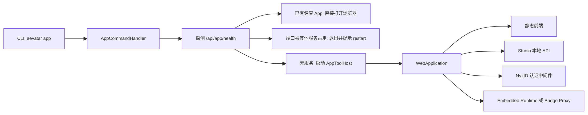
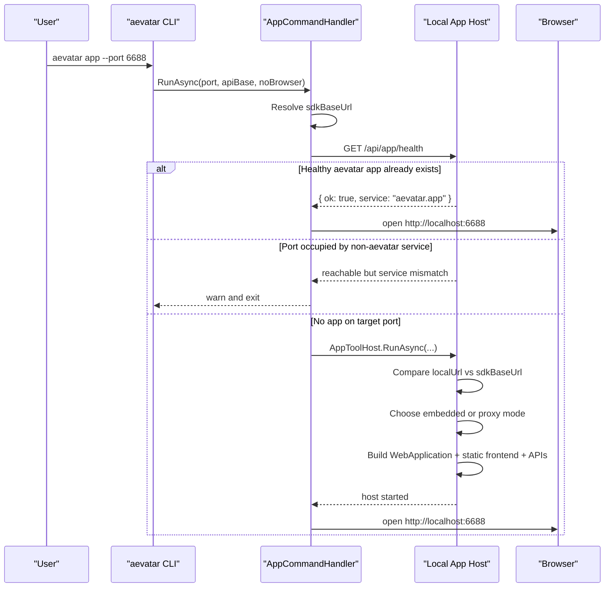
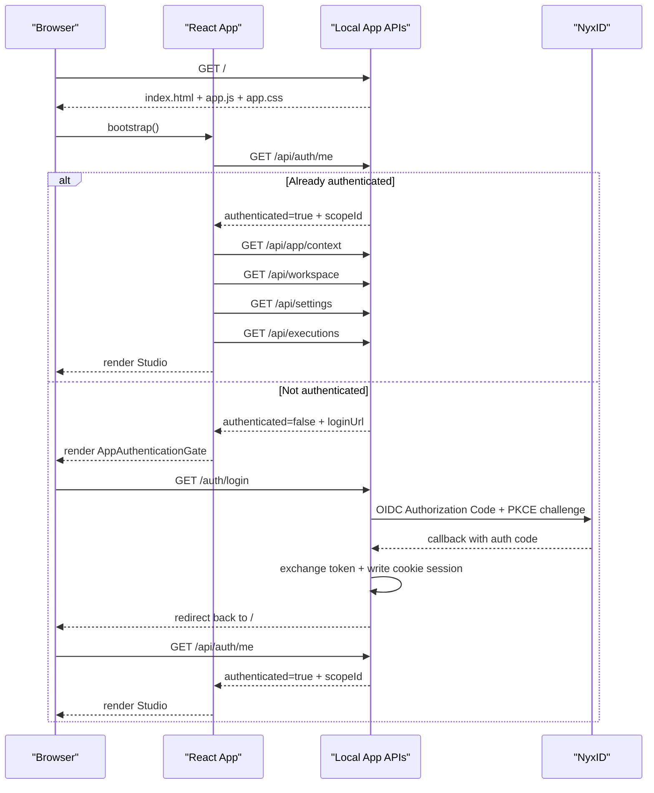
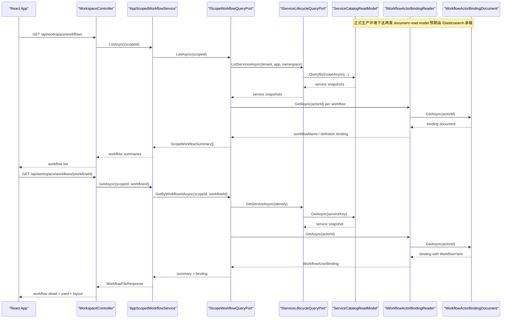
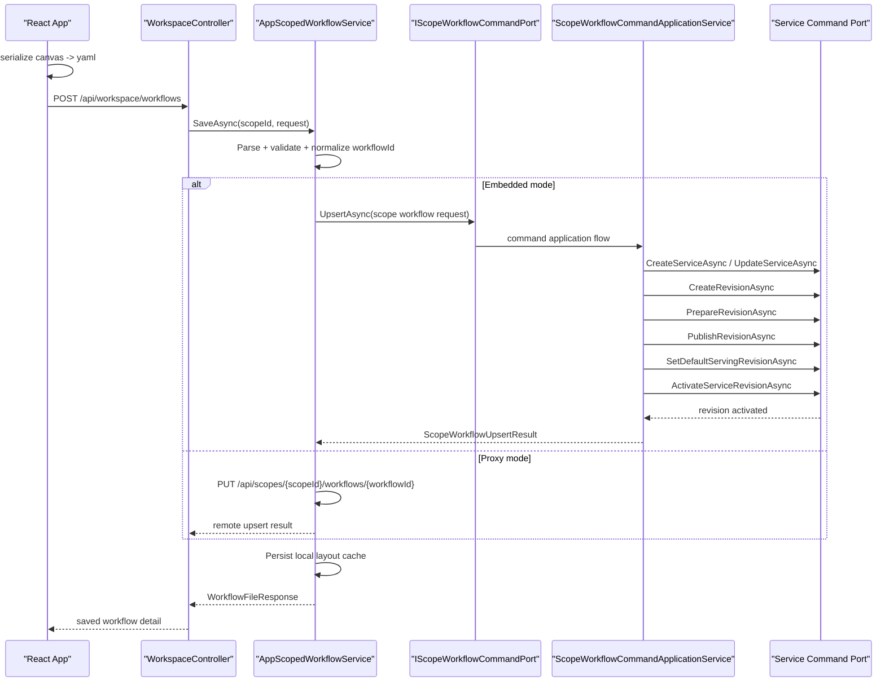
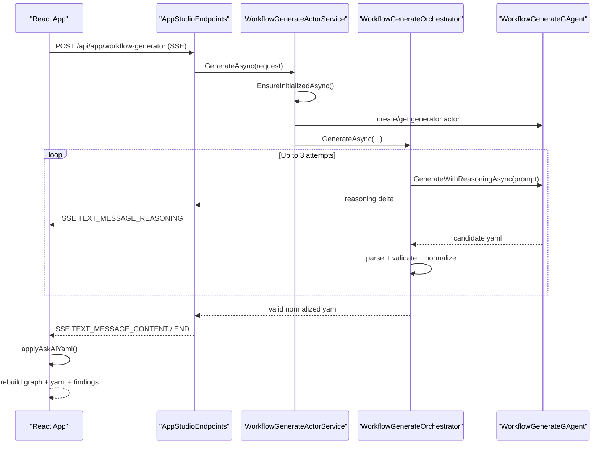
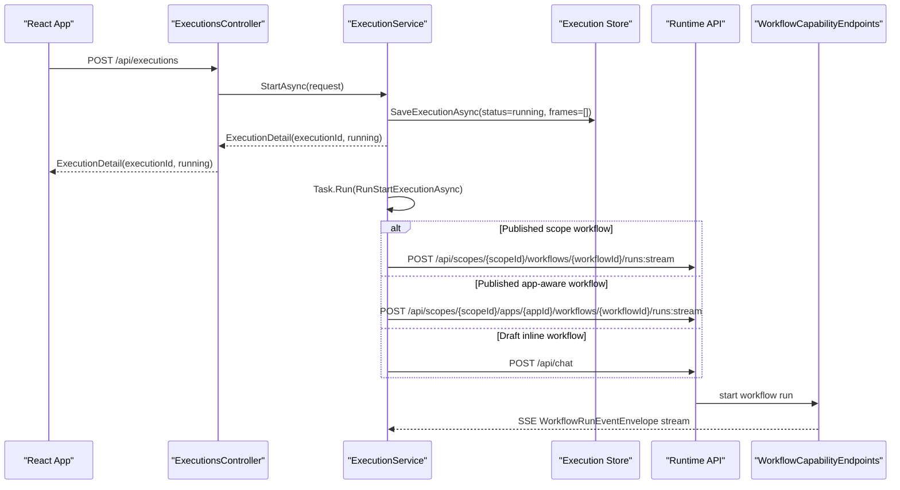
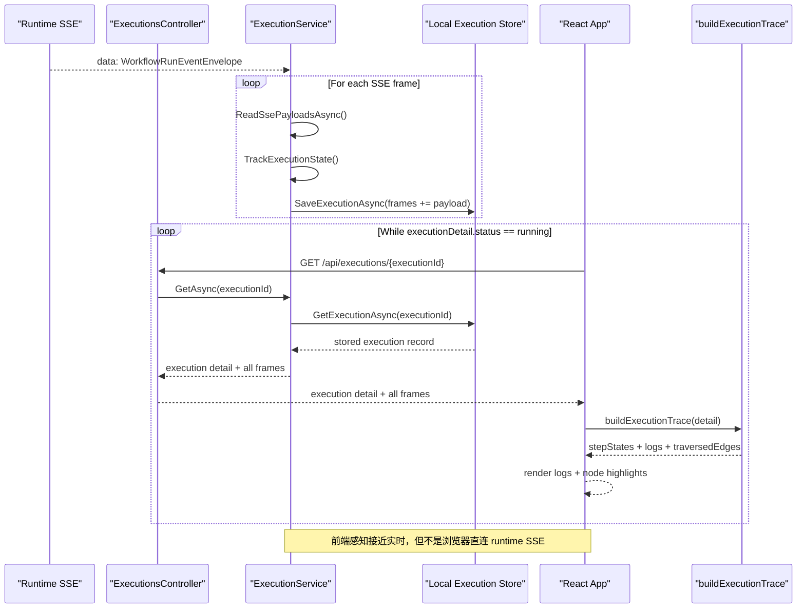
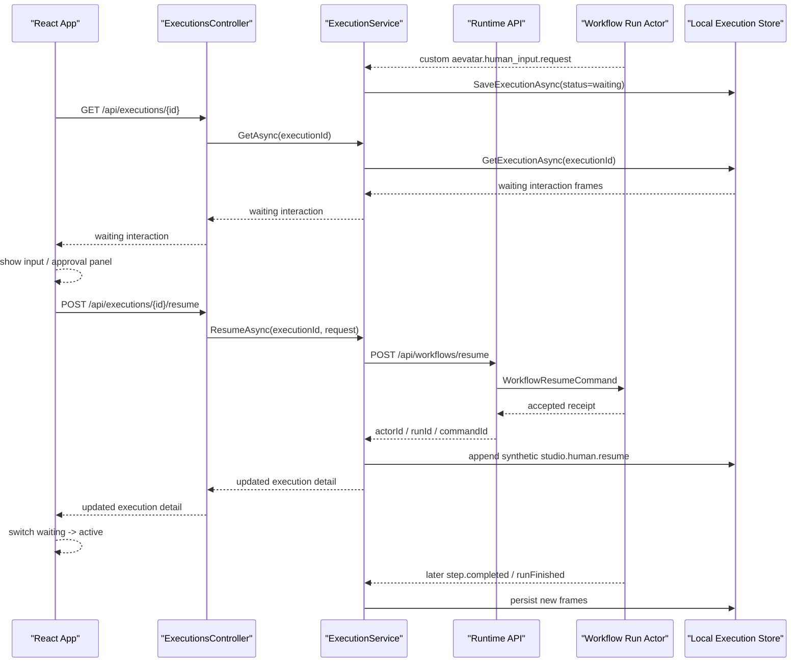

# AEVATAR App 实现说明（`tools/Aevatar.Tools.Cli`）

本文面向研发同学，说明 `tools/Aevatar.Tools.Cli` 里的 `aevatar app` 是如何落地的。重点覆盖：

- App 启动与模式判定
- NyxID 登录与本地会话
- Workflow 创建、编辑、保存
- Workflow 运行
- Execution Logs 如何到达前端
- 本地存储与关键扩展点

文中提到的 “Aevatar App” 指的是通过 `aevatar app` 启动的本地 Studio，而不是单独的 Web 部署项目。

## 1. 一句话架构

`aevatar app` 本质上是一个打包成 .NET Global Tool 的本地 ASP.NET Core Host：

- CLI 命令负责探活、端口管理和启动宿主
- 宿主负责提供静态前端、Studio 本地 API、NyxID 登录和 workflow runtime/bridge
- React 前端负责画布、YAML 编辑、执行面板和配置界面
- 真正的 workflow 运行要么在当前进程内嵌执行，要么通过 proxy 转发到远端 runtime

## 2. 模块分层

### 2.1 CLI / Host

- `Program.cs` / `RootCommandFactory.cs`
  - 统一注册 `config / app / chat`
- `Commands/App/AppCommand.cs`
  - 定义 `aevatar app` 与 `aevatar app restart`
- `Hosting/AppCommandHandler.cs`
  - 负责探活、避免端口冲突、重启旧进程、启动 Host
- `Hosting/AppToolHost.cs`
  - 真正创建并运行本地 ASP.NET Core 应用

### 2.2 Studio 本地后端

- `Studio/Host/Controllers/*`
  - 暴露 `/api/editor`、`/api/workspace`、`/api/executions`、`/api/settings` 等接口
- `Studio/Application/Services/*`
  - 负责编辑、执行、工作区、配置等应用服务
- `Studio/Infrastructure/*`
  - 文件存储、YAML 序列化、用户设置持久化

### 2.3 前端

- `Frontend/src/App.tsx`
  - Studio 主 UI，包含工作流编辑、运行、配置、认证门面
- `Frontend/src/api.ts`
  - 前端统一 API 客户端，处理 JSON 请求、SSE、401 登录跳转事件
- `Frontend/src/studio.ts`
  - 画布模型、YAML 与图的互转、执行日志重建

### 2.4 Runtime / Bridge

- 嵌入式运行时来自：
  - `builder.AddAevatarDefaultHost(...)`
  - `builder.AddAevatarPlatform(...)`
  - `builder.AddGAgentServiceCapabilityBundle()`
  - `builder.Services.AddWorkflowBridgeExtensions()`
- 代理模式桥接来自：
  - `Bridge/AppBridgeEndpoints.cs`

## 3. 两组核心模式

`aevatar app` 里有两组容易混淆、但实际上彼此独立的模式。

### 3.1 Host Mode：`embedded` / `proxy`

由 `AppToolHost.ShouldUseEmbeddedWorkflow()` 判定：

- 如果 `sdkBaseUrl` 和本地 `http://localhost:<port>` 指向同一个服务端点，则进入 `embedded`
- 如果 `sdkBaseUrl` 指向别的地址，则进入 `proxy`

| 维度 | embedded | proxy |
|---|---|---|
| workflow runtime | 在当前进程内启动 | 不在当前进程内启动 |
| `/api/chat` 等能力路由 | 由本地 runtime 直接提供 | 由 `AppBridgeEndpoints` 反向代理到远端 |
| 典型场景 | 本地一键体验 | 本地 UI + 远端 workflow service |

### 3.2 Workflow Storage Mode：`workspace` / `scope`

由 `/api/app/context` 返回，底层来自 `IAppScopeResolver`：

- 能解析出当前 `scopeId` 时，前端进入 `scope` 模式
- 否则进入 `workspace` 模式

这组模式决定的是 “workflow 存哪里”，不是 “workflow 跑在哪里”。

| 维度 | workspace | scope |
|---|---|---|
| workflow 列表来源 | 本地目录 | 当前登录 scope 下的已发布 workflow |
| 保存目标 | 本地 YAML 文件 | scope workflow service / revision |
| 典型用途 | 本地草稿、离线编辑 | 作用域内共享与发布 |

也就是说，完全可能出现：

- `embedded + workspace`
- `embedded + scope`
- `proxy + workspace`
- `proxy + scope`

## 4. 启动链路



### 4.1 命令入口

`Commands/App/AppCommand.cs` 定义了三个参数：

- `--port`，默认 `6688`
- `--no-browser`
- `--api-base`

`AppCommandHandler.RunAsync()` 会先请求：

- `GET /api/app/health`

根据返回值分三种处理：

1. 健康的 `aevatar.app`
   - 直接复用，打开浏览器
2. 端口可达但不是 `aevatar.app`
   - 直接报错，避免误占别的服务
3. 端口不可达
   - 继续启动新的宿主

`aevatar app restart` 则会：

1. 用 `lsof -tiTCP:<port> -sTCP:LISTEN` 找监听进程
2. `Kill(entireProcessTree: true)`
3. 等待端口释放
4. 再启动新宿主

### 4.2 API Base URL 解析

`CliAppConfigStore.ResolveApiBaseUrl()` 的优先级是：

1. `--api-base`
2. `~/.aevatar/config.json` 里的 `Cli:App:ApiBaseUrl`
3. 本地 `http://localhost:<port>`

这个 `sdkBaseUrl` 决定 App 是本地嵌入运行还是代理到远端。

### 4.3 静态前端如何被打进来

前端源码在：

- `tools/Aevatar.Tools.Cli/Frontend`

Vite 配置把构建产物输出到：

- `tools/Aevatar.Tools.Cli/wwwroot/playground`

输出文件固定为：

- `app.js`
- `app.css`
- `index.html`

`AppToolHost` 会把 `wwwroot/playground` 作为优先 WebRoot，通过：

- `UseDefaultFiles()`
- `UseStaticFiles()`
- `MapFallbackToFile("index.html")`

把 React App 当成一个标准 SPA 来服务。

## 5. 登录与本地会话

### 5.1 认证模型

App 的认证由 `NyxIdAppAuthentication` 提供，默认是：

- OIDC Authorization Code + PKCE
- Cookie 会话：`aevatar.cli.auth`
- 默认 Authority：`https://nyx-api.chrono-ai.fun`

关键点：

- `ResolveIsEnabled()` 当前实现是 “默认开启”，除非显式配置 `Cli:App:NyxId:Enabled=false`
- 认证保护的是 `/api/**`
- 匿名例外只有：
  - `/api/app/health`
  - `/api/auth/me`
- 静态页面本身不需要登录，因此未登录时浏览器仍能拿到前端壳，但前端会显示登录门面

### 5.2 登录请求与回调

关键端点：

- `GET /auth/login?returnUrl=/`
- `GET /auth/logout`
- `GET /auth/signed-out`
- `GET /auth/error`
- `GET /api/auth/me`

前端启动时先调用 `/api/auth/me`：

- 若未登录，后端返回 `authenticated=false` 与 `loginUrl`
- `App.tsx` 会渲染 `AppAuthenticationGate`
- 用户点击按钮后进入 OIDC challenge
- 登录成功后由 Cookie 保存本地 session，再回到 Studio

### 5.3 Token 刷新

`NyxIdAppTokenService` 会：

- 从 Cookie 里的 token 集合取 `access_token`
- 若临近过期，使用 `refresh_token` 调 `/oauth/token`
- 刷新成功后重新写回 Cookie
- 刷新失败且 token 已过期时，清理本地 Cookie 会话

这保证了本地 App 对远端 API 的代理调用不需要用户频繁重新登录。

### 5.4 前端如何感知 401

`Frontend/src/api.ts` 的请求封装在出现以下情况时会触发 `aevatar:auth-required`：

- HTTP 401
- JSON body 里包含 `loginUrl`
- API 意外返回 HTML（通常意味着被后端登录页拦截）

`App.tsx` 订阅这个事件后，会把 App 状态切回未登录，并重新展示登录门面。

### 5.5 Scope 是怎么来的

`DefaultAppScopeResolver` 的解析顺序是：

1. 已认证用户的 claim
   - `scope_id`
   - `uid`
   - `sub`
   - `ClaimTypes.NameIdentifier`
2. 请求头
   - `X-Aevatar-Scope-Id`
   - `X-Scope-Id`
3. 配置
   - `Cli:App:ScopeId`
4. 环境变量
   - `AEVATAR_SCOPE_ID`

一旦解析出 `scopeId`，前端就会切换到 `scope` 存储模式。

## 6. Workflow 创建与编辑

App 里创建 workflow 有三条路：

1. 手工在图编辑器里搭建
2. 直接导入 YAML
3. 通过 “Ask AI” 生成 YAML，再回填到画布

### 6.1 图和 YAML 的双向转换

Studio 编辑器的核心不是直接操作 YAML 字符串，而是维护一套前端文档模型：

- 角色：`RoleState`
- 节点：`StudioNodeData`
- 边：`StudioEdgeData`
- 元数据：`WorkflowMetaState`

转换路径：

- 图 -> YAML
  - `buildWorkflowDocument(...)`
  - `POST /api/editor/serialize-yaml`
  - `WorkflowEditorService.SerializeYaml()`
- YAML -> 图
  - `POST /api/editor/parse-yaml`
  - `WorkflowEditorService.ParseYaml()`
  - `buildGraphFromWorkflow(...)`

这意味着前端和后端之间有一个明确的 “文档模型 + 验证” 边界，而不是在浏览器里随手拼 YAML。

### 6.2 校验与规范化

`WorkflowEditorService` 组合了：

- `IWorkflowYamlDocumentService`
- `WorkflowDocumentNormalizer`
- `WorkflowValidator`
- `WorkflowGraphMapper`

对应接口：

- `/api/editor/parse-yaml`
- `/api/editor/serialize-yaml`
- `/api/editor/validate`
- `/api/editor/normalize`
- `/api/editor/diff`

前端会在以下时机频繁调用这些接口：

- 画布变化后同步 YAML
- 用户直接修改 YAML 后反向同步画布
- 显式点击 Validate
- 保存前
- Ask AI 返回 YAML 后

### 6.3 保存到本地 workspace

当 `workflowStorageMode=workspace` 时：

1. 前端调用 `POST /api/workspace/workflows`
2. `WorkspaceController.SaveWorkflow()`
3. `WorkspaceService.SaveWorkflowAsync()`
4. `FileStudioWorkspaceStore.SaveWorkflowFileAsync()`

落盘位置默认是：

- workflow YAML：`~/.aevatar/workflows/*.yaml`
- 画布局：`<workflow>.yaml.layout.json`

工作区目录是可配置的，但默认总会包含：

- `~/.aevatar/workflows`

### 6.4 保存到 scope

当 `workflowStorageMode=scope` 时，前端调用的仍然是：

- `POST /api/workspace/workflows`

但 `WorkspaceController` 会分流到：

- `AppScopedWorkflowService.SaveAsync(scopeId, request)`

这个服务会：

1. 解析并校验 YAML
2. 生成/规范化 `workflowId`
3. 通过两种方式之一写入 scope workflow：
   - embedded 模式下，直接调用本地 `IScopeWorkflowCommandPort`
   - proxy 模式下，调用远端 `PUT /api/scopes/{scopeId}/workflows/{workflowId}`

如果走本地 `IScopeWorkflowCommandPort`，真正执行的是 `ScopeWorkflowCommandApplicationService.UpsertAsync()`，它的流程非常完整：

1. `CreateServiceAsync`
2. `UpdateServiceAsync`（必要时）
3. `CreateRevisionAsync`
4. `PrepareRevisionAsync`
5. `PublishRevisionAsync`
6. `SetDefaultServingRevisionAsync`
7. `ActivateServiceRevisionAsync`

也就是说，scope 保存不是简单存一个 YAML 文件，而是把 workflow 作为一条正式的 service revision 生命周期来处理。

### 6.5 scope workflow 的 YAML 与布局分开存

scope 模式下，后端 service/revision 持有的是 workflow 源和 actor binding；画布布局没有写回 scope 服务。

布局会被本地缓存到：

- `~/.aevatar/app/scope-workflow-layouts/<scope>--<workflow>.json`

因此：

- 远端 scope 负责 authoritative workflow definition
- 本地 App 负责 Studio 画布布局缓存

### 6.6 Ask AI 是怎么生成 workflow 的

Ask AI 入口是：

- `POST /api/app/workflow-generator`

它只在 `embedded` 模式可用。

链路如下：

1. 前端 `api.assistant.authorWorkflow(...)` 用 `fetch + text/event-stream` 调本地接口
2. `AppStudioEndpoints.HandleGenerateWorkflowAsync()` 启动 SSE 响应
3. 调 `WorkflowGenerateActorService.GenerateAsync(...)`
4. 该服务确保本地 actor runtime 中存在 `WorkflowGenerateGAgent`
5. `WorkflowGenerateOrchestrator` 负责最多 3 轮 “生成 -> 解析/校验 -> 修复重试”
6. reasoning 增量通过 SSE 连续写回前端
7. 最终 YAML 通过 `TEXT_MESSAGE_END` 一次性收口
8. 前端再调用 `applyAskAiYaml()` 把 YAML 回填到画布

这个链路和 workflow 正式运行链路不同：

- Ask AI 是 “浏览器直连本地 SSE”
- 正式运行是 “runtime SSE -> App 后端 -> 前端轮询本地 execution record”

## 7. Workflow 运行链路

### 7.1 前端如何发起运行

点击 Run 以后，`App.tsx` 会调用：

- `POST /api/executions`

请求体里会带：

- `workflowName`
- `prompt`
- `workflowYamls`
- `runtimeBaseUrl`
- `scopeId`
- `workflowId`
- `eventFormat`

关键分支：

- 如果当前是 `scope` 模式，且 workflow 已保存且没有脏改动
  - 优先运行 “已发布 workflow”
  - 请求中会带 `scopeId + workflowId + eventFormat=workflow`
- 否则
  - 运行当前编辑器里的 inline YAML 草稿

### 7.2 ExecutionService 做了什么

`ExecutionService.StartAsync()` 不会同步阻塞到整个 workflow 结束，而是：

1. 先生成 `executionId`
2. 立刻写一个本地 `StoredExecutionRecord`
3. 状态先标成 `running`
4. 用 `Task.Run(...)` 在后台启动真正的运行请求
5. 立即把 execution detail 返回给前端

这样前端可以马上切到 execution 视图，而后端继续异步消费 runtime 事件流。

### 7.3 真正发到 runtime 的请求

后台任务 `RunStartExecutionAsync()` 会构造两种请求之一：

### A. 运行已发布 workflow

发到：

- 默认 app：
  - `POST /api/scopes/{scopeId}/workflows/{workflowId}/runs:stream`
- 显式 app-aware：
  - `POST /api/scopes/{scopeId}/apps/{appId}/workflows/{workflowId}/runs:stream`

请求体示意：

```json
{
  "prompt": "user input",
  "eventFormat": "workflow"
}
```

### B. 运行草稿 YAML

发到：

- `POST /api/chat`

请求体示意：

```json
{
  "prompt": "user input",
  "workflow": "workflow_name",
  "workflowYamls": ["...yaml..."]
}
```

### 7.4 认证如何透传到 runtime

如果 App 开启了 NyxID 登录，`ExecutionService` 会先通过 `IStudioBackendRequestAuthSnapshotProvider` 捕获当前认证快照，然后把认证信息附加到后台请求：

- `Authorization: Bearer <access_token>`
- 若目标仍是当前本地 loopback，还会补一个内部头：
  - `X-Aevatar-Internal-Auth`

内部头的作用是：

- 允许 “已认证用户触发的本地后台请求” 再次穿过本地 API 保护中间件
- 避免后端自己调自己时也被当成匿名请求拦住

## 8. Execution Logs 是怎么到前端的

这是整个 App 最值得单独说明的一段。

先说结论：

- runtime 到 App 后端：是实时 SSE 推送
- App 后端到前端：不是直接 SSE/WebSocket，而是 “本地持久化 + 前端轮询”

也就是说，前端看到的是一个被 App 后端“汇聚并缓存”后的执行视图。

虽然 workflow capability API 也提供了 `/api/ws/chat`，但当前 `aevatar app` 的 execution 视图并没有走 WebSocket 路径。

```mermaid
%%{init: {"maxTextSize": 100000, "flowchart": {"useMaxWidth": false, "nodeSpacing": 10, "rankSpacing": 50}, "themeVariables": {"fontSize": "10px"}}}%%
flowchart LR
  A["浏览器: POST /api/executions"] --> B["ExecutionService.StartAsync"]
  B --> C["写入 execution record"]
  B --> D["后台任务发起 runtime SSE"]
  D --> E["/api/chat 或 /runs:stream"]
  E --> F["WorkflowCapabilityEndpoints + ChatSseResponseWriter"]
  F --> G["WorkflowRunEventEnvelope SSE 帧"]
  G --> H["ExecutionService.ConsumeExecutionStreamAsync"]
  H --> I["~/.aevatar/studio/executions/<id>.json"]
  J["浏览器轮询 GET /api/executions/<id>"] --> I
  I --> K["buildExecutionTrace(...)"]
  K --> L["节点高亮 / 日志卡片 / 人工交互面板"]
```



### 8.1 runtime 先把事件流推给 App 后端

runtime 侧的 SSE 输出由：

- `WorkflowCapabilityEndpoints.HandleChat()`
- `ChatSseResponseWriter`

负责。

它输出的不是任意 JSON，而是强类型的：

- `WorkflowRunEventEnvelope`

经过 `ChatJsonPayloads.Format(...)` 序列化后的 JSON。

常见事件包括：

- `runStarted`
- `runFinished`
- `runError`
- `stepStarted`
- `stepFinished`
- `textMessageStart`
- `textMessageContent`
- `textMessageEnd`
- `custom`

### 8.2 Step / Human Input 等 custom event 从哪里来

workflow 领域事件并不会直接原样暴露给前端，而是先经过 AGUI/workflow 事件映射器：

- `StepRequestEvent` -> `aevatar.step.request`
- `StepCompletedEvent` -> `aevatar.step.completed`
- `WorkflowSuspendedEvent` -> `aevatar.human_input.request`
- 接收 accepted receipt 时再人工补一个 `aevatar.run.context`

相关映射实现：

- `EventEnvelopeToWorkflowRunEventMapper`
- `ScopeWorkflowAguiEventMapper`

这一步的价值是把前端真正关心的 UI 事件语义固定下来，而不是把内部 event store 细节直接暴露给浏览器。

### 8.3 App 后端如何消费 SSE

`ExecutionService.ConsumeExecutionStreamAsync()` 会：

1. 逐行读取 SSE
2. 提取每个 `data:` block
3. 丢弃 `[DONE]`
4. 把每个 payload 连同接收时间追加到 `StoredExecutionFrame`
5. 根据收到的帧实时更新 execution 状态

后端维护的只是：

- `Frames`
- `Status`
- `ActorId`
- `Error`

它不会在中间层维护内存态字典来当事实源，而是每次把执行记录写回文件存储。

### 8.4 Execution 记录落在哪里

默认落盘位置：

- `~/.aevatar/studio/executions/<executionId>.json`

其中保存的是：

- execution 基本信息
- 所有原始 `frame.payload`
- 每帧的 `receivedAtUtc`

这使得：

- 页面刷新后还能重新打开历史 execution
- App 不需要和前端保持长连接会话才能显示历史日志

### 8.5 前端为什么看起来像“实时推送”

因为 `App.tsx` 在 execution 处于 `running` 时，会定时轮询：

- `GET /api/executions/{executionId}`

轮询节奏大致是：

- 首次 350ms 后拉取
- 若仍在运行，大约每 700ms 再拉一次
- 请求失败时退化到约 1200ms 重试

所以用户感知上接近实时，但严格讲并不是 runtime 直接把日志推到浏览器。

### 8.6 前端如何把 frame 变成日志面板

`buildExecutionTrace(detail)` 会遍历所有 `frames`，重建：

- `stepStates`
- `traversedEdges`
- `logs`
- `latestStepId`
- `defaultLogIndex`

当前前端重点消费的是这些 custom event：

- `aevatar.step.request`
- `aevatar.human_input.request`
- `aevatar.step.completed`
- `studio.human.resume`
- `aevatar.run.context`
- `runError`
- `runFinished`

然后再用：

- `decorateNodesForExecution(...)`
- `decorateEdgesForExecution(...)`

把执行态投影到 React Flow 画布上。

### 8.7 一个重要事实：当前 execution logs 不是“全量原始流”

虽然 runtime SSE 里可以有：

- `textMessageContent`
- `toolCallStart`
- `toolCallEnd`
- `stateSnapshot`
- `aevatar.workflow.waiting_signal`
- 其他 custom event

但当前 `buildExecutionTrace()` 只挑了一部分事件来构建 UI。

所以当前 Execution 面板更准确地说是：

- “面向 step/human interaction 的执行视图”

而不是：

- “runtime 所有事件的逐条原样控制台”

其中 `waiting_signal` 这类事件已经进入 runtime 事件体系，但当前 Studio 前端还没有把它做成完整的恢复交互入口。

## 9. 人工输入 / 审批是怎么恢复执行的

当 execution trace 里出现 `aevatar.human_input.request`，前端会把该 step 标成 `waiting`，并显示交互面板。

用户提交后会调用：

- `POST /api/executions/{executionId}/resume`

`ExecutionService.ResumeAsync()` 再去请求真正的 runtime：

- `POST /api/workflows/resume`

请求体里带：

- `actorId`
- `runId`
- `stepId`
- `approved`
- `userInput`
- `metadata`

runtime 接收成功后，App 本地还会额外追加一条 synthetic frame：

- `studio.human.resume`

这样前端无需等待远端新的 step event，也能立刻把 UI 从 waiting 切回 active。

## 10. scope workflow 的读取链路

在 `scope` 模式下，workflow 列表和详情来自 `AppScopedWorkflowService`。

读取流程：

1. 前端调 `GET /api/workspace/workflows`
2. `WorkspaceController` 发现当前存在 `scopeId`
3. 分流到 `AppScopedWorkflowService.ListAsync/GetAsync`
4. 再分两种实现：
   - embedded：直接调用 `IScopeWorkflowQueryPort`
   - proxy：调用远端 `/api/scopes/{scopeId}/workflows...`

其中详情读取时，如果能拿到 `IWorkflowActorBindingReader`，还会读取 binding 来补全 `WorkflowYaml` 和 actor 绑定信息。

## 11. 本地存储说明

默认根目录是：

- `AEVATAR_HOME`
- 未设置时为 `~/.aevatar`

与 App 最相关的文件有：

| 路径 | 用途 |
|---|---|
| `~/.aevatar/config.json` | App 运行配置，如 `Cli:App:ApiBaseUrl`、NyxID 相关配置 |
| `~/.aevatar/secrets.json` | LLM provider 的敏感信息；支持加密存储 |
| `~/.aevatar/studio/workspace-settings.json` | Studio 工作区设置、运行时 URL、外观设置 |
| `~/.aevatar/studio/executions/*.json` | Execution 记录与 frame 缓存 |
| `~/.aevatar/workflows/*.yaml` | 本地 workflow 文件 |
| `~/.aevatar/connectors.json` | Connector catalog |
| `~/.aevatar/roles.json` | Role catalog |
| `~/.aevatar/connectors_draft.json` | Connector 草稿 |
| `~/.aevatar/roles_draft.json` | Role 草稿 |
| `~/.aevatar/app/scope-workflow-layouts/*.json` | scope workflow 的本地布局缓存 |

## 12. 一些实现上的取舍

### 12.1 为什么执行日志不是浏览器直连 runtime SSE

这样做有几个实际收益：

- 前端无需自己管理复杂的长连接状态
- 可以保留 execution 历史
- 可以在 App 层统一附加认证、代理、scope 上下文
- 可以把多种 runtime 来源统一收敛成一个本地 execution 视图

代价是：

- 前端看到的是近实时轮询，而不是严格的 server push
- Execution 面板展示的是 App 重建后的视图，而不是 runtime 全量事件原文

### 12.2 为什么 scope workflow 的布局仍然放本地

scope 服务当前的职责是：

- authoritative workflow definition
- revision / deployment / actor binding

Studio 画布布局属于编辑器体验数据，不属于 workflow runtime 语义，因此被留在本地缓存中。

### 12.3 为什么 Ask AI 和正式 execution 用了两种不同的流

因为两者诉求不同：

- Ask AI
  - 目标是把 reasoning 和 YAML 直接流到浏览器
  - 不需要 execution record
- 正式 execution
  - 目标是保留运行历史、恢复 execution panel、支持 resume
  - 需要先落 execution record

## 13. 关键源码导航

如果要继续读实现，推荐按下面顺序：

1. `tools/Aevatar.Tools.Cli/Hosting/AppToolHost.cs`
2. `tools/Aevatar.Tools.Cli/Hosting/NyxIdAppAuthentication.cs`
3. `tools/Aevatar.Tools.Cli/Studio/Host/Controllers/WorkspaceController.cs`
4. `tools/Aevatar.Tools.Cli/Hosting/AppScopedWorkflowService.cs`
5. `tools/Aevatar.Tools.Cli/Studio/Application/Services/ExecutionService.cs`
6. `tools/Aevatar.Tools.Cli/Frontend/src/App.tsx`
7. `tools/Aevatar.Tools.Cli/Frontend/src/studio.ts`
8. `src/workflow/Aevatar.Workflow.Infrastructure/CapabilityApi/ChatEndpoints.cs`
9. `src/workflow/Aevatar.Workflow.Presentation.AGUIAdapter/EventEnvelopeToWorkflowRunEventMapper.cs`
10. `src/platform/Aevatar.GAgentService.Application/Workflows/ScopeWorkflowCommandApplicationService.cs`

## 14. 核心时序图

下面把 App 最核心的几条链路集中画成时序图，便于从入口一路看到读写边界、认证边界和事件回流边界。

### 14.1 `aevatar app` 启动与模式判定



### 14.2 Studio 启动与 NyxID 登录



### 14.3 Scope workflow 读取链路

这个链路对应前面提到的 “正式查询走 read model，而不是直读 actor state”。



### 14.4 Workflow 保存到 scope



### 14.5 Ask AI 生成 workflow



### 14.6 Workflow 运行



### 14.7 Execution logs 回流到前端



### 14.8 人工输入 / 审批恢复执行



## 15. 总结

当前 `aevatar app` 的实现可以概括成一句话：

> 一个本地 CLI 启动的 ASP.NET Core Studio，把前端编辑器、本地会话、scope workflow 管理和 workflow runtime/bridge 收敛到一个入口里；运行时事件先通过 SSE 推到 App 后端，再由 App 持久化 execution frame，最后由前端轮询重建执行视图。

如果后续要继续演进，这份实现里最值得单独拆分和强化的部分通常是三块：

1. execution 视图是否要从轮询升级为浏览器直连流
2. execution panel 是否要展示更多原始 runtime event
3. scope workflow 的 Studio 布局是否也要进入正式的 actor/projection 主链
