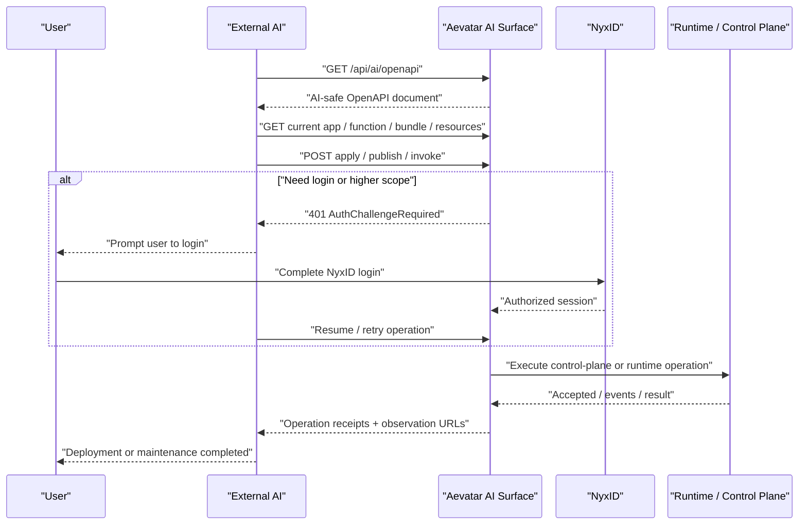
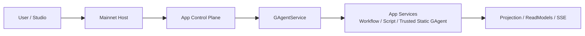
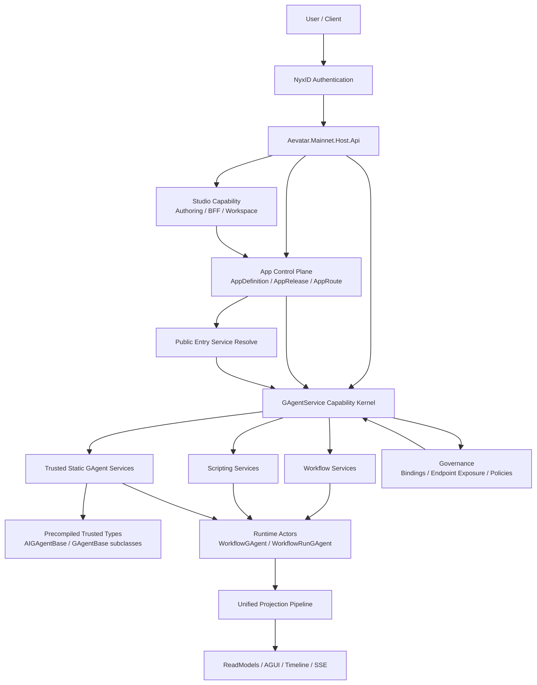
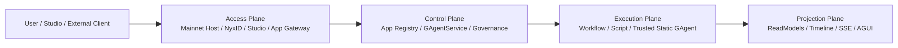
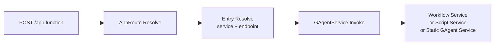
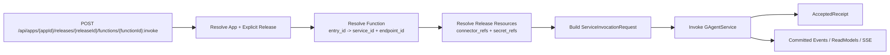
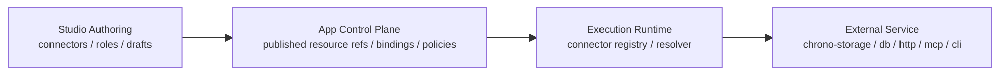

# AEVATAR Framework Architecture

本文是 Aevatar AI app framework 的权威架构文档。

本文合并并取代以下三份原始文档中的架构结论、现状描述、接入流程和演进计划：

- `2026-03-25-aevatar-ai-app-trusted-type-architecture.md`
- `2026-03-25-external-ai-app-onboarding-sop.md`
- `2026-03-26-aevatar-ai-first-app-automation-plan.md`

本文统一采用 2026-03-26 的代码现状作为“当前已实现”基线，并把后续目标态、阶段规划和外部接入 SOP 收敛为一套一致口径。

## 1. 文档范围与基本前提

本文只讨论一种受控部署模式：

- 自定义 GAgent 只支持 **预编进 mainnet 宿主** 的 trusted type
- 不支持第三方上传源码/二进制后由平台在线编译或装载
- `Aevatar` 已经作为长期运行的 `mainnet host`
- 认证接入走 `NyxID`
- `GAgentService` 是统一 capability kernel
- CQRS 与 AGUI 统一走同一套 Projection Pipeline
- `AppPlatform` 当前已经进入 Phase 1 bootstrap control plane，但权威实现仍是开发期 `InMemory` adapter

因此，我们的正式实现口径是：

- `AI App = App Control Plane + GAgentService service composition`
- 自定义 GAgent = `Trusted Static GAgent Service`
- 不引入 source upload / build / sandbox packaging 子系统
- AI 的正式控制面收敛为 `OpenAPI + app + release + function + operation + auth challenge + bundle`

## 2. 北极星体验

我们的北极星体验收敛为：

1. 用户填写提示词模板，描述要做什么 app、要改什么功能。
2. 外部 AI 只需要知道一个 Aevatar 根地址。
3. AI 先 `GET /api/ai/openapi` 获取机器可读控制面。
4. AI 读取当前 app/function/release/resources/operation 状态。
5. AI 生成 desired state，提交 apply/deploy/invoke。
6. 如果缺少登录或更高权限，系统返回标准化 `auth challenge`。
7. 用户只在 `NyxID login` 或显式人工审批节点参与。
8. AI 恢复流程，继续完成创建、发布、部署、验证、维护。



## 3. 极简架构主线

如果只记一条主线，可以记成：

- `Aevatar Mainnet` 负责长期运行
- `App Control Plane` 负责“这个 AI app 是什么、默认暴露什么”
- `GAgentService` 负责“把能力发布、激活、调用起来”
- `App Services` 只分三类：workflow、script、trusted static gagent
- `Projection` 负责对外查询、事件流和恢复



## 4. 高层正式架构



## 5. 四层正式分层

我们把正式架构收敛为四层：



这四层的职责是：

- `Access Plane` 负责接入，不负责业务事实
- `Control Plane` 负责“发布什么、激活什么、入口打到哪里”
- `Execution Plane` 负责真正执行
- `Projection Plane` 负责观察与查询

我们同时保留以下强约束：

1. `Studio` 只能留在 `Access Plane`
   `Studio` 不并入 `Control Plane`，否则 authoring 和 capability kernel 会重新混层。
2. `AppPlatform` 与 `GAgentService` 只在概念上同属 `Control Plane`
   代码上继续保持独立模块，`AppPlatform` 依赖 `GAgentService` 抽象，而不是反过来。
3. `Projection Plane` 必须单独存在
   这一层不能和 `Execution Plane` 合并，否则会破坏仓库的读写分离与统一投影主链。
4. trusted static gagent 只是 execution implementation
   它不是新的平台层、不是新的宿主层、也不是新的 app control plane。

## 6. 对外一句话口径

对外统一口径如下：

> Aevatar mainnet 分成接入层、控制层、执行层、投影层；AI app 不是独立 runtime，而是在控制层注册、在执行层运行、在投影层被观察的一组 service composition。

## 7. 当前仓库分层映射

### 7.1 Access Plane

归入这一层的当前代码：

- `src/Aevatar.Mainnet.Host.Api`
- `src/Aevatar.Authentication.*`
- `src/Aevatar.Studio.*`

其中：

- `Aevatar.Mainnet.Host.Api` 是组合根
- `Aevatar.Authentication.*` 负责 NyxID claims 映射与认证接入
- `Aevatar.Studio.*` 负责 authoring / BFF / workspace

### 7.2 Control Plane

当前已经存在的控制面项目：

- `src/platform/Aevatar.GAgentService.Abstractions`
- `src/platform/Aevatar.GAgentService.Core`
- `src/platform/Aevatar.GAgentService.Application`
- `src/platform/Aevatar.GAgentService.Infrastructure`
- `src/platform/Aevatar.GAgentService.Hosting`
- `src/platform/Aevatar.GAgentService.Governance.Abstractions`
- `src/platform/Aevatar.GAgentService.Governance.Core`
- `src/platform/Aevatar.GAgentService.Governance.Application`
- `src/platform/Aevatar.GAgentService.Governance.Infrastructure`
- `src/platform/Aevatar.GAgentService.Governance.Hosting`
- `src/platform/Aevatar.AppPlatform.Abstractions`
- `src/platform/Aevatar.AppPlatform.Core`
- `src/platform/Aevatar.AppPlatform.Application`
- `src/platform/Aevatar.AppPlatform.Infrastructure`
- `src/platform/Aevatar.AppPlatform.Hosting`

当前控制面的关键事实：

- `GAgentService` 继续是 capability kernel
- `AppPlatform` 是压在其上的 app 注册、release、route、function、resource 编排层
- 当前权威实现是 `InMemoryAppRegistryStore`
- 启动时从 `appsettings.json` 的 `AppPlatform` 节读取 `AppPlatformOptions` 作为 bootstrap seed
- 运行期通过 `IAppControlCommandPort` 接受 app/release/function/resource/route mutation
- 当前仍属于开发期 `InMemory` control plane adapter
- 后续会替换为 actor/projection 化实现，但上层端口与 HTTP 签名保持稳定

operation 当前也已经进入独立控制面：

- 当前权威实现是 `InMemoryOperationStore`
- `POST function invoke` 会创建真正的 operation snapshot
- `GET /api/operations/{operationId}` 读取 store 中的当前快照
- `GET /api/operations/{operationId}/result` 读取 terminal result
- `GET /api/operations/{operationId}/events` 读取 store 中的事件列表
- `GET /api/operations/{operationId}:stream` 已经提供 SSE 观察面
- `workflow-backed function invoke` 已经通过 runtime bridge 把真实 `run_started / run_finished / run_error / run_stopped` 与 durable completion 写回 operation
- `static / scripting` function invoke 当前仍然默认只自动写入 `accepted`

### 7.3 Execution Plane

归入这一层的当前代码：

- `src/workflow/Aevatar.Workflow.*`
- `src/Aevatar.Scripting.*`
- trusted static gagent 所在业务项目

这里第三项不是单独的平台项目，而是：

- 任意宿主内预编译的 trusted GAgent 类型实现
- 它们通过 `StaticServiceRevisionSpec.ActorTypeName` 被引用和激活

### 7.4 Projection Plane

归入这一层的当前代码：

- `src/Aevatar.CQRS.Projection.*`
- `src/platform/Aevatar.GAgentService.Projection`
- `src/platform/Aevatar.GAgentService.Governance.Projection`
- workflow / scripting 自己的 projection 组件

这一层必须单独保留，不能为了压层再并回执行面。

## 8. 具体项目组合图

下面这张图按“具体项目”展开，但它表达的是 **逻辑组合 / 工程归属 / 部署收敛关系**，不是严格的 direct project reference 图。

说明：

- 没有标 `(planned)` 的都是仓库当前已有项目
- 标了 `(planned)` 的是后续要补齐的项目
- `trusted agents` 项目是业务方自定义工程，不做进平台内核
- `trusted agents` 在 trusted type 模式下需要 **编进主网宿主部署物**
- 箭头统一表达逻辑组合 / 工程归属 / 部署收敛关系
- 即便 `trusted agents` 最终编进主网宿主，也不表现为 `GAgentService.Core -> business project` 的反向平台依赖

```mermaid
%%{init: {"maxTextSize": 100000, "flowchart": {"useMaxWidth": false, "nodeSpacing": 10, "rankSpacing": 50}, "themeVariables": {"fontSize": "10px"}}}%%
flowchart TB
  subgraph A["Access Plane"]
    Mainnet["src/Aevatar.Mainnet.Host.Api"]
    WfHost["src/workflow/Aevatar.Workflow.Host.Api\n(standalone host)"]
    AuthAbs["src/Aevatar.Authentication.Abstractions"]
    AuthHost["src/Aevatar.Authentication.Hosting"]
    AuthNyx["src/Aevatar.Authentication.Providers.NyxId"]
    StudioHost["src/Aevatar.Studio.Hosting"]
    StudioApp["src/Aevatar.Studio.Application"]
    StudioDomain["src/Aevatar.Studio.Domain"]
    StudioInfra["src/Aevatar.Studio.Infrastructure"]
  end

  subgraph B["Control Plane"]
    AppHost["src/platform/Aevatar.AppPlatform.Hosting\n(phase 1 implemented)"]
    AppInfra["src/platform/Aevatar.AppPlatform.Infrastructure\n(phase 1 implemented)"]
    AppApp["src/platform/Aevatar.AppPlatform.Application\n(phase 1 implemented)"]
    AppCore["src/platform/Aevatar.AppPlatform.Core\n(phase 1 implemented)"]
    AppAbs["src/platform/Aevatar.AppPlatform.Abstractions\n(phase 1 implemented)"]

    GSHost["src/platform/Aevatar.GAgentService.Hosting"]
    GSApp["src/platform/Aevatar.GAgentService.Application"]
    GSCore["src/platform/Aevatar.GAgentService.Core"]
    GSInfra["src/platform/Aevatar.GAgentService.Infrastructure"]
    GSAbs["src/platform/Aevatar.GAgentService.Abstractions"]

    GovHost["src/platform/Aevatar.GAgentService.Governance.Hosting"]
    GovApp["src/platform/Aevatar.GAgentService.Governance.Application"]
    GovCore["src/platform/Aevatar.GAgentService.Governance.Core"]
    GovInfra["src/platform/Aevatar.GAgentService.Governance.Infrastructure"]
    GovAbs["src/platform/Aevatar.GAgentService.Governance.Abstractions"]

    ScriptHost["src/Aevatar.Scripting.Hosting"]
  end

  subgraph C["Execution Plane"]
    WfSdk["src/workflow/Aevatar.Workflow.Sdk"]
    WfApp["src/workflow/Aevatar.Workflow.Application"]
    WfAppAbs["src/workflow/Aevatar.Workflow.Application.Abstractions"]
    WfCore["src/workflow/Aevatar.Workflow.Core"]
    WfInfra["src/workflow/Aevatar.Workflow.Infrastructure"]
    WfAbs["src/workflow/Aevatar.Workflow.Abstractions"]

    ScriptApp["src/Aevatar.Scripting.Application"]
    ScriptCore["src/Aevatar.Scripting.Core"]
    ScriptInfra["src/Aevatar.Scripting.Infrastructure"]
    ScriptAbs["src/Aevatar.Scripting.Abstractions"]

    AICore["src/Aevatar.AI.Core"]
    AIAbs["src/Aevatar.AI.Abstractions"]
    AITools["src/Aevatar.AI.ToolProviders.MCP\nsrc/Aevatar.AI.ToolProviders.Skills"]
    AIProviders["src/Aevatar.AI.LLMProviders.MEAI\nsrc/Aevatar.AI.LLMProviders.Tornado"]

    TrustedAgents["src/apps/<app>.TrustedAgents\n(planned business project)"]
  end

  subgraph D["Projection Plane"]
    CQRSAbs["src/Aevatar.CQRS.Projection.Core.Abstractions"]
    CQRSCore["src/Aevatar.CQRS.Projection.Core"]
    CQRSRuntimeAbs["src/Aevatar.CQRS.Projection.Runtime.Abstractions"]
    CQRSRuntime["src/Aevatar.CQRS.Projection.Runtime"]
    CQRSStores["src/Aevatar.CQRS.Projection.Stores.Abstractions"]
    CQRSProviders["src/Aevatar.CQRS.Projection.Providers.InMemory\nsrc/Aevatar.CQRS.Projection.Providers.Elasticsearch\nsrc/Aevatar.CQRS.Projection.Providers.Neo4j"]

    GSProj["src/platform/Aevatar.GAgentService.Projection"]
    GovProj["src/platform/Aevatar.GAgentService.Governance.Projection"]
    AppProj["src/platform/Aevatar.AppPlatform.Projection\n(planned)"]
    WfProj["src/workflow/Aevatar.Workflow.Projection"]
    WfAgui["src/workflow/Aevatar.Workflow.Presentation.AGUIAdapter"]
    ScriptProj["src/Aevatar.Scripting.Projection"]
    AIProj["src/Aevatar.AI.Projection"]
  end

  subgraph E["Shared Platform Substrate"]
    Foundation["src/Aevatar.Foundation.Abstractions\nsrc/Aevatar.Foundation.Core\nsrc/Aevatar.Foundation.Runtime*"]
    Hosting["src/Aevatar.Hosting\nsrc/Aevatar.Bootstrap\nsrc/Aevatar.Bootstrap.Extensions.AI"]
    Config["src/Aevatar.Configuration"]
    Agui["src/Aevatar.Presentation.AGUI"]
  end

  Mainnet --> StudioHost
  Mainnet --> AuthHost
  Mainnet --> AuthNyx
  Mainnet --> GSHost
  Mainnet --> AppHost
  StudioHost --> StudioApp
  StudioHost --> StudioInfra
  StudioApp --> StudioDomain
  StudioApp --> AppAbs
  StudioApp --> GSAbs

  AppHost --> AppApp
  AppHost --> AppInfra
  AppApp --> AppCore
  AppApp --> AppAbs
  AppInfra --> AppAbs
  AppApp --> GSAbs
  AppApp --> GovAbs

  GSHost --> GSApp
  GSApp --> GSCore
  GSApp --> GSAbs
  GSApp --> WfAppAbs
  GSApp --> ScriptAbs
  GSInfra --> GSCore
  GSHost --> GovHost

  GovHost --> GovApp
  GovApp --> GovCore
  GovApp --> GovAbs
  GovApp --> GSAbs
  GovInfra --> GovCore

  GSHost --> WfInfra
  GSHost --> ScriptHost

  WfApp --> WfAppAbs
  WfApp --> WfCore
  WfInfra --> WfCore
  WfInfra --> WfAbs
  WfAgui --> WfAppAbs

  ScriptHost --> ScriptApp
  ScriptApp --> ScriptCore
  ScriptInfra --> ScriptCore
  ScriptCore --> ScriptAbs

  TrustedAgents --> AICore
  TrustedAgents --> Foundation

  GSProj --> CQRSCore
  GovProj --> CQRSCore
  WfProj --> CQRSCore
  ScriptProj --> CQRSCore
  AIProj --> CQRSCore
  CQRSCore --> CQRSAbs
  CQRSRuntime --> CQRSRuntimeAbs
  CQRSRuntime --> CQRSStores
  CQRSProviders --> CQRSStores

  Mainnet --> Hosting
  GSHost --> Hosting
  WfHost --> Hosting
  ScriptHost --> Hosting
  StudioHost --> Hosting

  Mainnet --> Foundation
  GSCore --> Foundation
  WfCore --> Foundation
  ScriptCore --> Foundation
  AICore --> Foundation

  StudioHost --> Config
  GSHost --> Config
  WfHost --> Config

  StudioHost --> Agui
  WfAgui --> Agui
```



这张图的读法可以压缩成下面几句：

- `Aevatar.Mainnet.Host.Api` 是最终组合根
- `Aevatar.Studio.*` 只负责接入与 authoring
- `Aevatar.GAgentService.* + Governance.*` 是统一控制面能力内核
- `Aevatar.Workflow.* / Aevatar.Scripting.* / trusted agents project` 是执行面
- `Aevatar.CQRS.Projection.* + 各能力 projection` 是统一读侧
- `Aevatar.Foundation.*` 是整个系统共同依赖的底座
- `trusted agents` 必须编进宿主部署物，但不倒灌为平台 core 对业务工程的依赖

## 9. 核心业务对象与单一语义

### 9.1 App Control Plane 的正式对象

`AppPlatform` 负责 AI app 这一层的正式业务模型：

- `AppDefinition`
- `AppRelease`
- `AppRoute`
- `Function`
- `Release Resources`
- `Operation`

它决定：

- 一个 app 有哪些能力资产
- 当前默认 release 是哪个
- 对外入口应该打到哪个 service
- 哪些 connector / secret 在发布后对哪些 function 生效

### 9.2 `functionId` 与 `entry_id` 的单一语义

我们不再发明一套平行 `FunctionDefinition` 主模型。

当前和目标态统一收敛为：

- 对外 `functionId`
- 内部控制面 `entry_id`
- 二者使用同一个稳定标识

也就是说：

- `AppRelease.entry_refs[].entry_id`
- 就是外部 `POST` 时看到的 `functionId`

这样可以避免：

- app 对外一套 `function`
- app release 内部再维护一套 `entry`

两套平行命名和双重绑定。

统一约定如下：

- `entry_id` 负责“这个 app 对外暴露什么功能名”
- `service_id + endpoint_id` 负责“这个功能当前绑定到哪个实现入口”

### 9.3 对外 function 只表达入口，不暴露实现类型

当外部系统通过一个 `POST` 去执行 app 的某个功能时，对外不暴露：

- “这是 workflow”
- “这是 script”
- “这是 custom gagent”

对外正式语义只有：

- `app public entry`
- 或 `app function`

主链如下：



调用方只知道：

- 我要调用 app 的哪个功能入口

调用方不需要知道：

- 背后是 workflow、script 还是 trusted static gagent

## 10. 三类 service implementation 的正式执行语义

在 trusted type 模式下，AI app 的能力正式收敛为三类 service：

- `Workflow Services`
- `Scripting Services`
- `Trusted Static GAgent Services`

第三类的关键约束是：

- 只能引用宿主进程内已存在的 .NET 类型
- 通过 `ActorTypeName` 激活
- 不存在运行时上传、动态编译、动态装载

当前代码下三种 implementation 的执行语义如下：

| 实现类型 | 当前 endpoint 形态 | 执行语义 | 更适合什么 |
|---------|-------------------|----------|-----------|
| `Workflow Service` | 当前固定 `chat` endpoint | 每次 invoke 创建新的 `WorkflowRunGAgent` 再执行 | chat/task 型入口、多步编排、调用 connectors、human-in-the-loop |
| `Scripting Service` | 从 runtime semantics 导出一个或多个 `command` endpoint | 向 script runtime 投递一次命令执行 | 结构化 `POST`、明确输入输出、函数型业务能力 |
| `Trusted Static GAgent Service` | 由 static spec 显式声明 endpoints | 直接把 payload 投递给 serving 的长期 actor | 长会话、长期状态、持续交互、agent 本体 |

因此我们统一采用以下规则：

1. 对外 API 统一建模为 `entry/function`，不把 `workflow/script/gagent` 暴露给调用方。
2. `workflow` 默认承担“编排型能力”或“chat/task 型入口”。
3. `script` 默认承担“函数型 command endpoint”。
4. `trusted static gagent` 默认承担“长期存在的交互主体”。

成熟 app 的典型组合方式不是三选一，而是：

- `public entry = static gagent` 或 `script`
- `internal companion = workflow`
- `workflow` 再调用内部 `script`、其他 service、connector、secret

## 11. 当前请求主链

```mermaid
%%{init: {"maxTextSize": 100000, "flowchart": {"useMaxWidth": false, "nodeSpacing": 10, "rankSpacing": 50}, "themeVariables": {"fontSize": "10px"}}}%%
flowchart LR
  A["Client Request"] --> B["NyxID Login / Claims"]
  B --> C["AppRoute Resolve"]
  C --> D["Entry Service Resolve"]
  D --> E["GAgentService Invoke"]
  E --> F["Workflow / Script / Trusted Static GAgent"]
  F --> G["Committed Events"]
  G --> H["Unified Projection Pipeline"]
  H --> I["SSE / AGUI / ReadModels"]
```



## 12. 当前已实现的 app-level HTTP Surface

下面列的是 **截至 2026-03-26 已在代码中存在** 的 app-level surface。

### 12.1 AI bootstrap 与 operation

| Method | Path | 说明 |
|--------|------|------|
| `GET` | `/api/ai/openapi` | 返回 AI-safe OpenAPI 文档 |
| `GET` | `/api/operations/{operationId}` | 查询 app-level operation 快照 |
| `GET` | `/api/operations/{operationId}/events` | 查询 app-level operation 事件流 |

### 12.2 App definition

| Method | Path | 说明 |
|--------|------|------|
| `POST` | `/api/apps` | 创建 app |
| `GET` | `/api/apps` | 列出当前 scope 可见的 app |
| `GET` | `/api/apps/resolve` | 按 route path 解析入口 service |
| `GET` | `/api/apps/{appId}` | app 详情 |
| `PUT` | `/api/apps/{appId}` | 创建或更新 app |
| `POST` | `/api/apps/{appId}:default-release` | 切换 app 默认 release |

### 12.3 Function catalog 与 invoke

| Method | Path | 说明 |
|--------|------|------|
| `GET` | `/api/apps/{appId}/functions` | 默认 release 的 function 列表 |
| `GET` | `/api/apps/{appId}/functions/{functionId}` | 默认 release 的 function 详情 |
| `POST` | `/api/apps/{appId}/functions/{functionId}:invoke` | 调用默认 release function |
| `POST` | `/api/apps/{appId}/functions/{functionId}:stream` | 对 workflow-backed function 建立 SSE 执行流 |
| `POST` | `/api/apps/{appId}/functions/{functionId}/runs:resume` | 恢复 workflow-backed function run |
| `POST` | `/api/apps/{appId}/functions/{functionId}/runs:stop` | 停止 workflow-backed function run |
| `GET` | `/api/apps/{appId}/releases/{releaseId}/functions` | 指定 release 的 function 列表 |
| `GET` | `/api/apps/{appId}/releases/{releaseId}/functions/{functionId}` | 指定 release 的 function 详情 |
| `PUT` | `/api/apps/{appId}/releases/{releaseId}/functions/{functionId}` | 创建或更新 function binding |
| `DELETE` | `/api/apps/{appId}/releases/{releaseId}/functions/{functionId}` | 删除 function binding |
| `POST` | `/api/apps/{appId}/releases/{releaseId}/functions/{functionId}:invoke` | 调用指定 release function |
| `POST` | `/api/apps/{appId}/releases/{releaseId}/functions/{functionId}:stream` | 对指定 release 的 workflow-backed function 建立 SSE 执行流 |
| `POST` | `/api/apps/{appId}/releases/{releaseId}/functions/{functionId}/runs:resume` | 恢复指定 release 下的 workflow-backed function run |
| `POST` | `/api/apps/{appId}/releases/{releaseId}/functions/{functionId}/runs:stop` | 停止指定 release 下的 workflow-backed function run |

说明：

- 上表列的是当前代码中已经存在的路径
- 对外与 AI 的正式调用路径，我们统一收敛到带 `releaseId` 的显式版本调用
- 不带 `releaseId` 的默认 release invoke 只作为兼容入口保留

### 12.4 Release 与 resources

| Method | Path | 说明 |
|--------|------|------|
| `GET` | `/api/apps/{appId}/releases` | 列出 release |
| `GET` | `/api/apps/{appId}/releases/{releaseId}` | release 详情 |
| `PUT` | `/api/apps/{appId}/releases/{releaseId}` | 创建或更新 release |
| `POST` | `/api/apps/{appId}/releases/{releaseId}:publish` | 发布 release |
| `POST` | `/api/apps/{appId}/releases/{releaseId}:archive` | 归档 release |
| `GET` | `/api/apps/{appId}/releases/{releaseId}/resources` | 读取 release 资源详情（connector / secret refs） |
| `PUT` | `/api/apps/{appId}/releases/{releaseId}/resources` | 替换 release resources |

### 12.5 Route

| Method | Path | 说明 |
|--------|------|------|
| `GET` | `/api/apps/{appId}/routes` | 列出 route |
| `PUT` | `/api/apps/{appId}/routes` | 创建或更新 route |
| `DELETE` | `/api/apps/{appId}/routes?routePath=...` | 删除 route |

## 13. 当前 Phase 1 的真实实现边界

截至 2026-03-26，当前代码的真实边界如下。

### 13.1 已经成立的事实

- `AppPlatform` 已经不是 query-only
- app/release/function/resource/route 已经存在 mutation API
- `IAppControlCommandPort` 已经进入应用层
- `IAppFunctionQueryPort / IAppFunctionInvocationPort / IOperationQueryPort / IOperationCommandPort` 已经落地
- `GET /api/ai/openapi` 已经落地
- `IAppOpenApiDocumentPort` 已经从 Hosting endpoint 内联实现中抽出
- `/api/operations/{operationId}`、`/result`、`/events` 与 `:stream` 已经落地
- `AUTH_CHALLENGE_REQUIRED / ACCESS_DENIED` 已经以标准错误码形式返回
- `InMemoryAppRegistryStore` 已经承接 bootstrap seed + runtime mutation
- `InMemoryOperationStore` 已经承接 Phase 1 observation authority
- app-level function invoke 已经支持 `typedPayload` 与 `binaryPayload` 两种显式 payload shape
- function invoke receipt 已经直接返回 `status/events/result/stream` 观察链接
- `workflow-backed function invoke` 已经通过 `IAppFunctionRuntimeInvocationPort` 接上真实 operation progression

### 13.2 当前仍然是开发期实现的部分

- app registry 权威源仍然是进程内 `InMemory` store
- `static / scripting` function invoke 的 `running/completed/failed` 还没有和各自 runtime 推进信号自动闭环
- operation cancel 还没有对接真实 runtime cancellation
- actor/projection 化的 app registry 权威实现还没有补齐

### 13.3 当前代码与目标态的统一表述

为消除旧文档之间“query-only”与“已有 mutation API”的冲突，我们统一采用以下表述：

- **当前实现**：`AppPlatform` 已经具备 app-level command/query/invoke/operation surface，但权威实现仍是开发期 `InMemory` control plane adapter。
- **目标实现**：`AppPlatform` 会进一步 actor 化、projection 化，并把 release draft/published immutable、operation status progression、bundle/apply/validate/smoke-test 等能力补齐。

### 13.4 App version 管理规则

app 的版本管理统一收敛到 `release` 语义。

也就是说：

- `release_id` 就是 app 的正式版本标识
- 对外不再额外发明一套平行 `version_id`
- 如需展示友好版本名，可以增加 `display_version / display_name`
- 机器调用、bundle、operation、rollback、审计统一以 `release_id` 为准

我们采用以下正式规则：

1. `published release immutable`
   一旦 release 发布，其内容不可原地修改；任何内容变更都必须通过新的 draft/new release 完成。
2. 外部与 AI 的 function 调用必须显式带版本
   正式调用入口使用 `POST /api/apps/{appId}/releases/{releaseId}/functions/{functionId}:invoke`。
3. 默认 release 调用只保留为兼容别名
   `POST /api/apps/{appId}/functions/{functionId}:invoke` 只作为当前实现兼容入口或人类交互入口，不作为 AI/external contract 的正式主路径。
4. route resolve 只负责“稳定入口别名”
   它可以把稳定 route 映射到当前默认 release，但不替代显式版本调用。
5. 版本回退通过“切换到旧 release”或“基于旧 release 生成新的 rollback release”完成
   我们不回写旧版本，也不在原版本上热修改内容。
6. 已标记不可用的版本禁止用户调用
   一旦版本被标记为不可调用，所有用户面、AI 面、公共路由面都必须拒绝 invoke。

为保证字段单一语义，release 的“内容生命周期”和“可调用性”分开建模。

`status` 只表达内容生命周期：

- `draft`
- `published`
- `archived`

`serving_state` 单独表达版本可调用性：

```protobuf
enum AppReleaseServingState {
  APP_RELEASE_SERVING_STATE_UNSPECIFIED = 0;
  APP_RELEASE_SERVING_STATE_ACTIVE = 1;
  APP_RELEASE_SERVING_STATE_DEPRECATED = 2;
  APP_RELEASE_SERVING_STATE_DISABLED = 3;
}
```

语义如下：

- `ACTIVE`
  正常可调用，可作为默认 release，可被 route resolve 命中。
- `DEPRECATED`
  已不建议新流量继续接入；保留只读和受控调用能力，用于灰度迁移和兼容窗口。
- `DISABLED`
  禁止用户和 AI 调用；只保留查询、审计、导出、回滚源读取能力。

因此统一约束是：

- `ARCHIVED` 与 `DISABLED` 的 release 不能成为默认 release
- `DISABLED` 的 release 不能被 public route resolve 命中
- `DISABLED` 的 release 不能通过 app-level invoke 调用
- 默认 release 切换只能指向 `PUBLISHED + ACTIVE` 的 release
- rollback 源可以是历史 `PUBLISHED` release，但回滚后的目标 release 仍要进入新的版本治理流程

## 14. Function 查询模型与 invoke 模型

### 14.1 Function 目录查询模型

对外列出 function 时，不只返回 `entry_id`，还返回调用所需的强类型描述。

```protobuf
message AppFunctionDescriptor {
  string function_id = 1;
  string display_name = 2;
  string description = 3;
  string app_id = 4;
  string release_id = 5;
  string service_id = 6;
  string endpoint_id = 7;
  AppFunctionEndpointKind endpoint_kind = 8;
  string request_type_url = 9;
  string response_type_url = 10;
}
```

这个对象的语义是：

- `function_id` 是对外稳定调用名
- `service_id + endpoint_id` 是当前 release 下解析后的绑定结果
- `request_type_url / response_type_url` 告诉调用方应该发什么 payload、结果如何观察

### 14.2 Invoke 命令与 ACK 模型

我们遵循“ACK 语义必须诚实”的约束。

对外与 AI 的正式 function 调用统一采用：

- `POST /api/apps/{appId}/releases/{releaseId}/functions/{functionId}:invoke`

这里：

- `release_id` 就是 app version
- function 调用必须显式携带 `release_id`
- 不带 `release_id` 的默认 release invoke 只保留兼容语义

app function 的 `POST` 默认只返回：

- `accepted for dispatch`
- 稳定 `command_id`
- 目标 `release / function / service / endpoint`
- 稳定 `operation_id`
- `status_url`

默认不承诺：

- workflow 已经跑完
- script 已经返回最终结果
- readmodel 已经可见

```protobuf
message AppFunctionInvokeRequest {
  google.protobuf.Any payload = 1;
  string command_id = 2;
  string correlation_id = 3;
  AppFunctionCaller caller = 4;
}

message AppFunctionCaller {
  string service_key = 1;
  string tenant_id = 2;
  string app_id = 3;
  string scope_id = 4;
  string session_id = 5;
}

message AppFunctionInvokeAcceptedReceipt {
  string app_id = 1;
  string release_id = 2;
  string function_id = 3;
  string service_id = 4;
  string endpoint_id = 5;
  string request_id = 6;
  string target_actor_id = 7;
  string command_id = 8;
  string correlation_id = 9;
  string operation_id = 10;
  string status_url = 11;
  string events_url = 12;
  string result_url = 13;
  string stream_url = 14;
}
```

如果未来某些 function 需要“同步返回最终结果”，也不改写默认 `AcceptedReceipt` 的语义，而是走单独的狭窄契约：

- chat/stream channel
- readmodel query
- 明确的 `invoke-and-await` 协议

我们不做“同一个 `POST invoke` 有时返回 accepted、有时返回 final result”的双重语义接口。

对外的 app-level function invoke request body 现在收敛为显式 payload shape，而不是继续把 `payloadTypeUrl + payloadBase64` 平铺在 function surface 上。

typed JSON shape：

```json
{
  "commandId": "cmd-001",
  "correlationId": "corr-001",
  "typedPayload": {
    "typeUrl": "type.googleapis.com/google.protobuf.StringValue",
    "payloadJson": "hello"
  }
}
```

binary protobuf shape：

```json
{
  "commandId": "cmd-001",
  "correlationId": "corr-001",
  "binaryPayload": {
    "typeUrl": "type.googleapis.com/google.protobuf.StringValue",
    "payloadBase64": "CgVoZWxsbw=="
  }
}
```

约束是：

- `typedPayload` 与 `binaryPayload` 必须二选一
- `typedPayload.payloadJson` 按 `typeUrl` 对应的 protobuf JSON 语义解析
- `GET /api/ai/openapi` 会把这两个 shape 直接暴露给 AI

## 15. App function 的执行主链



兼容路径 `POST /api/apps/{appId}/functions/{functionId}:invoke` 的语义统一为：

- 先 resolve 当前默认 release
- 再进入同一条显式版本执行链

invoke 不只是“把 payload 转发给 service”。

invoke 还承担正式职责：

- 在 invoke 前解析当前 `release` 绑定的 `connector_refs / secret_refs`
- 把这些发布态资源收敛成 run-scoped runtime snapshot
- 再交给具体实现

这保证：

- 调用的是 `release`，不是 `Studio draft`
- runtime 依赖的是“已发布资源快照”，不是具体 storage implementation

## 16. Connector / Secret 的三层正式落位

这里必须明确区分三件不同的东西：

1. `Studio catalog`
2. `Published app resource`
3. `Runtime connector resolution`

### 16.1 `Studio catalog`

这是 authoring 阶段的编辑对象，例如：

- connectors catalog
- roles catalog
- draft settings

职责是：

- 给 `Studio` 页面展示和编辑
- 按 `scope/app` 隔离草稿与正式配置
- 支持导入、导出、版本演进

这一层属于：

- 逻辑上：`Access Plane / Studio Authoring`
- 代码分层上：`Application + Infrastructure`

如果 `chrono-storage` 被用来存这类 catalog，它的语义只是：

- `Studio` 侧 catalog store 的一个基础设施实现

### 16.2 `Published app resource`

当 connector/secret 已经进入 app 的正式发布面后，它就不再只是 Studio 草稿，而是 app control plane 管理的正式资源引用。

我们把它们视为：

- `AppRelease` 挂载的 resource refs
- 或由 `Governance` 绑定到某个 public/internal service 的 resource refs

关键点是：

- workflow YAML 只引用稳定 `connector ref/name`
- workflow 不直接保存 `chrono-storage bucket/objectKey`
- service binding / policy / secret ref 才是 control plane 的正式事实

当前 Phase 1 已经落地的只读发布态资源口是：

- `IAppResourceQueryPort`
- `GET /api/apps/{appId}/releases/{releaseId}/resources`

后续要补齐的是正式写口与编排端口，例如：

- `IAppResourceCommandPort`
- 或等价的 connector profile / secret binding 发布编排端口

### 16.3 `Runtime connector resolution`

workflow run 真正执行 `connector_call` 时，执行层不直接“去 chrono-storage 查配置”。

执行层正确语义是：

- workflow step 提供 `connector name/ref`
- runtime 通过窄抽象把它解析成可执行 connector
- 再交给 `connector_call` 模块执行

执行层依赖的应当是：

- `IConnectorRegistry`
- 或收敛后的 `IRuntimeConnectorResolver`

而不是：

- `chrono-storage API`
- `Studio catalog store`
- `app authoring draft`

### 16.4 三层关系图



这条链路里：

- `Studio` 解决“如何编辑”
- `Control Plane` 解决“发布后哪些资源对哪些 service 生效”
- `Execution Plane` 解决“run 期间如何按 ref 解析并调用”
- `chrono-storage` 只是某个 catalog store 或 connector 指向的外部服务实现，不是 runtime 主语义

### 16.5 当前代码与目标态的关系

当前已经成立的边界：

- `Studio connectors catalog` 可以走 `chrono-storage`
- `AppPlatform` 已经有发布态 `connector / secret refs` 的强类型只读模型与查询端点
- workflow runtime 的 `connector_call` 已经先收敛到 `IWorkflowConnectorResolver`，默认实现仍然走本地 `IConnectorRegistry`

这说明当前状态是：

- `authoring store` 和 `runtime resolution` 已经被分开
- `published resource query` 这一层已经补上只读模型
- `resource publish / binding / run-scoped resolver snapshot` 还没有完全闭环

后续演进方向统一为：

1. 保留 `Studio catalog store` 的可替换实现
2. 继续把 `App Control Plane / Governance` 的 connector/secret publish/binding 做成正式 command 路径
3. 让 workflow runtime 依赖发布后的 run-scoped resolver snapshot，而不是依赖具体 store

## 17. AppDefinition / AppRelease 的 actor 化目标模型

当前代码里的 app registry 还是 `InMemory` store，但正式目标态采用 actor + projection。

### 17.1 AppDefinition Actor

**定位**：长期权威事实拥有者，管理 app 的稳定身份与归属。

**状态结构**：

```protobuf
message AppDefinitionState {
  string app_id = 1;
  string owner_scope_id = 2;
  string display_name = 3;
  AppVisibility visibility = 4;
  string description = 5;
  string default_release_id = 6;
  string entry_route_mode = 7;
  int64 version = 8;
}

enum AppVisibility {
  APP_VISIBILITY_PRIVATE = 0;
  APP_VISIBILITY_PUBLIC = 1;
}
```

**Actor 特征**：

| 维度 | 决策 | 理由 |
|------|------|------|
| 生命周期 | 长期 | app identity 是持久事实，不是临时编排 |
| 热点风险 | 低 | `defaultReleaseId` 切换是低频运维操作 |
| ActorId | `app:{app_id}` | 稳定寻址，不泄露实现细节 |
| 读取方式 | readmodel | route resolve 走 readmodel，不直读 actor 状态 |

**事件**：

```protobuf
message AppDefinitionCreated {
  string app_id = 1;
  string owner_scope_id = 2;
  string display_name = 3;
  AppVisibility visibility = 4;
}

message AppDefaultReleaseChanged {
  string app_id = 1;
  string previous_release_id = 2;
  string new_release_id = 3;
}

message AppDefinitionUpdated {
  string app_id = 1;
  string display_name = 2;
  string description = 3;
  AppVisibility visibility = 4;
}
```

### 17.2 AppRelease Actor

**定位**：创建后不可变的快照，记录某次发布具体挂了哪些能力资产。

**状态结构**：

```protobuf
message AppReleaseState {
  string release_id = 1;
  string app_id = 2;
  string created_by_scope_id = 3;
  int64 created_at_unix_ms = 4;
  AppReleaseStatus status = 5;
  AppReleaseServingState serving_state = 6;
  repeated AppServiceRef service_refs = 7;
  repeated AppEntryRef entry_refs = 8;
  repeated AppConnectorRef connector_refs = 9;
  repeated AppSecretRef secret_refs = 10;
  int64 version = 11;
}

enum AppReleaseStatus {
  APP_RELEASE_STATUS_DRAFT = 0;
  APP_RELEASE_STATUS_PUBLISHED = 1;
  APP_RELEASE_STATUS_ARCHIVED = 2;
}

enum AppReleaseServingState {
  APP_RELEASE_SERVING_STATE_UNSPECIFIED = 0;
  APP_RELEASE_SERVING_STATE_ACTIVE = 1;
  APP_RELEASE_SERVING_STATE_DEPRECATED = 2;
  APP_RELEASE_SERVING_STATE_DISABLED = 3;
}

message AppServiceRef {
  string service_key = 1;
  string revision_id = 2;
  ServiceImplementationKind kind = 3;
  AppServiceRole role = 4;
}

message AppEntryRef {
  string entry_id = 1;
  string service_key = 2;
  string endpoint_id = 3;
}

message AppConnectorRef {
  string resource_id = 1;
  string connector_name = 2;
}

message AppSecretRef {
  string resource_id = 1;
  string secret_name = 2;
}

enum AppServiceRole {
  APP_SERVICE_ROLE_ENTRY = 0;
  APP_SERVICE_ROLE_COMPANION = 1;
  APP_SERVICE_ROLE_INTERNAL = 2;
}
```

**Actor 特征**：

| 维度 | 决策 | 理由 |
|------|------|------|
| 生命周期 | 长期但低活跃 | release 创建后只做状态转换 |
| 不可变性 | `service_refs / entry_refs / connector_refs / secret_refs` 在 `PUBLISHED` 后冻结 | release 是快照，内容变更必须创建新 release |
| 可调用性 | `serving_state` 独立治理 | 版本下线、废弃、恢复不污染内容生命周期语义 |
| ActorId | `app-release:{app_id}:{release_id}` | 包含 app_id 方便前缀扫描 |
| 热点风险 | 无 | 创建低频，读取走 readmodel |

**事件**：

```protobuf
message AppReleaseCreated {
  string release_id = 1;
  string app_id = 2;
  string created_by_scope_id = 3;
  repeated AppServiceRef service_refs = 4;
  repeated AppEntryRef entry_refs = 5;
  repeated AppConnectorRef connector_refs = 6;
  repeated AppSecretRef secret_refs = 7;
}

message AppReleasePublished {
  string release_id = 1;
  string app_id = 2;
}

message AppReleaseServingStateChanged {
  string release_id = 1;
  string app_id = 2;
  AppReleaseServingState previous_serving_state = 3;
  AppReleaseServingState new_serving_state = 4;
}

message AppReleaseArchived {
  string release_id = 1;
  string app_id = 2;
}
```

### 17.3 AppDefinition 与 AppRelease 的一致性模型

```text
                    ┌─────────────────────┐
                    │   AppDefinition     │
                    │   (actor, 权威)      │
                    │                     │
                    │ default_release_id ─┼──→ AppRelease actor
                    └────────┬────────────┘
                             │ committed events
                             ▼
                    ┌─────────────────────┐
                    │  AppDefinition      │
                    │  ReadModel          │
                    │  (projection 物化)   │
                    └────────┬────────────┘
                             │ route resolve 查询
                             ▼
                    ┌─────────────────────┐
                    │  AppRoute Resolve   │
                    │  (请求路径，读 RM)    │
                    └─────────────────────┘
```

统一原则：

- **写路径**：`SetDefaultRelease command -> AppDefinition actor -> AppDefaultReleaseChanged event -> projection 物化`
- **读路径**：`route resolve` 只读 `AppDefinition readmodel`
- **一致性**：最终一致；发布属于低频运维动作，允许秒级读侧滞后
- **单 actor 事务边界**：切换默认 release 是 `AppDefinition` 的单 actor 事务，不把 `AppRelease` 强行揉进同步事务

### 17.4 ReadModel 设计

| ReadModel | 权威源 | 文档 ID | 用途 |
|-----------|--------|---------|------|
| `AppDefinitionReadModel` | AppDefinition actor | `app:{app_id}` | app 列表、详情、route resolve |
| `AppReleaseReadModel` | AppRelease actor | `app-release:{app_id}:{release_id}` | release 详情、service/connector/secret refs 查询 |
| `AppReleaseCatalogReadModel` | AppRelease actor（聚合） | `app-releases:{app_id}` | 某 app 下所有 release 列表 |

如果 `AppReleaseCatalogReadModel` 形成稳定跨 release 聚合语义，我们把它建模为 aggregate actor，而不是 query-time 拼装。

## 18. 当前 operation 模型与目标演进

### 18.1 当前已实现的 operation 模型

当前 proto 已定义：

```protobuf
enum AppOperationKind {
  APP_OPERATION_KIND_UNSPECIFIED = 0;
  APP_OPERATION_KIND_FUNCTION_INVOKE = 1;
}

enum AppOperationStatus {
  APP_OPERATION_STATUS_UNSPECIFIED = 0;
  APP_OPERATION_STATUS_ACCEPTED = 1;
  APP_OPERATION_STATUS_RUNNING = 2;
  APP_OPERATION_STATUS_COMPLETED = 3;
  APP_OPERATION_STATUS_FAILED = 4;
  APP_OPERATION_STATUS_CANCELLED = 5;
}

message AppOperationSnapshot {
  string operation_id = 1;
  AppOperationKind kind = 2;
  AppOperationStatus status = 3;
  string app_id = 4;
  string release_id = 5;
  string function_id = 6;
  string service_id = 7;
  string endpoint_id = 8;
  string request_id = 9;
  string target_actor_id = 10;
  string command_id = 11;
  string correlation_id = 12;
  google.protobuf.Timestamp created_at = 13;
}

message AppOperationResult {
  string operation_id = 1;
  AppOperationStatus status = 2;
  string result_code = 3;
  string message = 4;
  google.protobuf.Any payload = 5;
  google.protobuf.Timestamp completed_at = 6;
}

message AppOperationEvent {
  string operation_id = 1;
  uint64 sequence = 2;
  AppOperationStatus status = 3;
  string event_code = 4;
  string message = 5;
  google.protobuf.Timestamp occurred_at = 6;
}

message AppOperationUpdate {
  string operation_id = 1;
  AppOperationStatus status = 2;
  string event_code = 3;
  string message = 4;
  google.protobuf.Timestamp occurred_at = 5;
  AppOperationResult result = 6;
}
```

### 18.2 当前诚实语义

当前 `InMemoryOperationStore` 的诚实语义是：

- `AcceptAsync` 默认把空状态规范化成 `accepted`
- 为每个 operation 生成一个 sequence 为 `1` 的 accepted event
- `event_code = "accepted"`
- `message = "Operation accepted for observation."`
- `AdvanceAsync` 已经可以追加 `running/completed/failed/cancelled` 事件
- terminal 状态已经可通过 `GET /api/operations/{operationId}/result` 读取
- SSE 已经可通过 `GET /api/operations/{operationId}:stream` 观察
- `workflow-backed function invoke` 已经通过 `WorkflowAppFunctionRuntimeInvocationPort` 把真实 interaction frame / durable completion 写回 operation store
- `static / scripting` function invoke 仍然没有自动 runtime progression

因此我们对当前阶段的统一口径是：

- operation 已经存在正式主对象
- operation result / stream observation surface 已经存在
- `workflow-backed function invoke` 已经自动推进到 `running/completed/failed/cancelled`
- 其他 implementation kind 当前仍然默认只自动写入 `accepted`

### 18.3 目标态 operation 状态机

目标态统一收敛为：

- `accepted`
- `running`
- `waiting_auth`
- `waiting_human`
- `completed`
- `failed`
- `cancelled`

app apply、release publish、function invoke、validate、smoke-test 都进入同一条 operation 主链。

## 19. Service Identity 迁移规划

### 19.1 现状

当前 service identity 四段结构已经存在：

```protobuf
message ServiceIdentity {
  string tenant_id = 1;
  string app_id = 2;
  string namespace = 3;
  string service_id = 4;
}
```

但使用方式仍存在历史常量：

| 能力 | tenant_id | app_id | namespace | service_id |
|------|-----------|--------|-----------|------------|
| Scope Workflow | `user-workflows` | `workflow` | `user:{hash(scopeId)}` | `{workflowId}` |
| Scope Script | 未完全对齐四段 | — | — | — |

Service Key = `tenant_id:app_id:namespace:service_id`，已经作为 readmodel 的 document ID。

### 19.2 目标态

```text
tenant_id  = {owner_scope_token}
app_id     = {app_stable_id}
namespace  = {environment_or_channel}
service_id = {service_name}
```

示例：

```text
scope_abc123:copilot:prod:chat-gateway
scope_abc123:copilot:prod:retrieval-script
scope_abc123:copilot:prod:knowledge-agent
```

### 19.3 迁移三步

#### Step 1：Script 对齐 ServiceIdentity

动作：

1. `ScopeScriptCommandApplicationService` 对齐 workflow 模式，通过 `ScopeScriptCapabilityConventions.BuildIdentity(options, scopeId, scriptId)` 构建 ServiceIdentity。
2. 新增 `ScopeScriptCapabilityOptions`，补齐 `TenantId / AppId` 常量。
3. Script readmodel 的 document ID 切换到 `ServiceKeys.Build(identity)`。
4. script 的 governance 走 ServiceIdentity。

风险：

- script readmodel 键变更需要 reindex

#### Step 2：预留 app-aware 字段，但不改 scope 路径

动作：

1. `ScopeWorkflowCapabilityOptions` 和 `ScopeScriptCapabilityOptions` 新增 `AppId` 配置项。
2. 新的 `AppPlatform` 发布路径使用真实 `app_id`，`tenant_id` 填 `owner_scope_token`。
3. Service Key 格式不变，值从常量变为动态。
4. ReadModel document ID 格式不变，自然兼容。

关键约束：

- 旧的 scope workflow/script 路径和新的 app-aware 路径并存
- 通过 `tenant_id + app_id` 前缀自然隔离

当前 workflow HTTP 路径的并行状态：

- 旧默认 app 路径继续保留：
  - `GET /api/scopes/{scopeId}/workflows`
  - `GET /api/scopes/{scopeId}/workflows/{workflowId}`
  - `PUT /api/scopes/{scopeId}/workflows/{workflowId}`
  - `POST /api/scopes/{scopeId}/workflows/{workflowId}/runs:stream`
- 新增 app-aware 并行路径：
  - `GET /api/scopes/{scopeId}/apps/{appId}/workflows`
  - `GET /api/scopes/{scopeId}/apps/{appId}/workflows/{workflowId}`
  - `PUT /api/scopes/{scopeId}/apps/{appId}/workflows/{workflowId}`
  - `POST /api/scopes/{scopeId}/apps/{appId}/workflows/{workflowId}/runs:stream`

#### Step 3：scope 路径升级为 app-aware

动作：

1. 每个 scope 下的 workflow/script 默认归属于该 scope 的“默认 app”。
2. `AppScopedWorkflowService / AppScopedScriptService` 改为调用 `IAppAssetCommandPort`。
3. `tenant_id` 统一为 `owner_scope_token`，`app_id` 统一为真实 app id。
4. 旧数据迁移采用后台 materializer 并行写新 key，验证后一致切换。

### 19.4 迁移风险矩阵

| 风险 | 影响 | 缓解 |
|------|------|------|
| ReadModel reindex 期间查询不可用 | 中 | 新旧 key 并行写入，原子切换读路径 |
| Governance policy 中的 service key 引用过期 | 高 | Step 2 新路径直接用新 key；旧路径保持旧 key 到统一迁移 |
| Script 对齐 ServiceIdentity 影响现有 catalog actor | 中 | catalog actor id 保持不变，只补 ServiceIdentity 维度 |
| 四段 key 中特殊字符冲突 | 低 | `ServiceKeys.Build` 已做 normalize |

## 20. 外部 AI app 接入 SOP

本文档里的 SOP 是当前代码现状下可执行的正式流程。

当前外部 app 接入不是“完全自助式 SaaS 发布”，而是：

1. app 团队准备 workflow / script / trusted agent
2. 平台把这些能力发布成 `service`
3. 平台配置 `AppPlatform`
4. 重新部署 `mainnet host`

本文中的 HTTP 示例默认以 `http://localhost:5100` 作为宿主地址。

### 20.1 适用范围

适用于：

- `workflow` 型 app
- `script` 型 app
- `trusted static gagent` 型 app
- 三者组合的 app

不适用于：

- 第三方在线上传 `.cs / .dll / .zip` 后由平台动态编译或热装载
- 把 `Studio` 当成生产发布系统
- 把 `AppPlatform` 当成已经 actor 化、自助可写的最终 control plane

### 20.2 角色分工

#### 外部 app 团队

负责：

- 定义 app 的产品语义
- 准备 workflow yaml / script source / trusted agent 代码
- 给出 app 的 `app_id / route / entry service / service topology`
- 提供 smoke test case

#### Aevatar 平台团队

负责：

- 在 `mainnet host` 中接入 trusted agent 程序集
- 通过 `GAgentService` 发布 service / revision / serving
- 配置 governance
- 配置 `AppPlatform`
- 部署与验证

### 20.3 接入前必填信息

每个外部 app 接入前，先冻结下面这张表。

| 项目 | 示例 | 说明 |
|------|------|------|
| `owner_scope_id` | `scope-dev` | app 所属 NyxID scope / org |
| `tenant_id` | `scope-dev` | 当前与 `owner_scope_id` 对齐 |
| `app_id` | `copilot` | app 稳定标识 |
| `namespace` | `prod` | 环境或发布通道 |
| `release_id` | `prod-2026-03-25` | 首次上线版本标识，等同 app version |
| `route_path` | `/copilot` | 对外入口路径 |
| `entry_service_id` | `chat-gateway` | 外部流量打到的 service |
| `entry_endpoint_id` | `chat` | service 暴露的 endpoint |
| `implementation_kind` | `workflow / scripting / static` | service 实现类型 |

统一命名：

```text
tenant_id  = owner_scope_id
app_id     = 外部 AI app 稳定名
namespace  = prod / staging / dev
service_id = chat-gateway / retrieval-script / knowledge-agent
```

示例：

```text
scope-dev:copilot:prod:chat-gateway
scope-dev:copilot:prod:retrieval-script
scope-dev:copilot:prod:knowledge-agent
```

### 20.4 选接入模式

先决定外部 app 的主实现落在哪一类能力上。

#### Workflow 模式

适合：

- 编排驱动
- 多 step 对话
- connector / tool / role 组合
- 适合用 yaml 描述流程

#### Script 模式

适合：

- 逻辑相对集中
- 演化频繁
- 需要脚本化定义行为或 read model

#### Trusted Static GAgent 模式

适合：

- 需要自定义 `.NET` actor 行为
- 需要继承 `AIGAgentBase` 或 `GAgentBase`
- 需要比 workflow / script 更强的运行时控制

关键现实：

- trusted agent 不是上传到平台
- trusted agent 必须编进宿主部署物
- 然后通过 static revision 的 `ActorTypeName` 被 `GAgentService` 激活

### 20.5 SOP 主流程

#### Step 1. 冻结 app topology

先明确：

- 哪个 service 是对外入口
- 哪些 service 是内部 companion
- 哪些 service 只做 internal capability
- 是否需要 governance binding

最小拓扑：

```text
entry service
  -> workflow service
  -> scripting service
  -> trusted agent service
```

如果 app 很简单，也可以只有一个 `entry service`。

#### Step 2. 准备实现资产

##### 2A. workflow 资产

外部团队交付：

- `workflow yaml`
- 如有子 workflow，则交付 inline yamls 或引用关系

当前 scope workflow 写入口在：

- [ScopeWorkflowEndpoints.cs](/Users/chronoai/Code/aevatar/src/platform/Aevatar.GAgentService.Hosting/Endpoints/ScopeWorkflowEndpoints.cs)

对应 API：

```text
PUT /api/scopes/{scopeId}/workflows/{workflowId}
GET /api/scopes/{scopeId}/workflows
GET /api/scopes/{scopeId}/workflows/{workflowId}
```

最小请求体：

```json
{
  "workflowYaml": "name: chat-gateway\nversion: v1\n...",
  "workflowName": "chat-gateway",
  "displayName": "Chat Gateway"
}
```

##### 2B. script 资产

外部团队交付：

- script source
- 可选 `revision_id`

当前 scope script 写入口在：

- [ScopeScriptEndpoints.cs](/Users/chronoai/Code/aevatar/src/platform/Aevatar.GAgentService.Hosting/Endpoints/ScopeScriptEndpoints.cs)

对应 API：

```text
PUT /api/scopes/{scopeId}/scripts/{scriptId}
GET /api/scopes/{scopeId}/scripts
GET /api/scopes/{scopeId}/scripts/{scriptId}
GET /api/scopes/{scopeId}/scripts/{scriptId}/catalog
POST /api/scopes/{scopeId}/scripts/{scriptId}/evolutions/proposals
```

最小请求体：

```json
{
  "sourceText": "// script source here",
  "revisionId": "r1"
}
```

##### 2C. trusted static gagent 资产

外部团队交付：

- 业务工程代码
- `AIGAgentBase` 或 `GAgentBase` 子类
- 稳定 `ActorTypeName`
- 对外 endpoint 契约

当前要求：

- trusted agent 代码进入宿主编译链
- 宿主重新构建、重新部署

业务工程路径统一采用：

```text
src/apps/<app>.TrustedAgents
```

这是业务工程，不是平台内核工程。

#### Step 3. 把能力发布为 GAgentService service

这一步开始，外部 app 能力进入统一 service 语义。

主入口在：

- [ServiceEndpoints.cs](/Users/chronoai/Code/aevatar/src/platform/Aevatar.GAgentService.Hosting/Endpoints/ServiceEndpoints.cs)
- [ServiceServingEndpoints.cs](/Users/chronoai/Code/aevatar/src/platform/Aevatar.GAgentService.Hosting/Endpoints/ServiceServingEndpoints.cs)

##### 3.1 创建 service definition

API：

```text
POST /api/services
```

最小请求：

```json
{
  "tenantId": "scope-dev",
  "appId": "copilot",
  "namespace": "prod",
  "serviceId": "chat-gateway",
  "displayName": "Chat Gateway",
  "endpoints": [
    {
      "endpointId": "chat",
      "displayName": "Chat",
      "kind": "chat",
      "requestTypeUrl": "type.googleapis.com/example.ChatRequest",
      "responseTypeUrl": "type.googleapis.com/example.ChatResponse",
      "description": "Public chat endpoint"
    }
  ],
  "policyIds": ["public-chat-policy"]
}
```

##### 3.2 创建 revision

API：

```text
POST /api/services/{serviceId}/revisions
```

workflow revision 示例：

```json
{
  "tenantId": "scope-dev",
  "appId": "copilot",
  "namespace": "prod",
  "revisionId": "r1",
  "implementationKind": "workflow",
  "workflow": {
    "workflowName": "chat-gateway",
    "workflowYaml": "name: chat-gateway\nversion: v1\n..."
  }
}
```

scripting revision 示例：

```json
{
  "tenantId": "scope-dev",
  "appId": "copilot",
  "namespace": "prod",
  "revisionId": "r1",
  "implementationKind": "scripting",
  "scripting": {
    "scriptId": "retrieval-script",
    "revision": "r1",
    "definitionActorId": "script-def:scope-dev:retrieval-script"
  }
}
```

trusted static revision 示例：

```json
{
  "tenantId": "scope-dev",
  "appId": "copilot",
  "namespace": "prod",
  "revisionId": "r1",
  "implementationKind": "static",
  "static": {
    "actorTypeName": "Copilot.TrustedAgents.ChatGatewayAgent",
    "preferredActorId": "copilot-chat-gateway",
    "endpoints": [
      {
        "endpointId": "chat",
        "displayName": "Chat",
        "kind": "chat",
        "requestTypeUrl": "type.googleapis.com/example.ChatRequest",
        "responseTypeUrl": "type.googleapis.com/example.ChatResponse",
        "description": "Public chat endpoint"
      }
    ]
  }
}
```

##### 3.3 准备并发布 revision

API：

```text
POST /api/services/{serviceId}/revisions/{revisionId}:prepare
POST /api/services/{serviceId}/revisions/{revisionId}:publish
POST /api/services/{serviceId}:activate
POST /api/services/{serviceId}:default-serving
```

只走单 revision 时，最小顺序是：

1. `create revision`
2. `prepare`
3. `publish`
4. `activate`
5. `set default serving revision`

#### Step 4. 配置 serving

如果需要显式 serving target 或 rollout，使用：

```text
POST /api/services/{serviceId}:deploy
POST /api/services/{serviceId}:serving-targets
GET  /api/services/{serviceId}/serving
POST /api/services/{serviceId}/rollouts
GET  /api/services/{serviceId}/rollouts
GET  /api/services/{serviceId}/traffic
```

外部 app 首次接入统一采用最简单策略：

- 只保留一个 active revision
- serving 100% 指向该 revision
- 首版不引入复杂 rollout

#### Step 5. 配置 governance

app 内部 service 调用关系、公开暴露面、调用权限，统一走 governance。

入口在：

- [ServiceBindingEndpoints.cs](/Users/chronoai/Code/aevatar/src/platform/Aevatar.GAgentService.Governance.Hosting/Endpoints/ServiceBindingEndpoints.cs)
- [ServiceEndpointCatalogEndpoints.cs](/Users/chronoai/Code/aevatar/src/platform/Aevatar.GAgentService.Governance.Hosting/Endpoints/ServiceEndpointCatalogEndpoints.cs)
- [ServicePolicyEndpoints.cs](/Users/chronoai/Code/aevatar/src/platform/Aevatar.GAgentService.Governance.Hosting/Endpoints/ServicePolicyEndpoints.cs)

##### 5.1 配置 endpoint catalog

API：

```text
POST /api/services/{serviceId}/endpoint-catalog
PUT  /api/services/{serviceId}/endpoint-catalog
GET  /api/services/{serviceId}/endpoint-catalog
```

最小示例：

```json
{
  "tenantId": "scope-dev",
  "appId": "copilot",
  "namespace": "prod",
  "endpoints": [
    {
      "endpointId": "chat",
      "displayName": "Chat",
      "kind": "chat",
      "requestTypeUrl": "type.googleapis.com/example.ChatRequest",
      "responseTypeUrl": "type.googleapis.com/example.ChatResponse",
      "description": "Public chat endpoint",
      "exposureKind": "public",
      "policyIds": ["public-chat-policy"]
    }
  ]
}
```

##### 5.2 配置 policy

API：

```text
POST /api/services/{serviceId}/policies
PUT  /api/services/{serviceId}/policies/{policyId}
GET  /api/services/{serviceId}/policies
GET  /api/services/{serviceId}:activation-capability
```

最小示例：

```json
{
  "tenantId": "scope-dev",
  "appId": "copilot",
  "namespace": "prod",
  "policyId": "public-chat-policy",
  "displayName": "Public Chat Policy",
  "activationRequiredBindingIds": [],
  "invokeAllowedCallerServiceKeys": [],
  "invokeRequiresActiveDeployment": true
}
```

##### 5.3 配置 binding

如果 entry service 需要调用 companion service / connector / secret，继续配置 binding。

API：

```text
POST /api/services/{serviceId}/bindings
PUT  /api/services/{serviceId}/bindings/{bindingId}
GET  /api/services/{serviceId}/bindings
```

service binding 示例：

```json
{
  "tenantId": "scope-dev",
  "appId": "copilot",
  "namespace": "prod",
  "bindingId": "retrieval",
  "displayName": "Retrieval Service",
  "bindingKind": "service",
  "service": {
    "tenantId": "scope-dev",
    "appId": "copilot",
    "namespace": "prod",
    "serviceId": "retrieval-script",
    "endpointId": "run"
  },
  "policyIds": []
}
```

#### Step 6. 配置 AppPlatform

这是当前 Phase 1 的关键落点。

当前 `AppPlatform` 的真实状态是：

- 已经具备对外 query / resolve / mutation / invoke surface
- 当前权威实现仍然是宿主内 `InMemory` app registry store
- 启动时可以从配置读取 bootstrap seed
- 运行期可以继续通过 command port 发生 mutation

代码入口：

- [AppPlatformOptions.cs](/Users/chronoai/Code/aevatar/src/platform/Aevatar.AppPlatform.Infrastructure/Configuration/AppPlatformOptions.cs)
- [InMemoryAppRegistryStore.cs](/Users/chronoai/Code/aevatar/src/platform/Aevatar.AppPlatform.Infrastructure/Stores/InMemoryAppRegistryStore.cs)
- [AppPlatformEndpoints.cs](/Users/chronoai/Code/aevatar/src/platform/Aevatar.AppPlatform.Hosting/Endpoints/AppPlatformEndpoints.cs)

bootstrap 配置样例：

```json
{
  "AppPlatform": {
    "Apps": [
      {
        "AppId": "copilot",
        "OwnerScopeId": "scope-dev",
        "DisplayName": "Copilot",
        "Description": "External AI copilot app",
        "Visibility": "public",
        "DefaultReleaseId": "prod-2026-03-25",
        "Routes": [
          {
            "RoutePath": "/copilot",
            "ReleaseId": "prod-2026-03-25",
            "EntryId": "default-chat"
          }
        ],
        "Releases": [
          {
            "ReleaseId": "prod-2026-03-25",
            "DisplayName": "Production",
            "Status": "published",
            "Services": [
              {
                "TenantId": "scope-dev",
                "AppId": "copilot",
                "Namespace": "prod",
                "ServiceId": "chat-gateway",
                "RevisionId": "r1",
                "ImplementationKind": "workflow",
                "Role": "entry"
              }
            ],
            "Entries": [
              {
                "EntryId": "default-chat",
                "ServiceId": "chat-gateway",
                "EndpointId": "chat"
              }
            ]
          }
        ]
      }
    ]
  }
}
```

配置规则：

- `Routes[*].ReleaseId` 必须指向存在的 release
- `Routes[*].EntryId` 必须指向该 release 内存在的 entry
- `Entries[*].ServiceId` 必须指向该 release 内存在的 service
- entry 对应的 service 必须标记 `Role = entry`

#### Step 7. 部署 mainnet host

如果 app 包含 trusted static gagent，这一步必须重新构建宿主。

最小要求：

1. trusted agent 程序集进入宿主编译链
2. `AppPlatform` 配置进入宿主配置
3. `mainnet host` 重新部署

当前宿主入口：

- [Program.cs](/Users/chronoai/Code/aevatar/src/Aevatar.Mainnet.Host.Api/Program.cs)

主网宿主已经接上：

```csharp
builder.AddAppPlatformCapability();
builder.AddGAgentServiceCapabilityBundle();
builder.AddStudioCapability();
```

#### Step 8. 接入后验证

##### 8.1 验证 AppPlatform route resolve

API：

```text
GET /api/apps/resolve?routePath=/copilot
```

预期：

- 能返回 `app`
- 能返回 `release`
- 能返回 `entry`
- `entry.service_ref` 指向正确的 service

##### 8.2 验证 app 查询

```text
GET /api/apps
GET /api/apps/{appId}
GET /api/apps/{appId}/releases
GET /api/apps/{appId}/routes
```

##### 8.3 验证 service 生命周期

```text
GET /api/services?tenantId=scope-dev&appId=copilot&namespace=prod
GET /api/services/chat-gateway?tenantId=scope-dev&appId=copilot&namespace=prod
GET /api/services/chat-gateway/revisions?tenantId=scope-dev&appId=copilot&namespace=prod
GET /api/services/chat-gateway/serving?tenantId=scope-dev&appId=copilot&namespace=prod
```

##### 8.4 验证 governance

```text
GET /api/services/chat-gateway/endpoint-catalog?tenantId=scope-dev&appId=copilot&namespace=prod
GET /api/services/chat-gateway/policies?tenantId=scope-dev&appId=copilot&namespace=prod
GET /api/services/chat-gateway/bindings?tenantId=scope-dev&appId=copilot&namespace=prod
```

##### 8.5 验证业务入口 invoke

内部能力校验 API：

```text
POST /api/services/{serviceId}/invoke/{endpointId}
```

最小示例：

```json
{
  "tenantId": "scope-dev",
  "appId": "copilot",
  "namespace": "prod",
  "commandId": "cmd-001",
  "correlationId": "corr-001",
  "payloadTypeUrl": "type.googleapis.com/example.ChatRequest",
  "payloadBase64": "<base64-encoded-protobuf-payload>"
}
```

这一步只验证底层 service 能力是否可用，不作为正式外部 contract 验证。

##### 8.6 验证 app-level 版本化 invoke

正式外部调用验证统一使用：

```text
POST /api/apps/{appId}/releases/{releaseId}/functions/{functionId}:invoke
POST /api/apps/{appId}/releases/{releaseId}/functions/{functionId}:stream
```

预期：

- 调用必须显式带 `releaseId`
- 回执中返回的 `release_id` 必须与请求一致
- `disabled` 版本必须被拒绝
- rollback 后新默认版本与显式版本调用结果必须可区分、可审计

### 20.6 当前阶段必须对接入方诚实说明的限制

我们统一对外说明：

1. 这不是完全自助式接入
   当前 `AppPlatform` 仍然是开发期 authority，最终 actor/projection control plane 尚未补齐。
2. trusted agent 不是“上传插件”
   trusted static gagent 必须进入宿主编译链，然后由平台部署。
3. Studio 不是生产发布面
   `Studio` 当前主要承担 authoring / BFF，不是正式 app release control plane。
4. app route resolve 已经可用，但权威实现仍是 bootstrap 版本
   后续会演进成 actor/projection 权威实现。

### 20.7 首版接入策略

为降低首次接入复杂度，我们统一采用：

1. 先只接一个 entry service
2. 首版优先 workflow 或 static gagent 二选一
3. governance 只配最小 public endpoint + 必需 binding
4. AppPlatform 只配一个 route、一个 release
5. 首版只上 `prod` 单 revision，不引入 rollout

### 20.8 平台团队交付清单

外部 AI app 接入完成时，平台团队至少交付：

- app 基础信息表
- release/version 清单与当前默认版本
- service identity 清单
- governance 配置清单
- `AppPlatform` 配置片段
- 部署版本号
- 版本回退方式与 disabled 版本策略
- smoke test 结果
- operation 观察与审计方式

### 20.9 SOP 一句话版本

当前外部 AI app 接入 Aevatar 的真实 SOP 是：

**先把 app 能力做成 workflow / script / trusted static gagent，再通过 `GAgentService` 发布成 service，配好 governance，接入 `AppPlatform`，最后重新部署主网宿主。**

## 21. AI-first Control Plane 目标

AI-first 的目标不是让 AI 直接操作一堆零散底层 API，而是给 AI 一套稳定、清晰、机器可读、可持续演进的控制面。

AI 不应被迫理解：

- 哪个功能背后是 workflow
- 哪个功能背后是 script
- 哪个功能背后是 trusted static gagent
- 哪些配置在 chrono-storage
- 哪些资源来自 studio draft

AI 只应看到：

- `OpenAPI`
- `app`
- `release`
- `function`
- `operation`
- `auth challenge`
- `bundle`

人只参与：

- `NyxID login`
- `high-risk approval`

其余工作都允许 AI 自动执行。

## 22. 统一 AI bootstrap surface

### 22.1 Phase 1：OpenAPI 文档获取入口

当前已经提供最小稳定 bootstrap 入口：

| Method | Path | 说明 |
|--------|------|------|
| `GET` | `/api/ai/openapi` | 返回 AI-safe OpenAPI 文档 |

当前行为：

- 默认返回 `application/json`
- 文档内容覆盖 AI 可直接使用的稳定 surface
- `GET` 不要求登录
- 文档中保留 `securitySchemes`

当前 OpenAPI 已覆盖：

- app 列表、详情、route resolve
- release 查询与 mutation
- function 查询、invoke、stream、run control
- release resource 查询与 mutation
- operation 查询与事件

### 22.2 OpenAPI 后续补强

我们在 OpenAPI 上继续补齐 vendor extension：

- `x-aevatar-action`
- `x-aevatar-async`
- `x-aevatar-operation-kind`
- `x-aevatar-human-handoff`
- `x-aevatar-scope-source`

### 22.3 Phase 2：AI bootstrap manifest

在 OpenAPI 之后，补：

| Method | Path | 说明 |
|--------|------|------|
| `GET` | `/api/ai/bootstrap` | 返回当前 host 的 AI bootstrap manifest |

返回内容统一包含：

- `openapi_url`
- `auth_status`
- `subject_scope_id`
- `supported_capabilities`
- `recommended_entrypoints`
- `server_version`

## 23. App-level Control Plane 目标 API

我们把 app-level API 作为 AI 的首选控制面。

底层 `/api/services/*` 继续保留，但退回为内部能力面，不再作为 AI 的首选调用面。

### 23.1 授权动作

`IAppAccessAuthorizer` 作为唯一应用层授权口，动作集合收敛为：

| Action | 说明 |
|--------|------|
| `read` | 读取 app / release / function / operation |
| `write` | 修改 app 草稿、release draft、routes、functions、service refs |
| `manage_resources` | 修改 connector refs / secret refs |
| `publish` | 发布 release、切 default release、回滚 |
| `invoke` | 调用 app function |
| `observe` | 查看 operation、events、smoke-test 结果 |
| `admin` | 高风险系统级控制动作 |

### 23.2 App Definition API 目标态

| Method | Path | Action | 说明 |
|--------|------|--------|------|
| `GET` | `/api/apps` | `read` | 列出当前 subject 可见 app |
| `POST` | `/api/apps` | `write` | 创建 app |
| `GET` | `/api/apps/{appId}` | `read` | 读取 app 详情 |
| `PATCH` | `/api/apps/{appId}` | `write` | 修改 display_name / description / visibility |
| `POST` | `/api/apps/{appId}:archive` | `admin` | 归档 app |
| `POST` | `/api/apps/{appId}:set-default-release` | `publish` | 切换默认 release |

说明：

- 当前代码已经存在 `POST /api/apps` 和 `PUT /api/apps/{appId}`
- 当前默认 release 切换路径是 `POST /api/apps/{appId}:default-release`
- 目标态我们把 `PATCH / archive / :set-default-release` 收敛为更严格的资源语义

### 23.3 Release API 目标态

| Method | Path | Action | 说明 |
|--------|------|--------|------|
| `GET` | `/api/apps/{appId}/releases` | `read` | 列出 release |
| `POST` | `/api/apps/{appId}/releases` | `write` | 创建 draft release，可选从 base release 派生 |
| `GET` | `/api/apps/{appId}/releases/{releaseId}` | `read` | 读取 release |
| `PATCH` | `/api/apps/{appId}/releases/{releaseId}` | `write` | 修改 draft release 描述信息 |
| `POST` | `/api/apps/{appId}/releases/{releaseId}:publish` | `publish` | 发布 draft release |
| `POST` | `/api/apps/{appId}/releases/{releaseId}:deprecate` | `publish` | 标记版本进入废弃窗口 |
| `POST` | `/api/apps/{appId}/releases/{releaseId}:disable` | `publish` | 标记版本不可调用 |
| `POST` | `/api/apps/{appId}/releases/{releaseId}:enable` | `publish` | 恢复版本可调用 |
| `POST` | `/api/apps/{appId}/releases/{releaseId}:archive` | `publish` | 归档 release |
| `POST` | `/api/apps/{appId}/releases/{releaseId}:rollback` | `publish` | 基于旧 release 生成 rollback release 并切换 |

统一约束：

- 只有 `draft` 状态允许编辑
- `published` 状态的 release 只能查询、回滚和衍生新 release
- `release_id` 就是 app version
- `disable` 后的版本禁止用户调用
- 默认 release 只能指向 `published + active` 版本

### 23.4 Release Service Binding API 目标态

| Method | Path | Action | 说明 |
|--------|------|--------|------|
| `GET` | `/api/apps/{appId}/releases/{releaseId}/services` | `read` | 列出 release 绑定的 services |
| `PUT` | `/api/apps/{appId}/releases/{releaseId}/services/{serviceId}` | `write` | 绑定或更新 service ref |
| `DELETE` | `/api/apps/{appId}/releases/{releaseId}/services/{serviceId}` | `write` | 删除 service ref |

`PUT` 请求体包含：

- `tenant_id`
- `app_id`
- `namespace`
- `service_id`
- `revision_id`
- `implementation_kind`
- `role`

### 23.5 Route API 目标态

| Method | Path | Action | 说明 |
|--------|------|--------|------|
| `GET` | `/api/apps/{appId}/routes` | `read` | 列出 routes |
| `POST` | `/api/apps/{appId}/routes` | `write` | 创建 route |
| `PUT` | `/api/apps/{appId}/routes/{routeId}` | `write` | 更新 route |
| `DELETE` | `/api/apps/{appId}/routes/{routeId}` | `write` | 删除 route |
| `GET` | `/api/apps/resolve?routePath=...` | `read` | 路径解析 |

route 负责：

- 把外部 path 映射到 app
- 再由 app 默认 release 或显式 release 解析 function/service
- public route 只能命中 `active` 版本，不能命中 `disabled` 版本

### 23.6 Function API 目标态

#### Query API

| Method | Path | Action | 说明 |
|--------|------|--------|------|
| `GET` | `/api/apps/{appId}/functions` | `read` | 列出默认 release functions |
| `GET` | `/api/apps/{appId}/functions/{functionId}` | `read` | 查看默认 release 某个 function |
| `GET` | `/api/apps/{appId}/releases/{releaseId}/functions` | `read` | 列出指定 release functions |
| `GET` | `/api/apps/{appId}/releases/{releaseId}/functions/{functionId}` | `read` | 查看指定 release 某个 function |

#### Draft write API

| Method | Path | Action | 说明 |
|--------|------|--------|------|
| `PUT` | `/api/apps/{appId}/releases/{releaseId}/functions/{functionId}` | `write` | 绑定或更新 function -> service + endpoint |
| `DELETE` | `/api/apps/{appId}/releases/{releaseId}/functions/{functionId}` | `write` | 删除 function |

请求体包含：

- `display_name`
- `service_id`
- `endpoint_id`
- `description`
- `policy_ids`

#### Invoke API

| Method | Path | Action | 说明 |
|--------|------|--------|------|
| `POST` | `/api/apps/{appId}/functions/{functionId}:invoke` | `invoke` | 兼容入口，先 resolve 默认 release，再转显式版本调用 |
| `POST` | `/api/apps/{appId}/releases/{releaseId}/functions/{functionId}:invoke` | `invoke` | 调用指定 release function |
| `POST` | `/api/apps/{appId}/functions/{functionId}:stream` | `invoke` | 兼容入口，先 resolve 默认 release，再转显式版本流 |
| `POST` | `/api/apps/{appId}/releases/{releaseId}/functions/{functionId}:stream` | `invoke` | 对指定 release 的 workflow-backed function 建立 SSE 执行流 |

默认返回：

- `202 Accepted`
- `AppFunctionInvokeAcceptedReceipt`
- `operation_id`

统一约束：

- 对外与 AI 的正式 contract 必须使用带 `releaseId` 的版本化调用路径
- `releaseId` 为强制版本参数，不走隐式默认值
- `disabled` 版本必须返回 `RELEASE_NOT_CALLABLE` 或等价错误
- `deprecated` 版本可以保留兼容窗口，但响应中必须暴露版本废弃信息

### 23.7 Release Resource API 目标态

| Method | Path | Action | 说明 |
|--------|------|--------|------|
| `GET` | `/api/apps/{appId}/releases/{releaseId}/resources` | `read` | 读取 connector / secret refs |
| `PUT` | `/api/apps/{appId}/releases/{releaseId}/connectors/{resourceId}` | `manage_resources` | 绑定 connector ref |
| `DELETE` | `/api/apps/{appId}/releases/{releaseId}/connectors/{resourceId}` | `manage_resources` | 删除 connector ref |
| `PUT` | `/api/apps/{appId}/releases/{releaseId}/secrets/{resourceId}` | `manage_resources` | 绑定 secret ref |
| `DELETE` | `/api/apps/{appId}/releases/{releaseId}/secrets/{resourceId}` | `manage_resources` | 删除 secret ref |

约束：

- `secret value` 不直接挂在 release
- release 只保存 `secret_name / provider_ref / secret_ref`
- 真正 secret material 继续走受控 secret provider

### 23.8 High-Level Apply API

为了让 AI 不必长期自己拆解细粒度命令，我们同时提供 desired-state apply：

| Method | Path | Action | 说明 |
|--------|------|--------|------|
| `POST` | `/api/apps:apply` | `write` | 创建或更新一个 app desired state |
| `POST` | `/api/apps/{appId}:apply` | `write` | 对现有 app 应用 desired state |

请求体统一采用 `AppDesiredStateBundle`。

这组 API 负责：

- create/update app
- create/update draft release
- upsert services / functions / resources / routes
- 触发 validate
- 可选触发 publish

## 24. Auth challenge / resume 与统一 operation observation

### 24.1 当前已实现的拒绝语义

当前未登录或权限不足时，已返回标准化错误码：

- `AUTH_CHALLENGE_REQUIRED`
- `ACCESS_DENIED`

当前返回体至少包含：

- `code`
- `message`
- `requiredActions`

### 24.2 目标态 auth challenge 模型

所有受保护 API 在缺鉴权时统一返回：

```json
{
  "code": "AUTH_CHALLENGE_REQUIRED",
  "message": "NyxID login is required.",
  "challengeId": "authc_123",
  "loginUrl": "https://...",
  "requiredActions": ["write", "publish"],
  "resumeOperationId": "op_123"
}
```

配套 API：

| Method | Path | 说明 |
|--------|------|------|
| `GET` | `/api/auth/me` | 查看当前认证状态 |
| `GET` | `/api/auth/challenges/{challengeId}` | 查询 challenge 状态 |
| `POST` | `/api/auth/challenges/{challengeId}:cancel` | 取消 challenge |
| `POST` | `/api/operations/{operationId}:resume` | challenge 完成后恢复 operation |

### 24.3 统一 operation API 目标态

| Method | Path | Action | 说明 |
|--------|------|--------|------|
| `GET` | `/api/operations/{operationId}` | `observe` | 查询 operation 状态 |
| `GET` | `/api/operations/{operationId}/events` | `observe` | 查询 events |
| `GET` | `/api/operations/{operationId}/result` | `observe` | 查询最终结果 |
| `GET` | `/api/operations/{operationId}:stream` | `observe` | SSE 观察 operation |
| `POST` | `/api/operations/{operationId}:cancel` | `write` | 取消 operation |

核心好处：

- app apply、release publish、function invoke、validate、smoke-test 全部走统一 observation 模型
- AI 不必分别适配 workflow SSE、script readmodel、service invoke receipt

## 25. Bundle / Diff / Validate / Simulate / Smoke-Test

### 25.1 Bundle Export / Diff / Apply / Rollback

AI 维护 app 时，先获取正式 bundle。

bundle 内容包含：

- app definition
- routes
- releases
- services
- functions
- connectors
- secrets
- policy refs

目标 API：

| Method | Path | Action | 说明 |
|--------|------|--------|------|
| `GET` | `/api/apps/{appId}/bundle` | `read` | 导出当前默认 bundle |
| `GET` | `/api/apps/{appId}/releases/{releaseId}/bundle` | `read` | 导出指定 release bundle |
| `POST` | `/api/apps/{appId}/bundle:diff` | `read` | 对比 current vs desired |
| `POST` | `/api/apps/{appId}:apply` | `write` | 应用 desired bundle |
| `POST` | `/api/apps/{appId}/releases/{releaseId}:rollback` | `publish` | 以旧 release 作为回滚源 |

`bundle:diff` 结果至少包含：

- added
- updated
- removed
- validation warnings
- publish impact

### 25.2 App-level Validate / Simulate / Smoke-Test

AI 自动修改后，必须能在 app 层做验证，而不是只做 workflow/script 的局部校验。

| Method | Path | Action | 说明 |
|--------|------|--------|------|
| `POST` | `/api/apps/{appId}/releases/{releaseId}:validate` | `write` | 结构和绑定校验 |
| `POST` | `/api/apps/{appId}/releases/{releaseId}:simulate` | `write` | 不落地的 deploy / invoke 预演 |
| `POST` | `/api/apps/{appId}/releases/{releaseId}:smoke-test` | `write` | 发布后烟测 |

validate 至少覆盖：

- function -> service -> endpoint 绑定是否存在
- request/response schema 是否匹配
- connector refs / secret refs 是否齐全
- route 冲突
- publish freeze 规则

simulate 至少覆盖：

- 如果现在 deploy，会创建哪些 service revision
- 哪些资源会发生变化
- 哪些 function invoke 会受影响

smoke-test 至少覆盖：

- 核心 function 是否可 accepted
- 关键 readmodel 是否能观察到
- 关键 route 是否可 resolve

## 26. 官方 AI 工具层

如果目标用户是 AI，我们提供三层工具：

| 层 | 形式 | 目标 |
|----|------|------|
| `L1` | OpenAPI | 让通用 AI 直接调用 HTTP |
| `L2` | MCP Server | 让 AI 以稳定工具协议访问 Aevatar |
| `L3` | Typed SDK / CLI | 让 agent framework 和脚本集成更简单 |

MCP Server 最小工具集：

- `get_openapi`
- `get_auth_status`
- `list_apps`
- `get_app_bundle`
- `apply_app_bundle`
- `list_functions`
- `invoke_function`
- `get_operation`

CLI 最小命令集：

- `aevatar ai openapi`
- `aevatar app bundle get`
- `aevatar app bundle diff`
- `aevatar app apply`
- `aevatar function invoke`
- `aevatar operation watch`

## 27. 统一错误与回执模型

### 27.1 Accepted 回执

所有默认异步写口统一返回：

```json
{
  "operationId": "op_123",
  "status": "accepted",
  "kind": "app-apply",
  "statusUrl": "/api/operations/op_123",
  "eventsUrl": "/api/operations/op_123/events",
  "streamUrl": "/api/operations/op_123:stream",
  "correlationId": "corr_123"
}
```

### 27.2 标准错误码

统一错误码至少包括：

- `AUTH_CHALLENGE_REQUIRED`
- `ACCESS_DENIED`
- `VALIDATION_FAILED`
- `RESOURCE_BINDING_MISSING`
- `FUNCTION_NOT_FOUND`
- `RELEASE_NOT_CALLABLE`
- `RELEASE_NOT_EDITABLE`
- `PUBLISH_CONFLICT`
- `OPERATION_NOT_RESUMABLE`

## 28. 分阶段落地

### Phase 1：AI 可发现、可查询、可受控调用

目标：

- 让 AI 能读 OpenAPI
- 让 AI 能看到 app/function
- 让 AI 能 invoke function
- 让 AI 能观察 operation

当前已完成：

- [x] `GET /api/ai/openapi`
- [x] `AppFunctionDescriptor / AppFunctionInvokeRequest / AppFunctionInvokeAcceptedReceipt / AppOperationSnapshot`
- [x] `IAppFunctionQueryPort / IAppFunctionInvocationPort / IOperationQueryPort / IOperationCommandPort`
- [x] `AppFunctionQueryApplicationService / AppFunctionInvocationApplicationService / OperationQueryApplicationService / OperationCommandApplicationService`
- [x] `/api/apps/{appId}/functions*` query / invoke API
- [x] `/api/operations/{operationId}`
- [x] `/api/operations/{operationId}/events`
- [x] `AUTH_CHALLENGE_REQUIRED / ACCESS_DENIED`
- [x] `IAppControlCommandPort`
- [x] `/api/apps` app-level mutation API
- [x] `/api/apps/{appId}/releases/{releaseId}` release-level mutation API
- [x] `/api/apps/{appId}/releases/{releaseId}/functions/{functionId}` function binding mutation API
- [x] `/api/apps/{appId}/releases/{releaseId}/resources` resource mutation API
- [x] `/api/apps/{appId}/routes` route mutation API
- [x] `InMemoryOperationStore`
- [x] `InMemoryAppRegistryStore`
- [x] workflow-backed function invoke operation progression

仍未完成：

- [x] `IAppOpenApiDocumentPort` 抽象化
- [ ] static / scripting function operation progression
- [x] operation result / stream
- [ ] operation cancel
- [x] invoke 的 AI-friendly typed JSON payload surface
- [ ] actor/projection 化的 app registry 权威实现
- [ ] OpenAPI 过滤规则与 vendor extension

Phase 1 验收标准：

- [ ] 未登录情况下，外部 AI 可成功 `GET /api/ai/openapi`
- [ ] 已登录情况下，AI 可查询 `/api/apps`、`/api/apps/{appId}/functions`
- [ ] AI 调用 `POST /api/apps/{appId}/releases/{releaseId}/functions/{functionId}:invoke` 时统一得到 `202 Accepted`
- [ ] 回执中包含 `operation_id`、`command_id`、`correlation_id`
- [ ] 对于 workflow-backed function，AI 可通过 `/api/operations/{operationId}` 看到真实状态变化
- [ ] 缺登录时，系统返回 `AUTH_CHALLENGE_REQUIRED`，而不是裸失败
- [ ] AI 不需要直接调用 `/api/services/{serviceId}/invoke/{endpointId}`
- [ ] `functionId` 与 `entry_id` 保持单一稳定语义
- [ ] `releaseId` 作为显式版本参数进入正式 invoke contract
- [ ] invoke 路径不读取 Studio draft
- [ ] 不引入进程内事实状态字典作为 operation 权威源

### Phase 2：AI 可自动发布和维护

目标：

- AI 能 create/update app
- AI 能管理 draft release
- AI 能 bind function / service / resources
- AI 能 publish / rollback

要补齐：

- `IAppDefinitionCommandPort`
- `IAppReleaseCommandPort`
- `IAppFunctionCommandPort`
- `IAppRouteCommandPort`
- `IAppResourceCommandPort`
- `IAppDeploymentOrchestrator`
- `IReleaseResourceRuntimeSnapshotResolver`

Phase 2 验收标准：

- [ ] AI 可以自动创建一个 app
- [ ] AI 可以创建 draft release 并写入 services / functions / routes / resources
- [ ] AI 可以发布 release，并切换 default release
- [ ] AI 可以基于旧 release 执行 rollback
- [ ] AI 发布后的 function invoke 可以正确使用 release-scoped connector/secret 绑定
- [ ] 版本可调用性支持 `active / deprecated / disabled`
- [ ] `disabled` 版本禁止用户和 AI 调用
- [ ] AppPlatform 形成正式 command plane
- [ ] 发布态资源形成 query + command + runtime snapshot 闭环
- [ ] runtime 不直接读取 chrono-storage 或 Studio catalog
- [ ] `published release` 保持不可变

### Phase 3：AI 可稳态运维和修复

目标：

- AI 能导出 bundle
- AI 能 diff/apply
- AI 能 validate / simulate / smoke-test
- AI 能通过 MCP/CLI 稳定集成

Phase 3 验收标准：

- [ ] AI 可以导出当前 app 的正式 bundle
- [ ] AI 可以基于 desired bundle 得到稳定 diff
- [ ] AI 可以执行 apply，并通过 operation 观察执行过程
- [ ] AI 可以运行 validate / simulate / smoke-test
- [ ] AI 可以通过 MCP 或 CLI 完成同样的维护路径
- [ ] AI 的维护主路径从“拼零散 API”升级为“bundle diff/apply”
- [ ] operation 观察覆盖部署、验证、调用、回滚等所有长链路动作

### 跨 Phase 通用完成标准

- [ ] `build/test` 通过
- [ ] 新增 endpoint 有对应文档
- [ ] 新增协议有 typed DTO / proto 或等价强类型模型
- [ ] 新增写操作默认返回 `AcceptedReceipt + operation_id`
- [ ] 新增鉴权动作已纳入 `IAppAccessAuthorizer`
- [ ] 不使用进程内字典承载跨请求事实状态
- [ ] 不破坏 `published release immutable` 核心规则
- [ ] app 版本治理遵循 `release_id = version` 的单一语义
- [ ] 不让 runtime 直接依赖 Studio draft 或具体 storage implementation

## 29. NyxID 集成与扩展

### 29.1 当前能力与 Aevatar 需求对照

| Aevatar App 平台需求 | NyxId 当前能力 | 差距 |
|---------------------|---------------|------|
| 用户登录、身份识别 | OAuth 2.0 + OIDC，JWT bearer token | 已满足 |
| scope_id 解析 | bearer token `sub` claim -> user id | 已满足（Aevatar 侧映射） |
| App 注册 | OAuth Client 注册 | 部分满足 |
| App 级别权限 | RBAC roles/groups/permissions | 需扩展 |
| App 级别 scope | 无 Organization / Workspace / Tenant | 需新增 |
| Service Account 代表 app 调用 | Service Account + Client Credentials | 已满足 |
| App 内 service 间 delegation | RFC 8693 token exchange | 已满足 |
| App 发布审批 | Approval system | 可复用 |

### 29.2 需要新增的服务

#### 1. Organization / Workspace 模型

```text
Organization
├── id
├── name
├── slug
├── owner_user_id
├── plan / tier
├── created_at
└── members[] -> OrganizationMember
    ├── user_id
    ├── org_role
    └── joined_at
```

API：

- `POST /api/v1/organizations`
- `GET /api/v1/organizations`
- `GET /api/v1/organizations/{org_id}`
- `PUT /api/v1/organizations/{org_id}`
- `DELETE /api/v1/organizations/{org_id}`
- `POST /api/v1/organizations/{org_id}/members`
- `DELETE /api/v1/organizations/{org_id}/members/{user_id}`
- `PATCH /api/v1/organizations/{org_id}/members/{user_id}/role`

Token claim 扩展：

```json
{
  "sub": "user-uuid",
  "orgs": [
    { "id": "org-uuid", "slug": "acme", "role": "admin" }
  ]
}
```

与 Aevatar 的映射：

- `owner_scope_id = org_id`
- 个人用户可以有一个隐式 personal org

#### 2. PlatformApp 注册模型

```text
PlatformApp
├── id
├── org_id -> Organization
├── name
├── slug
├── description
├── visibility
├── oauth_client_id
├── created_by
├── created_at
└── status
```

API：

- `POST /api/v1/apps`
- `GET /api/v1/apps`
- `GET /api/v1/apps/{app_id}`
- `PUT /api/v1/apps/{app_id}`
- `DELETE /api/v1/apps/{app_id}`
- `POST /api/v1/apps/{app_id}/api-keys`
- `GET /api/v1/apps/{app_id}/members`

app context claim：

```json
{
  "sub": "user-uuid",
  "app_id": "app-uuid",
  "app_role": "publisher",
  "org_id": "org-uuid"
}
```

#### 3. App-scoped Roles & Permissions

预定义 app-scoped roles：

- `app:owner`
- `app:publisher`
- `app:developer`
- `app:viewer`

permission 扩展：

- `apps:create`
- `apps:read`
- `apps:write`
- `apps:delete`
- `apps:publish`
- `apps:invoke`
- `apps:manage-members`

#### 4. App-scoped OAuth Scope

新增 scope：

- `apps:read`
- `apps:write`
- `apps:publish`
- `apps:invoke`

#### 5. App Public Access Token

Phase 3 支持：

- 复用现有 Service Account + Client Credentials
- 每个 app 可以创建自己的 service account 作为 public access identity
- 或支持 anonymous token，仅允许访问 public app entry

### 29.3 集成架构

```text
┌──────────────────────────────────────────────┐
│                   NyxId                      │
│  User -> Organization -> PlatformApp        │
│  Token: { sub, orgs, app_id, app_role }     │
└──────────────────────────┬───────────────────┘
                           │ JWT bearer token
                           ▼
┌──────────────────────────────────────────────┐
│              Aevatar Mainnet                 │
│  NyxId Auth Middleware                      │
│    -> extract org_id as owner_scope_id      │
│    -> extract app_id for app-aware routing  │
│    -> extract app_role for authorization    │
│  App Control Plane                          │
│    -> AppDefinition.owner_scope_id = org_id │
│    -> ServiceIdentity.tenant_id = org_scope │
│  GAgentService                              │
│    -> governance policy checks app_role     │
└──────────────────────────────────────────────┘
```

开发顺序统一为：

| 阶段 | 内容 | 与 Aevatar Phase 的对应 |
|------|------|------------------------|
| NyxId Phase A | Organization 模型 + API + token claim 扩展 | Aevatar Phase 1 前置 |
| NyxId Phase B | PlatformApp 注册 + app-scoped roles/permissions | Aevatar Phase 1 同步 |
| NyxId Phase C | App-scoped OAuth scope + 第三方授权 | Aevatar Phase 2-3 |
| NyxId Phase D | App public access token / anonymous token | Aevatar Phase 3 |

## 30. 执行层近期实现进展

### 30.1 SubWorkflowOrchestrator - Stop Event 支持

`SubWorkflowOrchestrator.TryHandleStoppedAsync` 现已实现：

1. 从 `PendingSubWorkflowInvocations` 中找到对应 invocation
2. 持久化 `SubWorkflowInvocationCompletedEvent`，其中 `Success = false`，`Error` 携带停止原因
3. 向父 run 发布 `StepCompletedEvent`，其中 `Success = false`，annotations 保留 `child_actor_id / child_run_id`
4. `unlink + destroy` 子 actor

缺失 `ChildActorId` 时，只发布失败事件，跳过 actor cleanup。

### 30.2 ExecutionService - Human Resume 步骤追踪

`ExecutionService` 现在正确处理 `studio.human.resume` 事件：

- 收到携带 `payload.stepId` 的事件时，将对应 `stepId` 从 `pendingHumanSteps` 集合中移除
- 人工干预完成后，步骤状态不再滞留为 pending

## 31. 总结

在 trusted type 前提下，我们统一采用以下正式实现口径：

- `AI App = App Control Plane + GAgentService service composition`
- 自定义 GAgent = `Trusted Static GAgent Service`
- `AppPlatform` 当前已经进入 app-level query / mutation / invoke / operation 阶段，但权威实现仍是开发期 `InMemory` adapter
- `AppPlatform` 的最终形态是 actor 化、projection 化、带 draft/published immutable 约束的 control plane
- AI 的正式控制面统一围绕 `OpenAPI / app / release / function / operation / auth challenge / bundle`
- runtime 只消费发布态资源，不依赖 Studio draft，不依赖具体 storage implementation
- 所有异步动作都必须可观察，所有强语义都必须通过 typed contract 表达

这份文档即为 Aevatar AI app framework 的统一权威架构说明。
