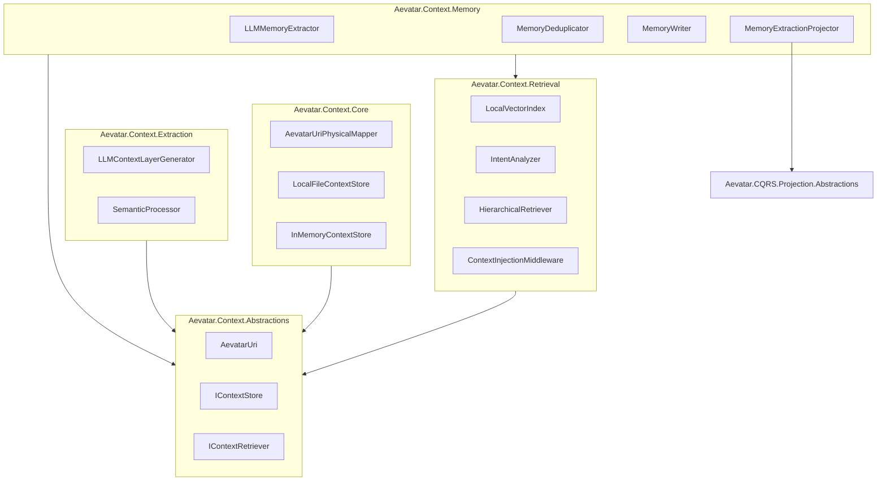
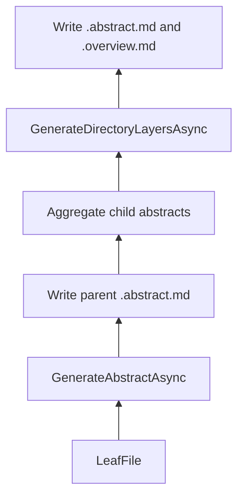
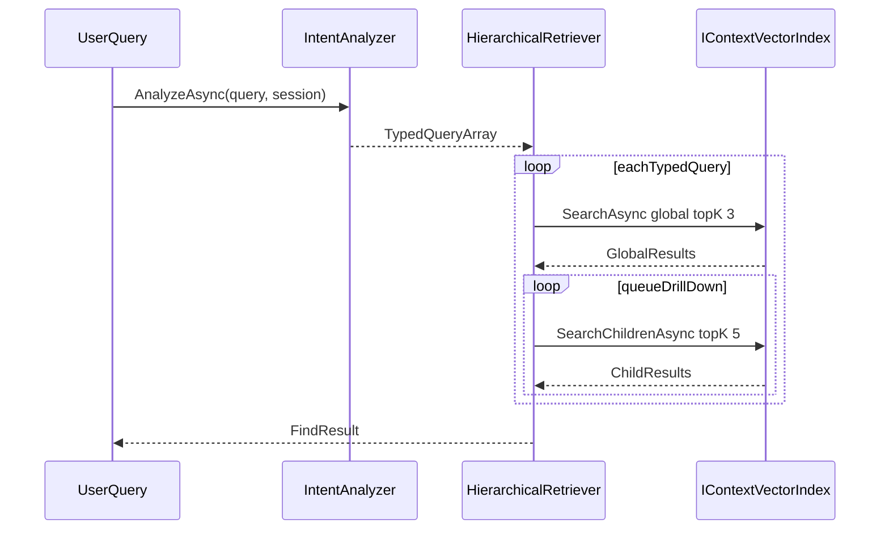
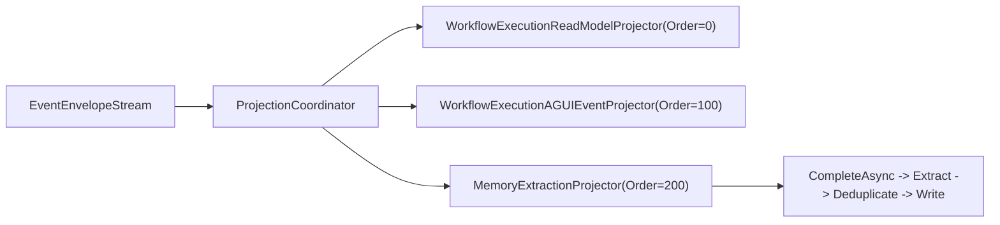
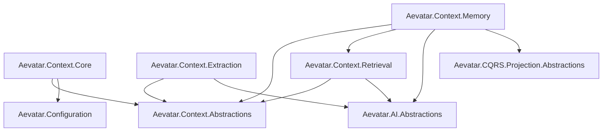

# Context Database 架构文档

## 概述

Aevatar Context Database 将技能、资源、记忆、会话统一抽象为 `aevatar://` 虚拟文件系统，提供：

- 基于 URI 的统一存储访问（`IContextStore`）
- 基于语义向量的上下文检索（`IContextRetriever`）
- 基于 LLM 的分层摘要（L0/L1）与记忆提取
- 通过 Projection Pipeline 的记忆写入扩展点

本文档以当前实现为准，描述真实行为、默认参数、接入方式和现阶段限制。

灵感来源于 [OpenViking](https://github.com/volcengine/OpenViking)，在 Aevatar 分层架构中落地。

## 模块全景



## 虚拟文件系统

### URI 格式

```text
aevatar://{scope}/{path}
```

### Scope 映射

| Scope | 说明 | 物理路径 | 代码映射 |
|---|---|---|---|
| `skills` | 全局技能定义 | `~/.aevatar/skills/` | `AevatarPaths.Skills` |
| `resources` | 外部知识资源 | `~/.aevatar/resources/` | `AevatarPaths.Resources` |
| `user` | 用户数据与记忆 | `~/.aevatar/users/` | `AevatarPaths.Users` |
| `agent` | Agent 运行时数据 | `~/.aevatar/agents/` | `AevatarPaths.AgentData` |
| `session` | 会话上下文 | `~/.aevatar/sessions/` | `AevatarPaths.Sessions` |

说明：

- `AevatarPaths.AgentData` 与 `AevatarPaths.Agents` 当前都映射到 `~/.aevatar/agents/`。
- 反向映射 `FromPhysicalPath` 仅识别上述五个 scope；其他物理路径返回 `null`。
- 未知 scope 在正向映射时抛出 `ArgumentException`。

### `AevatarUri` 行为要点

- Scheme 匹配大小写不敏感；`Scope` 会归一化为小写。
- `aevatar://scope` 与 `aevatar://scope/` 都视为目录。
- `Path` 尾部斜杠会被裁剪，目录语义由 `IsDirectory` 保留。
- `Parent` 在 scope 根目录时返回自身。
- `Join("")` 返回自身，`Join("x/")` 结果为目录，`Join("x")` 结果为文件。

## 存储层行为

### `LocalFileContextStore`

| 能力 | 当前行为 |
|---|---|
| `ReadAsync` | 文件不存在时抛 `FileNotFoundException` |
| `WriteAsync` | 自动创建父目录；存在同名文件时覆盖 |
| `DeleteAsync` | 目标不存在时静默返回；目录删除依赖 `recursive` |
| `ListAsync` | 仅返回直接子项；自动跳过 `.` 开头隐藏项 |
| `GlobAsync` | 总是递归；大小写不敏感；模式会被简化处理 |
| `ExistsAsync` | 目录用 `Directory.Exists`；文件用 `File.Exists` |
| `GetAbstractAsync` | 读取目录下 `.abstract.md`，传文件 URI 时自动取父目录 |
| `GetOverviewAsync` | 读取目录下 `.overview.md`，传文件 URI 时自动取父目录 |

额外约束：

- `GlobAsync` 主要覆盖简单模式（例如 `**/*.md`），复杂组合模式并非完整 glob 实现。
- 路径映射层当前不做路径穿越防护，调用方应避免将 `../` 写入 URI path。

### `InMemoryContextStore`

- 使用 `ConcurrentDictionary` 存储文件与目录，适合单测和本地验证。
- 写文件会自动补齐父目录链。
- 目录 `ExistsAsync` 在存在子文件或子目录时也会返回 `true`。
- `GlobAsync` 为轻量匹配逻辑，覆盖常见模式但不是完整 glob 语义。

## 分层信息模型（L0/L1/L2）

### 目标语义

| 层级 | 文件 | 目标用途 |
|---|---|---|
| L0 | `.abstract.md` | 快速过滤、向量检索摘要 |
| L1 | `.overview.md` | 结构化导航、Rerank 参考 |
| L2 | 原始文件 | 按需深读 |

### 当前实现行为

- L0/L1 目前都以目录级隐藏文件形式存储。
- 文件 URI 的 `GetAbstractAsync` / `GetOverviewAsync` 实际读取其父目录摘要文件。
- `SemanticProcessor` 采用自底向上处理目录树，目录级 L0/L1 由子摘要聚合生成。



## 检索链路

### `FindAsync`（简单搜索）

```text
query -> embedding -> vectorIndex.SearchAsync(topK=10) -> 按 ContextType 分组 -> FindResult
```

特点：

- 不走意图分析。
- 支持 `targetScope` 限定检索范围。

### `SearchAsync`（复杂搜索）



实现要点：

- `IntentAnalyzer` 将输入拆成 0 到 5 条 `TypedQuery`。
- 每条 `TypedQuery` 先做全局检索，再做目录子项下钻。
- 分数传播公式：`final = 0.5 * child + 0.5 * parent`。
- 收敛条件：连续 3 轮 `topScore` 变化小于 `0.001`。
- `ContextType.Memory` 的根范围是 `null`，表示跨 user/agent 记忆检索。

### 检索默认参数

| 组件 | 参数 | 当前值 |
|---|---|---|
| `IntentAnalyzer` | `MaxTokens` | `500` |
| `IntentAnalyzer` | `Temperature` | `0.0` |
| `IntentAnalyzer` | `RecentMessagesLimit` | `5`（`TakeLast(5)`） |
| `IntentAnalyzer` | `MaxTypedQueries` | `5` |
| `HierarchicalRetriever` | `GlobalSearchTopK` | `3` |
| `HierarchicalRetriever` | `SearchChildrenTopK` | `5` |
| `HierarchicalRetriever` | `FinalTake` | `10` |
| `HierarchicalRetriever` | `ScorePropagationAlpha` | `0.5` |
| `HierarchicalRetriever` | `MaxConvergenceRounds` | `3` |
| `HierarchicalRetriever` | `ConvergenceThreshold` | `0.001` |
| `ContextInjectionMiddleware` | `MaxContextTokenBudget` | `3000` |
| `ContextInjectionMiddleware` | 实际预算单位 | `3000 * 4` 字符估算 |
| `ContextInjectionMiddleware` | 检索入口 | `FindAsync` |

### 上下文注入中间件

`ContextInjectionMiddleware` 行为：

- 从请求消息中提取最后一条 `user` 消息作为查询。
- 检索成功后拼装 `system` 消息插入对话。
- 单次调用链通过 metadata key 去重，避免重复注入。
- 出现异常会降级为“跳过注入继续调用”。

## 记忆链路

### 6 类记忆

| 分类 | 归属 | 存储路径 | 可合并 |
|---|---|---|---|
| `Profile` | user | `aevatar://user/{userId}/memories/` | 是 |
| `Preferences` | user | `aevatar://user/{userId}/memories/preferences/` | 是 |
| `Entities` | user | `aevatar://user/{userId}/memories/entities/` | 是 |
| `Events` | user | `aevatar://user/{userId}/memories/events/` | 否 |
| `Cases` | agent | `aevatar://agent/{agentId}/memories/cases/` | 否 |
| `Patterns` | agent | `aevatar://agent/{agentId}/memories/patterns/` | 是 |

### 提取与去重流程

```text
messages -> LLMMemoryExtractor -> CandidateMemory[]
          -> embedding -> vectorIndex.SearchAsync(topK=3, scope=targetPath)
          -> 决策: Create / Update / Skip
          -> MemoryWriter -> IContextStore
```

去重决策矩阵：

| 条件 | 决策 |
|---|---|
| 无匹配或最佳相似度 `< 0.85` | `Create` |
| 相似度 `>= 0.85` 且分类可合并 | `Update` |
| 相似度 `> 0.95` 且分类不可合并 | `Skip` |
| 相似度 `>= 0.85` 且分类不可合并且不满足 skip 条件 | `Create` |

可合并类别：`Profile`、`Preferences`、`Entities`、`Patterns`。  
不可合并类别：`Events`、`Cases`。

### 记忆模块默认参数

| 组件 | 参数 | 当前值 |
|---|---|---|
| `LLMMemoryExtractor` | `MaxTokens` | `2000` |
| `LLMMemoryExtractor` | `Temperature` | `0.0` |
| `LLMMemoryExtractor` | 对话截断长度 | `10000` 字符 |
| `MemoryDeduplicator` | `SimilarityThreshold` | `0.85` |
| `MemoryDeduplicator` | `SkipThreshold` | `0.95` |
| `MemoryDeduplicator` | 相似检索 `topK` | `3` |
| `MemoryWriter` | 文件名格式 | `yyyyMMdd-HHmmss-{slug}.md` |
| `MemoryWriter` | merge 分隔符 | `\\n\\n---\\n\\n` |
| `MemoryExtractionProjector` | `Order` | `200` |
| `MemoryExtractionProjector` | 默认 `userId/agentId` | `"default"` |

### Projection Pipeline 集成

`MemoryExtractionProjector<TContext, TTopology>` 为泛型投影器，实现 `IProjectionProjector<TContext, TTopology>`。



## 项目依赖图



## DI 注册与启用

### 模块注册

```csharp
services
    .AddContextStore()           // LocalFileContextStore + AevatarUriPhysicalMapper
    .AddContextExtraction()      // LLMContextLayerGenerator + SemanticProcessor
    .AddContextRetrieval()       // LocalVectorIndex + IntentAnalyzer + HierarchicalRetriever
    .AddContextMemory();         // LLMMemoryExtractor + MemoryDeduplicator + MemoryWriter

// 测试环境
services.AddInMemoryContextStore();
```

`AddContextStore()` 会调用 `AevatarPaths.EnsureContextDirectories()`，确保基础目录存在。

### Bootstrap 集成

```csharp
builder.Services.AddAevatarBootstrap(builder.Configuration, options =>
{
    options.EnableContextDatabase = true;
});
```

启用后会追加注册：

- `AddContextStore()`
- `AddContextExtraction()`
- `AddContextRetrieval()`
- `AddContextMemory()`
- `ILLMCallMiddleware -> ContextInjectionMiddleware`

### Workflow Projection 集成

```csharp
builder.Services.AddWorkflowExecutionProjectionProjector<
    MemoryExtractionProjector<WorkflowExecutionProjectionContext, IReadOnlyList<WorkflowExecutionTopologyEdge>>>();
```

## 扩展点

| 扩展点 | 当前实现 | 生产替换方向 |
|---|---|---|
| `IContextStore` | `LocalFileContextStore` | 对象存储或分布式文件系统 |
| `IContextVectorIndex` | `LocalVectorIndex` | Qdrant / Weaviate / Pinecone |
| `IContextLayerGenerator` | `LLMContextLayerGenerator` | 混合摘要策略 |
| `IMemoryExtractor` | `LLMMemoryExtractor` | 规则引擎 + LLM 混合 |
| `IEmbeddingGenerator` | 外部注入 | OpenAI / 本地模型 |

## 当前实现限制与优化方向

| 主题 | 当前状态 | 优化方向 |
|---|---|---|
| 向量索引构建 | 代码中暂无自动索引构建流水线，检索前需保证索引已写入 | 增加资源落库后的索引构建与增量更新流程 |
| URI 路径安全 | 映射层未显式防止 `../` 穿越 | 在映射时增加规范化与根路径约束校验 |
| 记忆归属标识 | `MemoryExtractionProjector` 当前使用硬编码 `default` 用户与 Agent | 从投影上下文解析真实 `userId` 与 `agentId` |
| 注入预算精度 | `ContextInjectionMiddleware` 使用字符数近似 token | 接入真实 tokenizer 进行预算控制 |
| Glob 兼容度 | `LocalFileContextStore` 仅覆盖简化 glob 模式 | 引入完整 glob 匹配库并补齐测试 |
| 去重决策枚举 | `DeduplicationDecision.Merge` 已定义，当前去重器不产出该分支 | 根据分类策略补齐 merge 触发条件 |
| 并发写一致性 | `MemoryWriter.Merge` 为读后写，非原子 | 增加存储级并发控制或版本检查 |
| 目录摘要粒度 | L0/L1 以目录级文件为主，文件级摘要与目录摘要存在复用 | 明确文件级与目录级摘要存储策略并拆分 |

## 测试现状

- 已覆盖：`AevatarUri`、`InMemoryContextStore`、检索主流程、记忆提取与去重决策。
- 待加强：`LocalFileContextStore` 真实文件系统场景的集成测试与边界安全测试。
