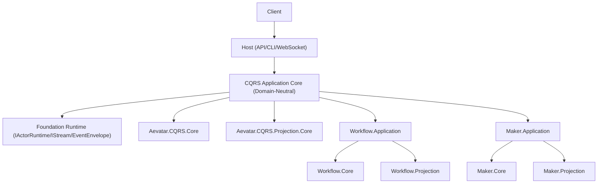

# Core CQRS 平行子系统重构总计划与实施指引（Workflow / Maker）

> 本文合并并替代此前的“消息流分析计划 + 平行子系统计划”。  
> 核心目标：建立统一抽象层（最优先），让 `Workflow` 与 `Maker` 成为真正平行的子系统。

## 1. 重构目标

1. 从“Workflow 中心”迁移到“`GAgent + EventEnvelope` 消息流中心”。
2. 建立 `Core CQRS` 抽象层（命令侧 + 投影侧），让不同子系统共享同一编排模型。
3. 将 `Maker` 从 demo 代码抽取为正式子系统（与 Workflow 同级，具备 Command/Query/Projection）。
4. Host 只做协议适配和组合，不绑定 Workflow 实现细节。

## 2. 现状诊断（基于当前代码）

## 2.1 已具备的通用基础

1. `Foundation` 已提供通用消息流：`EventEnvelope`、`IStream`、`IActorRuntime`。
2. `GAgentBase` + `IEventModule` 支持可插拔事件处理。
3. `Aevatar.CQRS.Projection.*` 已形成可复用读侧内核。

## 2.2 当前主要架构偏差

1. Host 与 Application 命名、契约明显 Workflow 专用，导致跨域复用困难。
2. `Maker` 虽是独立 demo，但核心运行链路依赖 `WorkflowGAgent` 与 Workflow 事件。
3. `MakerRunRecorder` 为手工聚合链路，未纳入统一 Projection 体系。
4. 当前 CQRS 的“命令侧”抽象不足，导致新子系统只能复刻 Workflow 形态。

## 3. 目标架构（统一抽象 + 平行子系统）



设计要点：

1. 子系统差异只体现在 Profile/插件层，不进入 Host 与 Core。
2. 命令与查询统一遵循抽象契约，避免每个子系统独立造运行框架。

## 4. 抽象层建设（最核心工作）

## 4.1 新增项目

1. `src/Aevatar.CQRS.Core.Abstractions`
2. `src/Aevatar.CQRS.Core`

## 4.2 抽象接口（第一批必须落地）

1. `IRunCommandService<TCommand, TStarted, TResult>`
2. `ICommandEnvelopeFactory<TCommand>`
3. `IRunCorrelationPolicy`
4. `IRunOutputStream<TFrame>`
5. `IRunQueryService<TRunSummary, TRunDetail>`
6. `ISubsystemProfile`（统一子系统注册入口）

建议接口签名（草案）：

```csharp
public interface IRunCommandService<TCommand, TStarted, TResult>
{
    Task<(TStarted? Started, TResult Result)> ExecuteAsync(
        TCommand command,
        Func<object, CancellationToken, ValueTask> emitAsync,
        CancellationToken ct = default);
}

public interface ICommandEnvelopeFactory<TCommand>
{
    EventEnvelope CreateEnvelope(TCommand command, RunCorrelation correlation);
}

public interface IRunCorrelationPolicy
{
    RunCorrelation CreateNew(string actorId, string? sessionId = null);
    bool TryResolve(EventEnvelope envelope, out RunCorrelation correlation);
}

public interface IRunOutputStream<TFrame>
{
    Task PumpAsync(IAsyncEnumerable<object> events, Func<TFrame, CancellationToken, ValueTask> emitAsync, CancellationToken ct = default);
}

public interface IRunQueryService<TRunSummary, TRunDetail>
{
    Task<IReadOnlyList<TRunSummary>> ListAsync(int take = 50, CancellationToken ct = default);
    Task<TRunDetail?> GetAsync(string runId, CancellationToken ct = default);
}

public interface ISubsystemProfile
{
    string Name { get; }
    IServiceCollection Register(IServiceCollection services, IConfiguration configuration);
}
```

## 4.3 语义边界

1. 抽象层不包含 `Workflow` / `Maker` 业务名词。
2. 抽象层不依赖 Host、Presentation、具体子系统 Core。
3. RunId/SessionId/CorrelationId 规则只允许由 `IRunCorrelationPolicy` 统一管理。

## 4.4 默认实现（`Aevatar.CQRS.Core`）

1. `DefaultRunCorrelationPolicy`
2. `DefaultRunCommandExecutor`（调用 `IActorRuntime` + `ICommandEnvelopeFactory`）
3. `DefaultRunOutputPump`（统一输出泵，替代子系统内重复流式实现）
4. `DefaultSubsystemProfileRegistry`

## 5. 项目组织重构（目标目录）

```text
src/
  Aevatar.CQRS.Core.Abstractions
  Aevatar.CQRS.Core
  Aevatar.CQRS.Projection.Abstractions
  Aevatar.CQRS.Projection.Core
  workflow/
    Aevatar.Workflow.Application.Abstractions
    Aevatar.Workflow.Application
    Aevatar.Workflow.Core
    Aevatar.Workflow.Projection
  maker/
    Aevatar.Maker.Application.Abstractions
    Aevatar.Maker.Application
    Aevatar.Maker.Core
    Aevatar.Maker.Projection
    Aevatar.Maker.Infrastructure
demos/
  Aevatar.Demos.Maker.Host
  Aevatar.Demos.CaseProjection.Host
```

说明：`demos/Aevatar.Demos.Maker` 只保留 Host 示例和配置文件，不再承载核心业务类。

## 6. 迁移映射（旧 -> 新）

| 现有实现 | 目标归属 | 处理策略 |
|---|---|---|
| `IWorkflowChatRunApplicationService` | `IRunCommandService<...>` 适配层 | 先 adapter，后收敛命名 |
| `WorkflowRunOutputStreamer` | `IRunOutputStream<TFrame>` 默认实现 | 抽出公共实现 |
| `WorkflowChatRequestEnvelopeFactory` | `ICommandEnvelopeFactory<TCommand>` | 迁移为子系统实现 |
| `ChatSessionKeys` + `metadata["run_id"]` | `IRunCorrelationPolicy` | 统一策略入口 |
| `MakerRunRecorder` | `Aevatar.Maker.Projection` | 改为 reducer/projector/readmodel |
| `MakerModuleFactory/Modules` | `Aevatar.Maker.Core` | 从 demo 抽取到正式子系统 |

## 7. 分阶段实施（详细指引）

## Phase 0：基线与门禁

1. 冻结当前行为基线（Workflow + Maker 集成测试全绿）。
2. 增加架构门禁脚本：
   - Host 不得直接引用 `workflow/*` / `maker/*` Core 实现。
   - `CQRS.Core.Abstractions` 不得引用子系统项目。
   - 禁止新增硬编码 `metadata["run_id"]`。

## Phase 1：落地抽象层（最高优先级）

1. 新建 `Aevatar.CQRS.Core.Abstractions` 与 `Aevatar.CQRS.Core`。
2. 实现 4.2 列出的接口与默认实现。
3. 在不改业务行为前提下，为 Workflow 提供适配器：
   - `WorkflowRunCommandServiceAdapter`
   - `WorkflowCommandEnvelopeFactoryAdapter`
   - `WorkflowRunQueryServiceAdapter`

建议落地文件：

1. `src/Aevatar.CQRS.Core.Abstractions/Runs/IRunCommandService.cs`
2. `src/Aevatar.CQRS.Core.Abstractions/Runs/IRunCorrelationPolicy.cs`
3. `src/Aevatar.CQRS.Core.Abstractions/Runs/RunCorrelation.cs`
4. `src/Aevatar.CQRS.Core.Abstractions/Profiles/ISubsystemProfile.cs`
5. `src/Aevatar.CQRS.Core/Runs/DefaultRunCorrelationPolicy.cs`
6. `src/Aevatar.CQRS.Core/Runs/DefaultRunCommandExecutor.cs`
7. `src/workflow/Aevatar.Workflow.Application/Adapters/WorkflowRunCommandServiceAdapter.cs`
8. `src/workflow/Aevatar.Workflow.Application/Adapters/WorkflowRunQueryServiceAdapter.cs`

验收：

1. Workflow 主链路功能不变。
2. Host 已可仅通过中立抽象调用 Workflow。

## Phase 2：Workflow 去中心化改造

1. `Host.Api` 改为依赖 `Aevatar.CQRS.Core.Abstractions` + Profile 注册。
2. `Program.cs` 由多项目硬编码注册，收敛到单入口：
   - `AddWorkflowSubsystemProfile()`
3. 保留 Workflow 原接口，但内部全部转调新抽象层。

验收：

1. Host 中不出现 Workflow-only 编排代码。
2. Workflow 查询与运行接口行为一致。

## Phase 3：Maker 子系统正式化

1. 新建 `src/maker/*` 五层项目。
2. 把 `MakerRecursiveModule`、`MakerVoteModule`、`MakerModuleFactory` 抽到 `Aevatar.Maker.Core`。
3. 新建 `Aevatar.Maker.Application`：
   - `MakerRunCommandService`
   - `MakerRunQueryService`
4. 新建 `Aevatar.Maker.Projection`：
   - `MakerRunReadModel`
   - `Maker*Reducer`
   - `MakerReadModelProjector`
   - `IMakerProjectionService`

建议落地文件：

1. `src/maker/Aevatar.Maker.Core/Modules/MakerRecursiveModule.cs`
2. `src/maker/Aevatar.Maker.Core/Modules/MakerVoteModule.cs`
3. `src/maker/Aevatar.Maker.Core/MakerModuleFactory.cs`
4. `src/maker/Aevatar.Maker.Application/Commands/MakerRunCommandService.cs`
5. `src/maker/Aevatar.Maker.Application/Queries/MakerRunQueryService.cs`
6. `src/maker/Aevatar.Maker.Projection/ReadModels/MakerRunReadModel.cs`
7. `src/maker/Aevatar.Maker.Projection/Projectors/MakerRunReadModelProjector.cs`
8. `src/maker/Aevatar.Maker.Projection/Reducers/*`
9. `src/maker/Aevatar.Maker.Infrastructure/DependencyInjection/ServiceCollectionExtensions.cs`

验收：

1. `demos/Aevatar.Demos.Maker` 不再含核心业务类。
2. `MakerRunRecorder` 功能迁移到标准 Projection 链路。

## Phase 4：平行 Profile 统一接入

1. 定义 `ISubsystemProfile` 注册规范：
   - Command 服务注册
   - Query 服务注册
   - Projection Profile 注册
2. Workflow 与 Maker 均按同一 profile 机制接入。
3. Host 支持按配置切换/并存多个 profile。

验收：

1. 新增第三个子系统可通过“新增项目 + profile 注册”完成，无需改 Host 编排代码。

## Phase 5：测试、文档、治理收尾

1. 新增 `test/Aevatar.Maker.*` 套件，迁移 Maker 回归用例。
2. 增加 Workflow/Maker 共用抽象契约测试。
3. 更新 `docs/FOUNDATION.md`、`docs/WORKFLOW.md`、`demos/README.md`。
4. 增加 CI 架构检查与依赖方向检查。

## 8. 编码规范与依赖规则（强制）

1. `Host` 仅依赖 Application Abstractions + CQRS Abstractions。
2. `Application` 只依赖本域 Abstractions + CQRS Abstractions + Foundation Abstractions。
3. `Core` 不得依赖 Host/Infrastructure/Presentation。
4. `Projection` 仅通过 `IProjection*` 扩展，不复制内核。
5. 所有 run 关联逻辑必须统一走 `IRunCorrelationPolicy`。

## 9. 验收清单（每阶段必跑）

```bash
dotnet build aevatar.slnx --nologo
dotnet test aevatar.slnx --nologo
```

增量验收：

1. Workflow 回归：`test/Aevatar.Workflow.Application.Tests`
2. Maker 回归：`test/Aevatar.Integration.Tests`（迁移后到 `test/Aevatar.Maker.*`）
3. Host 接口回归：`test/Aevatar.Host.Api.Tests`

## 10. 交付里程碑（建议）

1. M1（抽象层可用）：完成 Phase 1，Workflow 已通过 adapter 运行。
2. M2（Host 去中心化）：完成 Phase 2，Host 不再绑定 Workflow 编排。
3. M3（Maker 正式子系统）：完成 Phase 3，Maker 拥有独立 Application/Core/Projection。
4. M4（平行体系闭环）：完成 Phase 4/5，Workflow 与 Maker 均通过统一 Profile 接入。

## 11. 完成定义（DoD）

1. Workflow 与 Maker 为平行子系统，分层和命名统一。
2. Core CQRS 抽象层成为唯一跨子系统运行编排入口。
3. Host 不因新增子系统而改业务编排代码。
4. Maker 的读模型生成进入统一 CQRS Projection 链路。
5. CI 门禁可阻止回退到 Workflow 中心化实现。

## 12. 执行任务清单（可直接照单实施）

## A. 抽象层任务（必须先做）

1. `A-01` 新建 `Aevatar.CQRS.Core.Abstractions` 工程与基础 contracts。
2. `A-02` 新建 `Aevatar.CQRS.Core` 默认实现。
3. `A-03` 增加 `RunCorrelation` 统一模型，替代散落 run/session 规则。
4. `A-04` 增加 `ISubsystemProfile` 与 profile registry。
5. `A-05` 增加抽象层单元测试（契约行为测试）。

## B. Workflow 适配任务

1. `W-01` 增加 Workflow adapter（命令/查询/输出）。
2. `W-02` Host 调用迁移到抽象接口。
3. `W-03` 保持旧接口可用并打 `Obsolete`（迁移期）。

## C. Maker 子系统化任务

1. `M-01` 将 Maker Core 从 demos 迁移到 `src/maker`。
2. `M-02` 将 Maker Recorder 迁移为标准 Projection。
3. `M-03` 提供 Maker profile 并接入统一 Host。
4. `M-04` 迁移 Maker 集成测试到 `test/Aevatar.Maker.*`。

## D. 治理任务

1. `G-01` 增加依赖方向架构测试。
2. `G-02` 增加字符串硬编码门禁（run_id/session 相关）。
3. `G-03` 文档同步与示例更新（README/docs/demos）。
