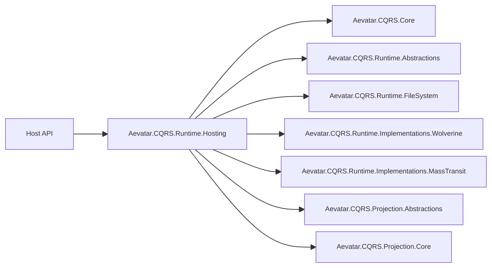
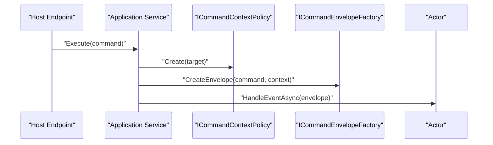
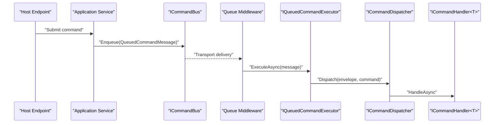
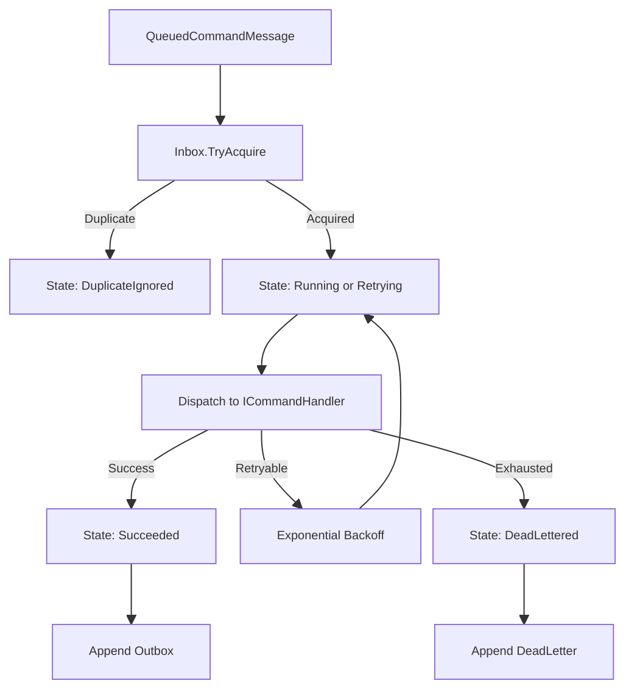
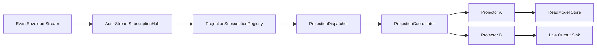

# Aevatar CQRS 架构文档

## 1. 文档目标

本文档定义 Aevatar 当前 CQRS 的实现基线，覆盖：

1. 写侧（Command）与读侧（Query / ReadModel）边界。
2. 框架层项目职责与依赖关系。
3. 命令执行链路、投影链路、状态持久化链路。
4. Wolverine / MassTransit 并行实现策略。
5. CQRS 与编排边界关系（编排不承担读模型职责）。
6. 按能力打包的系统接入规范（Mainnet 默认内置 Workflow，Maker 为独立能力提供系统）。

## 2. 顶层原则

1. `Command -> Event`，`Query -> ReadModel`。
2. Host 只做协议适配与依赖组合，不做业务编排。
3. 抽象层不携带具体能力语义（不依赖 workflow/maker 等实现项目）。
4. `CorrelationId` 用于链路关联；`metadata` 仅用于透传与诊断。
5. Projection 负责状态追踪与对外查询，不引入额外状态机编排层。

## 3. 项目分层与职责

| 层 | 项目 | 职责 |
|---|---|---|
| Core Abstractions | `Aevatar.CQRS.Core.Abstractions` | 命令执行抽象、输出流抽象 |
| Core | `Aevatar.CQRS.Core` | `ICommandContextPolicy` 默认实现、事件输出流默认实现 |
| Runtime Abstractions | `Aevatar.CQRS.Runtime.Abstractions` | 命令总线/调度/处理器、执行器、状态与持久化契约 |
| Runtime Base | `Aevatar.CQRS.Runtime.FileSystem` | 本地状态存储、执行器、出站分发、检查点 |
| Runtime Hosting | `Aevatar.CQRS.Runtime.Hosting` | 统一装配入口（Core + Runtime + 实现选择） |
| Runtime Impl | `Aevatar.CQRS.Runtime.Implementations.Wolverine` / `MassTransit` | 命令总线具体实现 |
| Projection Abstractions | `Aevatar.CQRS.Projection.Abstractions` | 投影生命周期、分发、订阅、读模型契约 |
| Projection Core | `Aevatar.CQRS.Projection.Core` | 通用投影协调与订阅复用实现 |

## 4. 总体架构图

## 5. 命令模型（写侧）

核心对象：

1. `CommandContext`：`TargetId/CommandId/CorrelationId/Metadata`。
2. `CommandEnvelope`：Runtime 级封装（含入队时间）。
3. `QueuedCommandMessage`：总线传输对象。
4. `CommandExecutionState`：执行状态快照（Accepted/Queued/Running/...）。

状态枚举：`Accepted`、`Queued`、`Running`、`Retrying`、`Succeeded`、`Failed`、`Cancelled`、`TimedOut`、`DeadLettered`、`DuplicateIgnored`。

## 6. 两类命令执行路径

### 6.1 直接执行路径（Actor 直达）

用于需要即时启动并持续流式输出的场景（如 Mainnet 内置 Workflow 能力、Maker 能力实时执行）：

特征：低延迟、可实时流输出；但不经过队列重试/死信通道。

### 6.2 入队执行路径（标准 CQRS Runtime）

用于 Mainnet 命令受理与异步执行：

特征：具备幂等、重试、死信、状态追踪与出站分发。

## 7. 队列执行器与持久化

`QueuedCommandExecutor`（`Aevatar.CQRS.Runtime.FileSystem`）统一处理：

1. Inbox 去重：`IInboxStore.TryAcquire(commandId)`。
2. 状态推进：写 `ICommandStateStore`。
3. 反序列化与分发：`ICommandPayloadSerializer` + `ICommandDispatcher`。
4. 指数退避重试：`MaxRetryAttempts` + `RetryBaseDelayMs`。
5. 失败落地：`IDeadLetterStore`。
6. 成功出站：`IOutboxStore` + `OutboxDispatchHostedService`。

## 8. 投影架构（读侧）

Projection 内核由 `Aevatar.CQRS.Projection.Core` 提供，职责拆分：

1. `ProjectionLifecycleService`：`start/project/complete` 生命周期编排。
2. `ProjectionSubscriptionRegistry`：按 `actorId` 注册/注销投影上下文。
3. `ActorStreamSubscriptionHub`：同一 actor 底层订阅复用，逻辑处理器多播。
4. `ProjectionDispatcher`：统一事件分发入口。
5. `ProjectionCoordinator`：按 `Order` 调度多个 projector。

说明：CQRS 与 AGUI 输出统一走同一事件输入与投影管线，只是 projector 分支不同。

## 9. Runtime 实现并行策略

### 9.1 Wolverine 实现

1. `WolverineCommandBus` 实现 `ICommandBus/ICommandScheduler`。
2. `WolverineQueuedCommandHandler` 消费本地队列 `cqrs-commands`。
3. `UseAevatarCqrsWolverine` 在 HostBuilder 侧挂接 Wolverine 管道。

### 9.2 MassTransit 实现

1. `MassTransitCommandBus` 实现 `ICommandBus/ICommandScheduler`。
2. `QueuedCommandConsumer` 消费 `QueuedCommandMessage`。
3. 默认 `UsingInMemory`，可平移到外部 Broker（不改上层业务）。

### 9.3 选择方式

通过配置切换：`Cqrs:Runtime = Wolverine | MassTransit`。  
上层 Host/业务代码不应直接依赖实现项目。

## 10. 编排与 CQRS 的关系

当前原则：

1. CQRS 主链路独立于额外编排层，可完整运行。
2. 跨 Actor 协作优先使用 EventEnvelope 事件链路，不引入独立状态机层。
3. 业务状态查询统一由 Projection/ReadModel 提供。

## 11. 系统接入规范（按能力打包）

每个 Capability Host 统一接入：

1. `builder.Host.UseAevatarCqrsRuntime(builder.Configuration);`
2. `builder.Services.AddAevatarCqrsRuntime(builder.Configuration);`

目标接入：

1. `src/Aevatar.Mainnet.Host.Api/Program.cs`
2. `src/maker/Aevatar.Maker.Host.Api/Program.cs`

约束：

1. `Mainnet Host` 默认打包 `Workflow Capability`，不再以独立 Workflow Host 形式接入。
2. `Maker Host` 通过引用 Maker 项目并调用 `AddMakerCapability(...)` 接入。
3. 不允许新增或回流 `Aevatar.Platform.*` 项目引用。

## 12. 配置基线（`Cqrs:*`）

关键配置：

1. `Cqrs:Runtime`
2. `Cqrs:WorkingDirectory`
3. `Cqrs:MaxRetryAttempts`
4. `Cqrs:RetryBaseDelayMs`
5. `Cqrs:QueueCapacity`
6. `Cqrs:OutboxDispatchIntervalMs`
7. `Cqrs:OutboxDispatchBatchSize`

## 13. 扩展点与反模式

推荐扩展点：

1. 新命令类型：新增 `ICommandHandler<TCommand>`。
2. 新读模型：新增 projector/reducer + `IProjectionReadModelStore` 实现。
3. 新运行时：实现 `ICommandBus/ICommandScheduler` 并在 Hosting 层接入。
4. 新持久化：替换 `ICommandStateStore/IInboxStore/IOutboxStore/IDeadLetterStore`。

禁止反模式：

1. Host/API 直接调用 Runtime 实现细节。
2. 命令路径读取 ReadModel 决策业务写入。
3. 业务字段滥用 `metadata`。

## 14. 验证与门禁

最低验证：

1. `dotnet build aevatar.slnx --nologo`
2. `dotnet test aevatar.slnx --nologo`

CI 架构门禁（摘要）：

1. 禁止同步阻塞写法（如 `GetAwaiter().GetResult()`）。
2. 禁止字符串匹配事件类型路由（`TypeUrl.Contains`）。
3. 禁止 Host/Infrastructure 直接拼装 `AddCqrsCore(...)`。
4. 仅允许 Runtime.Hosting 直接引用 `Runtime.Implementations.*`。

## 15. 结论

Aevatar 当前 CQRS 架构已形成：

1. 抽象稳定（Core / Runtime / Projection 分层清晰）。
2. 实现可切换（Wolverine 与 MassTransit 并行）。
3. 读写职责清晰（写侧命令执行、读侧投影查询）。
4. 编排通过事件链路完成，不新增额外运行时负担。
