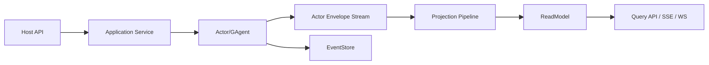

# Aevatar CQRS 架构（Maker 插件化后）

## 1. 目标

定义当前 CQRS 基线：

1. 写侧：`Application Command -> Actor Mailbox Message(EventEnvelope) -> Domain Event`
2. 读侧：`Projection -> ReadModel -> Query`
3. 插件：Maker 仅扩展 Workflow 模块，不新增第二套 CQRS 主链路

## 2. 顶层原则

1. Host 只做协议与组合，不做业务编排。
2. 命令执行走 Application 服务，不引入额外命令总线壳层。
3. 读写分离保持单一事实源：`EventStore` 中的领域事件 + 投影读模型。
4. 中间层禁止维护 actor/run/session 事实态内存映射。

## 3. 项目分层

| 层 | 项目 | 职责 |
|---|---|---|
| CQRS Core | `Aevatar.CQRS.Core*` | 命令执行抽象、上下文策略、输出流抽象 |
| Projection Core | `Aevatar.CQRS.Projection.*` | 投影生命周期、订阅、分发、协调 |
| Foundation/AI Projection | `Aevatar.Foundation.Projection` / `Aevatar.AI.Projection` | 通用读模型能力与 AI reducer |
| Workflow Projection | `src/workflow/Aevatar.Workflow.Projection` | Workflow 领域读模型与投影 |
| Maker Extension | `src/workflow/extensions/Aevatar.Workflow.Extensions.Maker` | 通过 `IWorkflowModulePack` 扩展模块，不承载独立 CQRS |

## 4. 主链路

口径澄清：

1. `EventEnvelope Stream` 是 runtime message stream，不是 Event Sourcing 的事实流。
2. Command 进入 Application 后，会被包装成 `EventEnvelope` 投递到目标 Actor 邮箱。
3. Actor 在自己的串行上下文里做决策，只有显式持久化的领域事件才进入 `EventStore`。
4. Projection 当前消费的是 Actor envelope 流，并把其中有业务语义的 payload 映射为 read model 与实时输出。

## 5. 投影约束

1. CQRS 与 AGUI/SSE/WS 共用统一 Projection 输入链路。
2. 事件订阅以 reducer 的 `EventTypeUrl` 精确匹配为准。
3. 未命中 reducer 的事件必须为 no-op。
4. Workflow 投影生命周期通过 lease/session 句柄管理，不允许 `actorId -> context` 反查。
5. 同一 `EventEnvelope` 分发到多个 projector 时采用“一对多全分支尝试”语义：单个 projector 失败不阻断其他 projector 执行，最终以聚合异常统一回传。
6. 禁止 `Projection:ReadModel:Bindings` 与任何 BindingResolver 路由；投影存储路由统一由 `IProjectionStoreDispatcher` + Store Binding (`IProjectionDocumentStore` / `IProjectionGraphStore`) 决策。
7. Host 组合层按配置仅注册所需 provider 组合，不允许无条件并列注册 InMemory/Elasticsearch/Neo4j。

## 5.1 编排减重落地（2026-02-22）

1. Application 命令侧已拆分为：
   `WorkflowChatRunApplicationService`（入口） +  
   `WorkflowRunContextFactory`（上下文） +  
   `WorkflowRunExecutionEngine`（执行） +  
   `WorkflowRunCompletionPolicy`（终态） +  
   `WorkflowRunResourceFinalizer`（清理）。
2. Projection 端口实现已拆分为：
   `WorkflowExecutionProjectionLifecycleService`（生命周期端口） +  
   `WorkflowExecutionProjectionQueryService`（查询端口） +  
   `ProjectionLifecyclePortServiceBase<>`（通用基类） +  
   `ProjectionQueryPortServiceBase<>`（通用基类） +  
   `WorkflowProjectionActivationService`（激活） +  
   `WorkflowProjectionReleaseService`（释放） +  
   `IProjectionOwnershipCoordinator`（ownership） +  
   `EventSinkProjectionSessionSubscriptionManager<WorkflowExecutionRuntimeLease, WorkflowRunEvent>`（订阅生命周期） +  
   `EventSinkProjectionLiveForwarder<WorkflowExecutionRuntimeLease, WorkflowRunEvent>`（sink 转发） +  
   `WorkflowProjectionSinkFailurePolicy`（异常策略） +  
   `WorkflowProjectionReadModelUpdater`（读模型元信息） +  
   `WorkflowProjectionQueryReader`（查询映射）。
3. CI 增加编排类体量守卫：关键编排类的非空行数与直接依赖数有上限，避免“重新变胖”。

## 5.2 Metadata 口径（防理解偏差）

1. `EventEnvelope.Metadata` 属于包络级元信息，用于传播/追踪，不作为业务完成语义主来源。
2. `StepCompletedEvent.Metadata` 属于业务事件元信息，Maker/Connector/Parallel 等模块信息写入此处。
3. ReadModel 聚合使用 `StepCompletedEvent.Metadata`，并落到 step `CompletionMetadata` 与 timeline `Data`。
4. 实时输出是否带业务 metadata 由 mapper 明确定义；当前默认不自动透传 `StepCompletedEvent.Metadata` 全量字段。

## 6. 宿主接入规范

当前宿主：

1. `src/Aevatar.Mainnet.Host.Api/Program.cs`
2. `src/workflow/Aevatar.Workflow.Host.Api/Program.cs`

接入约束：

1. 必须使用 `AddAevatarDefaultHost(...)` + `UseAevatarDefaultHost()`。
2. Mainnet 与 Workflow Host 必须接入 `AddWorkflowCapabilityWithAIDefaults()`（统一装配 Workflow capability + AI features + AI projection extension）。
3. Mainnet 通过 `AddWorkflowMakerExtensions()` 装配 Maker 插件。
4. 禁止 `AddMakerCapability()` 与 `/api/maker/*` 独立路由模型。

## 7. Runtime 口径

1. 当前默认 `ActorRuntime:Provider=InMemory`（开发/测试）。
2. `ActorRuntime` 不是额外的“第二套通道”，而是构建在 stream 之上的 Actor 语义层，负责寻址、激活、邮箱串行与拓扑。
3. 生产目标：分布式 Actor Runtime + 非 InMemory 持久化（state/event/read model）。
4. 本口径下 `InMemory` 与 `Actor Local` 均不作为架构扣分项。

## 8. 门禁与验证

最低验证：

1. `bash tools/ci/architecture_guards.sh`
2. `dotnet build aevatar.slnx --nologo`
3. `dotnet test aevatar.slnx --nologo`
4. `bash tools/ci/slow_test_guards.sh`

关键门禁：

1. 禁止 `GetAwaiter().GetResult()`
2. 禁止 `TypeUrl.Contains(...)` 路由
3. 禁止 Host/Infrastructure 直接 `AddCqrsCore(...)`
4. 禁止独立 Maker Capability 工程与路由回流
5. 强制 Mainnet 插件化装配 Maker
6. 默认全量测试只承载快速主链路；分钟级脚本自治演化回归独立执行，避免把慢测静默耗时混入常规门禁。
