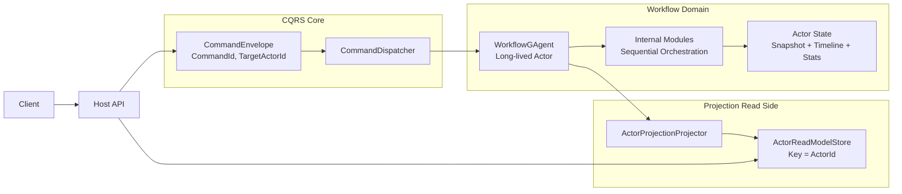

# CQRS/Workflow 重构计划（Single-WorkflowGAgent，无 Run 隔离）

## 1. 顶级决策（硬约束）

1. 系统只保留一个长期实例语义的 `WorkflowGAgent`（按 `ActorId` 标识）。
2. 不做“同 Actor 多 Run 上下文隔离”，`RunId` 视为伪需求，整体删除。
3. 事件处理以 `Actor` 单线程顺序语义为核心，是否并行执行由 `WorkflowGAgent` 内部模块决定。
4. `CQRS.Core` 仅保留通用命令追踪语义（`CommandId/CorrelationId/CausationId/TargetActorId`）。
5. Query 只面向 Actor 级只读模型（Snapshot/Timeline/Stats），不再提供 Run 级查询。
6. API 只做宿主与组合，不承载业务编排。

---

## 2. 现状问题

1. 当前实现同时维护 `CommandId` 与 `RunId`，并引入 `CommandId -> Runs[]` 映射，语义复杂。
2. 读侧大量面向“单次 run 报告”建模，与“长期 Actor 持续处理事件”目标冲突。
3. `POST /api/chat` 的“本次 run 结束即收尾”语义，本质是临时会话模型，不是长期事件流模型。

---

## 3. 目标架构图

---

## 4. 目标契约

1. `POST /api/commands`
   1. 输入：`targetActorId + payload`。
   2. 输出：`202 Accepted + commandId`。
2. `GET /api/actors/{actorId}`
   1. 输出：该 Actor 当前快照（状态、统计、最近输出）。
3. `GET /api/actors/{actorId}/timeline`
   1. 输出：该 Actor 的事件时间线（分页）。
4. SSE/WS
   1. 语义改为“订阅 Actor 输出流”，不再绑定单次 run 完成条件。

---

## 5. 分阶段改造

### Phase 1：删除 Run 语义（P1）

1. 删除 `RunId` 字段与模型：`WorkflowRunSummary/WorkflowRunReport/WorkflowProjectionSession` 等。
2. 删除 `RunIdResolver`、`RunProjectionCompletion`、`CommandId -> Runs[]` 相关实现。
3. 事件契约移除 `run_id`（proto、metadata、DTO、mapper、tests 同步）。

### Phase 2：Actor 级读模型统一（P1）

1. 新建 `WorkflowActorReadModel`（`ActorId` 主键）。
2. Projector 统一写入 Actor 级 Snapshot + Timeline + Stats。
3. 查询服务改为 `GetActorSnapshot/ListActorTimeline`。

### Phase 3：Host API 收敛（P1）

1. 删除 `/api/runs*`、`/api/commands/{commandId}/runs`。
2. 保留 `/api/commands`（命令受理）+ `/api/actors*`（只读查询）。
3. `POST /api/chat` 重定向为“发送命令 + 订阅 Actor 流”的薄封装。

### Phase 4：应用层职责收敛（P2）

1. 删除 `WorkflowExecution*` 术语，统一为 `WorkflowActor*` 或 `WorkflowState*`。
2. `WorkflowChatRunApplicationService` 重命名为 `WorkflowCommandApplicationService`。
3. 移除以 run 为中心的 finalize/wait/rollback 编排路径。

### Phase 5：测试与文档（P2）

1. 测试重构为 Actor 级行为：顺序处理、时间线增长、快照一致性。
2. 删除 run 相关历史测试样例。
3. 更新各子项目 README 架构图与术语。

---

## 6. 代码影响范围

1. `src/workflow/Aevatar.Workflow.Application*`
2. `src/workflow/Aevatar.Workflow.Core*`
3. `src/workflow/Aevatar.Workflow.Projection*`
4. `src/Aevatar.Host.Api/Endpoints/*`
5. `src/Aevatar.CQRS.Core*`（仅保留通用命令语义）
6. `test/Aevatar.Host.Api.Tests/*`
7. `test/Aevatar.Workflow.Application.Tests/*`

---

## 7. 验收标准

1. 代码中无 `RunId` 公开业务语义（字段/接口/端点/查询）。
2. 读模型主键统一为 `ActorId`。
3. API 不再暴露 run 级查询路径。
4. `dotnet build aevatar.slnx --nologo` 通过。
5. `dotnet test aevatar.slnx --nologo` 通过。
