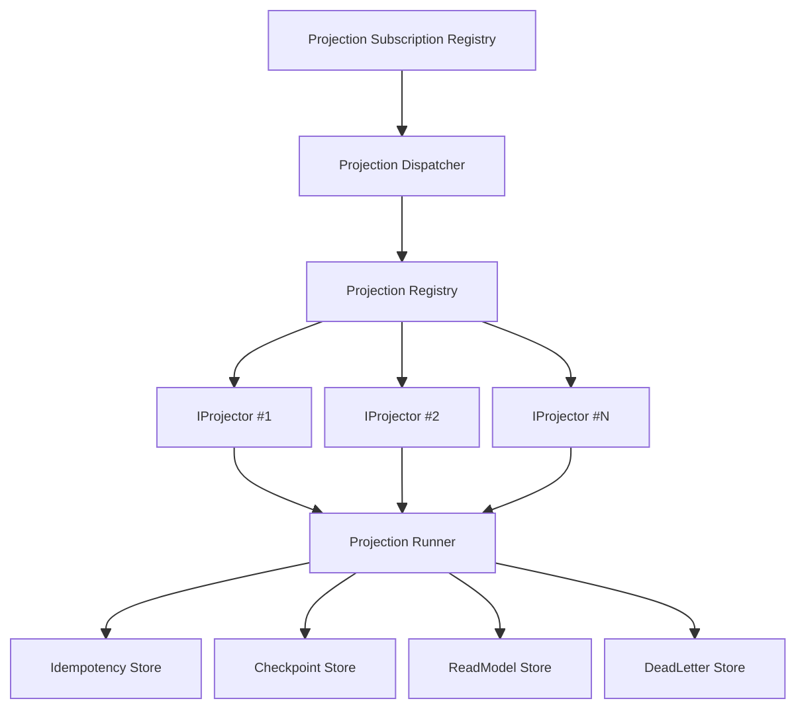
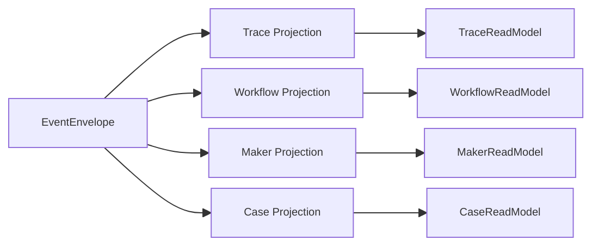

# EventEnvelope 驱动的 CQRS 重构总方案（开闭原则版）

## 1. 文档目的
本文档定义一次完整的架构重构方案，目标是把系统从“面向 Workflow 业务追踪”重构为“面向 EventEnvelope 关联追踪”，并在复杂事件链路下严格遵循开闭原则（OCP）：

1. 框架稳定，业务可插拔。
2. 新流程通过新增实现与注册完成，而不是修改核心分发逻辑。
3. CQRS 追踪能力上移到框架层，Workflow/Maker/Case 仅保留业务语义投影。

## 2. 范围与非目标
### 2.1 范围
1. Foundation 事件处理与发布透传链路。
2. CQRS Core/Projection Core 的统一分发与追踪抽象。
3. 子系统（workflow/maker/demos）的接入方式标准化。
4. 文档、测试、CI 架构门禁同步升级。

### 2.2 非目标
1. 本轮不替换虚拟 Actor 运行时。
2. 本轮不引入强依赖数据库（允许 FileSystem/InMemory 默认实现）。
3. 本轮不引入业务级兼容层（按当前要求可直接收敛语义）。

## 3. 现状问题审计
1. `CorrelationId` 已具备透传能力，但缺少统一“追踪模型”与“自动投影契约”。
2. Workflow 层仍承担部分通用追踪职责，导致框架与业务边界不清。
3. 投影能力虽存在，但“追踪投影”和“业务投影”尚未在同一抽象模型下标准化。
4. 新增子系统时，仍有较高概率在 Application/API 侧写流程判断逻辑，破坏 OCP。
5. 缺少统一的 Envelope 关联关系视图（`event_id`、`correlation_id`、`metadata["trace.causation_id"]`）。

## 4. 顶层架构原则（重构后）
1. API 只做 Host：接收命令、查询读模型、推送读模型变化。
2. 命令写侧：`Command -> EventEnvelope`。
3. 查询读侧：`Query -> ReadModel`。
4. 追踪能力：框架统一生成与投影，不放在任一业务子系统。
5. 投影能力：统一入口、一对多分发、幂等执行、可重放。
6. 扩展方式：新增 `IProjector<>`/`IProcessManager<>` 实现并注册即可。
7. `GAgentBase` 以 Raw `EventEnvelope` 作为处理上下文，不新增 `RequestContext/ResponseContext` 包装层。
8. Actor 边界不携带 CQRS 语义：`EventEnvelope` 不包含 `command.id` 等命令域字段。

## 5. 目标架构图
### 5.1 端到端处理链路

```mermaid
%%{init: {"maxTextSize": 100000, "flowchart": {"useMaxWidth": false, "nodeSpacing": 10, "rankSpacing": 50}, "themeVariables": {"fontSize": "10px"}}}%%
flowchart LR
  A["Host.Api Command Endpoint"] --> B["CQRS Command Service"]
  B --> C["CommandContext(CommandId/CorrelationId)"]
  C --> D["EventEnvelope Factory"]
  D --> E["Actor Runtime"]
  E --> F["GAgentBase Raw EventEnvelope Pipeline"]
  F --> G["IEventPublisher (Propagate Correlation)"]
  G --> H["Event Stream"]
  H --> I["Projection Dispatcher"]
  I --> J["Trace Projectors"]
  I --> K["Business Projectors"]
  J --> L["Trace ReadModel Store"]
  K --> M["Business ReadModel Store"]
  L --> N["Query / SSE / WS"]
  M --> N
```

### 5.2 统一投影内核（OCP 扩展点）

### 5.3 追踪模型与业务模型分离

## 6. 核心抽象重构设计
### 6.1 Envelope 语义标准化（不改协议字段）
统一字段语义（协议层）：
1. `id`: 当前事件唯一标识。
2. `correlation_id`: 同一业务链路关联标识。
3. `publisher_id`: 当前发布者 Actor。
4. `target_actor_id`: 点对点目标（可选）。
5. `metadata["trace.causation_id"]`: 直接上游事件 `id`（追踪字段放 metadata）。

要求：
1. 所有出站事件默认继承入站 `correlation_id`。
2. 所有出站事件默认写入 `metadata["trace.causation_id"] = inbound.id`。
3. 禁止业务层手工重写基础追踪字段（仅允许显式 override 的框架策略点）。
4. 禁止在 Envelope metadata 注入 `command.id` 等 CQRS 专有字段。

### 6.2 传播策略抽象
建议新增抽象：
1. `IEnvelopePropagationPolicy`：决定出站 Envelope 的字段与 metadata 继承规则。
2. `ICorrelationLinkPolicy`：统一相关链路字段（`correlation_id`、`trace.causation_id`）策略。

约束：
1. 不引入额外上下文对象；传播策略直接基于当前 Raw `EventEnvelope` 计算。
2. `GAgentBase`、`IEventModule`、`AllEventHandler(EventEnvelope)` 统一围绕 Raw Envelope 协作。
3. CQRS 的 `command.id` 映射在 CQRS Runtime 内维护，不下沉到 Actor 事件域。

### 6.3 投影抽象统一
建议统一抽象（放在 `Aevatar.CQRS.Projection.Abstractions`）：
1. `IProjectionDispatcher`。
2. `IProjectionRegistry`。
3. `IProjector<TEnvelope>`。
4. `IProjectionRunner`。
5. `IProjectionCheckpointStore`。
6. `IProjectionDeadLetterStore`。
7. `IProjectionIdempotencyStore`。

### 6.4 追踪读模型抽象
建议新增追踪读模型契约（可放 `Aevatar.CQRS.Core.Abstractions` 或独立 `Aevatar.CQRS.Trace.Abstractions`）：
1. `ITraceReadModelStore`。
2. `TraceExecutionView`（按 `command.id` 查询；由 CQRS 侧 `command.id -> correlation_id` 映射后关联事件链）。
3. `TraceCorrelationView`（按 `correlation_id` 查询）。
4. `TraceEventEdge`（`event_id -> metadata["trace.causation_id"]`）。

## 7. 项目与目录重构规划
### 7.1 保留并强化
1. `src/Aevatar.Foundation.*`：运行时与传播语义。
2. `src/Aevatar.CQRS.Core*`：命令语义与上下文。
3. `src/Aevatar.CQRS.Projection.*`：统一投影内核。
4. `src/Aevatar.CQRS.Runtime.*`：运行时实现（FileSystem/Wolverine/MassTransit）。

### 7.2 新增（推荐）
1. `src/Aevatar.CQRS.Trace.Abstractions`。
2. `src/Aevatar.CQRS.Trace.Core`。
3. `src/Aevatar.CQRS.Trace.Runtime.FileSystem`（默认本地实现，可选）。

### 7.3 子系统职责收敛
1. `src/workflow/*`：只保留 Workflow 业务投影与业务编排，不保留通用追踪基础设施。
2. `src/maker/*`：同上。
3. `demos/*`：展示“同一投影内核 + 不同业务 projector”扩展能力。

## 8. 分阶段实施计划
### Phase 0: 基线冻结
1. 冻结当前接口快照与调用图。
2. 增加架构审计基线文档（本文件作为基线）。
3. 为关键链路加回归测试（Envelope 透传、投影分发、查询一致性）。

### Phase 1: Envelope 传播内核完成
1. 落地 `IEnvelopePropagationPolicy` 与默认实现。
2. `GAgentBase`/`IEventPublisher`/`EventHandlerContext` 全链路使用统一策略（基于 Raw Envelope，无额外 Context 包装）。
3. 增加 `metadata["trace.causation_id"]` 透传与回归测试。

### Phase 2: 投影内核标准化
1. 把现有投影执行入口收敛到 `IProjectionDispatcher`。
2. 引入 Runner（幂等、重试、死信、checkpoint）。
3. 统一订阅注册为进程级 `ProjectionSubscriptionRegistry`。

### Phase 3: Trace Projection 上移
1. 实现框架级追踪 projector（与 Workflow 解耦）。
2. 提供按 `command.id` 和 `correlation_id` 查询接口（`command.id` 在 CQRS 侧先映射到 `correlation_id`）。
3. API 仅查询 Trace ReadModel，不再解析 Workflow 运行细节。

### Phase 4: 子系统去耦与迁移
1. Workflow/Maker 删除通用追踪代码。
2. 子系统只保留业务 read model projector。
3. demos 增加“平行子系统接入样例”（不改核心，仅注册扩展）。

### Phase 5: 清理与门禁
1. 删除冗余/废弃代码与无效抽象。
2. 增加 CI 门禁（见第 10 节）。
3. 补全 README 与架构图，确保实现与文档一致。

## 8.1 当前实施状态（2026-02-18）
1. Phase 1 已落地：
   - 已引入 `IEnvelopePropagationPolicy` + `ICorrelationLinkPolicy` 及默认实现。
   - `GAgentBase -> EventHandlerContext -> IEventPublisher -> LocalActorPublisher` 已统一基于 Raw `EventEnvelope` 透传。
   - `metadata["trace.causation_id"]` 已由框架自动写入（默认指向直接上游 `inbound.id`）。
   - 已增加回归测试（相关字段透传、因果链、命令字段过滤）。
2. Phase 2 部分落地：
   - 已新增 `IProjectionDispatcher<>`，并将 `ProjectionSubscriptionRegistry<>` 统一经 dispatcher 分发。
   - `Coordinator` 仍作为 projector pipeline 的执行内核。

## 9. 详细改造清单（按工程）
| 工程 | 主要改造 | 结果 |
|---|---|---|
| `Aevatar.Foundation.Abstractions` | 补充 Envelope 关联字段语义注释与契约 | 统一协议语义 |
| `Aevatar.Foundation.Core` | 引入传播策略接口（基于 Raw Envelope） | 框架自动透传 |
| `Aevatar.Foundation.Runtime` | 发布器统一走传播策略 | 无业务硬编码 |
| `Aevatar.CQRS.Core*` | 统一 `command.id -> correlation_id` 映射策略（不进入 Envelope） | 命令追踪标准化 |
| `Aevatar.CQRS.Projection.*` | Dispatcher/Registry/Runner/Checkpoint 一体化 | 投影统一内核 |
| `Aevatar.CQRS.Trace.*` | 新增追踪读模型与查询服务 | 追踪上移框架 |
| `workflow/*` | 删除通用追踪逻辑，保留业务投影 | 业务边界清晰 |
| `maker/*` | 同 Workflow | 业务边界清晰 |
| `Aevatar.Platform.Host.Api` | 仅保留命令入口与查询出口 | Host 纯化 |

## 10. 测试与 CI 门禁
### 10.1 必须补齐的测试
1. Unit: 入站 Envelope 触发多级事件时，`correlation_id` 全链路一致。
2. Unit: `metadata["trace.causation_id"]` 必须指向直接上游事件 `id`。
3. Unit: 同一事件被多个 projector 消费时幂等一致。
4. Integration: 子系统新增 projector 不改核心代码即可生效。
5. Integration: Trace Query 与业务 Query 并存且互不污染。

### 10.2 CI 门禁规则
1. 禁止在 `workflow/*`、`maker/*` 引入通用追踪基础设施实现。
2. 禁止在 API 层出现业务流程编排代码（仅接入 Application Service）。
3. 禁止新增基于字符串匹配的事件路由（必须注册式分发）。
4. 要求 `dotnet build aevatar.slnx --nologo` 与关键测试集通过。
5. 禁止引入 `RequestContext/ResponseContext` 式 Envelope 包装中间层，保持 Raw Envelope 处理链路。
6. 禁止将 `command.id` 写入 `EventEnvelope` 或其 metadata。

## 11. 迁移风险与回滚
### 11.1 主要风险
1. 追踪字段语义变化导致旧查询端口不兼容。
2. 投影统一入口后，旧并行链路行为可能变化。
3. 运行时实现（Wolverine/MassTransit/FileSystem）行为差异暴露。

### 11.2 回滚策略
1. 每个 Phase 独立提交与标签。
2. 追踪读模型保留并行查询窗口（短期双读，对比一致性）。
3. 关键端点增加 feature flag，支持快速切回旧投影路径（仅迁移窗口期保留）。

## 12. 完成定义（DoD）
满足以下条件方可视为重构完成：

1. `CorrelationId` 与 `metadata["trace.causation_id"]` 由框架自动传播，业务层零手工代码。
2. Trace Projection 成为框架能力，Workflow/Maker 不再承载通用追踪职责。
3. 所有读侧均经统一 Projection Dispatcher，一对多分发无特判。
4. 新增一个子系统 projector 只需“新增实现 + 注册”，无需改核心。
5. 架构文档、项目 README、测试、CI 门禁全部同步。

## 13. 执行顺序建议
1. 先完成 Phase 1 和 Phase 2（建立稳定内核）。
2. 再完成 Phase 3（追踪上移）。
3. 最后推进 Phase 4 和 Phase 5（业务收敛与清理）。

该顺序可最大限度降低业务中断风险，同时保证每一步可验证、可回滚、可审计。
