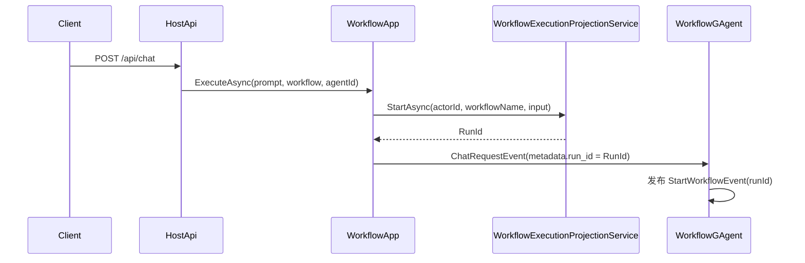
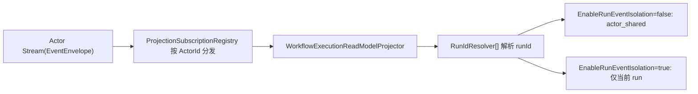

# 标识符关系（EventEnvelope.Id / RunId / SessionId / ActorId）

本文说明当前实现中几个常见标识符的职责边界与流转关系。

## 一句话结论

| 标识符 | 作用域 | 谁生成 | 主要用途 |
|---|---|---|---|
| `EventEnvelope.Id` | 单条事件 | 事件发布方 | 去重、追踪单条消息 |
| `RunId` | 一次 workflow 执行 | `WorkflowExecutionProjectionService` | 关联同一次运行的多条事件与读模型 |
| `SessionId` | 一次 LLM 会话（或步骤会话） | 服务端内部 | 给 AI 消息链路分段，不等于 run |
| `ActorId` | 一个 Actor 实例 | Runtime | 订阅粒度、线程/会话归属（`threadId`） |

## 生成点（代码）

- `RunId`：`src/workflow/Aevatar.Workflow.Projection/Orchestration/WorkflowExecutionProjectionService.cs`
  - `StartAsync(...)` 中调用 `IProjectionRunIdGenerator.NextRunId()`
- `RunId` 注入请求：
  - `src/workflow/Aevatar.Workflow.Application/Runs/WorkflowChatRequestEnvelopeFactory.cs`
  - 写入 `ChatRequestEvent.Metadata["run_id"]`
- `WorkflowGAgent` 取 `RunId`：
  - `src/workflow/Aevatar.Workflow.Core/WorkflowGAgent.cs` 的 `ResolveRunId(...)`
- `SessionId`：
  - 请求入口会生成内部会话：`chat-{guid}`
  - 步骤级会话常用 `runId:stepId`（见 `src/Aevatar.AI.Abstractions/ChatSessionKeys.cs`）

## 流程图（执行链路）

## 流程图（投影识别 run）

## 为什么 `RunId` 不能等于 `EventEnvelope.Id`

- 一次 run 会产生多条 `EventEnvelope`（开始、步骤请求、步骤完成、流式消息、结束）。
- `EventEnvelope.Id` 必须保持“单事件唯一”；如果复用为 run，会丢失事件级去重与追踪能力。
- 因此：`RunId` 是“会话/执行级”，`EventEnvelope.Id` 是“消息级”。

## 客户端契约（当前）

- 客户端只传：`prompt`、`workflow`、`agentId?`。
- `RunId` 与内部 `SessionId` 都由服务端生成和管理。
- 查询读模型用 `runId`（`GET /api/runs/{runId}`）；实时流输出携带 `threadId=ActorId` 与 `runId`。
