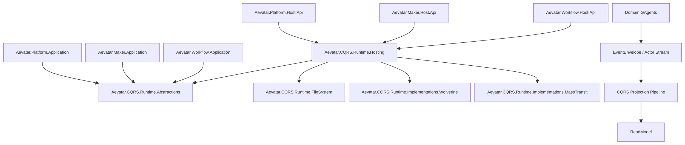

# Aevatar 长期维护架构文档

## 1. 文档目标

本文档定义 Aevatar 的长期维护基线，目标是让架构演进可持续、可审计、可替换。

适用范围：

1. `workflow`、`maker`、`platform` 三个子系统。
2. CQRS Runtime 抽象层与并行实现。
3. Host/API、投影、事件流、测试与发布治理。

## 2. 架构总览

## 3. 分层与依赖规则

1. `Domain` 不依赖 `Application/Infrastructure/Host`。
2. `Application` 仅依赖抽象，禁止依赖 `Implementations.*`。
3. `Infrastructure` 实现抽象，不承载业务用例编排。
4. `Host` 仅做协议适配与组合，统一通过 `Aevatar.CQRS.Runtime.Hosting` 接入运行时。
5. CQRS 与 AGUI 必须走统一投影链路，禁止双轨实现。

## 4. 子系统职责边界

| 子系统 | Host | 主要职责 | 不应承担 |
|---|---|---|---|
| Workflow | `src/workflow/Aevatar.Workflow.Host.Api` | Chat/SSE/WS 与 workflow 查询 | 平台级路由目录与跨子系统命令网关 |
| Maker | `src/maker/Aevatar.Maker.Host.Api` | maker 运行入口与结果回传 | workflow chat 协议与平台命令队列 |
| Platform | `src/Aevatar.Platform.Host.Api` | 子系统路由目录、平台命令受理/状态查询 | workflow 领域编排 |

## 5. CQRS Runtime 维护策略

1. `Aevatar.CQRS.Runtime.Abstractions` 只保留通用契约，不包含业务语义。
2. `Aevatar.CQRS.Runtime.Hosting` 是唯一装配入口，子系统不得自行选择运行时实现。
3. `Wolverine` 与 `MassTransit` 为并行实现，语义必须一致，配置切换不改业务代码。
4. FileSystem 组件是默认本地持久化基线，目录与格式变化必须提供迁移说明。

## 6. API 治理与冲突控制

当前风险：`Workflow` 与 `Platform` 均存在 `/api/commands` 与 `/api/agents`，语义有重叠。

长期治理要求：

1. 明确“按端口隔离”或“按路径前缀隔离”二选一并固化。
2. 若单域名统一入口，必须引入网关路由策略并冻结子系统路径约定。
3. 新增端点前必须在架构审计中登记所有权（Owner Subsystem）。

## 7. 可观测性与运维

1. 统一日志字段：`command_id`、`actor_id`、`correlation_id`、`causation_id`。
2. 指标最小集：命令吞吐、失败率、重试次数、DLQ 数量、投影延迟。
3. 运行时切换压测：同一场景分别验证 Wolverine 与 MassTransit。
4. 重大变更需附运行手册：启动参数、配置样例、回滚步骤。

## 8. 测试与门禁

1. 必跑：`dotnet build aevatar.slnx --nologo`。
2. 必跑：`dotnet test aevatar.slnx --nologo`。
3. 建议新增架构测试：
   - 禁止 `workflow/*` 与 `maker/*` 直接引用 `Aevatar.CQRS.Runtime.Implementations.*`。
   - 禁止 Host 以外层引用具体中间件类型。
   - 禁止新增平行 Host 的重复协议端点。

## 9. 变更治理流程

1. 架构类变更必须先更新 `docs/`（目标图 + 迁移计划 + 回滚策略）。
2. PR 审计必须覆盖分层、依赖反转、并发安全、可恢复性。
3. 删除无效层、重复抽象、空转发代码时，不要求兼容保留。
4. 每月进行一次架构审计并生成结论文档（风险、技术债、整改计划）。

## 10. 未来 90 天优先事项

1. 完成 Workflow/Platform 路由冲突收敛，固化 API 所有权模型。
2. 为两套 Runtime 建立一致性契约测试集。
3. 为关键投影补齐 checkpoint/replay 的端到端恢复演练。
4. 完成架构门禁自动化，纳入 CI。
