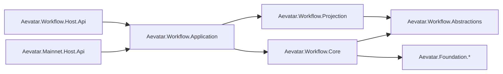

# Merge `origin/dev` 全量重构计划（不考虑兼容性）

## 1. 目标与边界

本计划用于彻底收敛 `merge/dev-integration` 的架构分叉与行为回归，目标是：

1. 恢复可构建、可测试、可发布状态。
2. 统一事件契约与分层边界，消除双轨实现。
3. 修复所有已识别 P1/P2 问题，不保留兼容层与过渡代码。

不做事项：

1. 不保留旧 Host 路径。
2. 不保留 Foundation 中的流程编排语义。
3. 不保留 Core 内平行 proto 消息定义。

## 2. 重构原则

1. 严格分层：`Foundation` 只保留 runtime/event 基础能力；流程编排仅在 `workflow`。
2. 单一真源：workflow 事件消息仅存在于 `Aevatar.Workflow.Abstractions`。
3. 行为正确优先：先修阻断和数据串扰，再做结构整理。
4. 失败即停止：每阶段必须通过构建/测试/门禁后才进入下一阶段。

## 3. 目标架构

## 4. 执行阶段

### Phase 0：冲突收敛与基线恢复

1. 解决全部 merge 冲突文件，禁止保留冲突标记。
2. 收敛 `aevatar.slnx` 为当前目标拓扑：
   - 保留：`Aevatar.Mainnet.Host.Api`、`src/workflow/Aevatar.Workflow.Host.Api`
   - 删除：`Aevatar.Host.Api` 回摆项
3. 验证：`dotnet build aevatar.slnx --nologo`

### Phase 1：行为回归修复（P1）

1. `ToolCallLoop` 改为执行 middleware 更新后的参数，不再执行原始 `call` 参数。
2. `HumanApprovalModule`/`HumanInputModule` pending key 改为组合键：
   - 推荐：`correlationId + stepId`
   - 兜底：`runId + stepId`
3. 新增并发回归测试：
   - 同 `stepId`、不同 run/correlation 并发恢复不串扰。
   - middleware 改写参数后工具执行结果可观察。

### Phase 2：契约与边界收敛（P2）

1. 删除 `src/workflow/Aevatar.Workflow.Core/cognitive_messages.proto`。
2. 统一使用 `src/workflow/Aevatar.Workflow.Abstractions/workflow_execution_messages.proto`。
3. 清理所有 Core 内对“本地平行消息”的依赖与引用。
4. 删除 `src/Aevatar.Foundation.Core/Orchestration/*` 及对应测试与文档引用。

### Phase 3：文档与门禁对齐

1. 更新：
   - `src/workflow/README.md`
   - `src/workflow/Aevatar.Workflow.Core/README.md`
   - `src/workflow/Aevatar.Workflow.Projection/README.md`
   - `docs/CQRS_ARCHITECTURE.md`
   - `docs/FOUNDATION.md`
2. 新增 CI 守卫：
   - 禁止 `Workflow.Core` 出现第二套 workflow proto。
   - 禁止 `Foundation.Core` 新增编排语义目录（`Orchestration`）。

## 5. 关键变更清单（按文件域）

1. `aevatar.slnx`
2. `src/Aevatar.AI.Core/Tools/ToolCallLoop.cs`
3. `src/workflow/Aevatar.Workflow.Core/Modules/HumanApprovalModule.cs`
4. `src/workflow/Aevatar.Workflow.Core/Modules/HumanInputModule.cs`
5. `src/workflow/Aevatar.Workflow.Core/Modules/WorkflowLoopModule.cs`
6. `src/workflow/Aevatar.Workflow.Core/cognitive_messages.proto`（删除）
7. `src/Aevatar.Foundation.Core/Orchestration/*`（删除）

## 6. 验收标准（全部必须满足）

1. `git diff --name-only --diff-filter=U` 输出为空。
2. `dotnet build aevatar.slnx --nologo` 通过。
3. `dotnet test aevatar.slnx --nologo` 通过。
4. `bash tools/ci/architecture_guards.sh` 通过。
5. 无 P1/P2 未关闭项。

## 7. 风险与回滚策略

1. 风险：删除平行 proto 可能引发编译链断裂。
   - 策略：先替换引用再删文件，最后一次性跑全量构建。
2. 风险：pending key 变更引发行为语义变化。
   - 策略：新增并发回归测试先行，再改实现。
3. 风险：slnx 拓扑收敛导致漏项。
   - 策略：以 `dotnet test aevatar.slnx` 作为最终完整性校验。
