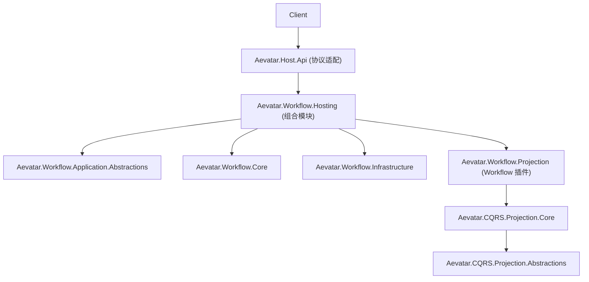

# OCP 架构重构计划（Workflow/CQRS/Host）

## 1. 背景与问题

当前实现“能跑”，但扩展成本高，新增能力经常要改核心层，违反开闭原则（Open/Closed）。

主要症状：

1. 核心模块硬编码注册：`src/workflow/Aevatar.Workflow.Core/ServiceCollectionExtensions.cs`
2. Host 组合根过重：`src/Aevatar.Host.Api/Program.cs` 直接编排 Application/Infrastructure/Projection/AGUIAdapter
3. Workflow Projection 与通用 CQRS 装配边界不清：`src/workflow/Aevatar.Workflow.Projection/DependencyInjection/ServiceCollectionExtensions.cs`
4. 协议层（SSE/WS）与业务语义耦合：`src/Aevatar.Host.Api/Endpoints/*`

## 2. 目标架构（重构后）



原则：

1. `Host` 只做协议与组合，不承载编排逻辑。
2. `Core` 对新增 step/module 关闭修改、开放扩展。
3. `Projection` 通过插件扩展，不直接侵入 Host/Endpoint。

## 3. 分阶段改造

## Phase 1：收敛组合根（先降复杂度）

变更：

1. 新建 `src/workflow/Aevatar.Workflow.Hosting`
2. 提供 `AddWorkflowStack(...)`，封装 Workflow 相关 DI（Application/Core/Infrastructure/Projection/AGUIAdapter）
3. `Aevatar.Host.Api` 仅引用 `Aevatar.Bootstrap` + `Aevatar.Workflow.Hosting`

验收：

1. `src/Aevatar.Host.Api/Program.cs` 只保留少量组装调用
2. `Aevatar.Host.Api.csproj` 去掉对多个 workflow 子项目的直接引用

## Phase 2：Workflow Module 插件化（OCP 核心）

变更：

1. 引入 `IWorkflowModuleContributor`（或等价扩展契约）
2. 默认模块列表移到 `DefaultWorkflowModuleContributor`
3. `AddAevatarWorkflow()` 只消费 contributor 集合

验收：

1. 新增模块通过新增 contributor 完成，不修改 `ServiceCollectionExtensions` 核心逻辑
2. 现有模块行为测试保持通过

## Phase 3：Projection 分层清晰化

变更：

1. `Aevatar.CQRS.Projection.Core` 仅保留通用生命周期/订阅/协调能力
2. `Aevatar.Workflow.Projection` 只保留 Workflow 上下文、reducer/projector、resolver
3. Workflow 扩展通过 `AddWorkflowExecutionProjectionExtensionsFromAssembly(...)` 注入

验收：

1. 新增 projector/reducer 仅新增类 + 注册，不改核心 orchestrator
2. 文档与实现一致（`README` + `docs/WORKFLOW.md`）

## Phase 4：Host 协议适配层瘦身

变更：

1. Endpoint 只做 request/response 映射，不直接处理运行时编排细节
2. SSE/WS 输出统一走 `IAsyncEnumerable<WorkflowOutputFrame>`（或等价抽象）

验收：

1. `ChatEndpoints` 只剩协议职责
2. 编排逻辑下沉到 Application/Hosting

## Phase 5：架构门禁与回归保障

变更：

1. 增加架构测试：禁止 `Host -> Workflow.*` 多项目直连、禁止跨层反向依赖
2. 补齐关键扩展回归测试（module 扩展、projection 扩展、host 协议适配）

验收命令：

```bash
dotnet build aevatar.slnx --nologo
dotnet test aevatar.slnx --nologo
```

## 4. 交付顺序建议

1. 先做 Phase 1（影响最小、收益最大）
2. 再做 Phase 2（OCP 主战场）
3. 然后 Phase 3/4（消除职责揉杂）
4. 最后 Phase 5（固化门禁）

## 5. 完成定义（DoD）

1. 新增 Workflow 模块不改核心注册代码。
2. 新增 Projection 扩展不改 Host Endpoint。
3. Host 仅承担协议与组合职责。
4. 文档、代码、测试三者一致。

