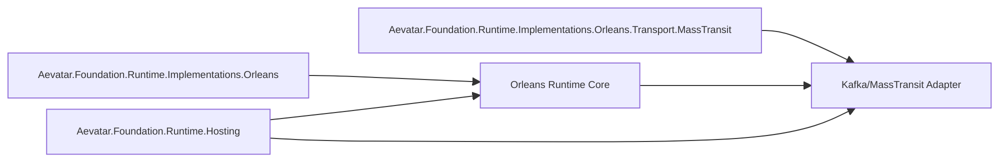

# Orleans Runtime Merge 后重构计划（2026-02-22）

## 1. 背景

本次合并提交 `40c5315` 引入了 `origin/feature/orleans-runtime` 的一组旧实现文件。  
当前主干已演进到 `Aevatar.Foundation.*` 分层与命名体系，合并后出现了“并行双实现 + 旧命名空间 + 旧构建入口”的混入问题。

目标：在**以本地主干架构为准**的前提下，完成“去重、去旧壳、提炼可复用能力并按新架构落位”。

## 2. 本次合并文件审计结论

### 2.1 新增文件总体

提交 `40c5315` 新增 25 个文件，主要分布（重构前）：

1. `src/Aevatar.Runtime.Orleans/**`（19 个）
2. `src/Aevatar.Silo/**`（2 个）
3. `aevatar.sln`（1 个）
4. `docker-compose.yml`（1 个）
5. `docs/ADR_IACTOR_AGENT_REFACTORING.md`、`docs/ORLEANS_RUNTIME_ANALYSIS.md`（2 个）

### 2.2 重复实现（需要清理）

以下为“旧目录实现”与“现有主干实现”的重复关系：

1. `src/Aevatar.Runtime.Orleans/Actors/OrleansActorRuntime.cs`  
对应主干：`src/Aevatar.Foundation.Runtime.Implementations.Orleans/Actors/OrleansActorRuntime.cs`
2. `src/Aevatar.Runtime.Orleans/Actors/OrleansClientActor.cs`  
对应主干：`src/Aevatar.Foundation.Runtime.Implementations.Orleans/Actors/OrleansActor.cs`
3. `src/Aevatar.Runtime.Orleans/Actors/GrainEventPublisher.cs`  
对应主干：`src/Aevatar.Foundation.Runtime.Implementations.Orleans/Actors/OrleansGrainEventPublisher.cs`
4. `src/Aevatar.Runtime.Orleans/Grains/IGAgentGrain.cs`  
对应主干：`src/Aevatar.Foundation.Runtime.Implementations.Orleans/Grains/IRuntimeActorGrain.cs`
5. `src/Aevatar.Runtime.Orleans/Grains/GAgentGrain.cs`  
对应主干：`src/Aevatar.Foundation.Runtime.Implementations.Orleans/Grains/RuntimeActorGrain.cs`
6. `src/Aevatar.Runtime.Orleans/Grains/OrleansAgentState.cs`  
对应主干：`src/Aevatar.Foundation.Runtime.Implementations.Orleans/Grains/RuntimeActorGrainState.cs`
7. `src/Aevatar.Runtime.Orleans/DependencyInjection/*`  
对应主干：`src/Aevatar.Foundation.Runtime.Implementations.Orleans/DependencyInjection/ServiceCollectionExtensions.cs`

### 2.3 不符合仓库规范/架构要求（需要整改）

1. 命名与目录不一致：`Aevatar.Runtime.Orleans` 不符合当前 `Aevatar.Foundation.Runtime.Implementations.Orleans` 体系。
2. 旧项目依赖失效：`src/Aevatar.Runtime.Orleans/Aevatar.Runtime.Orleans.csproj` 仍引用不存在的旧项目路径（`src/Aevatar.Core`、`src/Aevatar.Runtime`）。
3. 双主干并行风险：同一职责（Orleans runtime）出现两套实现，违反“单一主干，删除重复层”。
4. 旧 solution 混入：`aevatar.sln` 指向大量已不存在路径，不应作为当前构建入口（当前权威入口为 `aevatar.slnx`）。
5. 文档语义冲突：新增 ADR/分析文档基于旧架构语境，部分结论与当前接口事实不一致，易误导后续开发。

## 3. 可复用能力识别（保留价值）

尽管文件主体重复，以下能力有迁移价值：

1. Kafka 事件发送抽象：`IAgentEventSender`、`KafkaAgentEventSender`
2. MassTransit + Kafka Rider 装配：`MassTransitKafkaExtensions`
3. 事件消费者桥接思路：`AgentEventConsumer` + `MassTransitEventHandler`
4. 独立 Silo 启动样例：`src/Aevatar.Silo/Program.cs`（作为示例可参考）

结论：**能力可迁移，代码不应原样并行保留**。

## 4. 重构目标架构

说明：  
只保留一套 Orleans Runtime Core；Kafka/MassTransit 作为可选 Transport 插件，不再保留 `src/Aevatar.Runtime.Orleans` 并行体系。

## 5. 分阶段重构计划

## Phase 0：冻结与基线（0.5 天）

1. 建立“merge 引入清单”与“迁移映射清单”。
2. 固化当前基线验证结果（`build/test/guards`）作为回归门槛。

## Phase 1：删除重复壳层（1 天）

1. 删除 `src/Aevatar.Runtime.Orleans/**`（整目录）。
2. 删除 `src/Aevatar.Silo/**`（后续如需示例，迁入 `demos/` 并按新命名重建）。
3. 删除 `aevatar.sln`（保留 `aevatar.slnx` 为唯一主入口）。
4. 对 `docs/ADR_IACTOR_AGENT_REFACTORING.md`、`docs/ORLEANS_RUNTIME_ANALYSIS.md` 做二选一：
   - 可迁移内容抽取到新文档；
   - 其余删除或标注 `Deprecated`。

## Phase 2：能力迁移到新分层（2 天）

1. 新增 transport 插件项目（建议）：
   - `src/Aevatar.Foundation.Runtime.Implementations.Orleans.Transport.MassTransit`
2. 迁移并重命名可复用组件：
   - `IAgentEventSender` / `KafkaAgentEventSender`
   - `MassTransitKafkaExtensions`
   - `AgentEventConsumer` / `MassTransitEventHandler`
3. 适配当前契约与元数据：
   - 统一使用 `EventEnvelope` + `PublisherChainMetadata` + `StreamForwardingRules`
   - 不引入第二套 loop/route 语义
4. Hosting 注入扩展：
   - 在 `AevatarActorRuntimeOptions` 增加可选 transport 配置（不改变默认 InMemory/Orleans 行为）。

## Phase 3：文档与示例重建（1 天）

1. 在 `docs/` 增加新架构版 “Orleans + Kafka Transport 集成说明”。
2. 如需独立 Silo 示例，放入 `demos/`，命名按新规范。
3. 更新 `README` 与 `aevatar.hosting.slnf` 相关说明，明确默认链路和可选插件链路。

## Phase 4：回归与门禁（0.5 天）

1. `dotnet build aevatar.slnx --nologo --no-restore -m:1 -nodeReuse:false --tl:off`
2. `dotnet test aevatar.slnx --nologo --no-build --no-restore -m:1 -nodeReuse:false --tl:off`
3. `bash tools/ci/architecture_guards.sh`
4. `bash tools/ci/projection_route_mapping_guard.sh`
5. 新增 transport 相关单元/集成测试（至少覆盖发布、消费、环路保护、重试基础路径）。

## 6. 变更清单（计划态）

### 6.1 计划删除

1. `aevatar.sln`
2. `src/Aevatar.Runtime.Orleans/**`
3. `src/Aevatar.Silo/**`

### 6.2 计划新增

1. `src/Aevatar.Foundation.Runtime.Implementations.Orleans.Transport.MassTransit/**`
2. `test/Aevatar.Foundation.Runtime.Hosting.Tests/*MassTransit*Tests.cs`
3. `docs/ORLEANS_KAFKA_TRANSPORT_GUIDE.md`（名称可调整）

### 6.3 计划更新

1. `src/Aevatar.Foundation.Runtime.Hosting/AevatarActorRuntimeOptions.cs`
2. `src/Aevatar.Foundation.Runtime.Hosting/DependencyInjection/ServiceCollectionExtensions.cs`
3. `README.md` 与相关 subsystem 文档

## 7. 风险与控制

1. 风险：迁移期出现两套 transport 入口并存。  
控制：Phase 1 先删旧壳层，Phase 2 再引入新插件，避免并行时间窗。
2. 风险：消息语义不一致（重复投递/环路）。  
控制：统一复用现有 `PublisherChainMetadata` 与 forwarding 规则，不再复制实现。
3. 风险：新增 transport 影响默认本地开发体验。  
控制：保持默认 InMemory；MassTransit/Kafka 为显式配置启用。

## 8. 完成标准

1. 仓库内不再存在 `src/Aevatar.Runtime.Orleans` 与 `src/Aevatar.Silo` 旧路径。
2. Orleans 运行时核心仅保留 `Aevatar.Foundation.Runtime.Implementations.Orleans` 一套实现。
3. Kafka/MassTransit 能力以插件方式接入，不破坏当前默认链路。
4. 构建、测试、架构门禁全部通过。

## 9. 当前执行状态（2026-02-22，完成态）

1. Phase 1 已完成：
   - 已删除 `aevatar.sln`。
   - 已删除 `src/Aevatar.Runtime.Orleans/**`。
   - 已删除 `src/Aevatar.Silo/**`。
2. Phase 2 已完成：
   - 已在 `Aevatar.Foundation.Runtime.Implementations.Orleans/Transport/MassTransit` 增加 Kafka/MassTransit 适配层。
   - 已完成 Hosting 侧 `ActorRuntime:Transport=Kafka` 配置入口与校验。
   - 已将 `IOrleansTransportEventSender` 接入 `OrleansActor` / `OrleansAgentProxy` / `OrleansGrainEventPublisher`，形成“未配置时直连 grain、配置后走 queue transport”单一分发策略。
3. Phase 3 已完成：
   - 已新增 `docs/ORLEANS_KAFKA_TRANSPORT_GUIDE.md`。
   - 已更新 `README.md`，明确 Orleans 默认链路与可选 Kafka transport 插件链路。
   - 已删除合并带入且已过时的旧架构文档（`docs/ADR_IACTOR_AGENT_REFACTORING.md`、`docs/ORLEANS_RUNTIME_ANALYSIS.md`）。
4. Phase 4 已完成：
   - `dotnet build aevatar.slnx --nologo --no-restore -m:1 -nodeReuse:false --tl:off` 通过。
   - `dotnet test aevatar.slnx --nologo --no-build --no-restore -m:1 -nodeReuse:false --tl:off` 通过。
   - `bash tools/ci/architecture_guards.sh` 通过。
   - `bash tools/ci/projection_route_mapping_guard.sh` 通过。
