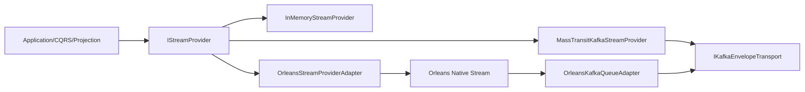
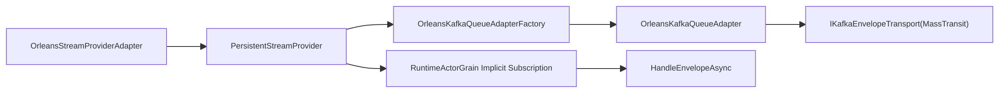
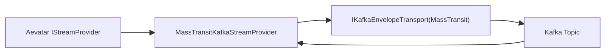

# Aevatar Stream 解耦重构蓝图（Orleans + MassTransit Kafka）（2026-02-22）

## 1. 背景与本次结论

你提出的核心诉求是：

1. 用户可独立使用 `MassTransit Kafka`，不必绑定 Orleans。
2. 用户也可在 Orleans 模式下使用 Native Stream 能力（订阅、事件触发激活）。
3. 二者解耦，但尽量复用 Kafka 传输实现，避免重复建设。

本次最终架构结论：

1. `IStream/IStreamProvider` 继续作为 Aevatar 上层唯一流端口。
2. 采用**并列适配**，不采用链式嵌套（不做 `AevatarStream(MT) -> OrleansNativeStream -> AevatarStream(Orleans)`）。
3. 引入共享底层传输端口 `IKafkaEnvelopeTransport`：
- `MassTransitKafkaStreamProvider` 直接使用它（可独立运行）。
- `OrleansKafkaQueueAdapter` 也使用它（作为 Orleans Persistent Stream 的队列后端）。
4. Orleans 模式主干仍是 Orleans Native Stream；MassTransit Kafka 是其队列适配层，不是绕过 Orleans 的旁路总线。

---

## 2. 为什么不采用链式 A->B->A

链式设计（AevatarStream 实现 -> OrleansStream -> 再实现 AevatarStream）存在结构性问题：

1. 抽象层级回环：同一层接口被上下游反复包裹，语义边界不清。
2. 双重分发和双重序列化风险：性能和故障面明显上升。
3. Orleans stream 的核心语义（ack、pulling agent、activation）容易被中间层“吞语义”。
4. 调试困难：链路追踪跨多层 adapter，定位延迟和重复消息更难。

因此采用并列适配 + 共享底层传输端口，既解耦又可复用。

---

## 3. 目标架构

### 3.1 总体结构（并列适配）



### 3.2 Orleans 模式内部链路



### 3.3 Standalone MT Kafka 模式



---

## 4. 分层与职责

## 4.1 Domain 层

保持不变：

1. `EventEnvelope`、`EventDirection`、`PublisherChainMetadata` 语义不变。
2. 不引入 Orleans/MassTransit/Kafka 具体类型。

## 4.2 Application 层

保持不变：

1. 继续仅依赖 `IStreamProvider`。
2. CQRS/Projection/AGUI 不感知流后端类型。

## 4.3 Infrastructure 层（重构重点）

新增并维护三类实现：

1. `InMemoryStreamProvider`（开发测试）。
2. `MassTransitKafkaStreamProvider`（Standalone Kafka 模式）。
3. `OrleansStreamProviderAdapter`（Orleans 模式，内部接 Orleans Native Stream）。

共享底层组件：

1. `IKafkaEnvelopeTransport`（统一 Kafka 传输端口）。
2. `MassTransitKafkaEnvelopeTransport`（使用 MassTransit Kafka Rider 实现）。

Orleans 专属组件：

1. `OrleansKafkaQueueAdapterFactory`。
2. `OrleansKafkaQueueAdapter`。
3. `OrleansKafkaQueueAdapterReceiver`。

## 4.4 Host 层

仅负责组合与配置，不承载业务编排：

1. `Provider=InMemory`。
2. `Provider=MassTransitKafka`（无 Orleans 依赖）。
3. `Provider=Orleans` + `OrleansStreamBackend=KafkaAdapter`。

---

## 5. 关键接口设计

## 5.1 现有保持

1. `IStream`。
2. `IStreamProvider`。
3. `IStreamForwardingRegistry`。

## 5.2 新增共享接口

```csharp
public interface IKafkaEnvelopeTransport
{
    Task PublishAsync(string topic, string key, byte[] payload, CancellationToken ct = default);
    Task<IReadOnlyList<KafkaEnvelopeRecord>> PullAsync(string consumerGroup, int maxCount, CancellationToken ct = default);
    Task AckAsync(IReadOnlyList<KafkaEnvelopeRecord> records, CancellationToken ct = default);
}

public sealed class KafkaEnvelopeRecord
{
    public string Topic { get; set; } = string.Empty;
    public string Key { get; set; } = string.Empty;
    public byte[] Payload { get; set; } = [];
    public string OffsetToken { get; set; } = string.Empty;
}
```

设计意图：

1. 把 MassTransit 依赖锁在基础设施层最底部。
2. 让 Orleans QueueAdapter 与 Standalone Provider 共用同一传输实现。

## 5.3 Orleans stream 映射规则

1. Actor stream namespace：`aevatar.actor.events`。
2. stream key：`actorId`（`StringComparer.Ordinal`）。
3. session/projection stream key：`{channel}:{scopeId}:{sessionId}`。

---

## 6. 事件语义与激活语义

## 6.1 Orleans 模式（必须达成）

1. 发布：通过 `OrleansStreamProviderAdapter` 写入 Orleans stream。
2. 订阅：`RuntimeActorGrain` 使用 implicit subscription。
3. 激活：消息到达目标 stream 时，Orleans 自动激活对应 grain。
4. 消费：统一进入 `HandleEnvelopeAsync`，执行去重、环路保护、业务处理。

## 6.2 Standalone MT Kafka 模式

1. 发布/订阅全部由 `MassTransitKafkaStreamProvider` 实现。
2. 不依赖 Orleans 类型和运行时。
3. 用于不引入 Orleans 的简化部署场景。

---

## 7. 与当前代码的关键调整

## 7.1 必改（现有文件）

1. `src/Aevatar.Foundation.Runtime.Hosting/AevatarActorRuntimeOptions.cs`
- 增加 `ProviderMassTransitKafka`、Orleans stream backend 配置项。

2. `src/Aevatar.Foundation.Runtime.Hosting/DependencyInjection/ServiceCollectionExtensions.cs`
- 基于 provider 选择 `InMemory / MassTransitKafka / Orleans`。

3. `src/Aevatar.Foundation.Runtime.Implementations.Orleans/DependencyInjection/ServiceCollectionExtensions.cs`
- 注册 `OrleansStreamProviderAdapter`。
- 注册 `OrleansKafkaQueueAdapterFactory`。
- 移除 Orleans 主路径对 `InMemoryStreamForwardingRegistry` 的默认事实源依赖。

4. `src/Aevatar.Foundation.Runtime.Implementations.Orleans/Actors/OrleansGrainEventPublisher.cs`
- 删除主路径 direct grain dispatch。
- 改为统一走 `IStreamProvider`。

5. `src/Aevatar.Foundation.Runtime.Implementations.Orleans/Actors/OrleansActorRuntime.cs`
- `Link/Unlink/Destroy` 操作改为调用分布式拓扑注册表。

6. `src/Aevatar.Foundation.Runtime.Implementations.Orleans/Grains/RuntimeActorGrain.cs`
- 引入 implicit stream subscription 消费路径。
- 绑定 `PurgeAsync` 生命周期清理。

## 7.2 新增（建议文件）

1. `src/Aevatar.Foundation.Runtime.Implementations.Orleans/Streaming/OrleansStreamProviderAdapter.cs`
2. `src/Aevatar.Foundation.Runtime.Implementations.Orleans/Streaming/OrleansActorStream.cs`
3. `src/Aevatar.Foundation.Runtime.Implementations.Orleans/Streaming/KafkaAdapter/OrleansKafkaQueueAdapterFactory.cs`
4. `src/Aevatar.Foundation.Runtime.Implementations.Orleans/Streaming/KafkaAdapter/OrleansKafkaQueueAdapter.cs`
5. `src/Aevatar.Foundation.Runtime.Implementations.Orleans/Streaming/KafkaAdapter/OrleansKafkaQueueAdapterReceiver.cs`
6. `src/Aevatar.Foundation.Runtime.Implementations.Orleans/Transport/Kafka/IKafkaEnvelopeTransport.cs`
7. `src/Aevatar.Foundation.Runtime.Implementations.Orleans/Transport/Kafka/MassTransitKafkaEnvelopeTransport.cs`
8. `src/Aevatar.Foundation.Runtime.Implementations.Orleans/Streaming/Topology/OrleansDistributedStreamForwardingRegistry.cs`

---

## 8. 配置模型（建议）

```csharp
public sealed class AevatarActorRuntimeOptions
{
    public const string ProviderInMemory = "InMemory";
    public const string ProviderMassTransitKafka = "MassTransitKafka";
    public const string ProviderOrleans = "Orleans";

    // Orleans 下的 stream backend
    public const string OrleansStreamBackendInMemory = "InMemory";
    public const string OrleansStreamBackendKafkaAdapter = "KafkaAdapter";

    public string Provider { get; set; } = ProviderInMemory;
    public string OrleansStreamBackend { get; set; } = OrleansStreamBackendInMemory;

    public string KafkaBootstrapServers { get; set; } = "localhost:9092";
    public string KafkaTopicName { get; set; } = "aevatar-events";
    public string KafkaConsumerGroup { get; set; } = "aevatar-runtime";

    public string OrleansStreamProviderName { get; set; } = "AevatarKafkaStreamProvider";
    public string OrleansActorEventNamespace { get; set; } = "aevatar.actor.events";
}
```

配置示例 A（Standalone）：

```yaml
ActorRuntime:
  Provider: MassTransitKafka
  KafkaBootstrapServers: localhost:9092
  KafkaTopicName: aevatar-events
  KafkaConsumerGroup: aevatar-runtime
```

配置示例 B（Orleans）：

```yaml
ActorRuntime:
  Provider: Orleans
  OrleansStreamBackend: KafkaAdapter
  OrleansStreamProviderName: AevatarKafkaStreamProvider
  OrleansActorEventNamespace: aevatar.actor.events
  KafkaBootstrapServers: localhost:9092
  KafkaTopicName: aevatar-events
  KafkaConsumerGroup: aevatar-orleans-stream
```

---

## 9. 分阶段落地计划

## Phase 0（稳定性止血）

1. 修复 `Destroy` 生命周期：新增 `PurgeAsync`，防止销毁后复活。
2. Orleans 非开发环境禁用进程内拓扑事实源。

退出标准：

1. destroy 后不可复活测试通过。
2. Orleans 多节点不再依赖进程内拓扑字典。

## Phase 1（抽取共享 Kafka 传输层）

1. 从现有 MassTransit Kafka sender 提炼 `IKafkaEnvelopeTransport`。
2. 实现 `MassTransitKafkaEnvelopeTransport`。
3. 为传输层补齐单测。

退出标准：

1. 传输层可被独立注入。
2. 不依赖 Orleans 也可发布/拉取。

## Phase 2（Standalone MT Kafka Provider）

1. 新增 `MassTransitKafkaStreamProvider` 实现 `IStreamProvider`。
2. 实现 standalone 模式 DI 装配。

退出标准：

1. `Provider=MassTransitKafka` 可独立运行。
2. Projection 核心用例可通过该 provider 运行。

## Phase 3（Orleans Native Stream + KafkaAdapter）

1. 实现 `OrleansStreamProviderAdapter`。
2. 实现 Orleans `PersistentStreamProvider + OrleansKafkaQueueAdapterFactory`。
3. `RuntimeActorGrain` 接入 implicit subscription。

退出标准：

1. Orleans 模式下发布订阅走 native stream。
2. 事件可触发 grain 激活。

## Phase 4（主路径收敛）

1. `OrleansGrainEventPublisher` 主路径改为 `IStreamProvider`。
2. 去除 direct grain dispatch 主分支。
3. 更新文档与门禁。

退出标准：

1. 代码中无 Orleans 主路径旁路分发。
2. 全量门禁通过。

---

## 10. 测试矩阵

## 10.1 单元测试

1. `MassTransitKafkaEnvelopeTransport` publish/pull/ack。
2. `MassTransitKafkaStreamProvider` subscribe/filter/dispose。
3. `OrleansStreamProviderAdapter` stream 映射与序列化。
4. `PurgeAsync` 语义。

## 10.2 集成测试

1. Standalone MT 模式：A->B 发布订阅回环。
2. Orleans 单 Silo：发布到 stream，grain 正常消费。
3. Orleans 双 Silo：消息触发远端 grain 激活。
4. Orleans 双 Silo：parent-child 拓扑转发一致性。
5. 重复消息：`envelope.Id` 去重验证。

## 10.3 回归范围

1. `test/Aevatar.Foundation.Runtime.Hosting.Tests/*Orleans*`
2. `test/Aevatar.CQRS.Projection.Core.Tests/*`
3. `test/Aevatar.Workflow.Host.Api.Tests/*Projection*`

## 10.4 验收命令

1. `dotnet build aevatar.slnx --nologo`
2. `dotnet test aevatar.slnx --nologo`
3. `bash tools/ci/architecture_guards.sh`
4. `bash tools/ci/projection_route_mapping_guard.sh`
5. `bash tools/ci/solution_split_guards.sh`
6. `bash tools/ci/solution_split_test_guards.sh`

---

## 11. CI 架构守卫新增项

1. `Provider=Orleans` 且非 Dev/Test 时，禁止 `IStreamForwardingRegistry` 绑定 `InMemoryStreamForwardingRegistry`。
2. 禁止 Orleans 发布器主路径直接 `GetGrain(...).HandleEnvelopeAsync(...)`。
3. 要求 `DestroyAsync` 必须调用 `PurgeAsync/DeleteAsync`。
4. 当 `Provider=MassTransitKafka` 时，禁止注册 Orleans 依赖。
5. 当 `Provider=Orleans` 时，要求显式配置 `OrleansStreamBackend`。

---

## 12. 风险与回滚

1. 风险：Kafka 至少一次语义带来重复处理。
- 应对：`IEventDeduplicator` + 可配置去重窗口。

2. 风险：Receiver 缓存与 Orleans pulling 速率不匹配。
- 应对：有界缓存、回压、消费滞后指标告警。

3. 风险：迁移期双路径行为偏差。
- 应对：灰度开关 + shadow 对比，阶段完成后删除旧路径。

回滚：

1. Orleans 模式可临时回退 `OrleansStreamBackend=InMemory`。
2. 全局可回退 `Provider=InMemory` 应急（仅短期）。

---

## 13. 结论

最终架构建议是：

1. `Aevatar Stream` 上层统一端口不变。
2. `MassTransitKafka` 与 `OrleansNativeStream` 做**并列实现**。
3. 通过 `IKafkaEnvelopeTransport` 复用 Kafka 传输能力。
4. Orleans 模式里仍使用 Native Stream 语义与激活机制。

这样可以同时满足：

1. MassTransit Kafka 与 Orleans 的解耦独立使用。
2. Orleans stream 的订阅与激活能力落地。
3. 单一主干、依赖反转、可演进架构目标。

---

## 14. 参考依据（官方）

1. Orleans Streams 编程模型：
   https://learn.microsoft.com/en-us/dotnet/orleans/streaming/streams-programming-apis
2. Orleans Persistent Streams 实现：
   https://learn.microsoft.com/en-us/dotnet/orleans/implementation/streams-implementation/
3. MassTransit Kafka Rider：
   https://masstransit.io/documentation/configuration/transports/kafka
