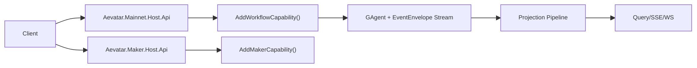

# Mainnet 能力轻量化重构计划

## 1. 目标

1. `Workflow` 不再作为独立系统，改为 Mainnet 默认内置能力。
2. Mainnet 通过“项目引用 + `AddWorkflowCapability()`”完成 Workflow 装配。
3. `Maker` 作为独立系统，通过“项目引用 + `AddMakerCapability()`”装配。
4. 删除 `Aevatar.Platform.*` 全部代码与路由语义。
5. 保持现有 Actor + EventEnvelope + Projection 主链路不变。

## 2. 明确不做

1. 不自研服务发现。
2. 不自研服务注册中心。
3. 不在本项目实现通用微服务集成层。
4. 不在本项目实现通用网关编排能力。
5. 不新增与上述目标相关的基础设施抽象。

## 3. 目标结构



## 4. 能力装配机制（最小实现）

### 4.1 约定

1. 每个能力提供一个 `IServiceCollection` 扩展方法。
2. Host 只做两件事：添加项目引用、调用 `Add...Capability()`。
3. 能力 API 契约（请求/响应模型 + endpoint 定义）归属能力实现层。
4. Host 通过 `Map...CapabilityEndpoints()` 挂载能力 API，不复制 endpoint 代码。
5. 能力内部自己注册 Handler、Projector、Endpoints。
6. 能力升级通过 NuGet/ProjectReference 版本管理，不引入运行时动态发现。

### 4.2 Mainnet 装配示例

```csharp
builder.Host.UseAevatarCqrsRuntime(builder.Configuration);
builder.Services.AddAevatarCqrsRuntime(builder.Configuration);

builder.Services.AddMainnetCore(builder.Configuration);
builder.Services.AddWorkflowCapability(builder.Configuration);
```

### 4.3 Maker 系统装配示例

```csharp
builder.Host.UseAevatarCqrsRuntime(builder.Configuration);
builder.Services.AddAevatarCqrsRuntime(builder.Configuration);

builder.Services.AddMakerCapability(builder.Configuration);
```

## 5. 重构范围（增改删并行）

### 5.1 新增

1. `src/Aevatar.Mainnet.Host.Api`（主入口）。
2. `src/Aevatar.Mainnet.Application`（主网应用层）。
3. Workflow 能力注册扩展（如 `AddWorkflowCapability`）。
4. Maker 能力注册扩展（如 `AddMakerCapability`）。

### 5.2 改造

1. `Workflow` 相关入口迁移到 Mainnet Host。
2. `Program.cs` 统一为“引用 + Add”装配模式。
3. API 路径语义收敛：主网只保留主网入口，Maker 只保留 Maker 入口。

### 5.3 删除

1. 删除 `src/Aevatar.Platform.Abstractions`。
2. 删除 `src/Aevatar.Platform.Application`。
3. 删除 `src/Aevatar.Platform.Infrastructure`。
4. 删除 `src/Aevatar.Platform.Host.Api`。
5. 删除 `/api/routes/{subsystem}/*` 语义与相关契约。
6. 删除 Workflow 里承载 Platform 命令入口的重复路径。

## 6. 分阶段执行

### Phase 1：Mainnet 内置 Workflow

1. Add：Mainnet 引用 Workflow 并提供 `AddWorkflowCapability()`。
2. Change：Mainnet Host 接管 Workflow 主入口。
3. Delete：删除 Workflow 中重复平台入口。

### Phase 2：Maker 独立系统

1. Add：Maker Host 引用 Maker 并提供 `AddMakerCapability()`。
2. Change：Maker API 保持独立部署和独立生命周期。
3. Delete：删除 Maker 与 Platform 的中间转发语义。

### Phase 3：删除 Platform

1. Add：补齐迁移后的主网/ maker 路径回归测试。
2. Change：所有入口切到 Mainnet 或 Maker Host。
3. Delete：完整删除 `Aevatar.Platform.*`。

### Phase 4：收敛与门禁

1. Add：新增“能力装配约束”文档与样例。
2. Change：统一文档术语为“Capability”。
3. Delete：删除无效兼容壳层与废弃文档段落。

## 7. 测试与验收

### 7.1 最小测试集

1. Mainnet 启动后 Workflow 能力可用。
2. Maker 启动后 Maker 能力可用。
3. Command -> Event -> Projection -> Query 主链路可用。
4. 删除 Platform 后无编译引用残留。

### 7.2 CI 门禁

1. 禁止新增 `Aevatar.Platform.*` 引用。
2. 禁止 Host 层出现业务编排代码。
3. 禁止破坏 CQRS 统一接入方式。
4. 新能力接入必须体现“引用 + Add”路径。

## 8. 完成定义（DoD）

1. Mainnet 默认内置 Workflow，且通过 `AddWorkflowCapability()` 装配。
2. Maker 独立系统通过 `AddMakerCapability()` 装配。
3. `Aevatar.Platform.*` 全量删除。
4. 文档不再包含自研服务发现/注册中心/通用微服务集成层要求。
5. 新能力可按同样模式接入，不改主链路核心。
