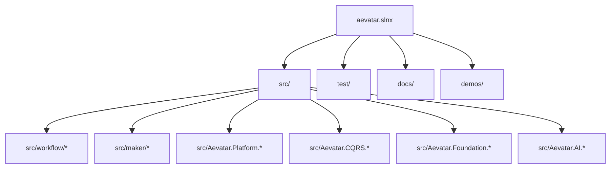
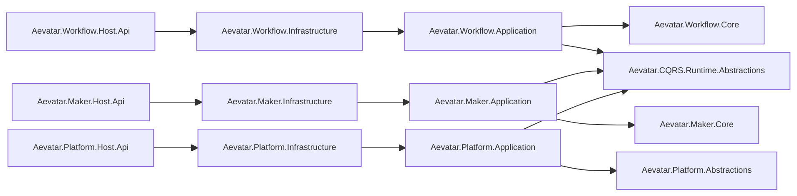
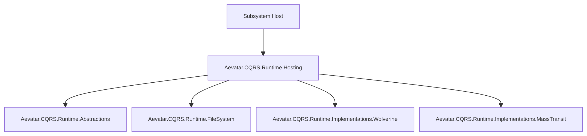
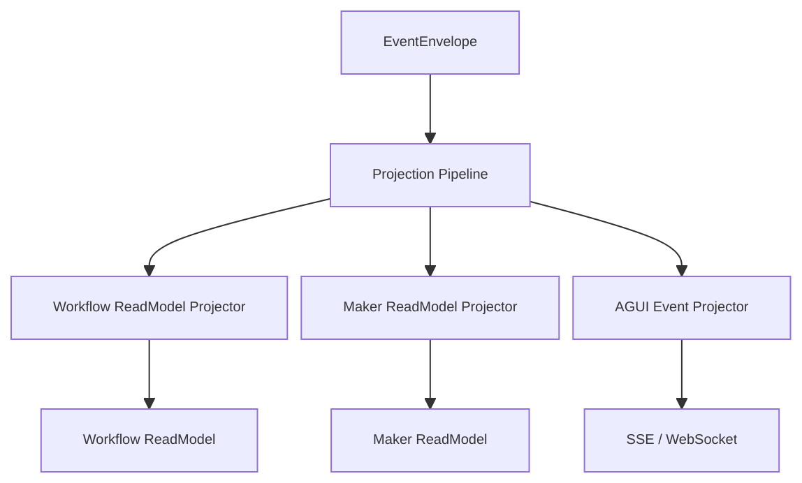

# Aevatar 完整项目架构文档

## 1. 目标与范围

本文档定义 Aevatar 当前可执行架构基线，覆盖：

1. 分层结构（Domain / Application / Infrastructure / Host）。
2. 子系统边界（Workflow / Maker / Platform）。
3. CQRS Runtime 抽象与并行实现（Wolverine / MassTransit）。
4. 统一投影链路（CQRS + AGUI）。
5. API 所有权、依赖约束、CI 门禁与长期演进规则。

## 2. 解决方案结构

## 3. 子系统与宿主

当前宿主职责：

1. `Aevatar.Workflow.Host.Api`：workflow chat/sse/ws 与 workflow 查询。
2. `Aevatar.Maker.Host.Api`：maker 执行入口。
3. `Aevatar.Platform.Host.Api`：平台命令受理、状态查询与路由目录。

## 4. CQRS Runtime 统一接入

统一规则：

1. Host 只能通过 `UseAevatarCqrsRuntime(...)` + `AddAevatarCqrsRuntime(...)` 接入。
2. 子系统不得直接引用 `Runtime.Implementations.*`。
3. 运行时切换仅通过 `Cqrs:Runtime = Wolverine|MassTransit`。

## 5. 命令与查询主链路

```mermaid
%%{init: {"maxTextSize": 100000, "flowchart": {"useMaxWidth": false, "nodeSpacing": 10, "rankSpacing": 50}, "themeVariables": {"fontSize": "10px"}}}%%
flowchart LR
    C["Command API"] --> APP["Application Service"] --> BUS["ICommandBus"] --> EXEC["IQueuedCommandExecutor"] --> ACT["Actor / GAgent"]
    ACT --> EVT["EventEnvelope Stream"] --> PROJ["Projection Pipeline"] --> RM["ReadModel Store"] --> Q["Query API"]
```

关键约束：

1. `Command -> Event`，`Query -> ReadModel`。
2. 不在会话内拼装投影流程。
3. AGUI 输出是 Projection 分支，不是平行业务链路。

## 6. 投影与展示

## 7. API 所有权（当前）

| 路径 | 所有者 | 说明 |
|---|---|---|
| `/api/chat`, `/api/ws/chat` | Workflow Host | Workflow 聊天协议 |
| `/api/workflows`, `/api/actors/*` | Workflow Host | Workflow 查询 |
| `/api/maker/runs` | Maker Host | Maker 执行 |
| `/api/commands`, `/api/commands/{id}` | Platform Host | 平台命令受理与状态查询 |
| `/api/routes/{subsystem}/*` | Platform Host | 子系统路由目录 |

注：`/api/agents` 在 Workflow/Platform 存在语义重叠，需按部署路由或前缀治理收敛。

## 8. 依赖与命名规范

1. 项目名、命名空间、目录语义一致。
2. 多实现抽象下，实现侧命名空间使用复数语义容器（如 `Implementations`、`Providers`）。
3. 缩写全大写：`LLM`、`CQRS`、`AGUI`。
4. 删除无效层、重复抽象与空转发代码，不保留兼容壳层。

## 9. CI 架构门禁

CI（`.github/workflows/ci.yml`）当前执行：

1. `build + test`。
2. 禁止 `GetAwaiter().GetResult()`。
3. 禁止 `TypeUrl.Contains(...)` 字符串路由。
4. 禁止 `Workflow.Core -> AI.Core` 依赖。
5. 禁止旧宿主回流（`Aevatar.Host.Api`、`Aevatar.Host.Gateway`）。
6. 强制三子系统 Host 使用统一 CQRS Runtime 接入扩展。
7. 禁止 Host/Infrastructure 直接 `AddCqrsCore(...)`。
8. 仅允许 `Aevatar.CQRS.Runtime.Hosting` 直接引用 `Runtime.Implementations.*`。

## 10. 长期演进路线

1. 收敛 Workflow 与 Platform 的重复 API 语义（优先路径前缀策略）。
2. 建立 Wolverine/MassTransit 一致性契约测试。
3. 强化 ReadModel checkpoint/replay 的恢复演练。
4. 每次架构变更必须同步更新 `docs/` 与 CI 门禁规则。
