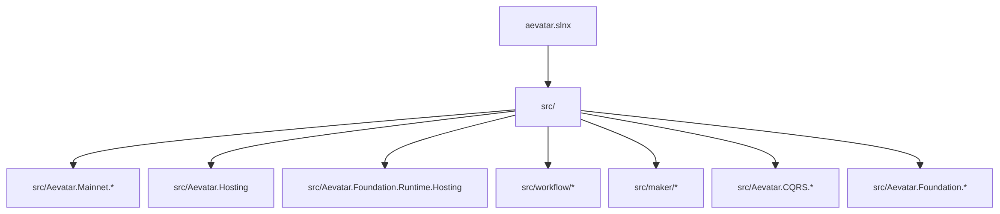
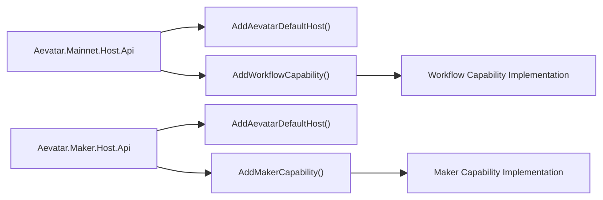
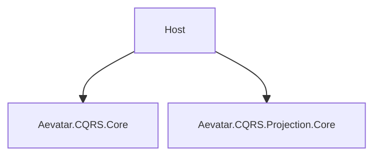
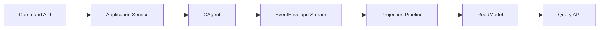

# Aevatar 完整项目架构文档（轻量能力装配版）

## 1. 目标与范围

本文档定义 Aevatar 的目标架构基线，覆盖：

1. 分层结构（Domain / Application / Infrastructure / Host）。
2. 能力模型（`Workflow`、`Maker` 均为 Capability）。
3. 轻量装配机制（引用能力项目 + `Add...` 注册）。
4. 默认装配策略（`Mainnet` 默认装配 `Workflow`）。
5. Maker 独立系统（引用 Maker 并 `Add...` 注册）。
6. 平台旧层清理（删除 `Aevatar.Platform.*`）。

## 2. 解决方案结构

## 3. 系统装配模型（轻量）

### 3.1 核心约束

1. `Mainnet` 默认通过项目引用 `Workflow` 能力并调用 `AddWorkflowCapability()`。
2. `Maker` 作为独立系统，通过项目引用 `Maker` 并调用 `AddMakerCapability()`。
3. 能力接入不引入运行时发现/注册中心/动态路由框架。
4. 能力开关优先使用配置 + DI 注册控制。
5. `Aevatar.Bootstrap` 仅保留通用装配，不承载 `Workflow` 具体能力注册。
6. 删除 `Aevatar.Platform.*`，不保留兼容壳层。

### 3.2 最小能力契约

1. 每个能力提供 Host 入口扩展（`WebApplicationBuilder` 扩展），一行接入能力。
2. 能力内部可保留 `IServiceCollection` 与 `IEndpointRouteBuilder` 细粒度扩展，供非 Host 场景复用。
3. 能力 API 契约（请求/响应模型 + endpoint 定义）归属能力项目，不在 Host 重复定义。
4. 能力通过 `Aevatar.Hosting` 的 `AddAevatarCapability(...)` 声明端点映射，默认由 `UseAevatarDefaultHost()` 统一挂载。
5. 能力之间通过现有事件与应用服务协作，不要求新增通用微服务基础设施。
6. `AddAevatarCapability(...)` 对同名能力注册幂等；若同名能力使用不同端点映射器则启动前失败（fail-fast）。
7. `MapAevatarCapabilities()` 对重复能力名映射执行冲突检查，禁止重复挂载。

### 3.3 能力 API 契约归属（当前实现）

1. Workflow 能力 API 输入契约定义在 `Aevatar.Workflow.Application.Abstractions`（如 `ChatInput`、`ChatWsCommand`）。
2. Maker 能力 API 输入契约定义在 `Aevatar.Maker.Application.Abstractions`（如 `MakerRunInput`）。
3. Infrastructure Endpoint 仅负责协议绑定与参数校验，不重复定义能力输入模型。

### 3.4 Maker 扩展 Workflow（语义约束）

1. `Maker` 定义为 `Workflow` 的扩展能力，允许直接项目引用与能力继承。
2. 允许：`src/maker/* -> src/workflow/*`（Maker 可直接继承 Workflow 能力实现）。
3. 禁止：`src/workflow/* -> src/maker/*`（禁止反向依赖）。
4. 禁止：`src/maker/* -> src/workflow/Aevatar.Workflow.Host.Api`（宿主入口不作为能力继承目标）。
5. 如未来需要独立发布，再抽 `Workflow.Contracts`，但当前不作为强制前置条件。

## 4. CQRS 接入（无独立 Runtime 命令总线层）

统一规则：

1. Host 仅通过 `AddAevatarDefaultHost(...)` + `UseAevatarDefaultHost()` 接入统一宿主能力。
2. 命令执行使用 Application 层 `ICommandExecutionService<...>` 直达 Actor，不再引入 `ICommandBus` 运行时抽象。
3. CQRS 框架层仅保留 `Core + Projection`。

## 4.1 Actor Runtime 统一接入

1. 默认 Host 通过 `Aevatar.Bootstrap` 统一调用 `AddAevatarActorRuntime(...)`。
2. Actor Runtime 提供者通过配置键 `ActorRuntime:Provider` 选择；当前代码默认 `InMemory`（开发/测试口径）。
3. Mainnet/Subsystem Host 可通过 `EnableActorRestoreOnStartup` 控制启动恢复行为。
4. `ActorRuntime:RestoreOnStartup` 可通过配置直接控制默认恢复开关。
5. 口径说明：`InMemory*` 实现仅用于开发/测试；生产环境必须切换到非 InMemory 持久化实现（Redis/数据库等）并在该实现上评估容量风险。

## 4.2 分布式 Runtime 目标态（必须）

1. 生产部署以分布式 Actor Runtime 为目标，要求同一 `actorId` 全局单激活（single activation）与邮箱串行语义。
2. Projection 编排 Actor 化：每个 `rootActorId` 固定映射一个投影协调 Actor（示例：`projection:{rootActorId}`）。
3. `EnsureActorProjection / ReleaseActorProjection` 由投影协调 Actor 串行裁决，不再依赖中间层进程内并发门禁。
4. `AttachLiveSink / DetachLiveSink` 通过显式 lease 句柄管理 run-event stream 订阅（`workflow-run:{actorId}:{commandId}`），不允许回退到 `actorId -> context` 反查模型。
5. 读侧持久化（`IProjectionReadModelStore`）在生产默认使用非 InMemory 实现；InMemory 仅保留本地开发与测试。
6. 不为投影并发单独引入外部锁中心；并发互斥优先由“确定性 actorId + Actor 邮箱”保证。

## 5. 命令与查询主链路

关键约束：

1. `Command -> Event`，`Query -> ReadModel`。
2. AGUI/SSE/WS 只从统一投影链路输出。
3. 不在 API 会话内拼装跨能力长链路流程。
4. 通用投影抽象按层拆分：`Foundation.Projection`（读模型基础）-> `AI.Projection`（通用事件 reducer/applier）-> 业务能力投影（如 `Workflow.Projection`）。

## 6. API 所有权（目标态）

| 路径 | 所有者 | 说明 |
|---|---|---|
| `/api/chat`, `/api/ws/chat` | Mainnet Host | Workflow 运行入口（SSE/WS） |
| `/api/agents`, `/api/workflows` | Mainnet Host | Workflow 查询入口 |
| `/api/actors/{actorId}`, `/api/actors/{actorId}/timeline` | Mainnet Host | Actor 执行快照与时间线查询 |
| `/api/maker/*` | Maker Host | Maker 能力入口 |

收敛要求：

1. 删除 `/api/routes/{subsystem}/*` 目录路由模型。
2. 不再保留 `Platform Host` API 所有权。

## 7. 依赖与命名规范

1. 项目名、命名空间、目录语义一致。
2. 缩写全大写：`LLM`、`CQRS`、`AGUI`。
3. 能力命名使用 `Capability` 语义，避免重复层次包装。
4. 删除 `Aevatar.Platform.*` 相关代码与引用。
5. `Application` 层不直接依赖能力 `Core` 实现层；以 `Workflow` 为例，`Aevatar.Workflow.Application` 通过 `IWorkflowRunActorPort` 访问 Actor 生命周期与绑定行为，由 `Aevatar.Workflow.Infrastructure` 适配 `WorkflowGAgent`。

## 8. CI 架构门禁

CI（`.github/workflows/ci.yml`）应执行：

1. `build + test`。
2. 禁止 `GetAwaiter().GetResult()`。
3. 禁止 `TypeUrl.Contains(...)` 字符串路由。
4. 专项执行事件类型到 reducer 路由映射静态门禁（`tools/ci/projection_route_mapping_guard.sh`）：`TypeUrl` 派生 + 精确键路由。
5. 禁止 `Aevatar.Workflow.Core` 依赖 `Aevatar.AI.Core`。
6. 禁止任何项目新增 `Aevatar.Platform.*` 引用。
7. 强制 Mainnet Host 与 Maker Host 使用统一默认宿主接入扩展（`AddAevatarDefaultHost` / `UseAevatarDefaultHost`）。
8. 禁止 Host/Infrastructure 直接 `AddCqrsCore(...)`。
9. 禁止 `docs/agents-working-space` 下工作文档被加入 `aevatar.slnx`。
10. 允许 Maker 对 Workflow 的直接继承与直连（扩展语义），并禁止 Workflow 反向依赖 Maker。
11. 允许 Maker 直接依赖 Workflow 能力实现层；仅禁止依赖 `Workflow.Host.Api`。

## 9. 演进路线

1. Mainnet：`AddAevatarDefaultHost()` 后引用 Workflow 并完成 `AddWorkflowCapability()` 装配。
2. Maker：`AddAevatarDefaultHost()` 后独立部署并完成 `AddMakerCapability()` 装配。
3. 删除 `src/Aevatar.Platform.*` 与旧平台路由目录。
4. 新能力统一按“新增项目引用 + 新增 Add 扩展 + Host 注册”接入。
5. Runtime 演进：从默认 InMemory（dev/test）过渡到分布式 Actor Runtime + 非 InMemory 持久化（prod）。
6. Projection 演进：已落地“每个 root actor 一个投影协调 Actor”用于 `Ensure/Release` 裁决；后续补齐多节点实时输出一致性策略与持久化读模型默认实现。

## 10. 审计评分口径

1. 架构评分默认按“当前实现”计分，不按规划预支分数。
2. 目标态评分提升条件：分布式 Runtime、非 InMemory 持久化、多节点一致性测试门禁全部落地。
3. 评分文档：`docs/audit-scorecard/architecture-scorecard-2026-02-20.md`。
