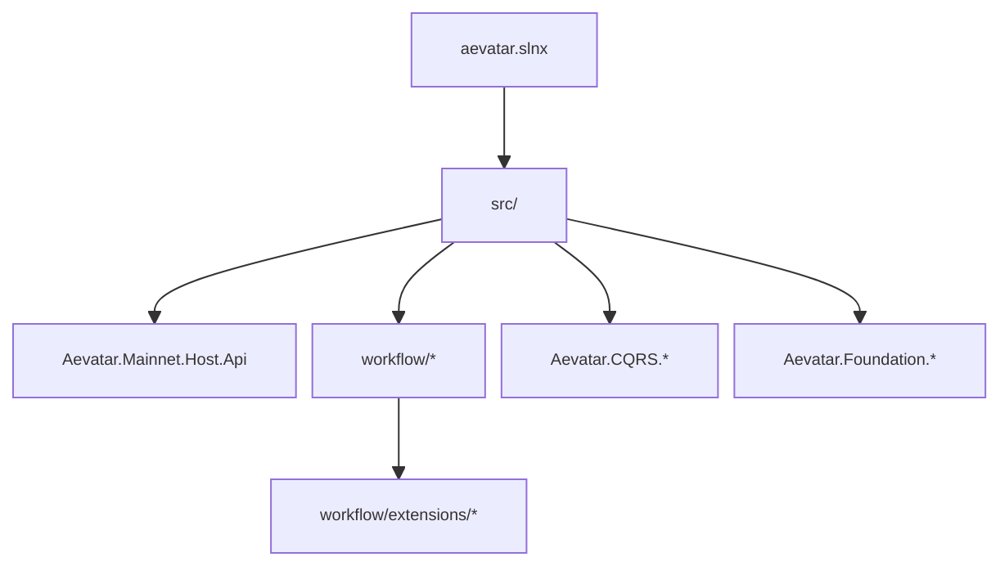
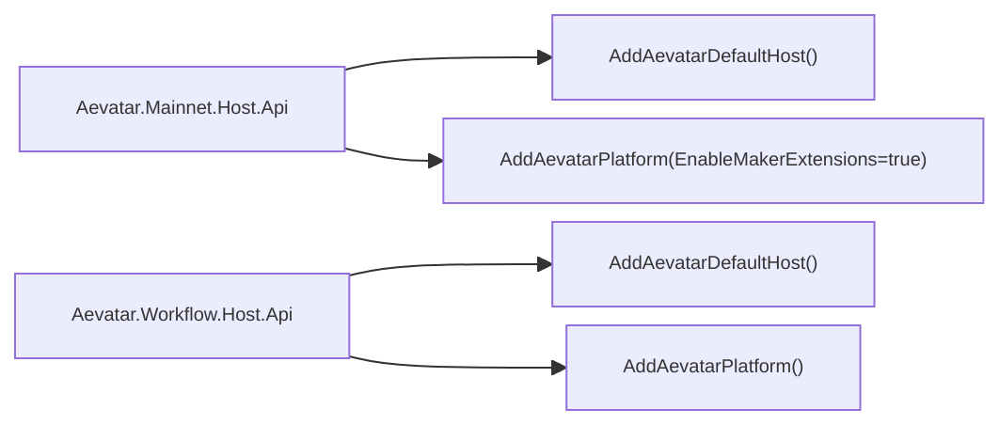

# Aevatar 项目架构（Maker 插件化基线）

## 1. 目标与范围

本文档定义当前生效的架构基线：

1. 严格分层：`Domain / Application / Infrastructure / Host`。
2. 统一能力入口：`Mainnet` 为默认生产入口。
3. Maker 定位：`Workflow` 插件扩展，不是独立能力系统。
4. 统一读写链路：`Application Command -> Actor Message(EventEnvelope) -> Domain Event -> Projection -> ReadModel`。

## 2. 解决方案结构

## 3. 宿主与能力装配

约束：

1. Mainnet 必须注册 `AddAevatarPlatform(options => { options.EnableMakerExtensions = true; })`。
2. Workflow Host 作为能力隔离入口，可不加载 Maker 插件。
3. 不再保留 Maker 独立 Host 与 `/api/maker/*` API。

## 4. Maker 插件边界

Maker 插件工程：`src/workflow/extensions/Aevatar.Workflow.Extensions.Maker`

职责：

1. 提供 `maker_recursive`、`maker_vote` 模块实现。
2. 提供 `AddWorkflowMakerExtensions()` 作为 Maker 模块注册入口，并由平台入口在启用 Maker 时统一调用。
3. 通过 `IWorkflowModulePack` 贡献模块定义，与内建模块走同一注册体系。

依赖约束：

1. 允许：插件依赖 `Workflow.Core`/`Workflow.Abstractions` 与 Foundation 抽象。
2. 禁止：`Workflow` 主能力反向依赖插件实现。
3. 禁止：插件引入独立 CQRS/Projection 管线。

## 5. 分层职责

1. Domain：模块语义与状态转换（step/module）。
2. Application：命令执行编排与查询服务。
3. Infrastructure：IO 适配、持久化、投影存储、host 扩展。
4. Host：协议适配、能力组合、运行参数配置。

禁止项：

1. Host/API 编排业务流程。
2. 中间层维护进程内事实态字典（actor/run/session 映射）。
3. 命令路径直接依赖 ReadModel 存储。

## 6. CQRS 与 Projection

统一链路：

1. `Command` 先进入 Application，再被包装为 `EventEnvelope` 投递到目标 Actor。
2. Actor 在串行邮箱里做决策，并显式持久化领域事件。
3. `Projection` 统一消费 Actor envelope 流并更新 `ReadModel`。
4. API 推送（SSE/WS/AGUI）共享同一投影输入链路。

补充口径：

1. `EventEnvelope` 是 runtime message envelope，不等于 Event Sourcing 的 `StateEvent`。
2. `IActorRuntime` 是构建在 stream 之上的 Actor 语义层，不是与 stream 并列的第二条业务主链路。

运行口径：

1. 当前 `InMemory/Local` 不扣分（开发/测试基线）。
2. 生产目标是分布式 Actor Runtime + 非 InMemory 持久化。

## 7. 架构门禁（必须通过）

1. `bash tools/ci/architecture_guards.sh`
2. `dotnet build aevatar.slnx --nologo`
3. `dotnet test aevatar.slnx --nologo`
4. `bash tools/ci/slow_test_guards.sh`

关键守卫语义：

1. 禁止 `Workflow -> Maker` 反向依赖。
2. 禁止残留独立 Maker 工程（Application/Infrastructure/Host/Core）。
3. 禁止 `AddMakerCapability()` 与 `/api/maker/*` 端点回流。
4. 强制 Mainnet 通过 `AddAevatarPlatform(...EnableMakerExtensions=true...)` 装配 Maker 插件。
5. 默认 `dotnet test aevatar.slnx --nologo` 为快速主链路；分钟级脚本自治演化回归由 `slow_test_guards.sh` 单独承接。
