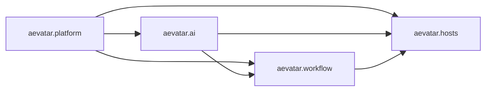

# Aevatar 项目拆分策略（2026-02-21）

## 1. 目标

1. 按能力域拆分构建与发布边界，降低跨域耦合。
2. 保持当前架构原则：分层、统一 CQRS/Projection、插件化扩展。
3. 为后续物理拆仓（multi-repo）提供可执行迁移路径。

## 2. 已落地的逻辑拆分（本次完成）

当前已在单仓内完成可执行分片：

| 分片 | 文件 | 范围 |
|---|---|---|
| Foundation | `aevatar.foundation.slnf` | `Foundation.*` + Foundation 单测 |
| AI | `aevatar.ai.slnf` | `AI.*` |
| CQRS | `aevatar.cqrs.slnf` | `CQRS.*` + `Foundation.Projection` + CQRS 单测 |
| Workflow | `aevatar.workflow.slnf` | `workflow/*` + `workflow/extensions/*` + Workflow 单测 |
| Hosting | `aevatar.hosting.slnf` | `Configuration/Hosting/Bootstrap/Host Api/Tools` |

可复现验证：

1. `bash tools/ci/solution_split_guards.sh`
2. `bash tools/ci/solution_split_test_guards.sh`
3. `bash tools/ci/slow_test_guards.sh`
4. 逐个构建上述 5 个 `.slnf`（全部通过）

## 3. 目标物理拆仓模型（推荐）

建议仓库边界：

1. `aevatar.platform`
   `Aevatar.Foundation.*`, `Aevatar.CQRS.*`, `Aevatar.Hosting`, `Aevatar.Foundation.Runtime.Hosting`, `Aevatar.Configuration`
2. `aevatar.ai`
   `Aevatar.AI.*`（含 provider/tool/projection）
3. `aevatar.workflow`
   `src/workflow/*` + `src/workflow/extensions/*`
4. `aevatar.hosts`
   `Aevatar.Bootstrap`, `Aevatar.Mainnet.Host.Api`, `Aevatar.Workflow.Host.Api`, `tools/*`, `demos/*`

## 4. 迁移阶段（无兼容负担）

### Phase 0（已完成）

1. 逻辑分片：新增/修复 `.slnf`，支持分域独立构建。
2. 增加分片守卫脚本：`tools/ci/solution_split_guards.sh`。
3. 增加分片测试守卫脚本：`tools/ci/solution_split_test_guards.sh`（Foundation/CQRS/Workflow）。
4. 将分钟级脚本自治演化 E2E 拆到独立项目 `test/Aevatar.Integration.Slow.Tests`，并新增 `tools/ci/slow_test_guards.sh`。

### Phase 1（P1）

1. 拆 `Aevatar.Bootstrap` 的 provider/tool 直接依赖（改为扩展装配包）。
2. 保留 `Bootstrap` 作为纯宿主编排层，不直接引用具体 `LLM/MCP/Skills` 实现包。

退出标准：

1. `Aevatar.Bootstrap.csproj` 不再直接引用具体 AI provider/tool 工程。
2. Mainnet/Workflow Host 通过显式扩展包装配 provider/tool。

### Phase 2（P1）

1. 解耦 `Workflow.Projection -> AI.Projection` 的硬引用（改为可选扩展注入）。
2. `Workflow` 仅依赖 `Projection` 抽象与自身 read model 约束。

退出标准：

1. `Aevatar.Workflow.Projection.csproj` 无 `Aevatar.AI.Projection` 直接引用。
2. AI 投影增强可按扩展模块方式接入。

### Phase 3（P2）

1. 逐步将跨仓依赖从 `ProjectReference` 切换为版本化 `PackageReference`。
2. 建立发布顺序：`platform -> ai/workflow -> hosts`。

退出标准：

1. 每个仓库可在无源码级 `ProjectReference` 前提下独立 build/test。
2. 发布管线支持按仓增量发布。

### Phase 4（P2）

1. 真正拆仓（Git 级分离），保留一个顶层集成仓用于 e2e。
2. 集成仓仅承载 host 组合测试与回归。

## 5. 拆分后必须保留的治理规则

1. `Workflow` 不反向依赖 `Extensions` 具体实现。
2. `Host` 不承载业务编排，能力组合只经 Infrastructure/Application 暴露。
3. CQRS/Projection 仍为单一主链路，禁止并行第二套读侧实现。
4. 中间层不维护进程内事实态映射（`actor/run/session -> context`）。
5. 默认全量回归保持快速可用；分钟级慢测必须走独立慢测入口，不回流到默认 `aevatar.slnx` 主链路。
