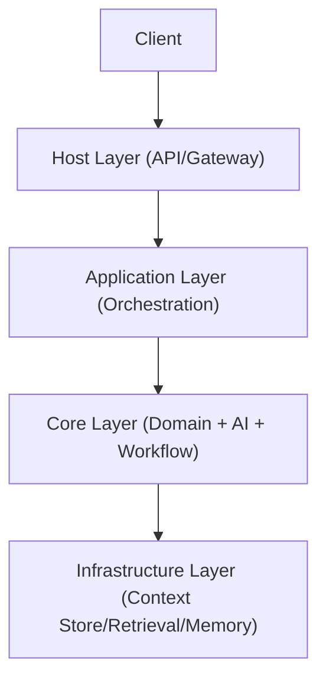
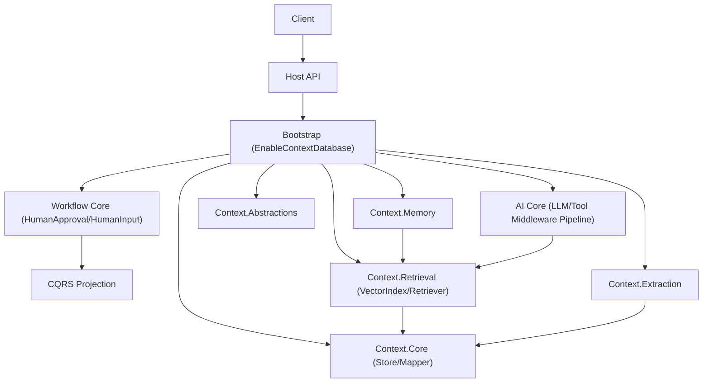
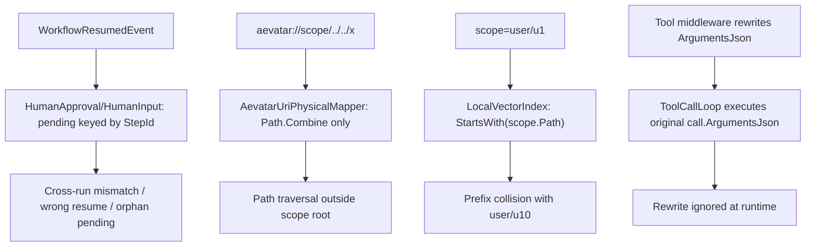

# PR REVIEW 审计文档（严格架构与编码规范）

审计时间：2026-02-18  
审计分支：`feature/context-database`  
审计基线：`c2daa32..HEAD`（`124` 个文件变更）  
审计结论：**BLOCK（阻断合并）**

## 一页结论

本次 PR 的主要问题不是“功能缺失”，而是“架构边界与运行时正确性”。  
阻断项集中在四类：并发隔离、路径安全、作用域隔离、middleware 生效路径。

## 审计标准（严格）

1. 分层边界：`Abstractions -> Core -> Application -> Host`，不得反向依赖。  
2. 依赖反转：运行时行为必须落在抽象契约之上。  
3. 安全隔离：路径映射不可越界；scope 不可串租户。  
4. 并发正确性：同一 workflow 多 run 不得串线。  
5. 工程可用性：`slnf` 必须可 restore/build。

## 目标架构（应然）



## 当前架构（实然，按本 PR）



## 架构偏差矩阵（为什么看起来“乱”）

| 规范点 | 当前偏差 | 影响 | 严重级别 |
|---|---|---|---|
| 并发隔离 | HITL pending 仅按 `StepId` 匹配 | 多 run 串线/误恢复 | P1 |
| 路径安全 | URI 映射未限制 scope 根目录 | 路径穿越 | P1 |
| scope 隔离 | `StartsWith(scope.Path)` 前缀匹配 | `u1` 污染 `u10` | P1 |
| 依赖反转落地 | middleware 改写参数未进入执行 | 策略失效/输入未净化 | P2 |
| 工程可用性 | `aevatar.foundation.slnf` 项目路径错误 | scoped build 失效 | P2 |

## 风险路径图（阻断项）



## 阻断问题清单（证据）

### P1-01：HITL pending 仅按 `StepId`，跨 run 串线

- 证据：`src/workflow/Aevatar.Workflow.Core/Modules/HumanApprovalModule.cs:20`、`src/workflow/Aevatar.Workflow.Core/Modules/HumanApprovalModule.cs:48`、`src/workflow/Aevatar.Workflow.Core/Modules/HumanApprovalModule.cs:69`  
- 同类：`src/workflow/Aevatar.Workflow.Core/Modules/HumanInputModule.cs:20`、`src/workflow/Aevatar.Workflow.Core/Modules/HumanInputModule.cs:49`、`src/workflow/Aevatar.Workflow.Core/Modules/HumanInputModule.cs:73`  
- 要求：pending key 改为 `(RunId, StepId)` 并在挂起/恢复两侧一致匹配。

### P1-02：URI 映射未限制 scope 根目录

- 证据：`src/Aevatar.Context.Core/AevatarUriPhysicalMapper.cs:21`  
- 要求：`GetFullPath` 后校验目标路径必须位于 `basePath`（含目录边界）内。

### P1-03：scope 过滤前缀碰撞

- 证据：`src/Aevatar.Context.Retrieval/LocalVectorIndex.cs:50`  
- 要求：改为 `path == scopePath || path.StartsWith(scopePath + "/")`。

### P2-01：Tool middleware 参数改写未用于执行

- 证据：`src/Aevatar.AI.Core/Tools/ToolCallLoop.cs:103`、`src/Aevatar.AI.Core/Tools/ToolCallLoop.cs:109`  
- 要求：执行工具时读取 `toolCallContext.ArgumentsJson` 最终值。

### P2-02：Foundation solution filter 路径错误

- 证据：`aevatar.foundation.slnf:8`  
- 要求：修正为 `test\\Aevatar.Foundation.Abstractions.Tests\\Aevatar.Foundation.Abstractions.Tests.csproj`。

## 验收门禁（修复后必须全部通过）

```bash
dotnet restore aevatar.foundation.slnf --nologo
dotnet build aevatar.foundation.slnf --nologo
dotnet build aevatar.slnx --nologo
dotnet test aevatar.slnx --nologo
```

新增测试最小集合：

1. 同 `stepId` 多 `run` 并发恢复（approval/input 各一）。  
2. URI 路径穿越拒绝（读/写/删）。  
3. scope 边界隔离（`u1` vs `u10`）。  
4. tool middleware 参数改写生效。

## 最终判定

- 当前状态：**BLOCK**  
- 放行条件：P1 全关闭且新增测试落地；P2 在本 PR 关闭或给明确版本承诺并挂 CI。

